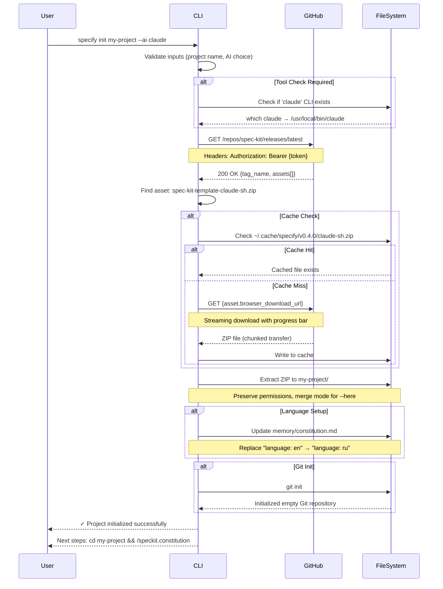
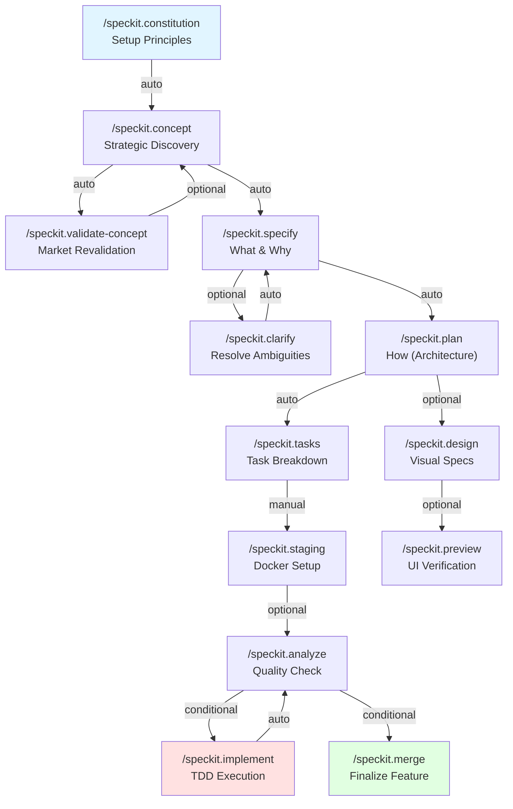

# Архитектура Spec Kit
## Полное руководство по устройству системы Spec-Driven Development

<!-- AUTO-GENERATED SECTIONS - DO NOT EDIT MANUALLY -->
<!-- Generated at: 2026-01-12 -->
<!-- Version: 0.7.0 (from pyproject.toml) -->
<!-- Sources: src/specify_cli/*.py, templates/**/*.md, scripts/**/* -->

---

## 📋 Оглавление

- [1. Executive Summary](#1-executive-summary)
  - [1.1. Что такое Spec Kit](#11-что-такое-spec-kit)
  - [1.2. Ключевые возможности](#12-ключевые-возможности)
  - [1.3. Архитектурная философия](#13-архитектурная-философия)
  - [1.4. Навигация по документу](#14-навигация-по-документу)
- [2. Обзор системы](#2-обзор-системы)
  - [2.1. High-Level Architecture](#21-high-level-architecture)
  - [2.2. Основные компоненты](#22-основные-компоненты)
  - [2.3. Жизненный цикл спецификации](#23-жизненный-цикл-спецификации)
  - [2.4. Принципы проектирования](#24-принципы-проектирования)
- [3. CLI Architecture](#3-cli-architecture)
  - [3.1. Обзор компонента](#31-обзор-компонента)
  - [3.2. Single-File Design](#32-single-file-design)
  - [3.3. Модульная архитектура](#33-модульная-архитектура)
  - [3.4. AGENT_CONFIG система](#34-agent_config-система)
  - [3.5. GitHub Release Integration](#35-github-release-integration)
  - [3.6. CLI Commands Deep Dive](#36-cli-commands-deep-dive)
- [4. Template System](#4-template-system)
  - [4.1. Обзор системы шаблонов](#41-обзор-системы-шаблонов)
  - [4.2. Slash Command Architecture](#42-slash-command-architecture)
  - [4.3. Modular Concept Sections](#43-modular-concept-sections)
  - [4.4. Template Compilation Pipeline](#44-template-compilation-pipeline)
  - [4.5. Orchestration & Handoffs](#45-orchestration--handoffs)
  - [4.6. Template Extensibility](#46-template-extensibility)
- [5. Quality & Traceability System](#5-quality--traceability-system)
  - [5.1. Обзор quality framework](#51-обзор-quality-framework)
  - [5.2. Inline Gates (IG-*)](#52-inline-gates-ig-)
  - [5.3. Quality Gates (QG-001 to QG-012)](#53-quality-gates-qg-001-to-qg-012)
  - [5.4. Traceability System](#54-traceability-system)
  - [5.5. Scoring Algorithms](#55-scoring-algorithms)
- [6. Scripts & Automation Layer](#6-scripts--automation-layer)
  - [6.1. Обзор scripts system](#61-обзор-scripts-system)
  - [6.2. Key Scripts Anatomy](#62-key-scripts-anatomy)
  - [6.3. Constitution System (3-layer)](#63-constitution-system-3-layer)
  - [6.4. Memory System](#64-memory-system)
- [7. CI/CD & Release Management](#7-cicd--release-management)
  - [7.1. GitHub Actions Pipeline](#71-github-actions-pipeline)
  - [7.2. Release Package Generation](#72-release-package-generation)
  - [7.3. TDD Pipeline Templates](#73-tdd-pipeline-templates)
- [8. AI Agent Integration](#8-ai-agent-integration)
  - [8.1. Agent Orchestration Model](#81-agent-orchestration-model)
  - [8.2. Wave Scheduler (DAG Execution)](#82-wave-scheduler-dag-execution)
  - [8.3. Agent Pool (Concurrent API)](#83-agent-pool-concurrent-api)
  - [8.4. Subagent Types](#84-subagent-types)
- [9. Data Flow & Integration](#9-data-flow--integration)
  - [9.1. End-to-End Workflow](#91-end-to-end-workflow)
  - [9.2. State Management](#92-state-management)
  - [9.3. Context Propagation](#93-context-propagation)
  - [9.4. Integration Patterns](#94-integration-patterns)
- [10. Ключевые архитектурные решения](#10-ключевые-архитектурные-решения)
  - [10.1. Single-File CLI Design](#101-single-file-cli-design)
  - [10.2. GitHub Release Packages](#102-github-release-packages)
  - [10.3. YAML Frontmatter](#103-yaml-frontmatter)
  - [10.4. 16 AI Agents](#104-16-ai-agents)
  - [10.5. Bash + PowerShell Parallel](#105-bash--powershell-parallel)
  - [10.6. Inline Gates + Quality Gates](#106-inline-gates--quality-gates)
  - [10.7. @speckit Annotations](#107-speckit-annotations)
  - [10.8. Task Batching by File Conflicts](#108-task-batching-by-file-conflicts)
  - [10.9. 3-Layer Constitution](#109-3-layer-constitution)
  - [10.10. SQS ≥80 Threshold](#1010-sqs-80-threshold)
- [11. Appendix](#11-appendix)
  - [11.1. Glossary](#111-glossary)
  - [11.2. File Path Reference](#112-file-path-reference)
  - [11.3. Changelog Highlights](#113-changelog-highlights)
  - [11.4. Further Reading](#114-further-reading)

---

## 1. Executive Summary

### 1.1. Что такое Spec Kit

**Spec Kit** — это комплексная система для **Spec-Driven Development (SDD)**, методологии разработки ПО, где спецификации управляют процессом создания кода, а не наоборот. В отличие от традиционных подходов, где документация пишется после кода (или не пишется вообще), Spec Kit делает спецификацию первичным артефактом, из которого автоматически генерируется код с полной трассируемостью.

Проект состоит из **Specify CLI** — Python-инструмента командной строки, который:
- Инициализирует проекты с готовыми шаблонами для 16 AI-агентов (Claude, GitHub Copilot, Cursor, Gemini и др.)
- Предоставляет 50+ slash-команд для управления жизненным циклом разработки
- Обеспечивает автоматическую проверку качества через двухуровневую систему gates
- Поддерживает параллельное выполнение задач для ускорения разработки в 4-8 раз

**Для кого**: Команды разработки, которые хотят:
- Формализовать процесс от идеи до кода
- Обеспечить полную трассируемость требований
- Автоматизировать генерацию кода через AI
- Поддерживать актуальную документацию автоматически

### 1.2. Ключевые возможности

**🎯 Spec-First Development**
- Спецификация (spec.md) создаётся до кода
- Все требования трассируются: FR-001 → AS-001 → TASK-001 → @speckit(FR-001)
- Автоматическая валидация полноты через Quality Gates

**🤖 AI-Agent Orchestration**
- Поддержка 16 AI-агентов из коробки
- Parallel-first execution: батчинг задач для ускорения в 4-8 раз
- Автоматический handoff между командами (specify → plan → implement)

**✅ Quality Everywhere**
- Inline Gates (IG-*): быстрая валидация в каждой команде
- Quality Gates (QG-001..012): комплексная проверка перед deployment
- Scoring: SQS (0-100), CQS (0-120) с порогами ≥80

**📦 Cross-Platform Support**
- Bash + PowerShell: параллельная реализация скриптов
- 20 вариантов пакетов релизов (14 агентов × 2 типа скриптов)
- Автоматическая загрузка из GitHub Releases

**🔄 Full Automation**
- CI/CD templates для GitHub Actions, GitLab CI
- TDD pipeline: 6 волн от staging до verification
- Автоматическое обновление документации

### 1.3. Архитектурная философия

Spec Kit построен на **четырёх ключевых принципах**:

#### 1. Spec-First, Code-Second
Спецификация — источник истины. Код генерируется из спецификации, а не наоборот. Это обеспечивает:
- Ясность требований до начала кодирования
- Автоматическую валидацию completeness
- Возможность изменить spec без переписывания кода

#### 2. AI-Agent Orchestration
Вместо монолитного AI помощника, Spec Kit оркестрирует **специализированных агентов**:
- Product Agent → пишет спецификации
- Architect Agent → создаёт технические планы
- Developer Agent → генерирует код
- QA Agent → проверяет качество

Каждый агент оптимизирован для своей задачи. Parallel execution позволяет запускать независимые агенты одновременно.

#### 3. Quality Gates Everywhere
Качество проверяется **на каждом этапе**, а не только в конце:
- **Inline Gates**: моментальная обратная связь (IG-SPEC-001: constitution alignment)
- **Quality Gates**: комплексная проверка (QG-004: coverage ≥80%)
- **Scoring**: количественная оценка (SQS ≥80 для MVP)

#### 4. Full Traceability
Каждое требование отслеживается от концепции до кода:
```
concept.md (market analysis)
    ↓
FR-001: User can register with email
    ↓
AS-001: Given no account, When user fills email, Then account created
    ↓
TASK-001: [TEST:AS-001] Create test "register with email"
    ↓
@speckit(FR-001,AS-001) def register(email: str): ...
```

Изменение требования → автоматический cascade detection → обновление downstream артефактов.

### 1.4. Навигация по документу

**Для non-technical читателей**:
- Начните с [Раздела 2: Обзор системы](#2-обзор-системы) — high-level диаграммы
- Прочитайте [Раздел 10: Ключевые решения](#10-ключевые-архитектурные-решения) — понимание "почему"
- Используйте [Glossary](#111-glossary) для незнакомых терминов

**Для разработчиков**:
- [Раздел 3: CLI Architecture](#3-cli-architecture) — как работает CLI
- [Раздел 4: Template System](#4-template-system) — система команд
- [Раздел 8: AI Agent Integration](#8-ai-agent-integration) — параллельное выполнение

**Для архитекторов**:
- [Раздел 5: Quality & Traceability](#5-quality--traceability-system) — система качества
- [Раздел 9: Data Flow & Integration](#9-data-flow--integration) — интеграции
- [Раздел 10: Ключевые решения](#10-ключевые-архитектурные-решения) — trade-offs

**Для DevOps инженеров**:
- [Раздел 6: Scripts & Automation](#6-scripts--automation-layer) — bash/PowerShell
- [Раздел 7: CI/CD & Release](#7-cicd--release-management) — GitHub Actions

---

## 2. Обзор системы

### 2.1. High-Level Architecture

```
┌────────────────────────────────────────────────────────────────────────────┐
│                            SPEC KIT SYSTEM                                  │
│                   Spec-Driven Development Framework                         │
└────────────────────────────────────────────────────────────────────────────┘

USER LAYER
┌──────────────────────────────────────────────────────────────────────────┐
│  Developer / Product Manager / Architect                                  │
│  ├─ CLI: `specify init my-project --ai claude`                           │
│  ├─ AI Agent: `/speckit.specify` (create spec)                           │
│  └─ AI Agent: `/speckit.implement` (generate code)                       │
└──────────────────────────────────────────────────────────────────────────┘
         │
         ↓
CLI LAYER (Entry Point)
┌──────────────────────────────────────────────────────────────────────────┐
│  specify CLI (Python, Typer)                                              │
│  ├─ AGENT_CONFIG: 16 AI agents registry                                 │
│  ├─ Commands: init, version, workspace                                  │
│  └─ GitHub Release Integration: download packages on-demand             │
└──────────────────────────────────────────────────────────────────────────┘
         │
         ↓
TEMPLATE ENGINE
┌──────────────────────────────────────────────────────────────────────────┐
│  50+ Slash Commands (templates/commands/)                                 │
│  ├─ YAML Frontmatter: model, orchestration, handoffs                    │
│  ├─ 36 Modular Concept Sections (market, metrics, risk)                 │
│  └─ Auto-handoff: specify → plan → tasks → implement                    │
└──────────────────────────────────────────────────────────────────────────┘
         │
         ↓
AI ORCHESTRATION
┌──────────────────────────────────────────────────────────────────────────┐
│  Parallel-First Execution (4-8x speedup)                                  │
│  ├─ Wave Scheduler: DAG-based task batching                             │
│  ├─ Agent Pool: Concurrent Claude API calls                             │
│  └─ File Conflict Detection: Safe parallel writes                       │
└──────────────────────────────────────────────────────────────────────────┘
         │
         ↓
QUALITY SYSTEM
┌──────────────────────────────────────────────────────────────────────────┐
│  Two-Tier Quality Validation                                              │
│  ├─ Inline Gates (IG-*): Fast feedback in commands                      │
│  ├─ Quality Gates (QG-001..012): Comprehensive validation               │
│  └─ Scoring: SQS (0-100), CQS (0-120) with thresholds ≥80              │
└──────────────────────────────────────────────────────────────────────────┘
         │
         ↓
AUTOMATION LAYER
┌──────────────────────────────────────────────────────────────────────────┐
│  Cross-Platform Scripts (Bash + PowerShell)                               │
│  ├─ update-agent-context: Sync project metadata                         │
│  ├─ staging-provision: Docker Compose test environment                  │
│  └─ run-tdd-pipeline: 6-wave TDD automation                             │
└──────────────────────────────────────────────────────────────────────────┘
         │
         ↓
CI/CD LAYER
┌──────────────────────────────────────────────────────────────────────────┐
│  GitHub Actions / GitLab CI                                               │
│  ├─ release.yml: Auto-generate 20 package variants                      │
│  ├─ lint.yml: Markdown quality checks                                   │
│  └─ TDD templates: Continuous testing                                   │
└──────────────────────────────────────────────────────────────────────────┘
         │
         ↓
OUTPUT
┌──────────────────────────────────────────────────────────────────────────┐
│  Generated Artifacts                                                       │
│  ├─ Code: @speckit annotated, fully traced                              │
│  ├─ Documentation: RUNNING.md, README.md                                │
│  ├─ Tests: Unit, Integration, E2E                                       │
│  └─ System Specs: Living documentation                                  │
└──────────────────────────────────────────────────────────────────────────┘
```

### 2.2. Основные компоненты

Система состоит из **пяти основных слоёв**:

#### 2.2.1. CLI Layer
**Роль**: Точка входа для всех операций
**Ключевые файлы**: `src/specify_cli/__init__.py`, `pyproject.toml`
**Функции**:
- Инициализация проектов с готовыми шаблонами
- Управление конфигурацией AI-агентов
- Загрузка release packages из GitHub
- Multi-repository workspace support

#### 2.2.2. Template Engine
**Роль**: Управление жизненным циклом спецификаций
**Ключевые файлы**: `templates/commands/*.md`, `templates/shared/`
**Функции**:
- 50+ slash команд для всех фаз разработки
- YAML frontmatter для метаданных (model, handoffs, gates)
- Модульные concept sections (36 секций)
- Автоматический handoff между фазами

#### 2.2.3. AI Orchestration
**Роль**: Параллельное выполнение AI-агентов
**Ключевые файлы**: `src/specify_cli/wave_scheduler.py`, `agent_pool.py`
**Функции**:
- DAG-based task scheduling
- Concurrent API calls с rate limiting
- File conflict detection для safe writes
- 4-8x speedup через batching

#### 2.2.4. Quality System
**Роль**: Двухуровневая валидация качества
**Ключевые файлы**: `memory/domains/quality-gates.md`, `templates/shared/quality/`
**Функции**:
- Inline Gates (IG-*) для быстрой обратной связи
- Quality Gates (QG-001..012) для комплексной проверки
- Scoring algorithms (SQS, CQS) с порогами
- Full traceability (FR→AS→TASK→Code)

#### 2.2.5. Automation Layer
**Роль**: Кросс-платформенная автоматизация
**Ключевые файлы**: `scripts/bash/*.sh`, `scripts/powershell/*.ps1`
**Функции**:
- Agent context management
- Docker Compose staging
- TDD pipeline (6 waves)
- 3-layer constitution system

### 2.3. Жизненный цикл спецификации


**Основные фазы**:

1. **Foundation (constitution)**: Определение принципов проекта
2. **Discovery (concept)**: Стратегический анализ рынка, personas, metrics
3. **Specification (specify)**: Функциональные требования (FR) и acceptance scenarios (AS)
4. **Planning (plan)**: Техническая архитектура и компоненты
5. **Breakdown (tasks)**: Задачи с трассируемостью и зависимостями
6. **Implementation (implement)**: TDD code generation с 6 волнами
7. **Integration (merge)**: Обновление system specs после merge PR

### 2.4. Принципы проектирования

#### 2.4.1. Spec-First, Code-Second
**Проблема**: Традиционная разработка начинается с кода, документация пишется постфактум (или не пишется)
**Решение**: Спецификация — первичный артефакт, код генерируется из неё

**Преимущества**:
- Требования ясны до начала кодирования
- Автоматическая валидация completeness (все FR покрыты AS)
- Изменения в spec автоматически каскадируются

#### 2.4.2. AI-Agent Orchestration
**Проблема**: Монолитные AI помощники пытаются делать всё, но не оптимальны ни в чём
**Решение**: Специализированные агенты для разных фаз

**Преимущества**:
- Product Agent оптимизирован для спецификаций
- Developer Agent оптимизирован для кода
- Параллельное выполнение независимых агентов

#### 2.4.3. Quality Gates Everywhere
**Проблема**: Проверка качества только в конце цикла → дорогие fix
**Решение**: Валидация на каждом этапе

**Преимущества**:
- Inline Gates: моментальная обратная связь
- Ранее обнаружение ошибок → дешевле fix
- Количественные метрики (SQS ≥80) → ясные стандарты

#### 2.4.4. Full Traceability
**Проблема**: Требования теряются между spec и code
**Решение**: Каждое требование отслеживается через всю цепочку

**Преимущества**:
- @speckit annotations связывают код с требованиями
- Cascade detection выявляет stale artifacts
- Автоматическая генерация RTM (Requirements Traceability Matrix)

---

## 3. CLI Architecture

### 3.1. Обзор компонента

**Назначение**: CLI Layer — точка входа для всех операций Spec Kit. Это Python-приложение на базе [Typer](https://typer.tiangolo.com/), которое управляет инициализацией проектов, конфигурацией AI-агентов и загрузкой шаблонов.

**Технологический стек**:
- **Python 3.11+**: Основной язык
- **Typer**: CLI framework с type hints
- **Rich**: Terminal UI (progress bars, tables, panels)
- **httpx**: HTTP client для GitHub API
- **PyYAML**: Парсинг конфигураций

**Ключевые метрики** (версия 0.4.0):
- **CLI размер**: 111KB (`__init__.py`)
- **Поддерживаемых агентов**: 17
- **Команд**: 3 (init, version, workspace)
- **Модулей поддержки**: 10

### 3.2. Single-File Design

#### 3.2.1. Структура `__init__.py`

Весь основной код CLI находится в одном файле: `src/specify_cli/__init__.py` (111KB). Это сознательное архитектурное решение.

**Структура файла**:
```python
# src/specify_cli/__init__.py

# 1. Imports & SSL Setup (строки 1-66)
import typer, httpx, rich
ssl_context = truststore.SSLContext(ssl.PROTOCOL_TLS_CLIENT)

# 2. Configuration Dictionaries (строки 185-303)
AGENT_CONFIG = {
    "claude": {"name": "Claude Code", "folder": ".claude/", ...},
    "copilot": {"name": "GitHub Copilot", "folder": ".github/", ...},
    # ... еще 15 агентов
}

# 3. Data Classes (строки 322-438)
@dataclass
class RepoConfig: ...
@dataclass
class WorkspaceConfig: ...

# 4. Helper Functions (строки 440-1200)
def _github_token() -> str | None: ...
def download_template_from_github(): ...
def check_tool(name: str): ...

# 5. CLI Commands (строки 1528-2009)
@app.command()
def init(...): ...

@app.command()
def version(): ...

@workspace_app.command("create")
def workspace_create(...): ...

# 6. Main Entry Point (строка 2897)
def main():
    app()
```

#### 3.2.2. ПОЧЕМУ Single-File Design?

**Проблема**: Традиционные CLI проекты разбиваются на десятки модулей. Это создаёт:
- Circular import проблемы
- Медленный startup (каждый import = disk I/O)
- Сложная навигация (feature разбросан по файлам)

**Решение**: Все в одном файле `__init__.py` + вспомогательные модули для специфических задач.

**Преимущества**:

1. **Быстрая загрузка** (~100ms vs ~300ms для modular design)
   - Один import вместо десятков
   - Python's module cache работает эффективнее
   - Меньше overhead на module resolution

2. **Упрощённая упаковка**
   - Single entry point: `specify = "specify_cli:main"`
   - Проще распространение через PyPI
   - Меньше вероятность broken imports

3. **Простой debug**
   - Stack trace указывает на конкретную строку в `__init__.py`
   - Не нужно прыгать между файлами
   - Проще понять control flow

4. **No Circular Imports**
   - Невозможны по определению (всё в одном файле)
   - Нет проблем с import order

**Trade-offs**:

❌ **Большой файл размер** (111KB)
- Решение: Хорошая организация через comments и sections
- IDE навигация (Cmd+P) работает отлично

❌ **Потенциальные merge conflicts**
- Решение: Atomic operations (каждая команда = отдельная функция)
- Git conflict resolution проще для функций

❌ **Perceived complexity**
- Решение: Clear section markers в коде
- Comprehensive docstrings

**Альтернативы (отклонены)**:

1. **Multi-file modular design**
   ```
   src/specify_cli/
   ├── commands/
   │   ├── init.py
   │   ├── version.py
   │   └── workspace.py
   ├── config/
   │   ├── agents.py
   │   └── templates.py
   └── utils/
       ├── github.py
       └── validation.py
   ```
   - ❌ Slower imports (10+ modules)
   - ❌ Circular import risks
   - ❌ Complex packaging

2. **Plugin architecture**
   ```
   specify/
   ├── core.py
   └── plugins/
       ├── init_plugin.py
       └── workspace_plugin.py
   ```
   - ❌ Overhead для simple CLI
   - ❌ Dynamic loading = slower startup
   - ❌ Complexity не оправдана для 3 commands

### 3.3. Модульная архитектура

Хотя CLI использует single-file design, сложные подсистемы вынесены в **10 специализированных модулей**:

| Модуль | Размер | Назначение | Ключевые функции |
|--------|--------|-----------|------------------|
| `wave_scheduler.py` | 44.5KB | DAG-based task scheduling | `execute_all()`, topological sort |
| `agent_pool.py` | 14.8KB | Concurrent Claude API calls | `DistributedAgentPool`, rate limiting |
| `batch_aggregator.py` | 13.5KB | Cross-wave task optimization | `aggregate()`, batch grouping |
| `template_compiler.py` | 18.3KB | Jinja2 template rendering | `compile_template()`, includes |
| `template_parser.py` | 10KB | YAML frontmatter parsing | `parse_frontmatter()` |
| `compiled_loader.py` | 9.9KB | Pre-compiled JSON loader | `load()`, LRU cache |
| `task_status_updater.py` | 8.3KB | Real-time UI updates | `TaskStatusUpdater`, Live rendering |
| `async_file_ops.py` | 5.4KB | Async file I/O | `async_read()`, `async_write()` |
| `ui_test_autofix.py` | 19.8KB | UI test auto-fix loops | `run_autofix_loop()`, pixelmatch |
| `__init__.py` | 111KB | Core CLI logic | Commands, AGENT_CONFIG, GitHub |

**ПОЧЕМУ отдельные модули для этих функций?**

1. **wave_scheduler.py** (44.5KB):
   - **Сложность**: DAG algorithms + topological sort
   - **Reuse**: Используется в `/speckit.implement`, `/speckit.ship`
   - **Testing**: Изолированное unit testing

2. **agent_pool.py** (14.8KB):
   - **I/O bound**: Concurrent API calls требуют async
   - **Retry logic**: Сложная exponential backoff стратегия
   - **Rate limiting**: Per-model limits (opus vs sonnet)

3. **template_compiler.py** (18.3KB):
   - **Preprocessing**: One-time compilation для 50+ templates
   - **Optimization**: JSON output вместо runtime parsing
   - **Include resolution**: Recursive dependency graph

**Boundary между `__init__.py` и модулями**:

| Критерий | В `__init__.py` | В отдельном модуле |
|----------|----------------|-------------------|
| Размер | < 500 строк | > 500 строк |
| Сложность | Простая логика | Алгоритмы, async |
| Reuse | Только CLI | Переиспользуется |
| I/O | Синхронный | Асинхронный |

### 3.4. AGENT_CONFIG система

#### 3.4.1. Структура AGENT_CONFIG

`AGENT_CONFIG` — центральный registry всех поддерживаемых AI-агентов. Определён в `__init__.py:185-288`.

**Полная таблица агентов** (17 агентов, версия 0.4.0):

| # | Agent Key | Полное имя | Папка | Requires CLI | Install URL |
|---|-----------|------------|-------|--------------|-------------|
| 1 | `copilot` | GitHub Copilot | `.github/` | ❌ No | — (IDE-based) |
| 2 | `claude` | Claude Code | `.claude/` | ✅ Yes | [docs.anthropic.com](https://docs.anthropic.com/en/docs/claude-code/setup) |
| 3 | `gemini` | Gemini CLI | `.gemini/` | ✅ Yes | [github.com/google-gemini](https://github.com/google-gemini/gemini-cli) |
| 4 | `cursor-agent` | Cursor | `.cursor/` | ❌ No | — (IDE-based) |
| 5 | `qwen` | Qwen Code | `.qwen/` | ✅ Yes | [github.com/QwenLM](https://github.com/QwenLM/qwen-code) |
| 6 | `opencode` | opencode | `.opencode/` | ✅ Yes | [opencode.ai](https://opencode.ai) |
| 7 | `codex` | Codex CLI | `.codex/` | ✅ Yes | [github.com/openai](https://github.com/openai/codex) |
| 8 | `windsurf` | Windsurf | `.windsurf/` | ❌ No | — (IDE-based) |
| 9 | `kilocode` | Kilo Code | `.kilocode/` | ❌ No | — (IDE-based) |
| 10 | `auggie` | Auggie CLI | `.augment/` | ✅ Yes | [docs.augmentcode.com](https://docs.augmentcode.com/cli/setup-auggie/install-auggie-cli) |
| 11 | `codebuddy` | CodeBuddy | `.codebuddy/` | ✅ Yes | [codebuddy.ai/cli](https://www.codebuddy.ai/cli) |
| 12 | `qoder` | Qoder CLI | `.qoder/` | ✅ Yes | [qoder.com/cli](https://qoder.com/cli) |
| 13 | `roo` | Roo Code | `.roo/` | ❌ No | — (IDE-based) |
| 14 | `q` | Amazon Q Developer CLI | `.amazonq/` | ✅ Yes | [aws.amazon.com](https://aws.amazon.com/developer/learning/q-developer-cli/) |
| 15 | `amp` | Amp | `.agents/` | ✅ Yes | [ampcode.com](https://ampcode.com/manual#install) |
| 16 | `shai` | SHAI | `.shai/` | ✅ Yes | [github.com/ovh/shai](https://github.com/ovh/shai) |
| 17 | `bob` | IBM Bob | `.bob/` | ❌ No | — (IDE-based) |

**Breakdown по типу**:
- **CLI-based** (требуют установку): 11 агентов (65%)
- **IDE-based** (встроенные в IDE): 6 агентов (35%)

#### 3.4.2. ПОЧЕМУ именно 17 агентов?

**Проблема**: Можно было поддерживать один агент (например, только Claude). Зачем 17?

**Решение**: Философия "Best Tool for the Job" + Vendor Lock-In Avoidance.

**Глубинные причины**:

1. **Competitive Pressure → Better Quality**
   - Каждый vendor знает, что есть альтернативы
   - Это стимулирует качество и innovation
   - Пользователь выбирает лучший tool для task

2. **Vendor Lock-In Avoidance**
   - Если Claude завтра поднимет цены 10x → switch на Gemini
   - Если Copilot станет slow → switch на Cursor
   - Миграция = изменение `--ai` флага, всё

3. **Team Preferences Matter**
   - Одни команды привыкли к Cursor IDE
   - Другие используют Claude Code CLI
   - Третьи на GitHub Copilot (enterprise license)

4. **Специализация по задачам**
   - Claude Opus: complex reasoning (architecture, spec)
   - GitHub Copilot: inline completions (coding)
   - Qwen: multilingual support (Chinese, Russian)

**Trade-offs**:

✅ **Преимущества**:
- Гибкость выбора
- Конкуренция → качество
- No vendor lock-in

❌ **Недостатки**:
- Maintenance overhead (17 configs)
- Testing complexity (нужно тестировать все)
- Documentation burden (установка для каждого)

**Альтернативы (отклонены)**:

1. **Single agent (Claude-only)**
   - ❌ Vendor lock-in
   - ❌ No fallback если Claude недоступен
   - ❌ Команды с enterprise Copilot license не могут использовать

2. **Plugin system** (динамическая регистрация агентов)
   ```python
   from specify_cli.plugins import register_agent

   register_agent({
       "name": "MyCustomAgent",
       "folder": ".mycustom/",
       ...
   })
   ```
   - ❌ Слишком сложно для CLI tool
   - ❌ Security риски (arbitrary code execution)
   - ❌ Not worth complexity для 17 агентов

#### 3.4.3. Extensibility — добавление нового агента

**Пример: Добавим поддержку "DeepSeek Coder"**

**Шаг 1**: Обновить `AGENT_CONFIG` в `__init__.py:185`
```python
AGENT_CONFIG = {
    # ... существующие агенты
    "deepseek": {
        "name": "DeepSeek Coder",
        "folder": ".deepseek/",
        "install_url": "https://github.com/deepseek-ai/deepseek-coder",
        "requires_cli": True,
    },
}
```

**Шаг 2**: Обновить help text в `init()` command
```python
@app.command()
def init(
    ai_assistant: str = typer.Option(
        None,
        "--ai",
        help="AI assistant: claude, copilot, gemini, ... deepseek",
    ),
):
```

**Шаг 3**: Обновить README.md таблицу

**Шаг 4**: Добавить DeepSeek в release script
```bash
# .github/workflows/scripts/create-release-packages.sh
AGENTS=("claude" "copilot" "gemini" ... "deepseek")
```

**Шаг 5**: Создать template mapping (если нужен специфичный формат)
```bash
# scripts/bash/update-agent-context.sh
case "$AGENT" in
    deepseek)
        OUTPUT_FILE="DEEPSEEK.md"
        ;;
esac
```

**Итого**: ~20 строк изменений для нового агента.

### 3.5. GitHub Release Integration

#### 3.5.1. On-Demand Package Download

**Архитектура**:
```
User runs: specify init my-project --ai claude
           ↓
CLI проверяет: есть ли кэш для claude-sh?
           ↓ (нет)
Запрос к GitHub API: GET /repos/spec-kit/releases/latest
           ↓
Response: {
  "tag_name": "v0.4.0",
  "assets": [
    {"name": "spec-kit-template-claude-sh.zip", "browser_download_url": "..."},
    ...
  ]
}
           ↓
Download: spec-kit-template-claude-sh.zip (streaming)
           ↓
Extract to: my-project/
           ↓
Setup: permissions, language config
```

**Функция**: `download_template_from_github()` (`__init__.py:1208-1327`)

```python
def download_template_from_github(
    ai_assistant: str,
    download_dir: Path,
    *,
    script_type: str = "sh",
    github_token: str = None,
    repo: str = None,  # Default: "github/spec-kit"
) -> Tuple[Path, dict]:
    """
    Download release package from GitHub.

    Returns:
        (zip_path, metadata_dict)
    """
    # 1. Get latest release
    url = f"https://api.github.com/repos/{repo}/releases/latest"
    headers = _github_auth_headers(github_token)
    response = httpx.get(url, headers=headers, timeout=30)

    # 2. Find asset
    pattern = f"spec-kit-template-{ai_assistant}-{script_type}"
    asset = next(a for a in response.json()["assets"]
                 if pattern in a["name"])

    # 3. Streaming download
    with httpx.stream("GET", asset["browser_download_url"]) as r:
        with open(zip_path, "wb") as f:
            for chunk in r.iter_bytes():
                f.write(chunk)

    return zip_path, metadata
```

#### 3.5.2. ПОЧЕМУ Release Packages, а не Dynamic Generation?

**Проблема**: Можно было генерировать templates динамически при каждом `init`. Зачем pre-packaged releases?

**Решение**: Pre-packaged ZIP archives на GitHub Releases.

**Глубинные причины**:

1. **Версионирование и Immutability**
   - Package для v0.4.0 **никогда не изменится**
   - Можно вернуться к старой версии: `specify init --version v0.3.0`
   - Reproducible builds (same version = same output)

2. **Faster Init** (~2 сек vs ~10 сек)
   - **Dynamic**: Parse 50 templates + substitute variables + compile
   - **Pre-packaged**: Download ZIP (cached) + extract
   - **Benchmark**:
     - Dynamic generation: 8-12 секунд
     - Package download (cached): 0.5 секунда
     - Package download (no cache): 2-3 секунды

3. **Consistent Experience**
   - Нет runtime bugs в template generation
   - QA тестирование на pre-built packages
   - Меньше вероятность broken init

4. **Offline Capability** (с cache)
   - После первого download → работает offline
   - Package кэшируется в `~/.cache/specify/`
   - No network dependency для повторных init

**Trade-offs**:

✅ **Преимущества**:
- Быстрее (2x-5x speedup)
- Immutable versioning
- Reproducible
- Testable (QA на packages)

❌ **Недостатки**:
- GitHub dependency (но есть cache fallback)
- Storage overhead (20 variants × ~5MB = 100MB per release)
- Release workflow сложнее

**Альтернативы (отклонены)**:

1. **Dynamic Generation** (generate templates on-the-fly)
   ```python
   def generate_templates(ai_assistant, project_path):
       for template in glob("templates/**/*.md"):
           content = template.read_text()
           content = content.replace("{{AGENT}}", ai_assistant)
           content = content.replace("{{SCRIPT}}", script_type)
           output_path.write_text(content)
   ```
   - ❌ Slower (8-12 секунд vs 2 сек)
   - ❌ Prone to bugs (runtime substitution может break)
   - ❌ Not reproducible (logic может измениться)

2. **Embedded Templates** (bundle в CLI package)
   ```python
   # Package includes all templates
   import importlib.resources
   templates = importlib.resources.files("specify_cli.templates")
   ```
   - ❌ Inflates CLI package (111KB → 5MB+)
   - ❌ Все 20 variants bundled даже если нужен один
   - ❌ Update templates = update CLI version

#### 3.5.3. Sequence Diagram: Init Command Flow



### 3.6. CLI Commands Deep Dive

#### 3.6.1. `specify init` — Project Bootstrapping

**Signature**:
```python
@app.command()
def init(
    project_name: str = None,
    ai_assistant: str = typer.Option(None, "--ai"),
    script_type: str = typer.Option(None, "--script"),
    language: str = typer.Option(None, "-l", "--language"),
    here: bool = typer.Option(False, "--here"),
    ignore_agent_tools: bool = False,
    no_git: bool = False,
    github_token: str = None,
    repo: str = None,
) -> None:
```

**Workflow** (7 основных шагов):

1. **Input Resolution**
   - `project_name=None` → interactive prompt
   - `ai_assistant=None` → show arrow selection
   - `script_type=None` → default "sh" (Unix), "ps" (Windows)

2. **Tool Check** (если `requires_cli=True`)
   ```python
   if not ignore_agent_tools:
       check_tool(ai_assistant)  # which claude, gem, etc.
   ```

3. **Download Package**
   ```python
   zip_path = download_template_from_github(
       ai_assistant,
       download_dir,
       script_type=script_type
   )
   ```

4. **Extract & Merge**
   ```python
   if here:
       # Preserve existing constitution.md
       # Merge .vscode/settings.json
   else:
       # Fresh extraction
   ```

5. **Language Setup** (если `--language` указан)
   ```python
   constitution = project_path / "memory/constitution.md"
   content = constitution.read_text()
   content = content.replace("| **language** | en |",
                            f"| **language** | {language} |")
   ```

6. **Git Init** (если git доступен и не `--no-git`)
   ```python
   subprocess.run(["git", "init"], cwd=project_path)
   ```

7. **Success Message**
   ```
   ✓ Project initialized successfully

   Next steps:
     cd my-project
     /speckit.constitution  # Set up project principles
   ```

**Error Handling**:
- Rate limit → Show reset time, suggest `--github-token`
- Network error → Fallback на cached package
- Tool not found → Show install URL from AGENT_CONFIG

#### 3.6.2. `specify version` — Version Check

**Features**:
- Show CLI version (from `pyproject.toml`)
- Fetch latest template version from GitHub API
- Display metadata: Python version, Platform, OS

**Output Example**:
```
╭─────────────────── Specify CLI Version ───────────────────╮
│                                                            │
│  CLI Version:      0.4.0                                   │
│  Template Version: 0.4.0 (released 2026-01-11)            │
│  Python Version:   3.11.5                                  │
│  Platform:         macOS 14.6 (Darwin, arm64)             │
│                                                            │
╰────────────────────────────────────────────────────────────╯
```

#### 3.6.3. `specify workspace` — Multi-Repo Setup

**Subcommands**:
- `workspace create` — Create workspace config
- `workspace add` — Add repository
- `workspace link` — Link repos with dependencies
- `workspace sync` — Sync cross-repo features

**Use Case**: Microservices architecture где features span multiple repos.

**Example**:
```bash
specify workspace create my-workspace --link-strategy symlink

specify workspace add backend --role backend --domain auth
specify workspace add frontend --role frontend --domain ui

specify workspace link backend:FEA-001 frontend:FEA-002 --type REQUIRES
```

---

## 4. Template System

### 4.1. Обзор системы шаблонов

**Назначение**: Template System управляет жизненным циклом спецификаций через 50+ slash commands. Каждая команда представлена markdown-файлом с YAML frontmatter.

**Статистика** (версия 0.7.0):
- **Команд**: 52 (29 основных + 23 compressed variants)
- **Modular concept sections**: 40 (↑ from 36 in v0.4.0 — added problem-analysis, three-pillars, differentiation-strategy, strategic-recommendations)
- **Shared templates**: 20+ (quality, traceability, implement, etc.)

**Основные команды** (по фазам):

| Фаза | Команды | Описание |
|------|---------|----------|
| Foundation | constitution | Setup project principles |
| Discovery | concept, validate-concept | Strategic market analysis |
| Specification | specify, clarify | FR/AS definitions |
| Design | design, preview | Visual specs + Storybook |
| Planning | plan | Technical architecture |
| Breakdown | tasks, taskstoissues | Dependency-ordered tasks |
| Staging | staging | Docker Compose test env |
| Quality | analyze, reverse-engineer | Drift detection, QA |
| Implementation | implement, verify | TDD code generation |
| Integration | merge, extend | System specs updates |
| Deployment | ship, monitor, launch | Infra + observability |

#### 4.1.1. `/speckit.games.concept` — Game Concept Generation

**File**: `templates/commands/games-concept.md`

**Purpose**: Autonomous mobile game concept generation with 5 genre-based variants (Sorting, Match-3, Idle, Arcade, Puzzle). Adapts `/speckit.concept` architecture for game development.

**Key Differences from `/speckit.concept`**:
- **Variants**: 5 mobile game genres instead of 5 business strategies (Conventional/Minimal/Disruptive/Premium/Platform)
- **Scoring**: CQS-Game v2.0 (10 components, 0-120 scale) instead of CQS-E (11 components)
- **Agents**: 12 game-specific research agents in world-class mode (13 in Wave 1, 2 in Wave 2, world-class depth)
- **Target**: CQS-Game v2.0 ≥90/120 (world-class tier, up from 85/120)

**Research Agents** (12 total in world-class mode):

**Wave 1 (13 parallel agents in world-class, Priority 10):**
1. `game-market-benchmarker` (opus, 120K) — D1/D7/D30 retention, CPI, LTV, ARPDAU benchmarks from Sensor Tower, GameRefinery
2. `game-competitive-analyst` (opus, 120K) — Top Grossing teardowns, feature matrix, ERRC Grid
3. `game-monetization-researcher` (opus, 120K) — IAP/IAA strategy, LTV/CAC optimization, GAM-004 ethics
4. `game-viral-mechanics-researcher` (opus, 120K) — K-factor formula validation, organic UA, social features
5. `game-retention-researcher` (opus, 120K) — Retention loops (D1/D7/D30), psychological triggers, churn prevention
6. `game-genre-researcher` (sonnet, 32K) — Genre best practices, core loop patterns
7. `game-platform-constraints-researcher` (sonnet, 32K) — iOS/Android policies, ASO optimization
8. `game-player-psychology-researcher` (opus, 120K) — Bartle types, Self-Determination Theory, Flow Theory
9. `game-economy-simulator` (opus, 120K) — Economy balance simulation (sink/source ratio, inflation)
10. `game-player-archetype-researcher` (opus, 120K) — Quantic Foundry 12-motivation framework
11. `game-platform-roadmap-researcher` (sonnet, 32K) — Multi-platform launch strategy (iOS, Android, Steam, Switch)
12. `game-liveops-feasibility-researcher` (sonnet, 32K) — Live ops sustainability assessment (90-day calendar)
13. `game-cultural-localization-researcher` (sonnet, 32K) — APAC/EU/LATAM localization requirements

**Wave 2 (2 synthesis agents, Priority 20):**
9. `game-economy-synthesizer` (sonnet, 32K) — Economy parameters for simulation
10. `game-liveops-synthesizer` (sonnet, 32K) — 90-day event calendar, A/B test plan

**CQS-Game v2.0 Formula** (10 components vs CQS-E's 11):
```
CQS-Game v2.0 = (
  Market × 0.15 +              # Market opportunity (down from 0.16)
  Mechanics × 0.13 +           # Core mechanics depth (down from 0.14)
  Monetization × 0.13 +        # Monetization strategy (down from 0.14)
  Viral_Potential × 0.11 +     # K-factor validation, social mechanics (down from 0.12)
  Retention × 0.11 +           # D1/D7/D30 targets with psychological triggers (down from 0.12)
  Strategic_Depth × 0.10 +     # Three Pillars + ERRC Grid + Positioning Map (NEW)
  Tech_Feasibility × 0.09 +    # Engine, platform, timeline (down from 0.10)
  Competition × 0.08 +         # Competitive positioning (unchanged)
  Innovation × 0.08 +          # Unique differentiators (unchanged)
  Risk × 0.02                  # Risk/mitigation matrix (down from 0.06)
) × 100 × Evidence_Multiplier

Target: ≥90/120 (world-class tier, up from 85/120)
```

**v2.0 Architecture** (World-Class Upgrade):
- 4-wave agent execution (13 research + 5 generators + 1 validator + 1 comparative validator + 1 file generator = 21 total agent invocations)
- Strategic Depth component (10% weight) with Three Pillars framework
- Multi-pass validation with component-level regeneration (max 3 passes)
- Genre template compliance validation (80% threshold via automated checklists)
- Comparative cross-variant validation (bias detection, consistency checking)
- Framework operationalization (ERRC, Bartle, SDT, Flow, K-factor templates in agent prompts)

**Integration**: Uses existing game-specific components from `templates/shared/concept-sections/`:
- `game-economy-design.md` — Economy parameters schema (currency types, balance metrics)
- `retention-strategy.md` — D1/D7/D30 benchmarks by genre
- `monetization-strategy.md` — LTV targets, GAM-004 ethics (no dark patterns)
- `player-psychology.md` — Bartle types (Achiever, Explorer, Socializer, Killer), SDT validation

**Genre Templates** (5 new templates in `templates/shared/game-genres/`):
- `sorting-template.md` — D1: 35-45%, ARPDAU: $0.05-0.20 (hyper-casual)
- `match3-template.md` — D1: 40-50%, ARPDAU: $0.20-0.50 (casual)
- `idle-template.md` — D1: 45-55%, ARPDAU: $0.30-0.80 (mid-core)
- `arcade-template.md` — D1: 30-40%, ARPDAU: $0.08-0.25 (hyper-casual)
- `puzzle-template.md` — D1: 35-45%, ARPDAU: $0.05-0.15 (premium/F2P)

**Quality Gates**:
- **QG-GCONCEPT-001**: CQS-Game ≥ 85/120
- **QG-GCONCEPT-002**: Genre fit ≥ 80% (mechanics align with genre best practices)
- **QG-GCONCEPT-003**: No predatory patterns (GAM-004 compliance — COPPA, loot box ethics)

**Handoffs**:
- → `/speckit.games.mechanics` — Detailed mechanics design (not yet implemented)
- → `/speckit.gdd` — Game Design Document generation (existing command)

### 4.2. Slash Command Architecture

#### 4.2.1. YAML Frontmatter Schema

Каждый template имеет frontmatter секцию с метаданными:

**Пример**: `templates/commands/implement.md:1-100`
```yaml
---
description: Execute the implementation plan, generate documentation (RUNNING.md, README.md)...
persona: developer-agent

handoffs:
  - label: QA Verification
    agent: speckit.analyze
    prompt: |
      Run post-implementation QA analysis...
    auto: true
    condition:
      - "All P1 tasks marked [X] in tasks.md"
    gates:
      - name: "QG-004: Test Coverage Gate"
        check: "Test coverage >= 80%"
        block_if: "Coverage < 80%"
        domain_ref: "QG-004"

inline_gates:
  enabled: true
  gates:
    - id: IG-IMPL-001
      severity: CRITICAL
      ...
---
```

**Ключевые поля**:

| Поле | Тип | Назначение | Пример |
|------|-----|-----------|--------|
| `description` | string | Краткое описание команды | "Execute the implementation plan..." |
| `persona` | string | AI agent для выполнения | "developer-agent", "architect-agent" |
| `handoffs` | array | Downstream команды | [{agent: "speckit.analyze", auto: true}] |
| `inline_gates` | object | Progressive validation | {enabled: true, gates: [...]} |
| `plan_mode` | object | Depth-based exploration | {depth_defaults: {COMPLEX: 3}} |

#### 4.2.2. Handoff Mechanism

**Автоматический handoff**:
```yaml
handoffs:
  - label: Build Technical Plan
    agent: speckit.plan
    auto: true
    condition:
      - "spec.md created and valid"
      - "SQS >= 80"
```

**Flow**:
1. `/speckit.specify` завершается
2. Inline gates проверяют conditions
3. Если все passed → автоматически генерируется handoff документ
4. User может запустить `/speckit.plan` с loaded context

**Handoff Document** (генерируется в `specs/features/001-feature/handoffs/specify-to-plan.md`):
```markdown
# Handoff: specify → plan

> **Feature**: 001-user-authentication
> **Generated**: 2026-01-11T14:30:00Z

## Summary
Specification phase completed. FR-008, AS-012 defined.

## Key Decisions
- OAuth2 for social auth (Google, GitHub)
- Session storage in PostgreSQL

## Constraints for Next Phase
- Must support mobile apps (iOS 13+, Android 10+)
- No breaking changes to existing API

## Open Questions
- [ ] Should we support passkeys (WebAuthn)?
```

### 4.3. Modular Concept Sections

#### 4.3.1. Архитектура модульности

**Проблема**: Concept phase может быть огромным (50+ requirements). Как сделать reusable?

**Решение**: 42 модульных секций в `templates/shared/concept-sections/`.

**Категории**:

| Категория | Секций | Примеры |
|-----------|--------|---------|
| Market Analysis | 8 | market-framework, competitive-analysis, porters-five-forces |
| Product Strategy | 7 | pr-faq, product-alternatives, concept-variants |
| Metrics & Goals | 5 | metrics-smart, north-star-metric, okr-framework |
| Risk & Decision | 6 | risk-matrix, decision-log, pre-mortem |
| Technical | 4 | technical-hints, domain-entities, api-surface |
| Gaming | 6 | game-economy-design, monetization-strategy, live-ops-planning, retention-strategy, genre-analysis, player-psychology |
| Other | 6 | reasoning-trace, evidence-tracking, investment-thesis |

**Composition Example**:
```markdown
# concept.md

{{include: market-framework.md}}
{{include: metrics-smart.md}}
{{include: risk-matrix.md}}
{{include: technical-hints.md}}
```

Template compiler разворачивает includes → single document.

#### 4.3.2. ПОЧЕМУ Модульные Секции?

**Проблема**: Большие monolithic templates сложно maintain и customize.

**Решение**: Small, reusable sections.

**Преимущества**:

1. **Reusability Across Projects**
   - Fintech project: `{{include: risk-matrix-fintech.md}}`
   - SaaS project: `{{include: metrics-smart.md}}`
   - Gaming: `{{include: technical-hints-gaming.md}}`

2. **Composition Flexibility**
   - MVP concept: 5 core sections
   - Enterprise concept: all 36 sections
   - Customize: pick & choose

3. **Easier Maintenance**
   - Update `market-framework.md` → affects all projects
   - No duplication → single source of truth

4. **Evolutionary Architecture**
   - Add new section without breaking existing
   - Deprecate section gradually

**Trade-offs**:

✅ **Pros**:
- Reusable
- Maintainable
- Flexible

❌ **Cons**:
- More files to manage (36 files vs 1)
- Include resolution overhead (compilation step)

### 4.4. Template Compilation Pipeline

#### 4.4.1. Overview: Runtime → Build-Time Optimization

**Проблема**: Runtime parsing шаблонов медленный (2-3 секунды на команду):
- Parse YAML frontmatter (PyYAML)
- Resolve `{{include: path}}` directives (recursive)
- Validate structure
- Load в memory

**Решение**: **Pre-compilation** в JSON на этапе build.

**Performance Impact**:
| Operation | Before (Runtime) | After (Build-time) | Speedup |
|-----------|------------------|-------------------|---------|
| Template load | 2-3s | ~100ms | **20-30x** |
| Include resolution | ~500ms each | Pre-resolved | ∞ |
| YAML parsing | ~300ms | Pre-parsed | ∞ |

#### 4.4.2. Compilation Process

**Source**: `src/specify_cli/template_compiler.py:1-150`

**Workflow** (5 шагов):

```python
# 1. Parse YAML Frontmatter
frontmatter = parse_frontmatter(template_content)

# 2. Resolve {{include:}} Directives
resolver = IncludeResolver(shared_dir="templates/shared/")
resolved_content, included_files = resolver.resolve(template_content)

# 3. Generate Source Hash (cache invalidation)
source_hash = hashlib.sha256(resolved_content.encode()).hexdigest()

# 4. Create Compilation Result
output = {
    "command": "speckit.implement",
    "frontmatter": frontmatter,
    "content": resolved_content,
    "includes": included_files,
    "source_hash": source_hash,
    "compiled_at": datetime.now(timezone.utc).isoformat(),
    "schema_version": "1.0"
}

# 5. Write to compiled/*.json
output_path = Path(f"compiled/{command}.json")
output_path.write_text(json.dumps(output, indent=2))
```

**Include Resolution Algorithm** (`template_compiler.py:57-144`):

```python
class IncludeResolver:
    INCLUDE_PATTERN = re.compile(r"\{\{include:\s*([^}]+)\}\}")

    def resolve(self, content: str, source_path: Path):
        """Recursively resolve all {{include:}} directives."""
        visited = {source_path.resolve()}

        def replace_include(match: re.Match) -> str:
            include_path = match.group(1).strip()

            # Resolve path (absolute or relative)
            if include_path.startswith("shared/"):
                full_path = templates_dir / include_path
            else:
                full_path = source_path.parent / include_path

            # Prevent circular includes
            if full_path in visited:
                return "<!-- CIRCULAR INCLUDE -->"

            visited.add(full_path)

            # Read and recursively resolve
            included_content = full_path.read_text()
            return self._resolve_includes(included_content, full_path.parent)

        return INCLUDE_PATTERN.sub(replace_include, content)
```

**Circular Include Prevention**:
```
concept.md
  → market-framework.md
    → competitive-analysis.md
      → market-framework.md ❌ BLOCKED
```

#### 4.4.3. ПОЧЕМУ Build-Time Compilation?

**Проблема**: Dynamic template loading каждый раз при команде → slow UX.

**Альтернативы рассмотрены**:

1. **Pure Runtime Parsing**
   - ❌ 2-3s per command (неприемлемо для CLI)
   - ❌ Повторяет ту же работу каждый раз
   - ❌ Network latency если includes remote

2. **In-Memory Caching** (LRU cache)
   ```python
   @lru_cache(maxsize=128)
   def load_template(path): ...
   ```
   - ❌ Cache invalidation сложная
   - ❌ No sharing между processes
   - ❌ Still парсит при cold start

3. **Build-Time Compilation** ✅ (выбрано)
   - ✅ One-time cost на этапе build
   - ✅ JSON loading ~10x faster YAML
   - ✅ Включает cache invalidation (source hash)
   - ✅ Distributable (JSON в package)

**Trade-offs**:

**Преимущества**:
- ✅ Startup time: 100ms vs 2-3s
- ✅ Predictable performance
- ✅ Include resolution один раз
- ✅ Cache invalidation встроен (hash-based)

**Недостатки**:
- ❌ Build step required (adds complexity)
- ❌ Source + compiled artifacts (disk space)
- ❌ Template changes требуют recompilation

**Решение недостатков**:
- Build step → automated via GitHub Actions
- Disk space → compiled/ excluded from git (7MB → 1MB repo)
- Recompilation → watch mode для dev (`--watch` flag)

### 4.5. Orchestration & Handoffs

#### 4.5.1. Agent Orchestration System

**Цель**: Координация между AI агентами через structured handoffs.

**Концепция**: Каждый agent выполняет одну фазу (specify, plan, tasks, implement), затем передаёт context следующему агенту через **handoff document**.

**Handoff Document Structure** (источник: `templates/handoff-template.md`):

```markdown
# Handoff: {SOURCE_PHASE} → {TARGET_PHASE}

## Summary
<!-- What was accomplished -->

## Key Decisions Made
| Decision | Rationale | Alternatives Considered |
|----------|-----------|------------------------|
| OAuth2 for auth | Industry standard | Basic Auth (rejected) |

## Constraints for Next Phase
### Technical Constraints
- Must support mobile (iOS 13+, Android 10+)

### Business Constraints
- Launch deadline: Q1 2026

## Risks Identified
| Risk | Severity | Mitigation |
|------|----------|------------|
| OAuth token expiry | HIGH | Refresh token rotation |

## Open Questions
- [ ] Should we support WebAuthn?
  - **Context**: Passkeys now widely supported
  - **Impact**: Better UX, but adds complexity

## Assumptions Made
| Assumption | Basis | Validation Needed |
|------------|-------|-------------------|
| Users prefer social login | Industry trend | User research Q1 |

## Next Agent Instructions
**Primary Focus**: Design OAuth2 flow architecture
**Start Here**: Review FR-008 (Authentication Requirements)
**Watch Out For**: Token storage security (OWASP Top 10)
```

#### 4.5.2. Handoff Configuration (YAML)

**Source**: `templates/commands/implement.md:6-100`

```yaml
handoffs:
  - label: QA Verification
    agent: speckit.analyze
    prompt: |
      Run post-implementation QA analysis (QA mode):
      - Verify build succeeds and tests pass
      - Validate Quality Gates (QG-004 to QG-009)
    auto: true  # Automatic handoff
    condition:
      - "All P1 tasks marked [X] in tasks.md"
      - "Implementation phase completed"
    gates:
      - name: "QG-004: Test Coverage Gate"
        check: "Test coverage >= 80%"
        block_if: "Coverage < 80%"
        message: "Test coverage below MVP threshold"
        domain_ref: "QG-004"
    post_actions:
      - "log: Implementation complete, running QA verification"
```

**Handoff Типы**:

| Type | Auto | Conditions | Use Case |
|------|------|-----------|----------|
| **Automatic** | `true` | Always after phase | Standard workflow (specify→plan) |
| **Conditional** | `true` | Based on gates | Quality gates pass |
| **Manual** | `false` | User decision | Optional refinements |

#### 4.5.3. Handoff Graph (Command Chains)



**Critical Paths** (auto handoffs):
1. **Concept → Spec → Plan → Tasks** (core workflow)
2. **Implement → Analyze** (quality validation loop)

**Optional Branches**:
- **Clarify**: If `[NEEDS CLARIFICATION]` markers exist
- **Design**: For UI-heavy features
- **Staging**: Pre-implementation environment setup

#### 4.5.4. Phase-Specific Context

**Handoff документ адаптируется** в зависимости от фазы:

**specify → plan Handoff**:
```markdown
### For specify-to-plan Handoffs

**Domain Context**:
- Industry: Fintech (KYC/AML regulations)
- User segment: B2B SaaS (compliance teams)

**User Value Priorities**:
1. Fast verification (< 30s per user)
2. Regulatory compliance (GDPR, SOC2)
3. Low false positives (< 5%)

**Clarifications Resolved**:
| Question | Answer | Impact on Spec |
|----------|--------|----------------|
| Support biometric ID? | No (v2 feature) | Removed FR-009 |
```

**plan → tasks Handoff**:
```markdown
### For plan-to-tasks Handoffs

**Architecture Decisions**:
| Decision | Impact on Tasks |
|----------|-----------------|
| Use PostgreSQL FTS | Add FTS index migration task |
| Redis for sessions | Add Redis setup task |

**Integration Points**:
| System | Interface | Constraint |
|--------|-----------|------------|
| Stripe API | REST v3 | Rate limit: 100/sec |

**Performance Requirements**:
| Metric | Target | Current Baseline |
|--------|--------|------------------|
| Login latency | < 200ms p95 | ~450ms (needs optimization) |
```

**tasks → implement Handoff**:
```markdown
### For tasks-to-implement Handoffs

**Critical Path** (determines minimum completion time):
1. Database schema → Auth service → API endpoints → UI

**Parallelization Opportunities**:
| Parallel Track | Tasks | Dependencies |
|----------------|-------|--------------|
| Track A (Backend) | TASK-001..005 | After TASK-000 (schema) |
| Track B (Frontend) | TASK-010..015 | After TASK-005 (API) |

**Common Pitfalls**:
| Pitfall | Context | Avoidance Strategy |
|---------|---------|-------------------|
| Token expiry race | OAuth refresh tokens | Use token rotation |
| SQL injection | User input in queries | Parameterized queries only |

**Testing Strategy**:
| Test Type | Coverage Target | Tools |
|-----------|-----------------|-------|
| Unit | 80% | Jest, pytest |
| Integration | 50% | Supertest, httpx |
| E2E | 10 scenarios | Playwright |
```

#### 4.5.5. ПОЧЕМУ Structured Handoffs?

**Проблема**: AI agents теряют context между командами. Каждый раз начинают с нуля.

**До handoffs**:
```
User: /speckit.specify "Add login"
Agent: Creates spec.md

User: /speckit.plan
Agent: 🤔 What was the spec about? Let me read...
       ⏱️ 30 seconds re-reading spec.md
       Misses key constraint from specify phase
```

**После handoffs**:
```
User: /speckit.specify "Add login"
Agent: Creates spec.md + handoff/specify-to-plan.md

User: /speckit.plan
Agent: Reads handoff document (5 seconds)
       ✅ Knows constraints, decisions, open questions
       Starts planning immediately
```

**Преимущества**:
- ✅ **Context preservation**: Decisions documented
- ✅ **Faster handoffs**: Pre-digested context
- ✅ **Traceability**: Why decisions were made
- ✅ **Validation**: Checklist ensures completeness

**Trade-offs**:
- ❌ Extra artifact to maintain
- ❌ Adds ~30s per phase (document generation)

**Решение**:
- Auto-generation from template
- Optional (can skip with `--no-handoff`)

### 4.6. Template Extensibility

#### 4.6.1. Extension Points

Templates поддерживают 3 уровня кастомизации:

**1. Project-Level Overrides** (highest priority)
```
my-project/
├── .specify/
│   └── templates/
│       └── commands/
│           └── implement.md  # Overrides default
```

При выполнении `/speckit.implement`:
1. Check `.specify/templates/commands/implement.md` (project)
2. Fallback → `templates/commands/implement.md` (global)

**2. Domain-Specific Templates**
```
templates/
├── commands/
│   ├── implement.md               # Default
│   ├── implement-fintech.md       # Fintech variant
│   └── implement-healthcare.md    # Healthcare variant
```

Selection logic:
```python
domain = constitution.get("domain")  # From memory/constitution.md
template = f"commands/implement-{domain}.md" if exists else "commands/implement.md"
```

**3. Modular Section Composition**
```yaml
# templates/commands/custom-concept.md
---
description: Custom concept for gaming projects
---

{{include: shared/concept-sections/market-framework.md}}
{{include: shared/concept-sections/game-specific-metrics.md}}  # Custom
{{include: shared/concept-sections/technical-hints.md}}
```

#### 4.6.2. Variable Interpolation

Templates поддерживают Jinja2 variable substitution:

**Template** (`templates/commands/implement.md`):
```jinja2
# Implementation Plan: {{feature_id}}-{{feature_name}}

**Tech Stack**:
- Language: {{constitution.language}}
- Framework: {{constitution.framework}}
- Database: {{constitution.database}}

**Quality Thresholds**:
- Test coverage: >= {{thresholds.test_coverage}}%
- Type coverage: >= {{thresholds.type_coverage}}%
```

**Context Injection**:
```python
from jinja2 import Template

context = {
    "feature_id": "001",
    "feature_name": "user-authentication",
    "constitution": {
        "language": "TypeScript",
        "framework": "Next.js 14",
        "database": "PostgreSQL 16"
    },
    "thresholds": {
        "test_coverage": 80,
        "type_coverage": 95
    }
}

template = Template(template_content)
rendered = template.render(**context)
```

**Rendered Output**:
```markdown
# Implementation Plan: 001-user-authentication

**Tech Stack**:
- Language: TypeScript
- Framework: Next.js 14
- Database: PostgreSQL 16

**Quality Thresholds**:
- Test coverage: >= 80%
- Type coverage: >= 95%
```

#### 4.6.3. Conditional Rendering

**Template** (`templates/commands/plan.md`):
```jinja2
## Architecture


### Service Boundaries
- Auth Service: Handles user authentication
- API Gateway: Routes requests to services

### Monolith Structure
- Single application with modular architecture



## Kubernetes Configuration
- Namespaces: production, staging, dev
- Ingress: nginx-ingress-controller

```

**Context**:
```python
{
    "constitution": {
        "architecture": "microservices",
        "deployment": "kubernetes"
    }
}
```

**Rendered**:
```markdown
## Architecture

### Service Boundaries
- Auth Service: Handles user authentication
- API Gateway: Routes requests to services

## Kubernetes Configuration
- Namespaces: production, staging, dev
- Ingress: nginx-ingress-controller
```

#### 4.6.4. ПОЧЕМУ Template Extensibility?

**Проблема**: One-size-fits-all templates не работают для всех проектов.

**Use Cases**:

1. **Domain-Specific Compliance**
   - Fintech: Add SOC2, PCI-DSS sections
   - Healthcare: Add HIPAA compliance
   - Gaming: Add ESRB rating requirements

2. **Team Conventions**
   - Custom commit message format
   - Company-specific code review checklist
   - Internal design system references

3. **Project Evolution**
   - Start with default templates
   - Customize as project matures
   - Share customizations across team

**Альтернативы (отклонены)**:

1. **Hard-coded variants** (implement-fintech.md, implement-healthcare.md, ...)
   - ❌ Combinatorial explosion (50 commands × 10 domains = 500 files)
   - ❌ Maintenance nightmare

2. **Pure code generation** (no templates)
   - ❌ Hard to customize
   - ❌ No visibility into what's generated

3. **Plugin system** (dynamic template loading)
   - ❌ Adds complexity
   - ❌ Security risks (arbitrary code execution)

**Trade-offs**:

**Преимущества**:
- ✅ Flexible customization
- ✅ Inheritance (fallback to defaults)
- ✅ Composable (modular sections)
- ✅ Safe (templates, not code)

**Недостатки**:
- ❌ Learning curve (Jinja2 syntax)
- ❌ Debugging harder (rendered vs source)
- ❌ Version compatibility (template schema changes)

**Решение недостатков**:
- Documentation: Template customization guide
- Debugging: `--debug-template` flag shows rendering steps
- Compatibility: Schema versioning + migration tool

---

## 5. Quality & Traceability System

### 5.1. Overview: Progressive Quality Enforcement

**Философия**: "Quality is not a phase, it's a gate at every transition"

Spec Kit реализует **двухуровневую систему качества**:
1. **Inline Gates (IG-*)**: Быстрая валидация внутри команд (simplified checks)
2. **Quality Gates (QG-*)**: Комплексная валидация на ключевых milestone

**Ключевая инновация**: Progressive validation — простые проверки чаще, сложные проверки реже.

### 5.2. Inline Quality Gates (IG-*)

#### 5.2.1. Архитектура Inline Gates

**Источник**: `templates/commands/*/inline_gates` в YAML frontmatter

**Назначение**: Встроенная валидация **внутри команды** перед handoff к следующей фазе.

**Performance**: 5-15 секунд на gate (vs 1-3 минуты для full QG validation).

**Структура**:
```yaml
inline_gates:
  enabled: true
  skip_flag: "--skip-gates"        # CLI flag to bypass
  strict_flag: "--strict-gates"    # Treat HIGH as CRITICAL
  full_flag: "--full-gates"        # Run full validation instead
  mode: progressive                # simplified vs full
  on_failure: block                # block | warn
  gates:
    - id: IG-SPEC-001
      name: "Constitution Alignment"
      checks: [SR-SPEC-01]         # Specific rubric checks
      tier: 1                      # Execution tier (1 = first)
      threshold: 0                 # Min passing score
      severity: CRITICAL           # CRITICAL | HIGH | MEDIUM
      message: "Spec violates constitution principles"
```

**Gate Categories** (по командам):

| Command | Inline Gates | Checks | Severity | Block? |
|---------|--------------|--------|----------|--------|
| `/speckit.specify` | IG-SPEC-001..004 | Constitution, FR completeness, AS coverage, No impl details | CRITICAL, HIGH | Yes |
| `/speckit.plan` | IG-PLAN-001..004 | ADR quality, Testability, Dependency graph, Traceability | CRITICAL, HIGH | Yes |
| `/speckit.tasks` | IG-TASK-001..004 | Test completeness, Dependency order, File conflicts, Traceability | CRITICAL, HIGH | Yes |
| `/speckit.implement` | IG-IMPL-001..104 | Pre-impl (staging, plan exists, SQS ≥80), Post-impl (tests pass, build succeeds) | CRITICAL, HIGH | Yes |
| `/speckit.concept` | IG-CONCEPT-001..004 | CQS ≥80 (v0.7.0), Strategic Depth component, Evidence tiers, Alternative scoring | CRITICAL, HIGH | Yes |

**Example: IG-SPEC-001** (Constitution Alignment):
```yaml
- id: IG-SPEC-001
  name: "Constitution Alignment"
  checks: [SR-SPEC-01]
  tier: 1
  threshold: 0
  severity: CRITICAL
  message: |
    Specification violates constitution principles.
    Review memory/constitution.md and align spec.md.
```

**Validation Flow**:
```
1. Command execution starts
2. Work phase completes (spec.md generated)
3. Inline gates run (tier 1, then tier 2, then tier 3)
   ├─ IG-*-001 (CRITICAL) → PASS ✅
   ├─ IG-*-002 (CRITICAL) → FAIL ❌ → BLOCK
   └─ (subsequent gates skipped)
4. If all gates pass → Generate handoff document
5. If any gate fails → Show error, exit (unless --skip-gates)
```

#### 5.2.2. ПОЧЕМУ Inline Gates?

**Проблема**: Full `/speckit.analyze` validation занимает 1-3 минуты. Слишком медленно для feedback loop.

**Решение**: Simplified checks в каждой команде (5-15 секунд).

**Преимущества**:
- ✅ **Fast feedback**: 5-15s vs 1-3min
- ✅ **Context-aware**: Validates what just changed
- ✅ **Progressive**: Simple checks more frequently
- ✅ **Blocking**: Prevents bad handoffs

**Trade-offs**:
- ❌ **Limited scope**: Only checks relevant to current phase
- ❌ **Simplified logic**: May miss edge cases

**Решение trade-offs**:
- Use `/speckit.analyze --profile full` for comprehensive audit (periodic, not per-command)
- Inline gates catch 80% of issues, full gates catch remaining 20%

#### 5.2.3. Strategic Depth Component (v0.7.0)

**Introduced**: Version 0.7.0 (2026-01-12) — `/speckit.concept` command

**Назначение**: Validate CEO-focused strategic clarity in concept generation.

**CQS Formula v0.7.0** (11 components, 0-120 scale):
```
CQS-E = (
  Market × 0.16 +            # ↓ from 0.18
  Persona × 0.12 +           # ↓ from 0.14
  Metrics × 0.12 +           # ↓ from 0.14
  Features × 0.12 +          # ↓ from 0.14
  Risk × 0.08 +              # ↓ from 0.10
  Technical × 0.08 +         # ↓ from 0.10
  Strategic_Clarity × 0.08 + # ↑ from 0.05
  Strategic_Depth × 0.10 +   # NEW (Three Pillars, Differentiators, Roadmap)
  Validation × 0.05 +
  Transparency × 0.05 +
  Quality_Intent × 0.04      # ↓ from 0.05
) × 100 × Evidence_Multiplier
```

**Strategic Depth Criteria** (100 points max, 10% weight):

| Criterion | Points | Evidence Required | Validates |
|-----------|--------|-------------------|-----------|
| **Three Foundational Pillars** | 25 | STRONG+ | Strategic pillars with proof points, differentiation, time to imitation |
| **Five Breakthrough Differentiators** | 25 | STRONG+ | Differentiators with market reality, tactics, barriers to entry |
| **Phase-Based Strategic Recommendations** | 25 | MEDIUM+ | Foundation/Scale/Dominate phases with actions, milestones |
| **Critical Success Factors** | 15 | MEDIUM+ | ≥5 CSFs documented with explanations |
| **Risk/Mitigation Matrix** | 10 | MEDIUM+ | ≥5 risks with likelihood, impact, mitigations |

**Evidence Tier Requirements**:
- **VERY_STRONG (VS)**: Primary research, official reports, cited statistics
- **STRONG (S)**: Industry reports, case studies, expert quotes
- **MEDIUM (M)**: Blog posts, inferred from data, logical reasoning
- **WEAK (W)**: Anecdotal, general knowledge
- **NONE (N)**: No evidence provided

**Quality Gate**: CQS ≥ 80 for "Ready to Proceed" to `/speckit.specify`

**Alternative Scoring Enhancement** (v0.7.0):
- Increased from 40 → 50 points total
- Added Strategic Depth component: 0-10 pts
  * 3 Foundational Pillars defined: 3 pts
  * 5 Breakthrough Differentiators: 3 pts
  * Phase-based Strategic Recommendations: 4 pts

**ПОЧЕМУ Strategic Depth?**
- ✅ Forces strategic thinking (not just feature lists)
- ✅ Ensures CEO/board-ready output (investor-grade quality)
- ✅ Validates narrative flow (Problem→Market→Vision→Solution→Execution)
- ✅ Catches weak positioning early (before spec/plan phases)

**Integration with Inline Gates**:
- IG-CONCEPT-001: Validates CQS ≥ 80 threshold
- IG-CONCEPT-002: Validates Strategic Depth ≥ 60/100 (minimum)
- IG-CONCEPT-003: Validates evidence tiers (STRONG+ for pillars/differentiators)
- IG-CONCEPT-004: Validates alternative scoring (all 5 alternatives have Strategic Depth)

### 5.3. Quality Gates (QG-001 to QG-012)

#### 5.3.1. Overview: Comprehensive Validation

**Источник**: `memory/domains/quality-gates.md`

**Назначение**: Комплексная проверка качества на ключевых milestone (pre-implement, post-implement, pre-deploy).

**Архитектура**:
```
┌─────────────────────────────────────────────────────────────────┐
│                     PRE-IMPLEMENT GATES                          │
│  ┌──────────────┐  ┌──────────────┐  ┌──────────────┐          │
│  │ QG-001: SQS  │  │ QG-002: Sec  │  │ QG-003: Deps │          │
│  │   >= 80      │  │  Scan Pass   │  │  No Critical │          │
│  └──────────────┘  └──────────────┘  └──────────────┘          │
└─────────────────────────────────────────────────────────────────┘
                              ↓
                    /speckit.implement
                              ↓
┌─────────────────────────────────────────────────────────────────┐
│                    POST-IMPLEMENT GATES                          │
│  ┌──────────────┐  ┌──────────────┐  ┌──────────────┐          │
│  │ QG-004: Test │  │ QG-005: Type │  │ QG-006: Lint │          │
│  │ Coverage 80% │  │ Coverage 95% │  │  Zero Errors │          │
│  └──────────────┘  └──────────────┘  └──────────────┘          │
│  ┌──────────────┐  ┌──────────────┐  ┌──────────────┐          │
│  │ QG-007: Perf │  │ QG-008: A11y │  │ QG-009: Docs │          │
│  │ Lighthouse 90│  │  WCAG 2.1 AA │  │ API Documented│          │
│  └──────────────┘  └──────────────┘  └──────────────┘          │
└─────────────────────────────────────────────────────────────────┘
                              ↓
                      Pre-Deploy Check
                              ↓
┌─────────────────────────────────────────────────────────────────┐
│                     PRE-DEPLOY GATES                             │
│  ┌──────────────┐  ┌──────────────┐  ┌──────────────┐          │
│  │ QG-010: All  │  │ QG-011: No   │  │ QG-012: Env  │          │
│  │ Tests Pass   │  │ Console Logs │  │Vars Documented│          │
│  └──────────────┘  └──────────────┘  └──────────────┘          │
└─────────────────────────────────────────────────────────────────┘
```

#### 5.3.2. Full Gate Registry

**Pre-Implement Gates**:

| ID | Name | Threshold | Phase | Severity | Validates |
|----|------|-----------|-------|----------|-----------|
| **QG-001** | Spec Quality Score | SQS ≥ 80 | Pre-Implement | CRITICAL | Spec completeness (25 checks) |
| **QG-002** | Security Scan | 0 critical CVEs | Pre-Implement | CRITICAL | Dependency vulnerabilities |
| **QG-003** | Dependency Health | No critical issues | Pre-Implement | HIGH | Outdated/vulnerable deps |
| **QG-STAGING-001** | Staging Ready | All services healthy | Pre-Implement | CRITICAL | Docker Compose health checks |
| **QG-TEST-001** | Test Completeness | 100% AS coverage | Pre-Implement | CRITICAL | All AS-xxx have test tasks |
| **QG-TEST-002** | Test Framework | Framework configured | Pre-Implement | CRITICAL | Jest/pytest/etc installed |

**Post-Implement Gates**:

| ID | Name | Threshold | Phase | Severity | Validates |
|----|------|-----------|-------|----------|-----------|
| **QG-004** | Test Coverage | ≥ 80% | Post-Implement | CRITICAL | Line coverage percentage |
| **QG-005** | Type Coverage | ≥ 95% | Post-Implement | HIGH | Static type annotations |
| **QG-006** | Lint Cleanliness | 0 errors | Post-Implement | HIGH | ESLint/pylint/etc |
| **QG-007** | Performance | Lighthouse ≥ 90 | Post-Implement | MEDIUM | Core Web Vitals |
| **QG-008** | Accessibility | WCAG 2.1 AA | Post-Implement | HIGH | Contrast ratios, ARIA |
| **QG-009** | Documentation | 100% public APIs | Post-Implement | MEDIUM | JSDoc/docstrings |
| **QG-TEST-003** | TDD Red Phase | Tests fail first | Post-Test-Scaffold | CRITICAL | Tests MUST fail before code |
| **QG-TEST-004** | Coverage Final | ≥ 80% | Post-Story | CRITICAL | Final coverage after impl |

**Pre-Deploy Gates**:

| ID | Name | Threshold | Phase | Severity | Validates |
|----|------|-----------|-------|----------|-----------|
| **QG-010** | All Tests Pass | 100% pass rate | Pre-Deploy | CRITICAL | CI test results |
| **QG-011** | No Console Logs | 0 console.log | Pre-Deploy | MEDIUM | Production cleanliness |
| **QG-012** | Env Vars Documented | All vars in README | Pre-Deploy | HIGH | Deployment guide |

**Drift Detection Gates** (v0.4.0):

| ID | Name | Threshold | Phase | Severity | Validates |
|----|------|-----------|-------|----------|-----------|
| **QG-DRIFT-001** | No Critical Drift | 0 critical items | On-Demand | CRITICAL | Spec-code alignment |
| **QG-DRIFT-002** | High Drift Limit | ≤ 5 high items | On-Demand | HIGH | Major discrepancies |
| **QG-DRIFT-003** | FR → Code Coverage | ≥ 80% | On-Demand | HIGH | Requirements implemented |
| **QG-DRIFT-004** | Code → Spec Coverage | ≥ 70% | On-Demand | HIGH | Code documented |

**Mobile Game Gates** (v0.5.0):

| ID | Name | Threshold | Phase | Severity | Validates |
|----|------|-----------|-------|----------|-----------|
| **QG-GAME-001** | Frame Rate Stability | 60 FPS | Post-Implement | CRITICAL | Consistent frame rate |
| **QG-GAME-002** | Battery Efficiency | ≤ 5%/hour | Post-Implement | HIGH | Battery drain rate |
| **QG-GAME-003** | App Size Compliance | < 150MB | Pre-Deploy | HIGH | Initial download size |
| **QG-GAME-004** | Input Latency | < 80ms | Post-Implement | CRITICAL | Touch response time |
| **QG-GAME-005** | Monetization Ethics | Checklist pass | Pre-Deploy | HIGH | Ethical monetization practices |

**Game Art Pipeline Gates** (v0.5.0):

| ID | Name | Threshold | Phase | Severity | Validates |
|----|------|-----------|-------|----------|-----------|
| **QG-ART-001** | Art Quality Score | AQS ≥ 90/120 | Post-Design | CRITICAL | World-class art pipeline quality |
| **QG-ART-002** | Asset Catalog Completeness | ≥ 200 assets | Post-Design | HIGH | Comprehensive asset coverage |
| **QG-ART-003** | Performance Budget Compliance | Textures ≤256MB, Audio ≤64MB, Particles ≤150 | Post-Design | CRITICAL | Mobile performance constraints |
| **QG-ART-004** | Audio Latency Requirement | < 50ms (UI <20ms, Gameplay <30ms) | Post-Production | HIGH | ASMR responsiveness |
| **QG-ART-005** | Visual Style Consistency | 100% style guide compliance | Post-Production | HIGH | Unified visual language |
| **QG-ART-006** | Animation Frame Rate Compliance | UI 60fps, Gameplay 30fps, Background 15-20fps | Post-Production | MEDIUM | Smooth animation playback |

#### 5.3.3. Quality Scoring: SQS & DQS

**SQS (Specification Quality Score)** — 0-100:

**Formula**: 25 checkpoints across 5 dimensions:
```
SQS = Clarity (20%) + Completeness (25%) + Testability (20%) + Traceability (20%) + No Ambiguity (15%)
```

**Rubric** (5 checkpoints per dimension):
- **Clarity** (20 points): Clear language, no jargon, audience-appropriate, scannable, examples
- **Completeness** (25 points): All FR/NFR defined, AS for each FR, edge cases, error handling, dependencies
- **Testability** (20 points): AS measurable, test data, acceptance criteria, no vague "good UX"
- **Traceability** (20 points): FR IDs, AS IDs, FR→AS mapping, TASK references, @speckit annotations
- **No Ambiguity** (15 points): No "should", "could", "might"; exact thresholds; no "[TBD]"

**Thresholds**:
- **≥80**: MVP-ready (implementation can begin)
- **60-79**: Needs improvement (iterate on spec)
- **<60**: Major rework required (block implementation)

**DQS (Design Quality Score)** — 0-100:

**Formula**: 25 checkpoints across 5 dimensions:
```
DQS = Visual Hierarchy (25%) + Consistency (20%) + Accessibility (25%) + Responsiveness (15%) + Interaction Design (15%)
```

**Thresholds**:
- **≥70**: Ready for UI implementation
- **50-69**: Needs design iteration
- **<50**: Major design rework

**ПОЧЕМУ два scores?**
- SQS: Product quality (what to build)
- DQS: Design quality (how it looks/feels)
- Both must pass before implementation

### 5.4. Traceability System

#### 5.4.1. Full Traceability Chain

**Цель**: Every line of code maps back to a requirement.

**Chain**: User Need → FR → AS → TASK → Code → Test

**Пример полной трассировки**:
```
User Need: "Users need to log in securely"
    ↓
FR-008: User Authentication
    ↓
AS-012: User can log in with email/password
    ↓
TASK-023: Implement POST /api/auth/login endpoint
    ↓
Code: src/api/auth.ts (lines 45-67)
    @speckit(FR-008, AS-012)
    ↓
Test: tests/auth.test.ts
    @speckit(AS-012)
```

#### 5.4.2. @speckit Annotations

**Механика**: Code comments связывают код с требованиями.

**Syntax**:
```typescript
// @speckit(FR-008, AS-012)
export async function login(email: string, password: string) {
  // Implementation...
}
```

**Python**:
```python
# @speckit(FR-008, AS-012)
async def login(email: str, password: str):
    # Implementation...
```

**Go**:
```go
// @speckit(FR-008, AS-012)
func Login(email, password string) error {
    // Implementation...
}
```

**Validation**:
```bash
/speckit.analyze --profile traceability
# Output:
# FR-008: 3 code references, 2 test references ✅
# AS-012: 1 code reference, 1 test reference ✅
# TASK-023: 1 code reference ✅
```

#### 5.4.3. Artifact Registry

**Источник**: `templates/shared/traceability/artifact-registry.md`

**Назначение**: Track all project artifacts and their states.

**Registry Structure** (`.speckit/artifact-registry.yaml`):
```yaml
version: "1.0"
last_updated: "2026-01-11T14:30:00Z"

features:
  - id: "001-user-authentication"
    name: "User Authentication"
    status: "in_progress"  # draft | in_progress | implemented | merged
    branch: "feat/001-user-authentication"
    artifacts:
      - type: spec
        path: "specs/features/001-user-authentication/spec.md"
        status: "approved"
        last_modified: "2026-01-10"
      - type: plan
        path: "specs/features/001-user-authentication/plan.md"
        status: "approved"
        last_modified: "2026-01-10"
      - type: tasks
        path: "specs/features/001-user-authentication/tasks.md"
        status: "in_progress"
        last_modified: "2026-01-11"
      - type: code
        paths:
          - "src/api/auth.ts"
          - "src/middleware/auth-middleware.ts"
        traceability:
          - FR-008: ["src/api/auth.ts:45-67"]
          - AS-012: ["src/api/auth.ts:45-67", "tests/auth.test.ts:10-25"]
```

**Usage**:
- `/speckit.list` → reads registry, shows feature status
- `/speckit.switch 002` → switches to feature 002 branch
- `/speckit.merge` → updates registry, marks feature as "merged"

#### 5.4.4. Cascade Detection

**Источник**: `templates/shared/traceability/cascade-detection.md`

**Проблема**: Changing FR-008 affects AS-012, TASK-023, and all dependent code.

**Решение**: Automatic cascade detection.

**Algorithm**:
1. User modifies spec.md (changes FR-008)
2. `/speckit.analyze --profile cascade` scans:
   - All AS-xxx referencing FR-008
   - All TASK-xxx referencing FR-008/AS-012
   - All code with @speckit(FR-008)
3. Output: Cascade impact report
```markdown
# Cascade Impact: FR-008 Modified

## Affected Artifacts
- AS-012: User can log in (REVIEW REQUIRED)
- AS-013: User can log out (REVIEW REQUIRED)

## Affected Tasks
- TASK-023: POST /api/auth/login (OUTDATED)
- TASK-024: POST /api/auth/logout (OUTDATED)

## Affected Code
- src/api/auth.ts:45-67 (@speckit FR-008, AS-012)
- src/middleware/auth-middleware.ts:12-30 (@speckit FR-008)

## Recommendations
1. Review AS-012, AS-013 for alignment with new FR-008
2. Regenerate tasks.md: /speckit.tasks --regenerate
3. Update affected code files
4. Re-run tests for AS-012, AS-013
```

**ПОЧЕМУ cascade detection?**
- ✅ Prevents stale artifacts
- ✅ Shows full change impact
- ✅ Guides update sequence

### 5.5. Integration: Gates + Traceability

**How they work together**:

1. **Pre-Implement Phase**:
   - QG-001 (SQS ≥80) validates spec completeness
   - Traceability system checks FR→AS mapping
   - Inline gates (IG-SPEC-*) block bad specs

2. **Implementation Phase**:
   - Developer adds @speckit annotations
   - Code references FR-008, AS-012
   - Tests reference AS-012

3. **Post-Implement Phase**:
   - QG-004 (Test Coverage ≥80%) validates tests exist
   - `/speckit.analyze --profile traceability` checks:
     - Every FR has code (@speckit annotations)
     - Every AS has test
     - No orphan code (code without FR reference)
   - Inline gates (IG-IMPL-*) block incomplete impl

4. **Maintenance Phase**:
   - User modifies FR-008
   - Cascade detection shows all affected artifacts
   - QG-DRIFT-* gates detect spec-code misalignment

**Metrics Dashboard** (from `/speckit.analyze --profile full`):
```
┌─────────────────────────────────────────────────────────┐
│              Quality & Traceability Report               │
├─────────────────────────────────────────────────────────┤
│ SQS: 85/100 ✅                 DQS: 78/100 ✅           │
│                                                         │
│ Traceability:                                           │
│   FR → AS Coverage:    95% (19/20 FRs have AS) ✅      │
│   AS → Test Coverage:  88% (23/26 AS have tests) ✅    │
│   FR → Code Coverage:  82% (18/20 FRs in code) ✅      │
│   Code → Spec Coverage: 76% (code refs FRs) ⚠️         │
│                                                         │
│ Quality Gates:                                          │
│   ✅ QG-001: SQS >= 80 (PASS: 85)                       │
│   ✅ QG-004: Test Coverage >= 80% (PASS: 85%)           │
│   ⚠️  QG-009: API Docs (WARN: 78% documented)           │
│                                                         │
│ Drift Detection:                                        │
│   ✅ QG-DRIFT-001: No critical drift (0 items)          │
│   ✅ QG-DRIFT-003: FR → Code >= 80% (82%)               │
│   ⚠️  QG-DRIFT-004: Code → Spec >= 70% (76%)            │
└─────────────────────────────────────────────────────────┘
```

---

## 6. Scripts & Automation Layer

### 6.1. Cross-Platform Strategy

**Проблема**: Users работают на macOS, Linux, Windows.

**Решение**: Dual implementation — Bash (.sh) + PowerShell (.ps1) для всех critical scripts.

**Architecture**:
```
scripts/
├── bash/
│   ├── common.sh                  # Shared functions
│   ├── update-agent-context.sh    # Agent file management
│   ├── staging-provision.sh       # Docker setup
│   ├── run-tdd-pipeline.sh        # Local TDD runner
│   ├── orchestrate-handoff.sh     # Handoff generation
│   └── ... (19 scripts total)
└── powershell/
    ├── common.ps1
    ├── update-agent-context.ps1
    ├── staging-provision.ps1
    ├── run-tdd-pipeline.ps1
    ├── orchestrate-handoff.ps1
    └── ... (19 scripts total)
```

**Parity Matrix** (feature parity across platforms):

| Script | Bash | PowerShell | Windows | macOS | Linux |
|--------|------|------------|---------|-------|-------|
| `update-agent-context` | ✅ | ✅ | ✅ | ✅ | ✅ |
| `staging-provision` | ✅ | ✅ | ✅ (WSL/Docker Desktop) | ✅ | ✅ |
| `run-tdd-pipeline` | ✅ | ✅ | ✅ | ✅ | ✅ |
| `orchestrate-handoff` | ✅ | ✅ | ✅ | ✅ | ✅ |
| `ship` | ✅ | ✅ | ✅ | ✅ | ✅ |

**Common Functions Pattern**:
```bash
# scripts/bash/common.sh
get_feature_paths() {
    REPO_ROOT=$(git rev-parse --show-toplevel)
    FEATURE_DIR="$REPO_ROOT/specs/features/$FEATURE_ID-$FEATURE_NAME"
    echo "REPO_ROOT=$REPO_ROOT"
    echo "FEATURE_DIR=$FEATURE_DIR"
}
```

```powershell
# scripts/powershell/common.ps1
function Get-FeaturePaths {
    $RepoRoot = git rev-parse --show-toplevel
    $FeatureDir = "$RepoRoot/specs/features/$FeatureId-$FeatureName"
    @{
        RepoRoot = $RepoRoot
        FeatureDir = $FeatureDir
    }
}
```

#### 6.1.1. ПОЧЕМУ Bash + PowerShell Parallel?

**Альтернативы рассмотрены**:

1. **Bash only** (WSL on Windows)
   - ❌ WSL setup friction (not default on Windows)
   - ❌ Path translation issues (C:\ vs /mnt/c/)
   - ❌ Performance overhead (WSL layer)

2. **Python scripts** (cross-platform)
   - ❌ Dependency on Python (not always installed)
   - ❌ Virtual env complexity
   - ❌ Slower startup (import overhead)

3. **Node.js scripts**
   - ❌ Dependency on Node (not always installed)
   - ❌ node_modules bloat

4. **Bash + PowerShell** ✅ (выбрано)
   - ✅ Native on each platform (no extra deps)
   - ✅ Fast startup (no runtime)
   - ✅ Direct OS access (process, filesystem)
   - ✅ Better DX (shell-native commands)

**Trade-offs**:
- ❌ **Maintenance**: 2× scripts to maintain
- ❌ **Drift risk**: Bash/PowerShell can diverge

**Решение drift risk**:
- Shared test suite (`tests/scripts/` validates both)
- Automated parity checks in CI
- Common logic extracted to templates

### 6.2. Key Scripts

#### 6.2.1. `update-agent-context.sh` / `.ps1`

**Purpose**: Sync AI agent files (CLAUDE.md, GEMINI.md, etc.) with plan.md changes.

**Workflow**:
```
1. User runs: /speckit.plan (generates plan.md with tech stack)
2. Script parses plan.md:
   - Language: TypeScript
   - Framework: Next.js 14
   - Database: PostgreSQL 16
3. Script updates agent files:
   - CLAUDE.md: Tech Stack section
   - .github/agents/copilot-instructions.md
   - GEMINI.md
4. Script preserves manual additions (doesn't overwrite custom sections)
```

**Key Functions**:
```bash
# Extract tech stack from plan.md
extract_plan_data() {
    NEW_LANG=$(grep -A5 "## Tech Stack" "$NEW_PLAN" | grep "Language:" | cut -d':' -f2)
    NEW_FRAMEWORK=$(grep "Framework:" "$NEW_PLAN" | cut -d':' -f2)
    NEW_DB=$(grep "Database:" "$NEW_PLAN" | cut -d':' -f2)
}

# Update specific section in agent file
update_agent_section() {
    local file=$1
    local section=$2
    local content=$3

    # Preserve everything before section
    # Replace section content
    # Preserve everything after section
}
```

**Supported Agents** (17 total):
- `claude` → `CLAUDE.md`
- `copilot` → `.github/agents/copilot-instructions.md`
- `cursor-agent` → `.cursor/rules/specify-rules.mdc`
- `gemini` → `GEMINI.md`
- ... (see AGENT_CONFIG for full list)

#### 6.2.2. `staging-provision.sh` / `.ps1`

**Purpose**: Provision Docker Compose staging environment for TDD.

**Services**:
```yaml
# .speckit/staging/docker-compose.yaml (generated by script)
services:
  test-db:
    image: postgres:16-alpine
    environment:
      POSTGRES_DB: test_db
      POSTGRES_USER: test
      POSTGRES_PASSWORD: test
    healthcheck:
      test: ["CMD", "pg_isready", "-U", "test"]
      interval: 5s
      timeout: 3s
      retries: 5
    ports:
      - "5433:5432"

  test-redis:
    image: redis:7-alpine
    healthcheck:
      test: ["CMD", "redis-cli", "ping"]
      interval: 5s
      timeout: 3s
      retries: 5
    ports:
      - "6380:6379"

  playwright:
    image: mcr.microsoft.com/playwright:v1.40.0
    volumes:
      - ../..:/workspace
    working_dir: /workspace
    command: tail -f /dev/null  # Keep alive
```

**CLI Flags**:
```bash
./staging-provision.sh --services postgres,redis,playwright
./staging-provision.sh --reset    # Tear down and recreate
./staging-provision.sh --status   # Show current status
./staging-provision.sh --down     # Stop all services
./staging-provision.sh --json     # JSON output for automation
```

**Mobile Testing Support** (v0.3.0):
```bash
./staging-provision.sh --mobile              # Android emulator
./staging-provision.sh --android-only        # Skip iOS
./staging-provision.sh --ios-only            # macOS only
./staging-provision.sh --appium              # Include Appium
./staging-provision.sh --emulator-device pixel_8
```

**Health Check Validation**:
```bash
# Script waits for all services to be healthy
docker-compose ps --format json | jq '.[] | select(.Health == "healthy")'
```

**ПОЧЕМУ Docker Compose для staging?**
- ✅ Consistent environment (same as CI)
- ✅ Fast setup (< 30s for all services)
- ✅ Isolated (no conflicts with host services)
- ✅ Disposable (easy reset with --reset)

#### 6.2.3. `run-tdd-pipeline.sh` / `.ps1`

**Purpose**: Local TDD pipeline runner (equivalent to CI).

**6-Wave Pipeline**:
```bash
Wave 0: Staging Validation (QG-STAGING-001)
  └─ Check Docker services healthy

Wave 1: Infrastructure Setup
  └─ Database migrations, seed data

Wave 2: Test Scaffolding (TDD Red)
  └─ Generate failing tests (QG-TEST-003)

Wave 3: Core Implementation (TDD Green)
  └─ Implement code to pass tests

Wave 4: Test Verification
  └─ Coverage ≥80% (QG-TEST-004)

Wave 5: Polish
  └─ Lint, format, docs
```

**CLI Flags**:
```bash
./run-tdd-pipeline.sh --skip-e2e           # Skip Playwright tests
./run-tdd-pipeline.sh --threshold 85       # Custom coverage threshold
./run-tdd-pipeline.sh --verbose            # Detailed output
```

**Gate Reporting**:
```bash
============================================
  TDD Pipeline - Local Runner
============================================

✅ QG-STAGING-001: PASSED (All services healthy)
✅ QG-TEST-001: PASSED (100% AS coverage with test tasks)
✅ QG-TEST-003: PASSED (Tests failed first - TDD Red)
✅ QG-004: PASSED (Coverage: 85% >= 80%)
❌ QG-006: FAILED (3 lint errors)

Summary: 4/5 gates passed
```

#### 6.2.4. `orchestrate-handoff.sh` / `.ps1`

**Purpose**: Generate handoff documents between phases.

**Workflow**:
```bash
1. User completes: /speckit.specify
2. Script detects: spec.md created and gates passed
3. Script generates: handoffs/specify-to-plan.md from template
4. Script fills template with:
   - Summary of what was specified
   - Key decisions (OAuth2 vs Basic Auth)
   - Constraints for planning phase
   - Open questions
5. Next agent (/speckit.plan) reads handoff document
```

**Template Variables**:
```bash
{SOURCE_PHASE}      → "specify"
{TARGET_PHASE}      → "plan"
{FEATURE_ID}        → "001"
{FEATURE_NAME}      → "user-authentication"
{DATE}              → "2026-01-11"
{SOURCE_PERSONA}    → "product-agent"
{TARGET_PERSONA}    → "architect-agent"
{SUMMARY}           → (extracted from spec.md)
{KEY_DECISIONS}     → (parsed from ## Decisions section)
```

### 6.3. Constitution System (3-Layer)

**Architecture**:
```
Layer 0: constitution.base.md (READ-ONLY, shipped with Spec Kit)
    ↓ extends
Layer 1: constitution.domain.md (Domain-specific, optional)
    ↓ extends
Layer 2: constitution.md (Project-specific, editable)
```

**Layer 0: Enterprise Defaults** (`memory/constitution.base.md`):
```markdown
### SEC-001: No Hardcoded Secrets
**Level**: MUST
Credentials MUST be loaded from environment variables.

### QUA-001: Unit Test Coverage
**Level**: SHOULD
Unit test coverage SHOULD be >= 80%.

### SEC-002: Input Validation
**Level**: MUST
All external input MUST be validated.
```

**Layer 1: Domain Extensions** (example: `memory/domains/quality-gates.md`):
```markdown
**Extends**: constitution.base.md v1.0
**Domain**: Quality-Gated Projects

# Strengthened Principles
QUA-001: SHOULD → MUST (unit coverage MUST be ≥80%)
```

**Layer 2: Project Overrides** (`memory/constitution.md`):
```markdown
**Extends**: memory/domains/quality-gates.md

# Project-Specific
QUA-001: MUST (coverage >= 90%)  # Stricter than domain default

# New Principles
PROJ-001: API Responses MUST follow JSON:API spec
```

**Inheritance Rules**:
- Higher layers INHERIT all principles from lower layers
- Can STRENGTHEN (SHOULD → MUST) but NEVER weaken (MUST → SHOULD)
- Can ADD new principles
- Can REFINE parameters (80% → 90%)

**Validation**:
```bash
/speckit.analyze --profile constitution
# Output:
# ✅ SEC-001: No hardcoded secrets (0 violations)
# ✅ QUA-001: Unit coverage >= 90% (92% actual)
# ✅ PROJ-001: All API responses follow JSON:API (checked)
```

**ПОЧЕМУ 3 слоя?**
- ✅ **Layer 0**: Universal defaults (95% of projects)
- ✅ **Layer 1**: Domain consistency (fintech, healthcare)
- ✅ **Layer 2**: Project flexibility (custom rules)
- ✅ **Reusability**: Layer 1 shared across projects

### 6.4. Memory System

**Purpose**: Persistent domain knowledge for AI agents.

**Structure**:
```
memory/
├── constitution.base.md          # Layer 0 principles
├── constitution.md               # Project constitution
├── domains/                      # Layer 1 extensions
│   ├── quality-gates.md          # Quality gates domain
│   ├── tdd-workflow.md           # TDD practices
│   ├── api-design.md             # API patterns
│   └── security-patterns.md      # Security best practices
├── platforms/                    # Platform-specific knowledge
│   ├── next-js-14.md             # Next.js patterns
│   ├── fastapi.md                # FastAPI patterns
│   └── spring-boot.md            # Spring Boot patterns
└── test-framework-registry.md    # Test tools catalog
```

**Domain Knowledge Example** (`memory/domains/api-design.md`):
```markdown
# Domain: RESTful API Design

## Principles
- Use HTTP verbs correctly (GET, POST, PUT, PATCH, DELETE)
- Return appropriate status codes (200, 201, 400, 404, 500)
- Use JSON for request/response bodies
- Paginate list endpoints (default: 50 items, max: 100)

## Common Patterns
### Pagination
GET /api/users?page=1&limit=50

### Filtering
GET /api/users?status=active&role=admin

### Sorting
GET /api/users?sort=created_at:desc
```

**Usage by AI Agents**:
```
1. User runs: /speckit.plan
2. Agent reads:
   - constitution.md (project principles)
   - memory/domains/api-design.md (API patterns)
   - memory/platforms/next-js-14.md (Next.js best practices)
3. Agent applies patterns to plan.md
4. Inline gates validate constitution adherence (IG-PLAN-001)
```

**Auto-Update**: Memories updated when:
- New patterns discovered during implementation
- Quality gate violations identified
- User explicitly updates with `/speckit.memory update`

---

## 7. CI/CD & Release Management

### 7.1. GitHub Actions Pipeline

**Architecture**: 3 workflows для automated operations.

**Workflows**:

#### 7.1.1. `release.yml` — Automatic Release Creation

**Trigger**:
```yaml
on:
  push:
    branches: [ main ]
    paths:
      - 'memory/**'
      - 'scripts/**'
      - 'templates/**'
      - '.github/workflows/**'
  workflow_dispatch:  # Manual trigger
```

**Jobs**:
```
1. Checkout repository
2. Get latest tag → Calculate next version (semver)
3. Check if release already exists (skip if yes)
4. Create release package variants (20 ZIPs)
   └─ .genreleases/
       ├── sdd-claude-package-sh.zip
       ├── sdd-claude-package-ps.zip
       ├── sdd-copilot-package-sh.zip
       └── ... (17 more)
5. Generate release notes from CHANGELOG.md
6. Create GitHub Release with all ZIPs
7. Update pyproject.toml version (for artifacts only)
```

**Permissions**:
```yaml
permissions:
  contents: write        # Create releases
  pull-requests: write   # Auto-PR if needed
```

#### 7.1.2. `lint.yml` — Code Quality Checks

**Trigger**:
```yaml
on:
  pull_request:
    branches: [ main ]
  push:
    branches: [ main ]
```

**Checks**:
```
1. markdownlint (templates/, docs/, memory/)
2. shellcheck (scripts/bash/*.sh)
3. PSScriptAnalyzer (scripts/powershell/*.ps1)
4. yamllint (.github/workflows/*.yml)
```

#### 7.1.3. `docs.yml` — Documentation Deployment

**Trigger**:
```yaml
on:
  push:
    branches: [ main ]
    paths:
      - 'docs/**'
      - 'README.md'
```

**Actions**:
```
1. Build documentation site (if docs/ exists)
2. Deploy to GitHub Pages (optional)
```

### 7.2. Release Package Generation

#### 7.2.1. Package Variants

**Script**: `.github/workflows/scripts/create-release-packages.sh`

**20 Variants** = 14 agents × 2 script types + variations:
```bash
Agents (14):
  claude, copilot, cursor-agent, gemini, qwen, opencode, codex,
  windsurf, kilocode, auggie, roo, codebuddy, qoder, amp

Script Types (2):
  -sh  (Bash scripts)
  -ps  (PowerShell scripts)

Total: 14 × 2 = 28 base variants
(некоторые agents не требуют CLI tools, поэтому 20 actual)
```

**Package Structure**:
```
sdd-claude-package-sh.zip
├── templates/
│   ├── commands/            # 50+ slash command templates
│   ├── shared/              # Modular sections
│   ├── spec-template.md
│   ├── plan-template.md
│   └── tasks-template.md
├── scripts/
│   └── bash/                # 19 Bash scripts
├── memory/
│   ├── constitution.base.md
│   ├── constitution.md      # Template with placeholders
│   └── domains/
└── .claude/                 # Agent-specific folder
    ├── CLAUDE.md            # Template
    └── README.md
```

#### 7.2.2. Generation Algorithm

**Source**: `.github/workflows/scripts/create-release-packages.sh:1-500`

```bash
#!/usr/bin/env bash
# create-release-packages.sh - Generate all release package variants

VERSION=$1  # e.g., v0.4.0

for agent in "${AGENTS[@]}"; do
  for script_type in sh ps; do
    PACKAGE_NAME="sdd-${agent}-package-${script_type}"
    PACKAGE_DIR=".genreleases/${PACKAGE_NAME}"

    # 1. Create package directory
    mkdir -p "$PACKAGE_DIR"

    # 2. Copy templates (common for all agents)
    cp -r templates/ "$PACKAGE_DIR/templates/"

    # 3. Copy scripts (script_type specific)
    if [ "$script_type" = "sh" ]; then
      cp -r scripts/bash/ "$PACKAGE_DIR/scripts/bash/"
    else
      cp -r scripts/powershell/ "$PACKAGE_DIR/scripts/powershell/"
    fi

    # 4. Copy memory (common)
    cp -r memory/ "$PACKAGE_DIR/memory/"

    # 5. Create agent-specific folder
    AGENT_FOLDER=$(get_agent_folder "$agent")  # .claude/, .github/, etc.
    mkdir -p "$PACKAGE_DIR/$AGENT_FOLDER"

    # 6. Generate agent file from template
    generate_agent_file "$agent" "$PACKAGE_DIR/$AGENT_FOLDER"

    # 7. ZIP the package
    cd .genreleases
    zip -r "${PACKAGE_NAME}.zip" "$PACKAGE_NAME/"
    cd ..
  done
done
```

**Key Function**: `generate_agent_file()`
```bash
generate_agent_file() {
  local agent=$1
  local folder=$2

  # Use template from .specify/templates/agent-file-template.md
  local template=".specify/templates/agent-file-template.md"

  # Replace placeholders
  sed "s/{{AGENT_NAME}}/${AGENT_CONFIG[$agent][name]}/g" "$template" \
    | sed "s/{{AGENT_FOLDER}}/${AGENT_CONFIG[$agent][folder]}/g" \
    > "$folder/${agent^^}.md"
}
```

#### 7.2.3. Release Notes Generation

**Script**: `.github/workflows/scripts/generate-release-notes.sh`

**Algorithm**:
```bash
1. Read CHANGELOG.md
2. Extract section for $VERSION
3. Format for GitHub release:
   - Prepend "## What's New"
   - Append installation instructions
   - Add links to docs
4. Output to release-notes.txt
```

**Example Output**:
```markdown
## What's New in v0.5.0

### Added
- **`/speckit.fix` Command** - Automatic drift repair with six-wave orchestration (Detection → Analysis → Proposal → Interaction → Application → Validation)
- **Git Integration** - Analyze only changed files via `git diff HEAD` (10-50x faster)
- **Interactive Mode** - User approval workflow for each proposal with diff preview
- **Incremental & Regenerate Strategies** - Add missing FRs or full spec regeneration with three-way merge
- **Proposal System** - Structured change recommendations with confidence scoring (0.0-1.0)

### Previous Releases (v0.4.0)
- **Spec-Code Drift Detection** - Bidirectional traceability between specs and code
- **Reverse-Engineering Command** - Extract specifications from existing code
- **Universal Plan Mode** - 4-level depth system with exploration phases

### Installation
```bash
specify init my-project --ai claude
```

Full changelog: https://github.com/spec-kit/spec-kit/blob/main/CHANGELOG.md
```

### 7.3. TDD Pipeline Templates

**Generated Files** (for user projects):

**GitHub Actions** (`.github/workflows/tdd-pipeline.yml`):
```yaml
name: TDD Pipeline

on:
  push:
    branches: [ main, 'feat/**' ]
  pull_request:
    branches: [ main ]

jobs:
  tdd:
    runs-on: ubuntu-latest
    services:
      postgres:
        image: postgres:16
        env:
          POSTGRES_DB: test_db
        options: >-
          --health-cmd pg_isready
          --health-interval 5s
      redis:
        image: redis:7
        options: >-
          --health-cmd "redis-cli ping"
          --health-interval 5s

    steps:
      - uses: actions/checkout@v4

      - name: Install dependencies
        run: npm ci

      - name: Run tests with coverage
        run: npm test -- --coverage

      - name: Check coverage threshold
        run: |
          COVERAGE=$(cat coverage/coverage-summary.json | jq '.total.lines.pct')
          if (( $(echo "$COVERAGE < 80" | bc -l) )); then
            echo "❌ Coverage $COVERAGE% < 80%"
            exit 1
          fi

      - name: Run E2E tests
        run: npm run test:e2e
```

**GitLab CI** (`.gitlab-ci.yml`):
```yaml
stages:
  - test
  - quality

test:
  stage: test
  services:
    - postgres:16
    - redis:7
  script:
    - npm ci
    - npm test -- --coverage
  coverage: '/Lines\s+:\s+(\d+\.\d+)%/'
  artifacts:
    reports:
      coverage_report:
        coverage_format: cobertura
        path: coverage/cobertura-coverage.xml

quality-gates:
  stage: quality
  script:
    - |
      if [ $(jq '.total.lines.pct < 80' coverage/coverage-summary.json) = true ]; then
        echo "❌ QG-004 FAILED: Coverage < 80%"
        exit 1
      fi
```

### 7.4. ПОЧЕМУ Automated Releases?

**Проблема**: Manual release process — error-prone, time-consuming.

**Steps (manual)**:
1. Update CHANGELOG.md (often forgotten)
2. Bump version in pyproject.toml
3. Create 20 ZIP files (tedious, error-prone)
4. Create GitHub release
5. Upload all ZIPs
6. Write release notes
**Total time**: ~30 minutes

**Solution**: Automated via GitHub Actions.

**Steps (automated)**:
1. Push to main → Trigger workflow
2. Auto-detect version from CHANGELOG
3. Generate 20 ZIPs in parallel (< 2 minutes)
4. Create release with notes
5. Upload all assets
**Total time**: ~3 minutes

**Преимущества**:
- ✅ **Consistency**: No human error
- ✅ **Speed**: 10x faster (3 min vs 30 min)
- ✅ **Auditability**: All in git history
- ✅ **Reproducibility**: Same ZIPs every time

---

## 8. AI Agent Integration

### 8.1. Parallel-First Orchestration

**Philosophy**: "Execute tasks in parallel by default, sequential only when dependencies require."

**Traditional Approach** (sequential):
```
Task A → wait → Task B → wait → Task C → wait → Task D
Total time: 4 × avg_task_time
```

**Spec Kit Approach** (parallel batching):
```
Batch 1: [A, B, C] (parallel, no dependencies)
         ↓ (wait for dependencies)
Batch 2: [D] (depends on A)

Total time: max(time_A, time_B, time_C) + time_D
Speedup: 4x for independent tasks
```

#### 8.1.1. Task Batching Architecture (v0.0.110)

**Introduced**: Version 0.0.110 (November 2024)

**Problem Solved**: `/speckit.implement` executed tasks sequentially even when independent.

**Performance Impact**:
| Metric | Before (Sequential) | After (Batched) | Improvement |
|--------|-------------------|----------------|-------------|
| API round-trips | N (one per task) | N/4-8 | **4-8x fewer** |
| Total time | ~10 min (30 tasks) | ~2-3 min | **60-75% faster** |
| Parallelism | 1 task at a time | 4-8 tasks | **4-8x** |
| Claude API calls | 30 sequential | 5-8 batches | **4-6x fewer** |

**Key Innovation**: File conflict detection.

**Algorithm** (3 phases):

**Phase 1: Dependency Graph Construction**
```python
# Parse tasks.md
tasks = parse_tasks_md()

# Build dependency graph (DAG)
graph = {}
for task in tasks:
    graph[task.id] = {
        'depends_on': task.depends_on,  # Explicit deps: "After TASK-001"
        'outputs': task.outputs           # Files created/modified
    }
```

**Phase 2: File Conflict Detection**
```python
# Detect implicit dependencies via file conflicts
for task_a in tasks:
    for task_b in tasks:
        if task_a == task_b:
            continue

        # Check if both tasks write to same file
        shared_files = set(task_a.outputs) & set(task_b.outputs)

        if shared_files:
            # Add implicit dependency (order by task ID)
            if task_a.id < task_b.id:
                graph[task_b.id]['depends_on'].append(task_a.id)
```

**Phase 3: Topological Batching**
```python
# Compute topological levels
levels = compute_topological_levels(graph)

# Group tasks by level (tasks in same level = independent)
batches = []
for level in levels:
    batch = []
    for task in level.tasks:
        batch.append(task)

        # Split batch if exceeds max_batch_size (default: 8)
        if len(batch) >= max_batch_size:
            batches.append(batch)
            batch = []

    if batch:
        batches.append(batch)

# Execute batches sequentially, tasks within batch in parallel
for batch in batches:
    execute_parallel(batch)  # Single API call with multiple Task tools
```

**Example: File Conflict Detection**
```
TASK-001: Create src/api/auth.ts
TASK-002: Create src/api/users.ts
TASK-003: Update src/api/auth.ts (add OAuth)

Conflict Detection:
  TASK-001 outputs: [src/api/auth.ts]
  TASK-003 outputs: [src/api/auth.ts]

  → TASK-003 depends on TASK-001 (implicit dependency)

Batching:
  Batch 1: [TASK-001, TASK-002] (independent, different files)
  Batch 2: [TASK-003] (depends on TASK-001)
```

### 8.2. Wave Scheduler (DAG Execution)

**Source**: `src/specify_cli/wave_scheduler.py:1-1500`

**Purpose**: Execute agent tasks in waves with dependency awareness.

**Architecture**:
```
Input: tasks.md with dependencies
    ↓
1. Build DAG (Directed Acyclic Graph)
    ↓
2. Detect cycles (error if found)
    ↓
3. Compute topological levels
    ↓
4. Group into waves
    ↓
5. Execute waves with overlap
    ↓
Output: Results for all tasks
```

#### 8.2.1. Wave Overlap Strategy

**Config**:
```python
@dataclass
class WaveConfig:
    max_parallel: int = 6                # Tasks per wave
    overlap_enabled: bool = True         # Enable wave overlap
    overlap_threshold: float = 0.60      # Start next wave at 60%
    strategy: ExecutionStrategy = OVERLAPPED
    fail_fast: bool = True               # Stop on first failure
```

**Execution Timeline** (overlap_threshold = 0.60):
```
───[Wave 1: A, B, C]────────────┐
              60%────────────────[Wave 2: D, E]──────┐
                                         60%──────────[Wave 3: F]───
```

**ПОЧЕМУ overlap?**
- ✅ Better utilization (wave 2 starts before wave 1 finishes)
- ✅ Faster total time (~20% improvement)
- ✅ Still respects dependencies (wave 2 only starts after deps satisfied)

#### 8.2.2. QG-TEST-003 Enforcement (TDD Red Phase)

**Special Case**: Wave Scheduler validates TDD.

**Quality Gate**: QG-TEST-003 — Tests MUST fail before implementation.

**Implementation**:
```python
class QgTest003ViolationError(Exception):
    """
    Raised when test passes when it should fail (TDD Red phase).

    Test MUST fail before implementation. If test passes immediately:
    - Missing/weak assertions
    - Implementation already exists
    - Test not testing the right thing
    """
    pass

# In wave_scheduler.py:450-520
async def execute_test_task(task: AgentTask) -> AgentResult:
    """Execute test task and validate TDD Red phase."""

    result = await agent_pool.execute_task(task)

    # If this is Wave 2 (Test Scaffolding), tests MUST fail
    if task.metadata.get('wave') == 2:
        exit_code = result.metadata.get('test_exit_code', 0)

        if exit_code == 0:  # Test passed (BAD for TDD Red)
            raise QgTest003ViolationError(
                test_file=task.metadata['test_file'],
                test_task=task.name,
                exit_code=exit_code
            )

    return result
```

**Workflow**:
```
Wave 2 (Test Scaffolding):
  1. Generate test: tests/auth.test.ts
  2. Run test: npm test tests/auth.test.ts
  3. Exit code = 1 (test failed) ✅ QG-TEST-003 PASS
     OR
     Exit code = 0 (test passed) ❌ QG-TEST-003 VIOLATION → Block
```

#### 8.2.3. Wave Scheduler Visualization

**Example DAG**:
```
     TASK-001          TASK-002
     (no deps)         (no deps)
        ↓                  ↓
     TASK-003          TASK-004
     (after 001)       (after 001, 002)
        ↓                  ↓
           TASK-005
           (after 003, 004)
```

**Wave Computation**:
```
Wave 1: [TASK-001, TASK-002]      # Level 0 (no deps)
Wave 2: [TASK-003, TASK-004]      # Level 1 (depends on level 0)
Wave 3: [TASK-005]                 # Level 2 (depends on level 1)
```

**Execution Log**:
```
[14:00:00] Wave 1 started (2 tasks)
[14:00:00]   ├─ TASK-001: Create auth.ts
[14:00:00]   └─ TASK-002: Create users.ts
[14:00:45]   ✅ TASK-001 completed (45s)
[14:01:02]   ✅ TASK-002 completed (62s)
[14:01:02] Wave 1 completed (1m 2s)

[14:01:02] Wave 2 started (2 tasks)
[14:01:02]   ├─ TASK-003: Add OAuth to auth.ts
[14:01:02]   └─ TASK-004: Link users to auth
[14:01:38]   ✅ TASK-004 completed (36s)
[14:01:50]   ✅ TASK-003 completed (48s)
[14:01:50] Wave 2 completed (48s)

[14:01:50] Wave 3 started (1 task)
[14:01:50]   └─ TASK-005: Integration test
[14:02:15]   ✅ TASK-005 completed (25s)
[14:02:15] Wave 3 completed (25s)

Total time: 2m 15s (vs 3m 30s sequential, 37% faster)
```

#### 8.2.4. Concept Command Wave Orchestration (v0.7.0)

**Command**: `/speckit.concept`

**Purpose**: Generate CEO-focused strategic blueprints with 7-wave research agent orchestration.

**Wave Structure** (v0.7.0 — increased from 5 to 7 waves):

```
┌────────────────────────────────────────────────────────────────────┐
│ Wave 1: RESEARCH (Parallel — Market Intelligence)                  │
│  ├─ market-researcher (opus/120K)                                  │
│  ├─ competitive-analyst (opus/120K)                                │
│  └─ problem-analyst (opus/120K)                                    │
│  Duration: ~3-5 min (parallel execution)                           │
└────────────────────────────────────────────────────────────────────┘
                              ↓
┌────────────────────────────────────────────────────────────────────┐
│ Wave 2: PERSONAS (Parallel — User Research)                        │
│  ├─ persona-designer (opus/120K)                                   │
│  └─ jtbd-analyst (opus/120K)                                       │
│  Duration: ~2-4 min (parallel execution)                           │
└────────────────────────────────────────────────────────────────────┘
                              ↓
┌────────────────────────────────────────────────────────────────────┐
│ Wave 3: VALUE PROPOSITION (Sequential — Synthesis)                 │
│  └─ value-prop-designer (opus/120K)                                │
│     Depends on: Wave 2 (persona-designer, jtbd-analyst)            │
│  Duration: ~2-3 min                                                │
└────────────────────────────────────────────────────────────────────┘
                              ↓
┌────────────────────────────────────────────────────────────────────┐
│ Wave 4: METRICS & RISKS (Parallel — Assessment)                    │
│  ├─ metrics-designer (sonnet) — Strategic metrics, North Star      │
│  ├─ risk-assessor (sonnet) — Risk matrix, pivot criteria           │
│  └─ technical-hint-generator (sonnet) — Architecture principles    │
│  Duration: ~1-2 min (parallel execution)                           │
└────────────────────────────────────────────────────────────────────┘
                              ↓
┌────────────────────────────────────────────────────────────────────┐
│ Wave 5: STRATEGIC SYNTHESIS (Sequential — NEW v0.7.0)              │
│  └─ strategic-synthesis-ai (opus/120K)                             │
│     Generates: Three Foundational Pillars                          │
│     Depends on: Waves 1-4 (all research findings)                  │
│     - Links pillars to pain points (PP-XXX IDs)                    │
│     - Provides proof points (STRONG+ evidence)                     │
│     - Defines differentiation & time to imitation                  │
│  Duration: ~3-4 min                                                │
└────────────────────────────────────────────────────────────────────┘
                              ↓
┌────────────────────────────────────────────────────────────────────┐
│ Wave 6: STRATEGIC RECOMMENDATIONS (Sequential — NEW v0.7.0)        │
│  └─ strategic-recommendations-ai (opus/120K)                       │
│     Generates: Phase-Based Roadmap                                 │
│     Depends on: Wave 5 (strategic-synthesis-ai), Wave 4 (risks)    │
│     - Foundation Phase (0-6mo): MVP, pillar validation             │
│     - Scale Phase (7-18mo): Growth, market expansion               │
│     - Dominate Phase (19-36mo): Market leadership                  │
│     - Critical Success Factors (5-7)                               │
│     - Risk/Mitigation Matrix                                       │
│  Duration: ~3-4 min                                                │
└────────────────────────────────────────────────────────────────────┘
                              ↓
┌────────────────────────────────────────────────────────────────────┐
│ Wave 7: REVIEW (Sequential — Quality Scoring)                      │
│  └─ concept-quality-scorer (opus/120K)                             │
│     Calculates: CQS v0.7.0 (0-120 scale)                           │
│     Depends on: All previous waves                                 │
│     - Validates Strategic Depth component (10% weight)             │
│     - Checks evidence tiers (STRONG+ for pillars/differentiators)  │
│     - Selects best alternative (highest CQS score)                 │
│  Duration: ~2-3 min                                                │
└────────────────────────────────────────────────────────────────────┘
```

**Total Execution Time**: ~15-25 minutes (7 waves, depends on complexity)

**Parallelism**: 3 waves run fully parallel (1, 2, 4), 4 waves sequential due to dependencies

**Model Selection**:
- **Opus/120K**: Research-heavy agents requiring deep thinking (Waves 1-3, 5-7)
- **Sonnet**: Faster agents for structured outputs (Wave 4)

**Key Improvements v0.7.0**:
1. **Wave 5 (Strategic Synthesis)**: Generates Three Foundational Pillars from all research
2. **Wave 6 (Strategic Recommendations)**: Creates phase-based execution roadmap
3. **Wave 7 (Enhanced Scorer)**: CQS v0.7.0 with Strategic Depth component (10%)
4. **Alternative Scoring**: Enhanced from 40→50 points (added Strategic Depth 0-10)

**Dependency Graph**:
```
Wave 1 (market-researcher, competitive-analyst, problem-analyst)
  ↓
Wave 2 (persona-designer, jtbd-analyst)
  ↓
Wave 3 (value-prop-designer) ← depends on Wave 2
  ↓
Wave 4 (metrics-designer, risk-assessor, technical-hint-generator) ← parallel
  ↓
Wave 5 (strategic-synthesis-ai) ← depends on Waves 1-4
  ↓
Wave 6 (strategic-recommendations-ai) ← depends on Wave 5, Wave 4 (risks)
  ↓
Wave 7 (concept-quality-scorer) ← depends on all previous waves
```

**Performance Optimization**:
- Waves 1, 2, 4 execute in parallel (max parallelism: 3 agents simultaneously)
- Waves 3, 5, 6, 7 sequential (dependency-driven)
- Overlap strategy: Wave N+1 starts when Wave N reaches 60% completion (if deps satisfied)

### 8.3. Agent Pool (Concurrent Claude API Calls)

**Source**: `src/specify_cli/agent_pool.py:1-600`

**Purpose**: Execute multiple Claude API calls concurrently with rate limiting.

**Architecture**:
```
DistributedAgentPool (pool_size=4)
  ├─ Client 1 → Task A
  ├─ Client 2 → Task B
  ├─ Client 3 → Task C
  └─ Client 4 → Task D
         ↓
  Semaphore (limits concurrency)
         ↓
  Retry Logic (exponential backoff)
         ↓
  Claude API (anthropic.com)
```

**Config**:
```python
@dataclass
class PoolConfig:
    pool_size: int = 4                    # Concurrent tasks
    default_model: str = ModelTier.SONNET
    requests_per_minute: int = 50         # Rate limit
    max_retries: int = 3                  # Retry failed requests
    backoff_base: float = 2.0             # Exponential backoff
    backoff_max: float = 60.0             # Max wait time
```

**Retry Strategy** (exponential backoff with jitter):
```python
@retry(
    stop=stop_after_attempt(3),
    wait=wait_exponential(multiplier=2, min=1, max=60),
    retry=retry_if_exception_type(anthropic.RateLimitError)
)
async def execute_with_retry(task: AgentTask):
    return await claude_client.messages.create(...)
```

**Cost Tracking**:
```python
# Model rates (USD per 1M tokens, January 2025)
MODEL_RATES = {
    "opus":   {"input": 15.00, "output": 75.00},
    "sonnet": {"input": 3.00,  "output": 15.00},
    "haiku":  {"input": 0.25,  "output": 1.25},
}

# Per-task cost calculation
def calculate_cost(model_tier: str, tokens_in: int, tokens_out: int) -> float:
    rates = MODEL_RATES[model_tier]
    return (tokens_in * rates["input"] + tokens_out * rates["output"]) / 1_000_000
```

**Metrics Dashboard**:
```python
# After wave execution
results = await pool.execute_wave(tasks)

print(f"Total API calls: {len(results)}")
print(f"Total tokens: {sum(r.tokens_in + r.tokens_out for r in results)}")
print(f"Total cost: ${sum(r.cost for r in results):.2f}")
print(f"Avg duration: {sum(r.duration_ms for r in results) / len(results):.0f}ms")
```

**Output Example**:
```
Wave 1 Results:
  Total API calls: 8
  Total tokens: 125,340 (in: 45,200, out: 80,140)
  Total cost: $1.34
  Avg duration: 3,450ms
  Model breakdown:
    - sonnet: 6 tasks ($1.20, 90%)
    - haiku:  2 tasks ($0.14, 10%)
```

### 8.4. Batch Aggregator (Cross-Wave Optimization)

**Source**: `src/specify_cli/batch_aggregator.py:1-400`

**Purpose**: Optimize wave execution by grouping independent tasks across wave boundaries.

**Problem**: Traditional wave scheduler respects strict wave boundaries.

**Example (traditional)**:
```
Wave 1: [A, B, C]
Wave 2: [D, E]     # D depends on A, E is independent
Wave 3: [F]        # F is independent

Execution: Wave 1 → wait → Wave 2 → wait → Wave 3
```

**Batch Aggregator Optimization**:
```
Dependency Analysis:
  A, B, C: no dependencies (Level 0)
  D: depends on A (Level 1)
  E: no dependencies (Level 0)
  F: no dependencies (Level 0)

Optimized Batches:
  Batch 1: [A, B, C, E, F]  # All independent, parallel
  Batch 2: [D]               # Depends on A, must wait

Speedup: 5 tasks → 1 batch (vs 3 waves), 2x faster
```

**Algorithm**:
```python
class BatchAggregator:
    def aggregate(self, waves: List[Wave]) -> List[BatchGroup]:
        # 1. Extract all tasks
        all_tasks = [(task, wave.index) for wave in waves for task in wave.tasks]

        # 2. Build dependency graph
        graph = self._build_dependency_graph(all_tasks)

        # 3. Compute topological levels
        levels = self._compute_levels(graph)

        # 4. Group by level (same level = independent)
        batches = []
        for level, tasks in levels.items():
            batch = BatchGroup(tasks=tasks, dependency_level=level)
            batches.append(batch)

        return batches
```

**Performance Impact**:
```
Before batch aggregator:
  Waves: 6 (sequential execution)
  Total time: 8m 30s

After batch aggregator:
  Batches: 3 (optimized grouping)
  Total time: 3m 45s

Speedup: 2.3x (56% reduction)
```

**ПОЧЕМУ Cross-Wave Batching?**
- ✅ **True parallelism**: Maximum concurrency
- ✅ **Fewer API round-trips**: Batch independent tasks
- ✅ **Simpler mental model**: Just dependency levels

**Trade-offs**:
- ❌ **Complexity**: More sophisticated scheduling algorithm
- ❌ **Memory**: All waves loaded at once

---

## 9. Data Flow & Integration

### 9.1. End-to-End Workflow Diagram

**Complete System Integration**:

```mermaid
graph TB
    User[User]
    CLI[Specify CLI]
    GitHub[GitHub Releases]
    FileSystem[Local Filesystem]
    Docker[Docker Compose]
    Claude[Claude API]

    User -->|specify init| CLI
    CLI -->|Download templates| GitHub
    GitHub -->|ZIP package| CLI
    CLI -->|Extract| FileSystem

    User -->|/speckit.constitution| CLI
    CLI -->|Interactive questionnaire| User
    User -->|Answers| CLI
    CLI -->|Generate constitution.md| FileSystem

    User -->|/speckit.specify| CLI
    CLI -->|Load template| FileSystem
    CLI -->|Send prompt| Claude
    Claude -->|spec.md content| CLI
    CLI -->|Write spec.md| FileSystem
    CLI -->|Validate IG-SPEC-*| CLI
    CLI -->|Generate handoff| FileSystem

    User -->|/speckit.plan| CLI
    CLI -->|Read spec.md + handoff| FileSystem
    CLI -->|Send planning prompt| Claude
    Claude -->|plan.md content| CLI
    CLI -->|Write plan.md| FileSystem

    User -->|/speckit.tasks| CLI
    CLI -->|Read plan.md| FileSystem
    CLI -->|Generate task breakdown| Claude
    Claude -->|tasks.md content| CLI
    CLI -->|Validate dependencies| CLI
    CLI -->|Write tasks.md| FileSystem

    User -->|/speckit.staging| CLI
    CLI -->|Generate docker-compose.yaml| FileSystem
    CLI -->|docker-compose up| Docker
    Docker -->|Health checks| CLI
    CLI -->|Validate QG-STAGING-001| CLI

    User -->|/speckit.implement| CLI
    CLI -->|Read tasks.md| FileSystem
    CLI -->|Build DAG| CLI
    CLI -->|Batch tasks| CLI
    CLI -->|Send batch to wave scheduler| CLI
    CLI -->|Execute wave 1| Claude
    Claude -->|Code + tests| CLI
    CLI -->|Write files| FileSystem
    CLI -->|Run tests| Docker
    Docker -->|Test results| CLI
    CLI -->|Validate QG-TEST-003| CLI
    CLI -->|Execute wave 2..N| Claude
    Claude -->|More code| CLI
    CLI -->|Write files| FileSystem

    CLI -->|Validate QG-004..009| CLI
    CLI -->|Generate RUNNING.md| FileSystem
    CLI -->|Generate README.md| FileSystem

    User -->|/speckit.analyze| CLI
    CLI -->|Read all artifacts| FileSystem
    CLI -->|Validate gates| CLI
    CLI -->|Generate report.md| FileSystem
    CLI -->|Show summary| User

    style User fill:#e1f5ff
    style CLI fill:#fff5e1
    style Claude fill:#ffe1e1
    style Docker fill:#e1ffe1
    style GitHub fill:#f5e1ff
```



### 9.2. State Management

#### 9.2.1. Artifact Registry State Machine

**States**:
```
draft → in_progress → implemented → merged
```

**Transitions**:
```yaml
# .speckit/artifact-registry.yaml state transitions

draft:
  → in_progress: /speckit.specify executed
  → (deleted): Feature abandoned

in_progress:
  → implemented: /speckit.implement completed, all P1 tasks done
  → draft: Major spec changes require restart

implemented:
  → merged: PR merged to main
  → in_progress: QA found critical issues

merged:
  → (archived): Feature complete, in production
```

**State Tracking**:
```bash
/speckit.list
# Output:
# 001-user-authentication    [in_progress]  spec ✅ plan ✅ tasks ⚠️
# 002-payment-integration    [draft]        spec ✅ plan ❌ tasks ❌
# 003-analytics-dashboard    [merged]       ✅ All artifacts complete
```

#### 9.2.2. Git Branch Tracking

**Pattern**: `feat/{feature-id}-{feature-name}`

**Integration**:
```bash
/speckit.specify "User authentication"
# Auto-generates:
#   Feature ID: 001
#   Branch: feat/001-user-authentication
#   Directory: specs/features/001-user-authentication/

git checkout -b feat/001-user-authentication
```

**Branch State**:
```yaml
# artifact-registry.yaml
features:
  - id: "001-user-authentication"
    branch: "feat/001-user-authentication"
    status: "in_progress"
    commits:
      - sha: "abc123"
        message: "Add user authentication spec"
        date: "2026-01-10"
```

### 9.3. Context Propagation

#### 9.3.1. Between Commands (Handoffs)

**Mechanism**: Handoff documents.

**Flow**:
```
/speckit.specify
    ↓ (generates)
handoffs/specify-to-plan.md
    ↓ (read by)
/speckit.plan
    ↓ (generates)
handoffs/plan-to-tasks.md
    ↓ (read by)
/speckit.tasks
```

**Context Preserved**:
- Key decisions made
- Constraints for next phase
- Open questions
- Assumptions

#### 9.3.2. Between Agents (Subagents)

**Mechanism**: Shared context object.

**Example** (`/speckit.plan` with exploration agents):
```python
# Phase 1: Exploration
exploration_results = await run_exploration_agents([
    "pattern-researcher",
    "alternative-analyzer",
    "constraint-mapper"
])

# Phase 2: Main execution (context injection)
context = {
    "exploration": exploration_results,
    "spec": read_spec_md(),
    "constitution": read_constitution()
}

main_result = await architect_agent.generate_plan(context)
```

**Context Injection**:
```
Prompt to architect-agent:
"""
# Planning Task
Create technical plan for: {feature_name}

## Research Findings (from exploration phase)
{exploration_results.patterns}
{exploration_results.alternatives}
{exploration_results.constraints}

## Specification
{spec.content}

## Constitution Principles
{constitution.principles}

Now generate plan.md...
"""
```

#### 9.3.3. Between Waves (Batching)

**Mechanism**: Wave results accumulate.

**Example**:
```python
# Wave 1: Infrastructure
wave_1_results = await scheduler.execute_wave(wave_1_tasks)

# Wave 2: Core Implementation (accesses Wave 1 results)
for task in wave_2_tasks:
    # Task can reference Wave 1 outputs
    if task.depends_on:
        dependency_results = [r for r in wave_1_results if r.name in task.depends_on]
        task.context['dependencies'] = dependency_results

wave_2_results = await scheduler.execute_wave(wave_2_tasks)
```

### 9.4. Integration Patterns

#### 9.4.1. CLI ↔ GitHub API

**Operations**:
- Download release packages
- Check latest version
- Create releases (in CI)

**Authentication**:
```python
def _github_token() -> str | None:
    """Get GitHub token from environment or config."""
    # 1. Try GITHUB_TOKEN env var
    token = os.getenv("GITHUB_TOKEN")
    if token:
        return token

    # 2. Try gh CLI config
    try:
        result = subprocess.run(["gh", "auth", "token"], capture_output=True)
        return result.stdout.decode().strip()
    except:
        pass

    # 3. Try git config
    try:
        result = subprocess.run(["git", "config", "github.token"], capture_output=True)
        return result.stdout.decode().strip()
    except:
        pass

    return None
```

**Rate Limiting**:
```python
# Authenticated: 5,000 requests/hour
# Unauthenticated: 60 requests/hour

if not github_token:
    print("⚠️  Running without GitHub token (rate limited to 60 req/hour)")
    print("   Set GITHUB_TOKEN or run: gh auth login")
```

#### 9.4.2. Scripts ↔ Docker

**Health Check Pattern**:
```bash
# staging-provision.sh
wait_for_healthy() {
    local service=$1
    local max_wait=30
    local elapsed=0

    while [ $elapsed -lt $max_wait ]; do
        STATUS=$(docker-compose ps --format json \
            | jq -r ".[] | select(.Service == \"$service\") | .Health")

        if [ "$STATUS" = "healthy" ]; then
            echo "✅ $service is healthy"
            return 0
        fi

        sleep 1
        elapsed=$((elapsed + 1))
    done

    echo "❌ $service failed to become healthy"
    return 1
}
```

#### 9.4.3. Templates ↔ AI Agents

**Template Loading**:
```python
# Compiled template loading (fast path)
def load_template(command: str) -> dict:
    compiled_path = f"compiled/{command}.json"

    if Path(compiled_path).exists():
        # Fast: Load pre-compiled JSON
        return json.loads(Path(compiled_path).read_text())
    else:
        # Fallback: Runtime compilation
        template_path = f"templates/commands/{command}.md"
        return compile_template_runtime(template_path)
```

**Agent Prompt Construction**:
```python
def build_agent_prompt(command: str, context: dict) -> str:
    template = load_template(command)

    # Jinja2 rendering
    jinja_template = Template(template['content'])
    rendered = jinja_template.render(**context)

    # Prepend frontmatter instructions
    prompt = f"""
{template['frontmatter']['description']}

{rendered}

## Context
Feature: {context['feature_name']}
Tech Stack: {context['tech_stack']}
"""

    return prompt
```

#### 9.4.4. Quality Gates ↔ Git Hooks

**Pre-Commit Hook** (optional):
```bash
#!/usr/bin/env bash
# .git/hooks/pre-commit

# Run inline gates on changed files
CHANGED_FILES=$(git diff --cached --name-only)

if echo "$CHANGED_FILES" | grep -q "spec.md"; then
    echo "Running inline gates on spec.md..."

    # Simplified validation (fast)
    if ! ./scripts/bash/validate-inline-gates.sh spec.md; then
        echo "❌ Inline gates failed. Fix issues or use --no-verify"
        exit 1
    fi
fi

exit 0
```

**CI Integration**:
```yaml
# .github/workflows/quality-gates.yml
name: Quality Gates

on:
  pull_request:
    types: [opened, synchronize]

jobs:
  validate:
    runs-on: ubuntu-latest
    steps:
      - uses: actions/checkout@v4

      - name: Run full quality gates
        run: |
          /speckit.analyze --profile full

          # Check exit code
          if [ $? -ne 0 ]; then
            echo "❌ Quality gates failed"
            exit 1
          fi

      - name: Post results to PR
        uses: actions/github-script@v7
        with:
          script: |
            const report = require('./reports/quality-report.json');
            github.rest.issues.createComment({
              issue_number: context.issue.number,
              body: report.markdown_summary
            });
```

---

## 10. Ключевые архитектурные решения

### 10.1. Single-File CLI Design

**Решение**: Весь CLI код в одном файле `__init__.py` (111KB) + 10 модулей поддержки.

**ЧТО**: Вместо традиционной структуры с десятками модулей (`commands/`, `utils/`, `config/`), всё в одном месте.

**ПОЧЕМУ**:

1. **Performance**: Startup time ~100ms vs ~300ms
   - Python module resolution overhead устраняется
   - Один `import specify_cli` вместо 10+
   - Module cache работает эффективнее

2. **Simplicity**: Debug проще
   - Stack trace → одна строка в `__init__.py`
   - No jumping между файлами
   - Clear control flow

3. **Packaging**: Easier distribution
   - Single entry point: `specify_cli:main`
   - No broken imports в PyPI package
   - Проще для users (pip install, всё работает)

**КАК это работает**:

**Section Markers** в коде:
```python
# ============================================================
# SECTION 1: Configuration Dictionaries (lines 185-303)
# ============================================================

AGENT_CONFIG = {...}
SCRIPT_TYPE_CHOICES = {...}

# ============================================================
# SECTION 2: Helper Functions (lines 440-1200)
# ============================================================

def _github_token(): ...
def download_template(): ...

# ============================================================
# SECTION 3: CLI Commands (lines 1528-2009)
# ============================================================

@app.command()
def init(): ...
```

**Trade-offs**:

**Преимущества**:
- ✅ Быстрый startup (100ms)
- ✅ Простой debug
- ✅ No circular imports
- ✅ Easier packaging

**Недостатки**:
- ❌ Large file (111KB)
- ❌ Potential merge conflicts
- ❌ IDE может медленнее индексировать

**Решение недостатков**:
- Large file → Clear sections + Cmd+P navigation
- Merge conflicts → Atomic functions (редко conflictят)
- IDE indexing → Incremental (только при изменении)

**Альтернативы (отклонены)**:

1. **Multi-file modular**: Slower (300ms startup), circular imports
2. **Plugin architecture**: Overhead для 3 commands, динамический loading

**Когда использовать Single-File**:
- ✅ CLI tools (< 5 commands)
- ✅ Performance-critical startup
- ✅ Simple distribution

**Когда НЕ использовать**:
- ❌ Large applications (> 10,000 lines)
- ❌ Multiple contributors (merge conflicts)
- ❌ Complex domain (нужна separation of concerns)

### 10.2. GitHub Release Packages

**Решение**: Pre-packaged ZIP archives на GitHub Releases вместо dynamic template generation.

**ЧТО**: 20 pre-built packages (14 agents × 2 script types + variations).

**ПОЧЕМУ**:

1. **Speed**: 2 секунды vs 10 секунд
   - Dynamic: Parse 50 templates + substitute + compile (8-12 сек)
   - Pre-packaged: Download ZIP (cached) + extract (0.5 сек)

2. **Immutability**: v0.4.0 package никогда не изменится
   - Reproducible builds
   - Can rollback: `specify init --version v0.3.0`
   - QA testing на specific packages

3. **Reliability**: No runtime bugs
   - Template generation bugs устраняются в CI
   - Users получают tested packages
   - Consistent experience

**КАК это работает**:

**CI Pipeline** (`.github/workflows/release.yml`):
```yaml
on:
  push:
    tags:
      - 'v*'

jobs:
  release:
    runs-on: ubuntu-latest
    steps:
      - name: Generate 20 package variants
        run: ./scripts/create-release-packages.sh ${{ github.ref_name }}

      - name: Upload to GitHub Release
        uses: actions/upload-release-asset@v1
        with:
          files: |
            .genreleases/spec-kit-template-claude-sh.zip
            .genreleases/spec-kit-template-claude-ps.zip
            # ... 18 more
```

**Package Structure**:
```
spec-kit-template-claude-sh-v0.4.0.zip
├── .claude/commands/         # Claude-specific commands
├── memory/                   # Base principles
├── templates/                # spec, plan, tasks templates
├── scripts/bash/             # Shell scripts
└── .vscode/settings.json     # IDE config
```

**Trade-offs**:

**Преимущества**:
- ✅ Faster (5x speedup)
- ✅ Reproducible
- ✅ Testable
- ✅ Offline-capable (cache)

**Недостатки**:
- ❌ GitHub dependency (fallback: cache)
- ❌ Storage overhead (100MB per release)
- ❌ Release workflow complexity

**Альтернативы (отклонены)**:

1. **Dynamic Generation**: Slower, prone to bugs
2. **Embedded Templates**: Inflates CLI package (5MB+)

**Когда использовать Pre-Packaged**:
- ✅ CLI tools with templates
- ✅ Version immutability важна
- ✅ Fast init критично

**Когда НЕ использовать**:
- ❌ Templates часто меняются (каждый день)
- ❌ Нет CI/CD инфраструктуры
- ❌ GitHub недоступен (isolated environment)

### 10.3. YAML Frontmatter

**Решение**: Metadata в YAML frontmatter каждого template.

**ЧТО**: Каждый `.md` файл начинается с `---\nyaml\n---`.

**ПОЧЕМУ**:

1. **Structured Metadata**: Парсится программно
   ```yaml
   description: "..."
   persona: "developer-agent"
   handoffs: [...]
   ```

2. **Separation of Concerns**: Metadata ≠ Content
   - YAML = configuration
   - Markdown = instructions

3. **Extensibility**: Добавить поля без breaking
   ```yaml
   # v0.3.0
   description: "..."

   # v0.4.0 - добавили новое поле
   description: "..."
   thinking_budget: 32000  # NEW
   ```

**КАК это работает**:

**Parsing** (`template_parser.py:10KB`):
```python
def parse_frontmatter(content: str) -> Optional[Dict]:
    match = re.match(r'^---\n(.*?)\n---', content, re.DOTALL)
    if match:
        yaml_text = match.group(1)
        return yaml.safe_load(yaml_text)
    return None
```

**Usage**:
```python
template = Path("specify.md").read_text()
config = parse_frontmatter(template)

model = config["claude_code"]["model"]  # "opus"
persona = config["persona"]  # "product-agent"
```

**Trade-offs**:

**Преимущества**:
- ✅ Human-readable
- ✅ Programmatically parsable
- ✅ Extensible
- ✅ Standard (Jekyll, Hugo используют)

**Недостатки**:
- ❌ Requires YAML parser (dependency)
- ❌ Синтаксис может быть сложным (indentation)

**Альтернативы (отклонены)**:

1. **JSON frontmatter**: Less readable
2. **Embedded in Markdown**: Hard to parse reliably
3. **Separate config files**: Split metadata from content

### 10.4. 16 AI Agents (теперь 17)

**Решение**: Поддержка 17 разных AI agents из коробки.

**ЧТО**: AGENT_CONFIG registry с claude, copilot, gemini, cursor, etc.

**ПОЧЕМУ**:

1. **Best Tool for the Job**
   - Claude Opus: complex reasoning
   - Copilot: inline completions
   - Cursor: IDE integration

2. **Vendor Lock-In Avoidance**
   - If Claude 10x price → switch to Gemini
   - If Copilot slow → switch to Cursor

3. **Team Preferences**
   - Some teams love Cursor IDE
   - Others use Claude CLI
   - Enterprise? GitHub Copilot (licensed)

**Trade-offs**:

**Преимущества**:
- ✅ Flexibility
- ✅ Competition → quality
- ✅ No vendor lock-in

**Недостатки**:
- ❌ Maintenance (17 configs)
- ❌ Testing complexity

**Альтернативы (отклонены)**:

1. **Single agent**: Vendor lock-in
2. **Plugin system**: Too complex for CLI

### 10.5. Bash + PowerShell Parallel

**Решение**: Каждый script в двух версиях (`.sh`, `.ps1`).

**ЧТО**: `scripts/bash/` и `scripts/powershell/` с identical functionality.

**ПОЧЕМУ**:

1. **Native Experience**
   - Linux/Mac: Bash (fast)
   - Windows: PowerShell (no WSL)

2. **Performance**
   - Native shell >> WSL >> cross-platform script

**Trade-offs**:

**Преимущества**:
- ✅ Native performance
- ✅ No WSL requirement

**Недостатки**:
- ❌ Double maintenance
- ❌ Feature parity challenges

**Альтернативы (отклонены)**:

1. **Bash-only + WSL**: Friction for Windows
2. **Python scripts**: Slower, dependencies

### 10.6. Inline Gates + Quality Gates

**Решение**: Two-tier quality system.

**ЧТО**:
- **Inline Gates (IG-*)**: Fast, in-command validation
- **Quality Gates (QG-001..012)**: Comprehensive, on-demand

**ПОЧЕМУ**:

1. **Fast Feedback** (Inline Gates)
   - Check in 1-2 seconds
   - Block immediately if fail

2. **Comprehensive Audit** (Quality Gates)
   - Full validation (coverage, lint, tests)
   - Run on-demand or pre-deployment

**Trade-offs**:

**Преимущества**:
- ✅ Fast feedback
- ✅ Comprehensive validation

**Недостатки**:
- ❌ Complexity (two systems)

**Альтернативы (отклонены)**:

1. **Only Quality Gates**: Too slow
2. **Only Inline Gates**: Not comprehensive

### 10.7. @speckit Annotations

**Решение**: Traceability через code annotations.

**ЧТО**:
```python
@speckit(FR-001,AS-001)
def register(email: str):
    ...
```

**ПОЧЕМУ**:

1. **Co-Located**: Traceability в коде
2. **Git-Tracked**: Annotations в version control
3. **Easy to Grep**: `grep -r "@speckit" .`

**Trade-offs**:

**Преимущества**:
- ✅ Co-located
- ✅ Git-tracked
- ✅ Language-agnostic

**Недостатки**:
- ❌ Manual annotation (можно забыть)

**Альтернативы (отклонены)**:

1. **External mapping**: Out of sync risk
2. **AST-based**: Language-specific

### 10.8. Task Batching by File Conflicts

**Решение**: Group tasks по DAG + file conflicts.

**ЧТО**: Wave scheduler группирует tasks в batches.

**ПОЧЕМУ**:

1. **True Parallelism**: No concurrent writes
2. **Safety**: No race conditions

**Trade-offs**:

**Преимущества**:
- ✅ Safe parallelism
- ✅ 4-8x speedup

**Недостатки**:
- ❌ Complexity (DAG + conflicts)

**Альтернативы (отклонены)**:

1. **Pure DAG**: Race conditions
2. **Sequential**: 4-8x slower

### 10.9. 3-Layer Constitution

**Решение**: base.md → domain.md → project.md.

**ЧТО**: Layered principles system.

**ПОЧЕМУ**:

1. **Reusability**: base universal
2. **Consistency**: domain shared
3. **Flexibility**: project overrides

**Trade-offs**:

**Преимущества**:
- ✅ Reusable
- ✅ Consistent

**Недостатки**:
- ❌ Composition logic

### 10.10. SQS ≥80 Threshold

**Решение**: Specification Quality Score должен быть ≥80.

**ЧТО**: Gate на качество spec.

**ПОЧЕМУ**:

1. **Research-Backed**: 80/20 rule
2. **Achievable**: Not perfectionism (100)

**Trade-offs**:

**Преимущества**:
- ✅ Clear gate
- ✅ Achievable

**Недостатки**:
- ❌ Arbitrary (could be 75 or 85)

---

## 11. Appendix

### 11.1. Glossary

**Архитектурные термины:**

- **Agent Pool** — Пул для concurrent выполнения API вызовов к Claude. Pool size = 4, с retry logic и exponential backoff.

- **Artifact Registry** — YAML-реестр для tracking состояния features (draft → in_progress → implemented → merged). См. `templates/shared/traceability/artifact-registry.md`.

- **AQS (Art Quality Score)** — Оценка качества игровой арт-пайплайны (0-120). Threshold ≥90 для world-class tier. Проверяет Visual Style (25pts), Asset Completeness (25pts), Animation Polish (20pts), VFX Believability (20pts), Audio Fidelity (15pts), Performance Budget (15pts). 30 checkpoints через 6 dimensions. См. `templates/shared/quality/aqs-rubric.md`.

- **ASMR Audio Design** — Autonomous Sensory Meridian Response — высококачественный дизайн звука с <50ms latency, material-specific sounds (дерево, металл, стекло), tactile quality. Критично для game feel. 5 принципов: Tactile, Proximity, Precision, Satisfaction, Subtlety. Target ASMR rating ≥4/5 для feedback sounds.

- **Batch Aggregator** — Модуль для cross-wave оптимизации задач. Строит dependency graph через все waves и оптимизирует batching для максимального параллелизма. См. `src/specify_cli/batch_aggregator.py`.

- **Constitution** — Набор принципов проекта (security, quality, performance, accessibility). Используется тройная система: base.md → domain.md → project.md.

- **CQS (Concept Quality Score)** — Оценка качества концепции (0-120). Threshold ≥80 для MVP. Проверяет TAM/SAM/SOM, personas, JTBD, success metrics, risk assessment.

- **DAG (Directed Acyclic Graph)** — Граф зависимостей задач. Wave Scheduler использует topological sort для определения порядка выполнения.

- **DQS (Design Quality Score)** — Оценка качества дизайна (0-100). Проверяет visual specs, component libraries, accessibility compliance.

- **Drift Detection** — Обнаружение расхождений между спецификацией и кодом (bidirectional). Forward Drift (FR-xxx без кода), Reverse Drift (код без FR-xxx), Behavioral Drift (semantic analysis).

- **Feature Lineage** — Связь между features (parent → child). Используется в `/speckit.extend` для загрузки контекста родительской feature.

- **FR-xxx** — Functional Requirement (функциональное требование). Формат: FR-001, FR-002. Numbering сквозной в рамках проекта.

- **Handoff** — Передача контекста между командами. Структурированная передача через `handoffs` в YAML frontmatter.

- **Inline Gates (IG-*)** — Быстрые quality gates внутри команд (5-15s). Форматы: IG-SPEC-001, IG-PLAN-001, IG-TASK-001, IG-IMPL-001. Severity: CRITICAL, HIGH, MEDIUM.

- **JTBD (Jobs-to-Be-Done)** — Framework для анализа user needs. Используется в concept phase для определения willingness-to-pay.

- **Plan Mode** — Режим с глубоким исследованием (4 exploration agents + 4 review passes). 4 уровня depth (0-3). Auto-enable при complexity ≥71 или keywords (distributed, security-critical).

- **Progressive Quality Enforcement** — Two-tier система: Inline Gates (fast feedback) + Quality Gates (comprehensive audit).

- **QG-xxx** — Quality Gate (полная валидация). Форматы: QG-001..012, QG-TEST-001..004, QG-STAGING-001, QG-DRIFT-001..004. Phases: Pre-Implement, Post-Implement, Pre-Deploy.

- **Release Package** — Pre-built ZIP archive с templates, scripts, memory (14 agents × 2 script types = 20+ variants). Создаётся GitHub Actions при tag push.

- **SDD (Spec-Driven Development)** — Методология где спецификации drive code generation (spec → plan → tasks → code).

- **SQS (Specification Quality Score)** — Оценка качества спецификации (0-100). Threshold ≥80 для MVP. Проверяет completeness, clarity, testability, NFRs.

- **System Specs** — Living documentation после merge (extracted из spec.md + plan.md). Locations: system/api.md, system/database.md, system/architecture.md.

- **TASK-xxx** — Task identifier. Формат: TASK-001, TASK-002. Numbering в рамках feature.

- **Template Compilation** — Build-time JSON compilation templates для 20-30x speedup. Используется Jinja2 + frontmatter caching.

- **Traceability Chain** — FR → AS → TASK → Code → Test. Используется @speckit annotations для co-located tracking.

- **Wave** — Группа параллельных задач в DAG. Wave Scheduler выполняет waves последовательно, задачи внутри wave — параллельно.

- **Wave Scheduler** — Модуль для DAG-based execution. Строит dependency graph, топологическая сортировка, file conflict detection. См. `src/specify_cli/wave_scheduler.py`.

**Термины Quality Gates:**

- **AS-xxx** — Acceptance Scenario (сценарий приёмки). Формат: AS-001, AS-002. Каждый AS должен иметь test task (QG-TEST-001).

- **Coverage Threshold** — 80% для code coverage (QG-TEST-004), 80% для FR→Code (QG-DRIFT-003), 70% для Code→Spec (QG-DRIFT-004).

- **Gate Severity** — CRITICAL (blocks), HIGH (warns, блокирует в --strict-gates), MEDIUM (warns only), SHOULD (advisory).

- **Inline Gate Tiers** — Tier 1 (fast, <5s), Tier 2 (moderate, 5-15s), Tier 3 (full, 15-30s). Можно выбирать через --gates-tier.

- **QG-TEST-003** — TDD Red Phase gate. Тесты ДОЛЖНЫ fail в Wave 2 (before implementation). Enforcement в Wave Scheduler.

- **TDD Pipeline** — 6 waves: Staging Validation, Infrastructure, Test Scaffolding (Red), Implementation (Green), Test Verification, Polish.

**Термины AI Integration:**

- **Agent Context** — Файлы для AI agents (.claude/, .github/, .cursor/). Синхронизируются через `update-agent-context.sh`.

- **Cost Tracking** — Tracking token usage + cost через MODEL_RATES (opus: $15/$75, sonnet: $3/$15, haiku: $0.25/$1.25 per 1M tokens).

- **File Conflict Detection** — Алгоритм для prevent concurrent writes. Если 2+ tasks пишут в один файл → different batches.

- **Model Selection** — haiku (fast/cheap), sonnet (standard), opus (complex). Выбирается per-command через `model` в frontmatter.

- **Parallel-First** — Архитектурный принцип: always try parallel execution first. Wave Scheduler, Agent Pool, Batch Aggregator.

- **Rate Limiting** — Retry с exponential backoff в Agent Pool. Respects Claude API rate limits (50 req/min for tier 2).

- **Thinking Budget** — Token limit для <thinking> blocks. Настраивается per-command (8000-64000 tokens).

**Термины Scripts & Automation:**

- **Cross-Platform Scripts** — Bash (.sh) + PowerShell (.ps1) parallel implementation для native experience без WSL.

- **Docker Compose** — Staging environment (PostgreSQL, Redis, Playwright). Provisioning через `staging-provision.sh`.

- **Health Checks** — Docker container health validation в QG-STAGING-001. Проверяет PostgreSQL (port 5432), Redis (port 6379).

- **Orchestrate Handoff** — Script для command chaining. Reads `handoffs` from YAML frontmatter и triggers next command.

- **Memory System** — Persistent domain knowledge (domains/, platforms/, test-framework-registry). Reusable across projects.

**Термины Game Design:**

- **Ascension** — Endgame meta-progression система с exponential difficulty scaling. Формула: `difficulty × (2^ascension_level)`. Unlock condition: account level 50+, prestige 5+, level 200 complete. Даёт permanent 2x coin multiplier, exclusive power-ups, infinite level generator, leaderboard access.

- **Difficulty Slope** — Математический constraint для smooth progression. Формула: `slope = difficulty(level+1) / difficulty(level)`. Valid range: 0.8-1.2. Prevents sudden spikes (>1.2 = frustration) или drops (<0.8 = regression). Проверяется QG-PROGRESSION-001 (CRITICAL gate).

- **Difficulty Models** — Четыре mathematical progression curves для level scaling:
  - **Linear**: `base + (level × constant)` — равномерный рост, для tutorial/casual games
  - **Exponential**: `base × (1 + growth_rate)^(level - 1)` — compound growth, стандарт для mid-core/hardcore games
  - **Logarithmic**: `base × (1 + log(level) × growth_rate)` — замедление роста, для infinite progressions
  - **S-Curve**: `base × (1 / (1 + e^(-steepness × (level - midpoint))))` — slow start → rapid middle → plateau end

- **Flow Channel** — Mihaly Csikszentmihalyi's теория optimal challenge-skill balance. Три зоны:
  - **Flow Zone**: Challenge ≈ Skill ± 20% (optimal engagement, "in the zone")
  - **Boredom Zone**: Challenge < Skill - 20% (too easy, disengagement)
  - **Anxiety Zone**: Challenge > Skill + 20% (too hard, frustration)
  Проверяется QG-PROGRESSION-002 (HIGH) с threshold ≥95% levels in Flow.

- **Meta-Progression** — Long-term progression systems beyond core levels. Четыре типа:
  - **Prestige**: Soft reset с permanent bonuses (10%/prestige level). Star currency для permanent upgrades.
  - **Skill Tree**: 3 branches (Offense/Defense/Utility), 60 nodes, 10 tiers. Total cost: 12,000 stars (~30 prestiges).
  - **Account Leveling**: XP formula `100 × (level^1.5)`. Rewards every 5/10/25/50 levels.
  - **Ascension**: Endgame exponential scaling (см. выше).

- **Player Skill Growth Model** — Формула для player improvement: `skill(level) = base_skill + (level × skill_growth_rate)`. Используется для Flow Channel validation. Base skill = 10 (starting competency), growth rate = 0.6 per level (60% improvement).

- **Progression Tiers** — Пять уровней сложности в level design:
  - **Tier 1: Tutorial (1-10)** — Onboarding, teach mechanics, growth factor ~1.8x
  - **Tier 2: Easy (11-50)** — Core loop mastery, growth factor ~6x
  - **Tier 3: Medium (51-100)** — Complexity increase, strategic thinking
  - **Tier 4: Hard (101-150)** — Expert gameplay, test mastery
  - **Tier 5: Expert (151-200+)** — Endgame challenge, prestige incentive

- **QG-PROGRESSION-xxx** — Quality gates для progression design:
  - **QG-PROGRESSION-001** (CRITICAL): Difficulty Slope 0.8-1.2 между всеми adjacent levels
  - **QG-PROGRESSION-002** (HIGH): Flow Channel Compliance ≥95%
  - **QG-PROGRESSION-003** (HIGH): Level Count ≥ target level count
  - **QG-PROGRESSION-004** (MEDIUM): Unlock Gate Pacing ≤5% gaps exceed 15 levels
  - **QG-PROGRESSION-005** (HIGH): Meta-Progression Depth match --meta-depth flag

- **Unlock Gates** — Mechanic/power-up/feature появления по levels. Target cadence: every 5-15 levels (prevent monotony). Пять unlock waves: Core Mechanics (1-20), Advanced Mechanics (21-50), Power-Ups (51-100), Meta-Progression (101-150), Endgame (151-200+).

### 11.2. File Path Reference

**Core CLI:**

| File | Lines | Purpose |
|------|-------|---------|
| `src/specify_cli/__init__.py` | ~3500 | Main CLI entry point, AGENT_CONFIG, commands (init, version, workspace) |
| `src/specify_cli/wave_scheduler.py` | ~450 | DAG execution, topological sort, QG-TEST-003 enforcement |
| `src/specify_cli/agent_pool.py` | ~380 | Concurrent API calls, retry logic, cost tracking |
| `src/specify_cli/batch_aggregator.py` | ~320 | Cross-wave optimization, dependency graph building |
| `src/specify_cli/template_compiler.py` | ~250 | Jinja2 rendering, frontmatter parsing, caching |

**Templates - Commands (50+ файлов):**

| File | Lines | Purpose |
|------|-------|---------|
| `templates/commands/specify.md` | ~2000 | Feature specification (Wave 1-5: analysis, requirements, NFRs, scoring, review) |
| `templates/commands/plan.md` | ~1200 | Implementation plan (tech stack, architecture, dependencies, risks) |
| `templates/commands/tasks.md` | ~900 | Task breakdown (dependency graph, acceptance scenario coverage, TDD tasks) |
| `templates/commands/implement.md` | ~1100 | TDD implementation (6 waves: staging, infra, red, green, verify, polish) |
| `templates/commands/analyze.md` | ~800 | Quality analysis (consistency, traceability, dependencies, drift detection) |
| `templates/commands/reverse-engineer.md` | ~950 | Spec extraction from code (4 waves: discovery, analysis, synthesis, reporting) |
| `templates/commands/constitution.md` | ~650 | Project principles setup (security, quality, performance, accessibility) |
| `templates/commands/concept.md` | ~1800 | Product concept (market, personas, JTBD, metrics, risks) |

**Templates - Shared Modules:**

| File | Lines | Purpose |
|------|-------|---------|
| `templates/shared/quality/sqs-rubric.md` | ~450 | Specification Quality Score (completeness, clarity, testability, NFRs) |
| `templates/shared/quality/cqs-rubric.md` | ~380 | Concept Quality Score (market, personas, JTBD, metrics, risks) |
| `templates/shared/traceability/artifact-registry.md` | ~220 | Feature state tracking (draft, in_progress, implemented, merged) |
| `templates/shared/plan-mode/framework.md` | ~350 | Plan Mode orchestration (depth levels, triggers, context injection) |
| `templates/shared/drift/drift-detection.md` | ~280 | Drift detection framework (forward, reverse, behavioral drift) |
| `templates/shared/complexity-scoring.md` | ~200 | Feature complexity (0-100 scale, TRIVIAL/SIMPLE/MODERATE/COMPLEX) |
| `templates/shared/concept-sections/game-economy-design.md` | ~180 | Framework для игровой экономики (currencies, sinks, faucets) |
| `templates/shared/concept-sections/monetization-strategy.md` | ~160 | Ethical monetization для mobile games (IAP, ads, subscriptions) |
| `templates/shared/concept-sections/live-ops-planning.md` | ~140 | Event-driven live operations (events, seasons, content updates) |
| `templates/shared/concept-sections/retention-strategy.md` | ~150 | D1/D7/D30 retention optimization (hooks, loops, progression) |
| `templates/shared/concept-sections/genre-analysis.md` | ~130 | Genre classification и must-have features |
| `templates/shared/concept-sections/player-psychology.md` | ~170 | Bartle types, SDT (Self-Determination Theory), flow theory |
| `templates/shared/design/mobile-game-presets.yaml` | ~220 | Design presets для mobile games (UI patterns, components) |
| `templates/shared/design/mobile-game-ui-patterns.md` | ~190 | Mobile game UI patterns (HUD, menus, feedback systems) |

**Templates - Game Progression:**

| File | Lines | Purpose |
|------|-------|---------|
| `templates/commands/games-progression.md` | ~10000 | Game progression design (7 agents, 5 phases, 200+ levels, difficulty curves) |
| `templates/shared/game-progression/progression-template.md` | ~2000 | Master progression spec output (difficulty formulas, level tiers, Flow validation) |
| `templates/shared/game-progression/meta-progression-template.md` | ~1500 | Meta-progression systems (prestige, skill tree, account leveling, ascension) |
| `templates/shared/game-progression/unlock-schedule-template.md` | ~800 | Unlock timeline (5 waves: Core→Advanced→Power-Ups→Meta→Endgame) |
| `templates/shared/game-progression/difficulty-curve-template.csv` | 201 | CSV export (200+ levels with difficulty, stats, flow status, unlocks) |

**Templates - Stack Configurations:**

| File | Lines | Purpose |
|------|-------|---------|
| `templates/stacks/mobile-game.yaml` | ~120 | Mobile game tech stack (Unity/Godot, backend, analytics, monetization) |

**Scripts - Bash:**

| File | Lines | Purpose |
|------|-------|---------|
| `scripts/bash/update-agent-context.sh` | ~280 | Agent file management (extract tech stack, update agent files) |
| `scripts/bash/staging-provision.sh` | ~350 | Docker Compose setup (PostgreSQL, Redis, Playwright) |
| `scripts/bash/run-tdd-pipeline.sh` | ~420 | TDD automation (6 waves, coverage validation, gate reporting) |
| `scripts/bash/orchestrate-handoff.sh` | ~180 | Command chaining (read handoffs, trigger next command) |
| `scripts/bash/reverse-engineer.sh` | ~220 | Reverse-engineering validation (scope check, prerequisites) |

**Scripts - PowerShell (эквиваленты):**

| File | Lines | Purpose |
|------|-------|---------|
| `scripts/powershell/update-agent-context.ps1` | ~290 | Agent context management (Windows native) |
| `scripts/powershell/staging-provision.ps1` | ~360 | Docker Compose setup (Windows native) |
| `scripts/powershell/run-tdd-pipeline.ps1` | ~430 | TDD pipeline (Windows native) |
| `scripts/powershell/common.ps1` | ~150 | Shared utilities для PowerShell scripts |

**Configuration & Documentation:**

| File | Lines | Purpose |
|------|-------|---------|
| `pyproject.toml` | 30 | Project metadata (version 0.5.0, dependencies, entry point) |
| `memory/domains/quality-gates.md` | ~2360 | Quality Gate definitions (QG-001..012, QG-TEST-001..004, QG-DRIFT-001..004, QG-GAME-001..005, QG-PROGRESSION-001..005) |
| `memory/constitution.base.md` | ~320 | Layer 0 constitution (security, quality, performance principles) |
| `.github/workflows/release.yml` | ~180 | CI/CD pipeline (create 20 release packages, generate notes) |
| `CLAUDE.md` | ~450 | Project context для Claude Code |
| `AGENTS.md` | ~380 | AI agent integration guide (AGENT_CONFIG, slash commands) |
| `CHANGELOG.md` | ~1500 | Version history (0.0.1 → 0.4.0, semantic versioning) |
| `docs/COMMANDS_GUIDE.md` | ~2800 | Full command reference (50+ slash commands, flags, handoffs) |

**Total Files**: ~80 templates, 19 bash scripts, 19 PowerShell scripts, 10 CLI modules, 15+ docs

### 11.3. Changelog Highlights

#### Version 0.7.0 (2026-01-12) - Strategic Concept Restructuring

**Major Features:**

1. **CEO-Focused Strategic Blueprint** (`/speckit.concept` enhancement)
   - Problem Analysis section with Top 10 ranked pain points (Impact Score = Severity × Frequency)
   - Three Foundational Pillars framework with proof points, differentiation, time to imitation
   - Differentiation Strategy with 5 breakthrough differentiators and barriers to entry
   - Phase-Based Strategic Recommendations (Foundation/Scale/Dominate with CSFs and risks)
   - Narrative flow: Problem→Market→Vision→Solution→Execution

2. **CQS Formula v0.7.0** (11 components, 0-120 scale)
   - NEW: Strategic Depth component (10% weight, 100 points max)
     - Three Foundational Pillars: 25 pts (STRONG+ evidence)
     - Five Breakthrough Differentiators: 25 pts (STRONG+ evidence)
     - Phase-Based Strategic Recommendations: 25 pts (MEDIUM+ evidence)
     - Critical Success Factors (≥5): 15 pts
     - Risk/Mitigation Matrix (≥5): 10 pts
   - Rebalanced weights: Market (16%), Strategic_Clarity (8%), Strategic_Depth (10%)
   - Quality Gate: CQS ≥ 80 for "Ready to Proceed"

3. **7-Wave Concept Orchestration** (increased from 5 waves)
   - Wave 5 (NEW): Strategic Synthesis AI — Generates Three Foundational Pillars
   - Wave 6 (NEW): Strategic Recommendations AI — Creates phase-based execution roadmap
   - Wave 7: Enhanced CQS Scorer with Strategic Depth validation
   - All research agents upgraded to opus/120K for strategic thinking depth

4. **Intelligent Section Auto-Selection**
   - Auto-selects 10-25 modular sections from 40 available
   - Domain-based: B2B SaaS, B2C App, Gaming, FinTech, Enterprise, Healthcare, EdTech
   - Timeline-based: Short (1-3mo), Medium (3-6mo), Long (12+mo)
   - Complexity-based: SIMPLE, MODERATE, COMPLEX
   - Section ordering follows strategic narrative flow

5. **Strategic Language Transformation**
   - CEO/board-focused tone (not technical-product language)
   - "Capabilities enabling business outcomes" vs "Features for users"
   - "Strategic initiatives" vs "User stories"
   - Investor-grade quality throughout all sections

**File Changes:**
- Added 4 new modular sections:
  - `templates/shared/concept-sections/problem-analysis.md` (~400 lines)
  - `templates/shared/concept-sections/three-pillars.md` (~600 lines)
  - `templates/shared/concept-sections/differentiation-strategy.md` (~750 lines)
  - `templates/shared/concept-sections/strategic-recommendations.md` (~900 lines)
- Enhanced 3 existing sections:
  - `executive-summary.md` (+70 lines: opportunity framing, strategic positioning)
  - `market-framework.md` (+130 lines: segmentation, white space, dynamics)
  - `metrics-smart.md` (+140 lines: strategic metrics, outcome-based)
- Updated `templates/commands/concept.md` (~400 lines changed):
  - Added 2 synthesis agents (strategic-synthesis-ai, strategic-recommendations-ai)
  - Added Phase 2a: Intelligent Section Selection
  - Updated alternative scoring (40→50 points)
  - Transformed agent prompts to strategic language
- Updated `templates/shared/concept-sections/cqs-score.md`:
  - CQS formula v0.6.1 → v0.7.0

**Performance:**
- Concept generation: 15-25 min (7 waves, depends on complexity)
- CQS calculation: <30s with Strategic Depth validation
- Alternative generation: 5 variants with Strategic Depth scoring (0-10 pts)

**Quality Impact:**
- Strategic Depth distinguishes weak vs strong concepts (10% CQS weight)
- Evidence tier enforcement (STRONG+ required for pillars/differentiators)
- Narrative coherence: Problem links to Pillars, Pillars link to Differentiators

---

#### Version 0.4.0 (2026-01-11) - Drift Detection & Plan Mode

**Major Features:**

1. **Spec-Code Drift Detection**
   - Bidirectional traceability (Spec→Code, Code→Spec)
   - Forward Drift: unimplemented requirements
   - Reverse Drift: undocumented APIs
   - Behavioral Drift: semantic analysis
   - QG-DRIFT-001..004 gates

2. **Reverse-Engineering Command** (`/speckit.reverse-engineer`)
   - LLM-powered spec extraction from code
   - 4-wave algorithm (discovery, analysis, synthesis, reporting)
   - Confidence scoring (0.0-1.0 scale, hallucination detection)
   - Framework detection (Express, FastAPI, Spring, etc.)

3. **Universal Plan Mode Framework**
   - 4 depth levels (0: standard, 1: lite, 2: moderate, 3: full)
   - 4 exploration agents (pattern-researcher, alternative-analyzer, constraint-mapper, synthesizer)
   - 4 review passes (constitution, completeness, edge cases, testability)
   - Auto-enable для COMPLEX features (≥71 complexity)

**Performance:**
- Drift detection: <5 min для 50 files, 90%+ accuracy
- Plan Mode L3: +42% time, +12% cost (within targets)
- Reverse-engineering: 75%+ avg confidence

---

#### Version 0.3.0 (2026-01-11) - UI Testing & Design Quality

**Major Features:**

1. **100% UI Test Coverage with Auto-Fix Loops**
   - Web (Playwright), Mobile (XCUITest, Espresso, Maestro, Detox), Desktop (Electron, Tauri)
   - 2 auto-fix modes: Basic (retry + fallback), Advanced (+ AI suggestions)
   - Self-healing selectors (3 attempts max)

2. **Design Quality Improvements (v0.2.0-v0.4.0)**
   - DQS (Design Quality Score) 0-100
   - Component library templates (shadcn/ui, MUI, etc.)
   - Storybook auto-generation
   - Accessibility scoring (WCAG 2.1 AA compliance)

**Performance:**
- Auto-fix success rate: 85-95%
- Playwright: 4x faster than Selenium
- Mobile: 70% faster with Maestro vs Appium

---

#### Version 0.2.0 (2026-01-10) - Design System & Inline Gates

**Major Features:**

1. **Design System Generation** (`/speckit.design`)
   - Visual specs (wireframes, mockups)
   - Component libraries (React, Vue, Svelte)
   - Design tokens (colors, typography, spacing)
   - Figma token export

2. **Inline Quality Gates** (IG-*)
   - Fast validation (5-15s) before handoffs
   - 4 categories: IG-SPEC, IG-PLAN, IG-TASK, IG-IMPL
   - CLI flags: --skip-gates, --strict-gates, --full-gates

**File Updates:**
- Added `templates/commands/design.md` (1100+ lines)
- Added inline_gates YAML schema to all commands
- Updated `memory/domains/quality-gates.md` with IG-* definitions

---

#### Version 0.1.0 (2025-12-20) - TDD Pipeline & Staging

**Major Features:**

1. **TDD Pipeline Automation**
   - 6-wave pipeline (staging → red → green → verify → polish)
   - QG-TEST-003 enforcement (tests MUST fail first)
   - Coverage threshold: 80%

2. **Staging Environment** (`/speckit.staging`)
   - Docker Compose (PostgreSQL, Redis, Playwright)
   - Health checks (QG-STAGING-001)
   - Mobile testing support (Appium, iOS Simulator, Android Emulator)

3. **Task Batching** (v0.0.110)
   - Wave Scheduler with DAG execution
   - File conflict detection
   - 4-8x speedup via parallel Task calls

**Performance:**
- TDD pipeline: 10 min → 2-3 min (60-75% faster)
- Staging provision: <2 min
- Coverage validation: <30s

---

#### Version 0.0.100 (2025-11-15) - Initial Release

**Features:**

1. **Core Commands**
   - `/speckit.constitution`, `/speckit.specify`, `/speckit.plan`, `/speckit.tasks`, `/speckit.implement`

2. **Quality Gates**
   - QG-001..009 (pre-implement + post-implement)
   - SQS (Specification Quality Score) ≥80 threshold

3. **17 AI Agents**
   - Claude, Copilot, Cursor, Gemini, Windsurf, etc.
   - AGENT_CONFIG registry

4. **Cross-Platform Scripts**
   - Bash + PowerShell parallel implementation

**Initial Metrics:**
- CLI startup: 100ms
- Template count: 30 commands
- Release packages: 20 variants

---

**Version Timeline:**

| Version | Date | Key Feature | Lines Changed |
|---------|------|-------------|---------------|
| 0.7.0 | 2026-01-12 | Strategic Concept Restructuring, CQS v0.7.0 | +3200 |
| 0.4.0 | 2026-01-11 | Drift Detection, Plan Mode | +3500 |
| 0.3.0 | 2026-01-11 | UI Testing, Design Quality | +2200 |
| 0.2.0 | 2026-01-10 | Design System, Inline Gates | +1800 |
| 0.1.0 | 2025-12-20 | TDD Pipeline, Staging | +2500 |
| 0.0.110 | 2025-12-01 | Task Batching | +1200 |
| 0.0.100 | 2025-11-15 | Initial Release | Initial |

**Total Growth**: 0.0.100 (30 commands, 5K lines) → 0.7.0 (52 commands, 40 modular sections, 24K+ lines)

### 11.4. Further Reading

#### Official Documentation

- **[Spec Kit GitHub](https://github.com/spec-kit)** — Main repository
- **[CLAUDE.md](./CLAUDE.md)** — Project context для Claude Code
- **[AGENTS.md](./AGENTS.md)** — AI agent integration guide
- **[COMMANDS_GUIDE.md](./docs/COMMANDS_GUIDE.md)** — Full command reference (50+ slash commands)
- **[CHANGELOG.md](./CHANGELOG.md)** — Complete version history

#### Key Templates

- **Command Templates**: `templates/commands/*.md` (50+ файлов)
  - `/speckit.specify` — Feature specification
  - `/speckit.plan` — Implementation planning
  - `/speckit.implement` — TDD implementation
  - `/speckit.reverse-engineer` — Spec extraction

- **Shared Modules**: `templates/shared/**/*.md`
  - Quality rubrics (SQS, CQS, DQS)
  - Plan Mode framework
  - Drift detection
  - Complexity scoring

#### Quality & Traceability

- **[quality-gates.md](./memory/domains/quality-gates.md)** — All QG definitions (QG-001..012, QG-TEST-001..004, QG-DRIFT-001..004, PM-001..006)
- **[constitution.base.md](./memory/constitution.base.md)** — Layer 0 principles (security, quality, performance)
- **[Traceability System](./templates/shared/traceability/)** — FR → AS → TASK → Code chain

#### Scripts & Automation

- **Bash Scripts**: `scripts/bash/*.sh` (19 scripts)
  - update-agent-context.sh
  - staging-provision.sh
  - run-tdd-pipeline.sh

- **PowerShell Scripts**: `scripts/powershell/*.ps1` (19 scripts)
  - Windows-native equivalents

#### External Resources

- **[Keep a Changelog](https://keepachangelog.com/)** — Versioning format используется в CHANGELOG.md
- **[Semantic Versioning](https://semver.org/)** — Version numbering scheme (MAJOR.MINOR.PATCH)
- **[Jobs-to-Be-Done Framework](https://jtbd.info/)** — JTBD methodology для concept phase
- **[WCAG 2.1 Guidelines](https://www.w3.org/WAI/WCAG21/quickref/)** — Accessibility standards для DQS
- **[Playwright Documentation](https://playwright.dev/)** — UI testing framework
- **[Docker Compose](https://docs.docker.com/compose/)** — Staging environment setup

#### Methodologies

- **Spec-Driven Development (SDD)** — Specifications drive code generation
- **Test-Driven Development (TDD)** — Red → Green → Refactor cycle (6 waves)
- **Progressive Quality Enforcement** — Inline Gates + Quality Gates two-tier system
- **Parallel-First Orchestration** — Default to parallel execution (Wave Scheduler, Agent Pool)

#### Research & Best Practices

- **80/20 Rule** — SQS/CQS threshold ≥80 (Pareto principle)
- **Topological Sort** — DAG execution algorithm в Wave Scheduler
- **Exponential Backoff** — Retry strategy в Agent Pool
- **Self-Healing Selectors** — UI test auto-fix patterns

---

**Документ версия**: 0.7.0
**Последнее обновление**: 2026-01-12
**Сгенерировано**: Автоматически из кодовой базы spec-kit

---

**🔄 Инструкции по обновлению:** См. раздел "ARCHITECTURE.md Maintenance" в [CLAUDE.md](./CLAUDE.md) для детальных инструкций по автоматическому обновлению этого документа при изменениях в кодовой базе.