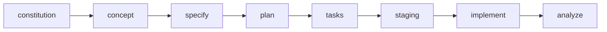

# Spec-Kit Commands Guide

<!-- AUTO-GENERATED - DO NOT EDIT MANUALLY -->
<!-- Generated at: 2026-01-09 08:50:59 -->
<!-- Source: templates/commands/*.md -->

Полное руководство по командам Spec Kit для Spec-Driven Development.

---

## Содержание

- [1. /speckit.constitution](#speckitconstitution)
- [2. /speckit.concept](#speckitconcept)
- [3. /speckit.validate-concept](#speckitvalidate-concept)
- [4. /speckit.specify](#speckitspecify)
- [5. /speckit.clarify](#speckitclarify)
- [6. /speckit.design](#speckitdesign)
- [7. /speckit.plan](#speckitplan)
- [8. /speckit.tasks](#speckittasks)
- [9. /speckit.taskstoissues](#speckittaskstoissues)
- [10. /speckit.staging](#speckitstaging)
- [11. /speckit.analyze](#speckitanalyze)
- [12. /speckit.implement](#speckitimplement)
- [13. /speckit.preview](#speckitpreview)
- [14. /speckit.list](#speckitlist)
- [15. /speckit.switch](#speckitswitch)
- [16. /speckit.extend](#speckitextend)
- [17. /speckit.merge](#speckitmerge)
- [18. /speckit.baseline](#speckitbaseline)
- [19. /speckit.checklist](#speckitchecklist)
- [20. /speckit.discover](#speckitdiscover)
- [21. /speckit.integrate](#speckitintegrate)
- [22. /speckit.monitor](#speckitmonitor)
- [23. /speckit.launch](#speckitlaunch)
- [24. /speckit.ship](#speckitship)
- [25. /speckit.concept-variants](#speckitconcept-variants)
- [26. /speckit.migrate](#speckitmigrate)
- [27. /speckit.properties](#speckitproperties)

---

## Основной Workflow

---

## Детальное описание команд

### 1. `/speckit.constitution` {#speckitconstitution}

**Назначение:** Create or update the project constitution with layered architecture support (base → domain → project layers).

**Модель:** `opus` (thinking_budget: 16000)

**Handoffs:**

- → `/speckit.specify`
- → `/speckit.analyze`

---

### 2. `/speckit.concept` {#speckitconcept}

**Назначение:** Capture complete service concept before detailed specification. Creates hierarchical feature breakdown with full traceability. Use BEFORE /speckit.specify for large projects (50+ requirements).

**Модель:** `opus` (thinking_budget: 16000)

**Handoffs:**

- → `/speckit.specify`
- → `/speckit.analyze`

---

### 3. `/speckit.validate-concept` {#speckitvalidate-concept}

**Назначение:** Re-validate an existing concept against current market conditions. Runs research agents to detect changes in market, competitors, and trends. Generates diff report and CQS delta. Use periodically (monthly/quarterly) to keep concept fresh.

**Модель:** `sonnet` (thinking_budget: 12000)

**Persona:** `concept-validator`

**Handoffs:**

- → `/speckit.concept`
- → `/none`

---

### 4. `/speckit.specify` {#speckitspecify}

**Назначение:** Create or update the feature specification from a natural language feature description. Supports both standalone features and concept-derived specifications with full traceability.

**Модель:** `opus` (thinking_budget: 16000)

**Persona:** `product-agent`

**Флаги:**

- `--model` — Override model selection

**Quality Gates:**

- Spec Quality Gate

**Handoffs:**

- → `/speckit.plan`
- → `/speckit.clarify`
- → `/speckit.analyze`

**Выходные файлы:**

- `spec.md`
- `Checklists/requirements.md`

---

### 5. `/speckit.clarify` {#speckitclarify}

**Назначение:** Identify underspecified areas in the current feature spec by asking up to 5 highly targeted clarification questions and encoding answers back into the spec.

**Модель:** `sonnet` (thinking_budget: 16000)

**Handoffs:**

- → `/speckit.plan`

---

### 6. `/speckit.design` {#speckitdesign}

**Назначение:** Create visual specifications and complete design systems from brand inputs. Orchestrates UX, Product, and Motion Designer agents. Supports design system generation, component library presets, Storybook auto-generation, and Figma token export. Use AFTER /speckit.specify for UI-heavy features OR standalone for design system bootstrapping.

**Модель:** `opus` (thinking_budget: 16000)

**Persona:** `ux-designer-agent`

**Флаги:**

- `--viewports` — `"desktop,tablet,mobile"`
- `--no-webp` — `false`
- `--no-optimize` — `false`
- `--interactive` — `true`
- `--parallel` — `true`
- `--max-parallel` — `3`
- `--batch-delay` — `5000`
- `--no-parallel` — -
- `--incremental` — `true`
- `--force` — `false`
- `--reuse-session` — `true`
- `--no-reuse-session` — -
- `--audit-selectors` — `false`
- `--dry-run` — `false`
- `--debug` — `false`
- `--log-level` — `info`
- `--retry-max` — `2`
- `--retry-backoff` — `exponential`
- `--allow-manual-intervention` — `false`
- `--gallery-mode` — `basic`
- `--no-gallery` — `false`
- `--all` — `false`
- `--screens` — -
- `--manual` — `false`
- `--reauth` — `false`
- `--no-figma` — `false`

**Handoffs:**

- → `/speckit.preview`
- → `/speckit.plan`
- → `/speckit.tasks`
- → `/speckit.analyze`
- → `/speckit.analyze`
- → `/speckit.design-promo`
- → `/speckit.preview`
- → `/speckit.design`
- → `/speckit.plan`
- → `/speckit.design`
- → `/speckit.preview`
- → `/speckit.design`
- → `/speckit.design`

**Выходные файлы:**

- `design-system/tokens.json`
- `design-system/README.md`
- `design-tokens/figma-tokens.json`
- `themes.json`
- `metadata.json`
- ... и ещё 1

---

### 7. `/speckit.plan` {#speckitplan}

**Назначение:** Execute the implementation planning workflow using the plan template to generate design artifacts.

**Модель:** `opus` (thinking_budget: 16000)

**Persona:** `architect-agent`

**Требует:** handoffs/specify-to-plan.md

**Quality Gates:**

- Plan Completeness Gate

**Handoffs:**

- → `/speckit.tasks`
- → `/speckit.checklist`
- → `/speckit.specify`

---

### 8. `/speckit.tasks` {#speckittasks}

**Назначение:** Generate an actionable, dependency-ordered tasks.md with full traceability to spec requirements and acceptance scenarios.

**Модель:** `sonnet` (thinking_budget: 8000)

**Persona:** `decomposer-agent`

**Требует:** handoffs/plan-to-tasks.md

**Quality Gates:**

- Tasks Generated Gate
- Tasks Ready Gate
- Dependency Validity Gate

**Handoffs:**

- → `/speckit.analyze`
- → `/speckit.implement`
- → `/speckit.tasks`

---

### 9. `/speckit.taskstoissues` {#speckittaskstoissues}

**Назначение:** Convert existing tasks into actionable, dependency-ordered GitHub issues for the feature based on available design artifacts.

**Модель:** `haiku` (thinking_budget: 8000)

---

### 10. `/speckit.staging` {#speckitstaging}

**Назначение:** Provision Docker Compose staging environment before implementation

**Модель:** `haiku` (thinking_budget: 4000)

**Persona:** `devops-agent`

**Требует:** tasks.md

**Флаги:**

- `--services` — Override default services (postgres,redis,playwright). Comma-separated.
- `--skip-playwright` — Skip Playwright container (useful for unit-test-only features)
- `--reset` — Tear down and recreate all services
- `--status` — Show current staging status without changes
- `--down` — Stop all staging services

**Pre-Gates:**

- Tasks Exist Gate
- Docker Available Gate

**Quality Gates:**

- Staging Ready Gate

**Handoffs:**

- → `/speckit.implement`

**Выходные файлы:**

- `.speckit/staging/docker-compose.yaml`
- `.speckit/staging/test-config.env`

---

### 11. `/speckit.analyze` {#speckitanalyze}

**Назначение:** Perform a non-destructive cross-artifact consistency, traceability, dependency, and system spec analysis across concept.md, spec.md, plan.md, tasks.md, and system specs. In QA mode (post-implementation), validates build, tests, coverage, and security. Automatically detects validation profile from context (caller command or artifact state). Supports Quality Gates (QG-001 to QG-012). Use `--profile <name>` to override auto-detection. See `memory/domains/quality-gates.md` for gate definitions.

**Модель:** `sonnet` (thinking_budget: 16000)

**Persona:** `qa-agent`

**Флаги:**

- `--profile` — override remains available for power users
- `--quiet` — Suppress non-essential output (only gates + result)
- `--strict` — Lower thresholds (e.g., ambiguity < 3 instead of 5)
- `--json` — Output as JSON for programmatic consumption

**Quality Gates:**

- No Critical Issues Gate
- Dependency Graph Valid Gate
- SQS Quality Gate
- QA Issues Exist Gate
- QA Pass Gate

**Handoffs:**

- → `/speckit.specify`
- → `/speckit.plan`
- → `/speckit.tasks`
- → `/speckit.implement`
- → `/speckit.implement`
- → `/none`

---

### 12. `/speckit.implement` {#speckitimplement}

**Назначение:** Execute the implementation plan, generate documentation (RUNNING.md, README.md), and validate with self-review. Enforces Quality Gates (QG-001 pre-implement gate, QG-004 to QG-009 post-implement gates). See `memory/domains/quality-gates.md` for gate definitions.

**Модель:** `opus` (thinking_budget: 16000)

**Persona:** `developer-agent`

**Требует:** handoffs/tasks-to-implement.md

**Флаги:**

- `--skip-pre-gates` — Skip pre-implementation gates
- `--fast` — Fast mode - run only Tier 1-2 validation

**Pre-Gates:**

- Tasks Exist Gate
- Required Artifacts Gate
- No Critical Issues Gate
- QG-001: SQS Quality Gate
- Properties Available Gate

**Quality Gates:**

- Implementation Complete Gate
- Build Artifacts Gate
- QG-004: Test Coverage Gate
- QG-005: Type Coverage Gate
- QG-006: Lint Gate
- ... и ещё 1

**Handoffs:**

- → `/speckit.analyze`
- → `/speckit.implement`
- → `/speckit.tasks`
- → `/speckit.specify`

---

### 13. `/speckit.preview` {#speckitpreview}

**Назначение:** Generate interactive previews from design specifications. Converts wireframes to visual HTML, generates component previews, captures screenshots, and runs design quality validation.

**Модель:** `opus` (thinking_budget: 16000)

**Persona:** `product-designer-agent`

**Флаги:**

- `--quick` — `--skip quality,gallery,deploy,frames`
- `--ci` — `--no-open --baseline check --gate 80 --skip deploy`
- `--review` — `--deploy --device all --gate 80`
- `--preview-mode` — Override model selection

**Handoffs:**

- → `/speckit.implement`
- → `/speckit.design`
- → `/speckit.design-generate`

---

### 14. `/speckit.list` {#speckitlist}

**Назначение:** List all features in the project with their current status. Shows feature registry from manifest and indicates which feature is currently active.

**Модель:** `haiku` (thinking_budget: 4000)

**Флаги:**

- `--json` — Output in JSON format
- `--tree` — Show feature evolution tree (parent-child relationships)

**Handoffs:**

- → `/speckit.switch`
- → `/speckit.specify`

---

### 15. `/speckit.switch` {#speckitswitch}

**Назначение:** Switch to a different feature to continue working on it. Updates the active feature state and optionally checks out the corresponding git branch.

**Модель:** `haiku` (thinking_budget: 4000)

**Флаги:**

- `--json` — Output in JSON format
- `--repair` — Regenerate manifest from directory structure
- `--no-git` — Skip git branch checkout

**Handoffs:**

- → `/speckit.specify`
- → `/speckit.plan`
- → `/speckit.tasks`
- → `/speckit.implement`

---

### 16. `/speckit.extend` {#speckitextend}

**Назначение:** Extend a merged feature with new capabilities. Creates a new feature branch with Feature Lineage pre-populated, loading context from the parent feature and its system specs.

**Модель:** `sonnet` (thinking_budget: 8000)

**Quality Gates:**

- Extension Valid Gate

**Handoffs:**

- → `/speckit.specify`
- → `/speckit.view`
- → `/speckit.analyze`

**Выходные файлы:**

- `spec.md`

---

### 17. `/speckit.merge` {#speckitmerge}

**Назначение:** Finalize feature and update system specs after PR merge. Converts feature requirements into living system documentation.

**Модель:** `sonnet` (thinking_budget: 16000)

**Handoffs:**

- → `/speckit.analyze`
- → `/speckit.specify`

---

### 18. `/speckit.baseline` {#speckitbaseline}

**Назначение:** Capture current state of system components for brownfield specifications. Generates baseline.md documenting existing behaviors, code structure, and dependencies.

**Модель:** `sonnet` (thinking_budget: 16000)

**Pre-Gates:**

- Feature Directory Gate
- Scope Definition Gate

**Quality Gates:**

- Baseline Completeness Gate
- Code Location Validity Gate
- Baseline Exists Gate

**Handoffs:**

- → `/speckit.specify`
- → `/speckit.plan`

**Выходные файлы:**

- `FEATURE_DIR/baseline.md`

---

### 19. `/speckit.checklist` {#speckitchecklist}

**Назначение:** Generate a custom checklist for the current feature based on user requirements.

**Модель:** `sonnet` (thinking_budget: 8000)

---

### 20. `/speckit.discover` {#speckitdiscover}

**Назначение:** Validate problem-solution fit before building through customer discovery

**Модель:** `opus` (thinking_budget: 16000)

**Persona:** `product-agent`

**Handoffs:**

- → `/speckit.concept`
- → `/speckit.discover`

**Выходные файлы:**

- `docs/discover/hypothesis.md`
- `docs/discover/interview-guide.md`
- `docs/discover/scoring-template.md`
- `docs/discover/analysis.md`
- `docs/discover/decision.md`
- ... и ещё 5

---

### 21. `/speckit.integrate` {#speckitintegrate}

**Назначение:** Quick integration with common third-party services

**Модель:** `sonnet` (thinking_budget: 16000)

**Persona:** `developer-agent`

**Handoffs:**

- → `/speckit.implement`

---

### 22. `/speckit.monitor` {#speckitmonitor}

**Назначение:** Set up production observability with OpenTelemetry, dashboards, and alerting

**Модель:** `sonnet` (thinking_budget: 16000)

**Persona:** `devops-agent`

**Handoffs:**

- → `/speckit.monitor`
- → `/speckit.launch`

**Выходные файлы:**

- `docs/monitor.md`
- `infra/observability/docker-compose.yml`

---

### 23. `/speckit.launch` {#speckitlaunch}

**Назначение:** Automate product launch and go-to-market activities

**Модель:** `sonnet` (thinking_budget: 16000)

**Persona:** `marketing-agent`

**Handoffs:**

- → `/speckit.ship`
- → `/speckit.monitor`
- → `/speckit.implement`

**Выходные файлы:**

- `docs/launch/launch-plan.md`
- `docs/launch/readiness-report.md`
- `docs/launch/social-content.md`
- `docs/launch/email-templates.md`
- `docs/launch/growth-playbook.md`
- ... и ещё 2

---

### 24. `/speckit.ship` {#speckitship}

**Назначение:** Provision infrastructure, deploy application, and verify running system in one command

**Модель:** `sonnet` (thinking_budget: 16000)

**Persona:** `devops-agent`

**Флаги:**

- `--env` — Target environment (local, staging, production). Default: staging
- `--only` — Run only specific stage (infra, deploy, verify). Default: all
- `--destroy` — Tear down infrastructure and deployment
- `--dry-run` — Show plan without executing
- `--cloud` — Override cloud provider (vk, yandex, gcp)
- `--skip-verify` — Skip verification stage
- `--turbo` — Enable maximum parallelism and skip optional checks
- `--safe` — Use sequential execution with full validation
- `--skip-provision` — Skip provision if fingerprint unchanged
- `--force-deploy` — Force deploy even if version unchanged
- `--force-provision` — Force provision even if fingerprint unchanged
- `--full-e2e` — Run full E2E suite instead of contract tests
- `--full-tests` — Run full test suite instead of incremental
- `--auto-rollback` — Automatically rollback on verification failure
- `--no-rollback` — Disable automatic rollback prompts
- `--sequential-phases` — Disable wave overlap optimization
- `--no-browser-pool` — Disable browser pool pre-warming
- `--no-fingerprint` — Disable fingerprint-based skip logic
- `--no-test-cache` — Ignore cached test results

**Pre-Gates:**

- Implementation Exists Gate
- Ship Config Exists Gate

**Quality Gates:**

- Verification Issues Exist Gate
- Deployment Success Gate

**Handoffs:**

- → `/speckit.implement`
- → `/speckit.specify`
- → `/speckit.analyze`

**Выходные файлы:**

- `/infra-outputs.json`
- `FEATURE_DIR/verify-results.md`

---

### 25. `/speckit.concept-variants` {#speckitconcept-variants}

**Назначение:** Generate MINIMAL/BALANCED/AMBITIOUS scope variants for existing concept

**Модель:** `sonnet` (thinking_budget: 8000)

---

### 26. `/speckit.migrate` {#speckitmigrate}

**Назначение:** Plan and execute spec-driven modernization between architectures, versions, and cloud providers

**Модель:** `opus` (thinking_budget: 32000)

**Persona:** `architect-agent`

**Флаги:**

- `--from` — Source architecture to migrate from (monolith, legacy, etc.)
- `--upgrade` — Target version/runtime to upgrade to (node18, postgres16, python312, etc.)
- `--to-cloud` — Target cloud provider (aws, gcp, azure, vk-cloud)
- `--scope` — Limit analysis to specific paths (default: entire codebase)
- `--output` — Output verbosity (minimal, standard, detailed). Default: standard
- `--dry-run` — Show migration plan without generating files

**Pre-Gates:**

- Codebase Exists Gate
- Migration Type Gate

**Quality Gates:**

- Migration Plan Complete Gate
- Risk Mitigation Gate
- Migration Plan Exists Gate

**Handoffs:**

- → `/speckit.plan`
- → `/speckit.tasks`

**Выходные файлы:**

- `baseline.md`

---

### 27. `/speckit.properties` {#speckitproperties}

**Назначение:** Extract properties from spec artifacts and generate property-based tests with EARS transformation. Creates PROP-xxx traced to AS/EC/FR/NFR for comprehensive edge case discovery via PGS (Property-Generated Solver) methodology.

**Модель:** `sonnet` (thinking_budget: 16000)

**Persona:** `qa-agent`

**Требует:** specs/[feature]/spec.md

**Quality Gates:**

- Property Quality Gate
- Property Coverage Gate

**Handoffs:**

- → `/speckit.implement`
- → `/speckit.specify`
- → `/speckit.analyze`

---

## Quick Reference

### Команды по категориям

| Категория | Команды |
|-----------|---------|
| Foundation | `/speckit.constitution` |
| Discovery | `/speckit.concept`, `/speckit.validate-concept`, `/speckit.discover` |
| Specification | `/speckit.specify`, `/speckit.clarify`, `/speckit.design` |
| Planning | `/speckit.plan`, `/speckit.tasks`, `/speckit.taskstoissues` |
| Implementation | `/speckit.staging`, `/speckit.implement`, `/speckit.preview` |
| Quality | `/speckit.analyze`, `/speckit.checklist` |
| Navigation | `/speckit.list`, `/speckit.switch`, `/speckit.extend`, `/speckit.merge` |
| Operations | `/speckit.baseline`, `/speckit.integrate`, `/speckit.monitor`, `/speckit.launch`, `/speckit.ship` |

### Флаги команд

| Команда | Флаг | Описание |
|---------|------|----------|
| `/speckit.specify` | `--model` | Override model selection |
| `/speckit.design` | `--viewports` | `"desktop,tablet,mobile"` |
| `/speckit.design` | `--no-webp` | `false` |
| `/speckit.design` | `--no-optimize` | `false` |
| `/speckit.design` | `--interactive` | `true` |
| `/speckit.design` | `--parallel` | `true` |
| `/speckit.design` | `--max-parallel` | `3` |
| `/speckit.design` | `--batch-delay` | `5000` |
| `/speckit.design` | `--no-parallel` | - |
| `/speckit.design` | `--incremental` | `true` |
| `/speckit.design` | `--force` | `false` |
| `/speckit.design` | `--reuse-session` | `true` |
| `/speckit.design` | `--no-reuse-session` | - |
| `/speckit.design` | `--audit-selectors` | `false` |
| `/speckit.design` | `--dry-run` | `false` |
| `/speckit.design` | `--debug` | `false` |
| `/speckit.design` | `--log-level` | `info` |
| `/speckit.design` | `--retry-max` | `2` |
| `/speckit.design` | `--retry-backoff` | `exponential` |
| `/speckit.design` | `--allow-manual-intervention` | `false` |
| `/speckit.design` | `--gallery-mode` | `basic` |
| `/speckit.design` | `--no-gallery` | `false` |
| `/speckit.design` | `--all` | `false` |
| `/speckit.design` | `--screens` | - |
| `/speckit.design` | `--manual` | `false` |
| `/speckit.design` | `--reauth` | `false` |
| `/speckit.design` | `--no-figma` | `false` |
| `/speckit.staging` | `--services` | Override default services (postgres,redis,playwrig... |
| `/speckit.staging` | `--skip-playwright` | Skip Playwright container (useful for unit-test-on... |
| `/speckit.staging` | `--reset` | Tear down and recreate all services |
| `/speckit.staging` | `--status` | Show current staging status without changes |
| `/speckit.staging` | `--down` | Stop all staging services |
| `/speckit.analyze` | `--profile` | override remains available for power users |
| `/speckit.analyze` | `--quiet` | Suppress non-essential output (only gates + result... |
| `/speckit.analyze` | `--strict` | Lower thresholds (e.g., ambiguity < 3 instead of 5... |
| `/speckit.analyze` | `--json` | Output as JSON for programmatic consumption |
| `/speckit.implement` | `--skip-pre-gates` | Skip pre-implementation gates |
| `/speckit.implement` | `--fast` | Fast mode - run only Tier 1-2 validation |
| `/speckit.preview` | `--quick` | `--skip quality,gallery,deploy,frames` |
| `/speckit.preview` | `--ci` | `--no-open --baseline check --gate 80 --skip deplo... |
| `/speckit.preview` | `--review` | `--deploy --device all --gate 80` |
| `/speckit.preview` | `--preview-mode` | Override model selection |
| `/speckit.list` | `--json` | Output in JSON format |
| `/speckit.list` | `--tree` | Show feature evolution tree (parent-child relation... |
| `/speckit.switch` | `--json` | Output in JSON format |
| `/speckit.switch` | `--repair` | Regenerate manifest from directory structure |
| `/speckit.switch` | `--no-git` | Skip git branch checkout |
| `/speckit.ship` | `--env` | Target environment (local, staging, production). D... |
| `/speckit.ship` | `--only` | Run only specific stage (infra, deploy, verify). D... |
| `/speckit.ship` | `--destroy` | Tear down infrastructure and deployment |
| `/speckit.ship` | `--dry-run` | Show plan without executing |
| `/speckit.ship` | `--cloud` | Override cloud provider (vk, yandex, gcp) |
| `/speckit.ship` | `--skip-verify` | Skip verification stage |
| `/speckit.ship` | `--turbo` | Enable maximum parallelism and skip optional check... |
| `/speckit.ship` | `--safe` | Use sequential execution with full validation |
| `/speckit.ship` | `--skip-provision` | Skip provision if fingerprint unchanged |
| `/speckit.ship` | `--force-deploy` | Force deploy even if version unchanged |
| `/speckit.ship` | `--force-provision` | Force provision even if fingerprint unchanged |
| `/speckit.ship` | `--full-e2e` | Run full E2E suite instead of contract tests |
| `/speckit.ship` | `--full-tests` | Run full test suite instead of incremental |
| `/speckit.ship` | `--auto-rollback` | Automatically rollback on verification failure |
| `/speckit.ship` | `--no-rollback` | Disable automatic rollback prompts |
| `/speckit.ship` | `--sequential-phases` | Disable wave overlap optimization |
| `/speckit.ship` | `--no-browser-pool` | Disable browser pool pre-warming |
| `/speckit.ship` | `--no-fingerprint` | Disable fingerprint-based skip logic |
| `/speckit.ship` | `--no-test-cache` | Ignore cached test results |
| `/speckit.migrate` | `--from` | Source architecture to migrate from (monolith, leg... |
| `/speckit.migrate` | `--upgrade` | Target version/runtime to upgrade to (node18, post... |
| `/speckit.migrate` | `--to-cloud` | Target cloud provider (aws, gcp, azure, vk-cloud) |
| `/speckit.migrate` | `--scope` | Limit analysis to specific paths (default: entire ... |
| `/speckit.migrate` | `--output` | Output verbosity (minimal, standard, detailed). De... |
| `/speckit.migrate` | `--dry-run` | Show migration plan without generating files |

---

## Версия документа

**Версия:** 0.0.99
**Дата генерации:** 2026-01-09 08:50:59
**Автор:** Auto-generated from command templates
