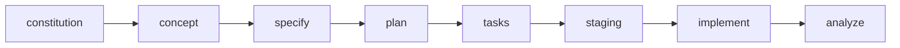

# Spec-Kit Commands Guide

<!-- AUTO-GENERATED - DO NOT EDIT MANUALLY -->
<!-- Generated at: 2026-01-10 -->
<!-- Source: templates/commands/*.md -->

Полное руководство по командам Spec Kit для Spec-Driven Development.

---

## Содержание

- [0. /speckit.help](#speckithelp)
- [1. /speckit.constitution](#speckitconstitution)
- [2. /speckit.concept](#speckitconcept)
- [2a. /speckit.concept.switch](#speckitconceptswitch)
- [3. /speckit.validate-concept](#speckitvalidate-concept)
- [4. /speckit.specify](#speckitspecify)
- [5. /speckit.clarify](#speckitclarify)
- [6. /speckit.design](#speckitdesign)
- [7. /speckit.plan](#speckitplan)
- [8. /speckit.tasks](#speckittasks)
- [9. /speckit.taskstoissues](#speckittaskstoissues)
- [10. /speckit.staging](#speckitstaging)
- [11. /speckit.analyze](#speckitanalyze)
- [12. /speckit.reverse-engineer](#speckitreverse-engineer)
- [13. /speckit.fix](#speckitfix)
- [14. /speckit.implement](#speckitimplement)
- [15. /speckit.verify](#speckitverify)
- [16. /speckit.preview](#speckitpreview)
- [17. /speckit.list](#speckitlist)
- [18. /speckit.switch](#speckitswitch)
- [19. /speckit.extend](#speckitextend)
- [20. /speckit.merge](#speckitmerge)
- [21. /speckit.baseline](#speckitbaseline)
- [22. /speckit.checklist](#speckitchecklist)
- [23. /speckit.discover](#speckitdiscover)
- [24. /speckit.integrate](#speckitintegrate)
- [25. /speckit.monitor](#speckitmonitor)
- [26. /speckit.launch](#speckitlaunch)
- [27. /speckit.ship](#speckitship)
- [28. /speckit.concept-variants](#speckitconcept-variants)
- [29. /speckit.migrate](#speckitmigrate)
- [30. /speckit.properties](#speckitproperties)
- [31. /speckit.mobile](#speckitmobile)

---

## Основной Workflow



---

## Детальное описание команд

### 0. `/speckit.help` {#speckithelp}

**Назначение:** Display help documentation for any speckit command, including command description, required and optional flags with descriptions, usage examples, handoffs to next commands, and model information.

**Модель:** `haiku` (thinking_budget: 2000)

**Флаги:**
- `--thinking-depth <standard|ultrathink>` — Thinking budget: standard (2K, $0.03, default), ultrathink (8K, $0.12)

**Command Selection:**
- `<command>` — Command name to get help for (required). Can use short form (e.g., "concept") or full form (e.g., "speckit.concept")

**Options:**
- `--json` — Output help in JSON format (machine-readable)
- `--verbose` — Include extended documentation and examples
- `--list` — List all available commands

**Примеры использования:**
```bash
# Get help for concept command
/speckit.help concept

# Get help for game progression command (with prefix)
/speckit.help speckit.games.progression

# Get help for implementation command
/speckit.help implement

# Get help for specify command (short form)
/speckit.help specify
```

**Output Format:**
- Command name and description
- Model and thinking budget
- Usage pattern with required flags
- Required flags section (with REQUIRED marker)
- Optional flags section (with defaults)
- Usage examples from documentation
- Handoff commands (next steps in workflow)

**Notes:**
- Fast response time (haiku model, <5 seconds typical)
- Cost: ~$0.01 per help invocation
- Help content is always up-to-date (reads from COMMANDS_GUIDE.md)
- If command not found, displays list of available commands
- Handles both "concept" and "speckit.concept" formats
- Output width: 80 characters max for readability

**Handoffs:**
- None (help is informational only, doesn't modify state)

---

### 1. `/speckit.constitution` {#speckitconstitution}

**Назначение:** Create or update the project constitution with layered architecture support (base → domain → project layers).

**Модель:** `opus` (thinking_budget: 32000)

**New in v0.8.2 — Table of Contents:**

Generated constitution.md files now include automatic Table of Contents after the "Project Settings" section for easier navigation:

- **Hierarchical structure**: Core Sections, Domain Principles (73 total), Supporting Sections
- **Clickable anchors**: One-click navigation to any of 19+ sections
- **Principle counts**: Shows principle count per domain (e.g., SEC: 8, PERF: 1)
- **Static approach**: Reflects Layer 0 base.md v1.1 (73 principles, 14 domains)

**TOC Sections:**
- Core: How It Works, Quick Start, Project Settings, Strengthened Principles, Project-Specific Principles
- Domain: SEC, OBS, ERR, QUA, REL, API, DOC, TFA, TST, PRF, PERF, CMP, A11Y, DSS
- Supporting: Technology Constraints, Compliance, Security, Approval Matrix, Tech Radar, SLA Targets, Design System, Exceptions, Governance


**Флаги:**
- `--thinking-depth <quick|standard|ultrathink>` — Thinking budget: quick (16K, $0.32), standard (32K, $1.15, default), ultrathink (120K, $4.32)
- `--max-model <opus|sonnet|haiku>` — Model cap for cost control

#### Вопрос 5: Поддержка аналитики

**Когда задается**: Всегда (после вопросов о платформе)

**Опции**:
- **Web + Product** — Полный стек: веб-аналитика (Umami) + продуктовая аналитика (PostHog/Mixpanel/Amplitude)
- **Web Only** — Только просмотры страниц, сессии, источники трафика (Umami)
- **Product Only** — Только события поведения пользователей, воронки, когорты
- **No Analytics** — Без отслеживания (privacy-first по умолчанию)

**Настройки в конституции**:
- `analytics_enabled`: `true` / `false`
- `analytics_types`: `["web"]`, `["product"]`, `["web", "product"]`, `[]`
- `analytics_provider`: `posthog` / `mixpanel` / `amplitude` / (пусто)

**Примечание**: При включении аналитики требования NFR-ANA-xxx автоматически включаются во все спецификации функций, а задачи Phase 2f: Analytics Foundation добавляются в каждый план реализации.

**Приватность**: При включении аналитики по умолчанию включены средства контроля GDPR/CCPA (согласие на cookies, анонимизация IP, маскирование PII, opt-out).

**Handoffs:**

- → `/speckit.specify`
- → `/speckit.analyze`

---

### 2. `/speckit.concept` {#speckitconcept}

**Назначение:** Fully autonomous concept generation with 5 product variants. Generates CEO-focused strategic blueprints (CQS ≥85) with Problem→Market→Vision→Solution→Execution narrative flow. Use BEFORE /speckit.specify for large projects (50+ requirements).

**Модель:** `opus` (thinking_budget: 32000, standard default)

**Token Optimization (v0.5.0):**

Phase 1 optimizations reduce token consumption by 40.5K tokens (73% reduction):

- ✅ **Agent Prompt Extraction** (~8K tokens saved) — 5 reusable agent prompts extracted to `templates/shared/agent-prompt-template.md`, referenced via `prompt_ref:` directives
- ✅ **CQS Formula Single Source** (~2K tokens saved) — Complete 11-component formula (v0.7.0) centralized in `templates/shared/cqs-formula.md`, eliminates duplication
- ✅ **Modular Sections Guide** (~6K tokens potential) — 46 reusable concept sections documented in `templates/shared/modular-sections-guide.md` for future include directives
- ✅ **Command Parameterization** (~1.5K tokens saved) — All hardcoded story IDs in next-steps.md templates replaced with template variables (`{WAVE_1_STORY_IDS_COMMA_SEPARATED}`, etc.)

**NEW: --thinking-depth Flag (v0.9.8)** — Cost Optimization & User Control

Phase 5 optimizations make ultrathink (120K thinking budget) **opt-in instead of default**, reducing typical usage cost by 73%.

**Control thinking budget depth for cost optimization:**

| Depth | Agents | Thinking Budget | Cost | Execution Time | Use For |
|-------|--------|-----------------|------|----------------|---------|
| `quick` | 5 core | 16K per agent | **$0.32** | 90-120s | Rapid idea validation, MVP concepts |
| `standard` ✨ | 9 agents | 32K per agent | **$1.15** | 180-240s | **Production concepts (DEFAULT)** |
| `ultrathink` | 9 agents | 120K per agent | **$4.32** | 300-420s | Regulatory compliance, deep research |

✨ **Breaking Change**: Default changed from `ultrathink` → `standard` (73% cost reduction).

**Usage Examples:**

```bash
# Quick concept for MVP validation (5 agents, $0.32)
/speckit.concept --thinking-depth=quick "B2B SaaS for sales teams"

# Standard concept with solid research (9 agents, $1.15) [DEFAULT]
/speckit.concept "B2B SaaS for sales teams"
# or explicitly: --depth=standard

# Ultrathink for regulatory/compliance-heavy projects ($4.32)
/speckit.concept --thinking-depth=ultrathink "HealthTech HIPAA-compliant platform"

# Preview cost without executing
/speckit.concept --thinking-depth=ultrathink --dry-run
```

**What's included in each tier:**

**Quick mode** (5 core agents):
- ✅ market-researcher (Porter's 5 Forces, Blue Ocean)
- ✅ competitive-analyst (ERRC Grid)
- ✅ persona-designer (JTBD, WTP)
- ✅ strategic-synthesis-ai (Three Pillars)
- ✅ concept-quality-scorer (CQS calculation)
- ⊘ Standards research (GDPR, HIPAA, SOC 2) — skipped
- ⊘ Academic research validation — skipped
- ⊘ Detailed constraints analysis — skipped
- ⊘ Community intelligence gathering — skipped

**Standard mode** (9 agents) [RECOMMENDED]:
- ✅ All quick mode agents
- ✅ jtbd-analyst (Jobs-to-be-Done deep dive)
- ✅ value-prop-designer (Value proposition canvas)
- ✅ metrics-designer (North Star metric, SMART goals)
- ✅ risk-assessor (Risk matrix, pivot criteria)
- ⊘ Standards research — skipped (use ultrathink if needed)
- ⊘ Academic research — skipped (use ultrathink if needed)

**Ultrathink mode** (9 agents + extended reasoning):
- ✅ All standard mode agents
- ✅ 120K thinking budget (4× deeper strategic reasoning)
- ✅ standards-researcher (GDPR, HIPAA, SOC 2, accessibility)
- ✅ academic-researcher (Scientific validation, research papers)
- ✅ Extended compliance & regulatory analysis

**Recommendation**: Standard mode is excellent for 90% of concepts. Only use ultrathink if you need:
- Regulatory compliance research (GDPR, HIPAA, SOC 2, WCAG)
- Academic validation (scientific papers, research citations)
- Extended strategic reasoning (4× thinking depth)

**Cost transparency (v0.9.8):**
- `--dry-run` flag shows cost estimate before execution
- Pre-execution warnings for operations >$2
- User-tier fallback with graceful degradation for non-Max users

**Agent optimizations (v0.9.8):**
- standards-researcher: opus 120K → sonnet 32K (lookup-based, not strategic)
- academic-researcher: opus 120K → sonnet 32K (structured analysis)
- Total savings: 176K tokens per concept execution

**New in v0.7.0 — Strategic Restructuring:**

**Added:**
- ✅ **Problem Analysis** section — Top 10 ranked pain points with evidence
- ✅ **Three Foundational Pillars** — Strategic pillars with proof points, differentiation, time to imitation
- ✅ **Differentiation Strategy** — 5 breakthrough differentiators with barriers to entry
- ✅ **Strategic Recommendations** — Phase-based roadmap (Foundation/Scale/Dominate) with CSFs, risks
- ✅ **CQS Formula v0.7.0** — New Strategic Depth component (10% weight), 11 components, 0-120 scale
- ✅ **Intelligent Section Selection** — Auto-selects sections based on domain, timeline, complexity
- ✅ **Strategic Language** — CEO/board-focused tone (not technical-product language)
- ✅ **Narrative Flow** — Problem→Market→Vision→Solution→Execution structure

**Autonomous Workflow (v0.8.0 + v0.7.0):**

**Removed:**
- ❌ All Q1-Q10 interactive questions
- ❌ Phase 0a-1 (problem discovery questions)
- ❌ Phase 0a-2 (strategic positioning questions)
- ❌ Manual alternative selection (blocking)

**New Flow:**

1. **Phase 0.5: Context Extraction (Autonomous)**
   - Classification agent extracts: domain, industry, target users, problem space, timeline, complexity
   - Confidence-based: ≥0.8 = fully autonomous, <0.5 = 1-2 clarifying questions only
   - Adaptive agent selection (e.g., FinTech → compliance agents)
   - Domain classification: B2B SaaS / B2C App / Gaming / FinTech / Enterprise / Healthcare / EdTech

2. **Phase 0b: Deep Research (Parallel, 10-12 min) — 7 Waves**
   - **Wave 1 (Research, 10+ agents, opus/120K)**: market-researcher (Porter's 5 Forces, Blue Ocean), competitive-analyst (ERRC Grid), persona-designer (JTBD, WTP), standards-researcher, academic-researcher, community-intelligence, trend-analyst
   - **Wave 2-3 (Analysis)**: jtbd-analyst, value-prop-designer, glossary-builder, constraints-analyzer
   - **Wave 3 (Validation)**: metrics-designer, risk-assessor
   - **Wave 4 (Technical)**: technical-hint-generator (architecture strategist)
   - **Wave 5 (Synthesis) — NEW**: strategic-synthesis-ai → Generates Three Foundational Pillars
   - **Wave 6 (Recommendations) — NEW**: strategic-recommendations-ai → Phase-based roadmap
   - **Wave 7 (Quality)**: concept-quality-scorer → CQS v0.7.0 calculation

2a. **Phase 2a: Intelligent Section Selection (Autonomous) — NEW**
   - **Core Sections** (always): executive-summary, problem-analysis, market-framework, three-pillars, differentiation-strategy, metrics-smart, strategic-recommendations, cqs-score
   - **Domain-Specific Sections**:
     - B2B SaaS: business-model-canvas, porters-five-forces, persona-jtbd, investment-thesis
     - B2C App: persona-jtbd, retention-strategy, growth-loops
     - Gaming: game-economy-design, live-ops-planning, monetization-strategy
     - FinTech: risk-matrix, ai-responsibility, regulatory compliance
     - Enterprise: technical-hints, ecosystem-strategy, decision-log
   - **Timeline-Based Sections**:
     - Short (1-3mo): pre-mortem, hypothesis-testing
     - Long (12+mo): investment-thesis, ecosystem-strategy, three-horizons, scenario-planning
   - **Complexity-Based Sections**:
     - SIMPLE: Skip technical-hints, ecosystem-strategy
     - COMPLEX: Include decision-log, portfolio-context
   - **Section Count**: 10-25 sections depending on configuration

3. **Phase 3: Generate 5 Complete Variants (Parallel, 3-5 min)**
   - 5 strategic lenses: **Conventional**, **Minimal**, **Disruptive**, **Premium**, **Platform**
   - Each variant: 15-30 pages with narrative flow (Problem→Market→Vision→Solution→Execution)
   - New sections included: Problem Analysis, Three Pillars, Differentiation Strategy, Strategic Recommendations
   - Alternative scoring: 50 points (was 40) — Added Strategic Depth (0-10 pts)
   - CQS scoring: Target ≥85/120 per variant (CQS v0.7.0)
   - Auto-regenerate if CQS < 80 (max 2 retries)

4. **Auto-Select & Save (Non-blocking, 10s)**
   - Selects highest CQS variant → `specs/concept.md`
   - Saves all 5 → `specs/alternatives/01-conventional.md` ... `05-platform.md`
   - Generates comparison → `specs/concept-alternatives.md`
   - **No user blocking** - review asynchronously

**Strategic Positioning (Auto-Inferred):**
- Market Position, Differentiation, GTM Strategy, Timeline, North Star Metric
- Three Foundational Pillars with proof points and time to imitation
- 5 Breakthrough Differentiators with barriers to entry
- Phase-based Strategic Recommendations (Foundation/Scale/Dominate)
- All inferred from research with rationale and evidence

**CQS Formula v0.7.0 (NEW — 11 Components, 0-120 scale):**
```
CQS-E = (
  Market × 0.16 +            # ↓ from 0.18
  Persona × 0.12 +           # ↓ from 0.14
  Metrics × 0.12 +           # ↓ from 0.14
  Features × 0.12 +          # ↓ from 0.14
  Risk × 0.08 +              # ↓ from 0.10
  Technical × 0.08 +         # ↓ from 0.10
  Strategic_Clarity × 0.08 + # ↑ from 0.05
  Strategic_Depth × 0.10 +   # NEW (Three Pillars, Differentiators, Roadmap)
  Validation × 0.05 +
  Transparency × 0.05 +
  Quality_Intent × 0.04      # ↓ from 0.05
) × 100 × Evidence_Multiplier
```

**Strategic Depth Component (NEW — 100 pts max, 10% weight):**
- Three Foundational Pillars with proof points: 25 pts (STRONG+ evidence required)
- Five Breakthrough Differentiators with barriers: 25 pts (STRONG+ evidence required)
- Phase-based Strategic Recommendations: 25 pts (MEDIUM+ evidence required)
- Critical Success Factors (≥5): 15 pts (MEDIUM+ evidence required)
- Risk/Mitigation matrix (≥5): 10 pts (MEDIUM+ evidence required)

**Output Files:**
- `specs/concept.md` — Auto-selected highest CQS variant with new strategic sections
- `specs/alternatives/*.md` — All 5 variants preserved (01-conventional, 02-minimal, 03-disruptive, 04-premium, 05-platform)
- `specs/concept-alternatives.md` — Comparison table with recommendation (50-point scoring)
- `specs/next-steps.md` — Ready-to-Execute Commands (4 variants: By Waves, By Epics, By Priorities, Entire)
- `specs/quality-report.md` — CQS v0.7.0 breakdown with Strategic Depth score, evidence coverage, frameworks applied
- `specs/generation-summary.md` — CLI completion summary, comparison table, file list, next steps guide
- `memory/knowledge/` — Domain glossaries, best practices, compliance checklists

**Quality Metrics:**
- CQS Target: 85-100/120 (v0.7.0 scale, up from 60-80/100 in v0.6.x)
- Strategic Depth Target: 70-90/100 (new component)
- Evidence Coverage: ≥80% claims sourced, STRONG+ tier for pillars/differentiators
- Strategic Frameworks: ≥3 frameworks applied per variant
- Section Count: 10-25 sections (auto-selected based on domain/timeline/complexity)
- Generation Time: 15-25 min end-to-end (increased due to synthesis waves)

**Флаги:**
- `--thinking-depth <quick|standard|ultrathink>` — Thinking budget control: quick (16K, $0.32), standard (32K, $1.15, default), ultrathink (120K, $4.32)
- `--max-model <opus|sonnet|haiku>` — Model cap for cost control


**Handoffs:**

- → `/speckit.specify` — Specify features from selected concept
- → `/speckit.concept.switch [1-5]` — Switch to different variant
- → `/speckit.analyze` — Quality validation

---

### 2a. `/speckit.concept.switch` {#speckitconceptswitch}

**Назначение:** Switch to a different concept alternative after autonomous generation. Allows async review and selection of product variants.

**Модель:** `haiku` (thinking_budget: 2000)

**Флаги:**
- `--thinking-depth <standard|ultrathink>` — Thinking budget: standard (2K, $0.03, default), ultrathink (8K, $0.12)

**Alternative Selection:**
- `<N>` — Alternative number to switch to (1-5, required)
  - 1 = Conventional (conservative, proven approach)
  - 2 = Minimal (MVP, stripped-down version)
  - 3 = Disruptive (innovative, high-risk/high-reward)
  - 4 = Premium (feature-rich, premium market)
  - 5 = Platform (extensible, ecosystem approach)

**Execution:**

```bash
/speckit.concept.switch [1-5]
```

**What It Does:**

1. **Validates Alternative Exists**: Checks `specs/alternatives/0{N}-*.md`
2. **Reads Alternative Content**: Extracts CQS score and content
3. **Updates concept.md**: Replaces `specs/concept.md` with selected variant
4. **Updates Comparison**: Updates `specs/concept-alternatives.md` with new selection
5. **Preserves All Variants**: All 5 alternatives remain in `specs/alternatives/`

**Output:**

```
✅ Switched to Alternative 3: Disruptive

📊 Previous: Alternative 1
   Current: Alternative 3 - Disruptive (CQS: 92/100)

📄 Updated Files:
   - specs/concept.md
   - specs/concept-alternatives.md

💡 All alternatives preserved in specs/alternatives/
```

**Integration:**

After switching, all downstream commands work normally:
- `/speckit.specify` — Uses new `specs/concept.md`
- `/speckit.plan` — Reads from `specs/concept.md`
- `/speckit.tasks` — Reads from `specs/concept.md`

**Handoffs:**

- → `/speckit.specify` — Specify features from switched concept
- → `/speckit.plan` — Plan implementation

---

### 2b. `/speckit.games.concept` {#speckitgamesconcept}

**Назначение:** Autonomous mobile game concept generation with 5 genre-based variants (Sorting, Match-3, Idle, Arcade, Puzzle). Adapts `/speckit.concept` architecture for game development with game-specific research agents and CQS-Game scoring.

**Модель:** `opus` (thinking_budget: 32000)

**Token Optimization (v0.5.0):**

Phase 2 optimizations reduce thinking token consumption by 200-300K tokens (20-25% for world-class mode):

- ✅ **Agent Model Downgrading** (~168K thinking saved) — 7 simple research agents downgraded from Sonnet (32K) to Haiku (8K): genre-researcher, platform-constraints, cultural-localization, platform-roadmap, liveops-feasibility, trends-analyst, community-intelligence
- ✅ **Lazy Variant Generation** (~80% reduction) — Variants generated on-demand instead of all 5 upfront; use `--genre=all` to generate all variants
- ✅ **User-Tier Auto-Fallback** — Non-Max users automatically fallback to Sonnet (16K thinking) with graceful warning instead of failing on 120K budget
- ✅ **Wave Overlap Optimization** — Increased parallelism from 0.60 → 0.75 overlap (reduces serialization bottleneck by 25%)

**Когда использовать:**
- Creating a new mobile game from scratch
- Exploring different genre approaches for one game idea
- Need CEO-focused game design document with market research
- Pre-production phase before starting GDD

**Флаги:**
- `--thinking-depth <quick|standard|ultrathink>` — Thinking budget: quick (16K, $0.32), standard (32K, $1.15, default), ultrathink (120K, $4.32)
- `--genre <sorting|match3|idle|arcade|puzzle|all>` — Generate specific genre or all 5 (default: all)

**Autonomous Workflow:**

1. **Phase 0: Context Extraction**
   - Extracts game parameters: core mechanics hints, theme/setting, target audience, monetization preference

2. **Phase 1: Game Research (12 parallel agents in world-class mode, Priority 10)**
   - `game-market-benchmarker` (opus, 120K) — D1/D7/D30, CPI, LTV, ARPDAU benchmarks from Sensor Tower, GameRefinery
   - `game-competitive-analyst` (opus, 120K) — Top Grossing teardowns, feature matrix, ERRC Grid
   - `game-monetization-researcher` (opus, 120K) — IAP/IAA strategy, LTV/CAC, ethics (GAM-004)
   - `game-viral-mechanics-researcher` (opus, 120K) — K-factor formula validation, organic UA, social features
   - `game-retention-researcher` (opus, 120K) — D1/D7/D30 loops, psychological triggers, churn prevention
   - `game-genre-researcher` (sonnet, 32K) — Genre best practices, core loop patterns
   - `game-platform-constraints-researcher` (sonnet, 32K) — iOS/Android policies, ASO
   - `game-player-psychology-researcher` (opus, 120K) — Bartle types, SDT, Flow Theory
   - `game-economy-simulator` (opus, 120K) — Economy balance simulation (sink/source, inflation)
   - `game-player-archetype-researcher` (opus, 120K) — Quantic Foundry 12-motivation framework
   - `game-platform-roadmap-researcher` (sonnet, 32K) — Multi-platform launch strategy
   - `game-liveops-feasibility-researcher` (sonnet, 32K) — Live ops sustainability assessment
   - `game-cultural-localization-researcher` (sonnet, 32K) — APAC/EU/LATAM localization requirements

3. **Phase 2: Synthesis (2 agents, Priority 20)**
   - `game-economy-synthesizer` (sonnet, 32K) — Economy parameters for simulation
   - `game-liveops-synthesizer` (sonnet, 32K) — 90-day event calendar, A/B test plan

4. **Phase 3: Generate 5 Genre Variants (Parallel)**
   - **Sorting** — Organize items by attribute (color, shape, size)
     - Examples: Sort It 3D, Water Sort Puzzle
     - D1: 35-45%, D7: 15-25%, ARPDAU: $0.05-0.20
   - **Match-3** — Match 3+ items to clear board
     - Examples: Candy Crush, Homescapes
     - D1: 40-50%, D7: 20-30%, ARPDAU: $0.20-0.50
   - **Idle** — Automated progression with strategic upgrades
     - Examples: AFK Arena, Idle Heroes
     - D1: 45-55%, D7: 25-35%, ARPDAU: $0.30-0.80
   - **Arcade** — Fast-paced reflex action
     - Examples: Subway Surfers, Crossy Road
     - D1: 30-40%, D7: 12-20%, ARPDAU: $0.08-0.25
   - **Puzzle** — Logic and spatial reasoning
     - Examples: Monument Valley, The Room
     - D1: 35-45%, D7: 18-28%, ARPDAU: $0.05-0.15

5. **Auto-Select & Save**
   - Selects highest CQS-Game variant → `specs/game-concept.md`
   - Saves all 5 → `specs/alternatives/01-sorting.md` ... `05-puzzle.md`

**CQS-Game v2.0 Formula (10 Components, 0-120 scale):**
```
CQS-Game v2.0 = (
  Market × 0.15 +              # Market opportunity
  Mechanics × 0.13 +           # Core mechanics depth
  Monetization × 0.13 +        # Monetization strategy
  Viral_Potential × 0.11 +     # K-factor validation, social mechanics
  Retention × 0.11 +           # D1/D7/D30 targets with psychological triggers
  Strategic_Depth × 0.10 +     # Three Pillars + ERRC Grid + Positioning
  Tech_Feasibility × 0.09 +    # Engine, platform, timeline
  Competition × 0.08 +         # Competitive positioning
  Innovation × 0.08 +          # Unique differentiators
  Risk × 0.02                  # Risk/mitigation matrix
) × 100 × Evidence_Multiplier

Target: ≥90/120 (world-class tier, up from 85/120)
```

**Key Differences from `/speckit.concept`:**
- **Variants**: 5 mobile game genres instead of 5 business strategies
- **Scoring**: CQS-Game v2.0 (10 components) vs CQS-E (11 components)
- **Research**: 12 game-specific agents in world-class mode (market, competitive, monetization, viral, retention, genre, platform, psychology, economy, player-archetype, platform-roadmap, liveops, localization)
- **Threshold**: 90/120 (world-class tier for games industry)

**Output Files:**
- `specs/game-concept.md` — Auto-selected highest CQS-Game variant
- `specs/alternatives/01-sorting.md` through `05-puzzle.md` — All genre variants
- `specs/game-alternatives.md` — Comparison table with genre fit scores
- `specs/quality-report.md` — CQS-Game breakdown per variant
- `specs/concept-research.md` — Market research findings (benchmarks, competitors)

**Quality Gates:**
- **QG-GCONCEPT-001**: CQS-Game v2.0 score ≥ 90/120
- **QG-GCONCEPT-002**: Genre fit validation ≥ 80% (core mechanics align with genre best practices, validated via genre template compliance checklists)
- **QG-GCONCEPT-003**: No predatory patterns (GAM-004 compliance — no dark patterns, loot box ethics, COPPA)

**Integration with Existing Components:**
- Uses `game-economy-design.md` for economy parameters schema
- Uses `retention-strategy.md` for D1/D7/D30 benchmarks
- Uses `monetization-strategy.md` for LTV targets and GAM-004 ethics
- Uses `player-psychology.md` for Bartle types and SDT validation

**Handoffs:**
- → `/speckit.games.mechanics` — Detail mechanics after genre selection
- → `/speckit.gdd` — Create full Game Design Document
- → `/speckit.concept.switch [1-5]` — Switch between genre variants

**Пример использования:**
```bash
# Generate all 5 genre variants with world-class research
/speckit.games.concept --depth=world-class --genre=all

# Quick prototyping for specific genre
/speckit.games.concept --depth=quick --genre=match3

# Standard research for casual game
/speckit.games.concept --depth=standard
```

**Quality Metrics:**
- CQS-Game v2.0 Target: 90-115/120 (world-class tier)
- Evidence Coverage: ≥80% claims sourced (Sensor Tower, App Annie, GameRefinery)

---

### 2c. `/speckit.games.mechanics` {#speckitgamesmechanics}

**Назначение:** Detailed specification of core gameplay loop including controls, physics, collision detection, game states, edge cases, and balancing parameters. Transforms high-level game concept into executable game design spec.

**Модель:** `opus` (thinking_budget: 32000)

**Флаги:**
- `--thinking-depth <quick|standard|ultrathink>` — Thinking budget: quick (16K, $0.32), standard (32K, $1.15, default), ultrathink (120K, $4.32)
- `--genre <choice>` — Game genre (match3, sorting, idle, arcade, puzzle, runner, shooter, platformer). Auto-detected if omitted.
- `--platform <choice>` — Target platform (mobile, desktop, console, web). Default: mobile
- `--physics-engine <choice>` — Physics engine (unity, unreal, godot, custom). Default: unity
- `--depth <choice>` — Detail level (quick/standard/detailed). Default: standard

**Depth Levels:**
- `quick` — Basic mechanics spec (5 agents, 30 min, 5-7 pages)
- `standard` — Complete mechanics spec (10 agents, 45 min, 10-15 pages)
- `detailed` — World-class mechanics spec (15 agents, 60 min, 15-20 pages)

**Выходные файлы:**
- `specs/games/mechanics.md` — Master mechanics specification (10-15 pages)
- `specs/games/mechanics-examples.md` — Code snippets (Unity C#, Unreal C++, Godot GDScript)
- `specs/games/edge-cases.md` — Edge case catalog (32 edge cases across 4 categories)

**Quality Gates:**
- QG-MECHANICS-001: Core Loop Completeness (CRITICAL) — All 4 core loop phases specified (Action, Reward, Progression, Engagement)
- QG-MECHANICS-002: Physics Parameters Coverage (HIGH) — Gravity, friction, bounce coefficients, collision detection all specified with numeric values
- QG-MECHANICS-003: Edge Case Coverage ≥20 (HIGH) — At least 20 edge cases cataloged across 4 categories (NUM, STATE, INPUT, PROG)
- QG-MECHANICS-004: Code Example Quality ≥5 (MEDIUM) — At least 5 code examples provided with platform-specific implementations

**Workflow (5 фаз, 10 агентов):**

**Phase 0: Context Analysis (1 agent)**
- context-analyzer (opus, 16K) — Extract core loop, genre patterns, platform constraints, physics requirements from concept file

**Phase 1: Core Loop Decomposition (3 agents, parallel)**
- action-phase-agent (opus, 32K) — Player input, controls, gestures, touch targets
- reward-phase-agent (opus, 32K) — Immediate feedback, VFX, SFX, haptics, screen shake
- progression-engagement-agent (opus, 32K) — Long-term goals, retention hooks, meta-progression

**Phase 2: Physics & Controls Design (3 agents, parallel)**
- physics-parameters-agent (opus, 40K) — Gravity, friction, bounce coefficients, collision detection (AABB, SAT, raycasting)
- controls-specification-agent (opus, 40K) — Input mapping, touch targets, gestures, keyboard/gamepad bindings
- fsm-design-agent (opus, 40K) — Game states, FSM transitions, state persistence, save/load mechanics

**Phase 3: Edge Case Analysis (2 agents, parallel)**
- numeric-edge-cases-agent (sonnet, 32K) — Overflow, underflow, division by zero, simultaneous events
- state-edge-cases-agent (sonnet, 32K) — Invalid transitions, container overflow, off-screen objects

**Phase 4: Balancing Formulas (1 agent)**
- balancing-formulas-agent (opus, 40K) — Difficulty scaling (level 1→100), spawn rates, combo multipliers, progression curves

**Phase 5: File Generation (1 agent)**
- file-generator-agent (sonnet, 16K) — Generate mechanics.md, mechanics-examples.md, edge-cases.md

**Handoffs:**
- → `/speckit.gdd` (auto) — Generate full Game Design Document incorporating mechanics
- → `/speckit.balance` (manual) — Validate balancing formulas and progression curves
- → `/speckit.implement` (manual) — Implement mechanics specification in chosen engine

**Пример использования:**
```bash
# Standard mechanics spec for match-3 mobile game with Unity
/speckit.games.mechanics --genre match3 --platform mobile --physics-engine unity

# Quick mechanics spec for desktop puzzle game
/speckit.games.mechanics --genre puzzle --platform desktop --depth quick

# Detailed mechanics spec for console shooter
/speckit.games.mechanics --genre shooter --platform console --physics-engine unreal --depth detailed
```

**Стоимость выполнения:**
- Quick: ~$0.60 (5 agents, 16K-32K thinking budgets)
- Standard: ~$1.40 (10 agents, 16K-40K thinking budgets)
- Detailed: ~$2.80 (15 agents, 16K-60K thinking budgets)

---

### 2d. `/speckit.games.progression` {#speckitgamesprogression}

**Назначение:** Design comprehensive game progression with 200+ levels, difficulty curves, unlock gates, meta-progression systems (prestige, skill trees, account leveling, ascension), and Flow Channel validation. Ensures smooth difficulty scaling, optimal player engagement, and long-term retention through mathematically validated progression design.

**Модель:** `opus` (thinking_budget: 32000)

**Флаги:**
- `--thinking-depth <quick|standard|ultrathink>` — Thinking budget: quick (16K, $0.32), standard (32K, $1.15, default), ultrathink (120K, $4.32)
- `--genre <match3|idle|shooter|arcade|puzzle|runner|platformer>` — Game genre (REQUIRED)
- `--level-count <50|100|200|500|infinite>` — Target level count (default: 200)
- `--difficulty-model <linear|exponential|logarithmic|s-curve>` — Difficulty scaling model (default: exponential)
- `--meta-depth <basic|standard|deep>` — Meta-progression depth (default: deep)
  - `basic`: Core progression only, no meta-systems
  - `standard`: Prestige system + basic skill tree
  - `deep`: Prestige + skill tree + account leveling + ascension
- `--flow-validation <true|false>` — Enable Flow Channel validation (default: true)
- `--skip-gates` — Skip quality gates validation (not recommended)

**Quality Gates:**
- **QG-PROGRESSION-001** (CRITICAL): Difficulty Slope Compliance — 100% of slopes within 0.8-1.2 range (no sudden spikes/drops)
- **QG-PROGRESSION-002** (HIGH): Flow Channel Compliance — ≥95% of levels within Flow Channel (Challenge ≈ Skill ± 20%)
- **QG-PROGRESSION-003** (HIGH): Level Count Minimum — ≥ target level count specified in --level-count flag
- **QG-PROGRESSION-004** (MEDIUM): Unlock Gate Pacing — ≤5% of gaps exceed 15 levels between unlocks
- **QG-PROGRESSION-005** (HIGH): Meta-Progression Depth — Match --meta-depth flag requirements (prestige + skill tree + account leveling)

**Workflow (5 фаз, 7 агентов):**

**Phase 1: Context Analysis (1 agent)**
- context-analyzer-agent (sonnet, 8K) — Load mechanics.md + concept.md, extract genre, identify progression requirements

**Phase 2: Difficulty Formula Design (2 agents, parallel)**
- difficulty-formula-agent (opus, 24K) — Design mathematical model for difficulty scaling (exponential/logarithmic/s-curve), formulas for enemy HP, damage, spawn rate, speed, AI complexity
- flow-channel-agent (opus, 16K) — Define Flow Channel boundaries (boredom threshold, anxiety threshold), player skill growth model, challenge-skill balance over time

**Phase 3: Level Design (2 agents, parallel)**
- level-designer-agent (opus, 32K) — Design 200+ levels in 5 tiers (Tutorial 1-10, Easy 11-50, Medium 51-100, Hard 101-150, Expert 151-200+), per-level specs with objectives, difficulty multiplier, unlock requirements
- unlock-scheduler-agent (sonnet, 16K) — Design unlock timeline (when mechanics/power-ups/features appear), generate unlock-schedule.md with unlock gates per level tier

**Phase 4: Meta-Progression Design (1 agent)**
- meta-progression-agent (opus, 24K) — Design prestige systems (soft reset, permanent bonuses), skill tree architecture (nodes, costs, effects), account leveling (XP curve, rewards), ascension mechanics

**Phase 5: Validation & Export (1 agent)**
- validator-exporter-agent (sonnet, 16K) — Validate difficulty slope (0.8-1.2 between adjacent levels), validate Flow Channel compliance (all levels within channel), export difficulty-curve.csv (200+ rows), run quality gates QG-PROGRESSION-001..005

**Output Files (4 files в specs/games/):**
- `progression.md` — Master progression specification (~30 pages) with difficulty formulas, level tiers, Flow Channel validation, unlock timeline, meta-progression systems
- `difficulty-curve.csv` — Level-by-level data (200+ rows) with difficulty, enemy stats, skill required, flow status, unlocks
- `unlock-schedule.md` — Mechanic/power-up unlock timeline organized in 5 waves (Core Mechanics, Advanced Mechanics, Power-Ups, Meta-Progression, Endgame)
- `meta-progression.md` — Meta-progression systems specification (prestige formulas, skill tree architecture, account leveling, ascension mechanics)

**Handoffs:**
- → `/speckit.implement` (auto) — Handoff progression specs for implementation
- → `/speckit.games.virality` (manual) — Use progression data for K-factor optimization
- → `/speckit.balance` (manual) — Validate balancing formulas (if balance command exists)

**Пример использования:**
```bash
# Standard 200-level progression for match-3 with deep meta-progression
/speckit.games.progression --genre match3 --level-count 200 --meta-depth deep

# Idle game with infinite progression and exponential scaling
/speckit.games.progression --genre idle --level-count infinite --difficulty-model exponential

# Quick 50-level arcade game with basic progression
/speckit.games.progression --genre arcade --level-count 50 --meta-depth basic

# Shooter campaign with logarithmic difficulty curve
/speckit.games.progression --genre shooter --level-count 50 --difficulty-model logarithmic
```

**Стоимость выполнения:**
- Match-3/Puzzle (200 levels, standard): ~$4.80 (7 agents, 120K thinking budget)
- Idle/Runner (infinite, complex formulas): ~$5.40 (7 agents, higher complexity)
- Shooter/Arcade (fewer levels): ~$3.60 (7 agents, simpler progression)

**Success Metrics:**
- **Flow Channel Compliance**: ≥95% of levels within optimal challenge-skill balance
- **Difficulty Smoothness**: 100% slopes within 0.8-1.2 range (no frustration spikes)
- **Unlock Cadence**: New mechanics/power-ups every 5-15 levels (prevents monotony)
- **Meta-Depth**: Prestige + Skill Tree + Account Leveling systems fully specified
- **Retention Targets**: D1 ≥40%, D7 ≥20%, D30 ≥10% (based on progression design)

**Flow Channel Theory:**
Based on Mihaly Csikszentmihalyi's Flow Theory, progression design maintains optimal challenge-skill balance:
- **Flow Zone**: Challenge ≈ Skill ± 20% (optimal engagement, "in the zone" feeling)
- **Boredom Zone**: Challenge < Skill - 20% (too easy, player disengages)
- **Anxiety Zone**: Challenge > Skill + 20% (too hard, player frustrated)

**Genre-Specific Templates:**

| Genre | Levels | Difficulty Growth | Unlock Cadence | Meta Focus |
|-------|--------|-------------------|----------------|------------|
| **Match-3** | 200 | 5%/level (moderate) | Every 10 levels | Prestige + skill tree |
| **Idle** | Infinite | 8%/level (fast) | Every 5 levels | Prestige + ascension |
| **Shooter** | 50 campaign | 3%/level (slow) | Every 5 levels | Skill tree + account level |
| **Arcade** | 100 | 6%/level (fast) | Every 8 levels | Account level + leaderboard |
| **Puzzle** | 150 | 4%/level (moderate) | Every 12 levels | Prestige + brain training |
| **Runner** | Infinite | N/A (endless) | Every 500m | Prestige + character upgrades |
| **Platformer** | 60 | 4%/level (moderate) | Every 6 levels | Skill tree + collectibles |

---

### 2e. `/speckit.games.virality` {#speckitgamesvirality}

**Назначение:** Engineer built-in viral mechanics, shareability, TikTok content hooks, and K-factor optimization for mobile games. Use AFTER `/speckit.games.mechanics` and BEFORE `/speckit.games.aso` in the game development workflow.

**Модель:** `opus` (thinking_budget: 32000)

**Флаги:**
- `--thinking-depth <quick|standard|ultrathink>` — Thinking budget: quick (16K, $0.32), standard (32K, $1.15, default), ultrathink (120K, $4.32)
- `--platform <tiktok|instagram|youtube-shorts|multi-platform>` — Primary platform for viral content optimization (default: multi-platform)
- `--k-factor-target <0.8|1.0|1.2|1.5>` — Target viral coefficient where 1.0 = each user brings 1 new user (default: 1.0)
- `--skip-gates` — Skip quality gates validation (not recommended)

**Agent Architecture (10 agents, 4 phases):**

**Phase 0: Context Analysis (1 agent)**
- context-analyzer (sonnet, 8K) — Extracts game genre, core loop, target audience, existing social features

**Phase 1: Viral Research (4 agents in parallel)**
- k-factor-benchmarker (opus, 32K) — K-factor benchmarks by genre with formula validation: K = i × c × t (invites × conversion × time-factor)
- platform-trends-researcher (opus, 32K) — TikTok/Instagram/YouTube algorithm priorities, platform-specific content formats
- competitor-viral-analyzer (opus, 32K) — Teardown of top 10 viral games in genre (Stumble Guys, Among Us, Brawl Stars patterns)
- share-psychology-researcher (sonnet, 16K) — Jonah Berger's STEPPS framework, psychological triggers for organic sharing

**Phase 2: Mechanics Design (3 agents in parallel)**
- built-in-viral-designer (opus, 32K) — Perfect run recording, challenge creator, satisfying moments, streak badges, transformations
- share-ux-designer (opus, 32K) — One-tap share flows, custom thumbnail generation, social media templates, share triggers
- challenge-mode-designer (sonnet, 16K) — Friend challenges, asymmetric challenges, tournament brackets, leaderboard gamification

**Phase 3: Content Strategy (2 agents in parallel)**
- tiktok-content-strategist (opus, 32K) — 4-week content calendar with ASMR hooks, impossible→possible transitions, skill showcases, hashtag strategy
- influencer-kit-designer (sonnet, 16K) — Press kit materials, creator codes, early access program, partnership tiers

**Phase 4: Validation & File Generation (1 agent)**
- file-generator (sonnet, 16K) — Quality gates validation, 6 output files generation

**Output Files (6 files):**
- `specs/virality.md` — Viral mechanics blueprint (master document)
- `specs/virality/share-features.md` — Share UX flows, thumbnail generation, templates, triggers
- `specs/virality/challenge-modes.md` — Challenge types, flows, tournaments, leaderboards
- `specs/virality/tiktok-hooks.md` — Content calendar, TikTok hooks, ASMR moments, hashtag strategy
- `specs/virality/influencer-kit.md` — Press kit, creator codes, early access, partnership tiers
- `specs/virality/social-proof.md` — Leaderboards, clans, social features, status symbols

**Quality Gates:**
- **QG-VIRALITY-001** (HIGH): K-Factor Feasibility — Target within ±20% of genre benchmarks
- **QG-VIRALITY-002** (CRITICAL): Platform Guidelines Compliance — 0 policy violations (TikTok/Instagram/YouTube Terms)
- **QG-VIRALITY-003** (CRITICAL): Organic Share Authenticity — No forced/fake sharing incentives (references GAM-004)
- **QG-VIRALITY-004** (HIGH): Content Hook Specificity — ≥5 specific hooks with concrete examples

**K-Factor Benchmarks by Genre:**
| Genre | K-Factor Range | Evidence |
|-------|----------------|----------|
| Hyper-casual | 0.1-0.3 | Sensor Tower viral mechanics reports |
| Social casual | 0.4-0.8 | GameRefinery social feature analysis |
| Multiplayer | 0.6-1.2 | App Annie growth curve data |

**TikTok Hook Types:**
- **ASMR moments** — Satisfying taps, smooth animations, visual feedback
- **Impossible → possible transitions** — Fail compilation → success showcase
- **Skill showcases** — Top 1% player runs, speedruns, no-hit challenges
- **Before/after transformations** — Level 1 → Level 100 progression

**Handoffs:**
- → `/speckit.games.aso` — Optimize App Store Presence with viral hooks
- → `/speckit.games.analytics` — Track viral metrics and referral funnels
- → `/speckit.gdd` — Add social/viral section to Game Design Document

**Cost Estimation:**
~$1.42 per execution
- Phase 1: 4 opus agents @ 32K ($0.96) + 1 sonnet @ 16K ($0.08)
- Phase 2: 2 opus @ 32K ($0.48) + 1 sonnet @ 16K ($0.08)
- Phase 3: 1 opus @ 32K ($0.24) + 1 sonnet @ 16K ($0.08)
- Phases 0+4: 2 sonnet @ 8-16K ($0.12)

**Пример использования:**
```bash
# Generate viral mechanics for TikTok with high K-factor target
/speckit.games.virality --platform=tiktok --k-factor-target=1.2

# Multi-platform viral strategy with standard K-factor
/speckit.games.virality --platform=multi-platform --k-factor-target=1.0

# Instagram Reels optimization with low K-factor (realistic for new game)
/speckit.games.virality --platform=instagram --k-factor-target=0.8
```

**Success Metrics:**
- K-factor tracking: Monitor actual viral coefficient vs target
- Share rate: % of users who share content
- Challenge completion rate: % of accepted challenges
- Influencer reach: Total impressions from creator partnerships
- Platform compliance: 0 policy violations over 90 days
- Genre Fit: ≥80% alignment with genre best practices (automated checklist validation)
- Generation Time: 10-20 min end-to-end (12 research agents in world-class mode)

**v2.0 World-Class Enhancements** (2026-01):
- **Strategic Depth** component added (10% weight) — Three Pillars framework + ERRC Grid + Positioning Map
- 5 new specialized agents (economy simulator, player archetypes, platform roadmap, live ops, cultural localization)
- Upgraded evidence standards (Viral: STRONG tier with K-factor validation, Retention: STRONG tier with psychological triggers)
- Comparative validation phase (cross-variant consistency checking, bias detection)
- Genre template compliance checking (automated 80% threshold validation via checklists)
- Multi-pass validation with regeneration (max 3 passes, component-level debugging)
- Framework operationalization (explicit ERRC, Bartle, SDT, Flow, K-factor templates in agent prompts)
- CQS-Game v2.0 threshold raised to 90/120 (from 85/120) for world-class tier

---

### 2f. `/speckit.gdd` {#speckitgdd}

**Назначение:** Generate a Game Design Document.

**Модель:** `opus` (thinking_budget: 120000)

**Флаги:**

**Quality & Validation:**
- `--skip-validation` — Skip quality gate validation (not recommended for production)
- `--strict` — Treat HIGH severity gates as CRITICAL (blocking)

**Content Selection:**
- `--section <name>` — Generate or update specific section only (vision, core-loop, economy, etc.)

**Updating Existing GDD:**
- `--update` — Update existing GDD, preserving unchanged sections

**Export Formats:**
- `--export-unity` — Export to Unity ScriptableObjects format
- `--export-unreal` — Export to Unreal Data Assets format

**Model Control:**
- `--max-model <opus|sonnet|haiku>` — Override model cap for cost control

---

### 2g. `/speckit.playtest` {#speckitplaytest}

**Назначение:** Plan and execute playtests with automated session recording, metric tracking, and comparative analysis.

**Модель:** `opus` (thinking_budget: 120000)

**Флаги:**

**Playtest Mode:**
- `--plan-only` — Generate playtest plan without executing sessions

**Analysis & Reporting:**
- `--analyze <session-dir>` — Analyze existing playtest session data
- `--compare <previous-report>` — Compare against previous playtest report

**Data Export:**
- `--export-jira` — Export findings and issues to Jira
- `--export-linear` — Export findings and issues to Linear

**Recording:**
- `--skip-recording` — Skip automatic session recording

**Model Control:**
- `--max-model <opus|sonnet|haiku>` — Override model cap for cost control

---

### 2h. `/speckit.balance` {#speckitbalance}

**Назначение:** Balance game economy and difficulty through simulation and analysis.

**Модель:** `opus` (thinking_budget: 120000)

**Флаги:**

**Scope Selection:**
- `--economy-only` — Balance economy systems only (skip difficulty tuning)
- `--difficulty-only` — Balance difficulty only (skip economy analysis)
- `--meta-only` — Balance metagame/progression only

**Simulation Parameters:**
- `--runs <N>` — Number of simulation runs (default: 100)
- `--days <N>` — Number of days to simulate (default: 30)

**Quality Gates:**
- `--threshold <gate>=<value>` — Override specific quality gate threshold (e.g., `--threshold retention=0.5`)

**Reporting:**
- `--export-csv` — Export simulation data to CSV format
- `--compare <previous-report>` — Compare against previous balance report

**Model Control:**
- `--max-model <opus|sonnet|haiku>` — Override model cap for cost control

---

### 2i. `/speckit.softlaunch` {#speckitsoftlaunch}

**Назначение:** Plan and execute a soft launch.

**Модель:** `opus` (thinking_budget: 120000)

**Флаги:**

**Phase & Market Selection:**
- `--phase <1|2|3>` — Focus on specific soft launch phase (1=Test Market, 2=Scale Test, 3=Global Prep)
- `--markets <PH,AU,CA>` — Override test markets (comma-separated country codes)

**Benchmarking & Analysis:**
- `--benchmark-tier <minimum|target|top>` — Comparison tier for KPI evaluation
- `--analyze <metrics-file>` — Analyze existing metrics data

**Decision & Export:**
- `--decision <go|iterate|pivot|kill>` — Log a go/no-go decision with reasoning
- `--export <pdf|notion|confluence>` — Export launch reports to external platforms

**Model Control:**
- `--max-model <opus|sonnet|haiku>` — Override model cap for cost control

---

### 2j. `/speckit.liveops` {#speckitliveops}

**Назначение:** Live Operations Planning for mobile games. Generates content calendars, seasonal event schedules, remote config strategies, and LiveOps playbooks. Integrates with Firebase Remote Config, PlayFab, and Unity Gaming Services.

**Модель:** `opus` (thinking_budget: 80000)

**Входы:**
- `memory/gdd.md` — Game Design Document (REQUIRED)
- `memory/analytics.md` — Analytics KPI definitions (REQUIRED)
- `memory/softlaunch-report.md` — Post-softlaunch metrics (optional)
- `memory/balance-report.md` — Economy simulation results (optional)

**Выходы:**
- `memory/liveops-calendar.md` — 12-week content calendar
- `memory/liveops-playbook.md` — Standard operating procedures
- `memory/event-templates.md` — Reusable event blueprints
- `memory/remote-config.json` — Config schema export
- `memory/ab-test-plan.md` — A/B testing roadmap

---

### 2k. `/speckit.analytics` {#speckitanalytics}

**Назначение:** Plan and execute analytics infrastructure. Sets up KPI tracking, analytics dashboards, data pipelines, and experiment frameworks for mobile games.

**Модель:** `opus` (thinking_budget: 80000)

**Входы:**
- `memory/gdd.md` — Game Design Document (REQUIRED)
- `memory/softlaunch-report.md` — Soft launch performance data (optional)

**Выходы:**
- `memory/analytics.md` — Analytics specification and KPI registry
- `memory/dashboard-spec.md` — Dashboard layout and metrics
- `memory/event-tracking.md` — Event taxonomy and tracking plan
- `memory/cohort-analysis.md` — Cohort definitions and analysis strategy

---

- → `/speckit.concept`
- → `/none`

---

### 4. `/speckit.specify` {#speckitspecify}

**Назначение:** Create or update the feature specification from a natural language feature description. Supports both standalone features and concept-derived specifications with full traceability.

**Модель:** `opus` (thinking_budget: 16000)

**Persona:** `product-agent`

**Domain Context Loading (v0.0.120):**

Автоматическая загрузка контекста предметной области через **domain-context-loader agent**:

- **Auto-Link Glossary Terms**: Автоматическая подстановка определений при первом упоминании терминов
- **Auto-Generate Compliance NFRs**: Автоматическая генерация NFR для соответствия стандартам на основе ключевых слов:
  - "store credit card" → `NFR-SEC-PCI-001` (PCI-DSS Req 3.4)
  - "patient data" → `NFR-SEC-HIPAA-001` (HIPAA Privacy Rule)
  - "EU users" → `NFR-SEC-GDPR-001` (GDPR Art. 17)
- **Best Practices References**: Автоматическое добавление ссылок на best practices в Technical Context
- **Known Constraints**: Документирование известных технических ограничений

**Acceptance Criteria Format (v0.0.121):**

Автоматическая генерация исполняемых критериев приемки в формате Gherkin:

- **Gherkin Format**: Сценарии совместимы с BDD-фреймворками (Cucumber, Behave, SpecFlow, Pytest-BDD)
  - **Feature blocks**: Группировка связанных сценариев по user story
  - **Data tables**: Структурированные тела запросов для POST/PUT/PATCH операций
  - **Multiple assertions**: Статус ответа, поля, тайминг, изменения состояния (Then/And)
  - **Specific values**: Конкретные тестовые данные (например, `user "test@example.com"`) вместо заполнителей
  - **Entity-specific patterns**: Готовые паттерны для Auth, CRUD, File Upload, Search, Payment
  - **Scenario IDs**: AS-xxx сохранены для трассировки в tasks.md
  - **Classification tags**: [HAPPY_PATH], [ERROR_PATH], [BOUNDARY], [SECURITY], [ALT_PATH]
  - **Confidence scores**: 0.0-1.0 оценка важности сценария (≥0.90 = критично для MVP)

- **Visual Acceptance Criteria (YAML)**: Для UI-фич автоматически генерируется визуальная спецификация
  - **Elements**: Все UI-компоненты с свойствами (visible, type, placeholder, validation)
  - **States**: loading, error, success, empty, disabled с изменениями элементов
  - **Responsive**: mobile (<640px), tablet (640-1024px), desktop (>1024px) с адаптацией layout/spacing
  - **Accessibility**: ARIA-метки, роли, навигация с клавиатуры, live regions
  - **Interactions**: Триггеры, валидация, действия, ожидаемое время отклика
  - **Performance**: Целевые показатели времени для каждого взаимодействия

**Примеры** доступны в:
- `templates/shared/examples/gherkin-api-example.md` — API с Payment Processing (8 сценариев)
- `templates/shared/examples/gherkin-ui-example.md` — UI с Product Search (10 сценариев + Visual YAML)

**Агенты**:
- **acceptance-criteria-generator**: STEP 5.5 конвертирует таблицы в Gherkin
- **visual-acceptance-generator** (NEW): Генерирует Visual YAML для UI-фич

**Plan Mode Enhancement (v0.4.0):**

Опциональное улучшение с 4 уровнями глубины (аналогично /speckit.plan):

**Уровни глубины:**

| Уровень | Авто-включение | Описание |
|---------|----------------|----------|
| L0 | TRIVIAL, SIMPLE | Standard mode (без exploration) |
| L1 | MODERATE | Lite: 2 агента exploration (90s) |
| L2 | COMPLEX | Moderate: 4 агента + constitution review (210s) |
| L3 | --plan-mode | Full: exploration + 4 review passes (300s) |

**Exploration (L1+):** research.md с паттернами, альтернативами (L2+), constraints
**Review (L2+):** Constitution alignment + completeness/edge case/testability (L3)
**Выход:** `research.md` → context injection в Wave 2 (Analysis) agents

**Documentation Generation (v0.6.0):**

После генерации спецификации автоматически создается скелет документации для последующего обогащения:

- **User Guide Outline** (`docs/user-guide/outline.md`):
  - Извлечение всех User Stories (US-xxx) из spec.md
  - Структура: роль пользователя, цель, польза
  - Статус: "PLANNED" с placeholder'ами для шагов реализации
  - Связь с Acceptance Scenarios (AS-xxx) и Functional Requirements (FR-xxx)

- **FAQ Seeds** (`docs/faq/seeds.md`):
  - Извлечение edge case сценариев из Acceptance Scenarios
  - Фильтрация по классификации: ERROR_PATH, BOUNDARY, SECURITY
  - Автоматический вывод вопросов пользователей из сценариев
  - Категоризация по типу проблемы

- **Glossary** (`docs/glossary/index.md`):
  - Извлечение domain terms из Spec Objective
  - Извлечение специфичных терминов из User Stories и FR
  - Интеграция с memory/knowledge/glossaries/{domain}.md
  - Определения терминов и акронимов

**Следующий шаг:** `/speckit.plan` добавит architecture docs, `/speckit.implement` расширит outlines до полных guides.

**Флаги:**

**Thinking Budget Control:**
- `--thinking-depth <quick|standard|ultrathink>` — Thinking budget: quick (8K, $0.12), standard (16K, $0.24, default), ultrathink (48K, $0.72)
  - **Note**: Independent from `--depth-level` (which controls plan mode exploration depth)

**Input & Mode:**
- `--file <path>` — Use a file as input for the specification
- `--continue` — Continue editing the last generated specification
- `--no-ai` — Create a boilerplate spec file without AI assistance
- `--init` — Initialize a new feature directory and spec without generating content
- `--no-branch` — Do not create a new git branch for the feature

**Planning Depth** (v0.4.0):
- `--depth-level <0-3>` — Set planning depth: 0=Standard (default), 1=Lite, 2=Moderate, 3=Full
- `--plan-mode` — Alias for `--depth-level 3` (full exploration and review)
- `--no-plan-mode` — Alias for `--depth-level 0` (standard mode)

**Quality Gates:**
- `--skip-gates` — Skip all inline quality gates (not recommended)
- `--strict-gates` — Treat HIGH severity gates as CRITICAL (blocking)
- `--full-gates` — Run full validation pass instead of simplified check

**Output & Control:**
- `--json` — Output summary in JSON format
- `--max-model <opus|sonnet|haiku>` — Override model cap for cost control
- `--model <model>` — Override model selection
- `--full-context` — Load complete context (skip selective loading)
- `--sequential` — Disable operation batching, execute sequentially

**Inline Quality Gates:**

| Gate ID | Name | Severity | Pass |
|---------|------|----------|------|
| IG-SPEC-001 | Constitution Alignment | CRITICAL | D |
| IG-SPEC-002 | Ambiguity Detection | HIGH | B |
| IG-SPEC-003 | FR-AS Coverage | HIGH | - |
| IG-SPEC-004 | Implementation Details | MEDIUM | - |

**Quality Gates:**

- Spec Quality Gate

**Handoffs:**

- → `/speckit.plan`
- → `/speckit.clarify`
- → `/speckit.analyze` (for full audit)

**Выходные файлы:**

- `spec.md`
- `Checklists/requirements.md`

---

### 5. `/speckit.clarify` {#speckitclarify}

**Назначение:** Identify underspecified areas in the current feature spec by asking up to 5 highly targeted clarification questions and encoding answers back into the spec.

**Модель:** `sonnet` (thinking_budget: 16000)

**Флаги:**
- `--thinking-depth <quick|standard|ultrathink>` — Thinking budget: quick (8K, $0.12), standard (16K, $0.24, default), ultrathink (48K, $0.72)
- `--max-model <opus|sonnet|haiku>` — Model cap for cost control
- `--sequential` — Disable operation batching (execute gap searches sequentially)

**Handoffs:**

- → `/speckit.plan`

---

### 6. `/speckit.design` {#speckitdesign}

**Назначение:** Create visual specifications and complete design systems from brand inputs. Orchestrates UX, Product, and Motion Designer agents. Supports design system generation, component library presets, Storybook auto-generation, and Figma token export. Use AFTER /speckit.specify for UI-heavy features OR standalone for design system bootstrapping.

**Модель:** `opus` (thinking_budget: 24000)

**Persona:** `ux-designer-agent`

**Token Optimization (v0.5.0):**

Phase 3 optimizations reduce context overhead by 82-95K tokens (35-45% reduction):

- ✅ **Context Aggregation** (~6-8K saved) — Anti-patterns loaded once at command level, referenced by ID in agents (eliminates 10+ duplicate reads of `design-anti-patterns.md`)
- ✅ **Constitution Extraction** (~4K saved) — Design system settings extracted once at command init, passed as context variable instead of re-parsed by each agent
- ✅ **Lazy Game-Art Pipeline** (~25K saved) — 5 specialized game art agents and 83KB templates only loaded when `--game-art-pipeline` flag present
- ✅ **Feature Spec Deduplication** (~2K saved) — Feature spec loaded once and referenced across agents instead of repeated reads
- ✅ **Preset Filtering** (~40-50K potential) — Design-system-presets.md (962 lines) and aesthetic-presets.md (2,145 lines) can be filtered to relevant presets based on project type

**Флаги:**

**Thinking Budget Control:**
- `--thinking-depth <standard|ultrathink>` — Thinking budget: standard (24K, $0.72, default), ultrathink (96K, $2.88)

**Input Mode Selection:**
- `--concept` — Use concept.md as the primary input for design generation (generates app-wide design from alternatives)
- `--alternative <N>` — Generate design for specific alternative (1-5) from concept.md
- `--all-alternatives` — Generate designs for ALL alternatives from concept.md
- `--variant <name>` — Generate design for scope variant (MINIMAL, BALANCED, or AMBITIOUS)
- `--all-variants` — Generate designs for all 3 scope variants

**Framework & Aesthetic:**
- `--library <name>` — Specify component framework/library (shadcn/ui, MUI, Tailwind, etc.)
- `--aesthetic <name>` — Apply brand aesthetic preset (linear, stripe, vercel, notion, apple, airbnb, github, slack, figma)

**Design Generation:**
- `--quick` or `--defaults` — Use default design preferences, skip questionnaire
- `--compare` — Generate visual comparison matrix alongside designs
- `--mockup` — Generate high-fidelity visual mockups via Google Stitch
- `--game-art-pipeline` — Generate mobile game art pipeline (5 phases: visual style, assets, animations, VFX, audio)

**Viewport & Format:**
- `--viewports <list>` — Specify viewports to generate (default: "desktop,tablet,mobile")
- `--no-webp` — Disable WebP format optimization
- `--no-optimize` — Disable image optimization
- `--no-figma` — Disable Figma token export

**Execution Control:**
- `--parallel` — Enable parallel operation execution (default: true)
- `--max-parallel <N>` — Maximum parallel operations (default: 3)
- `--batch-delay <ms>` — Delay between batches in milliseconds (default: 5000)
- `--incremental` — Generate incrementally, reuse existing parts
- `--sequential` — Disable operation batching, execute context reads sequentially
- `--force` — Force regeneration even if design exists
- `--reuse-session` — Reuse browser session (default: true)
- `--interactive` — Enable interactive mode (default: true)

**Quality & Debugging:**
- `--dry-run` — Preview changes without generating files
- `--debug` — Enable debug logging
- `--log-level <level>` — Set logging level (default: info)
- `--retry-max <N>` — Maximum retry attempts (default: 2)
- `--retry-backoff <strategy>` — Retry backoff strategy (exponential)
- `--audit-selectors` — Audit CSS selectors for validity
- `--allow-manual-intervention` — Allow manual intervention on errors

**Gallery & Extras:**
- `--gallery-mode <mode>` — Gallery display mode (default: basic)
- `--no-gallery` — Disable gallery generation
- `--screens <list>` — Specific screens to design
- `--manual` — Manual mode (requires user interaction)

**Model Control:**
- `--max-model <opus|sonnet|haiku>` — Override model cap for cost control

**Aesthetic Presets** (v0.1.2):

Brand-inspired visual styles that can be combined with any framework preset.

| Preset | Brand | Best For | Accent | Font | Base Size |
|--------|-------|----------|--------|------|-----------|
| `linear` | Linear.app | Dev tools, productivity | Purple #5e6ad2 | Inter | 13px |
| `stripe` | Stripe | Fintech, enterprise | Indigo #635bff | Söhne | 16px |
| `vercel` | Vercel | Developer platforms | Black #000000 | Inter | 16px |
| `notion` | Notion | Content, collaboration | Coral #eb5757 | Inter | 16px |
| `apple` | Apple HIG | Consumer products | Blue #007aff | SF Pro | 17px |
| `airbnb` | Airbnb | Marketplaces, travel | Rausch #ff385c | Cereal | 16px |
| `github` | GitHub | Code platforms | Blue #0969da | System | 14px |
| `slack` | Slack | Communication tools | Aubergine #611f69 | Lato | 15px |
| `figma` | Figma | Design tools | Purple #a259ff | Inter | 14px |

**Usage Examples:**
```bash
# Aesthetic only
/speckit.design --aesthetic linear

# Framework + Aesthetic (recommended)
/speckit.design --library shadcn --aesthetic linear
```

**Preset Types:**

| Type | Purpose | Sets |
|------|---------|------|
| **Framework** | Component structure | Component mappings, base tokens |
| **Aesthetic** | Visual style | Colors, typography, spacing, shadows |

**Token Priority:** Custom overrides → Aesthetic → Framework → Defaults

**Interactive Selection** (NEW v0.1.3):

When running `/speckit.design` without `--quick` flag, the command will ask two new questions:

1. **Q11: Framework Preset** - "Which component framework/library will you use?"
   - Options: shadcn/ui (Recommended), MUI, Tailwind, Vuetify, Bootstrap, Angular Material, Skeleton UI, None
   - Each option includes context about the framework

2. **Q12: Aesthetic Preset** - "Which brand aesthetic would you like to apply?"
   - Options: None, Linear, Stripe, Vercel, Notion, Apple, Airbnb, GitHub, Slack, Figma
   - Each option includes use case context (e.g., "Linear - Clean, minimal (Dev tools)")

**Skip interactive selection:**
- Use `--quick` or `--defaults` flag to use defaults (shadcn/ui framework, no aesthetic)
- Use `--library <name>` flag to specify framework preset directly
- Use `--aesthetic <name>` flag to specify aesthetic preset directly
- Flags take precedence over questionnaire responses

**UX & Brand Quality Questions (Q15-Q24)** (NEW v0.7.1):

After visual style questions (Q1-Q14), `/speckit.design` asks 10 additional questions to capture UX quality targets and brand personality:

**UX Quality (Q15-Q19):**

| # | Question | Options | Storage |
|---|----------|---------|---------|
| Q15 | Usability Target Level | Best-in-class / Competitive / Acceptable / Low priority | `ux_quality.usability_target` |
| Q16 | User Flow Complexity | Simple / Moderate / Complex / Very Complex | `ux_quality.flow_complexity` |
| Q17 | Design Accessibility Level | Inclusive / Proactive / Compliance+ / Compliance Only | `ux_quality.design_a11y_level` |
| Q18 | Error Prevention Strategy | Proactive / Reactive / Minimal | `ux_quality.error_prevention` |
| Q19 | Responsive Design Strategy | Mobile-First / Desktop-First / Platform-Optimized / Fluid | `ux_quality.responsive_strategy` |

**Brand & Audience (Q20-Q24):**

| # | Question | Options | Storage |
|---|----------|---------|---------|
| Q20 | Brand Personality Archetype | Innovator / Trusted Advisor / Friend / Performer / Minimalist | `brand_audience.brand_archetype` |
| Q21 | Tone of Voice | Formal / Professional / Conversational / Playful / Technical | `brand_audience.tone_of_voice` |
| Q22 | Target Audience Sophistication | Expert / Intermediate / Beginner / Non-technical | `brand_audience.audience_sophistication` |
| Q23 | Emotional Design Goal | Confidence / Delight / Empowerment / Calm / Excitement | `brand_audience.emotional_goal` |
| Q24 | Audience Demographics Priority | Age Diversity / Global Audience / Neurodiversity / Low Bandwidth (multi-select) | `brand_audience.demographics_priority` |

**Conditional Logic:**
- Q16-Q17: Asked only if app_type ∈ [Web, Mobile, Desktop]
- Q18: Asked only if usability_target ∈ [Best-in-class, Competitive]
- Q19: Asked only if app_type = Web
- Q24: Asked only if usability_target ≠ Low priority

**Storage:** All answers stored in `memory/constitution.md` → `design_system` section

**Cross-Command Integration:**
- `/speckit.specify`: Auto-generates UX/brand NFRs (NFR-UX-xxx, NFR-A11Y-xxx, NFR-I18N-xxx, NFR-BRAND-xxx, NFR-RESP-xxx)
- `/speckit.plan`: Incorporates design system settings into architecture decisions and NFR definition
- `/speckit.tasks`: Generates Phase 2g (Design Quality Tasks) for usability testing, accessibility testing, i18n setup, responsive testing, brand review

**Quality Improvements** (NEW v0.2.0):

**Chain-of-Thought Reasoning:**
All 10 design subagents now include structured 3-step reasoning process BEFORE task execution:

1. **Analyze Requirements** - Core user goals, constraints, brand identity, competitive landscape
2. **Consider Trade-offs** - Innovation vs. familiarity, consistency vs. flexibility, simplicity vs. power
3. **Apply Design Principles** - Fitts's Law, visual hierarchy, accessibility standards, token governance

**Expected Impact:** +40% design quality improvement (Stanford research)

**Inline Quality Gates:**
- **Pre-Gate:** `IG-DESIGN-001` - Spec Quality Check (SQS >= 70) before design work
- **Post-Gates:**
  - `QG-DQS-001` - Minimum Design Quality Score (DQS >= 70)
  - `QG-DQS-002` - Accessibility Compliance (>= 60%)
  - `QG-DQS-003` - Token Compliance (WCAG 2.1 AA color contrast)
- **Flags:** Respects `--skip-gates`, `--strict-gates`, `--full-gates`

**Anti-Patterns Library:**
Comprehensive negative prompting with 47 anti-patterns across 7 categories:

- **Visual (8)**: Hardcoded colors, inconsistent spacing, multiple primary CTAs
- **Accessibility (10)**: Low contrast, small touch targets, icon-only buttons
- **Component (10)**: Missing loading states, overloaded components, non-semantic HTML
- **Layout (5)**: Fixed pixel widths, cramped mobile, excessive nesting
- **Typography (5)**: Too many font weights, tiny mobile text, line length extremes
- **Animation (5)**: Excessive duration, ignoring motion preferences, jarring easing
- **Performance (5)**: Unoptimized images, blocking fonts, layout shifts

**Expected Impact:** 59-64% reduction in design issues

**Design Quality Score (DQS) v2.0** (NEW v0.7.1):

DQS expanded from 5 to 12 dimensions (100 points total, threshold ≥ 70):

| Dimension | Points | Weight | Evaluation Criteria |
|-----------|--------|--------|---------------------|
| **1. Token Completeness** | 10 | 10% | Colors, typography, spacing, motion tokens complete |
| **2. Component Documentation** | 8 | 8% | Storybook stories, props, examples, a11y notes |
| **3. Accessibility Compliance** | 12 | 12% | WCAG contrast, ARIA patterns, keyboard nav, screen reader |
| **4. Consistency** | 10 | 10% | All colors/typography/spacing use design tokens |
| **5. Figma Export Quality** | 5 | 5% | Token export, layer naming, variant structure |
| **6. Usability Testing Plan** ⭐ | 15 | 15% | Based on Q15 usability_target (A/B tests, user testing) |
| **7. User Flow Documentation** ⭐ | 15 | 15% | Based on Q16 flow_complexity (diagrams, nav system, IA) |
| **8. Accessibility Empowerment** ⭐ | 10 | 10% | Based on Q17 design_a11y_level (inclusive patterns, user testing) |
| **9. Error Handling UX** ⭐ | 5 | 5% | Based on Q18 error_prevention (validation, messages, recovery) |
| **10. Responsive Completeness** ⭐ | 5 | 5% | Based on Q19 responsive_strategy (breakpoints, patterns) |
| **11. Brand Consistency** ⭐ | 3 | 3% | Based on Q20-Q23 (archetype, tone, emotional goal alignment) |
| **12. Inclusive Design** ⭐ | 2 | 2% | Based on Q24 demographics_priority (age, global, neurodiversity, bandwidth) |

**Scoring Thresholds:**
- **90-100**: Excellent (production-ready, exemplary quality)
- **80-89**: Good (production-ready with minor improvements)
- **70-79**: Acceptable (meets QG-DQS-001, address gaps)
- **60-69**: Needs Work (significant gaps, remediation required)
- **0-59**: Poor (major issues, full rework recommended)

**Quality Gate:** QG-DQS-001 requires DQS ≥ 70

**New Dimensions** (⭐): Dimensions 6-12 are new in v2.0 and directly leverage UX/brand settings from Q15-Q24 to quantify design quality beyond visual tokens.

**Handoffs:**

- → `/speckit.preview`
- → `/speckit.plan`
- → `/speckit.tasks`
- → `/speckit.analyze`
- → `/speckit.analyze`
- → `/speckit.design-promo`
- → `/speckit.preview`
- → `/speckit.design`
- → `/speckit.plan`
- → `/speckit.design`
- → `/speckit.preview`
- → `/speckit.design`
- → `/speckit.design`

**Выходные файлы:**

- `design-system/tokens.json`
- `design-system/README.md`
- `design-tokens/figma-tokens.json`
- `themes.json`
- `metadata.json`
- ... и ещё 1

**Game Art Pipeline Mode** (NEW v0.5.0):

#### `/speckit.design --game-art-pipeline`

**Назначение:** Generate world-class mobile game art pipeline with 5 specialized agents: Visual Style, Asset Cataloger, Animation Designer, VFX Designer, Audio Designer. Produces comprehensive art specifications for 200+ assets with ASMR-quality audio design.

**Модель:** `opus` (thinking_budget: 120000, cost: ~$3.60)

**Флаги:**
- `--game-art-pipeline` — Trigger game art pipeline mode

**Входы:**
- `specs/games/game-concept.md` (optional, for context)
- Art direction keywords (optional CLI input)
- Target genre (sorting, match-3, idle, arcade, puzzle)

**Выходы:**
- `specs/games/art-spec.md` — Visual style guide (mood board, color palette, typography, lighting, camera)
- `specs/games/asset-catalog.md` — 200+ assets registry (CHAR-xxx, ENV-xxx, PROP-xxx, UI-xxx, VFX-xxx, SFX-xxx)
- `specs/games/animation-library.md` — Animation specifications (state machines, easing curves, frame rate standards)
- `specs/games/audio-requirements.md` — ASMR audio design (material-specific sounds, <50ms latency, adaptive audio)

**Quality Gates:**
- QG-ART-001: AQS ≥ 90/120 (CRITICAL) — Art Quality Score threshold for world-class tier
- QG-ART-002: Asset catalog ≥ 200 items (HIGH) — Minimum comprehensive coverage
- QG-ART-003: Performance budget compliance (CRITICAL) — Textures ≤256MB, Audio ≤64MB, Particles ≤150/frame
- QG-ART-004: Audio latency <50ms (HIGH) — ASMR responsiveness (UI <20ms, Gameplay <30ms)
- QG-ART-005: Visual style consistency 100% (HIGH) — Unified visual language
- QG-ART-006: Animation frame rate compliance (MEDIUM) — UI 60fps, Gameplay 30fps, Background 15-20fps

**Art Quality Score (AQS):**
- 120-point scoring system with 30 checkpoints across 6 dimensions
- Visual Style (25pts), Asset Completeness (25pts), Animation Polish (20pts), VFX Believability (20pts), Audio Fidelity (15pts), Performance Budget (15pts)
- Target: ≥90/120 (75% of maximum, world-class tier)

**Handoffs:**
- → `/speckit.tasks` — Generate asset production tasks (200+ assets, priority-based)
- → `/speckit.preview` — Preview visual style (color palette, typography)

**Agent Orchestration:**
- Wave 1: visual-style-agent (foundation, no dependencies)
- Wave 2: asset-cataloger-agent + animation-designer-agent (parallel)
- Wave 3: vfx-designer-agent + audio-designer-agent (parallel)

**Key Features:**
- Material-Specific Sound Library: 8 materials (wood, metal, glass, stone, fabric, liquid, organic, magical) with 4 sounds each
- ASMR Quality: Tactile, Proximity, Precision, Satisfaction, Subtlety (rating target ≥4/5)
- Performance Budgets: Mobile-optimized constraints (256MB textures, 64MB audio, 150 particles max)
- Frame Rate Standards: UI 60fps (always), Gameplay 30fps, Background 15-20fps with battery mode variants
- Asset Naming Convention: `[prefix]_[category]_[name]_[variant]_[resolution].[extension]`

---

### 7. `/speckit.plan` {#speckitplan}

**Назначение:** Execute the implementation planning workflow using the plan template to generate design artifacts.

**Модель:** `opus` (thinking_budget: 16000)

**Persona:** `architect-agent`

**Требует:** handoffs/specify-to-plan.md

**Флаги:**

**Thinking Budget Control:**
- `--thinking-depth <quick|standard|ultrathink>` — Thinking budget: quick (8K, $0.12), standard (16K, $0.24, default), ultrathink (48K, $0.72)
  - **Note**: Independent from `--depth-level` (which controls plan mode exploration depth)

**Basic Flags:**
- `--style <style>` — Choose planning style: detailed, standard, agile (default: standard)
- `--full` — Include all optional sections (pre-mortem, security, etc.)
- `--json` — Output summary in JSON format
- `--no-ai` — Create a boilerplate plan file without AI assistance

**Domain-Aware Planning (v0.0.120):**

Автоматическая загрузка знаний предметной области перед принятием архитектурных решений:

- **Phase 0.1: Best Practices Loading** — загрузка проверенных паттернов перед генерацией ADR
  - Инъекция best practices в research.md с цитированием источников
  - Пример: "Idempotency Keys for Payments (Stripe Best Practice [AUTHORITATIVE])"
- **Phase 0.2: Constraints Loading** — валидация NFR против технических ограничений
  - Проверка соответствия требованиям лимитам платформ (rate limits, quotas, timeouts)
  - Авто-генерация constraint-driven NFRs
  - Флаги нарушений ДО начала реализации
- **Phase 0.3: Standards Verification** — верификация архитектуры против официальных стандартов
  - Маппинг compliance requirements на implementation
  - Генерация Compliance Traceability Matrix
  - Создание задач верификации соответствия

**Plan Mode Enhancement (v0.4.0):**

Опциональное улучшение с 4 уровнями глубины для более качественной архитектурной проработки:

**Уровни глубины:**

| Уровень | Название | Exploration | Review | Время | Стоимость | Авто-включение |
|---------|----------|-------------|--------|-------|-----------|----------------|
| L0 | Standard | None | None | ~13 min | $0.60 | TRIVIAL, SIMPLE |
| L1 | Lite | 2 агента (90s) | None | ~14.5 min (+12%) | $0.61 (+1%) | MODERATE |
| L2 | Moderate | 4 агента (180s) | 1 проход (30s) | ~16.5 min (+27%) | $0.63 (+6%) | COMPLEX |
| L3 | Full | 4 агента (180s) | 4 прохода (120s) | ~18.5 min (+42%) | $0.67 (+12%) | --plan-mode |

**Триггеры:**
- Авто: Сложность ≥ 71 (COMPLEX tier)
- Авто: Ключевые слова (distributed, microservices, migration, security-critical, real-time, high-availability)
- Вручную: `--plan-mode` (→ L3) или `--depth-level <0-3>`

**Exploration Phase (L1+):**
- pattern-researcher: Поиск похожих реализаций в кодовой базе
- alternative-analyzer: Генерация 3-5 альтернатив со скорингом (L2+ only)
- constraint-mapper: Маппинг NFR → implementation constraints
- best-practice-synthesizer: Синтез находок с рекомендацией (L2+ only)

**Review Phase (L2+):**
- Constitution alignment (L2+): Проверка соответствия constitution
- Completeness check (L3): FR/NFR покрытие ≥90%
- Edge case detection (L3): Pre-Mortem ≥3 сценария
- Testability audit (L3): Критерии приемки + observability

**Выход:** `research.md` с exploration findings (L1+)

**Documentation Generation (v0.6.0):**

После генерации плана автоматически создается архитектурная документация:

- **Architecture Overview** (`docs/architecture/overview.md`):
  - Извлечение Architecture Overview из plan.md
  - System Components с технологиями и зависимостями
  - Technology Stack (таблица по слоям)
  - Architecture Decision Records (ADRs) если присутствуют в плане
  - Data Models и Integration Points

- **API Reference** (`docs/api-reference/index.md`) — если существует `contracts/api.yaml`:
  - Извлечение из OpenAPI 3.0.3 спецификации
  - Overview, Base URL, Authentication
  - Rate Limiting
  - Endpoints с примерами запросов/ответов
  - Schemas и Error Codes
  - SDK generation instructions

- **Deployment Guide** (`docs/admin-guide/deployment.md`):
  - Извлечение Infrastructure Dependencies из plan.md
  - System Requirements и Prerequisites
  - Deployment Options (Docker Compose, Native Installation)
  - Environment Configuration
  - Database Setup, Health Checks
  - Monitoring и Scaling
  - Troubleshooting

**Следующий шаг:** `/speckit.implement` расширит documentation до полных user guides и troubleshooting guides.

**Флаги:**

- `--depth-level <0-3>` — Явное указание уровня глубины
- `--plan-mode` — Алиас для `--depth-level 3` (Full)
- `--no-plan-mode` — Алиас для `--depth-level 0` (Standard)
- `--skip-gates` — Bypass inline quality gates
- `--strict-gates` — Treat HIGH severity as blocking
- `--full-gates` — Run full validation passes
- `--sequential` — Disable operation batching (execute research sequentially)

**Inline Quality Gates:**

| Gate ID | Name | Severity | Pass |
|---------|------|----------|------|
| IG-PLAN-001 | Constitution Alignment | CRITICAL | D |
| IG-PLAN-002 | Tech Consistency | HIGH | F |
| IG-PLAN-003 | Spec Alignment | HIGH | V |
| IG-PLAN-004 | Dependencies Verified | MEDIUM | - |

**Quality Gates:**

- Plan Completeness Gate

**Handoffs:**

- → `/speckit.tasks`
- → `/speckit.checklist`
- → `/speckit.specify`
- → `/speckit.analyze` (for full audit)

---

### 8. `/speckit.tasks` {#speckittasks}

**Назначение:** Generate an actionable, dependency-ordered tasks.md with full traceability to spec requirements and acceptance scenarios.

**Модель:** `sonnet` (thinking_budget: 8000)

**Persona:** `decomposer-agent`

**Требует:** handoffs/plan-to-tasks.md

**Флаги:**

**Thinking Budget Control:**
- `--thinking-depth <quick|standard|ultrathink>` — Thinking budget: quick (8K, $0.12), standard (16K, $0.24, default), ultrathink (48K, $0.72)
  - **Note**: Independent from `--depth-level` (which controls plan mode exploration depth)

**Basic Flags:**
- `--style <style>` — Choose task generation style: detailed, standard, agile (default: standard)
- `--full` — Include all optional tasks (docs, analytics, etc.)
- `--json` — Output summary in JSON format
- `--no-ai` — Create a boilerplate tasks file without AI assistance

**Plan Mode Enhancement (v0.4.0):**

Опциональное улучшение (консервативные настройки):

**Уровни глубины:**

| Уровень | Авто-включение | Описание |
|---------|----------------|----------|
| L0 | TRIVIAL, SIMPLE, MODERATE | Standard mode (tasks generation is fast) |
| L1 | COMPLEX | Lite: 2 агента exploration (90s) |

**Причина консервативности:** Генерация tasks быстрая (~2-3 min), минимальный overhead
**Exploration (L1):** Только pattern-researcher + constraint-mapper
**Review:** Не используется (даже на L1)
**Выход:** `research.md` (только при L1)

**Флаги:**

- `--depth-level <0-3>` — Явное указание уровня глубины (макс. полезность L1)
- `--plan-mode` — Алиас для `--depth-level 3` (но эффект как L1)
- `--no-plan-mode` — Алиас для `--depth-level 0` (Standard)
- `--skip-gates` — Bypass inline quality gates
- `--strict-gates` — Treat HIGH severity as blocking
- `--full-gates` — Run full validation passes
- `--sequential` — Disable operation batching (execute mappers sequentially)

**Task Clarity Enhancement** (v0.1.4):

The `/speckit.tasks` command now enforces strict clarity requirements to ensure weak LLMs (Claude Haiku, GPT-3.5) can execute tasks without additional context:

- **Extraction Algorithms**: Automatically extracts concrete details from spec.md and plan.md (entity names, method signatures, API endpoints, test scenarios)
- **IG-TASK-005**: Quality gate that blocks placeholder patterns like `[Entity1]`, `[Service]`, `[scenario description]`
- **Tiered Fallback**: 1-2 missing details → defaults with ⚠️ warning; 3+ missing → blocks and requests clarification
- **Self-Review**: 5 new criteria (SR-TASK-11 to SR-TASK-15) validate task completeness

**Skip gate**: Use `--skip-gates` to bypass validation (not recommended for weak-LLM execution)

**Inline Quality Gates:**

| Gate ID | Name | Severity | Pass |
|---------|------|----------|------|
| IG-TASK-001 | Dependency Graph Valid | CRITICAL | G |
| IG-TASK-002 | FR Coverage | HIGH | H |
| IG-TASK-003 | RTM Validity | MEDIUM | J |
| IG-TASK-004 | Test Coverage | HIGH | QG-TEST-001 |
| IG-TASK-005 | Task Clarity (No Placeholders) | HIGH | - |

**Quality Gates:**

- Tasks Generated Gate
- Tasks Ready Gate
- Dependency Validity Gate

**Handoffs:**

- → `/speckit.implement`
- → `/speckit.tasks`
- → `/speckit.analyze` (for full audit)

---

### 9. `/speckit.taskstoissues` {#speckittaskstoissues}

**Назначение:** Convert existing tasks into actionable, dependency-ordered GitHub issues for the feature based on available design artifacts.

**Модель:** `haiku` (thinking_budget: 2000)

**Флаги:**
- `--thinking-depth <standard|ultrathink>` — Thinking budget: standard (2K, $0.03, default), ultrathink (8K, $0.12)

**Issue Creation:**
- `--repo <owner/repo>` — Target GitHub repository (required if not configured in constitution)
- `--milestone <name>` — Assign issues to milestone
- `--labels <label1,label2>` — Add labels to all created issues

**Content Generation:**
- `--include-estimates` — Include time estimate for each issue
- `--include-acceptance` — Include acceptance criteria in issue body
- `--include-deps` — Include dependency information as issue links

**Filtering:**
- `--only-phase <N>` — Only convert tasks from specific phase
- `--exclude-phase <N>` — Skip tasks from specific phase
- `--only-type <type>` — Only convert specific task type (feature, fix, test, doc)

**Execution:**
- `--dry-run` — Preview issues without creating them
- `--open-pr` — Open a PR with issue links
- `--json` — Output issue data in JSON format

**Model Control:**
- `--max-model <opus|sonnet|haiku>` — Override model cap for cost control

---

### 10. `/speckit.staging` {#speckitstaging}

**Назначение:** Provision Docker Compose staging environment before implementation

**Модель:** `haiku` (thinking_budget: 2000)

**Persona:** `devops-agent`

**Требует:** tasks.md

**Флаги:**
- `--thinking-depth <standard|ultrathink>` — Thinking budget: standard (2K, $0.03, default), ultrathink (8K, $0.12)
- `--services <list>` — Override default services (postgres,redis,playwright). Comma-separated.
- `--skip-playwright` — Skip Playwright container (useful for unit-test-only features)
- `--reset` — Tear down and recreate all services
- `--status` — Show current staging status without changes
- `--down` — Stop all staging services
- `--mobile` — Enable Android emulator for mobile app testing
- `--android-only` — Only provision Android emulator (skip iOS simulator)
- `--ios-only` — Only provision iOS simulator (macOS only, skip Android)
- `--appium` — Include Appium server for native automation
- `--emulator-device <name>` — Android device type (default: pixel_6). Options: pixel_6, pixel_8, galaxy_s24

**Pre-Gates:**

- Tasks Exist Gate
- Docker Available Gate

**Quality Gates:**

- Staging Ready Gate

**Handoffs:**

- → `/speckit.implement`

**Выходные файлы:**

- `.speckit/staging/docker-compose.yaml`
- `.speckit/staging/test-config.env`

---

### 11. `/speckit.analyze` {#speckitanalyze}

**Назначение:** Full cross-artifact analysis and comprehensive QA verification. Primary use cases: comprehensive audits before major milestones (`--profile full`), post-implementation QA verification (`--profile qa`), generating audit reports (`--json`).

> **Note:** Since v0.0.109, inline quality gates are embedded in `/speckit.specify`, `/speckit.plan`, `/speckit.tasks`, and `/speckit.implement`. Use `/speckit.analyze` for full audits only. Profiles `spec_validate`, `plan_validate`, `tasks_validate` are deprecated for inline use.

**Модель:** `sonnet` (thinking_budget: 24000)

**Persona:** `qa-agent`

**Флаги:**
- `--thinking-depth <standard|ultrathink>` — Thinking budget: standard (24K, $0.72, default), ultrathink (96K, $2.88)
- `--max-model <opus|sonnet|haiku>` — Model cap for cost control
- `--profile` — Select validation profile: `full` (all passes), `qa` (post-implementation), `drift` (spec-code alignment), `quick` (critical only)
- `--quiet` — Suppress non-essential output (only gates + result)
- `--strict` — Lower thresholds (e.g., ambiguity < 3 instead of 5)
- `--json` — Output audit report in JSON format

**Pass AA: Drift Detection (v0.4.0):**

Bidirectional spec-code alignment analysis:
- **Forward Drift (Spec → Code)**: Detects unimplemented requirements (FR-xxx in spec.md without code)
- **Reverse Drift (Code → Spec)**: Detects undocumented APIs (public APIs without FR-xxx mapping)
- **Behavioral Drift**: LLM-powered semantic analysis of implementation vs spec intent

**Drift Detection Output:**
- `drift-report.md` with severity breakdown (CRITICAL/HIGH/MEDIUM/LOW)
- Coverage metrics: FR → Code (target: ≥80%), Code → Spec (target: ≥70%)
- Traceability matrix with @speckit annotation tracking
- Auto-fix suggestions for annotation gaps

**Supported Languages:** TypeScript, Python, Go, Java/Kotlin

**Usage:**
```bash
/speckit.analyze --profile drift
# Output: drift-report.md in project root
```

**Quality Gates:**

- No Critical Issues Gate
- Dependency Graph Valid Gate
- SQS Quality Gate
- QA Issues Exist Gate
- QA Pass Gate
- QG-DRIFT-001: No Critical Drift (0 critical items)
- QG-DRIFT-003: FR → Code Coverage (≥80%)

**Handoffs:**

- → `/speckit.specify`
- → `/speckit.plan`
- → `/speckit.tasks`
- → `/speckit.implement`

---

### 12. `/speckit.reverse-engineer` {#speckitreverse-engineer}

**Назначение:** Extract specifications from existing codebase using LLM-powered analysis. Creates `reverse-engineered/` directory with extracted-spec.md for review and merging into canonical spec.

**Модель:** `haiku` (thinking_budget: 2000)

**Persona:** `documentation-agent`

**Флаги:**
- `--thinking-depth <standard|ultrathink>` — Thinking budget: standard (2K, $0.03, default), ultrathink (8K, $0.12)
- `--scope` — Scan scope patterns (required)
- `--exclude` — Additional exclusions (optional)
- `--language` — Override language detection (optional)
- `--force` — Overwrite existing reverse-engineered/ directory
- `--confidence-threshold` — Minimum confidence for inclusion (default: 0.50)

**4-Wave Extraction Algorithm:**

1. **Wave 1: Discovery** (Parallel)
   - Scan files matching `--scope` patterns
   - Extract existing `@speckit:FR:` annotations
   - Build file inventory and annotation registry

2. **Wave 2: Structure Analysis** (Parallel)
   - Extract public APIs (functions, methods, endpoints)
   - Extract domain entities (classes, models, interfaces)
   - Parse test files for scenario patterns

3. **Wave 3: LLM Synthesis** (Sequential - expensive)
   - Synthesize FR-xxx from APIs and entities
   - Convert tests to Gherkin AS-xxx scenarios
   - Assign confidence scores (0.0-1.0) with hallucination detection

4. **Wave 4: Reporting** (Sequential)
   - Compile `extracted-spec.md` following spec-template.md format
   - Compare with canonical spec.md (if exists) → `drift-report.md`
   - Generate `.extraction-manifest.yaml` with metadata

**Confidence Scoring:**

| Range | Level | Description |
|-------|-------|-------------|
| 0.90-1.00 | EXPLICIT | Has `@speckit:FR:` annotation (verified) |
| 0.70-0.89 | HIGH | Clear naming + test coverage + patterns |
| 0.50-0.69 | MEDIUM | Inferred from API/entity patterns |
| 0.00-0.49 | LOW | Speculative (flagged for manual review) |

**Output Structure:**
```
specs/{feature}/
└── reverse-engineered/
    ├── .extraction-manifest.yaml  # Metadata and statistics
    ├── extracted-spec.md          # LLM-synthesized specification
    ├── drift-report.md            # Diff vs canonical spec
    └── extraction-log.md          # Agent reasoning trace
```

**Supported Languages:** TypeScript, Python, Go, Java/Kotlin

**Framework Detection:** Express, NestJS, Next.js, FastAPI, Flask, Django, Gin, Echo, Spring, JAX-RS

**Usage:**
```bash
# Extract from TypeScript source
/speckit.reverse-engineer --scope "src/**/*.ts" --exclude "*.test.ts"

# Extract from Python API
/speckit.reverse-engineer --scope "api/**/*.py" --min-confidence 0.80

# Review extraction
cat reverse-engineered/extracted-spec.md
cat reverse-engineered/.extraction-manifest.yaml
```

**Handoffs:**

- → `/speckit.specify` (to review and merge extracted requirements)
- → `/speckit.analyze --profile drift` (to validate alignment)

**Pre-Gates:**

- Scope Definition Gate: User provided `--scope` flag
- No Existing Extraction Gate: `reverse-engineered/` does not exist

**Post-Gates:**

- Extraction Quality Gate: Extracted spec has ≥ 5 FR-xxx
- Hallucination Check Gate: Average confidence ≥ 0.70
- Low Confidence Review Gate: < 20% of FRs have confidence < 0.70

---

### 13. `/speckit.fix` {#speckitfix}

**Назначение:** Синхронизация спецификаций с вручную измененным кодом. Обнаруживает дрейф (drift) между spec.md/plan.md/tasks.md и реальной реализацией, генерирует предложения по обновлению и применяет изменения с сохранением полной трассируемости.

**Модель:** `sonnet` (thinking_budget: 24000, tiered: free 12K / pro 18K / max 24K / ultrathink 72K)

**Persona:** `drift-repair-agent`

**Проблема:** Когда разработчики вносят изменения через Claude Code (минуя workflow `/speckit.specify` → `/speckit.plan` → `/speckit.tasks` → `/speckit.implement`), спецификации устаревают:
- ✅ Код имеет новые API → ❌ Не задокументированы в spec.md
- ✅ Поведение кода изменилось → ❌ spec.md описывает старое поведение
- ✅ Добавлены тесты → ❌ Нет AS-xxx в spec.md
- ✅ FR удалены из реализации → ❌ Остались в spec.md (forward drift)

**Решение:** `/speckit.fix` обнаруживает дрейф, генерирует предложения по обновлению и применяет изменения с полной трассируемостью.

**Флаги:**
- `--max-model <opus|sonnet|haiku>` — Model cap for cost control
- `--scope <pattern>` — Паттерн файлов/директорий (default: текущая feature dir)
- `--mode <incremental|regenerate>` — `incremental` (default) / `regenerate`
- `--artifact <spec|plan|tasks|all>` — `spec` (default), `plan`, `tasks`, `all`
- `--strategy <auto|manual>` — `auto` (default) / `manual`
- `--git-diff` — Анализировать только измененные файлы (default: true)
- `--force` — Применить изменения без подтверждения
- `--dry-run` — Показать изменения без применения

**6-Wave Orchestration:**

1. **Wave 1: Detection (Parallel)** — 3 agents
   - `code-scanner`: Обнаружение измененных файлов (git diff или full scan)
   - `drift-detector`: Запуск drift detection framework
   - `annotation-collector`: Сбор всех `@speckit:FR:`, `@speckit:AS:`, `[TEST:AS-xxx]` аннотаций

2. **Wave 2: Analysis (Parallel)** — 3 agents
   - `impact-analyzer`: Определение затронутых FR/AS
   - `gap-analyzer`: Поиск недостающих требований
   - `conflict-detector`: Обнаружение orphan annotations, дубликатов FR

3. **Wave 3: Proposal Generation (Sequential)** — 3 agents
   - `spec-proposer`: Генерация предложений для spec.md
   - `plan-proposer`: Генерация предложений для plan.md
   - `tasks-proposer`: Генерация предложений для tasks.md

4. **Wave 4: User Interaction (Conditional)** — Только для `--mode interactive`
   - Отображение каждого предложения с diff preview
   - Запрос пользователя: `[Y/n/e/skip/quit]`

5. **Wave 5: Application (Sequential)** — 3 agents
   - `artifact-updater`: Применение изменений к spec/plan/tasks/code
   - `registry-updater`: Обновление `.artifact-registry.yaml` (checksums, versions, drift metrics)
   - `system-spec-updater`: Обновление system specs (append-only history)

6. **Wave 6: Validation (Parallel)** — 3 agents
   - `drift-validator`: Повторный запуск drift detection
   - `traceability-validator`: Валидация FR/AS IDs
   - `cross-reference-validator`: Проверка зависимостей

**Типы дрейфа:**

| Тип | Описание | Пример |
|-----|----------|--------|
| Forward Drift | Spec описывает функцию, не реализованную в коде | FR-007 не имеет реализации |
| Reverse Drift | Код содержит функцию, не описанную в spec | API `archiveUser()` без FR |
| Behavioral Drift | Поведение кода отличается от описания в spec | Spec: возврат 401, код: возврат 403 |

**Стратегии обновления:**

**Incremental (default):**
- Добавить недостающие FR-xxx (новые ID: FR-009, FR-010, ...)
- Добавить недостающие AS-xxx (AS-9A, AS-9B, ...)
- Добавить `@speckit:FR:` аннотации в код
- Добавить задачи в tasks.md с правильными зависимостями
- **Pros**: Быстро (2-3 мин), низкий риск, сохраняет структуру
- **Cons**: Может накапливать несоответствия со временем

**Regenerate:**
- Запуск `/speckit.reverse-engineer` для извлечения полной спецификации
- Трехстороннее слияние: canonical spec + extracted spec → merged spec
- Сохранение ручных правок в canonical spec
- **Pros**: Комплексный, исправляет behavioral drift
- **Cons**: Медленнее (5-10 мин), риск перезаписи ручных правок

**Git Integration:**
- По умолчанию анализирует только файлы из `git diff HEAD`
- Скорость: 10-50x быстрее для больших кодовых баз
- Fallback на full scan если не git repo

**Предложения (Proposals):**

Каждое предложение содержит:
- **Type**: `ADD_FR`, `UPDATE_FR`, `REMOVE_FR`, `MOVE_FR_TO_OUT_OF_SCOPE`, `ADD_AS`, `ADD_ANNOTATION`, `ADD_TASK`, etc.
- **Severity**: `CRITICAL` 🔴 | `HIGH` 🟠 | `MEDIUM` 🟡 | `LOW` 🟢
- **Confidence**: 0.0-1.0 (на основе аннотаций, тестов, naming clarity, docstrings)
- **Diff preview**: Unified diff формат для просмотра изменений
- **Secondary changes**: Связанные изменения (например, добавление аннотации после FR)

**Пример предложения (Interactive Mode):**

```text
═══════════════════════════════════════════════════════════════════════════════
Proposal 1/15: ADD_FR
═══════════════════════════════════════════════════════════════════════════════

🟠 HIGH  [+ ADD FR]  ✓ High (0.82)

## Summary
Add new functional requirement for undocumented API

## Current State
API exists but not documented in spec

Evidence:
  • Function archiveUser found at src/api/users.ts:142
  • No @speckit:FR: annotation
  • No corresponding FR in spec.md
  • 3 tests reference this function

## Proposed Change
Target: spec.md § Functional Requirements
Action: add

New Functional Requirement:

  FR-009: User can archive their account

  Description:
    The system MUST provide an API endpoint POST /api/v1/users/:id/archive
    that allows users to archive their account...

## Secondary Changes
  ADD_ANNOTATION → src/api/users.ts:142

## Impact
Files affected: spec.md, src/api/users.ts
Traceability: FR-009
Risk: LOW

## Diff Preview
--- spec.md
+++ spec.md
@@ -45,6 +45,15 @@

 ## Functional Requirements

+### FR-009: User Account Archival
+
+**Description**: User can archive their account...
...

───────────────────────────────────────────────────────────────────────────────
Apply this change? [Y/n/e/skip/quit]
───────────────────────────────────────────────────────────────────────────────
```

**Usage:**

```bash
# Interactive fix (default)
/speckit.fix

# Fix только измененные файлы (git diff)
/speckit.fix --scope "src/auth/" --git-diff

# Auto-fix с принудительным применением
/speckit.fix --mode auto --force

# Preview без применения изменений
/speckit.fix --mode preview

# Regenerate стратегия (полная перегенерация)
/speckit.fix --strategy regenerate --artifact spec

# Fix только spec.md
/speckit.fix --artifact spec --mode interactive
```

**Handoffs:**

- → `/speckit.implement` (продолжить реализацию после fix)
- → `/speckit.analyze --profile drift` (повторная проверка после fix)

**Pre-Gates (QG-FIX-001 to QG-FIX-003):**

- Artifacts Exist Gate: spec.md существует
- Clean Working Directory Gate: Нет uncommitted изменений в spec/plan/tasks (если не `--force`)
- Git Repo Available Gate: git status возвращает 0 (если `--git-diff`)

**Post-Gates (QG-FIX-101 to QG-FIX-104):**

- Drift Reduction Gate: Оставшийся drift < Исходный drift
- Traceability Valid Gate: Все FR IDs уникальны и последовательны
- Registry Updated Gate: `.artifact-registry.yaml` checksums соответствуют файлам
- Validation Passed Gate: Все валидаторы вернули SUCCESS

**Edge Cases:**

- **ID Collision**: Если FR-009 уже существует → использовать FR-010
- **Orphan Annotations**: `@speckit:FR:FR-999` без FR-999 в spec → удалить или добавить placeholder
- **Concurrent Modification**: Изменения в spec.md во время работы → обнаружение по checksum, откат
- **Validation Failure**: Откат из backup файлов при ошибке валидации

**Behavioral Drift Policy:** "Code is truth" — обновлять spec в соответствии с кодом

---

### 14. `/speckit.implement` {#speckitimplement}

**Назначение:** Execute the implementation plan, generate documentation (RUNNING.md, README.md), and validate with self-review. Enforces inline quality gates for pre-implementation checks and post-implementation validation.

**Модель:** `opus` (thinking_budget: 24000)

**Persona:** `developer-agent`

**Требует:** handoffs/tasks-to-implement.md

**Documentation Generation (v0.6.0):**

Роль `documentation-generator` расширена с 4 до 10 задач для комплексной генерации документации:

**Базовая документация (сохранена):**
- RUNNING.md — инструкции для разработчиков (setup, commands)
- README.md — обзор проекта (features, tech stack, quick start)
- .env.example — переменные окружения с описаниями
- API Documentation — OpenAPI specs (если применимо)

**Новая документация для пользователей:**
- **User Guide Expansion** (`docs/user-guide/{feature-slug}.md`):
  - Расширение outline.md из `/speckit.specify` до полных guides
  - Пошаговые инструкции с примерами кода из implementation
  - Примеры из Acceptance Scenarios (AS-xxx)
  - Placeholders для скриншотов ([TODO: Screenshot])
  - Common use cases, tips, best practices
  - Cross-references между связанными фичами

- **FAQ Expansion** (`docs/faq/index.md`):
  - Расширение seeds.md из `/speckit.specify`
  - Детальные решения с code examples из implementation
  - Ссылки на troubleshooting docs
  - Полный FAQ для всех ролей

**Новая документация для администраторов:**
- **Installation Guide** (`docs/installation/detailed-setup.md`):
  - Извлечение из RUNNING.md и memory/constitution.md
  - System prerequisites и requirements
  - Три метода установки: Quick Start (Docker), Development Setup, Production Deployment
  - Verification steps
  - Troubleshooting common setup issues

- **Troubleshooting Guide** (`docs/troubleshooting/common-issues.md`):
  - Анализ error handling code для common patterns
  - Извлечение error scenarios из spec.md (ERROR_PATH, BOUNDARY)
  - Quick diagnostic checks
  - Error reference table с решениями
  - Diagnostic tools и commands

**Новая документация для разработчиков:**
- **Contributing Guidelines** (`docs/contributing/guidelines.md`):
  - Извлечение principles из memory/constitution.md
  - Code style из code analysis (naming conventions, patterns)
  - Testing requirements из plan.md и test setup
  - Git workflow из repository patterns
  - Code of conduct, development workflow, coding standards, PR process

**Documentation Hub:**
- **Documentation Index** (`docs/README.md`):
  - Центральный hub для всех ролей пользователей
  - Секции: End Users (User Guide, FAQ, Glossary), Administrators (Installation, Deployment, Troubleshooting), Developers (Architecture, API Reference, Contributing)
  - Quick Start и Help resources

**Template Features:**
- Auto-update markers (`<!-- speckit:auto:* -->`) для сохранения manual edits
- Cross-reference linking между документацией
- Consistent formatting через templates

**Следующий шаг:** `/speckit.merge` сгенерирует migration guides при breaking changes.

**Флаги:**
- `--thinking-depth <standard|ultrathink>` — Thinking budget: standard (24K, $0.72, default), ultrathink (96K, $2.88)
- `--tdd` — Enable Test-Driven Development mode (write tests first)
- `--auto-fix` — Automatically apply fixes for failing tests
- `--full-suite` — Run full test suite instead of just affected tests
- `--skip-tests` — Skip running tests (not recommended)
- `--json` — Output summary in JSON format

**Task Batching (v0.0.110):**

Tasks are grouped by dependency level and executed as parallel Task tool calls:
- Independent tasks → single message with 4-8 parallel Task calls
- 60-75% time savings vs sequential execution
- Skip with `--sequential-tasks` flag

**Pre-Implementation Inline Gates:**

| Gate ID | Name | Severity | Ref |
|---------|------|----------|-----|
| IG-IMPL-001 | Staging Ready | CRITICAL | QG-STAGING-001 |
| IG-IMPL-002 | SQS Threshold | CRITICAL | QG-001 |
| IG-IMPL-003 | Tasks Exist | CRITICAL | - |
| IG-IMPL-004 | Required Artifacts | CRITICAL | - |
| IG-IMPL-005 | Properties Available | MEDIUM | - |

**Post-Implementation Inline Gates:**

| Gate ID | Name | Severity | Pass |
|---------|------|----------|------|
| IG-IMPL-101 | Build Success | CRITICAL | R |
| IG-IMPL-102 | Tests Pass | CRITICAL | S |
| IG-IMPL-103 | Coverage >= 80% | HIGH | T |
| IG-IMPL-104 | Lint Clean | HIGH | U |

**Quality Gates:**

- Implementation Complete Gate
- Build Artifacts Gate
- QG-004: Test Coverage Gate
- QG-005: Type Coverage Gate
- QG-006: Lint Gate

**Handoffs:**

- → `/speckit.analyze` (for full QA audit)
- → `/speckit.verify` (for comprehensive verification)
- → `/speckit.implement`
- → `/speckit.tasks`
- → `/speckit.specify`

---

### 15. `/speckit.verify` {#speckitverify}

**Назначение:** Verify implementation against specification after /speckit.implement. Comprehensive post-implementation verification covering 5 layers: acceptance criteria (AS-xxx scenarios), API contracts, visual verification (screenshots + pixelmatch), E2E behaviors, and NFR compliance. Generates detailed report with auto-fix suggestions for common issues. Requires 90% overall pass rate to proceed.

**Модель:** `sonnet` (thinking_budget: 16000)

**Persona:** `qa-agent`

**Флаги:**
- `--thinking-depth <quick|standard|ultrathink>` — Thinking budget: quick (8K, $0.12), standard (16K, $0.24, default), ultrathink (48K, $0.72)
- `--max-model <opus|sonnet|haiku>` — Model cap for cost control
- `--no-auto-fix` — Disable automatic fix application (report only)
- `--threshold N` — Override pass threshold (0-100, default: 90)
- `--skip-visual` — Skip visual regression testing
- `--skip-nfr` — Skip non-functional requirement validation
- `--baseline <hash>` — Compare against a specific baseline hash
- `--json` — Output verification report in JSON format
- `--ci` — CI mode: fail on errors, exit with code
- `--fix-and-verify` — Run `/speckit.fix` before verification

**Pre-Implementation Inline Gates:**

| Gate ID | Name | Severity |
|---------|------|----------|
| IG-VERIFY-001 | Implementation Complete | CRITICAL |
| IG-VERIFY-002 | Staging Available | HIGH |
| IG-VERIFY-003 | Test Framework Ready | CRITICAL |

**Post-Implementation Inline Gates:**

| Gate ID | Name | Severity | Threshold |
|---------|------|----------|-----------|
| IG-VERIFY-101 | Verification Threshold | CRITICAL | 90% |
| IG-VERIFY-102 | Critical Failures | CRITICAL | 0 |

**Verification Layers:**

1. **Acceptance Criteria** — All AS-xxx scenarios implemented and passing
2. **API Contracts** — Endpoints match spec.md definitions (schema, status codes)
3. **Visual Verification** — UI matches Visual YAML specs (Playwright + pixelmatch)
4. **Behavior** — E2E user flows work as specified
5. **NFRs** — Performance, accessibility, security thresholds met

**Auto-Fix Logic:**

- Simple changes auto-fixed: constant values, imports, CSS properties, class names
- Complex changes flagged for manual fix: component additions, refactoring, logic changes
- Max 3 iterations per fix attempt

**Handoffs:**

- → `/speckit.implement` (if verification fails)
- → `/speckit.analyze` (for deeper analysis)

---

### 16. `/speckit.preview` {#speckitpreview}

**Назначение:** Generate interactive previews from design specifications. Converts wireframes to visual HTML, generates component previews, captures screenshots, and runs design quality validation.

**Модель:** `opus` (thinking_budget: 24000)

**Persona:** `product-designer-agent`

**Token Optimization (v0.5.0):**

Phase 3 optimizations reduce execution overhead by 600-700K tokens (60-70% reduction):

- ✅ **Vision Call Batching** (~650K saved) — SSIM-based sampling processes 5-7 representative screenshots instead of all 18; per screenshot ~50K tokens → sampling saves 550-650K
- ✅ **Component Complexity Detection** (~200-250K saved) — Simple components (button, input, card) use Sonnet (16K thinking), complex components use Opus (32K thinking)
- ✅ **State Matrix Reduction** (~240-280K saved) — Critical 3 states (default, hover, focus) instead of all 7 states (default, hover, active, focus, disabled, loading, error); 8 components × 4 fewer states × 7.5K avg = 240K
- ✅ **A11y Overlay Consolidation** (~250-350K saved) — Single composite overlay instead of 4 separate (contrast, touch targets, focus, ARIA); 18 screenshots × 3 fewer overlays × 20K = 270K+
- ✅ **Mockup Sampling** (~240-280K saved) — Top 3 mockups analyzed instead of full directory scan; per mockup ~80K tokens → saves 60% overhead
- ✅ **Conditional Autofix** (~20-40K saved) — Wave 0 streaming autofix only runs when `--autofix` flag present

**Флаги:**
- `--thinking-depth <standard|ultrathink>` — Thinking budget: standard (24K, $0.72, default), ultrathink (96K, $2.88)
- `--output <path>` — Specify output path for the preview file (default: preview.md)
- `--format <format>` — Specify output format: markdown, html, pdf (default: markdown)
- `--style <style>` — Choose preview style: standard, compact, full (default: standard)

**Screenshot Quality (NEW v0.2.0):**

Все скриншоты теперь генерируются с Retina/HiDPI качеством (2x device scale) для четкого отображения на всех дисплеях:

| Viewport | Размер | Выходное разрешение |
|----------|---------|---------------------|
| Mobile | 375×812px | 750×1624px (2x) |
| Tablet | 768×1024px | 1536×2048px (2x) |
| Desktop | 1440×900px | 2880×1800px (2x) |

**Преимущества:**
- Четкие скриншоты на дисплеях с высокой плотностью пикселей
- Лучшее качество для визуальной валидации дизайна
- Совместимость с современными мониторами (Retina, 4K, HiDPI)
- Подходит для презентаций и дизайн-ревью

**Техническая реализация:**
```javascript
// Playwright configuration
await page.screenshot({
  deviceScaleFactor: 2,  // Retina/HiDPI quality
  type: 'png'
});
```

**Handoffs:**

- → `/speckit.implement`
- → `/speckit.design`
- → `/speckit.design-generate`

---

### 17. `/speckit.list` {#speckitlist}

**Назначение:** List all features in the project with their current status. Shows feature registry from manifest and indicates which feature is currently active.

**Модель:** `haiku` (thinking_budget: 2000)

**Флаги:**
- `--thinking-depth <standard|ultrathink>` — Thinking budget: standard (2K, $0.03, default), ultrathink (8K, $0.12)
- `--verbose, -v` — Include file details per feature
- `--json` — Output in JSON format
- `--status <status>` — Filter by status (e.g., `--status IN_PROGRESS`)
- `--tree` — Show feature evolution tree (parent-child relationships)
- `--evolution <id>` — Show full lineage for a specific feature

**Handoffs:**

- → `/speckit.switch`
- → `/speckit.specify`

---

### 18. `/speckit.switch` {#speckitswitch}

**Назначение:** Switch to a different feature to continue working on it. Updates the active feature state and optionally checks out the corresponding git branch.

**Модель:** `haiku` (thinking_budget: 2000)

**Флаги:**
- `--thinking-depth <standard|ultrathink>` — Thinking budget: standard (2K, $0.03, default), ultrathink (8K, $0.12)
- `<id>` — Switch by feature ID (e.g., `001`)
- `<name>` — Switch by feature name (e.g., `user-auth`)
- `<full>` — Switch by full name (e.g., `001-user-auth`)
- `--json` — Output in JSON format
- `--repair` — Regenerate manifest from directory structure
- `--no-git` — Skip git branch checkout

**Handoffs:**

- → `/speckit.specify`
- → `/speckit.plan`
- → `/speckit.tasks`
- → `/speckit.implement`

---

### 19. `/speckit.extend` {#speckitextend}

**Назначение:** Extend a merged feature with new capabilities. Creates a new feature branch with Feature Lineage pre-populated, loading context from the parent feature and its system specs.

**Модель:** `sonnet` (thinking_budget: 16000)

**Флаги:**
- `--thinking-depth <quick|standard|ultrathink>` — Thinking budget: quick (8K, $0.12), standard (16K, $0.24, default), ultrathink (48K, $0.72)
- `--max-model <opus|sonnet|haiku>` — Model cap for cost control

**Quality Gates:**

- Extension Valid Gate

**Handoffs:**

- → `/speckit.specify`
- → `/speckit.view`
- → `/speckit.analyze`

**Выходные файлы:**

- `spec.md`

---

### 20. `/speckit.merge` {#speckitmerge}

**Назначение:** Finalize feature and update system specs after PR merge. Converts feature requirements into living system documentation.

**Модель:** `sonnet` (thinking_budget: 16000, tiered: free 4K / pro 8K / max 16K / ultrathink 48K)

**Флаги:**

**Thinking Budget Control:**
- Tiered structure: free (4K), pro (8K), max (16K, default), ultrathink (48K, ~$1.44)


**Merge Configuration:**
- `--pr <number>` — Specify PR number to merge (if not using command line argument)
- `--branch <name>` — Feature branch name (default: current branch)
- `--target <branch>` — Target branch for merge (default: main)

**System Documentation:**
- `--update-system-spec` — Update system spec with new feature documentation
- `--generate-migration` — Generate migration guide if breaking changes detected
- `--update-api` — Update API reference from contracts if present

**Cleanup:**
- `--archive` — Archive feature branch after merge
- `--cleanup-specs` — Remove feature specs (but keep in docs)

**Output:**
- `--json` — Output merge summary in JSON format
- `--dry-run` — Preview changes without applying them

**Model Control:**
- `--max-model <opus|sonnet|haiku>` — Override model cap for cost control

**Documentation Generation (v0.6.0):**

После успешного merge с breaking changes автоматически генерируется Migration Guide:

- **Migration Guide** (`docs/changelog/migration-v{old}-to-v{new}.md`):
  - **Extraction from System Specs History**:
    - Version information (old_version, new_version)
    - Breaking changes с описанием old/new behavior
    - Reason для каждого breaking change
    - Migration path для каждого изменения

  - **Extraction from API Contracts** (если существует `contracts/api.yaml`):
    - Removed endpoints с replacements
    - Deprecated endpoints
    - Changed endpoints с migration notes
    - API version changes

  - **Extraction from Configuration**:
    - Removed environment variables
    - Added environment variables (required/optional, defaults)
    - Modified variables (old format → new format)

  - **Migration Guide Content**:
    - Overview: Migration complexity (LOW/MEDIUM/HIGH), estimated time, downtime requirements
    - Should You Upgrade: Reasons to upgrade vs reasons to wait
    - Pre-Migration Checklist: Backup, testing, team notification
    - Breaking Changes: Detailed descriptions с old/new behavior, migration steps
    - API Changes: Endpoint changes table с examples
    - Configuration Changes: Environment variables table
    - Migration Steps: Step-by-step instructions (backup, dependencies, database, code, config, verification)
    - Rollback Procedure: Если migration fails
    - Getting Help: Support resources

  - **Migration Index** (`docs/changelog/index.md`):
    - Обновляется с links на все migration guides
    - Version history table в reverse chronological order

**Trigger:** Breaking changes detected в system spec history

**Следующий шаг:** Test migration в staging environment, update CHANGELOG.md с migration notes.

**Handoffs:**

- → `/speckit.analyze`
- → `/speckit.specify`

---

### 21. `/speckit.baseline` {#speckitbaseline}

**Назначение:** Capture current state of system components for brownfield specifications. Generates baseline.md documenting existing behaviors, code structure, and dependencies.

**Модель:** `sonnet` (thinking_budget: 16000)

**Флаги:**
- `--thinking-depth <quick|standard|ultrathink>` — Thinking budget: quick (8K, $0.12), standard (16K, $0.24, default), ultrathink (48K, $0.72)
- `--max-model <opus|sonnet|haiku>` — Model cap for cost control

**Pre-Gates:**

- Feature Directory Gate
- Scope Definition Gate

**Quality Gates:**

- Baseline Completeness Gate
- Code Location Validity Gate
- Baseline Exists Gate

**Handoffs:**

- → `/speckit.specify`
- → `/speckit.plan`

**Выходные файлы:**

- `FEATURE_DIR/baseline.md`

---

### 22. `/speckit.checklist` {#speckitchecklist}

**Назначение:** Generate a custom checklist for the current feature based on user requirements.

**Модель:** `sonnet` (thinking_budget: 16000)

**Флаги:**
- `--thinking-depth <quick|standard|ultrathink>` — Thinking budget: quick (8K, $0.12), standard (16K, $0.24, default), ultrathink (48K, $0.72)
- `--max-model <opus|sonnet|haiku>` — Model cap for cost control

---

### 23. `/speckit.discover` {#speckitdiscover}

**Назначение:** Validate problem-solution fit before building through customer discovery

**Модель:** `opus` (thinking_budget: 24000)

**Флаги:**
- `--thinking-depth <standard|ultrathink>` — Thinking budget: standard (24K, $0.72, default), ultrathink (96K, $2.88)
- `--max-model <opus|sonnet|haiku>` — Model cap for cost control

**Persona:** `product-agent`

**Handoffs:**

- → `/speckit.concept`
- → `/speckit.discover`

**Выходные файлы:**

- `docs/discover/hypothesis.md`
- `docs/discover/interview-guide.md`
- `docs/discover/scoring-template.md`
- `docs/discover/analysis.md`
- `docs/discover/decision.md`
- ... и ещё 5

---

### 24. `/speckit.integrate` {#speckitintegrate}

**Назначение:** Quick integration with common third-party services

**Модель:** `opus` (thinking_budget: 16000)

**Флаги:**
- `--thinking-depth <standard|ultrathink>` — Thinking budget: standard (16K, $0.24, default), ultrathink (48K, $0.72)
- `--max-model <opus|sonnet|haiku>` — Model cap for cost control

**Persona:** `developer-agent`

**Условие запуска**: Выполняется автоматически только если:
- `analytics_enabled == true` в конституции
- `"product"` в `analytics_types`
- `analytics_provider` пустой (не выбран)

**Провайдеры**:

| Провайдер | Хостинг | Бесплатный тариф | Лучше всего для |
|-----------|---------|------------------|-----------------|
| PostHog | Self-hosted / Cloud | Неограниченно (self-hosted) | Privacy-first, полный контроль, запись сессий |
| Mixpanel | Cloud | 20M событий/месяц | Сильный анализ воронок, когорты |
| Amplitude | Cloud | 10M событий/месяц | Анализ удержания, поведенческие когорты |

**Действия после выбора**:
1. Обновление конституции с выбранным провайдером
2. Добавление зависимостей SDK (npm/pip/go)
3. Обновление docker-compose.yml (если PostHog self-hosted)

**Handoffs:**

- → `/speckit.staging` — Провизионирование аналитической инфраструктуры
- → `/speckit.implement`

---

### 25. `/speckit.monitor` {#speckitmonitor}

**Назначение:** Set up production observability with OpenTelemetry, dashboards, and alerting

**Модель:** `sonnet` (thinking_budget: 24000)

**Флаги:**
- `--thinking-depth <standard|ultrathink>` — Thinking budget: standard (24K, $0.72, default), ultrathink (96K, $2.88)
- `--max-model <opus|sonnet|haiku>` — Model cap for cost control

**Persona:** `devops-agent`

**Handoffs:**

- → `/speckit.monitor`
- → `/speckit.launch`

**Выходные файлы:**

- `docs/monitor.md`
- `infra/observability/docker-compose.yml`

---

### 26. `/speckit.launch` {#speckitlaunch}

**Назначение:** Automate product launch and go-to-market activities

**Модель:** `opus` (thinking_budget: 16000)

**Флаги:**
- `--thinking-depth <standard|ultrathink>` — Thinking budget: standard (16K, $0.24, default), ultrathink (48K, $0.72)
- `--max-model <opus|sonnet|haiku>` — Model cap for cost control

**Persona:** `marketing-agent`

**Handoffs:**

- → `/speckit.ship`
- → `/speckit.monitor`
- → `/speckit.implement`

**Выходные файлы:**

- `docs/launch/launch-plan.md`
- `docs/launch/readiness-report.md`
- `docs/launch/social-content.md`
- `docs/launch/email-templates.md`
- `docs/launch/growth-playbook.md`
- ... и ещё 2

---

### 27. `/speckit.ship` {#speckitship}

**Назначение:** Provision infrastructure, deploy application, and verify running system in one command

**Модель:** `sonnet` (thinking_budget: 24000)

**Persona:** `devops-agent`

**Флаги:**
- `--thinking-depth <standard|ultrathink>` — Thinking budget: standard (24K, $0.72, default), ultrathink (96K, $2.88)
- `--max-model <opus|sonnet|haiku>` — Model cap for cost control
- `--env` — Target environment (local, staging, production). Default: staging
- `--only` — Run only specific stage (infra, deploy, verify). Default: all
- `--destroy` — Tear down infrastructure and deployment
- `--dry-run` — Show plan without executing
- `--cloud` — Override cloud provider (vk, yandex, gcp)
- `--skip-verify` — Skip verification stage
- `--turbo` — Enable maximum parallelism and skip optional checks
- `--safe` — Use sequential execution with full validation
- `--skip-provision` — Skip provision if fingerprint unchanged
- `--force-deploy` — Force deploy even if version unchanged
- `--force-provision` — Force provision even if fingerprint unchanged
- `--full-e2e` — Run full E2E suite instead of contract tests
- `--full-tests` — Run full test suite instead of incremental
- `--auto-rollback` — Automatically rollback on verification failure
- `--no-rollback` — Disable automatic rollback prompts
- `--sequential-phases` — Disable wave overlap optimization
- `--no-browser-pool` — Disable browser pool pre-warming
- `--no-fingerprint` — Disable fingerprint-based skip logic
- `--no-test-cache` — Ignore cached test results

**Pre-Gates:**

- Implementation Exists Gate
- Ship Config Exists Gate

**Quality Gates:**

- Verification Issues Exist Gate
- Deployment Success Gate

**Handoffs:**

- → `/speckit.implement`
- → `/speckit.specify`
- → `/speckit.analyze`

**Выходные файлы:**

- `/infra-outputs.json`
- `FEATURE_DIR/verify-results.md`

---

### 28. `/speckit.concept-variants` {#speckitconcept-variants}

**Назначение:** Generate MINIMAL/BALANCED/AMBITIOUS scope variants for existing concept

**Модель:** `sonnet` (thinking_budget: 32000)

**Флаги:**
- `--thinking-depth <quick|standard|ultrathink>` — Thinking budget: quick (16K, $0.32), standard (32K, $1.15, default), ultrathink (120K, $4.32)
- `--max-model <opus|sonnet|haiku>` — Model cap for cost control

---

### 29. `/speckit.migrate` {#speckitmigrate}

**Назначение:** Plan and execute spec-driven modernization between architectures, versions, and cloud providers

**Модель:** `haiku` (thinking_budget: 2000)

**Persona:** `architect-agent`

**Флаги:**
- `--thinking-depth <standard|ultrathink>` — Thinking budget: standard (2K, $0.03, default), ultrathink (8K, $0.12)
- `--from` — Source architecture to migrate from (monolith, legacy, etc.)
- `--upgrade` — Target version/runtime to upgrade to (node18, postgres16, python312, etc.)
- `--to-cloud` — Target cloud provider (aws, gcp, azure, vk-cloud)
- `--scope` — Limit analysis to specific paths (default: entire codebase)
- `--output` — Output verbosity (minimal, standard, detailed). Default: standard
- `--dry-run` — Show migration plan without generating files

**Pre-Gates:**

- Codebase Exists Gate
- Migration Type Gate

**Quality Gates:**

- Migration Plan Complete Gate
- Risk Mitigation Gate
- Migration Plan Exists Gate

**Handoffs:**

- → `/speckit.plan`
- → `/speckit.tasks`

**Выходные файлы:**

- `baseline.md`

---

### 30. `/speckit.properties` {#speckitproperties}

**Назначение:** Extract properties from specification and generate property-based tests.

**Модель:** `opus` (thinking_budget: 16000)

**Флаги:**
- `--thinking-depth <quick|standard|ultrathink>` — Thinking budget: quick (8K, $0.12), standard (16K, $0.24, default), ultrathink (48K, $0.72)
- `--language <lang>` — Target language(s): python|typescript|go|java|kotlin|all
- `--profile <name>` — Execution profile: quick, full, pgs
- `--iterations <n>` — Max PGS iterations for counterexample resolution
- `--coverage <n>` — Minimum property coverage percentage
- `--output <path>` — Output directory for generated tests
- `--dry-run` — Show extracted properties without generating code
- `--verbose` — Include EARS transformation details in output

---

**Назначение:** Extract properties from spec artifacts and generate property-based tests with EARS transformation. Creates PROP-xxx traced to AS/EC/FR/NFR for comprehensive edge case discovery via PGS (Property-Generated Solver) methodology.

**Модель:** `sonnet` (thinking_budget: 16000)

**Persona:** `qa-agent`

**Требует:** specs/[feature]/spec.md

**Quality Gates:**

- Property Quality Gate
- Property Coverage Gate

**Handoffs:**

- → `/speckit.implement`
- → `/speckit.specify`
- → `/speckit.analyze`

---

### 31. `/speckit.mobile` {#speckitmobile}

**Назначение:** Orchestrate mobile development with specialized agents. Activates platform-specific expertise (KMP/Flutter/React Native), calculates Mobile Quality Score (MQS), and ensures production-ready mobile applications.

**Модель:** `opus` (thinking_budget: 32000)

**Флаги:**
- `--thinking-depth <quick|standard|ultrathink>` — Thinking budget: quick (16K, $0.12), standard (32K, $0.24, default), ultrathink (96K, $0.72)
- `--max-model <opus|sonnet|haiku>` — Model cap for cost control

**Persona:** `mobile-developer-agent`

**Режимы:**

| Mode | Trigger | Purpose |
|------|---------|---------|
| `auto` | Platform detected via platform-detection.md | Automatically select platform and apply expertise |
| `kmp` | `--platform kmp` OR `shared/build.gradle.kts` exists | Apply KMP-specific patterns and validation |
| `flutter` | `--platform flutter` OR `pubspec.yaml` exists | Apply Flutter-specific patterns and validation |
| `react_native` | `--platform react-native` OR `metro.config.js` exists | Apply React Native-specific patterns and validation |

**Skills:**

- `mobile-architecture` — Cross-platform architecture decisions
- `mobile-performance` — Performance optimization
- `mobile-testing` — Testing strategy
- `kmp-expert` — KMP-specific patterns (conditional)
- `flutter-expert` — Flutter-specific patterns (conditional)
- `react-native-expert` — React Native-specific patterns (conditional)

**Флаги:**

- `--platform <kmp|flutter|react-native|native>` — Override auto-detection
- `--skip-mqs` — Skip MQS calculation (not recommended)
- `--mqs-threshold <N>` — Override default 75 threshold

**Mobile Quality Score (MQS):**

| Dimension | Points | Criteria |
|-----------|--------|----------|
| Architecture | 25 | Layer separation, DI, state management |
| Performance | 20 | Cold start <2s, 60 FPS, memory <150MB |
| Platform Parity | 20 | Feature/UX consistency across platforms |
| Testing | 20 | Unit 80%, binding 100%, E2E critical paths |
| Accessibility | 15 | A11y labels, screen reader, touch targets |
| **Total** | **100** | **Threshold: ≥75** |

**Pre-Gates:**

- QG-MOBILE-001: Platform successfully detected
- QG-MOBILE-002: Required dependencies present

**Quality Gates:**

- QG-MQS-001: Architecture score ≥ 20/25
- QG-MQS-002: Performance score ≥ 15/20
- QG-MQS-003: Platform parity ≥ 15/20
- QG-MQS-004: Testing coverage ≥ 15/20 (CRITICAL)
- QG-MQS-005: Accessibility ≥ 10/15
- QG-MQS: Total MQS ≥ 75/100 (CRITICAL)

**Handoffs:**

- → `/speckit.plan` — Create technical plan with mobile architecture decisions
- → `/speckit.tasks` — Generate tasks with platform-specific and binding test tasks
- → `/speckit.implement` — Execute implementation with mobile patterns
- → `/speckit.analyze` — Validate MQS and binding coverage

**Выходные файлы:**

- `memory/mqs-report.md` — Detailed quality breakdown
- `memory/mobile-architecture.md` — Architecture decisions
- `memory/mobile-improvements.md` — Recommended fixes
- `memory/binding-coverage.md` — ViewModel test mapping

---

## Quick Reference

### Команды по категориям

| Категория | Команды |
|-----------|---------|
| Foundation | `/speckit.constitution` |
| Discovery | `/speckit.concept`, `/speckit.validate-concept`, `/speckit.discover` |
| Specification | `/speckit.specify`, `/speckit.clarify`, `/speckit.design` |
| Planning | `/speckit.plan`, `/speckit.tasks`, `/speckit.taskstoissues` |
| Implementation | `/speckit.staging`, `/speckit.implement`, `/speckit.preview` |
| Quality | `/speckit.analyze`, `/speckit.reverse-engineer`, `/speckit.checklist` |
| Navigation | `/speckit.list`, `/speckit.switch`, `/speckit.extend`, `/speckit.merge` |
| Mobile | `/speckit.mobile` |
| Operations | `/speckit.baseline`, `/speckit.integrate`, `/speckit.monitor`, `/speckit.launch`, `/speckit.ship` |

### Флаги команд

| Команда | Флаг | Описание |
|---------|------|----------|
| `/speckit.constitution` | `analytics_enabled`, `analytics_types`, `analytics_provider` | Настройки аналитики в проекте |
| `/speckit.specify` | `--model` | Override model selection |
| `/speckit.design` | `--quick` | or \`--defaults\` flag passed |
| `/speckit.design` | `--alternative` | — Generate design for specific alternative (1-5) |
| `/speckit.design` | `--all-alternatives` | — Generate designs for ALL alternatives from conce... |
| `/speckit.design` | `--variant` | — Generate design for variant (MINIMAL/BALANCED/AM... |
| `/speckit.design` | `--all-variants` | — Generate designs for all 3 scope variants |
| `/speckit.design` | `--compare` | — Generate visual comparison matrix alongside desi... |
| `/speckit.design` | `--viewports` | \`"desktop,tablet,mobile"\` |
| `/speckit.design` | `--no-webp` | \`false\` |
| `/speckit.design` | `--no-optimize` | \`false\` |
| `/speckit.design` | `--interactive` | \`true\` |
| `/speckit.design` | `--parallel` | \`true\` |
| `/speckit.design` | `--max-parallel` | \`3\` |
| `/speckit.design` | `--batch-delay` | \`5000\` |
| `/speckit.design` | `--no-parallel` | - |
| `/speckit.design` | `--incremental` | \`true\` |
| `/speckit.design` | `--force` | \`false\` |
| `/speckit.design` | `--reuse-session` | \`true\` |
| `/speckit.design` | `--no-reuse-session` | - |
| `/speckit.design` | `--audit-selectors` | \`false\` |
| `/speckit.design` | `--dry-run` | \`false\` |
| `/speckit.design` | `--debug` | \`false\` |
| `/speckit.design` | `--log-level` | \`info\` |
| `/speckit.design` | `--retry-max` | \`2\` |
| `/speckit.design` | `--retry-backoff` | \`exponential\` |
| `/speckit.design` | `--allow-manual-intervention` | \`false\` |
| `/speckit.design` | `--gallery-mode` | \`basic\` |
| `/speckit.design` | `--no-gallery` | \`false\` |
| `/speckit.design` | `--all` | \`false\` |
| `/speckit.design` | `--screens` | - |
| `/speckit.design` | `--manual` | \`false\` |
| `/speckit.design` | `--reauth` | \`false\` |
| `/speckit.design` | `--no-figma` | \`false\` |
| `/speckit.staging` | `--services` | Override default services (postgres,redis,playwrig... |
| `/speckit.staging` | `--skip-playwright` | Skip Playwright container (useful for unit-test-on... |
| `/speckit.staging` | `--reset` | Tear down and recreate all services |
| `/speckit.staging` | `--status` | Show current staging status without changes |
| `/speckit.staging` | `--down` | Stop all staging services |
| `/speckit.analyze` | `--profile` | override remains available for power users |
| `/speckit.analyze` | `--quiet` | Suppress non-essential output (only gates + result... |
| `/speckit.analyze` | `--strict` | Lower thresholds (e.g., ambiguity < 3 instead of 5... |
| `/speckit.analyze` | `--json` | Output as JSON for programmatic consumption |
| `/speckit.reverse-engineer` | `--scope` | Scan scope patterns (required): `"src/**/*.ts"`, `"api/**/*.py"` |
| `/speckit.reverse-engineer` | `--exclude` | Exclude patterns (default: `node_modules/`, `dist/`) |
| `/speckit.reverse-engineer` | `--min-confidence` | Minimum confidence threshold (0.0-1.0, default: 0.70) |
| `/speckit.reverse-engineer` | `--language` | Force language (typescript, python, go, java, kotlin) |
| `/speckit.reverse-engineer` | `--output-dir` | Override output directory (default: `reverse-engineered/`) |
| `/speckit.reverse-engineer` | `--merge-mode` | Auto-merge verified FRs into canonical spec |
| `/speckit.implement` | `--skip-pre-gates` | Skip pre-implementation gates |
| `/speckit.implement` | `--fast` | Fast mode - run only Tier 1-2 validation |
| `/speckit.implement` | `--no-auto-framework` | Disable automatic test framework installation (ski... |
| `/speckit.preview` | `--all-alternatives` | Generate preview gallery for ALL alternatives |
| `/speckit.preview` | `--all-variants` | Generate previews for all scope variants |
| `/speckit.preview` | `--compare` | Generate side-by-side comparison view |
| `/speckit.preview` | `--quick` | \`--skip quality,gallery,deploy,frames\` |
| `/speckit.preview` | `--ci` | \`--no-open --baseline check --gate 80 --skip depl... |
| `/speckit.preview` | `--review` | \`--deploy --device all --gate 80\` |
| `/speckit.preview` | `--preview-mode` | Override model selection |
| `/speckit.list` | `--json` | Output in JSON format |
| `/speckit.list` | `--tree` | Show feature evolution tree (parent-child relation... |
| `/speckit.switch` | `--json` | Output in JSON format |
| `/speckit.switch` | `--repair` | Regenerate manifest from directory structure |
| `/speckit.switch` | `--no-git` | Skip git branch checkout |
| `/speckit.ship` | `--env` | Target environment (local, staging, production). D... |
| `/speckit.ship` | `--only` | Run only specific stage (infra, deploy, verify). D... |
| `/speckit.ship` | `--destroy` | Tear down infrastructure and deployment |
| `/speckit.ship` | `--dry-run` | Show plan without executing |
| `/speckit.ship` | `--cloud` | Override cloud provider (vk, yandex, gcp) |
| `/speckit.ship` | `--skip-verify` | Skip verification stage |
| `/speckit.ship` | `--turbo` | Enable maximum parallelism and skip optional check... |
| `/speckit.ship` | `--safe` | Use sequential execution with full validation |
| `/speckit.ship` | `--skip-provision` | Skip provision if fingerprint unchanged |
| `/speckit.ship` | `--force-deploy` | Force deploy even if version unchanged |
| `/speckit.ship` | `--force-provision` | Force provision even if fingerprint unchanged |
| `/speckit.ship` | `--full-e2e` | Run full E2E suite instead of contract tests |
| `/speckit.ship` | `--full-tests` | Run full test suite instead of incremental |
| `/speckit.ship` | `--auto-rollback` | Automatically rollback on verification failure |
| `/speckit.ship` | `--no-rollback` | Disable automatic rollback prompts |
| `/speckit.ship` | `--sequential-phases` | Disable wave overlap optimization |
| `/speckit.ship` | `--no-browser-pool` | Disable browser pool pre-warming |
| `/speckit.ship` | `--no-fingerprint` | Disable fingerprint-based skip logic |
| `/speckit.ship` | `--no-test-cache` | Ignore cached test results |
| `/speckit.migrate` | `--from` | Source architecture to migrate from (monolith, leg... |
| `/speckit.migrate` | `--upgrade` | Target version/runtime to upgrade to (node18, post... |
| `/speckit.migrate` | `--to-cloud` | Target cloud provider (aws, gcp, azure, vk-cloud) |
| `/speckit.migrate` | `--scope` | Limit analysis to specific paths (default: entire ... |
| `/speckit.migrate` | `--output` | Output verbosity (minimal, standard, detailed). De... |
| `/speckit.migrate` | `--dry-run` | Show migration plan without generating files |
| `/speckit.mobile` | `--platform` | Override auto-detection (kmp, flutter, react-native, native) |
| `/speckit.mobile` | `--skip-mqs` | Skip MQS calculation (not recommended) |
| `/speckit.mobile` | `--mqs-threshold` | Override default 75 threshold |

---

## Версия документа

**Версия:** 0.9.7
**Дата генерации:** 2026-01-15
**Автор:** Auto-generated from command templates

**Token Optimization v0.5.0 Complete:** This guide now includes comprehensive optimization details for `/speckit.concept`, `/speckit.games.concept`, `/speckit.design`, and `/speckit.preview` — achieving ~50% total token reduction (~$1,200-1,300/month savings at Claude Max rates).
