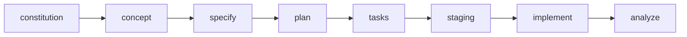

# Spec-Kit Commands Guide

<!-- AUTO-GENERATED - DO NOT EDIT MANUALLY -->
<!-- Generated at: 2026-01-10 -->
<!-- Source: templates/commands/*.md -->

Полное руководство по командам Spec Kit для Spec-Driven Development.

---

## Содержание

- [1. /speckit.constitution](#speckitconstitution)
- [2. /speckit.concept](#speckitconcept)
- [3. /speckit.validate-concept](#speckitvalidate-concept)
- [4. /speckit.specify](#speckitspecify)
- [5. /speckit.clarify](#speckitclarify)
- [6. /speckit.design](#speckitdesign)
- [7. /speckit.plan](#speckitplan)
- [8. /speckit.tasks](#speckittasks)
- [9. /speckit.taskstoissues](#speckittaskstoissues)
- [10. /speckit.staging](#speckitstaging)
- [11. /speckit.analyze](#speckitanalyze)
- [12. /speckit.reverse-engineer](#speckitreverse-engineer)
- [13. /speckit.fix](#speckitfix)
- [14. /speckit.implement](#speckitimplement)
- [15. /speckit.verify](#speckitverify)
- [16. /speckit.preview](#speckitpreview)
- [17. /speckit.list](#speckitlist)
- [18. /speckit.switch](#speckitswitch)
- [19. /speckit.extend](#speckitextend)
- [20. /speckit.merge](#speckitmerge)
- [21. /speckit.baseline](#speckitbaseline)
- [22. /speckit.checklist](#speckitchecklist)
- [23. /speckit.discover](#speckitdiscover)
- [24. /speckit.integrate](#speckitintegrate)
- [25. /speckit.monitor](#speckitmonitor)
- [26. /speckit.launch](#speckitlaunch)
- [27. /speckit.ship](#speckitship)
- [28. /speckit.concept-variants](#speckitconcept-variants)
- [29. /speckit.migrate](#speckitmigrate)
- [30. /speckit.properties](#speckitproperties)
- [31. /speckit.mobile](#speckitmobile)

---

## Основной Workflow



---

## Детальное описание команд

### 1. `/speckit.constitution` {#speckitconstitution}

**Назначение:** Create or update the project constitution with layered architecture support (base → domain → project layers).

**Модель:** `opus` (thinking_budget: 16000)

**Handoffs:**

- → `/speckit.specify`
- → `/speckit.analyze`

---

### 2. `/speckit.concept` {#speckitconcept}

**Назначение:** Capture complete service concept before detailed specification. Creates hierarchical feature breakdown with full traceability. Use BEFORE /speckit.specify for large projects (50+ requirements).

**Модель:** `opus` (thinking_budget: 16000)

**Domain Immersion (v0.0.120):**

Автоматическое погружение в предметную область с помощью 9 research agents:

- **Wave 1 (Research, 7 agents)**: market-researcher, competitive-analyst, persona-designer, standards-researcher (PCI-DSS, GDPR, HIPAA), academic-researcher (papers, whitepapers), community-intelligence (Stack Overflow, GitHub), trend-analyst
- **Wave 2 (Synthesis, 2 agents)**: glossary-builder (авто-генерация терминологии), constraints-analyzer (технические ограничения)

**Knowledge Base Generation:**
- `memory/knowledge/glossaries/{domain}.md` — автоматический глоссарий
- `memory/knowledge/best-practices/by-domain/{domain}.md` — проверенные паттерны
- `memory/knowledge/standards/compliance/{standard}.md` — чек-листы соответствия
- `memory/knowledge/constraints/platforms/{tech}.md` — технические ограничения

**Evidence Tier Enhancement:**
- **AUTHORITATIVE** (35 points) — RFC, ISO standards, PCI-DSS, GDPR, vendor API docs (<90 days)

**Plan Mode Enhancement (v0.4.0):**

Опциональное улучшение (агрессивные настройки — concept выигрывает от глубокого исследования):

**Уровни глубины:**

| Уровень | Авто-включение | Описание |
|---------|----------------|----------|
| L0 | TRIVIAL | Standard mode |
| L1 | SIMPLE | Lite: 2 агента exploration (90s) |
| L2 | MODERATE | Moderate: 4 агента + constitution review (210s) |
| L3 | COMPLEX | Full: exploration + 4 review passes (300s) |

**Причина агрессивности:** Концептуальная проработка критична для успеха проекта
**Exploration (L1+):** Расширенное исследование паттернов и альтернатив
**Review (L2+):** Полная валидация constitution, completeness, edge cases
**Выход:** `research.md` с глубоким анализом

**Флаги:**

- `--depth-level <0-3>` — Явное указание уровня глубины
- `--plan-mode` — Алиас для `--depth-level 3` (Full)
- `--no-plan-mode` — Алиас для `--depth-level 0` (Standard)

**Handoffs:**

- → `/speckit.specify`
- → `/speckit.analyze`

---

### 3. `/speckit.validate-concept` {#speckitvalidate-concept}

**Назначение:** Re-validate an existing concept against current market conditions. Runs research agents to detect changes in market, competitors, and trends. Generates diff report and CQS delta. Use periodically (monthly/quarterly) to keep concept fresh.

**Модель:** `sonnet` (thinking_budget: 12000)

**Persona:** `concept-validator`

**Handoffs:**

- → `/speckit.concept`
- → `/none`

---

### 4. `/speckit.specify` {#speckitspecify}

**Назначение:** Create or update the feature specification from a natural language feature description. Supports both standalone features and concept-derived specifications with full traceability.

**Модель:** `opus` (thinking_budget: 16000)

**Persona:** `product-agent`

**Domain Context Loading (v0.0.120):**

Автоматическая загрузка контекста предметной области через **domain-context-loader agent**:

- **Auto-Link Glossary Terms**: Автоматическая подстановка определений при первом упоминании терминов
- **Auto-Generate Compliance NFRs**: Автоматическая генерация NFR для соответствия стандартам на основе ключевых слов:
  - "store credit card" → `NFR-SEC-PCI-001` (PCI-DSS Req 3.4)
  - "patient data" → `NFR-SEC-HIPAA-001` (HIPAA Privacy Rule)
  - "EU users" → `NFR-SEC-GDPR-001` (GDPR Art. 17)
- **Best Practices References**: Автоматическое добавление ссылок на best practices в Technical Context
- **Known Constraints**: Документирование известных технических ограничений

**Acceptance Criteria Format (v0.0.121):**

Автоматическая генерация исполняемых критериев приемки в формате Gherkin:

- **Gherkin Format**: Сценарии совместимы с BDD-фреймворками (Cucumber, Behave, SpecFlow, Pytest-BDD)
  - **Feature blocks**: Группировка связанных сценариев по user story
  - **Data tables**: Структурированные тела запросов для POST/PUT/PATCH операций
  - **Multiple assertions**: Статус ответа, поля, тайминг, изменения состояния (Then/And)
  - **Specific values**: Конкретные тестовые данные (например, `user "test@example.com"`) вместо заполнителей
  - **Entity-specific patterns**: Готовые паттерны для Auth, CRUD, File Upload, Search, Payment
  - **Scenario IDs**: AS-xxx сохранены для трассировки в tasks.md
  - **Classification tags**: [HAPPY_PATH], [ERROR_PATH], [BOUNDARY], [SECURITY], [ALT_PATH]
  - **Confidence scores**: 0.0-1.0 оценка важности сценария (≥0.90 = критично для MVP)

- **Visual Acceptance Criteria (YAML)**: Для UI-фич автоматически генерируется визуальная спецификация
  - **Elements**: Все UI-компоненты с свойствами (visible, type, placeholder, validation)
  - **States**: loading, error, success, empty, disabled с изменениями элементов
  - **Responsive**: mobile (<640px), tablet (640-1024px), desktop (>1024px) с адаптацией layout/spacing
  - **Accessibility**: ARIA-метки, роли, навигация с клавиатуры, live regions
  - **Interactions**: Триггеры, валидация, действия, ожидаемое время отклика
  - **Performance**: Целевые показатели времени для каждого взаимодействия

**Примеры** доступны в:
- `templates/shared/examples/gherkin-api-example.md` — API с Payment Processing (8 сценариев)
- `templates/shared/examples/gherkin-ui-example.md` — UI с Product Search (10 сценариев + Visual YAML)

**Агенты**:
- **acceptance-criteria-generator**: STEP 5.5 конвертирует таблицы в Gherkin
- **visual-acceptance-generator** (NEW): Генерирует Visual YAML для UI-фич

**Plan Mode Enhancement (v0.4.0):**

Опциональное улучшение с 4 уровнями глубины (аналогично /speckit.plan):

**Уровни глубины:**

| Уровень | Авто-включение | Описание |
|---------|----------------|----------|
| L0 | TRIVIAL, SIMPLE | Standard mode (без exploration) |
| L1 | MODERATE | Lite: 2 агента exploration (90s) |
| L2 | COMPLEX | Moderate: 4 агента + constitution review (210s) |
| L3 | --plan-mode | Full: exploration + 4 review passes (300s) |

**Exploration (L1+):** research.md с паттернами, альтернативами (L2+), constraints
**Review (L2+):** Constitution alignment + completeness/edge case/testability (L3)
**Выход:** `research.md` → context injection в Wave 2 (Analysis) agents

**Флаги:**

- `--depth-level <0-3>` — Явное указание уровня глубины
- `--plan-mode` — Алиас для `--depth-level 3` (Full)
- `--no-plan-mode` — Алиас для `--depth-level 0` (Standard)
- `--model` — Override model selection
- `--skip-gates` — Bypass inline quality gates
- `--strict-gates` — Treat HIGH severity as blocking
- `--full-gates` — Run full validation passes
- `--sequential` — Disable operation batching (execute operations sequentially)

**Inline Quality Gates:**

| Gate ID | Name | Severity | Pass |
|---------|------|----------|------|
| IG-SPEC-001 | Constitution Alignment | CRITICAL | D |
| IG-SPEC-002 | Ambiguity Detection | HIGH | B |
| IG-SPEC-003 | FR-AS Coverage | HIGH | - |
| IG-SPEC-004 | Implementation Details | MEDIUM | - |

**Quality Gates:**

- Spec Quality Gate

**Handoffs:**

- → `/speckit.plan`
- → `/speckit.clarify`
- → `/speckit.analyze` (for full audit)

**Выходные файлы:**

- `spec.md`
- `Checklists/requirements.md`

---

### 5. `/speckit.clarify` {#speckitclarify}

**Назначение:** Identify underspecified areas in the current feature spec by asking up to 5 highly targeted clarification questions and encoding answers back into the spec.

**Модель:** `sonnet` (thinking_budget: 16000)

**Флаги:**

- `--sequential` — Disable operation batching (execute gap searches sequentially)

**Handoffs:**

- → `/speckit.plan`

---

### 6. `/speckit.design` {#speckitdesign}

**Назначение:** Create visual specifications and complete design systems from brand inputs. Orchestrates UX, Product, and Motion Designer agents. Supports design system generation, component library presets, Storybook auto-generation, and Figma token export. Use AFTER /speckit.specify for UI-heavy features OR standalone for design system bootstrapping.

**Модель:** `opus` (thinking_budget: 16000)

**Persona:** `ux-designer-agent`

**Флаги:**

- `--quick` — or `--defaults` flag passed
- `--alternative` — — Generate design for specific alternative (1-5)
- `--all-alternatives` — — Generate designs for ALL alternatives from concept.md
- `--variant` — — Generate design for variant (MINIMAL/BALANCED/AMBITIOUS)
- `--all-variants` — — Generate designs for all 3 scope variants
- `--compare` — — Generate visual comparison matrix alongside designs
- `--viewports` — `"desktop,tablet,mobile"`
- `--no-webp` — `false`
- `--no-optimize` — `false`
- `--interactive` — `true`
- `--parallel` — `true`
- `--max-parallel` — `3`
- `--batch-delay` — `5000`
- `--no-parallel` — -
- `--incremental` — `true`
- `--force` — `false`
- `--reuse-session` — `true`
- `--no-reuse-session` — -
- `--audit-selectors` — `false`
- `--dry-run` — `false`
- `--debug` — `false`
- `--log-level` — `info`
- `--retry-max` — `2`
- `--retry-backoff` — `exponential`
- `--allow-manual-intervention` — `false`
- `--gallery-mode` — `basic`
- `--no-gallery` — `false`
- `--all` — `false`
- `--screens` — -
- `--manual` — `false`
- `--reauth` — `false`
- `--no-figma` — `false`
- `--sequential` — Disable operation batching (execute context reads sequentially)

**Aesthetic Presets** (v0.1.2):

Brand-inspired visual styles that can be combined with any framework preset.

| Preset | Brand | Best For | Accent | Font | Base Size |
|--------|-------|----------|--------|------|-----------|
| `linear` | Linear.app | Dev tools, productivity | Purple #5e6ad2 | Inter | 13px |
| `stripe` | Stripe | Fintech, enterprise | Indigo #635bff | Söhne | 16px |
| `vercel` | Vercel | Developer platforms | Black #000000 | Inter | 16px |
| `notion` | Notion | Content, collaboration | Coral #eb5757 | Inter | 16px |
| `apple` | Apple HIG | Consumer products | Blue #007aff | SF Pro | 17px |
| `airbnb` | Airbnb | Marketplaces, travel | Rausch #ff385c | Cereal | 16px |
| `github` | GitHub | Code platforms | Blue #0969da | System | 14px |
| `slack` | Slack | Communication tools | Aubergine #611f69 | Lato | 15px |
| `figma` | Figma | Design tools | Purple #a259ff | Inter | 14px |

**Usage Examples:**
```bash
# Aesthetic only
/speckit.design --aesthetic linear

# Framework + Aesthetic (recommended)
/speckit.design --library shadcn --aesthetic linear
```

**Preset Types:**

| Type | Purpose | Sets |
|------|---------|------|
| **Framework** | Component structure | Component mappings, base tokens |
| **Aesthetic** | Visual style | Colors, typography, spacing, shadows |

**Token Priority:** Custom overrides → Aesthetic → Framework → Defaults

**Interactive Selection** (NEW v0.1.3):

When running `/speckit.design` without `--quick` flag, the command will ask two new questions:

1. **Q11: Framework Preset** - "Which component framework/library will you use?"
   - Options: shadcn/ui (Recommended), MUI, Tailwind, Vuetify, Bootstrap, Angular Material, Skeleton UI, None
   - Each option includes context about the framework

2. **Q12: Aesthetic Preset** - "Which brand aesthetic would you like to apply?"
   - Options: None, Linear, Stripe, Vercel, Notion, Apple, Airbnb, GitHub, Slack, Figma
   - Each option includes use case context (e.g., "Linear - Clean, minimal (Dev tools)")

**Skip interactive selection:**
- Use `--quick` or `--defaults` flag to use defaults (shadcn/ui framework, no aesthetic)
- Use `--library <name>` flag to specify framework preset directly
- Use `--aesthetic <name>` flag to specify aesthetic preset directly
- Flags take precedence over questionnaire responses

**Quality Improvements** (NEW v0.2.0):

**Chain-of-Thought Reasoning:**
All 10 design subagents now include structured 3-step reasoning process BEFORE task execution:

1. **Analyze Requirements** - Core user goals, constraints, brand identity, competitive landscape
2. **Consider Trade-offs** - Innovation vs. familiarity, consistency vs. flexibility, simplicity vs. power
3. **Apply Design Principles** - Fitts's Law, visual hierarchy, accessibility standards, token governance

**Expected Impact:** +40% design quality improvement (Stanford research)

**Inline Quality Gates:**
- **Pre-Gate:** `IG-DESIGN-001` - Spec Quality Check (SQS >= 70) before design work
- **Post-Gates:**
  - `QG-DQS-001` - Minimum Design Quality Score (DQS >= 70)
  - `QG-DQS-002` - Accessibility Compliance (>= 60%)
  - `QG-DQS-003` - Token Compliance (WCAG 2.1 AA color contrast)
- **Flags:** Respects `--skip-gates`, `--strict-gates`, `--full-gates`

**Anti-Patterns Library:**
Comprehensive negative prompting with 47 anti-patterns across 7 categories:

- **Visual (8)**: Hardcoded colors, inconsistent spacing, multiple primary CTAs
- **Accessibility (10)**: Low contrast, small touch targets, icon-only buttons
- **Component (10)**: Missing loading states, overloaded components, non-semantic HTML
- **Layout (5)**: Fixed pixel widths, cramped mobile, excessive nesting
- **Typography (5)**: Too many font weights, tiny mobile text, line length extremes
- **Animation (5)**: Excessive duration, ignoring motion preferences, jarring easing
- **Performance (5)**: Unoptimized images, blocking fonts, layout shifts

**Expected Impact:** 59-64% reduction in design issues

**Handoffs:**

- → `/speckit.preview`
- → `/speckit.plan`
- → `/speckit.tasks`
- → `/speckit.analyze`
- → `/speckit.analyze`
- → `/speckit.design-promo`
- → `/speckit.preview`
- → `/speckit.design`
- → `/speckit.plan`
- → `/speckit.design`
- → `/speckit.preview`
- → `/speckit.design`
- → `/speckit.design`

**Выходные файлы:**

- `design-system/tokens.json`
- `design-system/README.md`
- `design-tokens/figma-tokens.json`
- `themes.json`
- `metadata.json`
- ... и ещё 1

---

### 7. `/speckit.plan` {#speckitplan}

**Назначение:** Execute the implementation planning workflow using the plan template to generate design artifacts.

**Модель:** `opus` (thinking_budget: 16000)

**Persona:** `architect-agent`

**Требует:** handoffs/specify-to-plan.md

**Domain-Aware Planning (v0.0.120):**

Автоматическая загрузка знаний предметной области перед принятием архитектурных решений:

- **Phase 0.1: Best Practices Loading** — загрузка проверенных паттернов перед генерацией ADR
  - Инъекция best practices в research.md с цитированием источников
  - Пример: "Idempotency Keys for Payments (Stripe Best Practice [AUTHORITATIVE])"
- **Phase 0.2: Constraints Loading** — валидация NFR против технических ограничений
  - Проверка соответствия требованиям лимитам платформ (rate limits, quotas, timeouts)
  - Авто-генерация constraint-driven NFRs
  - Флаги нарушений ДО начала реализации
- **Phase 0.3: Standards Verification** — верификация архитектуры против официальных стандартов
  - Маппинг compliance requirements на implementation
  - Генерация Compliance Traceability Matrix
  - Создание задач верификации соответствия

**Plan Mode Enhancement (v0.4.0):**

Опциональное улучшение с 4 уровнями глубины для более качественной архитектурной проработки:

**Уровни глубины:**

| Уровень | Название | Exploration | Review | Время | Стоимость | Авто-включение |
|---------|----------|-------------|--------|-------|-----------|----------------|
| L0 | Standard | None | None | ~13 min | $0.60 | TRIVIAL, SIMPLE |
| L1 | Lite | 2 агента (90s) | None | ~14.5 min (+12%) | $0.61 (+1%) | MODERATE |
| L2 | Moderate | 4 агента (180s) | 1 проход (30s) | ~16.5 min (+27%) | $0.63 (+6%) | COMPLEX |
| L3 | Full | 4 агента (180s) | 4 прохода (120s) | ~18.5 min (+42%) | $0.67 (+12%) | --plan-mode |

**Триггеры:**
- Авто: Сложность ≥ 71 (COMPLEX tier)
- Авто: Ключевые слова (distributed, microservices, migration, security-critical, real-time, high-availability)
- Вручную: `--plan-mode` (→ L3) или `--depth-level <0-3>`

**Exploration Phase (L1+):**
- pattern-researcher: Поиск похожих реализаций в кодовой базе
- alternative-analyzer: Генерация 3-5 альтернатив со скорингом (L2+ only)
- constraint-mapper: Маппинг NFR → implementation constraints
- best-practice-synthesizer: Синтез находок с рекомендацией (L2+ only)

**Review Phase (L2+):**
- Constitution alignment (L2+): Проверка соответствия constitution
- Completeness check (L3): FR/NFR покрытие ≥90%
- Edge case detection (L3): Pre-Mortem ≥3 сценария
- Testability audit (L3): Критерии приемки + observability

**Выход:** `research.md` с exploration findings (L1+)

**Флаги:**

- `--depth-level <0-3>` — Явное указание уровня глубины
- `--plan-mode` — Алиас для `--depth-level 3` (Full)
- `--no-plan-mode` — Алиас для `--depth-level 0` (Standard)
- `--skip-gates` — Bypass inline quality gates
- `--strict-gates` — Treat HIGH severity as blocking
- `--full-gates` — Run full validation passes
- `--sequential` — Disable operation batching (execute research sequentially)

**Inline Quality Gates:**

| Gate ID | Name | Severity | Pass |
|---------|------|----------|------|
| IG-PLAN-001 | Constitution Alignment | CRITICAL | D |
| IG-PLAN-002 | Tech Consistency | HIGH | F |
| IG-PLAN-003 | Spec Alignment | HIGH | V |
| IG-PLAN-004 | Dependencies Verified | MEDIUM | - |

**Quality Gates:**

- Plan Completeness Gate

**Handoffs:**

- → `/speckit.tasks`
- → `/speckit.checklist`
- → `/speckit.specify`
- → `/speckit.analyze` (for full audit)

---

### 8. `/speckit.tasks` {#speckittasks}

**Назначение:** Generate an actionable, dependency-ordered tasks.md with full traceability to spec requirements and acceptance scenarios.

**Модель:** `sonnet` (thinking_budget: 8000)

**Persona:** `decomposer-agent`

**Требует:** handoffs/plan-to-tasks.md

**Plan Mode Enhancement (v0.4.0):**

Опциональное улучшение (консервативные настройки):

**Уровни глубины:**

| Уровень | Авто-включение | Описание |
|---------|----------------|----------|
| L0 | TRIVIAL, SIMPLE, MODERATE | Standard mode (tasks generation is fast) |
| L1 | COMPLEX | Lite: 2 агента exploration (90s) |

**Причина консервативности:** Генерация tasks быстрая (~2-3 min), минимальный overhead
**Exploration (L1):** Только pattern-researcher + constraint-mapper
**Review:** Не используется (даже на L1)
**Выход:** `research.md` (только при L1)

**Флаги:**

- `--depth-level <0-3>` — Явное указание уровня глубины (макс. полезность L1)
- `--plan-mode` — Алиас для `--depth-level 3` (но эффект как L1)
- `--no-plan-mode` — Алиас для `--depth-level 0` (Standard)
- `--skip-gates` — Bypass inline quality gates
- `--strict-gates` — Treat HIGH severity as blocking
- `--full-gates` — Run full validation passes
- `--sequential` — Disable operation batching (execute mappers sequentially)

**Task Clarity Enhancement** (v0.1.4):

The `/speckit.tasks` command now enforces strict clarity requirements to ensure weak LLMs (Claude Haiku, GPT-3.5) can execute tasks without additional context:

- **Extraction Algorithms**: Automatically extracts concrete details from spec.md and plan.md (entity names, method signatures, API endpoints, test scenarios)
- **IG-TASK-005**: Quality gate that blocks placeholder patterns like `[Entity1]`, `[Service]`, `[scenario description]`
- **Tiered Fallback**: 1-2 missing details → defaults with ⚠️ warning; 3+ missing → blocks and requests clarification
- **Self-Review**: 5 new criteria (SR-TASK-11 to SR-TASK-15) validate task completeness

**Skip gate**: Use `--skip-gates` to bypass validation (not recommended for weak-LLM execution)

**Inline Quality Gates:**

| Gate ID | Name | Severity | Pass |
|---------|------|----------|------|
| IG-TASK-001 | Dependency Graph Valid | CRITICAL | G |
| IG-TASK-002 | FR Coverage | HIGH | H |
| IG-TASK-003 | RTM Validity | MEDIUM | J |
| IG-TASK-004 | Test Coverage | HIGH | QG-TEST-001 |
| IG-TASK-005 | Task Clarity (No Placeholders) | HIGH | - |

**Quality Gates:**

- Tasks Generated Gate
- Tasks Ready Gate
- Dependency Validity Gate

**Handoffs:**

- → `/speckit.implement`
- → `/speckit.tasks`
- → `/speckit.analyze` (for full audit)

---

### 9. `/speckit.taskstoissues` {#speckittaskstoissues}

**Назначение:** Convert existing tasks into actionable, dependency-ordered GitHub issues for the feature based on available design artifacts.

**Модель:** `haiku` (thinking_budget: 8000)

---

### 10. `/speckit.staging` {#speckitstaging}

**Назначение:** Provision Docker Compose staging environment before implementation

**Модель:** `haiku` (thinking_budget: 4000)

**Persona:** `devops-agent`

**Требует:** tasks.md

**Флаги:**

- `--services` — Override default services (postgres,redis,playwright). Comma-separated.
- `--skip-playwright` — Skip Playwright container (useful for unit-test-only features)
- `--reset` — Tear down and recreate all services
- `--status` — Show current staging status without changes
- `--down` — Stop all staging services

**Pre-Gates:**

- Tasks Exist Gate
- Docker Available Gate

**Quality Gates:**

- Staging Ready Gate

**Handoffs:**

- → `/speckit.implement`

**Выходные файлы:**

- `.speckit/staging/docker-compose.yaml`
- `.speckit/staging/test-config.env`

---

### 11. `/speckit.analyze` {#speckitanalyze}

**Назначение:** Full cross-artifact analysis and comprehensive QA verification. Primary use cases: comprehensive audits before major milestones (`--profile full`), post-implementation QA verification (`--profile qa`), generating audit reports (`--json`).

> **Note:** Since v0.0.109, inline quality gates are embedded in `/speckit.specify`, `/speckit.plan`, `/speckit.tasks`, and `/speckit.implement`. Use `/speckit.analyze` for full audits only. Profiles `spec_validate`, `plan_validate`, `tasks_validate` are deprecated for inline use.

**Модель:** `sonnet` (thinking_budget: 16000)

**Persona:** `qa-agent`

**Флаги:**

- `--profile` — Select validation profile: `full` (all passes), `qa` (post-implementation), `drift` (spec-code alignment), `quick` (critical only)
- `--quiet` — Suppress non-essential output (only gates + result)
- `--strict` — Lower thresholds (e.g., ambiguity < 3 instead of 5)
- `--json` — Output as JSON for programmatic consumption

**Pass AA: Drift Detection (v0.4.0):**

Bidirectional spec-code alignment analysis:
- **Forward Drift (Spec → Code)**: Detects unimplemented requirements (FR-xxx in spec.md without code)
- **Reverse Drift (Code → Spec)**: Detects undocumented APIs (public APIs without FR-xxx mapping)
- **Behavioral Drift**: LLM-powered semantic analysis of implementation vs spec intent

**Drift Detection Output:**
- `drift-report.md` with severity breakdown (CRITICAL/HIGH/MEDIUM/LOW)
- Coverage metrics: FR → Code (target: ≥80%), Code → Spec (target: ≥70%)
- Traceability matrix with @speckit annotation tracking
- Auto-fix suggestions for annotation gaps

**Supported Languages:** TypeScript, Python, Go, Java/Kotlin

**Usage:**
```bash
/speckit.analyze --profile drift
# Output: drift-report.md in project root
```

**Quality Gates:**

- No Critical Issues Gate
- Dependency Graph Valid Gate
- SQS Quality Gate
- QA Issues Exist Gate
- QA Pass Gate
- QG-DRIFT-001: No Critical Drift (0 critical items)
- QG-DRIFT-003: FR → Code Coverage (≥80%)

**Handoffs:**

- → `/speckit.specify`
- → `/speckit.plan`
- → `/speckit.tasks`
- → `/speckit.implement`

---

### 12. `/speckit.reverse-engineer` {#speckitreverse-engineer}

**Назначение:** Extract specifications from existing codebase using LLM-powered analysis. Creates `reverse-engineered/` directory with extracted-spec.md for review and merging into canonical spec.

**Модель:** `sonnet` (thinking_budget: 16000)

**Persona:** `documentation-agent`

**Флаги:**

- `--scope` — Scan scope patterns (required): `"src/**/*.ts"`, `"api/**/*.py"`, etc.
- `--exclude` — Exclude patterns (default: `node_modules/`, `dist/`, `build/`)
- `--min-confidence` — Minimum confidence threshold for extraction (0.0-1.0, default: 0.70)
- `--language` — Force language detection (typescript, python, go, java, kotlin)
- `--output-dir` — Override output directory (default: `reverse-engineered/`)
- `--merge-mode` — Auto-merge verified FRs into canonical spec (requires confirmation)

**4-Wave Extraction Algorithm:**

1. **Wave 1: Discovery** (Parallel)
   - Scan files matching `--scope` patterns
   - Extract existing `@speckit:FR:` annotations
   - Build file inventory and annotation registry

2. **Wave 2: Structure Analysis** (Parallel)
   - Extract public APIs (functions, methods, endpoints)
   - Extract domain entities (classes, models, interfaces)
   - Parse test files for scenario patterns

3. **Wave 3: LLM Synthesis** (Sequential - expensive)
   - Synthesize FR-xxx from APIs and entities
   - Convert tests to Gherkin AS-xxx scenarios
   - Assign confidence scores (0.0-1.0) with hallucination detection

4. **Wave 4: Reporting** (Sequential)
   - Compile `extracted-spec.md` following spec-template.md format
   - Compare with canonical spec.md (if exists) → `drift-report.md`
   - Generate `.extraction-manifest.yaml` with metadata

**Confidence Scoring:**

| Range | Level | Description |
|-------|-------|-------------|
| 0.90-1.00 | EXPLICIT | Has `@speckit:FR:` annotation (verified) |
| 0.70-0.89 | HIGH | Clear naming + test coverage + patterns |
| 0.50-0.69 | MEDIUM | Inferred from API/entity patterns |
| 0.00-0.49 | LOW | Speculative (flagged for manual review) |

**Output Structure:**
```
specs/{feature}/
└── reverse-engineered/
    ├── .extraction-manifest.yaml  # Metadata and statistics
    ├── extracted-spec.md          # LLM-synthesized specification
    ├── drift-report.md            # Diff vs canonical spec
    └── extraction-log.md          # Agent reasoning trace
```

**Supported Languages:** TypeScript, Python, Go, Java/Kotlin

**Framework Detection:** Express, NestJS, Next.js, FastAPI, Flask, Django, Gin, Echo, Spring, JAX-RS

**Usage:**
```bash
# Extract from TypeScript source
/speckit.reverse-engineer --scope "src/**/*.ts" --exclude "*.test.ts"

# Extract from Python API
/speckit.reverse-engineer --scope "api/**/*.py" --min-confidence 0.80

# Review extraction
cat reverse-engineered/extracted-spec.md
cat reverse-engineered/.extraction-manifest.yaml
```

**Handoffs:**

- → `/speckit.specify` (to review and merge extracted requirements)
- → `/speckit.analyze --profile drift` (to validate alignment)

**Pre-Gates:**

- Scope Definition Gate: User provided `--scope` flag
- No Existing Extraction Gate: `reverse-engineered/` does not exist

**Post-Gates:**

- Extraction Quality Gate: Extracted spec has ≥ 5 FR-xxx
- Hallucination Check Gate: Average confidence ≥ 0.70
- Low Confidence Review Gate: < 20% of FRs have confidence < 0.70

---

### 13. `/speckit.fix` {#speckitfix}

**Назначение:** Синхронизация спецификаций с вручную измененным кодом. Обнаруживает дрейф (drift) между spec.md/plan.md/tasks.md и реальной реализацией, генерирует предложения по обновлению и применяет изменения с сохранением полной трассируемости.

**Модель:** `sonnet` (thinking_budget: 12000)

**Persona:** `drift-repair-agent`

**Проблема:** Когда разработчики вносят изменения через Claude Code (минуя workflow `/speckit.specify` → `/speckit.plan` → `/speckit.tasks` → `/speckit.implement`), спецификации устаревают:
- ✅ Код имеет новые API → ❌ Не задокументированы в spec.md
- ✅ Поведение кода изменилось → ❌ spec.md описывает старое поведение
- ✅ Добавлены тесты → ❌ Нет AS-xxx в spec.md
- ✅ FR удалены из реализации → ❌ Остались в spec.md (forward drift)

**Решение:** `/speckit.fix` обнаруживает дрейф, генерирует предложения по обновлению и применяет изменения с полной трассируемостью.

**Флаги:**

- `--scope <pattern>` — Паттерн файлов/директорий (default: текущая feature dir)
  - Примеры: `src/auth/`, `**/*.py`, `.` (все файлы)
- `--mode <interactive|auto|preview>` — Режим работы (default: `interactive`)
  - `interactive` — Запрос подтверждения для каждого изменения
  - `auto` — Автоматическое применение (требует `--force`)
  - `preview` — Генерация отчета без применения изменений
- `--artifact <spec|plan|tasks|all>` — Какие артефакты обновлять (default: `all`)
- `--strategy <incremental|regenerate>` — Стратегия обновления (default: `incremental`)
  - `incremental` — Добавить недостающие FR/AS, сохранить структуру (2-3 мин)
  - `regenerate` — Полная перегенерация с трехсторонним слиянием (5-10 мин)
- `--git-diff` — Анализировать только измененные файлы через `git diff HEAD` (default: `true`)
- `--force` — Пропустить подтверждения (только для `--mode auto`)
- `--dry-run` — Показать предложения без применения

**6-Wave Orchestration:**

1. **Wave 1: Detection (Parallel)** — 3 agents
   - `code-scanner`: Обнаружение измененных файлов (git diff или full scan)
   - `drift-detector`: Запуск drift detection framework
   - `annotation-collector`: Сбор всех `@speckit:FR:`, `@speckit:AS:`, `[TEST:AS-xxx]` аннотаций

2. **Wave 2: Analysis (Parallel)** — 3 agents
   - `impact-analyzer`: Определение затронутых FR/AS
   - `gap-analyzer`: Поиск недостающих требований
   - `conflict-detector`: Обнаружение orphan annotations, дубликатов FR

3. **Wave 3: Proposal Generation (Sequential)** — 3 agents
   - `spec-proposer`: Генерация предложений для spec.md
   - `plan-proposer`: Генерация предложений для plan.md
   - `tasks-proposer`: Генерация предложений для tasks.md

4. **Wave 4: User Interaction (Conditional)** — Только для `--mode interactive`
   - Отображение каждого предложения с diff preview
   - Запрос пользователя: `[Y/n/e/skip/quit]`

5. **Wave 5: Application (Sequential)** — 3 agents
   - `artifact-updater`: Применение изменений к spec/plan/tasks/code
   - `registry-updater`: Обновление `.artifact-registry.yaml` (checksums, versions, drift metrics)
   - `system-spec-updater`: Обновление system specs (append-only history)

6. **Wave 6: Validation (Parallel)** — 3 agents
   - `drift-validator`: Повторный запуск drift detection
   - `traceability-validator`: Валидация FR/AS IDs
   - `cross-reference-validator`: Проверка зависимостей

**Типы дрейфа:**

| Тип | Описание | Пример |
|-----|----------|--------|
| Forward Drift | Spec описывает функцию, не реализованную в коде | FR-007 не имеет реализации |
| Reverse Drift | Код содержит функцию, не описанную в spec | API `archiveUser()` без FR |
| Behavioral Drift | Поведение кода отличается от описания в spec | Spec: возврат 401, код: возврат 403 |

**Стратегии обновления:**

**Incremental (default):**
- Добавить недостающие FR-xxx (новые ID: FR-009, FR-010, ...)
- Добавить недостающие AS-xxx (AS-9A, AS-9B, ...)
- Добавить `@speckit:FR:` аннотации в код
- Добавить задачи в tasks.md с правильными зависимостями
- **Pros**: Быстро (2-3 мин), низкий риск, сохраняет структуру
- **Cons**: Может накапливать несоответствия со временем

**Regenerate:**
- Запуск `/speckit.reverse-engineer` для извлечения полной спецификации
- Трехстороннее слияние: canonical spec + extracted spec → merged spec
- Сохранение ручных правок в canonical spec
- **Pros**: Комплексный, исправляет behavioral drift
- **Cons**: Медленнее (5-10 мин), риск перезаписи ручных правок

**Git Integration:**
- По умолчанию анализирует только файлы из `git diff HEAD`
- Скорость: 10-50x быстрее для больших кодовых баз
- Fallback на full scan если не git repo

**Предложения (Proposals):**

Каждое предложение содержит:
- **Type**: `ADD_FR`, `UPDATE_FR`, `REMOVE_FR`, `MOVE_FR_TO_OUT_OF_SCOPE`, `ADD_AS`, `ADD_ANNOTATION`, `ADD_TASK`, etc.
- **Severity**: `CRITICAL` 🔴 | `HIGH` 🟠 | `MEDIUM` 🟡 | `LOW` 🟢
- **Confidence**: 0.0-1.0 (на основе аннотаций, тестов, naming clarity, docstrings)
- **Diff preview**: Unified diff формат для просмотра изменений
- **Secondary changes**: Связанные изменения (например, добавление аннотации после FR)

**Пример предложения (Interactive Mode):**

```text
═══════════════════════════════════════════════════════════════════════════════
Proposal 1/15: ADD_FR
═══════════════════════════════════════════════════════════════════════════════

🟠 HIGH  [+ ADD FR]  ✓ High (0.82)

## Summary
Add new functional requirement for undocumented API

## Current State
API exists but not documented in spec

Evidence:
  • Function archiveUser found at src/api/users.ts:142
  • No @speckit:FR: annotation
  • No corresponding FR in spec.md
  • 3 tests reference this function

## Proposed Change
Target: spec.md § Functional Requirements
Action: add

New Functional Requirement:

  FR-009: User can archive their account

  Description:
    The system MUST provide an API endpoint POST /api/v1/users/:id/archive
    that allows users to archive their account...

## Secondary Changes
  ADD_ANNOTATION → src/api/users.ts:142

## Impact
Files affected: spec.md, src/api/users.ts
Traceability: FR-009
Risk: LOW

## Diff Preview
--- spec.md
+++ spec.md
@@ -45,6 +45,15 @@

 ## Functional Requirements

+### FR-009: User Account Archival
+
+**Description**: User can archive their account...
...

───────────────────────────────────────────────────────────────────────────────
Apply this change? [Y/n/e/skip/quit]
───────────────────────────────────────────────────────────────────────────────
```

**Usage:**

```bash
# Interactive fix (default)
/speckit.fix

# Fix только измененные файлы (git diff)
/speckit.fix --scope "src/auth/" --git-diff

# Auto-fix с принудительным применением
/speckit.fix --mode auto --force

# Preview без применения изменений
/speckit.fix --mode preview

# Regenerate стратегия (полная перегенерация)
/speckit.fix --strategy regenerate --artifact spec

# Fix только spec.md
/speckit.fix --artifact spec --mode interactive
```

**Handoffs:**

- → `/speckit.implement` (продолжить реализацию после fix)
- → `/speckit.analyze --profile drift` (повторная проверка после fix)

**Pre-Gates (QG-FIX-001 to QG-FIX-003):**

- Artifacts Exist Gate: spec.md существует
- Clean Working Directory Gate: Нет uncommitted изменений в spec/plan/tasks (если не `--force`)
- Git Repo Available Gate: git status возвращает 0 (если `--git-diff`)

**Post-Gates (QG-FIX-101 to QG-FIX-104):**

- Drift Reduction Gate: Оставшийся drift < Исходный drift
- Traceability Valid Gate: Все FR IDs уникальны и последовательны
- Registry Updated Gate: `.artifact-registry.yaml` checksums соответствуют файлам
- Validation Passed Gate: Все валидаторы вернули SUCCESS

**Edge Cases:**

- **ID Collision**: Если FR-009 уже существует → использовать FR-010
- **Orphan Annotations**: `@speckit:FR:FR-999` без FR-999 в spec → удалить или добавить placeholder
- **Concurrent Modification**: Изменения в spec.md во время работы → обнаружение по checksum, откат
- **Validation Failure**: Откат из backup файлов при ошибке валидации

**Behavioral Drift Policy:** "Code is truth" — обновлять spec в соответствии с кодом

---

### 14. `/speckit.implement` {#speckitimplement}

**Назначение:** Execute the implementation plan, generate documentation (RUNNING.md, README.md), and validate with self-review. Enforces inline quality gates for pre-implementation checks and post-implementation validation.

**Модель:** `opus` (thinking_budget: 16000)

**Persona:** `developer-agent`

**Требует:** handoffs/tasks-to-implement.md

**Флаги:**

- `--skip-gates` — Bypass all inline quality gates
- `--skip-pre-gates` — Skip only pre-implementation gates
- `--strict-gates` — Treat HIGH severity as blocking
- `--fast` — Fast mode - run only Tier 1-2 validation
- `--sequential-tasks` — Disable task batching (execute tasks one-by-one)
- `--sequential-waves` — Disable wave overlap optimization
- `--no-auto-framework` — Disable automatic test framework installation (skip auto-remediation)

**Task Batching (v0.0.110):**

Tasks are grouped by dependency level and executed as parallel Task tool calls:
- Independent tasks → single message with 4-8 parallel Task calls
- 60-75% time savings vs sequential execution
- Skip with `--sequential-tasks` flag

**Pre-Implementation Inline Gates:**

| Gate ID | Name | Severity | Ref |
|---------|------|----------|-----|
| IG-IMPL-001 | Staging Ready | CRITICAL | QG-STAGING-001 |
| IG-IMPL-002 | SQS Threshold | CRITICAL | QG-001 |
| IG-IMPL-003 | Tasks Exist | CRITICAL | - |
| IG-IMPL-004 | Required Artifacts | CRITICAL | - |
| IG-IMPL-005 | Properties Available | MEDIUM | - |

**Post-Implementation Inline Gates:**

| Gate ID | Name | Severity | Pass |
|---------|------|----------|------|
| IG-IMPL-101 | Build Success | CRITICAL | R |
| IG-IMPL-102 | Tests Pass | CRITICAL | S |
| IG-IMPL-103 | Coverage >= 80% | HIGH | T |
| IG-IMPL-104 | Lint Clean | HIGH | U |

**Quality Gates:**

- Implementation Complete Gate
- Build Artifacts Gate
- QG-004: Test Coverage Gate
- QG-005: Type Coverage Gate
- QG-006: Lint Gate

**Handoffs:**

- → `/speckit.analyze` (for full QA audit)
- → `/speckit.verify` (for comprehensive verification)
- → `/speckit.implement`
- → `/speckit.tasks`
- → `/speckit.specify`

---

### 15. `/speckit.verify` {#speckitverify}

**Назначение:** Verify implementation against specification after /speckit.implement. Comprehensive post-implementation verification covering 5 layers: acceptance criteria (AS-xxx scenarios), API contracts, visual verification (screenshots + pixelmatch), E2E behaviors, and NFR compliance. Generates detailed report with auto-fix suggestions for common issues. Requires 90% overall pass rate to proceed.

**Модель:** `sonnet` (thinking_budget: 8000)

**Persona:** `qa-agent`

**Флаги:**

- `--no-auto-fix` — Disable automatic fix application (report only)
- `--threshold N` — Override pass threshold (0-100, default: 90)
- `--skip-visual` — Skip visual regression testing
- `--skip-nfr` — Skip NFR verification (performance, accessibility)
- `--baseline` — Update visual baselines instead of comparing
- `--json` — Output JSON summary only (no markdown report)
- `--ci` — CI mode: no interactive prompts, fail on threshold
- `--fix-and-verify` — Apply fixes and re-run verification automatically
- `--skip-gates` — Skip all inline quality gates

**Pre-Implementation Inline Gates:**

| Gate ID | Name | Severity |
|---------|------|----------|
| IG-VERIFY-001 | Implementation Complete | CRITICAL |
| IG-VERIFY-002 | Staging Available | HIGH |
| IG-VERIFY-003 | Test Framework Ready | CRITICAL |

**Post-Implementation Inline Gates:**

| Gate ID | Name | Severity | Threshold |
|---------|------|----------|-----------|
| IG-VERIFY-101 | Verification Threshold | CRITICAL | 90% |
| IG-VERIFY-102 | Critical Failures | CRITICAL | 0 |

**Verification Layers:**

1. **Acceptance Criteria** — All AS-xxx scenarios implemented and passing
2. **API Contracts** — Endpoints match spec.md definitions (schema, status codes)
3. **Visual Verification** — UI matches Visual YAML specs (Playwright + pixelmatch)
4. **Behavior** — E2E user flows work as specified
5. **NFRs** — Performance, accessibility, security thresholds met

**Auto-Fix Logic:**

- Simple changes auto-fixed: constant values, imports, CSS properties, class names
- Complex changes flagged for manual fix: component additions, refactoring, logic changes
- Max 3 iterations per fix attempt

**Handoffs:**

- → `/speckit.implement` (if verification fails)
- → `/speckit.analyze` (for deeper analysis)

---

### 16. `/speckit.preview` {#speckitpreview}

**Назначение:** Generate interactive previews from design specifications. Converts wireframes to visual HTML, generates component previews, captures screenshots, and runs design quality validation.

**Модель:** `opus` (thinking_budget: 16000)

**Persona:** `product-designer-agent`

**Флаги:**

- `--all-alternatives` — Generate preview gallery for ALL alternatives
- `--all-variants` — Generate previews for all scope variants
- `--compare` — Generate side-by-side comparison view
- `--quick` — `--skip quality,gallery,deploy,frames`
- `--ci` — `--no-open --baseline check --gate 80 --skip deploy`
- `--review` — `--deploy --device all --gate 80`
- `--preview-mode` — Override model selection

**Screenshot Quality (NEW v0.2.0):**

Все скриншоты теперь генерируются с Retina/HiDPI качеством (2x device scale) для четкого отображения на всех дисплеях:

| Viewport | Размер | Выходное разрешение |
|----------|---------|---------------------|
| Mobile | 375×812px | 750×1624px (2x) |
| Tablet | 768×1024px | 1536×2048px (2x) |
| Desktop | 1440×900px | 2880×1800px (2x) |

**Преимущества:**
- Четкие скриншоты на дисплеях с высокой плотностью пикселей
- Лучшее качество для визуальной валидации дизайна
- Совместимость с современными мониторами (Retina, 4K, HiDPI)
- Подходит для презентаций и дизайн-ревью

**Техническая реализация:**
```javascript
// Playwright configuration
await page.screenshot({
  deviceScaleFactor: 2,  // Retina/HiDPI quality
  type: 'png'
});
```

**Handoffs:**

- → `/speckit.implement`
- → `/speckit.design`
- → `/speckit.design-generate`

---

### 17. `/speckit.list` {#speckitlist}

**Назначение:** List all features in the project with their current status. Shows feature registry from manifest and indicates which feature is currently active.

**Модель:** `haiku` (thinking_budget: 4000)

**Флаги:**

- `--json` — Output in JSON format
- `--tree` — Show feature evolution tree (parent-child relationships)

**Handoffs:**

- → `/speckit.switch`
- → `/speckit.specify`

---

### 18. `/speckit.switch` {#speckitswitch}

**Назначение:** Switch to a different feature to continue working on it. Updates the active feature state and optionally checks out the corresponding git branch.

**Модель:** `haiku` (thinking_budget: 4000)

**Флаги:**

- `--json` — Output in JSON format
- `--repair` — Regenerate manifest from directory structure
- `--no-git` — Skip git branch checkout

**Handoffs:**

- → `/speckit.specify`
- → `/speckit.plan`
- → `/speckit.tasks`
- → `/speckit.implement`

---

### 19. `/speckit.extend` {#speckitextend}

**Назначение:** Extend a merged feature with new capabilities. Creates a new feature branch with Feature Lineage pre-populated, loading context from the parent feature and its system specs.

**Модель:** `sonnet` (thinking_budget: 8000)

**Quality Gates:**

- Extension Valid Gate

**Handoffs:**

- → `/speckit.specify`
- → `/speckit.view`
- → `/speckit.analyze`

**Выходные файлы:**

- `spec.md`

---

### 20. `/speckit.merge` {#speckitmerge}

**Назначение:** Finalize feature and update system specs after PR merge. Converts feature requirements into living system documentation.

**Модель:** `sonnet` (thinking_budget: 16000)

**Handoffs:**

- → `/speckit.analyze`
- → `/speckit.specify`

---

### 21. `/speckit.baseline` {#speckitbaseline}

**Назначение:** Capture current state of system components for brownfield specifications. Generates baseline.md documenting existing behaviors, code structure, and dependencies.

**Модель:** `sonnet` (thinking_budget: 16000)

**Pre-Gates:**

- Feature Directory Gate
- Scope Definition Gate

**Quality Gates:**

- Baseline Completeness Gate
- Code Location Validity Gate
- Baseline Exists Gate

**Handoffs:**

- → `/speckit.specify`
- → `/speckit.plan`

**Выходные файлы:**

- `FEATURE_DIR/baseline.md`

---

### 22. `/speckit.checklist` {#speckitchecklist}

**Назначение:** Generate a custom checklist for the current feature based on user requirements.

**Модель:** `sonnet` (thinking_budget: 8000)

---

### 23. `/speckit.discover` {#speckitdiscover}

**Назначение:** Validate problem-solution fit before building through customer discovery

**Модель:** `opus` (thinking_budget: 16000)

**Persona:** `product-agent`

**Handoffs:**

- → `/speckit.concept`
- → `/speckit.discover`

**Выходные файлы:**

- `docs/discover/hypothesis.md`
- `docs/discover/interview-guide.md`
- `docs/discover/scoring-template.md`
- `docs/discover/analysis.md`
- `docs/discover/decision.md`
- ... и ещё 5

---

### 24. `/speckit.integrate` {#speckitintegrate}

**Назначение:** Quick integration with common third-party services

**Модель:** `sonnet` (thinking_budget: 16000)

**Persona:** `developer-agent`

**Handoffs:**

- → `/speckit.implement`

---

### 25. `/speckit.monitor` {#speckitmonitor}

**Назначение:** Set up production observability with OpenTelemetry, dashboards, and alerting

**Модель:** `sonnet` (thinking_budget: 16000)

**Persona:** `devops-agent`

**Handoffs:**

- → `/speckit.monitor`
- → `/speckit.launch`

**Выходные файлы:**

- `docs/monitor.md`
- `infra/observability/docker-compose.yml`

---

### 26. `/speckit.launch` {#speckitlaunch}

**Назначение:** Automate product launch and go-to-market activities

**Модель:** `sonnet` (thinking_budget: 16000)

**Persona:** `marketing-agent`

**Handoffs:**

- → `/speckit.ship`
- → `/speckit.monitor`
- → `/speckit.implement`

**Выходные файлы:**

- `docs/launch/launch-plan.md`
- `docs/launch/readiness-report.md`
- `docs/launch/social-content.md`
- `docs/launch/email-templates.md`
- `docs/launch/growth-playbook.md`
- ... и ещё 2

---

### 27. `/speckit.ship` {#speckitship}

**Назначение:** Provision infrastructure, deploy application, and verify running system in one command

**Модель:** `sonnet` (thinking_budget: 16000)

**Persona:** `devops-agent`

**Флаги:**

- `--env` — Target environment (local, staging, production). Default: staging
- `--only` — Run only specific stage (infra, deploy, verify). Default: all
- `--destroy` — Tear down infrastructure and deployment
- `--dry-run` — Show plan without executing
- `--cloud` — Override cloud provider (vk, yandex, gcp)
- `--skip-verify` — Skip verification stage
- `--turbo` — Enable maximum parallelism and skip optional checks
- `--safe` — Use sequential execution with full validation
- `--skip-provision` — Skip provision if fingerprint unchanged
- `--force-deploy` — Force deploy even if version unchanged
- `--force-provision` — Force provision even if fingerprint unchanged
- `--full-e2e` — Run full E2E suite instead of contract tests
- `--full-tests` — Run full test suite instead of incremental
- `--auto-rollback` — Automatically rollback on verification failure
- `--no-rollback` — Disable automatic rollback prompts
- `--sequential-phases` — Disable wave overlap optimization
- `--no-browser-pool` — Disable browser pool pre-warming
- `--no-fingerprint` — Disable fingerprint-based skip logic
- `--no-test-cache` — Ignore cached test results

**Pre-Gates:**

- Implementation Exists Gate
- Ship Config Exists Gate

**Quality Gates:**

- Verification Issues Exist Gate
- Deployment Success Gate

**Handoffs:**

- → `/speckit.implement`
- → `/speckit.specify`
- → `/speckit.analyze`

**Выходные файлы:**

- `/infra-outputs.json`
- `FEATURE_DIR/verify-results.md`

---

### 28. `/speckit.concept-variants` {#speckitconcept-variants}

**Назначение:** Generate MINIMAL/BALANCED/AMBITIOUS scope variants for existing concept

**Модель:** `sonnet` (thinking_budget: 8000)

---

### 29. `/speckit.migrate` {#speckitmigrate}

**Назначение:** Plan and execute spec-driven modernization between architectures, versions, and cloud providers

**Модель:** `opus` (thinking_budget: 32000)

**Persona:** `architect-agent`

**Флаги:**

- `--from` — Source architecture to migrate from (monolith, legacy, etc.)
- `--upgrade` — Target version/runtime to upgrade to (node18, postgres16, python312, etc.)
- `--to-cloud` — Target cloud provider (aws, gcp, azure, vk-cloud)
- `--scope` — Limit analysis to specific paths (default: entire codebase)
- `--output` — Output verbosity (minimal, standard, detailed). Default: standard
- `--dry-run` — Show migration plan without generating files

**Pre-Gates:**

- Codebase Exists Gate
- Migration Type Gate

**Quality Gates:**

- Migration Plan Complete Gate
- Risk Mitigation Gate
- Migration Plan Exists Gate

**Handoffs:**

- → `/speckit.plan`
- → `/speckit.tasks`

**Выходные файлы:**

- `baseline.md`

---

### 30. `/speckit.properties` {#speckitproperties}

**Назначение:** Extract properties from spec artifacts and generate property-based tests with EARS transformation. Creates PROP-xxx traced to AS/EC/FR/NFR for comprehensive edge case discovery via PGS (Property-Generated Solver) methodology.

**Модель:** `sonnet` (thinking_budget: 16000)

**Persona:** `qa-agent`

**Требует:** specs/[feature]/spec.md

**Quality Gates:**

- Property Quality Gate
- Property Coverage Gate

**Handoffs:**

- → `/speckit.implement`
- → `/speckit.specify`
- → `/speckit.analyze`

---

### 31. `/speckit.mobile` {#speckitmobile}

**Назначение:** Orchestrate mobile development with specialized agents. Activates platform-specific expertise (KMP/Flutter/React Native), calculates Mobile Quality Score (MQS), and ensures production-ready mobile applications.

**Модель:** `sonnet` (thinking_budget: high)

**Persona:** `mobile-developer-agent`

**Режимы:**

| Mode | Trigger | Purpose |
|------|---------|---------|
| `auto` | Platform detected via platform-detection.md | Automatically select platform and apply expertise |
| `kmp` | `--platform kmp` OR `shared/build.gradle.kts` exists | Apply KMP-specific patterns and validation |
| `flutter` | `--platform flutter` OR `pubspec.yaml` exists | Apply Flutter-specific patterns and validation |
| `react_native` | `--platform react-native` OR `metro.config.js` exists | Apply React Native-specific patterns and validation |

**Skills:**

- `mobile-architecture` — Cross-platform architecture decisions
- `mobile-performance` — Performance optimization
- `mobile-testing` — Testing strategy
- `kmp-expert` — KMP-specific patterns (conditional)
- `flutter-expert` — Flutter-specific patterns (conditional)
- `react-native-expert` — React Native-specific patterns (conditional)

**Флаги:**

- `--platform <kmp|flutter|react-native|native>` — Override auto-detection
- `--skip-mqs` — Skip MQS calculation (not recommended)
- `--mqs-threshold <N>` — Override default 75 threshold

**Mobile Quality Score (MQS):**

| Dimension | Points | Criteria |
|-----------|--------|----------|
| Architecture | 25 | Layer separation, DI, state management |
| Performance | 20 | Cold start <2s, 60 FPS, memory <150MB |
| Platform Parity | 20 | Feature/UX consistency across platforms |
| Testing | 20 | Unit 80%, binding 100%, E2E critical paths |
| Accessibility | 15 | A11y labels, screen reader, touch targets |
| **Total** | **100** | **Threshold: ≥75** |

**Pre-Gates:**

- QG-MOBILE-001: Platform successfully detected
- QG-MOBILE-002: Required dependencies present

**Quality Gates:**

- QG-MQS-001: Architecture score ≥ 20/25
- QG-MQS-002: Performance score ≥ 15/20
- QG-MQS-003: Platform parity ≥ 15/20
- QG-MQS-004: Testing coverage ≥ 15/20 (CRITICAL)
- QG-MQS-005: Accessibility ≥ 10/15
- QG-MQS: Total MQS ≥ 75/100 (CRITICAL)

**Handoffs:**

- → `/speckit.plan` — Create technical plan with mobile architecture decisions
- → `/speckit.tasks` — Generate tasks with platform-specific and binding test tasks
- → `/speckit.implement` — Execute implementation with mobile patterns
- → `/speckit.analyze` — Validate MQS and binding coverage

**Выходные файлы:**

- `memory/mqs-report.md` — Detailed quality breakdown
- `memory/mobile-architecture.md` — Architecture decisions
- `memory/mobile-improvements.md` — Recommended fixes
- `memory/binding-coverage.md` — ViewModel test mapping

---

## Quick Reference

### Команды по категориям

| Категория | Команды |
|-----------|---------|
| Foundation | `/speckit.constitution` |
| Discovery | `/speckit.concept`, `/speckit.validate-concept`, `/speckit.discover` |
| Specification | `/speckit.specify`, `/speckit.clarify`, `/speckit.design` |
| Planning | `/speckit.plan`, `/speckit.tasks`, `/speckit.taskstoissues` |
| Implementation | `/speckit.staging`, `/speckit.implement`, `/speckit.preview` |
| Quality | `/speckit.analyze`, `/speckit.reverse-engineer`, `/speckit.checklist` |
| Navigation | `/speckit.list`, `/speckit.switch`, `/speckit.extend`, `/speckit.merge` |
| Mobile | `/speckit.mobile` |
| Operations | `/speckit.baseline`, `/speckit.integrate`, `/speckit.monitor`, `/speckit.launch`, `/speckit.ship` |

### Флаги команд

| Команда | Флаг | Описание |
|---------|------|----------|
| `/speckit.specify` | `--model` | Override model selection |
| `/speckit.design` | `--quick` | or \`--defaults\` flag passed |
| `/speckit.design` | `--alternative` | — Generate design for specific alternative (1-5) |
| `/speckit.design` | `--all-alternatives` | — Generate designs for ALL alternatives from conce... |
| `/speckit.design` | `--variant` | — Generate design for variant (MINIMAL/BALANCED/AM... |
| `/speckit.design` | `--all-variants` | — Generate designs for all 3 scope variants |
| `/speckit.design` | `--compare` | — Generate visual comparison matrix alongside desi... |
| `/speckit.design` | `--viewports` | \`"desktop,tablet,mobile"\` |
| `/speckit.design` | `--no-webp` | \`false\` |
| `/speckit.design` | `--no-optimize` | \`false\` |
| `/speckit.design` | `--interactive` | \`true\` |
| `/speckit.design` | `--parallel` | \`true\` |
| `/speckit.design` | `--max-parallel` | \`3\` |
| `/speckit.design` | `--batch-delay` | \`5000\` |
| `/speckit.design` | `--no-parallel` | - |
| `/speckit.design` | `--incremental` | \`true\` |
| `/speckit.design` | `--force` | \`false\` |
| `/speckit.design` | `--reuse-session` | \`true\` |
| `/speckit.design` | `--no-reuse-session` | - |
| `/speckit.design` | `--audit-selectors` | \`false\` |
| `/speckit.design` | `--dry-run` | \`false\` |
| `/speckit.design` | `--debug` | \`false\` |
| `/speckit.design` | `--log-level` | \`info\` |
| `/speckit.design` | `--retry-max` | \`2\` |
| `/speckit.design` | `--retry-backoff` | \`exponential\` |
| `/speckit.design` | `--allow-manual-intervention` | \`false\` |
| `/speckit.design` | `--gallery-mode` | \`basic\` |
| `/speckit.design` | `--no-gallery` | \`false\` |
| `/speckit.design` | `--all` | \`false\` |
| `/speckit.design` | `--screens` | - |
| `/speckit.design` | `--manual` | \`false\` |
| `/speckit.design` | `--reauth` | \`false\` |
| `/speckit.design` | `--no-figma` | \`false\` |
| `/speckit.staging` | `--services` | Override default services (postgres,redis,playwrig... |
| `/speckit.staging` | `--skip-playwright` | Skip Playwright container (useful for unit-test-on... |
| `/speckit.staging` | `--reset` | Tear down and recreate all services |
| `/speckit.staging` | `--status` | Show current staging status without changes |
| `/speckit.staging` | `--down` | Stop all staging services |
| `/speckit.analyze` | `--profile` | override remains available for power users |
| `/speckit.analyze` | `--quiet` | Suppress non-essential output (only gates + result... |
| `/speckit.analyze` | `--strict` | Lower thresholds (e.g., ambiguity < 3 instead of 5... |
| `/speckit.analyze` | `--json` | Output as JSON for programmatic consumption |
| `/speckit.reverse-engineer` | `--scope` | Scan scope patterns (required): `"src/**/*.ts"`, `"api/**/*.py"` |
| `/speckit.reverse-engineer` | `--exclude` | Exclude patterns (default: `node_modules/`, `dist/`) |
| `/speckit.reverse-engineer` | `--min-confidence` | Minimum confidence threshold (0.0-1.0, default: 0.70) |
| `/speckit.reverse-engineer` | `--language` | Force language (typescript, python, go, java, kotlin) |
| `/speckit.reverse-engineer` | `--output-dir` | Override output directory (default: `reverse-engineered/`) |
| `/speckit.reverse-engineer` | `--merge-mode` | Auto-merge verified FRs into canonical spec |
| `/speckit.implement` | `--skip-pre-gates` | Skip pre-implementation gates |
| `/speckit.implement` | `--fast` | Fast mode - run only Tier 1-2 validation |
| `/speckit.implement` | `--no-auto-framework` | Disable automatic test framework installation (ski... |
| `/speckit.preview` | `--all-alternatives` | Generate preview gallery for ALL alternatives |
| `/speckit.preview` | `--all-variants` | Generate previews for all scope variants |
| `/speckit.preview` | `--compare` | Generate side-by-side comparison view |
| `/speckit.preview` | `--quick` | \`--skip quality,gallery,deploy,frames\` |
| `/speckit.preview` | `--ci` | \`--no-open --baseline check --gate 80 --skip depl... |
| `/speckit.preview` | `--review` | \`--deploy --device all --gate 80\` |
| `/speckit.preview` | `--preview-mode` | Override model selection |
| `/speckit.list` | `--json` | Output in JSON format |
| `/speckit.list` | `--tree` | Show feature evolution tree (parent-child relation... |
| `/speckit.switch` | `--json` | Output in JSON format |
| `/speckit.switch` | `--repair` | Regenerate manifest from directory structure |
| `/speckit.switch` | `--no-git` | Skip git branch checkout |
| `/speckit.ship` | `--env` | Target environment (local, staging, production). D... |
| `/speckit.ship` | `--only` | Run only specific stage (infra, deploy, verify). D... |
| `/speckit.ship` | `--destroy` | Tear down infrastructure and deployment |
| `/speckit.ship` | `--dry-run` | Show plan without executing |
| `/speckit.ship` | `--cloud` | Override cloud provider (vk, yandex, gcp) |
| `/speckit.ship` | `--skip-verify` | Skip verification stage |
| `/speckit.ship` | `--turbo` | Enable maximum parallelism and skip optional check... |
| `/speckit.ship` | `--safe` | Use sequential execution with full validation |
| `/speckit.ship` | `--skip-provision` | Skip provision if fingerprint unchanged |
| `/speckit.ship` | `--force-deploy` | Force deploy even if version unchanged |
| `/speckit.ship` | `--force-provision` | Force provision even if fingerprint unchanged |
| `/speckit.ship` | `--full-e2e` | Run full E2E suite instead of contract tests |
| `/speckit.ship` | `--full-tests` | Run full test suite instead of incremental |
| `/speckit.ship` | `--auto-rollback` | Automatically rollback on verification failure |
| `/speckit.ship` | `--no-rollback` | Disable automatic rollback prompts |
| `/speckit.ship` | `--sequential-phases` | Disable wave overlap optimization |
| `/speckit.ship` | `--no-browser-pool` | Disable browser pool pre-warming |
| `/speckit.ship` | `--no-fingerprint` | Disable fingerprint-based skip logic |
| `/speckit.ship` | `--no-test-cache` | Ignore cached test results |
| `/speckit.migrate` | `--from` | Source architecture to migrate from (monolith, leg... |
| `/speckit.migrate` | `--upgrade` | Target version/runtime to upgrade to (node18, post... |
| `/speckit.migrate` | `--to-cloud` | Target cloud provider (aws, gcp, azure, vk-cloud) |
| `/speckit.migrate` | `--scope` | Limit analysis to specific paths (default: entire ... |
| `/speckit.migrate` | `--output` | Output verbosity (minimal, standard, detailed). De... |
| `/speckit.migrate` | `--dry-run` | Show migration plan without generating files |
| `/speckit.mobile` | `--platform` | Override auto-detection (kmp, flutter, react-native, native) |
| `/speckit.mobile` | `--skip-mqs` | Skip MQS calculation (not recommended) |
| `/speckit.mobile` | `--mqs-threshold` | Override default 75 threshold |

---

## Версия документа

**Версия:** 0.5.0
**Дата генерации:** 2026-01-11
**Автор:** Auto-generated from command templates
