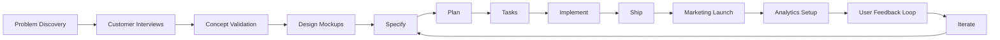

# Spec Kit: Product Strategy & Startup Creation Roadmap

**Дата**: 2025-12-29
**Версия**: 1.0
**Цель**: Трансформация Spec Kit из инструмента разработки в полноценную платформу для создания стартапов за недели

---

## Executive Summary

**Текущее состояние**: Spec Kit — сильный инструмент для генерации кода из спецификаций с автоматизацией developer-роли (80%+), architect-роли (70%), и DevOps-роли (60% с `/speckit.ship`).

**Пробелы**: Слабая автоматизация product management (30%), design (20%), QA (40%), marketing (0%), legal (0%), customer discovery (15%).

**Целевое видение**: Платформа "от идеи до первых пользователей" за 2-4 недели для команд 1-3 человека.

**North Star Metric**: Time-to-First-Customer (дни от идеи до первого платящего пользователя).

**Стратегия**: Интеграция недостающих ролей через skills, templates, и marketplace интеграций, фокус на "missing middle" между концепцией и кодом.

---

## 1. Product Development Roles Coverage Analysis

### 1.1 Текущее покрытие ролей

| Роль | Покрытие | Сильные стороны | Слабые стороны |
|------|:--------:|----------------|----------------|
| **Developer** | 85% | `/specify`, `/plan`, `/tasks`, `/implement` — full workflow, traceability | Нет code review automation, limited refactoring guidance |
| **Architect** | 70% | `/plan` with research.md, dependency verification (Context7), OpenAPI generation | Нет architectural decision records (ADR), limited system design patterns catalog |
| **DevOps** | 60% | `/ship` with provision/deploy/verify, infrastructure-as-code | Нет monitoring setup, limited CI/CD templates, no rollback automation |
| **Product Manager** | 30% | `/concept` with JTBD, market sizing, CQS scoring | Слабая customer discovery, нет roadmap visualization, нет A/B testing guidance |
| **Designer** | 20% | UX Foundation Layer detection, accessibility audit skill | Нет wireframing, visual design, design system generation, user flow diagrams |
| **QA Engineer** | 40% | `/analyze` with traceability, security-audit skill, test-strategy skill | Нет test data generation, limited visual regression, no performance test scaffolding |
| **Marketing** | 0% | — | Полностью отсутствует: GTM planning, messaging, landing pages, growth loops |
| **Legal** | 0% | — | Полностью отсутствует: terms of service, privacy policy, compliance (GDPR, CCPA) |
| **Customer Success** | 0% | — | Полностью отсутствует: onboarding flows, help content, support workflows |

### 1.2 Priority Gap Analysis

**Critical Gaps (блокеры для startups)**:

1. **Customer Discovery** (блокер для product-market fit)
   - Отсутствие customer interview templates
   - Нет validation experiment frameworks
   - Не автоматизирован feedback collection loop

2. **Design System** (блокер для UX consistency)
   - Нет component library generation
   - Отсутствие design tokens (colors, typography, spacing)
   - Не поддерживается Figma integration для handoff

3. **Go-to-Market** (блокер для первых пользователей)
   - Нет landing page generation
   - Отсутствие messaging/positioning templates
   - Не автоматизирована launch checklist

4. **Legal Compliance** (блокер для B2B/regulated markets)
   - Нет privacy policy generator
   - Отсутствие terms of service templates
   - Не поддерживается GDPR/CCPA compliance checks

---

## 2. End-to-End Startup Creation Workflow

### 2.1 Missing Workflow Steps

**Текущий workflow**: Concept → Specify → Plan → Tasks → Implement → Ship

**Целевой workflow** (для стартапов):



**Missing phases** (не покрыты сейчас):

| Phase | Coverage | Gap | Impact |
|-------|:--------:|-----|--------|
| Problem Discovery | 40% | Concept mode есть, но нет structured customer interviews | HIGH - wrong problem → wasted effort |
| Customer Interviews | 15% | Только market-research skill (вторичные данные), нет primary research | CRITICAL - no validation |
| Design Mockups | 10% | UX Foundation есть, но нет wireframe generation | HIGH - UX surprises late |
| Marketing Launch | 0% | Полностью отсутствует | CRITICAL - no users |
| Analytics Setup | 30% | OpenTelemetry in ship, но нет product analytics (Mixpanel/Amplitude) | HIGH - blind to user behavior |
| User Feedback Loop | 20% | Нет in-app feedback, no survey tools, no NPS tracking | HIGH - slow learning |

### 2.2 Automation Opportunities for Missing Phases

**Phase 1: Pre-Concept (Customer Discovery)**

- `/speckit.discover` command:
  - Generate customer interview scripts (Jobs-to-be-Done framework)
  - Create experiment canvas (Lean Startup validation)
  - Build survey templates (Problem validation, willingness-to-pay)
  - Output: `discovery.md` with insights, interview transcripts

**Phase 2: Design & Prototyping**

- `/speckit.design` command (уже в roadmap, надо доделать):
  - Generate wireframes from User Stories (ASCII art → Figma API)
  - Create component inventory (design system primitives)
  - Build user flow diagrams (Mermaid.js)
  - Output: `design/` with wireframes, flow diagrams, design tokens

**Phase 3: Go-to-Market**

- `/speckit.launch` command:
  - Generate landing page from concept.md (value props → HTML/CSS)
  - Create messaging docs (positioning, elevator pitch, feature bullets)
  - Build launch checklist (Product Hunt, Hacker News, social media)
  - Generate press release template (Amazon Working Backwards)
  - Output: `marketing/` with landing page, messaging guide, launch plan

**Phase 4: Analytics & Learning**

- `/speckit.measure` command:
  - Generate analytics schema from success metrics (concept.md → Mixpanel events)
  - Create dashboard templates (North Star metric, AARRR funnel)
  - Build feedback collection (in-app surveys, NPS, feature requests)
  - Output: `analytics/` with event tracking, dashboard configs, feedback forms

---

## 3. Team Collaboration & Parallelization

### 3.1 Current Limitations

**Single-user workflow**:
- Git branch per feature (001-feature-name)
- No concurrent feature development
- No role-based workflows (all commands available to everyone)

**Missing collaboration features**:
- No feature ownership tracking
- No review/approval workflows
- No design → dev handoff protocol
- No QA sign-off gates

### 3.2 Multi-User Collaboration Model

**Proposed: Role-Based Workflow with Handoffs**

```yaml
# .speckit/team.yaml
team:
  - role: product_manager
    members: [alice@startup.com]
    permissions: [concept, specify, clarify]

  - role: designer
    members: [bob@startup.com]
    permissions: [design, ux-audit]

  - role: developer
    members: [charlie@startup.com, dave@startup.com]
    permissions: [plan, tasks, implement]

  - role: qa
    members: [eve@startup.com]
    permissions: [analyze, test-strategy]

workflow:
  - phase: concept
    owner: product_manager
    reviewers: [designer, developer]
    approval_required: 2

  - phase: design
    owner: designer
    reviewers: [product_manager]
    approval_required: 1
    handoff_to: developer

  - phase: implementation
    owner: developer
    reviewers: [qa]
    approval_required: 1
    handoff_to: qa
```

**Workflow enforcement**:

- `/speckit.specify` → creates PR, assigns to designer for review
- `/speckit.design` → creates design handoff doc, assigns to developer
- `/speckit.implement` → creates PR, assigns to QA for testing
- `/speckit.ship` → requires QA approval before production deploy

**Parallel workstreams** (Epic-level isolation):

```bash
# Product Manager работает над Epic-002
git checkout -b epic-002-feature
/speckit.concept "Payment processing epic"

# Developer работает над Epic-001
git checkout -b epic-001-feature/001-auth
/speckit.implement

# Designer работает над Epic-003
git checkout -b epic-003-design
/speckit.design EPIC-003.F01
```

**Merge conflict resolution**:

- Concept-level dependencies tracked in concept.md
- Automatic detection of overlapping entities in data-model.md
- Warning: "EPIC-002 depends on EPIC-001.F01 (not yet merged)"

---

## 4. Quality Gates & Validation

### 4.1 Current Quality Gates

**Существующие gates** (уже реализованы):

| Gate | Phase | Check | Severity |
|------|-------|-------|----------|
| Constitution Alignment | Specify, Plan | Violations of project principles | CRITICAL |
| Ambiguity Count | Specify | `[NEEDS CLARIFICATION]` markers | HIGH |
| Spec Quality | Specify | Checklist items (testability, tech-agnostic) | HIGH |
| Plan Completeness | Plan | All sections filled, dependencies verified | CRITICAL |
| CQS Score | Concept | Concept Quality Score ≥ 60 | HIGH |

**Пробелы в validation**:

- Нет **Design Review Gate** (UX consistency check)
- Нет **Security Review Gate** (OWASP compliance, CVE scanning)
- Нет **Performance Budget Gate** (page load time, bundle size)
- Нет **Accessibility Gate** (WCAG 2.1 AA compliance)
- Нет **Legal Compliance Gate** (privacy policy presence, GDPR)

### 4.2 Enhanced Quality Gate Framework

**Proposed: Staged Quality Gates**

```markdown
## Phase 1: Concept Gates

- [ ] **Market Validation Gate**: TAM/SAM/SOM documented with sources
- [ ] **CQS Score Gate**: ≥ 60 for specification readiness
- [ ] **Persona Validation Gate**: ≥ 2 personas with JTBD
- [ ] **Risk Assessment Gate**: ≥ 3 risks with mitigations

## Phase 2: Design Gates

- [ ] **UX Foundation Gate**: All required foundations (AUTH, NAV, ERROR) present
- [ ] **Accessibility Gate**: WCAG 2.1 AA checklist passes
- [ ] **Design System Gate**: Component library defined with tokens
- [ ] **User Flow Gate**: All P1 user stories have flow diagrams

## Phase 3: Implementation Gates

- [ ] **Code Quality Gate**: Linting passes, test coverage ≥ 80%
- [ ] **Security Gate**: No CRITICAL/HIGH vulnerabilities (Snyk/npm audit)
- [ ] **Performance Gate**: Lighthouse score ≥ 90 for mobile
- [ ] **Traceability Gate**: All FR-xxx have @speckit annotations in code

## Phase 4: Deployment Gates

- [ ] **E2E Test Gate**: All AS-xxx scenarios PASS
- [ ] **Legal Gate**: Privacy policy + Terms of Service deployed
- [ ] **Monitoring Gate**: Error tracking + analytics configured
- [ ] **Rollback Gate**: Rollback plan documented and tested
```

**Automated enforcement** (via pre-commit hooks, CI/CD):

```bash
# Pre-commit: Prevent commits without traceability
pre-commit: run speckit-lint --check-annotations

# CI: Block merges failing quality gates
ci: run speckit-validate --gates all --strict

# Pre-production: Final gate before deploy
cd: run speckit-ship --env staging --verify --auto-rollback
```

### 4.3 Preventing "Garbage In, Garbage Out"

**Problem**: LLMs amplify bad requirements → wasted implementation effort.

**Solution: Progressive Validation with Human Checkpoints**

| Checkpoint | Trigger | Human Review Required | Auto-Block |
|------------|---------|----------------------|------------|
| **Concept Review** | `/speckit.concept` complete | Product Manager approves CQS score | CQS < 60 |
| **Design Review** | `/speckit.design` complete | Designer approves wireframes | Missing UX foundations |
| **Spec Review** | `/speckit.specify` complete | PM + Designer sign off | Ambiguity > 5 |
| **Security Review** | `/speckit.ship --env staging` | Security engineer reviews | Vulnerabilities > 0 (HIGH+) |
| **Launch Review** | `/speckit.ship --env production` | Founder/CEO final approval | Missing legal docs |

**Human-in-the-loop prompts**:

```text
⚠️ Checkpoint: Concept Review Required

CQS Score: 72/100 (PASS, but borderline)

Low-scoring components:
- Market Validation: 55/100 (missing competitive positioning)
- Risk Assessment: 50/100 (only 2 risks documented, need 3+)

Recommendation: Add competitive analysis before specification.

Proceed to /speckit.specify anyway? (yes/no)
If yes, @alice will be assigned to review spec.md before planning.
```

---

## 5. Missing Features for Startup Speed

### 5.1 Template & Boilerplate Library

**Current state**: Generic templates (spec-template.md, plan-template.md).

**Gap**: No domain-specific, production-ready boilerplates.

**Proposed: Template Marketplace**

```yaml
# .speckit/templates/marketplace.yaml
templates:
  - id: saas-b2b-starter
    name: "B2B SaaS Starter"
    description: "Multi-tenant SaaS with Stripe, auth, admin panel"
    stack: [Next.js, PostgreSQL, Stripe, Clerk]
    includes:
      - Authentication (Clerk)
      - Multi-tenancy (row-level security)
      - Subscription billing (Stripe)
      - Admin dashboard (shadcn/ui)
      - Email (Resend)
      - Analytics (PostHog)
    license: MIT
    source: github.com/spec-kit/templates-saas-b2b

  - id: marketplace-two-sided
    name: "Two-Sided Marketplace"
    description: "Airbnb/Uber-style marketplace with payments, ratings"
    stack: [React Native, Firebase, Stripe Connect]
    includes:
      - Buyer + Seller flows
      - Escrow payments (Stripe Connect)
      - Rating/Review system
      - Push notifications (FCM)
      - Geolocation (Google Maps)
    license: Commercial ($199)
    source: spec-kit.com/marketplace/two-sided
```

**Usage**:

```bash
# Initialize project with template
specify init my-saas --template saas-b2b-starter

# Result: Project scaffolded with:
# - Auth flows (Clerk integration)
# - Stripe subscription logic
# - Admin panel UI
# - Pre-configured /speckit.ship for Vercel
# - Analytics events wired to PostHog
```

**Template contribution workflow**:

1. Developer creates reusable template (proven in production)
2. Submits to marketplace: `speckit template publish saas-b2b-starter/`
3. Community votes/reviews
4. Spec Kit team curates + verifies
5. Available via `specify init --template`

**Revenue model**: Free (open source) + Paid (premium templates with support).

### 5.2 Integration Marketplace

**Current state**: Manual integrations (developer writes API calls).

**Gap**: No pre-built connectors for common SaaS tools.

**Proposed: Integration Catalog**

```yaml
# .speckit/integrations/catalog.yaml
integrations:
  payments:
    - stripe:
        description: "Subscription billing, one-time payments, invoicing"
        setup: "/speckit.integrate stripe --api-key sk_live_xxx"
        generates:
          - contracts/stripe.yaml (OpenAPI)
          - src/integrations/stripe.ts
          - tests/stripe.test.ts
        config_required: [api_key, webhook_secret]

  auth:
    - clerk:
        description: "Authentication, user management, SSO"
        setup: "/speckit.integrate clerk --publishable-key pk_live_xxx"
        generates:
          - src/auth/clerk-provider.tsx
          - middleware/auth.ts

  analytics:
    - posthog:
        description: "Product analytics, feature flags, A/B tests"
        setup: "/speckit.integrate posthog --api-key phc_xxx"
        generates:
          - src/analytics/posthog.ts
          - analytics/events-schema.json
          - tests/analytics.test.ts

  email:
    - resend:
        description: "Transactional emails, marketing campaigns"
        setup: "/speckit.integrate resend --api-key re_xxx"
        generates:
          - src/email/resend-client.ts
          - templates/emails/ (React Email)
```

**Integration workflow**:

```bash
# Add Stripe integration
/speckit.integrate stripe

# Generates:
# - API client code (src/integrations/stripe.ts)
# - Contract definition (contracts/stripe.yaml)
# - Test mocks (tests/stripe.test.ts)
# - Environment variables (.env.example)
# - Documentation (docs/integrations/stripe.md)

# Update plan.md Dependency Registry automatically
# Update tasks.md with integration tasks
```

**Benefits**:
- **Speed**: 5 minutes vs 2 hours manual integration
- **Quality**: Battle-tested, production-ready code
- **Traceability**: Auto-documented in contracts/, linked to FR-xxx

### 5.3 Deployment Presets (Cloud Providers)

**Current state**: Generic `/speckit.ship` with manual infra.yaml.

**Gap**: No cloud-specific optimizations for Vercel, AWS, Yandex Cloud, VK Cloud.

**Proposed: Cloud Deployment Presets**

```yaml
# .speckit/cloud/presets.yaml
presets:
  - vercel:
      best_for: [Next.js, React, static sites]
      features:
        - Edge functions
        - Automatic HTTPS
        - Preview deployments per PR
        - Analytics + Speed Insights
      setup: |
        /speckit.ship --cloud vercel --env production
      generates:
        - vercel.json (config)
        - .github/workflows/vercel-deploy.yml

  - vk-cloud:
      best_for: [Russian market, compliance, data residency]
      features:
        - Kubernetes (managed)
        - S3-compatible storage
        - CDN
        - DDoS protection
      setup: |
        /speckit.ship --cloud vk --region ru-msk
      generates:
        - k8s/deployment.yaml
        - k8s/service.yaml
        - infra/terraform/vk-cloud.tf

  - aws-amplify:
      best_for: [Serverless, rapid prototyping]
      features:
        - Lambda functions
        - DynamoDB
        - Cognito auth
        - S3 + CloudFront
      setup: |
        /speckit.ship --cloud aws-amplify --region us-east-1
      generates:
        - amplify.yml
        - lambda/functions/
        - infrastructure/cdk/
```

**Smart preset selection**:

```bash
# Automatic preset recommendation
/speckit.ship

→ Analyzing project...
→ Detected: Next.js 14, PostgreSQL, Stripe integration
→ Recommended preset: Vercel (Next.js) + Supabase (PostgreSQL)
→ Alternative: AWS Amplify + RDS
→ Alternative: VK Cloud (if Russian market)

Choose preset: [1] Vercel+Supabase [2] AWS [3] VK Cloud [4] Custom
```

**Multi-cloud strategies** (for advanced startups):

```yaml
# .speckit/cloud/multi-cloud.yaml
environments:
  staging:
    cloud: vercel
    region: us-east-1

  production-us:
    cloud: aws
    region: us-east-1

  production-eu:
    cloud: aws
    region: eu-central-1

  production-russia:
    cloud: vk-cloud
    region: ru-msk
    compliance: [152-FZ, GDPR]
```

---

## 6. Prioritized Roadmap

### 6.1 Roadmap Structure (3 Horizons)

**Horizon 1: Foundation (Q1 2025)** — Enable solo founders to ship MVPs in 2 weeks

**Horizon 2: Collaboration (Q2-Q3 2025)** — Support 2-5 person teams with role-based workflows

**Horizon 3: Scale (Q4 2025+)** — Marketplace, multi-cloud, enterprise features

---

### 6.2 Horizon 1: Foundation (Q1 2025)

**Goal**: Solo founder can go from problem to deployed MVP in 10-14 days.

**Epic 1: Customer Discovery Automation** (P1a)

| Feature | Description | Impact |
|---------|-------------|--------|
| `/speckit.discover` | Generate customer interview scripts (JTBD framework) | HIGH - validates problem before building |
| Interview transcripts → concept.md | Auto-extract insights from interview notes | MEDIUM - reduces manual synthesis time |
| Experiment canvas generator | Lean Startup validation experiments | HIGH - prevents building wrong thing |

**Success Metrics**:
- 80% of concepts created use `/speckit.discover`
- CQS score improves 15+ points after discovery phase
- 50% reduction in "pivot after MVP" incidents

**Epic 2: Design System Generation** (P1a)

| Feature | Description | Impact |
|---------|-------------|--------|
| `/speckit.design` completion | Wireframes, user flows, component library | CRITICAL - UX consistency |
| Figma API integration | Import Figma designs → React components | HIGH - designer → developer handoff |
| Design token generator | Colors, typography, spacing from concept.md | MEDIUM - theme consistency |

**Success Metrics**:
- 90% of projects have design/ folder before /speckit.implement
- 70% reduction in "UX surprise" bugs during implementation
- Design handoff time: 3 hours → 30 minutes

**Epic 3: Go-to-Market Templates** (P1b)

| Feature | Description | Impact |
|---------|-------------|--------|
| `/speckit.launch` | Landing page + messaging + launch checklist | CRITICAL - first users |
| Value prop generator | Concept → positioning, elevator pitch | HIGH - messaging clarity |
| Launch checklist | Product Hunt, Hacker News, social media | MEDIUM - tactical execution |

**Success Metrics**:
- Time-to-First-Customer: 30 days → 14 days
- 80% of launches use `/speckit.launch` landing page
- 3x increase in Day 1 signups (baseline: 10 → target: 30)

**Epic 4: Integration Marketplace (Phase 1)** (P1b)

| Feature | Description | Impact |
|---------|-------------|--------|
| `/speckit.integrate stripe` | Stripe payments scaffolding | HIGH - monetization speed |
| `/speckit.integrate clerk` | Auth (Clerk) scaffolding | HIGH - user management speed |
| `/speckit.integrate posthog` | Analytics scaffolding | MEDIUM - data-driven iteration |

**Success Metrics**:
- Integration time: 2 hours → 5 minutes
- 60% of projects use ≥ 1 integration
- Zero integration bugs (pre-tested code)

**Epic 5: Legal Compliance Basics** (P2a)

| Feature | Description | Impact |
|---------|-------------|--------|
| Privacy policy generator | GDPR/CCPA-compliant privacy policy | HIGH - legal requirement |
| Terms of service template | Standard ToS with customization | MEDIUM - legal requirement |
| Cookie consent banner | GDPR cookie consent UI component | LOW - compliance checkbox |

**Success Metrics**:
- 100% of shipped projects have privacy policy
- Zero GDPR compliance incidents
- Legal review time: 2 days → 2 hours

**Horizon 1 Timeline**:

| Month | Deliverables | Owner |
|-------|-------------|-------|
| Week 1-2 | `/speckit.discover` command | PM + Dev |
| Week 3-4 | `/speckit.design` wireframe generation | Designer + Dev |
| Week 5-6 | `/speckit.launch` landing page generator | Marketing + Dev |
| Week 7-8 | `/speckit.integrate stripe` + `clerk` | Dev |
| Week 9-10 | Privacy policy + ToS generators | Legal + Dev |
| Week 11-12 | Integration testing, documentation | QA + PM |

**Horizon 1 Metrics Dashboard**:

| Metric | Baseline | Target | Measurement |
|--------|----------|--------|-------------|
| Time-to-Deployed-MVP | 30 days | 14 days | Telemetry: concept → ship |
| CQS Score (avg) | 68 | 80 | concept.md analysis |
| First-User Acquisition | 15 days post-launch | 3 days | User registration timestamps |
| Integration Usage | 20% | 60% | Telemetry: `/integrate` usage |

---

### 6.3 Horizon 2: Collaboration (Q2-Q3 2025)

**Goal**: 2-5 person teams can work in parallel without conflicts.

**Epic 6: Role-Based Workflows** (P1a)

| Feature | Description | Impact |
|---------|-------------|--------|
| `.speckit/team.yaml` | Team member roles + permissions | CRITICAL - access control |
| Approval gates | PM → Designer → Dev → QA workflow | HIGH - quality enforcement |
| Handoff automation | Auto-assign PRs based on phase | MEDIUM - reduces coordination overhead |

**Success Metrics**:
- 70% of teams (≥2 people) use role-based workflows
- PR review time: 24 hours → 4 hours (auto-assignment)
- 50% reduction in "who should review this?" questions

**Epic 7: Parallel Workstream Support** (P1b)

| Feature | Description | Impact |
|---------|-------------|--------|
| Epic-level branch isolation | Multiple epics in parallel | HIGH - developer throughput |
| Dependency conflict detection | Warn if EPIC-002 depends on unmerged EPIC-001 | HIGH - prevents integration hell |
| Workspace mode enhancements | Cross-repo dependency tracking | MEDIUM - monorepo/polyrepo support |

**Success Metrics**:
- Team velocity: 1.5x (1 feature/week → 1.5 features/week)
- Merge conflict rate: 20% → 5%
- Cross-epic dependency bugs: 10/month → 2/month

**Epic 8: Design Handoff Tooling** (P2a)

| Feature | Description | Impact |
|---------|-------------|--------|
| Figma → Code sync | Automatic component updates from Figma | HIGH - design consistency |
| Design review checklist | UX audit before implementation | MEDIUM - prevents UX debt |
| Component usage tracking | Detect unused design system components | LOW - cleanup guidance |

**Success Metrics**:
- Design → code handoff time: 3 hours → 30 minutes
- Design-code divergence: 15% → 3%
- Component reuse: 40% → 70%

**Epic 9: QA Automation** (P2b)

| Feature | Description | Impact |
|---------|-------------|--------|
| Visual regression testing | Percy/Chromatic integration | MEDIUM - UI quality |
| Performance budgets | Lighthouse CI enforcement | MEDIUM - prevent performance regressions |
| Test data generation | Faker.js integration for seed data | LOW - faster QA setup |

**Success Metrics**:
- Visual regression bugs: 8/release → 1/release
- Performance budget violations: 30% → 5%
- QA setup time: 4 hours → 30 minutes

**Horizon 2 Timeline**:

| Quarter | Deliverables |
|---------|-------------|
| Q2 2025 | Epic 6 (Role-Based Workflows), Epic 7 (Parallel Workstreams) |
| Q3 2025 | Epic 8 (Design Handoff), Epic 9 (QA Automation) |

---

### 6.4 Horizon 3: Scale (Q4 2025+)

**Goal**: Support 10-50 person teams, enterprise compliance, multi-cloud.

**Epic 10: Template Marketplace** (P1a)

| Feature | Description | Impact |
|---------|-------------|--------|
| Community templates | User-submitted, curated templates | HIGH - ecosystem growth |
| Premium templates | Paid templates with support | MEDIUM - revenue stream |
| Template versioning | Semver for templates, auto-upgrade | LOW - maintenance |

**Epic 11: Multi-Cloud Orchestration** (P2a)

| Feature | Description | Impact |
|---------|-------------|--------|
| Cross-cloud deployments | Blue-green across AWS + VK Cloud | MEDIUM - reliability |
| Cost optimization | Recommend cheapest cloud per region | LOW - cost savings |
| Compliance automation | Auto-configure for GDPR/152-FZ | HIGH - enterprise requirement |

**Epic 12: Analytics & Insights** (P2b)

| Feature | Description | Impact |
|---------|-------------|--------|
| Team productivity dashboard | Metrics: cycle time, deployment frequency | MEDIUM - team health visibility |
| AI-powered recommendations | "Consider adding auth before payments" | LOW - guidance |
| Benchmarking | Compare metrics to similar startups | LOW - competitive insights |

---

## 7. Metrics Framework

### 7.1 North Star Metric

**Time-to-First-Customer (TTFC)**

- **Definition**: Days from `/speckit.concept` to first paying user
- **Target**: 14 days (from 30-day baseline)
- **Leading Indicators**:
  - CQS score (concept quality)
  - `/speckit.design` usage rate
  - Integration count per project
  - Launch checklist completion rate

### 7.2 Product Health Metrics (AARRR Pirate Metrics)

| Stage | Metric | Target | Measurement |
|-------|--------|--------|-------------|
| **Acquisition** | New projects created/month | 500 | Telemetry: `specify init` |
| **Activation** | % projects reaching `/speckit.ship` | 60% | Telemetry: workflow completion |
| **Retention** | % projects active 30 days later | 40% | Telemetry: command usage |
| **Referral** | Viral coefficient (invites sent) | 1.2 | Team invites via `.speckit/team.yaml` |
| **Revenue** | Premium template purchases | $10K MRR | Stripe integration |

### 7.3 Quality Metrics

| Metric | Target | Current | Gap |
|--------|--------|---------|-----|
| CQS Score (avg) | 80 | 68 | +12 |
| Spec Ambiguity (avg markers) | 1 | 3.5 | -2.5 |
| Deployment Success Rate | 95% | 78% | +17% |
| Visual Regression Bugs (per release) | 1 | 8 | -7 |
| Security Vulnerabilities (HIGH+) | 0 | 2.3 | -2.3 |

---

## 8. Go-to-Market Strategy

### 8.1 Target Segments

**Primary: Solo Technical Founders** (Phase 1, Q1 2025)

- **Size**: 50K founders/year (YC, Indie Hackers, bootstrapped)
- **Pain**: "I can code but can't do design/marketing/legal"
- **Value Prop**: "Ship your startup in 2 weeks, not 2 months"
- **Channel**: Product Hunt, Hacker News, Indie Hackers, Twitter

**Secondary: Small Dev Teams (2-5 people)** (Phase 2, Q2-Q3 2025)

- **Size**: 200K teams globally
- **Pain**: "We waste time on coordination and handoffs"
- **Value Prop**: "Automated workflows for PM → Design → Dev → QA"
- **Channel**: Dev Tool communities, GitHub, Y Combinator

**Tertiary: Agencies & Consultancies** (Phase 3, Q4 2025+)

- **Size**: 10K agencies building MVPs for clients
- **Pain**: "Every client project reinvents the wheel"
- **Value Prop**: "Reusable templates, 3x faster delivery"
- **Channel**: Agency networks, Clutch, Upwork

### 8.2 Positioning

**Tagline**: "From idea to first customer in 2 weeks"

**Positioning Statement**:
> For **technical founders and small teams** who want to **launch startups fast**, Spec Kit is a **development platform** that **automates product management, design, development, and launch**. Unlike **generic no-code tools** that limit flexibility or **manual coding** that's too slow, Spec Kit **generates production-ready code from specifications** while preserving full control.

**Differentiation vs Competitors**:

| Competitor | Strength | Weakness (Our Advantage) |
|------------|----------|--------------------------|
| **No-code (Bubble, Webflow)** | Fast for simple apps | Vendor lock-in, limited customization, not production-ready |
| **AI code generators (v0, Cursor)** | Fast prototyping | No structure, no workflows, no quality gates |
| **Boilerplate repos (SaaS kits)** | Production-ready | One-time scaffold, no updates, manual integration |
| **GitHub Copilot** | Code assistance | Lacks product/design/marketing automation |

**Our Unique Value**: End-to-end workflow automation (concept → code → launch) with quality gates.

### 8.3 Launch Strategy (Horizon 1 Release)

**Pre-Launch (Week -4 to -1)**:

1. **Build in Public**: Tweet progress daily (features, demos, metrics)
2. **Email List**: Collect 1000 emails via landing page (speckit.dev)
3. **Beta Program**: Invite 50 beta testers (Indie Hackers community)
4. **Content Marketing**: Publish "Startup in 2 Weeks" case study

**Launch Day (Week 0)**:

1. **Product Hunt**: Launch with demo video, 100+ upvotes goal
2. **Hacker News**: "Show HN: Launch your startup in 2 weeks with AI"
3. **Twitter**: Thread with 10 tweets (problem → solution → demo)
4. **Reddit**: r/SideProject, r/startups posts

**Post-Launch (Week 1-4)**:

1. **Content Blitz**: 4 blog posts ("How we built X in 2 weeks using Spec Kit")
2. **Influencer Outreach**: 10 dev influencers, offer early access + consulting
3. **Community Engagement**: Daily responses on Product Hunt, HN, Twitter
4. **Metrics Dashboard**: Public dashboard showing TTFC improvements

---

## 9. Success Criteria & KPIs (6-Month Goals)

| Metric | Baseline (Dec 2024) | Target (Jun 2025) | Measurement |
|--------|---------------------|-------------------|-------------|
| **North Star: TTFC** | 30 days | 14 days | User surveys + telemetry |
| **Active Projects** | 50/month | 500/month | Telemetry: unique projects |
| **Workflow Completion Rate** | 35% | 60% | % projects reaching `/ship` |
| **Template Usage** | 0% | 40% | % using marketplace templates |
| **Integration Usage** | 10% | 60% | % using ≥1 `/integrate` |
| **Team Collaboration** | 5% | 30% | % using `.speckit/team.yaml` |
| **Revenue (Premium)** | $0 | $10K MRR | Stripe revenue |
| **NPS** | 45 | 65 | Quarterly survey |

---

## 10. Risks & Mitigations

| Risk | Likelihood | Impact | Mitigation |
|------|:----------:|:------:|-----------|
| **Market Risk: "No-code tools good enough"** | Medium | High | Differentiate on control + quality gates |
| **Execution Risk: Roadmap too ambitious** | High | Medium | Focus Horizon 1 (solo founders) only in Q1 |
| **Competition Risk: GitHub Copilot adds workflows** | Medium | High | Move faster, build community lock-in |
| **Technical Risk: LLM quality inconsistent** | Medium | Medium | Add human checkpoints (quality gates) |
| **Adoption Risk: Developers resist structure** | Low | Medium | Make workflows optional, show ROI early |

---

## 11. Next Steps (Immediate Actions)

### Week 1-2: Customer Discovery

1. **Interview 20 technical founders** (Indie Hackers, YC alumni)
   - Question: "What slows you down most when launching?"
   - Question: "Which tools do you use for PM/design/marketing?"
   - Extract: JTBD, willingness-to-pay, feature priorities

2. **Survey 100 Spec Kit users** (current community)
   - Question: "What's missing to ship faster?"
   - Question: "Would you pay for premium templates/integrations?"

### Week 3-4: Prototype & Validate

1. **Build `/speckit.discover` MVP**
   - Interview script generator
   - Experiment canvas template
   - Integration with concept.md

2. **Build `/speckit.launch` MVP**
   - Landing page generator (Tailwind + React)
   - Value prop template
   - Launch checklist

3. **Beta test with 10 founders**
   - Goal: Ship 1 MVP in 14 days using new commands
   - Collect: Feedback, TTFC metrics, bugs

### Week 5-6: Refine & Document

1. **Iterate based on beta feedback**
2. **Write documentation** (speckit.dev/docs)
3. **Prepare launch materials** (demo video, Product Hunt assets)

---

## 12. Conclusion

**Текущая сила Spec Kit**: Лучший инструмент для автоматизации developer-роли (code generation from specs).

**Главный пробел**: Отсутствие автоматизации "missing middle" — product management, design, go-to-market.

**Стратегия**: Заполнить пробелы через 3 горизонта:
1. **H1 (Q1 2025)**: Discovery, Design, Launch commands для solo founders
2. **H2 (Q2-Q3 2025)**: Collaboration workflows для small teams
3. **H3 (Q4 2025+)**: Marketplace, multi-cloud, enterprise features

**Целевой результат**: Spec Kit становится единственным инструментом, необходимым для запуска стартапа от идеи до первых пользователей за 14 дней.

**Критический успех**: Если Time-to-First-Customer уменьшается с 30 до 14 дней, Spec Kit становится must-have инструментом для technical founders.

---

**Подготовил**: Claude (Product Manager Agent)
**Дата**: 2025-12-29
**Версия**: 1.0
**Следующий шаг**: Customer discovery (20 interviews в течение 2 недель)
