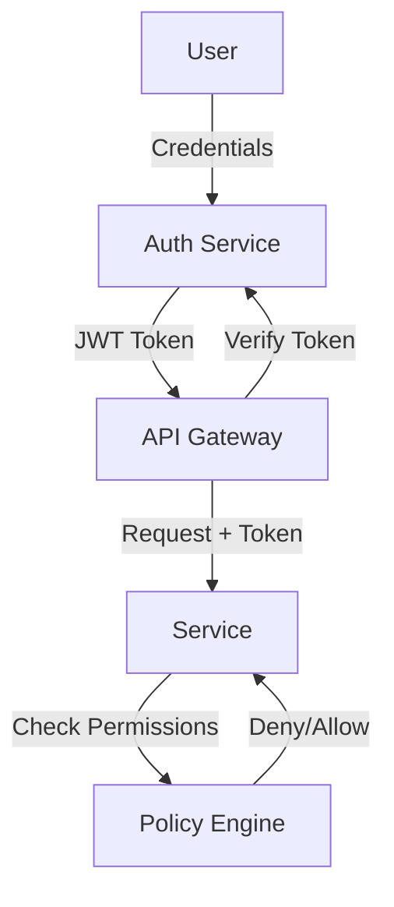

# Security by Design: Comprehensive Research & Spec-Kit Integration Guide

**Research Date:** January 3, 2026
**Status:** Complete Research & Analysis Framework
**Audience:** Spec-Kit Teams, Security Architects, Product Engineers

---

## Executive Summary

Security by Design (SbD) is a methodology where security controls are embedded into every phase of software development, treating security as a first-class design constraint alongside performance, usability, and cost. Rather than reactive vulnerability management, SbD shifts security left—from planning through maintenance.

This research document provides:
1. **Core principles** from leading frameworks (OWASP, NIST, ISO 27001)
2. **Security artifacts** required at each SDLC phase
3. **Threat modeling methodology** for architecture design
4. **Integration with spec-driven development** workflow (`/speckit.concept` through `/speckit.implement`)

---

## Part 1: Core Principles of Security by Design

### 1.1 The Five Foundational Principles

#### 1. Least Privilege
**Definition:** Give users, applications, systems, and components only the most restrictive permissions needed to perform their assigned tasks, for the minimum duration necessary.

**Application in Design:**
- Define role-based access control (RBAC) hierarchies during architecture phase
- Design APIs with principle of least privilege as default policy
- Implement fine-grained permission checks at service boundaries

**Spec-Kit Integration:** Document in `/speckit.plan` architecture decisions section; validate in `/speckit.tasks` security validation tasks

#### 2. Defense in Depth
**Definition:** Layer multiple security controls so that if one fails, others remain to block attacks. No single point of complete compromise.

**Application in Design:**
- Combine authentication + authorization + encryption + logging
- Design for graceful degradation when individual controls fail
- Implement independent verification at each system boundary

**Spec-Kit Integration:** Threat modeling in `/speckit.plan`; security architecture details in plan; validation testing in `/speckit.tasks`

#### 3. Secure Defaults
**Definition:** Out-of-the-box configuration must be secure. Security features should be enabled by default; users opt-out rather than opt-in.

**Application in Design:**
- Disable unnecessary ports, services, and features by default
- Set conservative permission defaults (deny rather than allow)
- Provide secure-by-default templates and examples

**Spec-Kit Integration:** Document in `/speckit.specify` non-functional requirements; enforce in `/speckit.implement` through configuration validation

#### 4. Minimize Attack Surface
**Definition:** Reduce the overall risk by minimizing every port opened, external library used, and user access granted.

**Application in Design:**
- Inventory all external dependencies and justify each one
- Design APIs to expose only necessary functions
- Remove deprecated, unused, or overly permissive endpoints

**Spec-Kit Integration:** Dependency audit in `/speckit.plan`; attack surface analysis in threat modeling; validation checklist in `/speckit.tasks`

#### 5. Complete Mediation
**Definition:** Access checks must happen every single time someone uses a system resource. No shortcuts or cached trust decisions.

**Application in Design:**
- Verify authorization at every service boundary (not just entry point)
- Log all access attempts and policy decisions
- Design for zero-trust architecture

**Spec-Kit Integration:** Embedded in `/speckit.plan` security architecture; implementation rules in `/speckit.implement`

### 1.2 Supporting Principles

- **Fail Securely:** Error conditions default to safe/denied states, not unsafe/allowed
- **Separation of Duties:** Single task requires multiple independent actors to complete
- **Keep It Simple:** Simpler designs have fewer vulnerabilities; avoid unnecessary complexity

---

## Part 2: Leading Security Frameworks

### 2.1 OWASP Secure by Design Framework

**Scope:** Design-phase security with focus on architectural patterns and controls

**Framework Components:**
1. **Core Secure Design Principles** (listed above)
2. **Architecture & Service Design** patterns
3. **Data Management & Protection** (encryption, retention, PII handling)
4. **Reliability & Resilience** (fault tolerance, error handling, failover)

**OWASP's SDLC Integration:**
- **Planning Phase:** Establish formal security requirements (map to ASVS)
- **Design Phase:** Apply SbD framework and architectural patterns
- **Optional:** Threat modeling checkpoint to validate controls mitigate threats
- **Development Phase:** Implement per OWASP ASVS and secure coding standards
- **Verification:** Security testing aligned with design
- **Deployment & Maintenance:** Continuous security validation

**Key Artifacts Generated:**
- Design-Phase Security Checklist (actionable review tool)
- Secure-by-Design Review Checklist (hand-off artifact for AppSec feedback)
- Architecture decision records (ADRs) documenting security choices

**References:**
- [OWASP Secure by Design Framework](https://owasp.org/www-project-secure-by-design-framework/)
- [OWASP Secure Product Design Cheat Sheet](https://cheatsheetseries.owasp.org/cheatsheets/Secure_Product_Design_Cheat_Sheet.html)
- [OWASP Developer Guide - Security Principles](https://devguide.owasp.org/en/02-foundations/03-security-principles/)

### 2.2 NIST Secure Software Development Framework (SSDF) v1.1

**Scope:** Comprehensive secure development practices applicable across SDLC

**Framework Structure:** 42 specific tasks across 4 high-level categories

**The Four NIST SSDF Categories:**

1. **PO: Prepare the Organization (Enablement & Planning)**
   - Establish secure development standards and practices
   - Provide secure development tools and infrastructure
   - Train development teams on secure practices

2. **PL: Prepare for Lifecycle (Requirements & Design)**
   - Define and communicate security requirements
   - Evaluate security properties of design proposals
   - Select secure components and configurations

3. **PD: Protect the Software (Implementation & Testing)**
   - Use secure coding practices and standards
   - Perform security code analysis (SAST/DAST)
   - Conduct security testing and vulnerability assessments

4. **PS: Protect the Software Supply Chain**
   - Secure artifact handling and version control
   - Manage software dependencies and supply chain risks
   - Validate software artifacts before distribution

**Adoption Requirement:** Mandated for U.S. federal agencies (OMB M-22-18, Sept 2022)

**Latest Developments:**
- SSDF v1.2 (draft) refines existing practices
- SP 800-218A adds AI/ML-specific secure development practices

**References:**
- [NIST SP 800-218: SSDF v1.1 PDF](https://nvlpubs.nist.gov/nistpubs/specialpublications/nist.sp.800-218.pdf)
- [NIST SSDF Project Page](https://csrc.nist.gov/projects/ssdf)
- [NIST SSDF via CISA](https://www.cisa.gov/resources-tools/resources/nist-sp-800-218-secure-software-development-framework-v11-recommendations-mitigating-risk-software)

### 2.3 ISO 27001:2022 Control 8.27: Secure System Architecture & Engineering Principles

**Scope:** Information security management system control for secure architecture

**Core Requirement:**
Implement secure system architecture and engineering principles ("security by design and default") throughout system lifecycle—not just bolted-on after development.

**Engineering Principles for ISO 27001:**
- Security by design and default
- Defense in depth
- Fail securely
- Distrust external inputs
- Assume breach (zero-trust mindset)
- Least privilege
- Usability and manageability
- Least functionality (minimal exposure)

**Architecture Layers Required:**
- Business layer (process security)
- Data layer (data classification, handling)
- Application layer (secure coding, frameworks)
- Network layer (segmentation, transport security)
- Technology/Infrastructure layer (OS hardening, access controls)

**Implementation Techniques:**
- **Fault Tolerance & Resilience:** Mechanisms ensuring availability under failure
- **Segregation:** Virtualization, containerization to isolate applications
- **Tamper Resistance:** Detection and prevention of unauthorized modifications

**2022 Updates vs 2013:**
- Added zero-trust principle
- Emphasized "security by design" (new in 2022)
- Stronger guidance on third-party compliance

**References:**
- [ISO 27001:2022 Annex A 8.27 Explained](https://www.isms.online/iso-27001/annex-a-2022/8-27-secure-system-architecture-engineering-principles-2022/)
- [Implementation Guide](https://www.isms.online/iso-27001/annex-a-2022/how-to-implement-iso-27001-2022-annex-a-control-8-27-secure-system-architecture/)
- [Control Overview](https://hightable.io/iso27001-annex-a-8-27-secure-systems-architecture-and-engineering-principles/)

---

## Part 3: Security Artifacts by SDLC Phase

### 3.1 Phase Overview: Where Security Must Be Embedded

**Timeline Principle:** The earlier security issues are identified, the cheaper they are to fix. A design-phase security flaw might require architectural rework; a production-phase flaw requires patches, incident response, and reputation damage.

### 3.2 Requirements & Planning Phase

**Objective:** Define security objectives, identify threats, assess risks

**Key Activities:**
- Establish security requirements alongside functional requirements
- Define threat model scope and threat actors
- Perform risk assessment of requirements
- Identify applicable regulations and compliance frameworks
- Define security success criteria

**Security Artifacts Produced:**
1. **Security Requirements Document**
   - Non-functional security requirements (authentication, encryption, audit)
   - Regulatory requirements mapping (GDPR, SOC 2, etc.)
   - Security success criteria (measured, SMART goals)
   - Baseline security requirements (NIST controls, OWASP ASVS mapping)

2. **Risk Assessment Report**
   - Asset identification and valuation
   - Threat identification and analysis
   - Vulnerability assessment
   - Risk scoring (likelihood × impact)
   - Risk prioritization and mitigation strategy

3. **Threat Modeling Kickoff**
   - Define threat actors and their motivations
   - Identify high-risk business scenarios
   - Scope for design-phase threat modeling

4. **Compliance Mapping Matrix**
   - Requirements mapped to compliance frameworks
   - Evidence collection plan for audit

**Tools & Standards:**
- OWASP ASVS (Application Security Verification Standard) for requirement templates
- NIST SP 800-53 control catalogs
- ISO 27001 risk assessment methodology

**Reference:** [Security Requirements Elicitation Guide](https://www.pmi.org/learning/library/importance-of-security-requirements-elicitation-9634)

### 3.3 Design & Architecture Phase

**Objective:** Translate security requirements into secure architecture; identify threats before code exists

**Key Activities:**
- Create architecture diagrams showing system components and boundaries
- Perform threat modeling (structured threat identification)
- Design security controls and mechanisms
- Review design against security requirements
- Document security architecture decisions

**Security Artifacts Produced:**

1. **Threat Model(s)**
   - Data Flow Diagrams (DFDs) showing system components, data flows, trust boundaries
   - Threat identification (STRIDE methodology: Spoofing, Tampering, Repudiation, Information Disclosure, Denial of Service, Elevation of Privilege)
   - Threat-control mapping (which design control mitigates which threat)
   - Risk assessment of unmitigated threats

2. **Security Architecture Document**
   - Authentication & authorization design
   - Encryption strategy (data at rest, in transit, in use)
   - Network architecture and segmentation
   - Key management and certificate strategy
   - Audit and logging architecture
   - Incident response handling

3. **Design Review Checklist**
   - Verification that design addresses all security requirements
   - Verification that design follows SbD principles
   - Completeness of control coverage for identified threats

4. **API Security Specification**
   - Endpoint authentication/authorization
   - Rate limiting and DoS protection
   - Input validation rules
   - Data sensitivity classification
   - Error handling (secure failure)

5. **Data Protection Design**
   - Data flow mapping
   - Sensitive data identification
   - Encryption requirements per data type
   - Retention policy design
   - PII handling procedures

**Tools & Methodologies:**
- Microsoft Threat Modeling Tool
- OWASP Threat Dragon
- STRIDE methodology
- Data Flow Diagram (DFD) creation
- Attack tree analysis

**Recommended Meeting Structure:**
- 2+ hours minimum for threat modeling session
- First hour: Establish common understanding of system architecture
- Second hour: Identify threats and design mitigations
- For complex systems: Decompose into smaller chunks, threat model separately

**Reference:** [OWASP Threat Modeling Cheat Sheet](https://cheatsheetseries.owasp.org/cheatsheets/Threat_Modeling_Cheat_Sheet.html) | [CMS Threat Modeling Handbook](https://security.cms.gov/learn/cms-threat-modeling-handbook) | [Microsoft Threat Modeling Guide](https://www.microsoft.com/en-us/securityengineering/sdl/threatmodeling)

### 3.4 Implementation Phase

**Objective:** Implement design securely; identify vulnerabilities in code

**Key Activities:**
- Follow secure coding standards and practices
- Perform static code analysis (SAST)
- Use approved secure frameworks and libraries
- Implement cryptographic controls correctly
- Generate security-focused implementation artifacts

**Security Artifacts Produced:**

1. **Secure Coding Policy/Guidelines**
   - Language-specific secure coding practices
   - Cryptographic library standards
   - Input validation and output encoding rules
   - Error handling rules
   - Dependency management policy

2. **Static Application Security Testing (SAST) Report**
   - Code vulnerabilities identified
   - Remediation plan for findings
   - Evidence of secure practices (e.g., parameterized queries, input sanitization)

3. **Dependency/Supply Chain Report**
   - Software Bill of Materials (SBOM)
   - Known vulnerabilities in dependencies
   - Justification for risky dependencies
   - Update strategy

4. **Security Implementation Checklist**
   - Encryption properly implemented
   - Authentication/authorization in place
   - Input validation everywhere
   - Secure error handling
   - Logging and monitoring enabled
   - Secrets management implemented

**Tools & Standards:**
- SAST tools (SonarQube, Checkmarx, etc.)
- Software Composition Analysis (SCA) tools
- Dependency checkers (Snyk, OWASP Dependency-Check)
- Secure coding frameworks (OWASP Top 10, CWE Top 25)

### 3.5 Testing & Verification Phase

**Objective:** Validate that security controls work and that vulnerabilities don't exist

**Key Activities:**
- Perform dynamic application security testing (DAST)
- Conduct penetration testing
- Validate threat model mitigations work
- Perform vulnerability scanning
- Security regression testing

**Security Artifacts Produced:**

1. **DAST / Penetration Testing Report**
   - Vulnerabilities identified in running application
   - Severity assessment and exploitability
   - Remediation recommendations
   - Verification that high-severity findings are addressed

2. **Threat Model Validation Report**
   - Verification that each threat mitigation is effective
   - Testing evidence for each control
   - Residual risk assessment

3. **Vulnerability Assessment Summary**
   - Known vulnerabilities in dependencies
   - Infrastructure vulnerabilities
   - Configuration weaknesses

4. **Security Test Plan & Results**
   - Security requirements traceability matrix (which test verifies which requirement)
   - Test results confirming security controls work

**Tools & Standards:**
- DAST tools (Burp Suite, OWASP ZAP)
- Penetration testing frameworks
- Vulnerability scanners
- Container/infrastructure scanning

### 3.6 Deployment Phase

**Objective:** Deploy securely with proper security validation and hardening

**Key Activities:**
- Verify secure configuration
- Deploy security monitoring and logging
- Conduct pre-deployment security review
- Deploy incident response procedures
- Establish security runbooks

**Security Artifacts Produced:**

1. **Deployment Security Checklist**
   - Configuration hardening verified
   - Secrets management validated
   - Monitoring and logging enabled
   - Access controls verified
   - Incident response procedures ready

2. **Security Operations Runbook**
   - Security incident response procedures
   - Key rotation procedures
   - Vulnerability patch procedures
   - Log analysis and monitoring procedures

3. **Production Security Dashboard**
   - Real-time security metrics
   - Incident alerts
   - Vulnerability tracking
   - Compliance status

4. **Change Control & Audit Trail**
   - All configuration changes logged
   - All access authenticated and audited
   - All changes reversible/traceable

### 3.7 Maintenance & Operations Phase

**Objective:** Continuously monitor, update, and improve security posture

**Key Activities:**
- Monitor security logs and incidents
- Manage patches and updates
- Respond to security incidents
- Conduct periodic security reviews
- Update threat models based on new threats

**Security Artifacts Maintained:**

1. **Security Incident Log & Response Records**
   - Incident timeline and root cause
   - Remediation actions taken
   - Lessons learned
   - Changes to prevent recurrence

2. **Patch Management Log**
   - Security patches applied
   - Testing results
   - Deployment verification

3. **Continuous Vulnerability Reports**
   - Dependency updates and vulnerabilities
   - Infrastructure assessments
   - Penetration testing results

4. **Updated Threat Models**
   - New threats identified
   - New mitigations designed
   - Architectural changes reflected

---

## Part 4: Threat Modeling Methodology

### 4.1 What is Threat Modeling?

**Definition:** A structured, repeatable process to gain actionable insights into security characteristics of a system by modeling it from an adversarial perspective.

**When to Perform:** Design phase (before code exists), with updates during maintenance

**Purpose:**
- Identify threats before they're exploited
- Prioritize security controls based on threat severity
- Validate architecture addresses security requirements
- Enable secure-by-design rather than secure-by-patching

### 4.2 Five Core Threat Modeling Steps

**Step 1: Define Security Requirements**
- What data must be protected?
- Who should have access?
- What regulations apply?
- What are success criteria?

**Step 2: Create Application Diagram (Data Flow Diagram)**

Build a DFD showing:
- **Entities:** Users, external systems, actors
- **Processes:** Services, functions, business logic
- **Data Stores:** Databases, filesystems, caches
- **Data Flows:** How data moves between components
- **Trust Boundaries:** Where trust levels change (e.g., user input vs internal data)

Example DFD elements:
```
[External User] --> |HTTP Request|
[Web Server] --> |SQL Query|
[Database] --> |Encrypted Data|
[Cache]
```

Trust boundary separates "untrusted external input" from "trusted internal processing."

**Step 3: Identify Threats (STRIDE Methodology)**

STRIDE categories:
- **Spoofing Identity:** Attacker pretends to be legitimate user/system
- **Tampering with Data:** Attacker modifies data in transit or at rest
- **Repudiation:** User denies performing an action; no audit trail
- **Information Disclosure:** Attacker gains unauthorized access to sensitive data
- **Denial of Service:** Attacker prevents legitimate access/availability
- **Elevation of Privilege:** Attacker gains unauthorized permissions

For each component and data flow, ask: "What STRIDE threats apply here?"

Example:
```
Threat: Tampering with Data
Component: API Request Data in Transit
Mitigations: TLS encryption, message signing, rate limiting
Risk: Medium (mitigated by HTTPS)
```

**Step 4: Mitigate Threats (Design Controls)**

For each threat:
1. Design a control to mitigate it
2. Map control to security requirement
3. Document in architecture
4. Plan implementation tasks

Example Threat-Control Mapping:
```
Threat: Information Disclosure (unauthorized access to user data)
Control: Role-Based Access Control (RBAC)
Implementation:
  - Define roles and permissions during design
  - Implement authorization checks on all data access
  - Audit all data access
Validation: Penetration testing verifies RBAC enforced
```

**Step 5: Validate Threat Mitigations**

Verify during testing:
- Design control is actually implemented
- Control prevents the threat effectively
- No bypass mechanisms exist
- Control doesn't break functionality

### 4.3 Threat Modeling Approaches

**Top-Down Approach** (Architect perspective)
- Start with business context and security requirements
- Design system architecture and controls
- Drill down to code-level implementation details
- Best for architects connecting business goals to technical controls
- Timeline: ~2 hours minimum for initial model

**Bottom-Up Approach** (Developer perspective)
- Start with code and specific vulnerabilities
- Work up to understand broader attack scenarios
- Identify architectural improvements
- Best for developers/engineers
- Typically requires architect input at upper levels

### 4.4 Threat Modeling Tools

| Tool | Purpose | Best For |
|------|---------|----------|
| Microsoft Threat Modeling Tool | DFD creation, STRIDE-based threat generation | Enterprise, Windows-centric |
| OWASP Threat Dragon | Open-source, web-based threat modeling | Agile teams, quick iterations |
| pytm | Python-based, automated threat generation | Developers, DevSecOps |
| Threagile | YAML-based, agile threat modeling, risk rules | Infrastructure-as-code, automation |

### 4.5 Common Challenges & Solutions

| Challenge | Root Cause | Solution |
|-----------|-----------|----------|
| Time constraints | Tight delivery schedules | Decompose into smaller chunks; threat model separately |
| Low engagement | Seen as compliance task | Connect to security incidents; show cost of vulnerabilities |
| Outdated models | Rapid changes in architecture | Automate threat model updates with infrastructure-as-code; version control |
| Model drift | Teams forget to update | Embed threat modeling into architecture review process |

---

## Part 5: Security by Design in Spec-Driven Development

### 5.1 Mapping Security to Spec-Kit Workflow

The spec-kit toolkit (`/speckit.*` commands) provides a perfect structure for embedding Security by Design. Here's how to integrate security at each phase:

### 5.2 Phase 1: `/speckit.constitution` - Project Principles

**What to Establish:**
- Security as first-class design principle (not afterthought)
- Commitment to specific frameworks (OWASP, NIST, ISO 27001)
- Security review gates in all phases
- Roles and responsibilities for security decisions

**Security Constitution Sections:**
```markdown
## Security Principles
This project adheres to OWASP Secure-by-Design principles:
- Least Privilege: Default deny; users/apps request access
- Defense in Depth: Multiple layers of security controls
- Secure Defaults: Secure configuration out-of-box
- Minimize Attack Surface: Justify every external dependency
- Complete Mediation: Verify authorization at every boundary

## Security Ownership
- Security Architect: Oversees threat modeling, architecture reviews
- Product Team: Includes security requirements in specifications
- Development Team: Implements per secure coding standards
- QA Team: Validates security controls with penetration testing

## Security Gates
- All features require threat model before implementation
- All changes require AppSec review before merging
- All releases require security assessment before deployment
```

**Output:** Constitution document with security principles and governance

### 5.3 Phase 2a: `/speckit.concept` - Product Vision with Security Considerations

**What to Establish:**
- Threat landscape for the product domain
- Compliance requirements (GDPR, HIPAA, SOC 2, etc.)
- Key security differentiators
- Risk assessment at business level

**Security Concept Sections:**

**2a.1: Threat Landscape**
```markdown
## Threat Analysis

### Threat Actors
- **External Attackers:** Motivation = data theft, disruption
- **Insiders:** Motivation = data exfiltration, sabotage
- **Nation-state Actors:** (if applicable) Advanced persistent threats

### Attack Vectors
- Network-based attacks (API manipulation, protocol exploitation)
- Injection attacks (SQL, command, template)
- Credential compromise (brute force, phishing, credential stuffing)
- Supply chain attacks (compromised dependencies)
- Infrastructure attacks (cloud misconfiguration, container escape)

### Key Risk Scenarios
1. [High-risk scenario]: Customer data breached → Compliance violation, reputation damage
2. [High-risk scenario]: Service unavailable → Business impact, SLA breach
3. [High-risk scenario]: Unauthorized access by insider → Data theft, compliance violation
```

**2a.2: Regulatory & Compliance Requirements**
```markdown
## Compliance Framework Mapping

| Requirement | Framework | Impact | Owner |
|-------------|-----------|--------|-------|
| Data encryption at rest | GDPR, SOC 2 | Required before GA | Infra Team |
| User consent management | GDPR | Required for any personal data | Product |
| Access audit logs | SOC 2 | Ongoing; 90-day retention | DevOps |
| Vulnerability disclosure | Industry standard | Incident response capability | Security |
```

**2a.3: Security as Product Differentiator**
```markdown
## Security-First Positioning

Our competitive advantage:
- **Security by Design:** Not bolted-on; architected from start
- **Privacy by Default:** Minimal data collection; users control data
- **Transparency:** Open threat models, regular security reports
- **Compliance-Native:** Meets SOC 2, GDPR, HIPAA out-of-box
```

**Output:** Concept document with threat landscape, compliance matrix, security strategy

### 5.4 Phase 2b: `/speckit.specify` - Feature Security Requirements

**What to Establish:**
- Explicit security requirements for each feature
- Sensitive data identification
- Access control requirements
- Audit/logging requirements

**Security Requirements in Feature Spec:**

```markdown
## Non-Functional Requirements: Security

### Authentication & Authorization
- **Who can use this feature?** [Define roles/permissions]
- **Authentication method?** [OAuth 2.0, JWT, API keys, etc.]
- **Elevation of privilege check?** [Admin-only actions?]
- **Audit requirement?** [Log all access? Why?]

### Data Protection
- **What sensitive data does this feature handle?**
  - PII: [specific fields]
  - Financial: [specific fields]
  - Health: [specific fields]
- **Encryption required?** [Data at rest? In transit? Both?]
- **Data retention policy?** [How long? When deleted?]
- **Access scope?** [Can users access their own data only? Others' data?]

### Input Validation & Output Encoding
- **What user inputs are accepted?** [Define syntax/format]
- **Validation rules?** [Required fields, length limits, character sets]
- **Encoding on output?** [HTML escape? JSON escape? URL encode?]

### API Security (if applicable)
- **Rate limiting?** [Requests per second/minute?]
- **DDoS protection?** [WAF rules?]
- **API versioning?** [Backward compatibility requirements?]
- **Error messages?** [Avoid exposing system details]

### Compliance Mapping
- **GDPR:** Right to be forgotten? Data minimization?
- **SOC 2:** Audit trail required?
- **Industry standards:** [PCI DSS for payments? HIPAA for health?]
```

**Example Security Requirement:**
```markdown
### Requirement: User Data Export
- **Description:** Users can export their personal data
- **Security Requirement:** Only authenticated users can export their own data; admins can audit exports
- **Data Classification:** Personal data (PII) - must be encrypted in transit and at rest
- **Compliance:** GDPR right of data portability - no retention after user requests deletion
- **Validation:** User must re-authenticate (MFA if enabled) before export
- **Audit:** Log who exported what, when - 90 day retention
- **Threat:** Unauthorized data export; user impersonation
- **Mitigation:** Strong authentication, per-user authorization, complete audit trail
```

**Output:** Feature specification with explicit security requirements mapped to threats and compliance

### 5.5 Phase 3: `/speckit.plan` - Security Architecture & Threat Modeling

**What to Establish:**
- Detailed security architecture for the feature
- Threat model identifying threats and mitigations
- Design-phase security decisions
- Security testing strategy

**Security Architecture in Implementation Plan:**

**3a: Threat Modeling**
```markdown
## Threat Model

### System Architecture Diagram (Data Flow Diagram)
[Visual diagram showing:]
- User/external system interactions
- Internal services and data flows
- Data stores
- Trust boundaries

### Threat Identification (STRIDE)

**Threat 1: Unauthorized Data Access**
- Component: Customer API endpoint retrieving user data
- Actor: Malicious authenticated user trying to access other users' data
- Impact: Confidentiality breach - customer data exposed
- Likelihood: Medium (attackers commonly test authorization)
- Risk Score: 8/10 (High)
- **Mitigation Design:**
  - Implement user-scoped authorization check (verify user matches requested ID)
  - Return 403 Forbidden (not 404) to prevent user enumeration
  - Log all access attempts
  - Validate via unit test: User A cannot access User B's data
  - Validate via penetration test: Authorization bypass attempts fail
- **Owner:** Backend Team
- **Validation Task:** [Integration test ID_AUTH_001]

**Threat 2: Data Tampering in Transit**
- Component: Client-to-API communication
- Actor: Network attacker (man-in-the-middle)
- Impact: Integrity compromise - data modified; Confidentiality - data exposed
- Likelihood: Medium (on public networks; Low on VPN)
- Risk Score: 7/10 (High)
- **Mitigation Design:**
  - Enforce TLS 1.2+ for all communication
  - Implement message signing with HMAC for sensitive updates
  - Validate SSL certificates
  - Test: Attempt HTTP connection → should redirect to HTTPS or fail
  - Test: Invalid certificates → connection denied
- **Owner:** DevOps Team
- **Validation Task:** [Infrastructure test ID_TLS_001]

[Continue for all significant threats...]
```

**3b: Security Architecture Document**
```markdown
## Security Architecture

### Authentication & Authorization


**Design Decisions:**
- Use OAuth 2.0 with JWT tokens for stateless authentication
- Implement fine-grained RBAC with policy engine
- Validate token at every service boundary (complete mediation)
- Implement token expiration (15 min access, 7 day refresh)
- Rotate signing keys every 6 months

### Encryption Strategy
**Data at Rest:**
- Database: AES-256 encryption enabled
- Secrets: HashiCorp Vault for key management
- Backups: Encrypted with separate master key

**Data in Transit:**
- TLS 1.2+ for all communication
- Certificate pinning for mobile clients
- HTTPS enforced; HTTP redirects to HTTPS

**Data in Use:**
- Minimize processing of decrypted sensitive data
- Don't log sensitive data (tokenize instead)
- Clear memory after processing secrets

### Audit & Logging
```
Event: User login attempt
Log: {timestamp, user_id, IP, success/failure, MFA_status, device_id}
Retention: 1 year for successful logins; 3 months for failed
Alerting: Alert on 5+ failed attempts from same IP

Event: Data export
Log: {timestamp, user_id, what_data, file_size, IP, recipient}
Retention: 7 years (compliance requirement)
Alerting: None (expected behavior)
```

### Network Architecture
```
[External Users]
    → [WAF/DDoS Protection]
    → [Load Balancer]
    → [API Gateway - TLS termination]
    → [Internal Services - isolated subnet]
    → [Database - encrypted, no external access]
```

### Secrets Management
- Use environment variables or vault (never hardcode)
- Rotate credentials every 90 days
- Principle of least privilege: service only gets secrets it needs
- Audit all secret access

### Dependency Security
**Critical Dependencies:**
```
Dependency: express@^4.18.0
Purpose: HTTP server framework
Risk Level: Medium
Vulnerability Status: No known vulnerabilities
Update Strategy: Update within minor versions; test before deploying
Justification: Industry standard; large community; regular updates
Rationale for Alternative: [Why not use alternatives?]
```

### Compliance Mapping
```
GDPR Requirement: Data Minimization
Design Impact: Collect only data needed for feature; delete on account closure
Implementation: Feature requirement in data model; scheduled deletion task

SOC 2 Requirement: Audit Logs
Design Impact: Log all access and changes; retain 90 days minimum
Implementation: Centralized logging; retention policy in infrastructure code
```

**Output:** Implementation plan with threat model, security architecture decisions, and test strategy

### 5.6 Phase 4: `/speckit.tasks` - Security Implementation & Testing Tasks

**What to Establish:**
- Specific implementation tasks with security requirements
- Security testing tasks with validation criteria
- Code review requirements
- Dependency security checks

**Security-Focused Task Breakdown:**

```markdown
## Security Tasks

### Implementation Tasks

**Task: Implement Role-Based Access Control (RBAC)**
- Acceptance Criteria:
  - [x] User roles defined in database schema
  - [x] Permission check on every data access endpoint
  - [x] Unit tests verify: User A cannot access User B's data
  - [x] Integration tests verify: API returns 403 for unauthorized access
  - [x] Code review approved by security team
- Implementation Notes: Use request middleware to attach user context; don't trust client-supplied user ID
- Estimated Effort: 8 story points
- Security-Specific Risks: Incomplete authorization checks; permission bypass
- Validation: Code review by security expert before merge

**Task: Implement TLS/HTTPS Encryption**
- Acceptance Criteria:
  - [x] All HTTP traffic redirects to HTTPS
  - [x] Certificate valid and chains to trusted root
  - [x] TLS 1.2+ enforced; TLS 1.0/1.1 rejected
  - [x] HSTS header configured
  - [x] SSL Labs rating: A or A+
  - [x] Load test confirms no performance regression
- Implementation Notes: Use managed certificates (Let's Encrypt); auto-renewal configured
- Estimated Effort: 4 story points
- Security-Specific Risks: Expired certificates; weak cipher suites; downgrade attacks
- Validation: Infrastructure review; SSL Labs verification

**Task: Implement Audit Logging**
- Acceptance Criteria:
  - [x] All authentication events logged
  - [x] All data access events logged
  - [x] All admin actions logged
  - [x] Logs include timestamp, user_id, action, result
  - [x] Sensitive data tokenized (not logged)
  - [x] Logs retained for 1 year
  - [x] Logs cannot be modified/deleted by application
- Implementation Notes: Use centralized logging (ELK stack); separate write-only access for logs
- Estimated Effort: 6 story points
- Security-Specific Risks: Incomplete logging; log injection; log tampering
- Validation: Audit of log output; log integrity verification

**Task: Dependency Security Audit**
- Acceptance Criteria:
  - [x] Software Bill of Materials (SBOM) generated
  - [x] All dependencies scanned for known vulnerabilities
  - [x] High-severity vulnerabilities remediated
  - [x] Medium-severity vulnerabilities tracked and prioritized
  - [x] Low-severity vulnerabilities acknowledged
  - [x] Update policy documented for each critical dependency
- Implementation Notes: Use SCA tool (Snyk, Dependabot); enforce in CI/CD pipeline
- Estimated Effort: 3 story points
- Security-Specific Risks: Undetected vulnerabilities; delayed patching
- Validation: Automated scanning in CI; manual review of SBOM

### Security Testing Tasks

**Task: Penetration Testing - Authorization Bypass**
- Test: User A attempts to access User B's data via API
  - Attempt 1: Direct ID substitution (`/api/users/123` → `/api/users/124`)
  - Attempt 2: JWT token modification (change user ID claim)
  - Attempt 3: Race condition (simultaneous requests from different users)
  - Attempt 4: Parameter pollution (add extra user_id parameter)
- Expected Result: All attempts return 403 Forbidden; logged as attack attempt
- Pass Criteria: 0 successful authorization bypasses
- Effort: 4 story points

**Task: Penetration Testing - Data Tampering in Transit**
- Test: Man-in-the-middle attack on API communication
  - Attempt 1: Monitor unencrypted HTTP traffic
  - Attempt 2: Modify encrypted HTTPS traffic (certificate pinning test)
  - Attempt 3: Certificate forgery (self-signed cert)
- Expected Result: HTTP rejected or redirected to HTTPS; certificate validation fails
- Pass Criteria: All attempts fail; HTTPS enforced
- Effort: 3 story points

**Task: Secure Code Review - Cryptography**
- Review Checklist:
  - [x] Cryptographic libraries used correctly (no home-grown crypto)
  - [x] Key generation uses secure random (not seeded with predictable values)
  - [x] Keys never logged or exposed in error messages
  - [x] Deprecated algorithms not used (MD5, SHA1, DES)
  - [x] Password hashing uses bcrypt/scrypt/Argon2 (not SHA256)
  - [x] No hardcoded secrets in code
- Effort: 4 story points
- Reviewer: Security architect or cryptography expert

**Task: Supply Chain Security Validation**
- Checklist:
  - [x] All external packages verified: legitimate source, correct version
  - [x] Package integrity verified (checksum match)
  - [x] No unauthorized dependencies added in merge
  - [x] License compliance checked (no GPL in proprietary product)
  - [x] Dependency provenance documented
- Effort: 2 story points

### Security Review Gates

**Gate: Code Merge**
- Requirements:
  - Security code review completed and approved
  - All high/critical-severity findings addressed
  - Unit tests for security-related code pass
  - No hardcoded secrets detected
  - Dependency security check passed

**Gate: Pre-Deployment**
- Requirements:
  - Threat model reviewed and mitigations validated
  - Penetration testing completed; high-risk findings addressed
  - Infrastructure security review passed
  - Audit logging verified operational
  - Secrets management validated

**Gate: Production Release**
- Requirements:
  - All security testing passed
  - Incident response procedures in place
  - Security monitoring dashboard active
  - Compliance requirements verified
  - Security release notes prepared

**Output:** Task breakdown with explicit security tasks, test scenarios, and review gates
```

### 5.7 Phase 5: `/speckit.implement` - Secure Implementation & Validation

**What to Establish:**
- Implementation of security controls per design
- Verification that controls work correctly
- Security artifact generation (SBOM, scan reports)
- Integration of security into CI/CD

**Security Implementation Checklist:**

```markdown
## Security Implementation Verification

### Code Security
- [ ] Secure coding standards followed per language
- [ ] No hardcoded secrets; environment variables used
- [ ] Input validation on all user inputs
- [ ] Output encoding on all sensitive outputs
- [ ] Error messages don't expose system details
- [ ] No use of deprecated cryptographic algorithms
- [ ] Cryptographic key management per threat model
- [ ] Logging includes security events; excludes sensitive data

### Dependency Security
- [ ] Dependencies locked to specific versions
- [ ] SBOM generated and committed to repo
- [ ] No high-severity vulnerabilities in dependencies
- [ ] Dependency updates tracked and tested
- [ ] License compatibility verified

### Authentication & Authorization
- [ ] Authentication implemented per design
- [ ] Authorization checks on every protected endpoint
- [ ] Token/session management per design
- [ ] MFA options available (if required)
- [ ] Audit logging of all access

### Encryption & Data Protection
- [ ] Data at rest encrypted per design
- [ ] Data in transit encrypted (TLS)
- [ ] Key management per design
- [ ] Secrets never logged
- [ ] PII tokenized in logs

### Testing & Validation
- [ ] Unit tests for security-critical code (auth, crypto, validation)
- [ ] Integration tests for authorization flow
- [ ] Security-focused code review completed
- [ ] SAST tool passes (SonarQube, Checkmarx, etc.)
- [ ] Dependency scanning passes (no high-severity vulns)
- [ ] Threat model mitigations validated

### Infrastructure & Operations
- [ ] TLS/HTTPS configured and validated
- [ ] Firewall rules configured per architecture
- [ ] Database encryption enabled
- [ ] Secrets manager configured
- [ ] Centralized logging configured
- [ ] Security monitoring alerts configured
- [ ] Backup/recovery tested

### CI/CD Security
- [ ] Security scans in CI pipeline (SAST, SCA, container scan)
- [ ] Failed security scans block merge
- [ ] Artifact signing configured
- [ ] Access controls on deployment keys
- [ ] Deployment audit trail enabled

### Compliance & Documentation
- [ ] Security controls mapped to compliance requirements
- [ ] Documentation generated: threat model, architecture, test results
- [ ] Change log includes security fixes
- [ ] Incident response procedure ready
- [ ] Security runbooks prepared

**Output:** Implemented system with validated security controls, SBOM, scan reports, and security documentation
```

---

## Part 6: Integration Framework - Spec-Kit Security Workflow

### 6.1 Complete Workflow Example: Feature Security Integration

**Feature:** "User Profile Update" (requires authentication, authorization, audit logging, data encryption)

#### Step 1: Constitution Phase
**Establish:** Security principles for the project
```
This project follows OWASP Secure-by-Design principles
Security gates: Threat modeling before implementation; AppSec review before merge
Owner: Security Architect (mandatory sign-off on architecture)
```

#### Step 2a: Concept Phase
**Identify:** Threat landscape for user data
```
Threat Actors: Attackers seeking unauthorized profile access
High-Risk Scenario: Attacker modifies another user's profile via authorization bypass
Compliance: GDPR - user has right to accurate data; audit required
```

#### Step 3: Specification Phase
**Define:** Explicit security requirements
```
Feature: User Profile Update
Security Requirements:
- Only authenticated users can update profiles
- Only user can update their own profile; admins can update any
- All profile updates logged with timestamp, user, old/new values
- Sensitive fields (email, phone) encrypted at rest
- Update operation validated for completeness (don't allow partial updates)
- Compliance: GDPR - user can see history of changes to their data
```

#### Step 4: Planning Phase
**Design:** Threat model and security architecture
```
Threat Model:
1. Unauthorized Profile Access (authorization bypass)
   - Mitigation: User-scoped authorization check; validate user_id matches JWT
   - Test: Unit test confirms User A cannot modify User B

2. Data Tampering in Transit
   - Mitigation: TLS encryption enforced
   - Test: HTTPS required; HTTP redirected

3. Privilege Escalation (user modifies admin flag)
   - Mitigation: Admin fields read-only for non-admins
   - Test: Attempt to set admin=true; should fail

Architecture:
- API endpoint: PUT /api/users/{id}
- Auth: JWT token validated; user_id extracted from token
- Authorization: Check if requester.id == profile.id OR is_admin
- Encryption: sensitive_email, phone_number encrypted with AES-256
- Audit: Log all updates to audit_log table
- Validation: Pre-update checks (email format, phone format, length limits)
```

#### Step 5: Tasks Phase
**Break Down:** Security implementation and testing tasks
```
Implementation Tasks:
- Task 1: Implement authorization check (verify user owns profile)
  - Code review required: Security architect approval
  - Unit tests: User cannot modify other profiles

- Task 2: Implement field-level encryption for sensitive data
  - Code review: Cryptography expert
  - Validation: Encrypted data cannot be read without key

- Task 3: Implement audit logging
  - Logs include: timestamp, user_id, old_value, new_value
  - Sensitive data tokenized in logs

Security Testing Tasks:
- Task 4: Penetration test - authorization bypass
  - Attempt to modify other user's profile
  - Attempt to escalate to admin
  - Expected: All attempts fail with 403

- Task 5: Penetration test - data tampering
  - Attempt to MITM attack the update
  - Expected: HTTPS enforced; tampering detected
```

#### Step 6: Implementation Phase
**Validate:** Security controls verified, artifacts generated
```
Pre-Merge Security Review:
- Code review: Authorization logic correct, no bypasses
- SAST tool: No security findings
- Dependency scan: No vulnerabilities
- Test results: All security tests pass

Pre-Release Verification:
- Threat model: All threats mitigated by implemented controls
- Penetration testing: No vulnerabilities found
- Audit logging: Verified operational in staging
- Documentation: Updated with new security architecture

Artifacts Generated:
- Threat model (documented in PR)
- Code with security controls (in repo)
- Test results (in CI pipeline)
- Updated architecture documentation
- SBOM (dependencies)
```

### 6.2 Quick Reference: Security by Phase

| Phase | Command | Key Question | Artifact |
|-------|---------|--------------|----------|
| Principles | `/speckit.constitution` | Do we have security governance? | Security principles, roles |
| Vision | `/speckit.concept` | What are our threat actors and compliance requirements? | Threat landscape, compliance matrix |
| Requirements | `/speckit.specify` | What security must this feature have? | Security requirements |
| Architecture | `/speckit.plan` | How will we secure this architecturally? Threat model? | Threat model, security architecture |
| Implementation | `/speckit.tasks` | What security tasks must developers do? How do we test? | Task breakdown, test strategy |
| Execution | `/speckit.implement` | Are security controls implemented correctly? | Code, tests, scans, validation |
| Post-Launch | Operations | What security must we maintain? | Monitoring, incident response, patches |

---

## Part 7: Regulatory & Standards Quick Reference

### 7.1 Key Frameworks at a Glance

| Framework | Scope | Key Focus | Audience |
|-----------|-------|-----------|----------|
| **OWASP SbD** | Design-phase security | Architectural patterns, principles | Architects, designers |
| **NIST SSDF** | Complete SDLC security | 42 tasks, supply chain | Organizations, federal |
| **ISO 27001 8.27** | Information security mgmt | Engineering principles, architecture | CISOs, compliance teams |
| **OWASP ASVS** | Requirements & testing | Application security verification | Security testers, architects |
| **OWASP Top 10** | Common vulnerabilities | Preventable flaws | Developers, architects |
| **NIST SP 800-53** | Security controls | Control catalog | CISOs, audit teams |

### 7.2 Compliance Mapping Template

Use this to map your feature to multiple frameworks:

```markdown
## Compliance Mapping: [Feature Name]

| Requirement | OWASP | NIST | ISO 27001 | How Implemented |
|-------------|-------|------|-----------|-----------------|
| Authentication | ASVS 2.x | PL-5 | 8.2 | OAuth 2.0 + JWT |
| Authorization | ASVS 4.x | PL-6 | 8.27 | RBAC with policy engine |
| Encryption | ASVS 6.x | PD-4 | 8.27 | AES-256 at rest; TLS in transit |
| Audit Logging | ASVS 8.x | PL-8 | 8.5 | Centralized logs; 1-yr retention |
| Data Protection | ASVS 10.x | PS-4 | 8.27 | PII tokenized; sensitive encrypted |
| Vulnerability Mgmt | - | PD-3 | 8.7 | SAST/SCA in CI pipeline |
```

---

## Part 8: Resources & References

### 8.1 Framework Documents
- [OWASP Secure by Design Framework](https://owasp.org/www-project-secure-by-design-framework/)
- [NIST SP 800-218: SSDF v1.1 (PDF)](https://nvlpubs.nist.gov/nistpubs/specialpublications/nist.sp.800-218.pdf)
- [NIST SSDF Project & Resources](https://csrc.nist.gov/projects/ssdf)
- [ISO/IEC 27001:2022 Standard](https://www.iso.org/standard/27001)
- [ISO 27001:2022 Annex A 8.27 Implementation Guide](https://www.isms.online/iso-27001/annex-a-2022/how-to-implement-iso-27001-2022-annex-a-control-8-27-secure-system-architecture/)
- [OWASP Application Security Verification Standard (ASVS)](https://owasp.org/www-project-application-security-verification-standard/)
- [NIST SP 800-53: Security Controls](https://nvlpubs.nist.gov/nistpubs/SpecialPublications/NIST.SP.800-53r5.pdf)

### 8.2 Threat Modeling Resources
- [OWASP Threat Modeling Cheat Sheet](https://cheatsheetseries.owasp.org/cheatsheets/Threat_Modeling_Cheat_Sheet.html)
- [Microsoft Threat Modeling Tool](https://www.microsoft.com/en-us/securityengineering/sdl/threatmodeling)
- [CMS Threat Modeling Handbook](https://security.cms.gov/learn/cms-threat-modeling-handbook)
- [OWASP Threat Dragon (Open Source)](https://owasp.org/www-project-threat-dragon/)

### 8.3 Secure Development Resources
- [OWASP Secure Coding Practices Checklist](https://owasp.org/www-community/Source_Code_Analysis_Tools)
- [OWASP Top 10 (Most Critical Web Application Security Risks)](https://owasp.org/Top10/)
- [CWE Top 25: Most Dangerous Software Weaknesses](https://cwe.mitre.org/top25/)
- [CISA Secure by Design Initiative](https://www.cisa.gov/securebydesign)
- [UK Government Security - Secure by Design Principles](https://www.security.gov.uk/policy-and-guidance/secure-by-design/principles/)

### 8.4 Tools & Implementation
- **SAST (Static Code Analysis):** SonarQube, Checkmarx, Fortify, Veracode
- **SCA (Dependency Scanning):** Snyk, Dependabot, Black Duck, Whitesource
- **DAST (Dynamic Testing):** Burp Suite, OWASP ZAP, Rapid7 InsightAppSec
- **Container Security:** Trivy, Clair, Anchore, Falco
- **Infrastructure Scanning:** CloudSploit, ScoutSuite, Prowler (AWS/Azure/GCP)
- **Secrets Detection:** GitGuardian, TruffleHog, detect-secrets

---

## Part 9: Conclusion & Implementation Roadmap

### 9.1 Key Takeaways

1. **Security Must Be First, Not Last:** Design security in from start, don't bolt it on at the end
2. **Multiple Layers Win:** Defense in depth with multiple controls is more robust than single strong control
3. **Threats Drive Design:** Threat modeling identifies what to protect; security requirements define how
4. **Frameworks Provide Structure:** OWASP, NIST, ISO 27001 give proven checklists and processes
5. **Spec-Driven Development = Security-Driven Development:** Embed security requirements in specifications, design, and task breakdown

### 9.2 Implementation Roadmap for Spec-Kit

**Short-term (Immediate):**
1. Create security principle templates in `/speckit.constitution`
2. Add threat modeling section to `/speckit.plan` command
3. Create security requirement templates for `/speckit.specify`
4. Add security task breakdown examples to `/speckit.tasks`

**Medium-term (Next Quarter):**
1. Create reusable threat model templates by domain (API, web app, mobile, infrastructure)
2. Build security artifact checklist for each SDLC phase
3. Integrate OWASP ASVS mapping into requirement specifications
4. Create security-focused code review checklist

**Long-term (Future):**
1. Automated threat modeling based on architecture description
2. Automated compliance mapping (feature → GDPR/SOC 2/HIPAA requirements)
3. Security metrics dashboard integrated with spec-kit
4. AI-assisted threat identification and mitigation suggestions

### 9.3 Next Steps

1. Review this research with security team and product leadership
2. Identify which frameworks align with your organization (OWASP? NIST? ISO?)
3. Create project constitution with security principles
4. Pilot Security by Design on next feature (with threat modeling)
5. Iterate and refine process based on team feedback

---

## Appendix A: STRIDE Threat Categories Explained

| Category | Definition | Example | Mitigation |
|----------|-----------|---------|-----------|
| **Spoofing** | Attacker pretends to be legitimate user/system | Attacker forges user identity in request | Strong authentication (MFA), digital signatures |
| **Tampering** | Attacker modifies data in transit or at rest | Attacker modifies API request to change price | Encryption, message signing, integrity checks |
| **Repudiation** | User denies performing an action; no proof | User claims "I didn't change my profile" | Complete audit logging with timestamps |
| **Info Disclosure** | Attacker gains unauthorized access to secrets | Attacker reads customer database | Encryption, access controls, data classification |
| **Denial of Service** | Attacker prevents legitimate access | Attacker floods API with requests | Rate limiting, DDoS protection, auto-scaling |
| **Elevation of Privilege** | Attacker gains unauthorized permissions | User becomes admin; insider steals data | Authorization checks, least privilege, audit |

---

## Appendix B: Security Artifacts Checklist Template

Use this checklist to track security artifacts at each phase:

```markdown
# Security Artifacts Tracking

## Requirements Phase
- [ ] Security requirements documented
- [ ] Threat landscape identified
- [ ] Risk assessment completed
- [ ] Compliance requirements mapped
- [ ] Security success criteria defined

## Design Phase
- [ ] Threat model created
- [ ] Security architecture designed
- [ ] Design review checklist completed
- [ ] API security spec drafted
- [ ] Data flow diagrams documented

## Implementation Phase
- [ ] Secure coding guidelines followed
- [ ] SAST scan passed; findings addressed
- [ ] Dependency scan completed; vulns tracked
- [ ] Security implementation checklist reviewed
- [ ] Code review approved by security expert

## Testing Phase
- [ ] DAST/penetration testing completed
- [ ] Threat model mitigations validated
- [ ] Security test plan results documented
- [ ] Vulnerability assessment completed
- [ ] All high-severity findings remediated

## Deployment Phase
- [ ] Security deployment checklist completed
- [ ] Infrastructure hardened & verified
- [ ] Monitoring & logging operational
- [ ] Incident response plan activated
- [ ] Security runbooks prepared

## Operations Phase
- [ ] Security incidents logged & resolved
- [ ] Patches applied & tested
- [ ] Vulnerability reports reviewed
- [ ] Threat model updated with new threats
- [ ] Compliance audit completed
```

---

**Document Version:** 1.0
**Last Updated:** January 3, 2026
**Maintainer:** Security Research Team
**Feedback & Questions:** [Your security contact]
