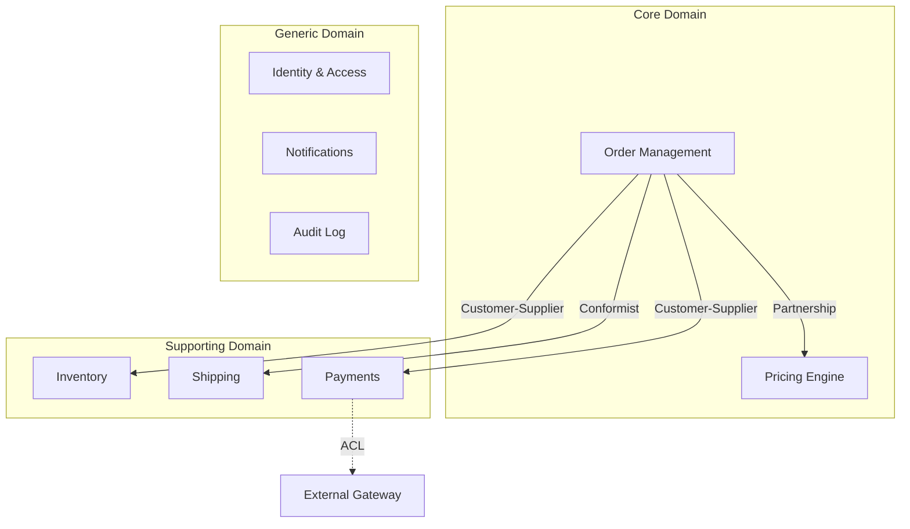
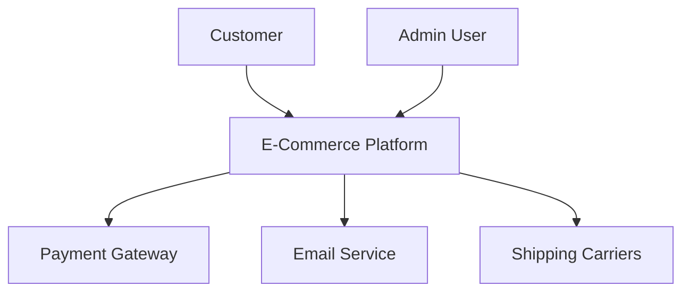
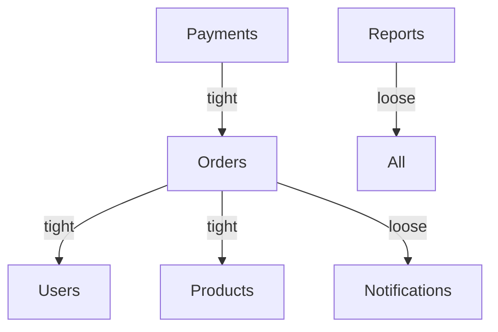

# Spec Kit Enterprise Improvements

## Текущее состояние твоего форка

```
Команды:
├── /speckit.constitution  — Принципы проекта
├── /speckit.concept       — Захват полной концепции (50+ требований)
├── /speckit.specify       — Создание спецификации
├── /speckit.plan          — Технический план
├── /speckit.tasks         — Разбивка на задачи
├── /speckit.implement     — Реализация
├── /speckit.clarify       — Уточнение требований
├── /speckit.analyze       — Валидация консистентности
└── /speckit.checklist     — Генерация чеклистов качества
```

## Gap Analysis: что отсутствует для Enterprise

```
Enterprise Requirements Gap:

Архитектура:
├── ❌ Multi-service / Microservices coordination
├── ❌ API-first design с contract enforcement
├── ❌ Event-driven architecture patterns
├── ❌ Domain-Driven Design support
└── ❌ Architecture Decision Records (ADR)

Качество & Compliance:
├── ❌ Security by Design (threat modeling)
├── ❌ Performance requirements & budgets
├── ❌ Accessibility (WCAG 2.1)
├── ❌ Internationalization (i18n/l10n)
├── ❌ Compliance tracking (GDPR, SOC2, HIPAA)
└── ❌ Observability requirements (logs, metrics, traces)

Процессы:
├── ❌ Multi-team coordination
├── ❌ Approval workflows
├── ❌ Audit trail
├── ❌ Spec versioning & history
└── ❌ Brownfield / legacy modernization

Инфраструктура & Деплой:
├── ❌ Infrastructure provisioning (IaC)
├── ❌ CI/CD pipeline generation
├── ❌ Environment management
├── ❌ Cost estimation
└── ❌ Rollback strategies

Feedback Loop:
├── ❌ Post-deployment verification
├── ❌ Production insights → spec updates
├── ❌ Metrics-driven refinement
└── ❌ Incident → spec gap analysis
```

---

# ЧАСТЬ 1: Концептуальные улучшения

## 1. Enterprise Constitution Template

**Проблема:** Базовая constitution слишком общая для enterprise.

**Решение:** Структурированный enterprise-шаблон:

```markdown
# constitution.md (Enterprise Edition)

## 1. Governance & Compliance

### Decision Authority Matrix
| Decision Type | Authority | Escalation |
|---------------|-----------|------------|
| Architecture (breaking) | Architecture Board | CTO |
| Security exceptions | Security Team | CISO |
| Data model changes | Data Team + DBA | Data Architect |
| Technology adoption | Tech Leads | Architecture Board |
| API breaking changes | API Guild | Product Owner |

### Compliance Requirements
- [ ] GDPR (EU data protection)
- [ ] SOC2 Type II
- [ ] HIPAA (if healthcare)
- [ ] PCI-DSS (if payments)
- [ ] ISO 27001

### Audit Requirements
- All changes logged with: who, what, when, why
- Retention: 7 years for financial, 3 years for operational
- Access logging: mandatory for PII/sensitive data
- Quarterly compliance reviews

## 2. Architecture Principles

### Mandatory Patterns
1. **API-First**: All services expose versioned APIs (REST/gRPC)
2. **Event-Driven**: Async communication via message broker
3. **12-Factor**: Stateless services, config from environment
4. **Zero Trust**: Authenticate & authorize every request
5. **Observability**: Every service emits logs, metrics, traces

### Prohibited Patterns
- ❌ Direct database access between services
- ❌ Synchronous chains > 3 services deep
- ❌ Shared mutable state between services
- ❌ Hardcoded configuration or secrets
- ❌ Unbounded queries without pagination

### Technology Radar
| Category | Adopt | Trial | Assess | Hold |
|----------|-------|-------|--------|------|
| Languages | TypeScript, Go, Python | Rust | Kotlin | PHP |
| Databases | PostgreSQL, Redis | CockroachDB | MongoDB | MySQL |
| Messaging | Kafka | NATS | Pulsar | RabbitMQ |
| Container | Kubernetes | - | Nomad | Docker Swarm |

## 3. Security Standards

### Authentication & Authorization
- Protocol: OAuth 2.0 + OIDC
- Tokens: JWT with short expiry (15 min access, 7 day refresh)
- MFA: Required for admin operations
- Authorization: RBAC minimum, ABAC for fine-grained

### Data Protection
- At rest: AES-256-GCM
- In transit: TLS 1.3 only
- PII: Encrypted, access logged, retention limited
- Secrets: Vault/Secrets Manager, auto-rotation

### Security Controls
- Input validation on all endpoints
- Output encoding (XSS prevention)
- SQL injection prevention (parameterized queries)
- Rate limiting on all public endpoints
- CORS: explicit allowlist only

## 4. Quality Standards

### Code Quality Gates
| Metric | Threshold | Blocking |
|--------|-----------|----------|
| Test coverage | ≥ 80% | Yes |
| Cyclomatic complexity | ≤ 10 | Yes |
| Code duplication | ≤ 3% | No |
| Security vulnerabilities | 0 critical/high | Yes |
| Documentation coverage | ≥ 90% public APIs | No |

### Performance Budgets
| Metric | Target | Critical |
|--------|--------|----------|
| API p50 latency | < 100ms | < 200ms |
| API p99 latency | < 500ms | < 1s |
| Page load (LCP) | < 2.5s | < 4s |
| Time to Interactive | < 3.5s | < 5s |
| DB query time | < 50ms | < 100ms |

### Accessibility
- Standard: WCAG 2.1 Level AA
- Testing: Automated (axe-core) + Manual audit
- Keyboard navigation: All interactive elements
- Screen reader: Semantic HTML, ARIA labels

### Internationalization
- Default locale: en-US
- Supported: [define list]
- RTL support: [yes/no]
- Date/time: ISO 8601, display in user locale
- Currency: Store in cents, display in user currency

## 5. Observability Standards

### Logging
```json
{
  "timestamp": "ISO8601",
  "level": "INFO|WARN|ERROR",
  "service": "order-service",
  "version": "1.2.3",
  "traceId": "abc123",
  "spanId": "def456",
  "userId": "user_xxx",
  "message": "Order created",
  "context": { "orderId": "..." }
}
```

### Metrics (mandatory)
- `http_requests_total` (counter)
- `http_request_duration_seconds` (histogram)
- `http_request_size_bytes` (histogram)
- `db_query_duration_seconds` (histogram)
- `business_{entity}_total` (counter)

### Tracing
- Protocol: OpenTelemetry
- Sampling: 100% errors, 10% success in prod
- Context propagation: W3C Trace Context
- Minimum span: HTTP handlers, DB queries, external calls

### Alerting Tiers
| Severity | Response Time | Example |
|----------|---------------|---------|
| P1 Critical | 15 min | Service down, data breach |
| P2 High | 1 hour | Error rate > 5% |
| P3 Medium | 4 hours | Latency degradation |
| P4 Low | Next business day | Non-critical warnings |

## 6. Operational Requirements

### SLA Targets
- Availability: 99.9% (8.76 hours downtime/year)
- RTO (Recovery Time): 4 hours
- RPO (Recovery Point): 1 hour

### Deployment
- Strategy: Blue-green or Canary
- Rollback: Automated on error rate spike
- Feature flags: All new features behind flags

### Disaster Recovery
- Backup frequency: Daily full, hourly incremental
- Multi-region: [yes/no]
- Failover: Automated/Manual
- DR testing: Quarterly
```

---

## 2. Domain-Driven Design Integration

**Проблема:** Spec Kit не помогает с моделированием домена.

**Решение:** DDD support в /speckit.concept:

```markdown
## /speckit.concept --ddd

Генерирует:

### Bounded Contexts Map


### Context Relationships
| Upstream | Downstream | Relationship | Notes |
|----------|------------|--------------|-------|
| Catalog | Order | Customer-Supplier | Order queries products |
| Order | Payment | Customer-Supplier | Payment processes orders |
| Shipping API | Shipping | Conformist | Must adapt to carrier API |
| Payment Gateway | Payment | ACL | Anti-corruption layer needed |

### Ubiquitous Language Glossary
| Term | Definition | Context | Aliases |
|------|------------|---------|---------|
| Order | A confirmed purchase request | Order Management | Purchase, Transaction |
| SKU | Stock Keeping Unit, unique product identifier | Catalog, Inventory | Product Code |
| Cart | Temporary collection before checkout | Order | Basket, Shopping Bag |
| Fulfillment | Process of shipping order to customer | Shipping | Delivery |

### Aggregate Boundaries
```
Order Aggregate:
├── Order (root)
│   ├── OrderId (value object)
│   ├── CustomerId (value object)
│   ├── Status (enum)
│   └── OrderItems[] (entity)
│       ├── ProductId
│       ├── Quantity
│       └── UnitPrice
└── Invariants:
    - Order must have at least 1 item
    - Total cannot be negative
    - Status transitions: DRAFT→PENDING→PAID→SHIPPED→DELIVERED
```
```

---

## 3. Architecture Decision Records (ADR)

**Проблема:** Технические решения не документируются.

**Решение:** Автоматическая генерация ADR в /speckit.plan:

```markdown
## ADR-001: PostgreSQL for Order Storage

### Status
Accepted (2025-01-03)

### Context
Order service needs persistent storage with:
- ACID transactions for financial data
- Complex queries (joins, aggregations)
- High write throughput (10K orders/hour)
- Horizontal read scaling

### Decision
Use PostgreSQL 16 with:
- Managed service (Cloud SQL / RDS)
- Read replicas for reporting
- Connection pooling (PgBouncer)
- Partitioning by created_at (monthly)

### Alternatives Considered

| Option | Pros | Cons | Verdict |
|--------|------|------|---------|
| PostgreSQL | ACID, mature, rich queries | Scaling writes | ✅ Selected |
| CockroachDB | Distributed, auto-scaling | Complexity, cost | Trial later |
| MongoDB | Flexible schema, easy scaling | No ACID, query limits | ❌ Rejected |
| DynamoDB | Managed, scalable | Limited queries, vendor lock | ❌ Rejected |

### Consequences

**Positive:**
- ✅ Strong consistency guarantees
- ✅ Rich SQL query capabilities
- ✅ Mature ecosystem, tooling
- ✅ Team expertise

**Negative:**
- ⚠️ Manual sharding if >1TB
- ⚠️ Connection management at scale
- ⚠️ Schema migrations need care

**Risks:**
- Write bottleneck at extreme scale → mitigate with CQRS

### References
- [PostgreSQL at Scale (Notion)](link)
- [Cloud SQL Best Practices](link)
```

---

## 4. Multi-Service Coordination

**Проблема:** Spec Kit работает с одним сервисом.

**Решение:** Service decomposition в /speckit.plan:

```markdown
## Service Decomposition

### Services Overview
```
┌─────────────────────────────────────────────────────────┐
│                    API Gateway                           │
│              (Authentication, Rate Limiting)             │
└────────────────────────┬────────────────────────────────┘
                         │
         ┌───────────────┼───────────────┐
         ▼               ▼               ▼
    ┌─────────┐    ┌─────────┐    ┌─────────┐
    │ Catalog │    │  Order  │    │  User   │
    │ Service │    │ Service │    │ Service │
    └────┬────┘    └────┬────┘    └────┬────┘
         │              │              │
         ▼              ▼              ▼
    ┌─────────┐    ┌─────────┐    ┌─────────┐
    │Catalog  │    │ Order   │    │  User   │
    │   DB    │    │   DB    │    │   DB    │
    └─────────┘    └─────────┘    └─────────┘
                         │
                    ┌────┴────┐
                    ▼         ▼
              ┌─────────┐ ┌─────────┐
              │ Payment │ │Inventory│
              │ Service │ │ Service │
              └─────────┘ └─────────┘
```

### Service Specifications

#### order-service
```yaml
name: order-service
domain: Core
owner: @order-team
repository: github.com/company/order-service

responsibilities:
  - Order lifecycle management
  - Checkout orchestration
  - Order history

dependencies:
  sync:
    - catalog-service: GET /products/{id}
    - user-service: GET /users/{id}
    - payment-service: POST /payments
  async:
    - inventory-service: OrderCreated event
    - notification-service: OrderStatusChanged event

api:
  type: REST + gRPC
  base_path: /api/v1/orders
  authentication: JWT Bearer
  rate_limit: 1000 req/min

database:
  type: PostgreSQL
  isolation: Dedicated schema
  
events_published:
  - OrderCreated
  - OrderPaid
  - OrderShipped
  - OrderCancelled

events_consumed:
  - PaymentCompleted (from payment-service)
  - InventoryReserved (from inventory-service)

sla:
  availability: 99.9%
  latency_p99: 500ms
```

### API Contracts Registry

Каждый сервис публикует контракт:

```yaml
# contracts/order-service.yaml
openapi: 3.1.0
info:
  title: Order Service API
  version: 1.0.0
  
paths:
  /orders:
    post:
      operationId: createOrder
      # ...
      
# contracts/events/order-created.avsc
{
  "type": "record",
  "name": "OrderCreated",
  "namespace": "com.company.orders",
  "fields": [
    {"name": "orderId", "type": "string"},
    {"name": "userId", "type": "string"},
    {"name": "items", "type": {"type": "array", "items": "OrderItem"}},
    {"name": "total", "type": "Money"},
    {"name": "createdAt", "type": "long", "logicalType": "timestamp-millis"}
  ]
}
```
```

---

# ЧАСТЬ 2: Улучшения по командам

## /speckit.constitution

### Текущее
Создаёт базовые принципы проекта.

### Улучшения

```markdown
## 1. Enterprise Presets

/speckit.constitution --preset enterprise
/speckit.constitution --preset startup
/speckit.constitution --preset regulated  # финансы, здравоохранение

Preset "enterprise" включает:
- Security section (обязательно)
- Compliance section
- Observability standards
- SLA targets
- Approval workflows
- Technology radar

## 2. Validation

После создания проверять:
✅ Security standards defined
✅ Performance targets set
✅ Compliance requirements listed
✅ Technology choices documented
✅ Quality gates configured
⚠️ Missing: Observability standards
⚠️ Missing: Disaster recovery plan

## 3. Import Corporate Standards

/speckit.constitution --import corporate-standards.md

Импортирует и мержит:
- Company-wide principles
- Approved technologies
- Security baselines
- Compliance requirements

## 4. Compliance Check

/speckit.constitution --validate corporate-baseline.md

Выводит:
Deviations from corporate baseline:
⚠️ Using MongoDB (not in approved list)
⚠️ Missing GDPR compliance section
✅ Security standards compliant
✅ SLA targets within policy

## 5. Version History

/speckit.constitution --history

Shows:
v3 (current): Added SOC2 requirements
v2: Updated tech radar (added Rust to Trial)
v1: Initial constitution
```

---

## /speckit.concept

### Текущее
Захватывает полную концепцию для больших проектов.

### Улучшения

```markdown
## 1. DDD Mode

/speckit.concept --ddd

Добавляет:
- Bounded Contexts identification
- Context Map relationships
- Ubiquitous Language glossary
- Aggregate boundaries
- Domain Events catalog

## 2. C4 Diagrams

Автоматическая генерация:
- Level 1: System Context (what systems interact)
- Level 2: Container Diagram (services, databases, queues)
- Level 3: Component Diagram (per service internals)

## 3. Stakeholder Matrix

| Stakeholder | Interest | Influence | Engagement |
|-------------|----------|-----------|------------|
| Product Owner | High | High | Collaborate |
| Security Team | Medium | High | Consult |
| End Users | High | Low | Inform |
| Ops Team | Medium | Medium | Collaborate |

## 4. Risk Assessment

/speckit.concept --with-risks

| Risk | Category | Probability | Impact | Mitigation |
|------|----------|-------------|--------|------------|
| Data breach | Security | Low | Critical | Encryption, audit, pen testing |
| Peak load failure | Performance | Medium | High | Auto-scaling, load testing |
| Vendor lock-in | Strategic | Medium | Medium | Abstraction layers |
| Key person dependency | Operational | High | Medium | Documentation, cross-training |

## 5. MVP Prioritization

/speckit.concept --prioritize

Methods:
- MoSCoW (Must/Should/Could/Won't)
- RICE scoring (Reach, Impact, Confidence, Effort)
- Dependency-aware sequencing

Output:
Phase 1 (MVP): EPIC-001, EPIC-002 (8 weeks)
Phase 2: EPIC-003, EPIC-004 (6 weeks)
Phase 3: EPIC-005 (4 weeks)

## 6. Integration Points

/speckit.concept --integrations

External Systems:
| System | Type | Protocol | Owner | SLA |
|--------|------|----------|-------|-----|
| Payment Gateway | External | REST | Stripe | 99.99% |
| Email Service | External | REST | SendGrid | 99.9% |
| ERP | Internal | SOAP | Finance Team | 99.5% |
| Data Warehouse | Internal | Kafka | Data Team | 99% |
```

**Расширенный concept.md:**

```markdown
# Concept: Enterprise E-Commerce Platform

## Vision & Goals
Build a scalable, secure e-commerce platform serving 1M+ users...

## Success Metrics
| Metric | Current | Target | Timeline |
|--------|---------|--------|----------|
| Monthly Active Users | 0 | 100K | 6 months |
| Order Conversion | - | 3% | 6 months |
| Page Load Time | - | < 2s | Launch |
| Availability | - | 99.9% | Launch |

## Bounded Contexts (DDD)
[Mermaid diagram]

## Context Map
[Relationship table]

## Ubiquitous Language
[Glossary]

## Epic Hierarchy

### EPIC-001: Product Catalog
**Owner:** @catalog-team
**Priority:** P0 (MVP)
**RICE Score:** 85
**Risk Level:** Low
**Dependencies:** None

#### Features
| ID | Feature | Priority | Estimate | Dependencies |
|----|---------|----------|----------|--------------|
| F001 | Product CRUD | P0 | 2 weeks | - |
| F002 | Categories | P0 | 1 week | F001 |
| F003 | Search | P0 | 2 weeks | F001 |
| F004 | Variants | P1 | 1 week | F001 |

### EPIC-002: Order Management
[Similar structure]

## C4 Diagrams

### Level 1: System Context


### Level 2: Container Diagram
[Detailed services diagram]

## Risk Register
[Risk assessment table]

## Integration Points
[External systems table]

## Timeline & Phases
[Gantt-style breakdown]
```

---

## /speckit.specify

### Текущее
Создаёт спецификацию с user stories и requirements.

### Улучшения

```markdown
## 1. Non-Functional Requirements Section (обязательно)

### Performance Requirements
| Endpoint | Metric | Target | Critical |
|----------|--------|--------|----------|
| GET /products | p99 latency | < 200ms | < 500ms |
| POST /orders | p99 latency | < 1s | < 2s |
| Search | p99 latency | < 500ms | < 1s |

### Scalability Requirements
- Concurrent users: 10,000
- Orders per hour: 5,000
- Data retention: 7 years orders, 1 year logs

### Availability Requirements
- Target: 99.9%
- Maintenance window: Sunday 2-4 AM UTC
- Graceful degradation: Queue orders if payment slow

## 2. Security Requirements Per Feature

| Requirement | Auth | Roles | Data Classification | Audit |
|-------------|------|-------|---------------------|-------|
| View products | No | - | Public | No |
| Add to cart | Optional | - | Internal | No |
| Checkout | Yes | User | Confidential | Yes |
| View order history | Yes | Owner | Confidential | Yes |
| Admin panel | Yes | Admin | Restricted | Yes |

## 3. API Contract (inline)

### POST /api/v1/orders
```yaml
summary: Create new order
security: [bearerAuth]
requestBody:
  content:
    application/json:
      schema:
        type: object
        required: [items, shippingAddress]
        properties:
          items:
            type: array
            minItems: 1
            items:
              $ref: '#/components/schemas/OrderItem'
          shippingAddress:
            $ref: '#/components/schemas/Address'
responses:
  201:
    description: Order created
    content:
      application/json:
        schema:
          $ref: '#/components/schemas/Order'
  400:
    description: Validation error
  409:
    description: Inventory conflict
  422:
    description: Business rule violation
```

## 4. Event Definitions

### OrderCreated Event
```json
{
  "eventType": "order.created",
  "version": "1.0",
  "schema": "avro/order-created.avsc",
  "payload": {
    "orderId": "uuid",
    "userId": "uuid",
    "items": [{"productId": "uuid", "quantity": 1, "price": 999}],
    "total": {"amount": 999, "currency": "USD"},
    "status": "PENDING"
  },
  "metadata": {
    "timestamp": "2025-01-03T12:00:00Z",
    "traceId": "abc123",
    "source": "order-service"
  }
}
```
**Producers:** order-service
**Consumers:** inventory-service, notification-service, analytics-service
**Retention:** 7 days
**Ordering:** By orderId (partition key)

## 5. Data Model

```sql
-- orders table
CREATE TABLE orders (
  id UUID PRIMARY KEY DEFAULT gen_random_uuid(),
  user_id UUID NOT NULL REFERENCES users(id),
  status order_status NOT NULL DEFAULT 'PENDING',
  total_cents INTEGER NOT NULL CHECK (total_cents >= 0),
  currency CHAR(3) NOT NULL DEFAULT 'USD',
  shipping_address JSONB NOT NULL,
  billing_address JSONB,
  notes TEXT,
  metadata JSONB DEFAULT '{}',
  created_at TIMESTAMPTZ NOT NULL DEFAULT NOW(),
  updated_at TIMESTAMPTZ NOT NULL DEFAULT NOW(),
  
  -- Constraints
  CONSTRAINT valid_currency CHECK (currency ~ '^[A-Z]{3}$')
);

-- Indexes
CREATE INDEX idx_orders_user_id ON orders(user_id);
CREATE INDEX idx_orders_status ON orders(status) WHERE status NOT IN ('DELIVERED', 'CANCELLED');
CREATE INDEX idx_orders_created_at ON orders(created_at DESC);

-- Partitioning (for scale)
-- PARTITION BY RANGE (created_at);
```

## 6. UX Requirements

### States Specification
| State | Visual | Behavior |
|-------|--------|----------|
| Empty cart | Illustration + CTA | "Start shopping" button |
| Loading | Skeleton + spinner | Disable interactions |
| Error | Red banner + message | Retry button, contact support link |
| Success | Green toast | Auto-dismiss 5s |

### Accessibility Requirements
- [ ] All forms keyboard navigable
- [ ] Error messages announced by screen reader
- [ ] Color contrast ratio ≥ 4.5:1
- [ ] Focus indicators visible
- [ ] Skip navigation link

### Responsive Breakpoints
| Breakpoint | Width | Layout |
|------------|-------|--------|
| Mobile | < 640px | Single column |
| Tablet | 640-1024px | Two columns |
| Desktop | > 1024px | Three columns |

## 7. Observability Requirements

### What to Log
```
INFO: Order created (orderId, userId, itemCount, total)
INFO: Payment initiated (orderId, paymentId, amount)
WARN: Inventory low (productId, remaining)
ERROR: Payment failed (orderId, error, retryable)
```

### Metrics to Expose
- `orders_created_total` (counter)
- `order_value_cents` (histogram)
- `checkout_duration_seconds` (histogram)
- `inventory_conflicts_total` (counter)

### Traces Required
```
checkout.initiate
├── cart.validate
├── inventory.check
├── pricing.calculate
├── order.create
└── payment.initiate
```

### Alerts
| Condition | Severity | Action |
|-----------|----------|--------|
| Error rate > 5% for 5 min | P1 | Page on-call |
| p99 latency > 2s for 10 min | P2 | Slack alert |
| Inventory conflicts > 100/hour | P3 | Investigate |
```

---

## /speckit.plan

### Текущее
Создаёт технический план с выбором стека.

### Улучшения

```markdown
## 1. Architecture Decision Records

/speckit.plan автоматически создаёт ADR для:
- Database choice
- Message broker choice
- Authentication approach
- API style (REST vs GraphQL vs gRPC)
- Hosting platform

## 2. Service Decomposition

Если проект multi-service:
```yaml
services:
  - name: order-service
    domain: Core
    responsibilities: [Order lifecycle, Checkout]
    dependencies:
      sync: [catalog-service, payment-service]
      async: [inventory-service, notification-service]
    database: PostgreSQL (dedicated)
    
  - name: catalog-service
    domain: Core
    responsibilities: [Product management, Search]
    database: PostgreSQL + Elasticsearch
```

## 3. Infrastructure Plan

```yaml
infrastructure:
  provider: aws  # or gcp, azure, vk-cloud
  region: eu-west-1
  
  compute:
    type: kubernetes
    cluster:
      name: prod-cluster
      version: "1.28"
      node_pools:
        - name: default
          machine_type: n2-standard-4
          min_nodes: 3
          max_nodes: 10
          
  databases:
    - name: orders-db
      type: postgresql
      version: "16"
      tier: db-standard-2
      high_availability: true
      backup:
        enabled: true
        retention_days: 30
        
  messaging:
    - name: events
      type: kafka
      version: "3.6"
      partitions: 12
      replication_factor: 3
      retention_hours: 168
      
  caching:
    - name: session-cache
      type: redis
      version: "7"
      size_gb: 1
      high_availability: true
      
  storage:
    - name: media
      type: object-storage
      bucket: company-media
      lifecycle:
        - transition_to_archive: 90_days
        
  networking:
    vpc_cidr: 10.0.0.0/16
    subnets:
      - public: 10.0.1.0/24
      - private: 10.0.2.0/24
    load_balancer: application
    cdn: cloudflare
```

## 4. CI/CD Plan

```yaml
pipelines:
  build:
    trigger: [push, pull_request]
    stages:
      - name: lint
        run: npm run lint
      - name: test
        run: npm test -- --coverage
        artifacts: coverage/
      - name: security
        run: npm audit && snyk test
      - name: build
        run: docker build -t $IMAGE .
        
  deploy_staging:
    trigger: merge_to_main
    environment: staging
    stages:
      - name: deploy
        run: kubectl apply -k k8s/staging
      - name: smoke_test
        run: npm run test:e2e -- --env staging
      - name: notify
        run: slack-notify "#deployments"
        
  deploy_prod:
    trigger: [manual, tag_v*]
    environment: production
    approval: required
    stages:
      - name: canary
        run: kubectl apply -k k8s/prod --canary 10%
      - name: validate
        run: |
          wait 15m
          check error_rate < 1%
          check latency_p99 < 500ms
      - name: rollout
        run: kubectl apply -k k8s/prod --full
      - name: notify
        run: slack-notify "#releases"
```

## 5. Cost Estimation

```yaml
cost_estimate:
  environment: production
  currency: USD
  period: monthly
  
  breakdown:
    compute:
      kubernetes_cluster: 450
      node_autoscaling_buffer: 150
      
    databases:
      postgresql_primary: 200
      postgresql_replica: 100
      redis_cache: 50
      
    messaging:
      kafka_cluster: 300
      
    storage:
      object_storage: 50
      backup_storage: 30
      
    networking:
      load_balancer: 30
      egress: 100
      cdn: 50
      
    monitoring:
      logging: 100
      metrics: 50
      tracing: 50
      
  total: 1710
  buffer_20_percent: 342
  estimated_total: 2052
  
  notes:
    - "Costs scale with traffic; estimate for 100K MAU"
    - "Reserved instances can reduce compute by 30%"
```

## 6. Timeline Estimation

```yaml
timeline:
  methodology: agile_sprints
  sprint_length: 2_weeks
  
  phases:
    - name: Foundation
      duration: 2_weeks
      deliverables:
        - Infrastructure provisioned
        - CI/CD pipelines ready
        - Base service templates
      team: 2 engineers + 1 devops
      
    - name: Core Services
      duration: 6_weeks
      deliverables:
        - Order service complete
        - Catalog service complete
        - User service complete
      team: 4 engineers
      dependencies: Foundation
      
    - name: Integration
      duration: 2_weeks
      deliverables:
        - Service-to-service integration
        - External payment integration
        - End-to-end flows working
      team: 4 engineers + 1 QA
      dependencies: Core Services
      
    - name: Hardening
      duration: 2_weeks
      deliverables:
        - Performance testing complete
        - Security audit complete
        - Documentation complete
      team: 2 engineers + 1 security
      dependencies: Integration
      
  total_duration: 12_weeks
  confidence: medium
  risks:
    - External payment integration complexity (+2 weeks buffer)
    - Team availability during holidays
```

---

## /speckit.tasks

### Текущее
Генерирует задачи с зависимостями и трассировкой.

### Улучшения

```markdown
## 1. Task Sizing & Estimation

### TASK-005: Implement Order Creation
[SIZE:L] [ESTIMATE:6h] [ACTUAL:_]
[SKILL:backend] [SKILL:database]
[COMPLEXITY:high]

## 2. Review Requirements

### TASK-012: Payment Integration
[REVIEW:security-team] — Security-sensitive
[REVIEW:payment-team] — Domain expertise
[APPROVAL:tech-lead] — Architecture decision

## 3. Parallel Execution Groups

## Parallel Group A (Infrastructure)
Can run simultaneously:
- INFRA-001: Provision database
- INFRA-002: Provision Kafka
- INFRA-003: Setup Kubernetes namespace

## Parallel Group B (Services - after Group A)
Can run simultaneously:
- TASK-001: Order service skeleton
- TASK-002: Catalog service skeleton
- TASK-003: User service skeleton

## Sequential (Critical Path)
Must run in order:
- TASK-010: Integration testing (requires Group B)
- TASK-011: E2E testing (requires TASK-010)
- TASK-012: Performance testing (requires TASK-011)

## 4. Infrastructure Tasks

### INFRA-001: Provision PostgreSQL
[TYPE:infrastructure] [TOOL:terraform]
[DEP:none] [SIZE:M] [ESTIMATE:2h]

```hcl
# Output
resource "google_sql_database_instance" "orders" {
  name             = "orders-db"
  database_version = "POSTGRES_16"
  # ...
}
```

Outputs:
- DATABASE_URL → Secret Manager
- DB_HOST → Config Map

## 5. Testing Tasks

### TEST-001: Unit Tests - Order Service
[TYPE:test] [COVERAGE:80%]
[DEP:TASK-005]

Test cases:
- [ ] OrderService.create() - happy path
- [ ] OrderService.create() - empty cart
- [ ] OrderService.create() - inventory conflict
- [ ] OrderService.cancel() - allowed states
- [ ] OrderService.cancel() - not allowed states

### TEST-002: Integration Tests - Order Flow
[TYPE:integration-test]
[DEP:TASK-005, TASK-006, TASK-007]

Test scenarios:
- [ ] Create order → Payment → Confirmation
- [ ] Create order → Inventory conflict → Error
- [ ] Create order → Payment failure → Retry

### TEST-003: Performance Tests
[TYPE:performance-test]
[DEP:TEST-002]
[TOOL:k6]

Scenarios:
- [ ] Baseline: 100 users, 10 min
- [ ] Load: 1000 users, 30 min
- [ ] Stress: 5000 users, 15 min
- [ ] Spike: 100→2000→100 users

## 6. Documentation Tasks

### DOC-001: API Documentation
[TYPE:documentation]
[DEP:TASK-005, TASK-006, TASK-007]

Deliverables:
- [ ] OpenAPI spec published to API portal
- [ ] Postman collection created
- [ ] Example requests/responses

### DOC-002: Operational Runbook
[TYPE:documentation]
[DEP:INFRA-001, INFRA-002]

Sections:
- [ ] Deployment procedure
- [ ] Rollback procedure
- [ ] Incident response
- [ ] Scaling procedures
- [ ] Backup/restore procedures

## 7. Security Tasks

### SEC-001: Security Hardening
[TYPE:security]
[DEP:TASK-005, TASK-006, TASK-007]
[REVIEW:security-team]

Checklist:
- [ ] Input validation on all endpoints
- [ ] SQL injection prevention verified
- [ ] Authentication required where specified
- [ ] Sensitive data encrypted
- [ ] Rate limiting configured
- [ ] CORS properly configured
- [ ] Security headers set
```

---

## /speckit.implement

### Текущее
Выполняет задачи последовательно.

### Улучшения

```markdown
## 1. Parallel Execution

Если задачи независимы — запускать параллельно:

```
Executing tasks...

[Parallel Group A: Infrastructure]
├── 🔄 INFRA-001: PostgreSQL (running)
├── 🔄 INFRA-002: Kafka (running)
└── 🔄 INFRA-003: Kubernetes (running)

Waiting for Group A...

[Parallel Group B: Services]
├── 🔄 TASK-001: Order service (running)
├── 🔄 TASK-002: Catalog service (running)
└── 🔄 TASK-003: User service (running)
```

## 2. Incremental Verification

После каждой задачи:

```
✅ TASK-005: Order service implemented

Running verification...
├── ✅ TypeScript compiles
├── ✅ ESLint passes
├── ✅ Unit tests pass (23/23)
├── ✅ Coverage: 84% (target: 80%)
├── ✅ No security vulnerabilities
└── ✅ API contract valid

Proceeding to next task...
```

При ошибке:

```
❌ TASK-006: Payment integration

Verification failed:
├── ✅ TypeScript compiles
├── ❌ Unit tests fail (2/15)
│   └── PaymentService.process: TypeError: Cannot read property...
└── ⏸️ Remaining checks skipped

Attempting auto-fix...
├── Analyzing error...
├── Identified: Missing null check
├── Applying fix...
├── Re-running tests...
└── ✅ All tests pass

Verification passed after auto-fix.
```

## 3. Progress Dashboard

```
╔══════════════════════════════════════════════════════════════╗
║                Implementation Progress                        ║
╠══════════════════════════════════════════════════════════════╣
║                                                               ║
║  [████████████░░░░░░░░░░░░░░░░░░] 40% (12/30 tasks)         ║
║                                                               ║
║  Phase: Core Services                                         ║
║  Elapsed: 2h 34m | Estimated remaining: 4h 15m               ║
║                                                               ║
╠══════════════════════════════════════════════════════════════╣
║  Status Breakdown:                                            ║
║  ✅ Completed: 12  🔄 In Progress: 2  ⏳ Pending: 14  ❌ Failed: 2 ║
╠══════════════════════════════════════════════════════════════╣
║                                                               ║
║  Current Tasks:                                               ║
║  🔄 TASK-013: Order service - implement cancel (3m ago)      ║
║  🔄 TASK-014: Catalog service - search endpoint (1m ago)     ║
║                                                               ║
║  Blocked:                                                     ║
║  ⏳ TASK-020: Integration tests (waiting: TASK-013, TASK-014)║
║                                                               ║
║  Failed (needs attention):                                    ║
║  ❌ TASK-008: Payment webhook - timeout error                 ║
║     → Suggestion: Check external service connectivity         ║
║  ❌ TASK-011: Email templates - missing env var               ║
║     → Suggestion: Set SENDGRID_API_KEY                        ║
║                                                               ║
╚══════════════════════════════════════════════════════════════╝
```

## 4. Rollback on Critical Failure

```
❌ Critical failure detected

TASK-015: Database migration failed
Error: Column "status" cannot be dropped (has dependent views)

Options:
1. [R] Rollback to last checkpoint (TASK-012)
2. [S] Skip this task and continue
3. [F] Attempt auto-fix
4. [M] Manual intervention (pause)

Choice: R

Rolling back...
├── Reverting TASK-014... done
├── Reverting TASK-013... done
├── Reverting database migration... done
└── State restored to TASK-012 checkpoint

You can now:
- Fix the issue manually
- Run /speckit.implement --from TASK-013
```

## 5. Code Review Integration

```
Implementation complete.

Creating Pull Request...

╔══════════════════════════════════════════════════════════════╗
║  PR #127: feat(order): implement order management            ║
╠══════════════════════════════════════════════════════════════╣
║                                                               ║
║  Changes:                                                     ║
║  ├── 24 files changed                                        ║
║  ├── +1,247 / -89 lines                                      ║
║  └── 3 services affected                                      ║
║                                                               ║
║  Quality:                                                     ║
║  ├── ✅ Tests: 156 passing                                   ║
║  ├── ✅ Coverage: 83%                                        ║
║  ├── ✅ Lint: No issues                                      ║
║  ├── ✅ Security: No vulnerabilities                         ║
║  └── ✅ API contract: Valid                                  ║
║                                                               ║
║  Reviewers (auto-assigned):                                   ║
║  ├── @backend-team (code owner)                              ║
║  ├── @security-team (security-sensitive files)               ║
║  └── @api-guild (API changes detected)                       ║
║                                                               ║
║  Link: https://github.com/company/repo/pull/127              ║
║                                                               ║
╚══════════════════════════════════════════════════════════════╝
```

---

## /speckit.analyze

### Текущее
Валидация консистентности между артефактами.

### Улучшения

```markdown
## 1. Security Analysis

/speckit.analyze --security

Security Analysis Report:

### Authentication & Authorization
✅ All non-public endpoints require auth
✅ Role-based access control implemented
⚠️ Missing: Rate limiting on /api/auth/login
❌ Issue: Admin endpoints accessible without role check

### Input Validation
✅ Request body validation present
⚠️ Missing validation: query parameters on GET /search
❌ SQL injection risk: raw query in searchProducts()

### Data Protection
✅ TLS enforced
✅ Passwords hashed (bcrypt)
⚠️ PII not encrypted at rest (address, phone)

### Secrets
✅ No hardcoded secrets in code
✅ Environment variables used
⚠️ Secrets not rotated (> 90 days)

## 2. Performance Analysis

/speckit.analyze --performance

Performance Analysis:

### Potential Issues
⚠️ N+1 Query: OrderService.getWithItems()
   → Fix: Use eager loading or DataLoader
   
⚠️ Unbounded Query: ProductService.search() no limit
   → Fix: Add pagination (max 100 items)
   
⚠️ Large Payload: GET /orders returns full history
   → Fix: Paginate, or use cursor-based pagination

### Missing Optimizations
- [ ] No caching layer for product catalog
- [ ] No connection pooling configured
- [ ] No query result caching

### Index Analysis
✅ Primary keys indexed
⚠️ Missing: Index on orders.user_id (frequent query)
⚠️ Missing: Index on products.category_id

## 3. Dependency Analysis

/speckit.analyze --dependencies

Service Dependency Graph:

```
order-service
├── catalog-service (sync HTTP)
│   └── Response time: impacts order latency
├── user-service (sync HTTP)
│   └── Response time: impacts order latency
├── payment-service (sync HTTP)
│   └── ⚠️ External dependency (circuit breaker needed)
│   └── External: stripe-api
├── inventory-service (async Kafka)
│   └── ✅ Decoupled
└── notification-service (async Kafka)
    └── ✅ Decoupled
```

Issues:
❌ Circular: order-service ↔ catalog-service
   (catalog queries order for "frequently bought together")
⚠️ Sync chain depth: 3 (order → payment → stripe)
   Recommendation: Add circuit breaker, timeout

## 4. Traceability Coverage

/speckit.analyze --traceability

Traceability Matrix:

| Requirement | Spec | Plan | Tasks | Tests | Code | Docs |
|-------------|------|------|-------|-------|------|------|
| REQ-001 | ✅ | ✅ | ✅ | ✅ | ✅ | ✅ |
| REQ-002 | ✅ | ✅ | ✅ | ⚠️ | ✅ | ⚠️ |
| REQ-003 | ✅ | ✅ | ❌ | ❌ | ❌ | ❌ |
| REQ-004 | ✅ | ⚠️ | ⚠️ | ❌ | ⚠️ | ❌ |

Coverage: 75% (3/4 fully traced)

Issues:
❌ REQ-003: "Order cancellation" - No tasks generated
⚠️ REQ-002: Missing test for edge case AC-002.3
⚠️ REQ-004: Partial implementation, no documentation

## 5. Compliance Analysis

/speckit.analyze --compliance

GDPR Compliance:
✅ Data retention policy: defined in spec
✅ Right to access: GET /users/me/data endpoint
✅ Right to deletion: DELETE /users/me implemented
⚠️ Consent tracking: Not found in spec
❌ Data export: Not implemented (required)
❌ Privacy policy: Not linked in UI

SOC2 Compliance:
✅ Audit logging: Enabled for all mutations
✅ Access control: RBAC implemented
✅ Encryption: TLS + at-rest for sensitive
⚠️ Monitoring: Alerts not configured
⚠️ Incident response: Runbook incomplete

PCI-DSS (if applicable):
✅ Card data: Not stored (tokenization)
✅ TLS: 1.3 enforced
⚠️ Penetration testing: Not scheduled
```

---

# ЧАСТЬ 3: Новые команды для Enterprise

## /speckit.security (NEW)

```markdown
## Purpose
Security-focused analysis and documentation.

## Usage
/speckit.security                    # Full security review
/speckit.security --threat-model     # Generate threat model
/speckit.security --checklist        # Security implementation checklist
/speckit.security --pentest-prep     # Prepare for penetration testing

## Output: Threat Model (STRIDE)

### Assets
| Asset | Classification | Location |
|-------|----------------|----------|
| User credentials | Confidential | users_db |
| Payment tokens | Restricted | Stripe (tokenized) |
| Order data | Internal | orders_db |
| Product catalog | Public | products_db |

### Threats (STRIDE)
| Asset | Threat | Category | Risk | Mitigation |
|-------|--------|----------|------|------------|
| Credentials | Brute force | Spoofing | High | Rate limiting, MFA, lockout |
| Credentials | Phishing | Spoofing | High | Security awareness, FIDO2 |
| Session | Hijacking | Tampering | Med | Secure cookies, short expiry |
| Orders | Unauthorized access | Info Disclosure | Med | RBAC, row-level security |
| API | DoS attack | Denial of Service | Med | Rate limiting, WAF |
| Audit logs | Tampering | Tampering | Low | Write-once storage, checksums |

### Attack Trees
[Mermaid diagrams for critical attacks]

### Security Controls Checklist
- [ ] Authentication: OAuth 2.0 + OIDC
- [ ] Authorization: RBAC with principle of least privilege
- [ ] Input validation: All endpoints
- [ ] Output encoding: XSS prevention
- [ ] SQL injection: Parameterized queries
- [ ] CSRF: Tokens on state-changing operations
- [ ] Rate limiting: All public endpoints
- [ ] Secrets: Vault, no hardcoding
- [ ] Encryption: TLS 1.3, AES-256 at rest
- [ ] Logging: Security events audited
```

---

## /speckit.ship (NEW)

```markdown
## Purpose
Provision infrastructure, deploy, and verify.

## Usage
/speckit.ship                        # Interactive mode
/speckit.ship --env staging          # Full cycle to staging
/speckit.ship --env production       # Full cycle to production
/speckit.ship --only infra           # Only provision infrastructure
/speckit.ship --only deploy          # Only deploy (infra exists)
/speckit.ship --only verify          # Only run verification
/speckit.ship --destroy              # Tear down environment

## Workflow

### Phase 1: Pre-flight Checks
```
Pre-flight checks for staging deployment...

Code Readiness:
✅ All tasks complete
✅ Tests passing (156/156)
✅ Coverage: 83% (target: 80%)
✅ Lint: No issues
✅ Security scan: No vulnerabilities

Infrastructure:
✅ Terraform state accessible
✅ Cloud credentials valid
⚠️ Database not provisioned (will create)
✅ Kubernetes cluster exists

Secrets:
✅ DATABASE_URL: configured
✅ REDIS_URL: configured
⚠️ SENDGRID_API_KEY: missing
   → Required for: notification-service
   → Action: Set secret or skip email features

Proceed? [y/n]: y
```

### Phase 2: Infrastructure Provisioning
```
Provisioning infrastructure...

[████████░░░░░░░░░░░░] 40%

Resources:
✅ VPC: created (vpc-abc123)
✅ Subnets: created (3 public, 3 private)
🔄 PostgreSQL: creating... (est. 5 min)
⏳ Redis: pending
⏳ Kafka: pending

Elapsed: 3m 24s | Estimated: 8m remaining
```

### Phase 3: Deployment
```
Deploying to staging...

Building images:
✅ order-service:v1.2.3 (pushed)
✅ catalog-service:v1.2.3 (pushed)
✅ user-service:v1.2.3 (pushed)

Running migrations:
✅ orders-db: 3 migrations applied
✅ catalog-db: 2 migrations applied

Deploying services:
✅ order-service: 2/2 pods ready
✅ catalog-service: 2/2 pods ready
✅ user-service: 2/2 pods ready

Configuring ingress:
✅ api.staging.example.com → API Gateway
```

### Phase 4: Verification
```
Running verification...

Health Checks:
✅ order-service: healthy (45ms)
✅ catalog-service: healthy (32ms)
✅ user-service: healthy (28ms)
✅ Database: connected (12ms)
✅ Redis: connected (3ms)
✅ Kafka: connected (8ms)

Smoke Tests:
✅ GET /health: 200 OK
✅ GET /api/v1/products: 200 OK (23 products)
✅ POST /api/v1/orders: 201 Created
✅ Authentication flow: Working

Performance Baseline:
✅ p50: 45ms (target: < 100ms)
✅ p99: 180ms (target: < 500ms)
✅ Error rate: 0% (target: < 1%)

Acceptance Criteria:
✅ AC-001.1: Products displayed
✅ AC-001.2: Search working
✅ AC-002.1: Cart functionality
✅ AC-002.2: Checkout flow
⚠️ AC-003.1: Email notifications (skipped - no API key)
```

### Phase 5: Report
```
╔══════════════════════════════════════════════════════════════╗
║              Deployment Report: staging                       ║
╠══════════════════════════════════════════════════════════════╣
║                                                               ║
║  Status: ✅ SUCCESS                                           ║
║  Duration: 12m 34s                                            ║
║  Version: v1.2.3                                              ║
║                                                               ║
║  Environment:                                                 ║
║  ├── URL: https://api.staging.example.com                    ║
║  ├── Dashboard: https://grafana.staging.example.com          ║
║  └── Logs: https://logs.staging.example.com                  ║
║                                                               ║
║  Resources Created:                                           ║
║  ├── PostgreSQL: orders-db-staging                           ║
║  ├── Redis: cache-staging                                    ║
║  ├── 3 Kubernetes deployments                                ║
║  └── 1 Ingress                                               ║
║                                                               ║
║  Cost Estimate: $847/month                                    ║
║                                                               ║
║  Next Steps:                                                  ║
║  1. Set SENDGRID_API_KEY for email                           ║
║  2. Run integration tests                                     ║
║  3. Schedule load testing                                     ║
║                                                               ║
║  Rollback: /speckit.ship --rollback v1.1.0                   ║
║                                                               ║
╚══════════════════════════════════════════════════════════════╝
```
```

---

## /speckit.monitor (NEW)

```markdown
## Purpose
Post-deployment monitoring and feedback loop.

## Usage
/speckit.monitor                     # Current status
/speckit.monitor --watch             # Continuous monitoring
/speckit.monitor --report weekly     # Generate report
/speckit.monitor --incidents         # Recent incidents

## Output: Live Dashboard
```
╔══════════════════════════════════════════════════════════════╗
║              Production Health Dashboard                      ║
╠══════════════════════════════════════════════════════════════╣
║                                                               ║
║  Services:                                                    ║
║  ├── order-service   ████████████ 100% healthy (3/3 pods)   ║
║  ├── catalog-service ████████████ 100% healthy (3/3 pods)   ║
║  └── user-service    ████████░░░░  75% healthy (3/4 pods)   ║
║      └── ⚠️ 1 pod restarting (OOM)                           ║
║                                                               ║
║  Traffic (last hour):                                         ║
║  ├── Requests: 45,234                                        ║
║  ├── Errors: 23 (0.05%)                                      ║
║  └── p99 Latency: 234ms                                      ║
║                                                               ║
║  Business Metrics:                                            ║
║  ├── Orders: 1,234                                           ║
║  ├── Revenue: $45,678                                        ║
║  └── Cart Abandonment: 32%                                   ║
║                                                               ║
║  Alerts:                                                      ║
║  ├── ⚠️ user-service: Memory usage > 80%                     ║
║  └── ℹ️ Disk usage 65% (normal)                              ║
║                                                               ║
║  Recent Deployments:                                          ║
║  └── v1.2.3 deployed 2 hours ago (stable)                    ║
║                                                               ║
╚══════════════════════════════════════════════════════════════╝
```

## Feedback to Spec
```
Production Insights → Spec Improvements

Based on production data, suggested spec updates:

1. Performance:
   Current: p99 234ms
   Spec target: 500ms
   → Recommendation: Update target to 250ms (achievable)

2. Error Patterns:
   Most common: "Inventory conflict" (45% of errors)
   → Recommendation: Add retry logic to spec
   → Recommendation: Add AC for graceful inventory handling

3. Usage Patterns:
   Feature: "Save for later" - 0 usage
   → Recommendation: Remove from spec or improve discoverability
   
   Feature: "Quick reorder" - high usage
   → Recommendation: Promote to main navigation

4. Missing Telemetry:
   Gap: No metrics for cart abandonment step
   → Recommendation: Add observability requirement

Apply suggestions? [y/n]:
```
```

---

## /speckit.baseline (NEW)

```markdown
## Purpose
Generate spec from existing codebase (brownfield).

## Usage
/speckit.baseline                    # Analyze current directory
/speckit.baseline --service order    # Specific service
/speckit.baseline --output spec.md   # Output file

## Output
```
Analyzing existing codebase...

Discovered:
├── 3 services (order, catalog, user)
├── 12 API endpoints
├── 8 database tables
├── 5 Kafka topics
└── 23 test files

Generating baseline specification...

## Extracted Requirements

### order-service

#### Endpoints (REST)
| Method | Path | Auth | Description |
|--------|------|------|-------------|
| GET | /orders | JWT | List user orders |
| POST | /orders | JWT | Create order |
| GET | /orders/:id | JWT | Get order details |
| PUT | /orders/:id/cancel | JWT | Cancel order |

#### Data Model
```sql
orders (id, user_id, status, total, created_at)
order_items (id, order_id, product_id, quantity, price)
```

#### Events Published
- OrderCreated (Kafka: orders.created)
- OrderCancelled (Kafka: orders.cancelled)

#### Dependencies
- catalog-service: GET /products/:id
- payment-service: POST /payments

### Gaps Identified

⚠️ Missing from code:
- Input validation on 4 endpoints
- Rate limiting
- Proper error responses (generic 500s)
- API documentation
- Health check endpoint

⚠️ Missing tests:
- order.cancel() edge cases
- Integration tests

⚠️ Technical debt:
- N+1 query in getOrdersWithItems()
- Hardcoded config values
- No retry logic for external calls

### Generated Artifacts
- specs/baseline/spec.md (requirements)
- specs/baseline/data-model.md (schema)
- specs/baseline/api-contracts.yaml (OpenAPI)
- specs/baseline/gaps.md (improvement opportunities)
```
```

---

## /speckit.migrate (NEW)

```markdown
## Purpose
Plan and execute spec-driven modernization.

## Usage
/speckit.migrate --from monolith     # Decomposition plan
/speckit.migrate --upgrade node18    # Version upgrade plan
/speckit.migrate --to-cloud aws      # Cloud migration plan

## Output: Migration Plan
```
Migration Plan: Monolith → Microservices

## Current State Analysis

Monolith Structure:
├── 45,000 lines of code
├── 1 database (PostgreSQL)
├── 12 major modules
└── 156 API endpoints

Coupling Analysis:


## Recommended Decomposition

### Phase 1: Strangler Fig (Weeks 1-4)
Extract: Notifications Service
- Coupling: Loose
- Risk: Low
- Effort: 2 weeks

Steps:
1. Create notification-service (new)
2. Add event bus (Kafka)
3. Publish events from monolith
4. Route notification API to new service
5. Remove notification code from monolith

### Phase 2: Core Extraction (Weeks 5-12)
Extract: Product Catalog Service
- Coupling: Medium
- Risk: Medium
- Effort: 4 weeks

Extract: User Service
- Coupling: Medium (auth dependency)
- Risk: Medium
- Effort: 3 weeks

### Phase 3: Complex Extraction (Weeks 13-20)
Extract: Order Service
- Coupling: High
- Risk: High
- Effort: 6 weeks
- Requires: Saga pattern for transactions

### Final State
```
┌─────────────────────────────────────────┐
│             API Gateway                  │
└─────────────────────────────────────────┘
         │           │           │
         ▼           ▼           ▼
    ┌─────────┐ ┌─────────┐ ┌─────────┐
    │ Orders  │ │ Catalog │ │  Users  │
    └─────────┘ └─────────┘ └─────────┘
         │           │           │
         ▼           ▼           ▼
    [Order DB] [Catalog DB] [Users DB]
```

## Risk Mitigation
| Risk | Probability | Impact | Mitigation |
|------|-------------|--------|------------|
| Data inconsistency | Medium | High | Event sourcing, saga |
| Performance regression | Medium | Medium | Load testing each phase |
| Extended timeline | High | Medium | Buffer time, MVP scope |

## Success Metrics
- [ ] Zero downtime during migration
- [ ] p99 latency not increased > 10%
- [ ] All existing tests pass
- [ ] New service coverage > 80%
```
```

---

# ЧАСТЬ 4: Summary

## Полный список команд (текущие + новые)

| Команда | Статус | Назначение |
|---------|--------|------------|
| /speckit.constitution | Улучшить | Enterprise presets, compliance |
| /speckit.concept | Улучшить | DDD, C4, risk assessment |
| /speckit.specify | Улучшить | NFR, API contracts, events |
| /speckit.plan | Улучшить | ADR, infra plan, cost estimation |
| /speckit.tasks | Улучшить | Sizing, parallel groups, reviews |
| /speckit.implement | Улучшить | Parallel exec, verification, rollback |
| /speckit.clarify | Текущий | Уточнение требований |
| /speckit.analyze | Улучшить | Security, performance, compliance |
| /speckit.checklist | Текущий | Quality checklists |
| **/speckit.security** | **NEW** | Threat model, security review |
| **/speckit.ship** | **NEW** | Provision + deploy + verify |
| **/speckit.monitor** | **NEW** | Post-deploy monitoring, feedback |
| **/speckit.baseline** | **NEW** | Generate spec from existing code |
| **/speckit.migrate** | **NEW** | Modernization planning |

## Приоритеты реализации

### P0: Core Improvements (критично)
1. Enterprise constitution template
2. NFR в /speckit.specify
3. Incremental verification в /speckit.implement
4. Security analysis в /speckit.analyze

### P1: New Commands (важно)
1. /speckit.ship (provision + deploy)
2. /speckit.security (threat modeling)
3. /speckit.baseline (brownfield support)

### P2: Advanced Features (улучшения)
1. DDD support в /speckit.concept
2. Multi-service coordination в /speckit.plan
3. /speckit.monitor (feedback loop)
4. /speckit.migrate (modernization)

## Ожидаемый результат

```
С этими улучшениями Spec Kit сможет:

✅ Создавать enterprise-grade спецификации
✅ Генерировать production-ready код
✅ Автоматически provision инфраструктуру
✅ Деплоить с zero-downtime
✅ Отслеживать compliance
✅ Поддерживать brownfield проекты
✅ Координировать multi-service разработку
✅ Обеспечивать security by design
✅ Создавать observability из коробки
✅ Замыкать feedback loop с production
```

Это превращает Spec Kit из инструмента для прототипов
в полноценную enterprise development platform.
