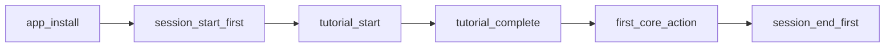
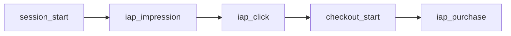
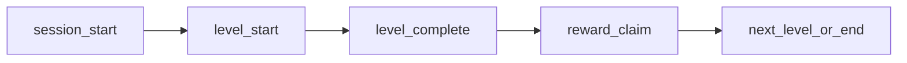
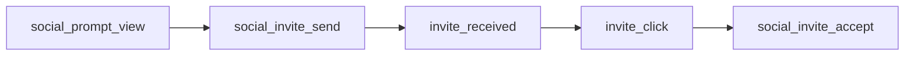
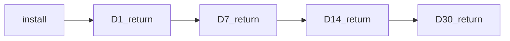
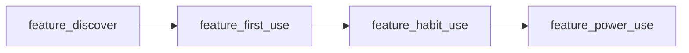

# /speckit.analytics

```yaml
id: speckit.analytics
version: 1.0.0
persona: data-analyst-agent
model: opus
thinking_budget: 80000

flags:
  - name: --thinking-depth
    type: choice
    choices: [quick, standard, thorough, deep, expert, ultrathink]
    default: thorough
    description: |
      Research depth and thinking budget per agent (Category C - Strategic, 6 tiers):
      - quick: 16K budget, 5 core agents, 90s timeout (~$0.32)
      - standard: 32K budget, 7 agents, 120s timeout (~$0.90)
      - thorough: 64K budget, 9 agents, 180s timeout (~$2.30) [RECOMMENDED]
      - deep: 96K budget, 9 agents, 240s timeout (~$3.46)
      - expert: 144K budget, 9 agents, 300s timeout (~$5.18)
      - ultrathink: 200K budget, 9 agents, 360s timeout (~$7.20) [MAXIMUM DEPTH]

description: |
  Analytics Setup & Dashboard Creation for mobile games. Configures SDK integration,
  defines event taxonomy, creates automated cohort reports, and generates KPI dashboards.
  Supports GameAnalytics, Firebase Analytics, Amplitude, and custom solutions.

skills:
  - analytics-architecture
  - event-taxonomy
  - cohort-analysis
  - dashboard-design
  - data-pipeline

inputs:
  required:
    - memory/gdd.md         # Game Design Document (Core Loop, Economy, Monetization)
  optional:
    - memory/concept.md     # Product concept with success metrics
    - memory/spec.md        # Feature specification
    - memory/softlaunch-report.md  # Existing metrics if available

outputs:
  primary:
    - memory/analytics.md           # Analytics implementation guide
    - memory/event-taxonomy.md      # Complete event schema
    - memory/dashboard-specs.md     # Dashboard definitions
  secondary:
    - memory/analytics-sdk-config.json   # SDK configuration export
    - memory/cohort-queries.sql          # SQL queries for cohort analysis

quality_gates:
  - id: QG-ANALYTICS-001
    name: Event Coverage
    threshold: "100% core loop tracked"
    severity: CRITICAL
    description: "All core loop actions must have analytics events"

  - id: QG-ANALYTICS-002
    name: Revenue Attribution
    threshold: "100% purchases tracked with context"
    severity: CRITICAL
    description: "All IAP must be attributable to source"

  - id: QG-ANALYTICS-003
    name: Funnel Completeness
    threshold: "≥5 key funnels defined"
    severity: HIGH
    description: "Critical user journeys must be measurable"

  - id: QG-ANALYTICS-004
    name: KPI Dashboard Coverage
    threshold: "D1/D7/D30, ARPDAU, LTV tracked"
    severity: CRITICAL
    description: "Core KPIs must have dashboards"

  - id: QG-ANALYTICS-005
    name: Event Naming Convention
    threshold: "100% compliance with taxonomy"
    severity: HIGH
    description: "All events follow naming standards"

pre_gates:
  - id: PG-ANALYTICS-001
    check: "GDD exists with monetization and core loop defined"
    source: memory/gdd.md

inline_gates:
  - id: IG-ANALYTICS-001
    phase: event_design
    check: "No PII in event parameters"
    severity: CRITICAL

  - id: IG-ANALYTICS-002
    phase: sdk_config
    check: "GDPR/CCPA compliance verified"
    severity: CRITICAL

  - id: IG-ANALYTICS-003
    phase: dashboard
    check: "All metrics have clear definitions"
    severity: HIGH

handoffs:
  - command: /speckit.liveops
    condition: "Analytics ready for LiveOps planning"
    context: "Event taxonomy and dashboards ready"

  - command: /speckit.softlaunch
    condition: "Analytics ready for soft launch tracking"
    context: "All KPIs and funnels instrumented"

  - command: /speckit.implement
    condition: "Analytics SDK needs implementation"
    context: "SDK config and event specifications ready"

  - command: /speckit.monitor
    condition: "Production monitoring needed"
    context: "Analytics foundation established"

claude_code:
  model: opus
  reasoning_mode: extended
  rate_limits:
    default_tier: thorough
    tiers:
      quick:
        thinking_budget: 16000
        max_parallel: 3
        batch_delay: 6000
        wave_overlap_threshold: 0.85
        cost_multiplier: 1.0
      standard:
        thinking_budget: 32000
        max_parallel: 4
        batch_delay: 4000
        wave_overlap_threshold: 0.80
        cost_multiplier: 1.2
      thorough:
        thinking_budget: 64000
        max_parallel: 6
        batch_delay: 2000
        wave_overlap_threshold: 0.70
        cost_multiplier: 1.5
      deep:
        thinking_budget: 96000
        max_parallel: 5
        batch_delay: 2500
        wave_overlap_threshold: 0.65
        cost_multiplier: 2.0
      expert:
        thinking_budget: 144000
        max_parallel: 4
        batch_delay: 3000
        wave_overlap_threshold: 0.60
        cost_multiplier: 2.5
      ultrathink:
        thinking_budget: 200000
        max_parallel: 4
        batch_delay: 3500
        wave_overlap_threshold: 0.55
        cost_multiplier: 3.0

  depth_defaults:
    quick:
      thinking_budget: 16000
      agents: 5
      timeout: 90
    standard:
      thinking_budget: 32000
      agents: 7
      timeout: 120
    thorough:
      thinking_budget: 64000
      agents: 9
      timeout: 180
    deep:
      thinking_budget: 96000
      agents: 9
      timeout: 240
    expert:
      thinking_budget: 144000
      agents: 9
      timeout: 300
    ultrathink:
      thinking_budget: 200000
      agents: 9
      timeout: 360

  user_tier_fallback:
    enabled: true
    rules:
      - condition: "user_tier == 'free' AND requested_depth == 'thorough'"
        fallback_depth: "thorough"
        fallback_thinking: 16000
        warning_message: |
          ℹ️  **Free tier running Thorough mode at 25% capacity** (16K of 64K budget).
          For full thorough analysis, upgrade to Pro tier.

      - condition: "user_tier == 'free' AND requested_depth == 'standard'"
        fallback_depth: "standard"
        fallback_thinking: 8000
        warning_message: |
          ℹ️  **Free tier running Standard mode at 25% capacity** (8K of 32K budget).

      - condition: "user_tier == 'free' AND requested_depth == 'quick'"
        fallback_depth: "quick"
        fallback_thinking: 4000
        warning_message: |
          ℹ️  **Free tier running Quick mode at 25% capacity** (4K of 16K budget).

      - condition: "user_tier == 'free' AND requested_depth IN ['deep', 'expert', 'ultrathink']"
        fallback_depth: "thorough"
        fallback_thinking: 16000
        warning_message: |
          ⚠️  **Deep/Expert/Ultrathink modes require Pro tier minimum**.
          Auto-downgrading to **Thorough** mode at 25% capacity (16K budget).

      - condition: "user_tier == 'pro' AND requested_depth == 'thorough'"
        fallback_depth: "thorough"
        fallback_thinking: 43000
        warning_message: |
          ℹ️  **Pro tier running Thorough mode at 67% capacity** (43K of 64K budget).

      - condition: "user_tier == 'pro' AND requested_depth == 'deep'"
        fallback_depth: "deep"
        fallback_thinking: 72000
        warning_message: |
          ℹ️  **Pro tier running Deep mode at 75% capacity** (72K of 96K budget).

      - condition: "user_tier == 'pro' AND requested_depth == 'expert'"
        fallback_depth: "expert"
        fallback_thinking: 120000
        warning_message: |
          ℹ️  **Pro tier running Expert mode at 83% capacity** (120K of 144K budget).

      - condition: "user_tier == 'pro' AND requested_depth == 'ultrathink'"
        fallback_depth: "ultrathink"
        fallback_thinking: 160000
        warning_message: |
          ℹ️  **Pro tier running Ultrathink mode at 80% capacity** (160K of 200K budget).
          For full 200K capacity, upgrade to Max tier.

  cost_breakdown:
    quick: {cost: $0.32, time: "90-120s"}
    standard: {cost: $0.90, time: "120-180s"}
    thorough: {cost: $2.30, time: "180-240s"}
    deep: {cost: $3.46, time: "240-300s"}
    expert: {cost: $5.18, time: "300-360s"}
    ultrathink: {cost: $7.20, time: "360-480s"}

  cache_hierarchy: full
  subagents:
    wave_1_analysis:
      parallel: true
      agents:
        - name: requirements-analyst
          task: "Extract analytics requirements from GDD and spec"
          model: sonnet

        - name: platform-researcher
          task: "Research SDK options and best practices"
          model: sonnet

        - name: benchmark-analyst
          task: "Gather industry benchmarks for KPIs"
          model: sonnet

    wave_2_design:
      parallel: true
      depends_on: wave_1_analysis
      agents:
        - name: taxonomy-designer
          task: "Design event taxonomy and schema"
          model: opus

        - name: funnel-designer
          task: "Define conversion funnels"
          model: opus

        - name: dashboard-architect
          task: "Design KPI dashboards"
          model: opus

    wave_3_implementation:
      parallel: true
      depends_on: wave_2_design
      agents:
        - name: sdk-configurator
          task: "Generate SDK configuration"
          model: sonnet

        - name: query-generator
          task: "Create SQL queries for cohorts"
          model: sonnet

        - name: validator
          task: "Validate against quality gates"
          model: sonnet
```

---

## Overview

`/speckit.analytics` establishes comprehensive analytics infrastructure for mobile games, ensuring data-driven decision making from day one. The command delivers:

1. **Analytics Implementation Guide** - Complete setup instructions for chosen SDK
2. **Event Taxonomy** - Standardized event naming and parameter schemas
3. **Dashboard Specifications** - KPI dashboards for all stakeholders
4. **Cohort Analysis Queries** - Pre-built SQL for retention and LTV analysis
5. **SDK Configuration** - Ready-to-deploy configuration files

### Why Analytics Architecture Matters

| Without Proper Analytics | With Structured Analytics |
|-------------------------|---------------------------|
| "Users are churning" | "D1 drops at level 5, session 2" |
| "Revenue is down" | "Offer conversion dropped 15% for new users" |
| "Something is wrong" | "Core loop completion rate -8% since update" |
| Reactive decisions | Proactive optimization |

**Industry Standards:**
- Supercell: 200+ events per game, real-time dashboards
- King: Custom event taxonomy, automated alerting
- Zynga: Comprehensive funnel tracking, A/B test integration
- Voodoo: Minimalist tracking (30-50 events), fast iteration

---

## Inputs

### Required Inputs

#### 1. Game Design Document (`memory/gdd.md`)

```markdown
## Required GDD Sections for Analytics

### Core Loop
- Primary actions (what players do)
- Progression milestones
- Session structure

### Economy Design
- Currency types
- Earning methods
- Spending sinks

### Monetization
- IAP catalog with SKUs
- Ad placements
- Subscription tiers

### Metagame Systems
- Collections
- Social features
- Competitive modes
```

### Optional Inputs

| Input | Purpose |
|-------|---------|
| `memory/concept.md` | Success metrics from product concept |
| `memory/spec.md` | Feature-specific tracking requirements |
| `memory/softlaunch-report.md` | Existing data to inform design |

---

## Process

### Phase 1: Analytics Requirements Analysis

**Duration: 10-15 minutes**

#### 1.1 Core Loop Event Mapping

```markdown
## Core Loop Analysis

### Primary Actions
| Action | Frequency | Analytics Purpose |
|--------|-----------|-------------------|
| [Action 1] | Per session | Engagement depth |
| [Action 2] | Per session | Core loop health |
| [Action 3] | Occasional | Feature adoption |

### Progression Milestones
| Milestone | Expected Time | Tracking Purpose |
|-----------|---------------|------------------|
| Tutorial Complete | 2-5 min | Onboarding success |
| First Currency Earn | 5-10 min | Economy entry |
| First Purchase | Day 1-7 | Monetization funnel |
| Level 10 | Day 1-3 | Retention predictor |
| First Social Action | Day 1-7 | Social adoption |
```

#### 1.2 Monetization Tracking Requirements

```markdown
## Monetization Events

### IAP Tracking
| Event | Parameters | Purpose |
|-------|------------|---------|
| iap_impression | sku, placement, context | Funnel entry |
| iap_click | sku, placement | Intent |
| iap_purchase | sku, revenue, currency | Conversion |
| iap_failure | sku, error_code | Troubleshooting |

### Ad Tracking
| Event | Parameters | Purpose |
|-------|------------|---------|
| ad_request | type, placement | Fill rate |
| ad_impression | type, placement, revenue | Revenue |
| ad_click | type, placement | Engagement |
| ad_complete | type, placement, reward | Reward economy |

### Attribution Requirements
- First-touch source
- Last-touch source
- Campaign ID
- Creative ID
- Install date
```

#### 1.3 SDK Selection Matrix

```markdown
## Analytics SDK Comparison

| Feature | GameAnalytics | Firebase | Amplitude | Custom |
|---------|---------------|----------|-----------|--------|
| Free Tier | 100K MAU | Generous | 10M events | N/A |
| Real-time | Limited | Yes | Yes | Depends |
| Cohorts | Yes | Limited | Yes | Yes |
| Funnels | Yes | Yes | Yes | Yes |
| A/B Testing | No | Yes | Yes | Depends |
| Export | Yes | BigQuery | Yes | Yes |
| Game Focus | Yes | No | No | N/A |
| Setup Time | 1 day | 1-2 days | 1-2 days | 1-2 weeks |

### Recommendation Matrix
| Game Type | Recommended | Reason |
|-----------|-------------|--------|
| Indie/Small | GameAnalytics | Game-focused, generous free tier |
| Mid-size | Firebase + GA | Best of both, BigQuery export |
| Enterprise | Amplitude | Advanced analysis, reliability |
| Data-heavy | Custom + Snowflake | Full control, complex queries |
```

---

### Phase 2: Event Taxonomy Design

**Duration: 20-30 minutes**

#### 2.1 Event Naming Convention

```markdown
## Event Naming Standards

### Format: `{category}_{action}_{object}`

### Categories
| Category | Description | Examples |
|----------|-------------|----------|
| session | App lifecycle | session_start, session_end |
| level | Level progression | level_start, level_complete |
| economy | Currency events | economy_earn, economy_spend |
| iap | Purchases | iap_impression, iap_purchase |
| ad | Advertisements | ad_request, ad_impression |
| social | Social features | social_share, social_invite |
| event | LiveOps events | event_start, event_complete |
| ui | UI interactions | ui_button_click, ui_screen_view |
| error | Errors and issues | error_crash, error_api |

### Naming Rules
1. All lowercase
2. Underscore separators
3. No spaces or special characters
4. Max 40 characters
5. Consistent action verbs: start, complete, fail, earn, spend, view, click

### Parameter Standards
| Type | Format | Examples |
|------|--------|----------|
| IDs | snake_case string | user_id, level_id, item_id |
| Counts | integer | coins_earned, attempts |
| Currency | string | usd, coins, gems |
| Boolean | boolean | is_first_time, was_successful |
| Timestamp | ISO8601 | event_time |
| Enums | snake_case | placement_home, source_daily_reward |
```

#### 2.2 Standard Event Schema

```yaml
event_schema:
  # Session Events
  session_start:
    description: "User opens the app"
    parameters:
      session_id: { type: string, required: true }
      is_first_session: { type: boolean, required: true }
      days_since_install: { type: integer, required: true }
      days_since_last_session: { type: integer, required: true }
      device_type: { type: string, required: true }
      os_version: { type: string, required: true }
      app_version: { type: string, required: true }

  session_end:
    description: "User closes the app"
    parameters:
      session_id: { type: string, required: true }
      session_duration_seconds: { type: integer, required: true }
      levels_played: { type: integer, required: true }
      coins_earned: { type: integer, required: false }
      coins_spent: { type: integer, required: false }

  # Level Events
  level_start:
    description: "User begins a level"
    parameters:
      level_id: { type: string, required: true }
      level_number: { type: integer, required: true }
      attempt_number: { type: integer, required: true }
      boosters_used: { type: array, required: false }

  level_complete:
    description: "User completes a level"
    parameters:
      level_id: { type: string, required: true }
      level_number: { type: integer, required: true }
      stars_earned: { type: integer, required: false }
      time_seconds: { type: integer, required: true }
      moves_used: { type: integer, required: false }
      score: { type: integer, required: false }

  level_fail:
    description: "User fails a level"
    parameters:
      level_id: { type: string, required: true }
      level_number: { type: integer, required: true }
      fail_reason: { type: string, required: true }
      progress_percent: { type: float, required: false }

  # Economy Events
  economy_earn:
    description: "User earns currency"
    parameters:
      currency_type: { type: string, required: true }
      amount: { type: integer, required: true }
      source: { type: string, required: true }
      balance_after: { type: integer, required: true }

  economy_spend:
    description: "User spends currency"
    parameters:
      currency_type: { type: string, required: true }
      amount: { type: integer, required: true }
      sink: { type: string, required: true }
      item_id: { type: string, required: false }
      balance_after: { type: integer, required: true }

  # IAP Events
  iap_impression:
    description: "User sees IAP offer"
    parameters:
      sku: { type: string, required: true }
      price_usd: { type: float, required: true }
      placement: { type: string, required: true }
      trigger: { type: string, required: true }

  iap_purchase:
    description: "User completes purchase"
    parameters:
      sku: { type: string, required: true }
      revenue_usd: { type: float, required: true }
      currency_code: { type: string, required: true }
      transaction_id: { type: string, required: true }
      is_first_purchase: { type: boolean, required: true }
      placement: { type: string, required: true }

  # Ad Events
  ad_impression:
    description: "Ad is displayed"
    parameters:
      ad_type: { type: string, required: true, enum: [rewarded, interstitial, banner] }
      placement: { type: string, required: true }
      ad_network: { type: string, required: true }
      revenue_usd: { type: float, required: false }

  ad_complete:
    description: "User completes rewarded ad"
    parameters:
      ad_type: { type: string, required: true }
      placement: { type: string, required: true }
      reward_type: { type: string, required: true }
      reward_amount: { type: integer, required: true }

  # Social Events
  social_invite_send:
    description: "User sends invite"
    parameters:
      channel: { type: string, required: true }
      invite_type: { type: string, required: true }

  social_invite_accept:
    description: "Invited user installs"
    parameters:
      inviter_id: { type: string, required: true }
      invite_type: { type: string, required: true }

  # LiveOps Events
  event_start:
    description: "User enters LiveOps event"
    parameters:
      event_id: { type: string, required: true }
      event_type: { type: string, required: true }

  event_complete:
    description: "User completes LiveOps event"
    parameters:
      event_id: { type: string, required: true }
      event_type: { type: string, required: true }
      rewards_claimed: { type: array, required: true }
      completion_time_hours: { type: float, required: true }
```

#### 2.3 Custom Event Design

```markdown
## Game-Specific Events

### Core Loop Events
Based on GDD analysis, define events for:

| Game Action | Event Name | Key Parameters |
|-------------|------------|----------------|
| [Core Action 1] | action_[name] | [params] |
| [Core Action 2] | action_[name] | [params] |

### Feature Events
For each major feature:

| Feature | Entry Event | Exit Event | Key Metrics |
|---------|-------------|------------|-------------|
| [Feature 1] | feature_[name]_start | feature_[name]_end | [metrics] |
| [Feature 2] | feature_[name]_start | feature_[name]_end | [metrics] |

### Error Events
| Error Type | Event Name | Parameters |
|------------|------------|------------|
| Crash | error_crash | stack_trace, device, screen |
| API Error | error_api | endpoint, status_code, message |
| Payment Error | error_payment | sku, error_code, retry_count |
```

---

### Phase 3: Funnel Definition

**Duration: 15-20 minutes**

#### 3.1 Core Funnels

```markdown
## Required Funnels

### 1. First Time User Experience (FTUE) Funnel


**Benchmarks:**
| Step | Target | Industry Avg |
|------|--------|--------------|
| Install → Session | 80%+ | 70-80% |
| Session → Tutorial Start | 95%+ | 90-95% |
| Tutorial Start → Complete | 70%+ | 60-80% |
| Tutorial → Core Action | 80%+ | 70-85% |
| Complete FTUE | 50%+ | 40-60% |

### 2. Monetization Funnel


**Benchmarks:**
| Step | Target | Industry Avg |
|------|--------|--------------|
| Session → Impression | 30-50% | 20-40% |
| Impression → Click | 5-15% | 3-10% |
| Click → Checkout | 40-60% | 30-50% |
| Checkout → Purchase | 70-90% | 60-80% |

### 3. Session Flow Funnel


### 4. Social Funnel


### 5. Retention Funnel


**Benchmarks by Genre:**
| Genre | D1 Target | D7 Target | D30 Target |
|-------|-----------|-----------|------------|
| Casual | 40-50% | 15-25% | 5-10% |
| Mid-Core | 35-45% | 12-20% | 4-8% |
| Hyper-Casual | 30-40% | 8-15% | 2-5% |
| RPG | 45-55% | 20-30% | 8-15% |
```

#### 3.2 Feature-Specific Funnels

```markdown
## Feature Adoption Funnels

### Template


### Metrics per Funnel Step
| Step | Definition | Target |
|------|------------|--------|
| Discover | First exposure | 80%+ of eligible |
| First Use | Complete first action | 50%+ of discovered |
| Habit Use | 3+ uses in 7 days | 30%+ of first users |
| Power Use | 7+ uses in 7 days | 10%+ of habit users |
```

---

### Phase 4: KPI Dashboard Design

**Duration: 20-30 minutes**

#### 4.1 Executive Dashboard

```markdown
## Executive Dashboard (Daily View)

### North Star Metrics
| Metric | Definition | Target | Current | Trend |
|--------|------------|--------|---------|-------|
| DAU | Unique users/day | [X] | [value] | [trend] |
| Revenue | Total daily | $[X] | [value] | [trend] |
| LTV (D30) | 30-day value | $[X] | [value] | [trend] |

### Health Indicators
| Metric | Definition | Target | Status |
|--------|------------|--------|--------|
| D1 Retention | % returning D1 | [X]% | 🟢/🟡/🔴 |
| D7 Retention | % returning D7 | [X]% | 🟢/🟡/🔴 |
| ARPDAU | Revenue/DAU | $[X] | 🟢/🟡/🔴 |
| Conversion | DAU→Payer % | [X]% | 🟢/🟡/🔴 |

### Visualizations
1. DAU trend (30-day rolling)
2. Revenue trend (30-day rolling)
3. Retention curves (D1/D7/D30 by cohort)
4. Revenue by source pie chart (IAP/Ads/Subs)
```

#### 4.2 Product Dashboard

```markdown
## Product Dashboard

### Engagement Metrics
| Metric | Definition | Calculation |
|--------|------------|-------------|
| Sessions/DAU | Avg sessions | session_count / DAU |
| Session Length | Avg duration | SUM(duration) / sessions |
| Levels/Session | Avg levels | levels_played / sessions |
| Actions/Session | Core actions | action_count / sessions |

### Progression Metrics
| Metric | Definition | Benchmark |
|--------|------------|-----------|
| FTUE Completion | % completing tutorial | 50%+ |
| Level Distribution | Players per level | Even falloff |
| Progression Velocity | Levels per day | [X] |
| Stuck Points | High fail rate levels | <10% per level |

### Feature Adoption
| Feature | Discovery | First Use | Retention |
|---------|-----------|-----------|-----------|
| [Feature 1] | [X]% | [X]% | [X]% |
| [Feature 2] | [X]% | [X]% | [X]% |

### Visualizations
1. Session depth histogram
2. Level progression waterfall
3. Feature adoption funnel
4. Daily active feature usage
```

#### 4.3 Monetization Dashboard

```markdown
## Monetization Dashboard

### Revenue Metrics
| Metric | Definition | Target |
|--------|------------|--------|
| Gross Revenue | Total before fees | $[X]/day |
| Net Revenue | After platform cut | $[X]/day |
| ARPDAU | Revenue / DAU | $[X] |
| ARPPU | Revenue / Payers | $[X] |

### Conversion Metrics
| Metric | Definition | Target |
|--------|------------|--------|
| Payer Conversion | DAU → First Purchase | [X]% |
| Payer Retention | Payers returning | [X]% |
| Repeat Purchase | % repeat buyers | [X]% |
| Time to First Purchase | Median days | [X] days |

### IAP Performance
| SKU | Price | Purchases | Revenue | Conversion |
|-----|-------|-----------|---------|------------|
| [SKU 1] | $X.XX | [count] | $[X] | [X]% |

### Ad Performance
| Placement | Impressions | Revenue | eCPM |
|-----------|-------------|---------|------|
| [Placement] | [count] | $[X] | $[X] |

### Visualizations
1. Revenue by source (stacked area)
2. Payer funnel (impression → purchase)
3. SKU performance matrix
4. LTV curves by acquisition source
```

#### 4.4 Retention Dashboard

```markdown
## Retention Dashboard

### Cohort Retention Table
| Cohort | D1 | D3 | D7 | D14 | D30 |
|--------|-----|-----|-----|------|------|
| [Week 1] | X% | X% | X% | X% | X% |
| [Week 2] | X% | X% | X% | X% | X% |
| [Week 3] | X% | X% | X% | X% | X% |

### Retention by Segment
| Segment | D1 | D7 | D30 |
|---------|-----|-----|------|
| All Users | X% | X% | X% |
| Payers | X% | X% | X% |
| Non-Payers | X% | X% | X% |
| Tutorial Complete | X% | X% | X% |
| Level 10+ | X% | X% | X% |

### Churn Analysis
| Churn Point | % of Churners | Top Reason |
|-------------|---------------|------------|
| FTUE | [X]% | [reason] |
| Day 1 | [X]% | [reason] |
| Day 2-7 | [X]% | [reason] |
| Day 8-30 | [X]% | [reason] |

### Visualizations
1. Retention curve comparison (by cohort)
2. Churn waterfall chart
3. Retention by segment (small multiples)
4. Rolling 7-day retention trend
```

#### 4.5 LiveOps Dashboard

```markdown
## LiveOps Dashboard

### Active Events
| Event | Type | Start | End | Participation |
|-------|------|-------|-----|---------------|
| [Event] | [Type] | [Date] | [Date] | [X]% DAU |

### Event Performance
| Metric | Current Event | Benchmark |
|--------|---------------|-----------|
| Participation Rate | [X]% | [X]% |
| Completion Rate | [X]% | [X]% |
| Revenue Lift | +[X]% | +[X]% |
| Engagement Lift | +[X]% | +[X]% |

### A/B Test Status
| Test | Variants | Sample | p-value | Winner |
|------|----------|--------|---------|--------|
| [Test 1] | A/B | [N] | [p] | [result] |

### Visualizations
1. Event participation over time
2. Revenue overlay on event calendar
3. A/B test confidence intervals
4. Content calendar with performance
```

---

### Phase 5: SQL Queries & Automation

**Duration: 15-20 minutes**

#### 5.1 Cohort Analysis Queries

```sql
-- D1/D7/D30 Retention by Cohort
WITH cohorts AS (
  SELECT
    user_id,
    DATE(first_session_time) AS cohort_date
  FROM users
),
activity AS (
  SELECT
    user_id,
    DATE(event_time) AS activity_date
  FROM events
  WHERE event_name = 'session_start'
)
SELECT
  c.cohort_date,
  COUNT(DISTINCT c.user_id) AS cohort_size,
  COUNT(DISTINCT CASE WHEN DATE_DIFF(a.activity_date, c.cohort_date, DAY) = 1
    THEN a.user_id END) * 100.0 / COUNT(DISTINCT c.user_id) AS d1_retention,
  COUNT(DISTINCT CASE WHEN DATE_DIFF(a.activity_date, c.cohort_date, DAY) = 7
    THEN a.user_id END) * 100.0 / COUNT(DISTINCT c.user_id) AS d7_retention,
  COUNT(DISTINCT CASE WHEN DATE_DIFF(a.activity_date, c.cohort_date, DAY) = 30
    THEN a.user_id END) * 100.0 / COUNT(DISTINCT c.user_id) AS d30_retention
FROM cohorts c
LEFT JOIN activity a ON c.user_id = a.user_id
GROUP BY c.cohort_date
ORDER BY c.cohort_date DESC;

-- LTV Calculation (30-day)
WITH user_revenue AS (
  SELECT
    user_id,
    DATE(first_session_time) AS cohort_date,
    SUM(CASE WHEN DATE_DIFF(event_time, first_session_time, DAY) <= 30
      THEN revenue_usd ELSE 0 END) AS ltv_30
  FROM events e
  JOIN users u USING (user_id)
  WHERE event_name = 'iap_purchase'
  GROUP BY user_id, cohort_date
)
SELECT
  cohort_date,
  COUNT(DISTINCT user_id) AS users,
  AVG(ltv_30) AS avg_ltv_30,
  PERCENTILE_CONT(ltv_30, 0.5) OVER () AS median_ltv_30
FROM user_revenue
GROUP BY cohort_date;

-- ARPDAU by Day
SELECT
  DATE(event_time) AS date,
  COUNT(DISTINCT user_id) AS dau,
  SUM(revenue_usd) AS revenue,
  SUM(revenue_usd) / COUNT(DISTINCT user_id) AS arpdau
FROM events
WHERE event_time >= DATE_SUB(CURRENT_DATE(), INTERVAL 30 DAY)
GROUP BY date
ORDER BY date;

-- Funnel Analysis
WITH funnel AS (
  SELECT
    user_id,
    MAX(CASE WHEN event_name = 'session_start' THEN 1 ELSE 0 END) AS step_1,
    MAX(CASE WHEN event_name = 'tutorial_complete' THEN 1 ELSE 0 END) AS step_2,
    MAX(CASE WHEN event_name = 'first_level_complete' THEN 1 ELSE 0 END) AS step_3,
    MAX(CASE WHEN event_name = 'iap_purchase' THEN 1 ELSE 0 END) AS step_4
  FROM events
  WHERE event_time >= DATE_SUB(CURRENT_DATE(), INTERVAL 7 DAY)
  GROUP BY user_id
)
SELECT
  COUNT(*) AS total_users,
  SUM(step_1) AS started_session,
  SUM(step_2) AS completed_tutorial,
  SUM(step_3) AS completed_first_level,
  SUM(step_4) AS made_purchase,
  SUM(step_2) * 100.0 / SUM(step_1) AS tutorial_rate,
  SUM(step_3) * 100.0 / SUM(step_2) AS level_rate,
  SUM(step_4) * 100.0 / SUM(step_3) AS purchase_rate
FROM funnel;
```

#### 5.2 Automated Reporting Queries

```sql
-- Daily KPI Report
CREATE OR REPLACE VIEW daily_kpi_report AS
SELECT
  DATE(event_time) AS date,
  -- Engagement
  COUNT(DISTINCT user_id) AS dau,
  COUNT(DISTINCT CASE WHEN is_new_user THEN user_id END) AS new_users,
  COUNT(*) FILTER (WHERE event_name = 'session_start') AS sessions,
  AVG(session_duration_seconds) AS avg_session_length,
  -- Monetization
  SUM(revenue_usd) AS gross_revenue,
  COUNT(DISTINCT CASE WHEN event_name = 'iap_purchase' THEN user_id END) AS payers,
  SUM(revenue_usd) / NULLIF(COUNT(DISTINCT user_id), 0) AS arpdau,
  -- Progression
  COUNT(*) FILTER (WHERE event_name = 'level_complete') AS levels_completed,
  COUNT(*) FILTER (WHERE event_name = 'tutorial_complete') AS tutorials_completed
FROM events
GROUP BY DATE(event_time);

-- Weekly Retention Report
CREATE OR REPLACE VIEW weekly_retention_report AS
WITH weekly_cohorts AS (
  SELECT
    user_id,
    DATE_TRUNC(first_session_time, WEEK) AS cohort_week
  FROM users
)
SELECT
  cohort_week,
  COUNT(DISTINCT user_id) AS cohort_size,
  -- Calculate retention for weeks 1-8
  
  COUNT(DISTINCT CASE
    WHEN EXISTS (
      SELECT 1 FROM events e
      WHERE e.user_id = c.user_id
      AND DATE_TRUNC(e.event_time, WEEK) = DATE_ADD(c.cohort_week, INTERVAL {{ week }} WEEK)
    ) THEN c.user_id
  END) * 100.0 / COUNT(DISTINCT c.user_id) AS week_{{ week }}_retention,
  
FROM weekly_cohorts c
GROUP BY cohort_week;
```

#### 5.3 Alert Queries

```sql
-- Revenue Anomaly Detection
WITH daily_revenue AS (
  SELECT
    DATE(event_time) AS date,
    SUM(revenue_usd) AS revenue
  FROM events
  WHERE event_name = 'iap_purchase'
  GROUP BY DATE(event_time)
),
stats AS (
  SELECT
    AVG(revenue) AS avg_revenue,
    STDDEV(revenue) AS std_revenue
  FROM daily_revenue
  WHERE date >= DATE_SUB(CURRENT_DATE(), INTERVAL 30 DAY)
)
SELECT
  d.date,
  d.revenue,
  CASE
    WHEN d.revenue < s.avg_revenue - 2 * s.std_revenue THEN 'ALERT: Low Revenue'
    WHEN d.revenue > s.avg_revenue + 2 * s.std_revenue THEN 'ALERT: High Revenue'
    ELSE 'Normal'
  END AS status
FROM daily_revenue d, stats s
WHERE d.date = CURRENT_DATE();

-- Retention Drop Alert
WITH retention_trend AS (
  SELECT
    DATE(first_session_time) AS cohort_date,
    COUNT(DISTINCT CASE WHEN d1_return THEN user_id END) * 100.0 /
      COUNT(DISTINCT user_id) AS d1_retention
  FROM users
  WHERE first_session_time >= DATE_SUB(CURRENT_DATE(), INTERVAL 14 DAY)
  GROUP BY DATE(first_session_time)
)
SELECT
  cohort_date,
  d1_retention,
  CASE
    WHEN d1_retention < LAG(d1_retention, 1) OVER (ORDER BY cohort_date) * 0.9
      THEN 'ALERT: D1 Retention Drop >10%'
    ELSE 'Normal'
  END AS status
FROM retention_trend
ORDER BY cohort_date DESC
LIMIT 7;
```

---

## Quality Gates

### QG-ANALYTICS-001: Event Coverage
```yaml
id: QG-ANALYTICS-001
name: Event Coverage
threshold: "100% core loop tracked"
severity: CRITICAL

validation:
  method: "Map GDD core loop to events"
  checklist:
    - All primary actions have events
    - All currency flows tracked (earn/spend)
    - All monetization touchpoints captured
    - Session lifecycle complete

failure_action:
  - Identify missing events
  - Add to event taxonomy
  - MUST NOT proceed without coverage
```

### QG-ANALYTICS-002: Revenue Attribution
```yaml
id: QG-ANALYTICS-002
name: Revenue Attribution
threshold: "100% purchases tracked with context"
severity: CRITICAL

validation:
  method: "Verify all IAP events have attribution"
  required_parameters:
    - transaction_id
    - sku
    - revenue_usd
    - placement
    - is_first_purchase

failure_action:
  - Add missing parameters
  - Update SDK implementation
  - MUST NOT launch without attribution
```

### QG-ANALYTICS-003: Funnel Completeness
```yaml
id: QG-ANALYTICS-003
name: Funnel Completeness
threshold: "≥5 key funnels defined"
severity: HIGH

required_funnels:
  - FTUE (First Time User Experience)
  - Monetization (Impression → Purchase)
  - Session (Start → End)
  - Retention (D1/D7/D30)
  - Core Loop (Primary gameplay)

failure_action:
  - Add missing funnels
  - Document funnel steps and events
```

### QG-ANALYTICS-004: KPI Dashboard Coverage
```yaml
id: QG-ANALYTICS-004
name: KPI Dashboard Coverage
threshold: "D1/D7/D30, ARPDAU, LTV tracked"
severity: CRITICAL

required_metrics:
  engagement:
    - DAU
    - Sessions per DAU
    - Session length
  retention:
    - D1 retention
    - D7 retention
    - D30 retention
  monetization:
    - Revenue
    - ARPDAU
    - ARPPU
    - LTV (D30)
    - Payer conversion

failure_action:
  - Add missing dashboard components
  - Verify data pipeline populates metrics
```

### QG-ANALYTICS-005: Event Naming Convention
```yaml
id: QG-ANALYTICS-005
name: Event Naming Convention
threshold: "100% compliance with taxonomy"
severity: HIGH

validation:
  rules:
    - lowercase_only: true
    - separator: underscore
    - format: "{category}_{action}_{object}"
    - max_length: 40

audit_method: "Regex validation of all event names"

failure_action:
  - Rename non-compliant events
  - Update documentation
```

---

## Outputs

### Primary Output: Analytics Implementation Guide (`memory/analytics.md`)

```markdown
# Analytics Implementation Guide

## SDK Selection
- **Primary SDK:** [GameAnalytics/Firebase/Amplitude]
- **Secondary SDK:** [if applicable]
- **Reason:** [rationale]

## Implementation Checklist

### Phase 1: SDK Setup
- [ ] Add SDK dependency
- [ ] Initialize on app start
- [ ] Configure environments (dev/staging/prod)
- [ ] Set up user identification
- [ ] Configure GDPR/CCPA consent

### Phase 2: Core Events
- [ ] Session events (start, end)
- [ ] Level events (start, complete, fail)
- [ ] Economy events (earn, spend)
- [ ] Tutorial events

### Phase 3: Monetization Events
- [ ] IAP funnel (impression, click, purchase)
- [ ] Ad events (request, impression, complete)
- [ ] Subscription events

### Phase 4: Custom Events
- [ ] [Game-specific events]

### Phase 5: Validation
- [ ] Debug mode testing
- [ ] Event verification
- [ ] Dashboard confirmation

## SDK Configuration
[See analytics-sdk-config.json]

## Event Reference
[See event-taxonomy.md]

## Dashboard Access
[Links to dashboards]
```

### Primary Output: Event Taxonomy (`memory/event-taxonomy.md`)

```markdown
# Event Taxonomy

## Version: 1.0.0
## Last Updated: [date]

## Naming Convention
[Category]_[Action]_[Object]

## Event Catalog

### Session Events
[Full event schema as defined in Phase 2]

### Level Events
[...]

### Economy Events
[...]

### Monetization Events
[...]

### Custom Events
[Game-specific events]

## Parameter Reference
[All parameters with types and required status]

## Changelog
[Track changes to taxonomy]
```

### Secondary Output: SDK Configuration (`memory/analytics-sdk-config.json`)

```json
{
  "sdk": "gameanalytics|firebase|amplitude",
  "version": "1.0.0",
  "environments": {
    "development": {
      "enabled": true,
      "debug": true,
      "gameKey": "[dev-key]"
    },
    "staging": {
      "enabled": true,
      "debug": false,
      "gameKey": "[staging-key]"
    },
    "production": {
      "enabled": true,
      "debug": false,
      "gameKey": "[prod-key]"
    }
  },
  "consent": {
    "gdpr_enabled": true,
    "ccpa_enabled": true,
    "default_consent": false
  },
  "events": {
    "auto_session": true,
    "auto_error": true,
    "custom_dimensions": [
      "player_level",
      "payer_status",
      "country"
    ]
  }
}
```

---

## Industry Benchmarks

### KPI Benchmarks by Genre

| Metric | Casual | Mid-Core | RPG | Hyper-Casual |
|--------|--------|----------|-----|--------------|
| D1 Retention | 40-50% | 35-45% | 45-55% | 30-40% |
| D7 Retention | 15-25% | 12-20% | 20-30% | 8-15% |
| D30 Retention | 5-10% | 4-8% | 8-15% | 2-5% |
| ARPDAU | $0.05-0.15 | $0.10-0.25 | $0.15-0.40 | $0.02-0.08 |
| Payer Conversion | 2-5% | 3-7% | 4-10% | 0.5-2% |
| Session Length | 5-10 min | 10-20 min | 15-30 min | 2-5 min |
| Sessions/Day | 3-5 | 2-4 | 2-3 | 5-10 |

### LTV Benchmarks (30-day)

| Market Tier | Casual | Mid-Core | RPG |
|-------------|--------|----------|-----|
| US/UK/AU | $0.50-2.00 | $1.00-5.00 | $2.00-10.00 |
| EU | $0.30-1.50 | $0.80-4.00 | $1.50-8.00 |
| APAC | $0.20-1.00 | $0.50-3.00 | $1.00-6.00 |
| LATAM | $0.10-0.50 | $0.30-1.50 | $0.50-3.00 |

### Event Volume Guidelines

| Game Type | Events/Session | Events/DAU | Daily Volume (1M DAU) |
|-----------|----------------|------------|----------------------|
| Casual | 20-50 | 60-150 | 60-150M |
| Mid-Core | 50-100 | 100-300 | 100-300M |
| RPG | 100-200 | 200-600 | 200-600M |
| Hyper-Casual | 10-30 | 50-150 | 50-150M |

---

## Examples

### Example 1: Match-3 Puzzle Game

```markdown
## Analytics Setup - Match-3

### Core Events
- level_start (level_number, boosters)
- level_complete (level_number, stars, moves, time)
- level_fail (level_number, fail_reason)
- booster_use (booster_type, level_number)

### Economy Events
- coins_earn (amount, source: level_complete|daily_reward|iap)
- coins_spend (amount, sink: lives|boosters|continues)
- lives_spend (context: level_start)
- lives_earn (source: time_regen|iap|reward)

### Key Funnels
1. FTUE: install → tutorial → first_3_levels → D1_return
2. Monetization: level_fail → offer_view → purchase
3. Core: level_start → level_complete → next_level

### Dashboards
1. Level performance (completion rates, difficulty)
2. Economy health (currency balance, inflation)
3. Payer analysis (conversion triggers, whale behavior)
```

### Example 2: Mobile RPG

```markdown
## Analytics Setup - Mobile RPG

### Core Events
- quest_start (quest_id, quest_type, player_level)
- quest_complete (quest_id, rewards, time_spent)
- combat_start (enemy_id, team_composition)
- combat_end (result, damage_dealt, time_spent)
- character_level_up (character_id, new_level)
- equipment_upgrade (item_id, new_tier)

### Gacha Events
- gacha_spin (banner_id, currency_type, is_multi)
- gacha_result (banner_id, items_received, rarity_distribution)

### Social Events
- guild_join (guild_id)
- guild_donate (resource_type, amount)
- pvp_match_start (opponent_power, mode)
- pvp_match_end (result, rank_change)

### Key Dashboards
1. Player progression (level distribution, stuck points)
2. Gacha analysis (conversion, pity rates, banner performance)
3. Guild health (activity, contribution, retention)
4. Combat balance (win rates, team compositions)
```

---

## Handoffs

### To `/speckit.liveops`
```markdown
When: Analytics setup complete
Context:
- Event taxonomy ready for LiveOps tracking
- Dashboard templates for event performance
- A/B test infrastructure configured
```

### To `/speckit.softlaunch`
```markdown
When: Ready for soft launch
Context:
- All KPIs instrumented
- Cohort analysis ready
- Real-time dashboards configured
```

### To `/speckit.implement`
```markdown
When: SDK needs implementation
Context:
- SDK configuration ready
- Event specifications complete
- Integration guide provided
```

### To `/speckit.monitor`
```markdown
When: Production monitoring needed
Context:
- Analytics foundation established
- Alert queries ready
- KPI thresholds defined
```

---

## Appendix

### A. GDPR/CCPA Compliance Checklist

```markdown
## Privacy Compliance

### Data Collection
- [ ] Obtain consent before tracking
- [ ] Document data collected
- [ ] Implement data minimization
- [ ] No PII in event parameters

### User Rights
- [ ] Data export functionality
- [ ] Data deletion functionality
- [ ] Consent management UI
- [ ] Opt-out mechanism

### Technical Requirements
- [ ] Consent state stored
- [ ] SDK respects consent
- [ ] No tracking before consent
- [ ] Audit trail maintained
```

### B. SDK-Specific Setup Guides

```markdown
## GameAnalytics Setup

1. Create account at gameanalytics.com
2. Create new game → Get game key and secret
3. Add SDK: `pod 'GA-SDK-IOS'` or `implementation 'com.gameanalytics.ga-sdk'`
4. Initialize:
```swift
GameAnalytics.initialize(gameKey: "key", gameSecret: "secret")
```

## Firebase Analytics Setup

1. Create Firebase project
2. Add app configuration (GoogleService-Info.plist / google-services.json)
3. Add SDK: `pod 'FirebaseAnalytics'` or `implementation 'com.google.firebase:firebase-analytics'`
4. Events auto-track after initialization

## Amplitude Setup

1. Create Amplitude project
2. Get API key
3. Add SDK: `pod 'Amplitude'` or `implementation 'com.amplitude:android-sdk'`
4. Initialize:
```swift
Amplitude.instance().initializeApiKey("YOUR_API_KEY")
```
```

### C. Debug & Validation Tools

```markdown
## Event Debugging

### GameAnalytics
- Use GA Debugger extension
- Check event log in dashboard (5 min delay)

### Firebase
- Enable debug mode: `adb shell setprop debug.firebase.analytics.app PACKAGE_NAME`
- Use DebugView in Firebase console

### Amplitude
- Enable debug logging
- Check User Lookup for real-time events

## Event Validation Checklist
- [ ] Event name follows convention
- [ ] All required parameters present
- [ ] Parameter types correct
- [ ] No PII in parameters
- [ ] Values within expected ranges
```

---

**Document Version:** 1.0.0
**Last Updated:** 2025-01-12
**Compatible with:** Spec-Kit v0.4.0+
