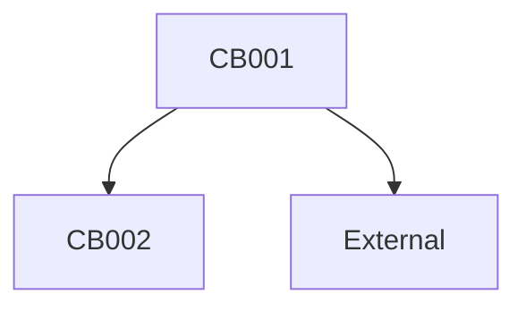

## Input
```text
$ARGUMENTS
```

---

## Goal

Capture and document current state of system components for brownfield changes:
1. Documents current behaviors (CB-xxx) with code locations
2. Identifies existing patterns and conventions
3. Maps dependencies between components
4. Extracts current API contracts (if applicable)
5. Captures performance baselines (if measurable)

**Output**: `FEATURE_DIR/baseline.md` (READ-ONLY for codebase, writes ONLY this file)

---

## Workflow (9 Steps)

### Step 1: Initialize Context

```text
Run {SCRIPT} → FEATURE_DIR
IF FEATURE_DIR missing → abort: "Create with /speckit.specify --init"
OUTPUT_PATH = FEATURE_DIR/baseline.md
```

### Step 2: Parse Scope Definition

```text
FROM $ARGUMENTS extract:
  SCOPE_PATTERNS = [file/directory paths with / or .]
  SCOPE_KEYWORDS = [quoted phrases]
  SCOPE_MODULES = [remaining terms]

IF all empty → prompt for scope → abort
```

### Step 3: Code Structure Analysis

```text
1. File Discovery: glob patterns, search keywords
2. Component Extraction: classes, functions, methods, imports, dependencies
3. Pattern Recognition: design patterns, framework conventions
```

### Step 4: Behavior Documentation

```text
FOR EACH component:
  CB-{NNN} = {
    id, component, file:line,
    current_behavior (from docstrings/names/tests/types),
    inputs, outputs, side_effects, dependencies
  }
```

### Step 5: Dependency Mapping

```text
FOR EACH component:
  deps = { imports, calls, inherits, uses }
  Mark: INTERNAL (in scope) vs EXTERNAL (out of scope)
```

### Step 6: API Contract Extraction

```text
IF API_ENDPOINT: method, path, request/response schema, auth
IF CLI_COMMAND: command, arguments, options, exit codes
```

### Step 7: Performance Baseline

```text
IF test suite has perf tests → extract metrics
ELIF monitoring data → extract
ELSE → mark as ESTIMATE
```

### Step 8: Generate baseline.md

```markdown
# Baseline: [SCOPE]

**Generated**: [DATE]
**Scope**: [patterns, modules, keywords]
**Components Analyzed**: [count]

## Current Behaviors

### CB-001: [Component Name]
**File**: `src/path/file.py:42`
**Type**: [Function | Class | Method]
**Current Behavior**: [description]
**Signature**: [code with types]
**Inputs**: [params]
**Outputs**: [returns, side effects]
**Dependencies**: [internal, external]
**Test Coverage**: [Covered | Partial | None]

## Dependency Graph


## API Contracts (if applicable)
| Aspect | Current State |
|--------|---------------|
| Method | [GET/POST] |
| Path | `/api/v1/...` |

## Performance Baselines (if available)
| Component | Metric | Value | Source |
|-----------|--------|-------|--------|

## Identified Patterns
| Pattern | Components | Description |

## Potential Limitations
| ID | Observation | Affected CBs | Impact |
| OBS-001 | [issue] | CB-001, CB-002 | [impact] |
```

### Step 9: Report

```text
Output: FEATURE_DIR/baseline.md
Summary: Components analyzed, CB count, dependencies, limitations
Next: /speckit.specify with brownfield mode
```

---

## Self-Review Phase [REF:SR-001]

### Quality Criteria

| ID | Check | Severity |
|----|-------|----------|
| SR-BASE-01 | At least one CB-xxx entry | CRITICAL |
| SR-BASE-02 | CB IDs unique | CRITICAL |
| SR-BASE-03 | CB format valid (CB-NNN, 3 digits) | HIGH |
| SR-BASE-04 | Code locations present (file:line) | CRITICAL |
| SR-BASE-05 | Code locations valid (files exist) | CRITICAL |
| SR-BASE-06 | Behavior descriptions non-empty | HIGH |
| SR-BASE-07 | Signatures documented | MEDIUM |
| SR-BASE-08 | Dependency graph populated | HIGH |
| SR-BASE-09 | Mermaid syntax valid | MEDIUM |
| SR-BASE-10 | No [TODO]/[TBD] placeholders | HIGH |

### Validation

```text
FOR EACH CB-xxx entry:
  1. Verify unique ID (CB-NNN format)
  2. Verify file:line exists in filesystem
  3. Verify behavior description present
  4. Verify signature code block exists

FOR EACH CB in mermaid graph:
  Verify CB exists in CB_ENTRIES
```

### Verdict Logic

```text
CRITICAL failures → FAIL (fix, retry max 3)
  - Missing CB → analyze more components
  - Invalid file refs → correct paths or remove
  - Duplicate IDs → renumber
HIGH failures → WARN
All pass → auto-handoff to /speckit.specify
```

---

## Quality Gates

| Gate | Check | Block Condition |
|------|-------|-----------------|
| Feature Directory | FEATURE_DIR exists | Missing |
| Scope Definition | User provided scope | No scope |
| Baseline Completeness | CB-xxx entries exist | No CB entries |
| Code Location Validity | All file refs valid | Invalid refs |

---

## Output Format

```text
┌─────────────────────────────────────────────────────────────┐
│ /speckit.baseline Complete                                   │
├─────────────────────────────────────────────────────────────┤
│ Output: {FEATURE_DIR}/baseline.md                            │
│                                                              │
│ Summary:                                                     │
│   Components Analyzed: {n}                                   │
│   Current Behaviors (CB): {n}                               │
│   Dependencies: {n} internal, {n} external                  │
│   API Contracts: {n}                                        │
│   Performance Baselines: {n}                                │
│   Potential Limitations: {n}                                │
│                                                              │
│ Self-Review: {PASS|WARN}                                    │
│ Next: /speckit.specify [brownfield]                         │
└─────────────────────────────────────────────────────────────┘
```

---

## Context

{ARGS}
