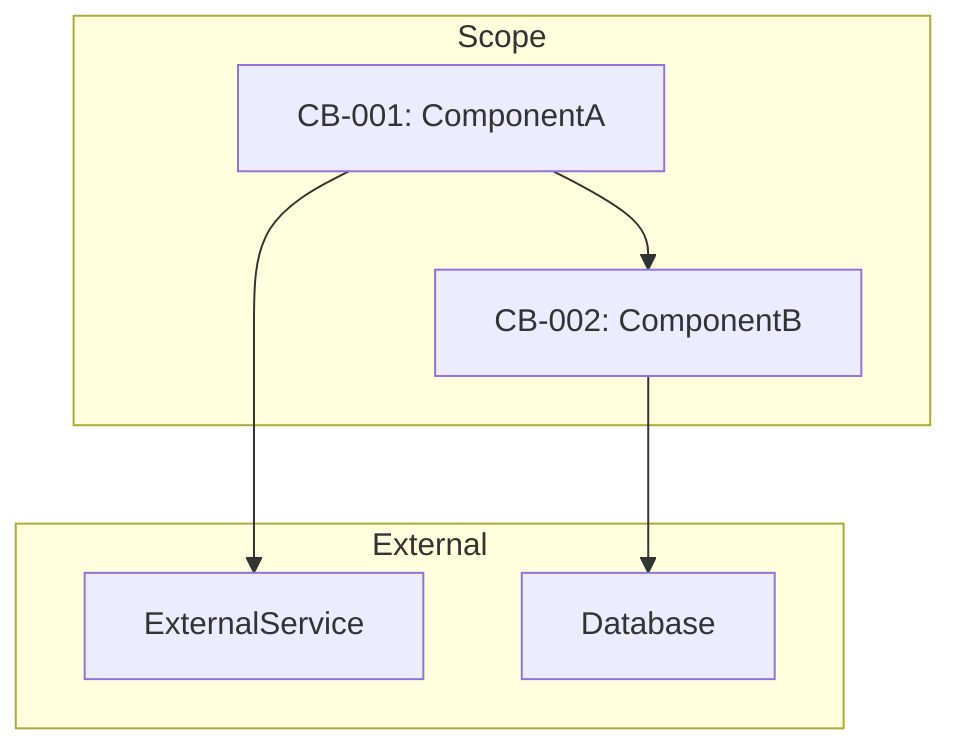

## User Input

```text
$ARGUMENTS
```

You **MUST** consider the user input before proceeding (if not empty).

## Goal

Capture and document the current state of system components that will be affected by brownfield changes. This command produces a `baseline.md` file that:

1. **Documents current behaviors** (CB-xxx) with code locations
2. **Identifies existing patterns** and conventions
3. **Maps dependencies** between components
4. **Extracts current API contracts** (if applicable)
5. **Captures performance baselines** (if measurable)

This baseline becomes the foundation for Change Specification in `/speckit.specify`.

## Operating Constraints

**READ-ONLY with ONE OUTPUT**: This command reads the codebase but only writes ONE file: `FEATURE_DIR/baseline.md`. It does NOT modify existing code or specifications.

**Scope Definition Required**: User must specify the scope of baseline capture:
- File paths (e.g., `src/auth/`, `src/services/user.py`)
- Module names (e.g., "authentication", "user management")
- Feature keywords (e.g., "login flow", "session handling")

## Execution Steps

### 1. Initialize Context

Run `{SCRIPT}` from repo root and parse JSON output.

IF FEATURE_DIR does not exist:
  - Prompt: "No feature directory found. Create specs/[NNN-feature-name]/ first with /speckit.specify --init"
  - ABORT

Set OUTPUT_PATH = FEATURE_DIR/baseline.md

### 2. Parse Scope Definition

Extract scope from user input:

```text
SCOPE_PATTERNS = []
SCOPE_MODULES = []
SCOPE_KEYWORDS = []

FOR EACH item in $ARGUMENTS:
  IF item matches file/directory pattern (contains / or .):
    SCOPE_PATTERNS.append(item)
  ELSE IF item is quoted phrase:
    SCOPE_KEYWORDS.append(item)
  ELSE:
    SCOPE_MODULES.append(item)
```

IF all scope lists are empty:
  - Ask user: "Please specify scope for baseline capture (file paths, modules, or keywords)"
  - ABORT

### 3. Code Structure Analysis

**Scan codebase for affected components:**

```text
1. File Discovery:
   FOR EACH pattern in SCOPE_PATTERNS:
     Find matching files using glob
   FOR EACH keyword in SCOPE_KEYWORDS:
     Search codebase for files containing keyword

2. Component Extraction:
   FOR EACH discovered file:
     - Extract classes, functions, methods
     - Extract public API signatures
     - Extract imports and dependencies
     - Note file path and line numbers

3. Pattern Recognition:
   - Identify design patterns (Factory, Singleton, Repository, etc.)
   - Identify framework conventions (Django views, Express routes, etc.)
   - Note configuration patterns (env vars, config files)
```

### 4. Behavior Documentation

**Document current behaviors with CB-xxx IDs:**

```text
BEHAVIORS = []
CB_COUNTER = 1

FOR EACH component in discovered_components:
  behavior = {
    id: f"CB-{CB_COUNTER:03d}",
    component: component.name,
    file: component.file_path,
    line: component.line_number,
    current_behavior: extract_behavior_description(component),
    inputs: component.parameters,
    outputs: component.return_type,
    side_effects: detect_side_effects(component),
    dependencies: component.dependencies
  }
  BEHAVIORS.append(behavior)
  CB_COUNTER += 1
```

**Behavior Extraction Methods:**

1. **From docstrings/comments**: Parse existing documentation
2. **From function names**: Infer purpose from naming conventions
3. **From test files**: Extract expected behaviors from test descriptions
4. **From type hints**: Understand input/output contracts
5. **From usage patterns**: Analyze how component is called

### 5. Dependency Mapping

**Build dependency graph for scoped components:**

```text
DEPENDENCIES = {}

FOR EACH component in discovered_components:
  deps = {
    imports: extract_imports(component),
    calls: extract_function_calls(component),
    inherits: extract_class_inheritance(component),
    uses: extract_used_services(component)
  }
  DEPENDENCIES[component.id] = deps

# Identify external vs internal dependencies
FOR EACH dep_entry in DEPENDENCIES:
  FOR EACH dep in dep_entry.all_deps:
    IF dep.path in SCOPE_PATTERNS:
      dep.type = "INTERNAL"
    ELSE:
      dep.type = "EXTERNAL"
```

### 6. API Contract Extraction (if applicable)

**For HTTP APIs, CLI interfaces, or SDK functions:**

```text
IF component.type == "API_ENDPOINT":
  contract = {
    method: HTTP_METHOD,
    path: endpoint_path,
    request_schema: extract_request_schema(),
    response_schema: extract_response_schema(),
    status_codes: extract_status_codes(),
    authentication: extract_auth_requirements()
  }

IF component.type == "CLI_COMMAND":
  contract = {
    command: command_name,
    arguments: extract_cli_args(),
    options: extract_cli_options(),
    exit_codes: extract_exit_codes()
  }
```

### 7. Performance Baseline (if measurable)

**Capture baseline metrics if available:**

```text
METRICS = []

FOR EACH component with measurable performance:
  IF test suite has performance tests:
    metric = extract_from_test_results()
  ELSE IF monitoring data available:
    metric = extract_from_monitoring()
  ELSE:
    metric = {
      type: "ESTIMATE",
      note: "No baseline measurements available"
    }
  METRICS.append(metric)
```

### 8. Generate baseline.md

Write `FEATURE_DIR/baseline.md` with the following structure:

````markdown
# Baseline: [SCOPE DESCRIPTION]

**Generated**: [DATE]
**Scope**: [SCOPE_PATTERNS, SCOPE_MODULES, SCOPE_KEYWORDS]
**Components Analyzed**: [COUNT]

## Executive Summary

[Brief description of what was analyzed and key findings]

## Current Behaviors

<!--
  Each CB-xxx documents a current behavior that may be modified, preserved, or removed.
  These IDs are referenced in spec.md Change Specification section.
-->

### CB-001: [Component Name]

**File**: `src/path/to/file.py:42`
**Type**: [Function | Class | Method | Module]

**Current Behavior**:
[Description of what this component currently does]

**Signature**:
```[language]
[function/class signature with types]
```

**Inputs**:
- `param1` (type): [description]
- `param2` (type): [description]

**Outputs**:
- Returns: [type] - [description]
- Side Effects: [list any side effects]

**Dependencies**:
- Internal: [list internal dependencies]
- External: [list external dependencies]

**Test Coverage**: [Covered | Partial | None]

---

### CB-002: [Component Name]

[Repeat pattern for each component...]

---

## Dependency Graph



## API Contracts (if applicable)

### Endpoint: [METHOD] [PATH]

**CB Reference**: CB-00X

| Aspect | Current State |
|--------|---------------|
| Method | [GET/POST/etc] |
| Path | `/api/v1/...` |
| Auth | [Required/Optional/None] |
| Request Body | [schema or "N/A"] |
| Response (200) | [schema] |
| Error Codes | [list] |

---

## Performance Baselines (if available)

| Component | Metric | Current Value | Measurement Source |
|-----------|--------|---------------|-------------------|
| CB-001 | Response Time (p99) | [Xms] | [test/monitoring] |
| CB-002 | Throughput | [X req/s] | [test/monitoring] |

---

## Identified Patterns

| Pattern | Components | Description |
|---------|------------|-------------|
| [Pattern Name] | CB-001, CB-003 | [How pattern is implemented] |

---

## Potential Limitations

<!--
  Pre-identified issues that might drive changes.
  These can become CL-xxx in the Change Specification.
-->

| ID | Observation | Affected CBs | Potential Impact |
|----|-------------|--------------|------------------|
| OBS-001 | [observation] | CB-001, CB-002 | [potential issue] |

---

## Usage in Specification

This baseline should be referenced in `/speckit.specify` when creating the Change Specification:

1. Use CB-xxx IDs in "Current State Analysis" table
2. Map limitations to CL-xxx in "Current Limitations" table
3. Reference CB-xxx in CHG-xxx "From (CB)" column
4. Identify PB-xxx from critical CB-xxx that must remain unchanged

**Next Step**: Run `/speckit.specify [feature description]` with brownfield mode
````

### 9. Report Generation

Output summary to user:

```text
## Baseline Capture Complete

**Output**: FEATURE_DIR/baseline.md

### Summary
| Metric | Count |
|--------|-------|
| Components Analyzed | N |
| Current Behaviors (CB) | N |
| Dependencies Mapped | N internal, M external |
| API Contracts | N |
| Performance Baselines | N |
| Potential Limitations | N |

### Current Behaviors Captured

| ID | Component | File | Type |
|----|-----------|------|------|
| CB-001 | [name] | [path:line] | [type] |
| CB-002 | [name] | [path:line] | [type] |

### Next Steps

1. Review baseline.md for accuracy
2. Run `/speckit.specify` with brownfield mode to generate Change Specification
3. Reference CB-xxx IDs when documenting current state
4. Identify which behaviors should be preserved (PB-xxx)
```

## Operating Principles

### Accuracy Over Completeness

- **Prefer precise documentation** over exhaustive enumeration
- **Highlight uncertainty** when behavior cannot be determined from code
- **Include code references** (file:line) for verification
- **Note when tests exist** to validate documented behavior

### Scope Boundaries

- **Stay within defined scope** - don't crawl entire codebase
- **Mark external dependencies** clearly as out-of-scope
- **Identify boundary interfaces** between scope and external systems
- **Respect module encapsulation** - don't expose implementation details unnecessarily

### Change-Readiness

- **Generate IDs (CB-xxx)** that can be referenced in specs
- **Note modification risk** for each component
- **Identify natural seams** for introducing changes
- **Highlight tightly-coupled components** that may require coordinated changes

## Automation Behavior

This command has both **pre-gates** (before execution) and **transition gates** (before handoffs):

### Pre-Execution Gates

| Gate | Check | Block Condition | Message |
|------|-------|-----------------|---------|
| Feature Directory Gate | FEATURE_DIR exists | FEATURE_DIR missing | "Create feature directory first with /speckit.specify --init" |
| Scope Definition Gate | User provided scope | No scope defined | "Specify scope for baseline capture (file paths, modules, or keywords)" |

### Auto-Transitions

| Condition | Next Phase | Gate |
|-----------|------------|------|
| baseline.md generated, CB-xxx entries valid | `/speckit.specify` | Baseline Completeness Gate, Code Location Validity Gate |

### Quality Gates

| Gate | Check | Block Condition | Message |
|------|-------|-----------------|---------|
| Baseline Completeness Gate | Current Behaviors section has valid CB-xxx entries | No CB-xxx entries found | "Baseline must document at least one current behavior before proceeding to specification" |
| Code Location Validity Gate | All CB-xxx code locations reference existing files | Any CB-xxx references non-existent file | "Verify code location references before proceeding" |
| Baseline Exists Gate | baseline.md exists in FEATURE_DIR | baseline.md missing | "Baseline must be captured before planning brownfield changes" |

### Gate Behavior

**Before execution begins:**
- Pre-gates are validated
- If FEATURE_DIR missing, suggest `/speckit.specify --init`
- If no scope provided, prompt user for file paths/modules/keywords

**After baseline generation:**
- Validate CB-xxx entries exist and are well-formed
- Verify code location references point to existing files
- If all gates pass, automatically transition to `/speckit.specify` with brownfield mode

**If gates block:**
- Display blocking message with specific issues
- List CB-xxx entries with invalid file references
- Wait for user to correct and re-run `/speckit.baseline`

### Manual Overrides

Users can always choose to:
- Skip to `/speckit.plan` if specification already exists
- Re-run `/speckit.baseline` with different scope
- Manually edit baseline.md before proceeding
- Use brownfield mode in `/speckit.specify` without baseline (not recommended)

## Context

{ARGS}

---

## Self-Review Phase (MANDATORY)

**Before declaring baseline.md complete, you MUST perform self-review.**

This ensures all current behaviors are accurately documented and code references are valid.

### Step 1: Re-read Generated Artifact

Read the baseline file you created:
- `FEATURE_DIR/baseline.md`

Parse to extract CB-xxx entries and validate structure.

### Step 2: Quality Criteria

| ID | Criterion | Check | Severity |
|----|-----------|-------|----------|
| SR-BASE-01 | CB Entries Exist | At least one CB-xxx entry documented | CRITICAL |
| SR-BASE-02 | CB IDs Unique | No duplicate CB-xxx identifiers | CRITICAL |
| SR-BASE-03 | CB Format Valid | Each CB-xxx follows CB-NNN pattern (3 digits) | HIGH |
| SR-BASE-04 | Code Locations Present | Each CB has file:line reference | CRITICAL |
| SR-BASE-05 | Code Locations Valid | All file:line references point to existing files | CRITICAL |
| SR-BASE-06 | Behavior Described | Each CB has "Current Behavior" description (not empty) | HIGH |
| SR-BASE-07 | Signature Documented | Each CB has code signature with types | MEDIUM |
| SR-BASE-08 | Dependencies Mapped | Dependency Graph section populated | HIGH |
| SR-BASE-09 | Mermaid Valid | Dependency graph has valid Mermaid syntax | MEDIUM |
| SR-BASE-10 | No Placeholders | No [TODO], [TBD], or placeholder text remains | HIGH |

### Step 3: CB Entry Validation

Verify each CB-xxx entry is complete:

```text
CB_ENTRIES = {}
FILE_REFS = []

FOR EACH section matching "### CB-NNN":
  1. Extract CB ID (must be CB-NNN format, 3 digits)
  2. Check uniqueness against CB_ENTRIES
  3. Extract file:line reference from **File** field
  4. Add to FILE_REFS for validation
  5. Verify "Current Behavior" section is not empty
  6. Verify "Signature" code block exists
  7. CB_ENTRIES[id] = entry

IF duplicate CB ID found:
  ERROR: "Duplicate CB ID: {id}"
  Add to issues

IF CB_ENTRIES is empty:
  ERROR: "No CB-xxx entries found in baseline"
  CRITICAL failure
```

### Step 4: Code Location Verification

Validate all file references exist in codebase:

```text
FOR EACH file_ref in FILE_REFS:
  1. Parse path and line number from "file:line" format
  2. Check if file exists in filesystem
  3. If line number specified, verify file has that many lines

  IF file does not exist:
    ERROR: "CB-xxx references non-existent file: {path}"
    Add to issues

  IF line number exceeds file length:
    WARN: "CB-xxx line {line} exceeds file length ({actual} lines)"
    Add to warnings
```

### Step 5: Dependency Graph Validation

Verify Mermaid diagram is valid:

```text
GRAPH_SECTION = extract "## Dependency Graph" section

IF GRAPH_SECTION is empty OR missing mermaid block:
  WARN: "Dependency Graph section is empty or missing"
  Add to warnings

FOR EACH CB referenced in mermaid graph:
  IF CB not in CB_ENTRIES:
    ERROR: "Graph references undefined CB: {id}"
    Add to issues

# Basic Mermaid syntax check
IF mermaid block exists:
  Verify "graph" or "flowchart" directive present
  Verify node definitions match CB IDs
  Verify arrow syntax is valid (-->, --, -->|label|)
```

### Step 6: Verdict

- **PASS**: All CRITICAL/HIGH criteria pass, code locations valid → proceed to handoff
- **FAIL**: Any CRITICAL issue → self-correct (max 3 iterations)
  - Missing CB entries → analyze more components
  - Invalid file references → correct paths or remove invalid CBs
  - Duplicate IDs → renumber
- **WARN**: Only MEDIUM issues → show warnings, proceed

### Step 7: Self-Correction Loop

```text
IF issues found AND iteration < 3:
  1. Fix each issue:
     - Renumber duplicate CB IDs
     - Remove CBs with invalid file references (or correct paths)
     - Add missing behavior descriptions
     - Fix Mermaid syntax errors
     - Remove placeholder text
  2. Re-run self-review from Step 1
  3. Report: "Self-review iteration {N}: Fixed {issues}, re-validating..."

IF still failing after 3 iterations:
  - STOP and report to user
  - List invalid file references
  - List incomplete CB entries
  - Do NOT proceed to handoff
```

### Step 8: Self-Review Report

After passing self-review, output:

```text
## Self-Review Complete ✓

**Artifact**: FEATURE_DIR/baseline.md
**Iterations**: {N}

### CB Entry Summary

| ID | Component | File | Valid |
|----|-----------|------|-------|
| CB-001 | {name} | {path:line} | ✓ |
| CB-002 | {name} | {path:line} | ✓ |

### Validation Results

| Check | Result |
|-------|--------|
| CB Entries | ✓ {N} documented |
| CB IDs Unique | ✓ All unique |
| Code Locations | ✓ All files exist |
| Behaviors Described | ✓ All complete |
| Dependency Graph | ✓ Valid Mermaid |
| Placeholders | ✓ None found |

### File Reference Verification

| CB | Path | Line | Exists |
|----|------|------|--------|
| CB-001 | {path} | {line} | ✓ |
| CB-002 | {path} | {line} | ✓ |

### Dependency Coverage

| Dependency Type | Count |
|-----------------|-------|
| Internal (in scope) | {N} |
| External (out of scope) | {N} |

### Ready for Specification

Baseline capture complete. Suggest: `/speckit.specify [brownfield]`
```
