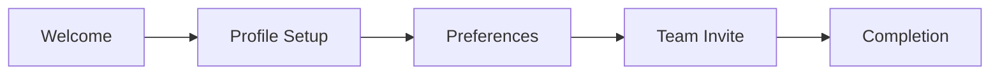

## User Input

```text
$ARGUMENTS
```

You **MUST** consider the user input before proceeding (if not empty).

## Purpose

This command creates **visual and interaction specifications** for UI-heavy features. It bridges the gap between functional requirements (spec.md) and implementation by defining:

1. **Visual Language**: Design tokens, colors, typography, spacing
2. **Component Specifications**: States, variants, accessibility, responsive behavior
3. **Screen Flows**: User interface sequences with component mapping
4. **Interaction Patterns**: Animations, transitions, feedback mechanisms
5. **Accessibility Requirements**: WCAG compliance, keyboard navigation, screen reader support

**When to use**:
- Feature has significant user interface (dashboards, forms, wizards)
- Multiple UI components need consistent styling
- Accessibility is a priority
- Design handoff to developers is needed
- Complex interactions (drag-drop, real-time updates, animations)

**When to skip**:
- API-only features
- CLI tools
- Background services
- Simple CRUD with minimal UI

## Outline

0. **Load project language setting**:

   Read `/memory/constitution.md` and extract the `language` value from the Project Settings table.

   ```text
   IF Project Settings section exists AND language row found:
     ARTIFACT_LANGUAGE = extracted value (e.g., "ru", "en", "de")
   ELSE:
     ARTIFACT_LANGUAGE = "en" (default)

   Apply language rules from templates/shared/language-context.md:
   - Generate all prose content in ARTIFACT_LANGUAGE
   - Keep IDs, technical terms (WCAG, CSS, ARIA), and code in English
   ```

   Report: "Generating design specification in {LANGUAGE_NAME} ({ARTIFACT_LANGUAGE})..."

1. **Initialize design document**:
   - Run script `{SCRIPT}` to verify spec.md exists
   - Create `specs/[NNN-feature]/design.md` from `templates/design-template.md`
   - If design.md exists, load for update (no overwrite)

2. **Design Discovery** (analyze context):

   ```text
   FROM spec.md extract:
   - User personas and their device preferences
   - Functional requirements with UI implications
   - Acceptance scenarios involving visual elements
   - Edge cases affecting display states

   DETERMINE:
   - Primary platform: web / mobile / desktop / responsive
   - Interaction complexity: simple / moderate / complex
   - Accessibility tier: WCAG 2.1 A / AA / AAA
   - Design system: new / existing / extend
   ```

3. **Visual Language Definition**:

   ### Color Palette

   ```text
   Define semantic color tokens:
   - Primary: brand color for CTAs, links
   - Secondary: supporting actions
   - Accent: highlights, notifications
   - Semantic: success, warning, error, info
   - Neutral: backgrounds, borders, text

   FOR EACH color:
   - Light mode value
   - Dark mode value (if applicable)
   - Contrast ratio validation (≥4.5:1 for text)
   ```

   ### Typography Scale

   ```text
   Define type scale:
   - Display: hero text, marketing
   - Headings: h1-h6 hierarchy
   - Body: primary reading text
   - Caption: secondary info, labels
   - Code: monospace for technical content

   FOR EACH level:
   - Font family
   - Size (rem/px)
   - Weight
   - Line height
   - Letter spacing (if needed)
   ```

   ### Spacing System

   ```text
   Define spacing scale (4px base recommended):
   - xs: 4px   (0.25rem)
   - sm: 8px   (0.5rem)
   - md: 16px  (1rem)
   - lg: 24px  (1.5rem)
   - xl: 32px  (2rem)
   - 2xl: 48px (3rem)
   - 3xl: 64px (4rem)

   Apply consistently:
   - Component padding
   - Stack gaps
   - Section margins
   ```

   ### Icon System

   ```text
   Define icon approach:
   - Library: Lucide / Heroicons / Phosphor / custom
   - Sizes: sm (16px), md (20px), lg (24px), xl (32px)
   - Style: outline / solid / duotone
   - Color inheritance: currentColor / fixed
   ```

4. **Component Inventory**:

   ```text
   FROM spec.md requirements, identify needed components:

   FOR EACH component:
   1. Purpose and user value
   2. States: default, hover, active, focus, disabled, loading, error, success
   3. Variants: size (sm/md/lg), style (primary/secondary/ghost)
   4. Anatomy: sub-elements and their relationships
   5. Accessibility:
      - ARIA role
      - Keyboard interaction
      - Focus management
      - Screen reader announcements
   6. Responsive behavior:
      - Mobile: touch targets ≥44px, gestures
      - Tablet: hover states, larger touch
      - Desktop: hover, keyboard shortcuts
   ```

   **Common Components to Consider**:
   - Forms: Input, Select, Checkbox, Radio, Toggle, DatePicker
   - Actions: Button, IconButton, Link, Menu
   - Layout: Card, Modal, Drawer, Tabs, Accordion
   - Feedback: Toast, Alert, Badge, Progress, Skeleton
   - Navigation: Navbar, Sidebar, Breadcrumb, Pagination
   - Data: Table, List, Grid, Chart

5. **Screen Flow Mapping**:

   ```text
   FOR EACH user journey in spec.md:
   1. Map journey steps to screens
   2. For each screen:
      - Purpose: what user accomplishes
      - Entry points: how user arrives
      - Layout: structure (header, sidebar, main, footer)
      - Components used: list from Component Inventory
      - Data displayed: what information shown
      - Actions available: what user can do
      - Exit points: where user can go next
      - States: loading, empty, populated, error
   3. Generate screen flow diagram (Mermaid)
   ```

6. **Interaction Specifications**:

   ```text
   FOR EACH interactive element:
   1. Trigger: click, hover, focus, swipe, long-press
   2. Action: what happens visually
   3. Feedback: immediate response (ripple, color change)
   4. Duration: animation timing
   5. Easing: animation curve

   Common patterns:
   - Button press: scale(0.98), 100ms
   - Modal open: fade + slide, 200ms, ease-out
   - Toast appear: slide from edge, 300ms
   - Skeleton shimmer: continuous gradient animation
   - Form validation: inline error, 100ms
   ```

7. **Accessibility Audit**:

   ```text
   Validate against WCAG 2.1 level [A/AA/AAA]:

   Perceivable:
   - [ ] Color contrast ratios meet minimum (4.5:1 AA, 7:1 AAA)
   - [ ] Text can be resized to 200% without loss
   - [ ] Non-text content has text alternatives
   - [ ] Information not conveyed by color alone

   Operable:
   - [ ] All functionality keyboard accessible
   - [ ] Focus order is logical
   - [ ] Focus indicators visible
   - [ ] No keyboard traps
   - [ ] Touch targets ≥44x44px

   Understandable:
   - [ ] Language of page identified
   - [ ] Form labels and instructions clear
   - [ ] Error messages helpful and specific
   - [ ] Consistent navigation

   Robust:
   - [ ] Valid semantic HTML
   - [ ] ARIA used correctly
   - [ ] Works with assistive technologies
   ```

8. **Responsive Strategy**:

   ```text
   Define breakpoints:
   - mobile: 0-639px (touch-first)
   - tablet: 640-1023px (touch + hover)
   - desktop: 1024-1279px (mouse + keyboard)
   - wide: 1280px+ (extended layouts)

   FOR EACH component:
   - Mobile behavior: stacking, simplified, bottom sheets
   - Desktop behavior: side-by-side, expanded, modals

   FOR EACH screen:
   - Layout adaptation at each breakpoint
   - Navigation changes (hamburger ↔ full nav)
   - Content priority (what hides/shows)
   ```

9. **Write design.md**:

   Use `templates/design-template.md` structure, populate with:
   - Visual Language tokens
   - Component specifications
   - Screen flows with Mermaid diagrams
   - Interaction specifications table
   - Accessibility checklist
   - Responsive breakpoint definitions
   - Traceability: link to spec.md AS and FR IDs

## Validation Gates

Before completing, verify:

- [ ] All color tokens have contrast ratios documented
- [ ] Typography scale has mobile and desktop values
- [ ] Each component has all states defined
- [ ] Each component has accessibility requirements
- [ ] Screen flows match user journeys from spec.md
- [ ] Interaction specifications have timing values
- [ ] Accessibility checklist is complete for target level
- [ ] Responsive behavior documented for all breakpoints
- [ ] Design tokens are CSS-variable-ready names

## Quality Guidelines

### Component Specification Depth

**Too shallow** (missing critical info):
```markdown
### Button
- Click to submit
```

**Good** (actionable for developers):
```markdown
### Button
**States**: default, hover, active, focus, disabled, loading
**Variants**:
- Size: sm (32px), md (40px), lg (48px)
- Style: primary, secondary, ghost, destructive
**Accessibility**:
- Role: button
- Keyboard: Enter/Space to activate
- Focus: 2px ring, offset 2px
- Disabled: aria-disabled, no pointer events
**Loading state**: spinner replaces text, min-width preserved
```

### Screen Flow Clarity

**Vague**:
```markdown
User goes to settings and changes things
```

**Clear**:
```markdown
### Settings Screen
**Entry**: Header menu → Settings icon, or /settings URL
**Layout**: Sidebar (categories) + Main (form sections)
**Components**: Tabs, Toggle, Input, Button
**Actions**:
- Toggle notification preferences → immediate save, toast feedback
- Change password → modal with current/new/confirm fields
**Exit**: Back button → previous page, or nav to other section
```

### Accessibility Specificity

**Vague**:
```markdown
Make it accessible
```

**Specific**:
```markdown
**WCAG 2.1 AA Compliance**:
- Primary button (#2563EB on #FFF): 4.54:1 ✓
- Body text (#374151 on #FFF): 7.21:1 ✓
- Error text (#DC2626 on #FFF): 4.53:1 ✓
- Focus ring: 2px solid #2563EB, offset 2px
- Skip link: hidden until focused, appears top-left
- Form errors: aria-invalid + aria-describedby to error text
```

## Output

After completion:

1. `specs/[NNN-feature]/design.md` with complete visual specifications
2. Report summary:
   - N design tokens defined
   - M components specified
   - K screens mapped
   - Accessibility level: [A/AA/AAA]
   - Responsive breakpoints: [list]
3. Traceability:
   - FR-xxx → Component [name]
   - AS-xxx → Screen [name]
4. Recommended next steps:
   - Run `/speckit.plan` to create technical plan with design system
   - Or update existing plan.md with Design System section

---

## Self-Review Phase (MANDATORY)

**Before declaring design.md complete, you MUST perform self-review.**

This ensures visual specifications are complete, accessible, and ready for implementation.

### Step 1: Re-read Generated Artifact

Read the design file you created:
- `specs/[NNN-feature]/design.md`

### Step 2: Quality Criteria

| ID | Criterion | Check | Severity |
|----|-----------|-------|----------|
| SR-DESIGN-01 | Color Tokens Defined | All semantic colors have values | CRITICAL |
| SR-DESIGN-02 | Contrast Ratios Valid | All text colors meet WCAG minimums (≥4.5:1) | CRITICAL |
| SR-DESIGN-03 | Typography Scale Complete | All heading levels + body defined | HIGH |
| SR-DESIGN-04 | Component States Listed | Each component has all states (default, hover, etc.) | HIGH |
| SR-DESIGN-05 | Accessibility Documented | ARIA roles, keyboard nav for each component | HIGH |
| SR-DESIGN-06 | Screen Flows Mapped | All user journeys have screen sequences | HIGH |
| SR-DESIGN-07 | Responsive Defined | Breakpoints and behavior documented | MEDIUM |
| SR-DESIGN-08 | Interactions Specified | Animation timing/easing documented | MEDIUM |
| SR-DESIGN-09 | Traceability Present | Components linked to FR/AS from spec.md | MEDIUM |
| SR-DESIGN-10 | Accessibility Checklist | WCAG checklist completed for target level | HIGH |

### Step 3: Accessibility Validation

Verify contrast ratios for all color tokens:

```text
FOR EACH text color token:
  Calculate contrast ratio against background
  IF ratio < 4.5:1 (AA) OR < 7:1 (AAA if target):
    ERROR: "Color {token} fails contrast: {ratio}:1 (min {required}:1)"

FOR EACH interactive element:
  Verify focus indicator is defined
  Verify keyboard interaction is documented
  Verify touch target ≥ 44px (if mobile)
```

### Step 4: Component Completeness

For each component in inventory, verify:

```text
FOR EACH component:
  Required states = [default, hover, active, focus, disabled]
  IF component is form element:
    Required states += [error, success, loading]

  FOR EACH required_state:
    IF state not documented:
      WARN: "Component {name} missing state: {state}"

  IF no ARIA role defined:
    ERROR: "Component {name} missing accessibility role"

  IF no keyboard interaction defined:
    ERROR: "Component {name} missing keyboard interaction"
```

### Step 5: Verdict

- **PASS**: All CRITICAL/HIGH criteria pass, accessibility validated → proceed to handoff
- **FAIL**: Any CRITICAL issue (contrast, missing components) → self-correct (max 3 iterations)
- **WARN**: Only MEDIUM issues → show warnings, proceed

### Step 6: Self-Correction Loop

```text
IF issues found AND iteration < 3:
  1. Fix each issue:
     - Adjust colors to meet contrast ratios
     - Add missing component states
     - Document keyboard interactions
     - Complete accessibility checklist
  2. Re-run self-review from Step 1
  3. Report: "Self-review iteration {N}: Fixed {issues}, re-validating..."

IF still failing after 3 iterations:
  - STOP and report to user
  - List accessibility compliance gaps
  - Do NOT proceed to handoff
```

### Step 7: Self-Review Report

After passing self-review, output:

```text
## Self-Review Complete ✓

**Artifact**: specs/[NNN-feature]/design.md
**Iterations**: {N}

### Validation Results

| Check | Result |
|-------|--------|
| Color Tokens | ✓ {N} defined |
| Contrast Ratios | ✓ All ≥ {min}:1 |
| Typography | ✓ Complete scale |
| Components | ✓ {N} specified with states |
| Accessibility | ✓ WCAG {level} compliant |
| Screen Flows | ✓ {N} screens mapped |

### Accessibility Summary

| Token | Background | Contrast | Status |
|-------|------------|----------|--------|
| text-primary | white | 7.2:1 | ✓ AA |
| text-secondary | white | 5.1:1 | ✓ AA |
| error | white | 4.6:1 | ✓ AA |

### Component Coverage

| Component | States | A11y | Responsive |
|-----------|--------|------|------------|
| {name} | ✓ 6/6 | ✓ | ✓ |

### Ready for Planning

Design specification complete. Suggest: `/speckit.plan`
```

---

## Example

**User Input**: "Create design spec for user onboarding wizard"

**Resulting design.md excerpt**:

````markdown
# Design Specification: User Onboarding

## Visual Language

### Color Palette
| Token | Light | Dark | Usage |
|-------|-------|------|-------|
| primary | #2563EB | #3B82F6 | CTA buttons, progress |
| success | #16A34A | #22C55E | Completion states |
| neutral-50 | #F9FAFB | #111827 | Background |
| neutral-900 | #111827 | #F9FAFB | Primary text |

## Component Specifications

### WizardStepper
**Purpose**: Show progress through onboarding steps
**States**:
- Step states: upcoming (gray), current (primary), completed (success + check)
- Overall: in-progress, completed
**Variants**: horizontal (desktop), vertical (mobile)
**Accessibility**:
- Role: progressbar + aria-valuenow for current step
- Announce step changes to screen readers
**Responsive**:
- Mobile: vertical stack, current step expanded
- Desktop: horizontal bar, all steps visible

### OnboardingCard
**Purpose**: Container for each step's content
**States**: entering (fade-in), active, exiting (fade-out)
**Variants**: narrow (forms), wide (selections)
**Animation**: slide + fade, 300ms ease-out

## Screen Flows



### Screen: Profile Setup
**Entry**: Welcome → "Get Started" button
**Components**: WizardStepper, OnboardingCard, Input, AvatarUpload, Button
**Actions**:
- Upload avatar → preview immediately
- Fill name/role → validate on blur
- Continue → validate all, advance to Preferences
**Accessibility**: Focus trapped in card, Escape does nothing (no skip)

## Interaction Specifications
| Trigger | Element | Feedback | Duration |
|---------|---------|----------|----------|
| Click Continue | Button | Ripple + disable | 150ms |
| Step transition | Card | Slide left + fade | 300ms |
| Upload complete | Avatar | Scale bounce | 200ms |
| Validation error | Input | Shake + red border | 300ms |
````
