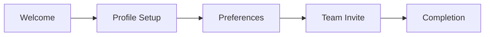

## User Input

```text
$ARGUMENTS
```

You **MUST** consider the user input before proceeding (if not empty).

## Purpose

This command creates **visual and interaction specifications** for UI-heavy features. It bridges the gap between functional requirements (spec.md) and implementation by defining:

1. **Visual Language**: Design tokens, colors, typography, spacing
2. **Component Specifications**: States, variants, accessibility, responsive behavior
3. **Screen Flows**: User interface sequences with component mapping
4. **Interaction Patterns**: Animations, transitions, feedback mechanisms
5. **Accessibility Requirements**: WCAG compliance, keyboard navigation, screen reader support

**When to use**:
- Feature has significant user interface (dashboards, forms, wizards)
- Multiple UI components need consistent styling
- Accessibility is a priority
- Design handoff to developers is needed
- Complex interactions (drag-drop, real-time updates, animations)

**When to skip**:
- API-only features
- CLI tools
- Background services
- Simple CRUD with minimal UI

## Outline

0. **Load project language setting**:

   Read `/memory/constitution.md` and extract the `language` value from the Project Settings table.

   ```text
   IF Project Settings section exists AND language row found:
     ARTIFACT_LANGUAGE = extracted value (e.g., "ru", "en", "de")
   ELSE:
     ARTIFACT_LANGUAGE = "en" (default)

   Apply language rules from templates/shared/language-context.md:
   - Generate all prose content in ARTIFACT_LANGUAGE
   - Keep IDs, technical terms (WCAG, CSS, ARIA), and code in English
   ```

   Report: "Generating design specification in {LANGUAGE_NAME} ({ARTIFACT_LANGUAGE})..."

0.5. **Figma Import** (Optional):

   ```text
   IF figma_import.enabled AND NOT --no-figma flag:

     1. Check FIGMA_ACCESS_TOKEN environment variable
        IF not set:
          LOG "⚠️ FIGMA_ACCESS_TOKEN not set, skipping Figma import"
          SKIP to Step 1

     2. Extract Figma file key from spec.md Design System field:
        PATTERN: "figma.com/(file|design)/([a-zA-Z0-9]+)"
        IF no Figma URL found:
          LOG "ℹ️ No Figma URL in spec.md Design System field"
          SKIP to Step 1

     3. Call Figma API:
        GET https://api.figma.com/v1/files/{file_key}
        Headers: X-Figma-Token: {FIGMA_ACCESS_TOKEN}

     4. Extract design tokens:
        - Colors: document.styles WHERE type="FILL"
          → Map to Color Palette table (name, hex, rgb, semantic role)
        - Typography: document.styles WHERE type="TEXT"
          → Map to Typography Scale (family, size, weight, line-height)
        - Effects: document.styles WHERE type="EFFECT"
          → Map to Shadow System (name, CSS value)

     5. Extract components (if extract includes "components"):
        - Component sets: document.componentSets
          → Generate Component Specifications skeleton
        - Variants: component.variants
          → Map to States table (default, hover, active, disabled)

     6. Generate FIGMA_IMPORT_REPORT:
        ```
        ## Figma Import Report
        - File: {file_name} ({file_key})
        - Colors extracted: {count}
        - Typography styles: {count}
        - Components: {count}
        - Icons: {count}
        ```

     7. Mark imported entries with <!-- figma-sync --> comment
        for future re-import (non-destructive merge)

   ELSE:
     LOG "Figma import disabled or --no-figma flag set"
   ```

   Read `templates/shared/figma-import.md` for detailed Figma API mapping rules.

0.75. **Component Library Recommendation** (Auto-Discovery):

   ```text
   TRIGGER: design_system.framework in constitution.md is "none" or not configured

   IF design_system.framework != "none" AND design_system.framework is configured:
     LOG "ℹ️ Design system already configured ({framework}), skipping recommendation"
     SKIP to Step 1

   IF --no-recommendation flag passed:
     LOG "ℹ️ Component library recommendation disabled"
     SKIP to Step 1
   ```

   **Step 0.75.1: Detect UI Framework**

   ```text
   1. Read spec.md → "Framework Requirements" table
      - Look for: React, Next.js, Vue, Nuxt, Angular, Svelte, SvelteKit
      - Check if TypeScript mentioned (tsx, ts, TypeScript)

   2. Read constitution.md → "Technology Constraints" table
      - Find "UI Framework" row
      - Extract value: React | Vue | Angular | Svelte | None

   3. Determine framework:
      IF constitution.md has explicit UI Framework:
        ui_framework = constitution_value
      ELIF spec.md has Framework Requirements:
        ui_framework = detected_from_spec
      ELSE:
        ui_framework = "unknown"

   4. Detect TypeScript:
      IF "typescript" OR "tsx" in spec.md Framework Requirements:
        typescript_enabled = true
   ```

   **Step 0.75.2: Load Recommendation Rules**

   ```text
   Read templates/shared/library-recommendations.md

   Apply framework → library mapping:
   - React + TypeScript → shadcn/ui (primary), MUI, Radix UI (alternatives)
   - React (JS) → MUI (primary), shadcn/ui, Chakra UI (alternatives)
   - Vue.js → Vuetify (primary), PrimeVue, Quasar (alternatives)
   - Angular → Angular Material (primary), PrimeNG, ng-bootstrap (alternatives)
   - Svelte → Skeleton UI (primary), Svelte Material UI (alternatives)

   Apply domain modifiers (from constitution.md Domain Layer):
   - uxq domain → prefer rich UX libraries (shadcn/ui, MUI)
   - saas domain → prefer data-dense libraries (MUI, Angular Material)
   - fintech domain → prefer mature, audited libraries (MUI, Angular Material)

   Apply WCAG modifiers (from spec.md Design Constraints):
   - AAA level → filter to accessible-first libraries
   ```

   **Step 0.75.3: Generate Recommendation**

   ```text
   OUTPUT:
   ┌─────────────────────────────────────────────────────────────┐
   │ Component Library Recommendation                            │
   ├─────────────────────────────────────────────────────────────┤
   │ Detected Framework: {framework} {+ TypeScript if detected}  │
   │ Source: {spec.md / constitution.md}                         │
   │                                                             │
   │ Primary Recommendation: {library}                           │
   │ Reasoning: {reasoning from library-recommendations.md}      │
   │                                                             │
   │ Alternatives: {alt1}, {alt2}, {alt3}                        │
   │                                                             │
   │ Preset Available: {Yes/No} in design-system-presets.md      │
   └─────────────────────────────────────────────────────────────┘
   ```

   **Step 0.75.4: Suggest Preset Application**

   ```text
   IF preset exists in design-system-presets.md:

     1. Show preset preview:
        - Framework: {preset.framework}
        - Primary color: {preset.theme.colors.primary}
        - Font family: {preset.theme.typography.font_family}
        - Component URL: {preset.component_library_url}

     2. Prompt user:
        "Apply {library} preset to constitution.md? [Y/n/choose alternative]"

     3. IF user confirms (Y or default):
        - Load preset YAML from design-system-presets.md
        - Update design_system block in constitution.md
        - LOG "✓ Applied {library} preset to constitution.md"

     4. IF user chooses alternative:
        - Show alternative presets
        - Let user select
        - Apply selected preset

     5. IF user declines (n):
        - LOG "ℹ️ Preset not applied. Configure manually in constitution.md"
        - Continue with framework: "none" (tokens from constitution.md theme block)

   ELSE:
     LOG "⚠️ No preset found for {library}. Using custom tokens from constitution.md"
   ```

   **Step 0.75.5: Skip Conditions**

   ```text
   Skip this step when:
   - design_system.framework already configured (not "none")
   - UI Framework explicitly set to "None" in Technology Constraints
   - No UI framework detected in spec.md or constitution.md
   - Backend-only project (no Frontend markers in Framework Requirements)
   - --no-recommendation flag passed

   When skipped, output:
   "Step 0.75: Component Library Recommendation - Skipped ({reason})"
   ```

   Read `templates/shared/library-recommendations.md` for detailed framework→library mapping and algorithm.

1. **Initialize design document**:
   - Run script `{SCRIPT}` to verify spec.md exists
   - Create `specs/[NNN-feature]/design.md` from `templates/design-template.md`
   - If design.md exists, load for update (no overwrite)

2. **Design Discovery** (analyze context):

   ```text
   FROM spec.md extract:
   - User personas and their device preferences
   - Functional requirements with UI implications
   - Acceptance scenarios involving visual elements
   - Edge cases affecting display states

   DETERMINE:
   - Primary platform: web / mobile / desktop / responsive
   - Interaction complexity: simple / moderate / complex
   - Accessibility tier: WCAG 2.1 A / AA / AAA
   - Design system: new / existing / extend
   ```

3. **Visual Language Definition**:

   ### Color Palette

   ```text
   Define semantic color tokens:
   - Primary: brand color for CTAs, links
   - Secondary: supporting actions
   - Accent: highlights, notifications
   - Semantic: success, warning, error, info
   - Neutral: backgrounds, borders, text

   FOR EACH color:
   - Light mode value
   - Dark mode value (if applicable)
   - Contrast ratio validation (≥4.5:1 for text)
   ```

   ### Typography Scale

   ```text
   Define type scale:
   - Display: hero text, marketing
   - Headings: h1-h6 hierarchy
   - Body: primary reading text
   - Caption: secondary info, labels
   - Code: monospace for technical content

   FOR EACH level:
   - Font family
   - Size (rem/px)
   - Weight
   - Line height
   - Letter spacing (if needed)
   ```

   ### Spacing System

   ```text
   Define spacing scale (4px base recommended):
   - xs: 4px   (0.25rem)
   - sm: 8px   (0.5rem)
   - md: 16px  (1rem)
   - lg: 24px  (1.5rem)
   - xl: 32px  (2rem)
   - 2xl: 48px (3rem)
   - 3xl: 64px (4rem)

   Apply consistently:
   - Component padding
   - Stack gaps
   - Section margins
   ```

   ### Icon System

   ```text
   Define icon approach:
   - Library: Lucide / Heroicons / Phosphor / custom
   - Sizes: sm (16px), md (20px), lg (24px), xl (32px)
   - Style: outline / solid / duotone
   - Color inheritance: currentColor / fixed
   ```

4. **Component Inventory**:

   ```text
   FROM spec.md requirements, identify needed components:

   FOR EACH component:
   1. Purpose and user value
   2. States: default, hover, active, focus, disabled, loading, error, success
   3. Variants: size (sm/md/lg), style (primary/secondary/ghost)
   4. Anatomy: sub-elements and their relationships
   5. Accessibility:
      - ARIA role
      - Keyboard interaction
      - Focus management
      - Screen reader announcements
   6. Responsive behavior:
      - Mobile: touch targets ≥44px, gestures
      - Tablet: hover states, larger touch
      - Desktop: hover, keyboard shortcuts
   ```

   **Common Components to Consider**:
   - Forms: Input, Select, Checkbox, Radio, Toggle, DatePicker
   - Actions: Button, IconButton, Link, Menu
   - Layout: Card, Modal, Drawer, Tabs, Accordion
   - Feedback: Toast, Alert, Badge, Progress, Skeleton
   - Navigation: Navbar, Sidebar, Breadcrumb, Pagination
   - Data: Table, List, Grid, Chart

5. **Screen Flow Mapping**:

   ```text
   FOR EACH user journey in spec.md:
   1. Map journey steps to screens
   2. For each screen:
      - Purpose: what user accomplishes
      - Entry points: how user arrives
      - Layout: structure (header, sidebar, main, footer)
      - Components used: list from Component Inventory
      - Data displayed: what information shown
      - Actions available: what user can do
      - Exit points: where user can go next
      - States: loading, empty, populated, error
   3. Generate screen flow diagram (Mermaid)
   ```

6. **Interaction Specifications**:

   ```text
   FOR EACH interactive element:
   1. Trigger: click, hover, focus, swipe, long-press
   2. Action: what happens visually
   3. Feedback: immediate response (ripple, color change)
   4. Duration: animation timing
   5. Easing: animation curve

   Common patterns:
   - Button press: scale(0.98), 100ms
   - Modal open: fade + slide, 200ms, ease-out
   - Toast appear: slide from edge, 300ms
   - Skeleton shimmer: continuous gradient animation
   - Form validation: inline error, 100ms
   ```

7. **Accessibility Audit**:

   ```text
   Validate against WCAG 2.1 level [A/AA/AAA]:

   Perceivable:
   - [ ] Color contrast ratios meet minimum (4.5:1 AA, 7:1 AAA)
   - [ ] Text can be resized to 200% without loss
   - [ ] Non-text content has text alternatives
   - [ ] Information not conveyed by color alone

   Operable:
   - [ ] All functionality keyboard accessible
   - [ ] Focus order is logical
   - [ ] Focus indicators visible
   - [ ] No keyboard traps
   - [ ] Touch targets ≥44x44px

   Understandable:
   - [ ] Language of page identified
   - [ ] Form labels and instructions clear
   - [ ] Error messages helpful and specific
   - [ ] Consistent navigation

   Robust:
   - [ ] Valid semantic HTML
   - [ ] ARIA used correctly
   - [ ] Works with assistive technologies
   ```

8. **Responsive Strategy**:

   ```text
   Define breakpoints:
   - mobile: 0-639px (touch-first)
   - tablet: 640-1023px (touch + hover)
   - desktop: 1024-1279px (mouse + keyboard)
   - wide: 1280px+ (extended layouts)

   FOR EACH component:
   - Mobile behavior: stacking, simplified, bottom sheets
   - Desktop behavior: side-by-side, expanded, modals

   FOR EACH screen:
   - Layout adaptation at each breakpoint
   - Navigation changes (hamburger ↔ full nav)
   - Content priority (what hides/shows)
   ```

9. **Write design.md** (UX Designer Agent Output):

   Use `templates/design-template.md` structure, populate with:
   - Visual Language tokens
   - Component specifications
   - Screen flows with Mermaid diagrams
   - Interaction specifications table
   - Accessibility checklist
   - Responsive breakpoint definitions
   - Traceability: link to spec.md AS and FR IDs

---

## Phase 2: Product Designer Agent

10. **Visual Language Refinement** (Product Designer):

    ```text
    SWITCH to persona: product-designer-agent
    READ templates/personas/product-designer-agent.md

    Input: design.md from UX Designer (Step 9)

    Tasks:
    1. Refine design tokens for production:
       - Validate color palette completeness
       - Ensure typography scale is CSS-variable-ready
       - Add missing semantic tokens

    2. Component specification depth:
       - Add variant matrix for each component
       - Specify compound variants (e.g., variant + size combinations)
       - Document component anatomy with sub-elements

    3. Design system codification:
       - Generate CSS custom properties
       - Create Tailwind config snippet (if Tailwind detected)
       - Output component API definitions

    4. Code generation preparation:
       - Mark components ready for code generation
       - Assess complexity (simple/moderate/complex)
       - Recommend v0.dev vs template generation

    Output: Updated design.md with:
    - ## Design Tokens (CSS Variables) section
    - ## Component Code Specs section
    - complexity_assessment for each component
    ```

11. **Component Code Generation** (Optional - if enabled):

    ```text
    IF orchestration.code_generation.enabled:

      FOR EACH component IN design.md WHERE ready_for_codegen:

        complexity = component.complexity_assessment

        IF complexity == "complex" OR user_prefers_v0:
          # Use v0.dev generation
          READ templates/skills/v0-generation.md
          result = v0_generation_pipeline(component.name)

        ELSE:
          # Use template-based generation
          READ templates/skills/component-codegen.md
          result = component_codegen_pipeline(component.name)

        IF result.validation.passed:
          LOG "✓ Generated {component.name}: {result.files.component}"
        ELSE:
          WARN "⚠️ {component.name} has validation issues: {result.validation.issues}"

      Output files:
      - .preview/components/{component-name}/{Component}.tsx
      - .preview/components/{component-name}/index.ts
      - .preview/components/{component-name}/{Component}.stories.tsx

    ELSE:
      LOG "ℹ️ Code generation disabled. Use /speckit.preview to generate later."
    ```

---

## Phase 3: Motion Designer Agent

12. **Animation System Definition** (Motion Designer):

    ```text
    SWITCH to persona: motion-designer-agent
    READ templates/personas/motion-designer-agent.md

    Input: design.md with component specs

    Tasks:
    1. Define animation tokens:
       - Duration scale (instant → dramatic)
       - Easing functions (ease-out, spring, bounce)
       - Delay patterns for staggered animations

    2. Component micro-interactions:
       - Button press feedback
       - Form field focus transitions
       - Loading state animations
       - Success/error feedback

    3. Page transitions:
       - Screen-to-screen transitions
       - Modal/drawer entry/exit
       - Toast notifications

    4. Reduced motion alternatives:
       - prefers-reduced-motion variants
       - Static fallbacks for all animations

    5. Generate animation code:
       READ templates/skills/motion-generation.md
       result = motion_generation_pipeline()

    Output: Updated design.md with:
    - ## Motion System section
    - Animation token definitions
    - Component animation specs
    - Reduced motion alternatives

    Generated files:
    - .preview/animations/tokens.css
    - .preview/animations/framer-variants.ts
    - .preview/animations/tailwind-keyframes.js
    ```

13. **Load Animation Presets** (if applicable):

    ```text
    IF constitution.design_system.motion.presets:

      FOR EACH preset IN motion.presets:
        READ templates/shared/animation-presets/{preset}.md

        MERGE preset animations into design.md Motion System:
        - Add preset tokens to duration/easing scales
        - Add preset component animations
        - Include preset reduced-motion alternatives

      LOG "✓ Loaded animation presets: {presets}"
    ```

---

## Phase 4: Quality Validation

14. **Design Quality Score (DQS) Calculation**:

    ```text
    DQS = Design Quality Score (0-100)

    CALCULATE scores:

    # Visual Quality (40 points)
    visual_score = 0
    visual_score += 10 IF all_colors_have_contrast_ratios
    visual_score += 10 IF typography_scale_complete
    visual_score += 10 IF spacing_system_consistent
    visual_score += 10 IF color_palette_has_semantic_tokens

    # Accessibility (30 points)
    a11y_score = 0
    a11y_score += 10 IF wcag_level_met (A=5, AA=10, AAA=10)
    a11y_score += 10 IF all_components_have_aria_roles
    a11y_score += 10 IF keyboard_nav_documented

    # Consistency (20 points)
    consistency_score = 0
    consistency_score += 10 IF no_hardcoded_colors
    consistency_score += 5 IF no_hardcoded_fonts
    consistency_score += 5 IF component_library_used

    # Implementation Readiness (10 points)
    impl_score = 0
    impl_score += 5 IF css_variables_defined
    impl_score += 5 IF component_code_generated

    DQS = visual_score + a11y_score + consistency_score + impl_score

    # Interpret score
    IF DQS >= 90:
      STATUS = "✓ Production Ready"
    ELIF DQS >= 80:
      STATUS = "⚠️ Minor Polish Needed"
    ELSE:
      STATUS = "✗ Requires Iteration"
      TRIGGER self-correction loop
    ```

15. **DQS Report Generation**:

    ```text
    OUTPUT:
    ┌─────────────────────────────────────────────────────────────┐
    │ Design Quality Score (DQS)                                   │
    ├─────────────────────────────────────────────────────────────┤
    │                                                             │
    │   ████████████████████████████░░░░  {DQS}/100              │
    │                                                             │
    │   Visual Quality:      {visual_score}/40                    │
    │   Accessibility:       {a11y_score}/30                      │
    │   Consistency:         {consistency_score}/20               │
    │   Implementation:      {impl_score}/10                      │
    │                                                             │
    │   Status: {STATUS}                                          │
    │                                                             │
    └─────────────────────────────────────────────────────────────┘

    Breakdown:
    | Category | Points | Details |
    |----------|--------|---------|
    | Visual Quality | {visual_score}/40 | {details} |
    | Accessibility | {a11y_score}/30 | WCAG {level}, {issues} |
    | Consistency | {consistency_score}/20 | {token_usage}% token usage |
    | Implementation | {impl_score}/10 | {components_generated} components |

    IF DQS < 80:
      ## Improvement Required

      Priority fixes:
      1. {highest_impact_fix}
      2. {second_fix}
      3. {third_fix}

      Re-running design validation after fixes...
    ```

---

## Validation Gates

Before completing, verify:

- [ ] All color tokens have contrast ratios documented
- [ ] Typography scale has mobile and desktop values
- [ ] Each component has all states defined
- [ ] Each component has accessibility requirements
- [ ] Screen flows match user journeys from spec.md
- [ ] Interaction specifications have timing values
- [ ] Accessibility checklist is complete for target level
- [ ] Responsive behavior documented for all breakpoints
- [ ] Design tokens are CSS-variable-ready names

## Quality Guidelines

### Component Specification Depth

**Too shallow** (missing critical info):
```markdown
### Button
- Click to submit
```

**Good** (actionable for developers):
```markdown
### Button
**States**: default, hover, active, focus, disabled, loading
**Variants**:
- Size: sm (32px), md (40px), lg (48px)
- Style: primary, secondary, ghost, destructive
**Accessibility**:
- Role: button
- Keyboard: Enter/Space to activate
- Focus: 2px ring, offset 2px
- Disabled: aria-disabled, no pointer events
**Loading state**: spinner replaces text, min-width preserved
```

### Screen Flow Clarity

**Vague**:
```markdown
User goes to settings and changes things
```

**Clear**:
```markdown
### Settings Screen
**Entry**: Header menu → Settings icon, or /settings URL
**Layout**: Sidebar (categories) + Main (form sections)
**Components**: Tabs, Toggle, Input, Button
**Actions**:
- Toggle notification preferences → immediate save, toast feedback
- Change password → modal with current/new/confirm fields
**Exit**: Back button → previous page, or nav to other section
```

### Accessibility Specificity

**Vague**:
```markdown
Make it accessible
```

**Specific**:
```markdown
**WCAG 2.1 AA Compliance**:
- Primary button (#2563EB on #FFF): 4.54:1 ✓
- Body text (#374151 on #FFF): 7.21:1 ✓
- Error text (#DC2626 on #FFF): 4.53:1 ✓
- Focus ring: 2px solid #2563EB, offset 2px
- Skip link: hidden until focused, appears top-left
- Form errors: aria-invalid + aria-describedby to error text
```

## Output

After completion:

### Primary Artifacts

1. **`specs/[NNN-feature]/design.md`** - Complete visual specifications including:
   - Visual Language tokens (colors, typography, spacing)
   - Component specifications with all states
   - Screen flows with Mermaid diagrams
   - Motion system (animation tokens, micro-interactions)
   - Accessibility checklist (WCAG compliance)
   - Design Quality Score (DQS)

### Generated Code (if code_generation.enabled)

2. **`.preview/components/`** - React/Vue/Svelte components:
   ```
   .preview/components/
   ├── button/
   │   ├── Button.tsx
   │   ├── Button.stories.tsx
   │   └── index.ts
   ├── input/
   │   ├── Input.tsx
   │   ├── Input.stories.tsx
   │   └── index.ts
   └── [component-name]/
       └── ...
   ```

3. **`.preview/animations/`** - Animation code:
   ```
   .preview/animations/
   ├── tokens.css           # CSS custom properties for timing
   ├── framer-variants.ts   # Framer Motion variant objects
   ├── tailwind-keyframes.js # Tailwind animation config
   └── preview.html          # Animation preview page
   ```

### Report Summary

```text
┌─────────────────────────────────────────────────────────────┐
│ /speckit.design Complete                                     │
├─────────────────────────────────────────────────────────────┤
│ Artifact: specs/[NNN-feature]/design.md                      │
│                                                             │
│ Agents Executed:                                            │
│   ✓ UX Designer Agent      - Flows, wireframes, components  │
│   ✓ Product Designer Agent - Visual language, code specs    │
│   ✓ Motion Designer Agent  - Animation system               │
│                                                             │
│ Design Tokens: {N} defined                                  │
│ Components: {M} specified, {K} code-generated               │
│ Screens: {S} mapped                                         │
│ Animations: {A} defined                                     │
│                                                             │
│ Design Quality Score: {DQS}/100 - {STATUS}                  │
│ Accessibility: WCAG {level}                                 │
│                                                             │
│ Generated Files:                                            │
│   - .preview/components/ ({K} components)                   │
│   - .preview/animations/ (tokens, variants)                 │
└─────────────────────────────────────────────────────────────┘
```

### Traceability

| Spec Reference | Design Artifact |
|----------------|-----------------|
| FR-xxx | Component [name] |
| AS-xxx | Screen [name] |
| NFR-xxx | Accessibility checklist item |

### Recommended Next Steps

| Action | Command | When |
|--------|---------|------|
| Generate interactive preview | `/speckit.preview` | Validate before implementation |
| Create technical plan | `/speckit.plan` | Ready to implement |
| Run UX audit | `/speckit.analyze --ux` | If UXQ domain active |
| Generate promo materials | `/speckit.design --promo` | If landing page needed |

---

## Self-Review Phase (MANDATORY)

**Before declaring design.md complete, you MUST perform self-review.**

This ensures visual specifications are complete, accessible, and ready for implementation.

### Step 1: Re-read Generated Artifact

Read the design file you created:
- `specs/[NNN-feature]/design.md`

### Step 2: Quality Criteria

| ID | Criterion | Check | Severity |
|----|-----------|-------|----------|
| SR-DESIGN-01 | Color Tokens Defined | All semantic colors have values | CRITICAL |
| SR-DESIGN-02 | Contrast Ratios Valid | All text colors meet WCAG minimums (≥4.5:1) | CRITICAL |
| SR-DESIGN-03 | Typography Scale Complete | All heading levels + body defined | HIGH |
| SR-DESIGN-04 | Component States Listed | Each component has all states (default, hover, etc.) | HIGH |
| SR-DESIGN-05 | Accessibility Documented | ARIA roles, keyboard nav for each component | HIGH |
| SR-DESIGN-06 | Screen Flows Mapped | All user journeys have screen sequences | HIGH |
| SR-DESIGN-07 | Responsive Defined | Breakpoints and behavior documented | MEDIUM |
| SR-DESIGN-08 | Interactions Specified | Animation timing/easing documented | MEDIUM |
| SR-DESIGN-09 | Traceability Present | Components linked to FR/AS from spec.md | MEDIUM |
| SR-DESIGN-10 | Accessibility Checklist | WCAG checklist completed for target level | HIGH |

### Step 3: Accessibility Validation

Verify contrast ratios for all color tokens:

```text
FOR EACH text color token:
  Calculate contrast ratio against background
  IF ratio < 4.5:1 (AA) OR < 7:1 (AAA if target):
    ERROR: "Color {token} fails contrast: {ratio}:1 (min {required}:1)"

FOR EACH interactive element:
  Verify focus indicator is defined
  Verify keyboard interaction is documented
  Verify touch target ≥ 44px (if mobile)
```

### Step 4: Component Completeness

For each component in inventory, verify:

```text
FOR EACH component:
  Required states = [default, hover, active, focus, disabled]
  IF component is form element:
    Required states += [error, success, loading]

  FOR EACH required_state:
    IF state not documented:
      WARN: "Component {name} missing state: {state}"

  IF no ARIA role defined:
    ERROR: "Component {name} missing accessibility role"

  IF no keyboard interaction defined:
    ERROR: "Component {name} missing keyboard interaction"
```

### Step 5: Verdict

- **PASS**: All CRITICAL/HIGH criteria pass, accessibility validated → proceed to handoff
- **FAIL**: Any CRITICAL issue (contrast, missing components) → self-correct (max 3 iterations)
- **WARN**: Only MEDIUM issues → show warnings, proceed

### Step 6: Self-Correction Loop

```text
IF issues found AND iteration < 3:
  1. Fix each issue:
     - Adjust colors to meet contrast ratios
     - Add missing component states
     - Document keyboard interactions
     - Complete accessibility checklist
  2. Re-run self-review from Step 1
  3. Report: "Self-review iteration {N}: Fixed {issues}, re-validating..."

IF still failing after 3 iterations:
  - STOP and report to user
  - List accessibility compliance gaps
  - Do NOT proceed to handoff
```

### Step 7: Self-Review Report

After passing self-review, output:

```text
## Self-Review Complete ✓

**Artifact**: specs/[NNN-feature]/design.md
**Iterations**: {N}

### Validation Results

| Check | Result |
|-------|--------|
| Color Tokens | ✓ {N} defined |
| Contrast Ratios | ✓ All ≥ {min}:1 |
| Typography | ✓ Complete scale |
| Components | ✓ {N} specified with states |
| Accessibility | ✓ WCAG {level} compliant |
| Screen Flows | ✓ {N} screens mapped |

### Accessibility Summary

| Token | Background | Contrast | Status |
|-------|------------|----------|--------|
| text-primary | white | 7.2:1 | ✓ AA |
| text-secondary | white | 5.1:1 | ✓ AA |
| error | white | 4.6:1 | ✓ AA |

### Component Coverage

| Component | States | A11y | Responsive |
|-----------|--------|------|------------|
| {name} | ✓ 6/6 | ✓ | ✓ |

### Ready for Planning

Design specification complete. Suggest: `/speckit.plan`
```

---

## Example

**User Input**: "Create design spec for user onboarding wizard"

**Resulting design.md excerpt**:

````markdown
# Design Specification: User Onboarding

## Visual Language

### Color Palette
| Token | Light | Dark | Usage |
|-------|-------|------|-------|
| primary | #2563EB | #3B82F6 | CTA buttons, progress |
| success | #16A34A | #22C55E | Completion states |
| neutral-50 | #F9FAFB | #111827 | Background |
| neutral-900 | #111827 | #F9FAFB | Primary text |

## Component Specifications

### WizardStepper
**Purpose**: Show progress through onboarding steps
**States**:
- Step states: upcoming (gray), current (primary), completed (success + check)
- Overall: in-progress, completed
**Variants**: horizontal (desktop), vertical (mobile)
**Accessibility**:
- Role: progressbar + aria-valuenow for current step
- Announce step changes to screen readers
**Responsive**:
- Mobile: vertical stack, current step expanded
- Desktop: horizontal bar, all steps visible

### OnboardingCard
**Purpose**: Container for each step's content
**States**: entering (fade-in), active, exiting (fade-out)
**Variants**: narrow (forms), wide (selections)
**Animation**: slide + fade, 300ms ease-out

## Screen Flows



### Screen: Profile Setup
**Entry**: Welcome → "Get Started" button
**Components**: WizardStepper, OnboardingCard, Input, AvatarUpload, Button
**Actions**:
- Upload avatar → preview immediately
- Fill name/role → validate on blur
- Continue → validate all, advance to Preferences
**Accessibility**: Focus trapped in card, Escape does nothing (no skip)

## Interaction Specifications
| Trigger | Element | Feedback | Duration |
|---------|---------|----------|----------|
| Click Continue | Button | Ripple + disable | 150ms |
| Step transition | Card | Slide left + fade | 300ms |
| Upload complete | Avatar | Scale bounce | 200ms |
| Validation error | Input | Shake + red border | 300ms |
````
