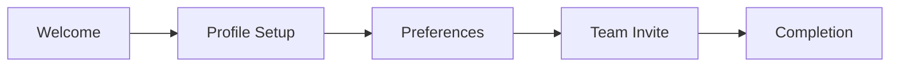

## User Input

```text
$ARGUMENTS
```

You **MUST** consider the user input before proceeding (if not empty).

## Prefetch Phase [REF:PF-001]

**Speculative parallel load** of all potentially-needed files BEFORE any conditional logic:

```text
# PREFETCH BATCH (single message, all Read calls in parallel)
Read IN PARALLEL:
- `memory/constitution.md`
- `templates/shared/core/language-loading.md`
- `templates/shared/complexity-scoring.md`
- `FEATURE_DIR/spec.md` (required - will be resolved after script runs)
- `specs/concept.md` (if exists)
- `specs/app-design/design-system.md` (if exists)
- `templates/design-tokens/*.md` (if directory exists)

CACHE all results with session lifetime.
REPORT: "Prefetched {N} files in {T}ms"
```

**Why prefetch?** Loading 5-8 files in parallel (300ms) vs sequential (2-3s) saves 2+ seconds per command invocation.

---

## Purpose

This command creates **visual and interaction specifications** for UI-heavy features. It bridges the gap between functional requirements (spec.md) and implementation by defining:

1. **Visual Language**: Design tokens, colors, typography, spacing
2. **Component Specifications**: States, variants, accessibility, responsive behavior
3. **Screen Flows**: User interface sequences with component mapping
4. **Interaction Patterns**: Animations, transitions, feedback mechanisms
5. **Accessibility Requirements**: WCAG compliance, keyboard navigation, screen reader support

**When to use**:
- Feature has significant user interface (dashboards, forms, wizards)
- Multiple UI components need consistent styling
- Accessibility is a priority
- Design handoff to developers is needed
- Complex interactions (drag-drop, real-time updates, animations)

**When to skip**:
- API-only features
- CLI tools
- Background services
- Simple CRUD with minimal UI

---

## Mode Selection

```text
IF --concept flag passed:
  IF concept.md exists (specs/concept.md OR ./concept.md):
    MODE = "concept_design"
    LOG "🌐 Application-Wide Design Mode (from concept.md)"

    # Parse wave argument
    IF --wave N specified:
      WAVE = N
    ELIF --all specified:
      WAVE = "all"
    ELSE:
      WAVE = 1  # Default to Wave 1 (Foundations)
  ELSE:
    ERROR "❌ No concept.md found. Run /speckit.concept first."
    EXIT

ELIF --mockup flag passed:
  # Check for design artifacts
  design_artifacts_exist = (
    FILE_EXISTS("specs/app-design/") OR
    FILE_EXISTS("specs/*/design.md") OR
    FILE_EXISTS("specs/*-design.md")
  )

  IF design_artifacts_exist:
    MODE = "mockup_generation"
    LOG "🎨 Visual Mockup Generation Mode (via Google Stitch)"

    # Parse mockup options
    IF --manual flag also passed:
      MOCKUP_MODE = "manual"
      LOG "📝 Manual mode: generating prompts only"
    ELIF --reauth flag passed:
      MOCKUP_MODE = "reauth"
      LOG "🔑 Re-authentication mode"
    ELSE:
      MOCKUP_MODE = "auto"

    IF --screens specified:
      MOCKUP_SCREENS = parse_csv(--screens value)
    ELSE:
      MOCKUP_SCREENS = "all"

    IF --all flag passed:
      MOCKUP_SCOPE = "app"  # Generate for entire app
    ELSE:
      MOCKUP_SCOPE = "feature"  # Current feature only
  ELSE:
    ERROR "❌ No design artifacts found. Run /speckit.design first."
    EXIT

ELIF --design-system flag passed OR spec file does not exist:
  MODE = "design_system_generation"
  LOG "📐 Design System Generation Mode"
ELSE:
  MODE = "feature_design"
  LOG "🎨 Feature Design Mode"
```

---

## Design System Generation Mode

When `--design-system` flag is passed OR no spec file exists, generate a complete design system from brand inputs.

### Brand Input Collection

```text
IF MODE == "design_system_generation":

  1. COLLECT brand inputs (interactive or from constitution.md):

     Required:
     - brand_name: "Your company/product name"
     - primary_color: "#hex or color name"
     - product_type: saas | marketing | mobile | admin

     Optional:
     - logo_file: "path/to/logo.svg"
     - secondary_colors: ["#hex1", "#hex2"]
     - font_preference: "sans-serif" | "serif" | "mono" | specific font
     - style_keywords: ["modern", "playful", "professional", "minimal", "bold"]

  2. IF brand inputs not provided interactively:
     READ constitution.md → design_system block
     EXTRACT brand values

  3. COLLECT extended design preferences (interactive):
     {{include: shared/design-questionnaire.md}}

     Use AskUserQuestion tool to collect preferences in batches:

     BATCH 1 (Visual Foundation):
       Question 1: "What theme mode should the design system support?"
       - Header: "Theme"
       - Options: ["Light only", "Dark only", "Both (with system toggle) (Recommended)"]

       Question 2: "What color palette strategy do you prefer?"
       - Header: "Palette"
       - Options: ["Monochromatic (single hue)", "Complementary (Recommended)",
                   "Analogous (adjacent)", "Triadic (3 colors)"]

       Question 3: "What overall visual style fits your brand?"
       - Header: "Style"
       - Options: ["Minimal & Clean (Recommended)", "Bold & Vibrant",
                   "Soft & Friendly", "Professional & Corporate"]

       Question 4: "What corner radius style do you prefer?"
       - Header: "Corners"
       - Options: ["Sharp (0-2px)", "Soft (4-8px) (Recommended)",
                   "Rounded (12-16px)", "Pill (fully rounded)"]

     BATCH 2 (Density & Typography):
       Question 5: "What visual density suits your users?"
       - Header: "Density"
       - Options: ["Compact (data-heavy)", "Comfortable (Recommended)", "Spacious"]

       Question 6: "What shadow style should components have?"
       - Header: "Shadows"
       - Options: ["None (flat)", "Subtle (Recommended)", "Elevated", "Dramatic"]

       Question 7: "What icon style fits your product?"
       - Header: "Icons"
       - Options: ["Outlined (Recommended)", "Filled", "Duotone"]

       Question 8: "What level of animation/motion?"
       - Header: "Motion"
       - Options: ["Minimal", "Standard (Recommended)", "Rich"]

     SKIP questionnaire if:
       - `--quick` or `--defaults` flag passed
       - All values already defined in constitution.md design_system block

  4. STORE responses in design_preferences object:
     design_preferences = {
       theme_mode: q1_response,
       color_strategy: q2_response,
       visual_style: q3_response,
       corner_radius: q4_response,
       visual_density: q5_response,
       shadow_style: q6_response,
       icon_style: q7_response,
       animation_level: q8_response
     }

  5. APPLY preferences to token generation (see design-questionnaire.md for mappings)
```

### Product Type Presets

```yaml
product_type_presets:
  saas:
    description: "Data-dense SaaS applications"
    characteristics:
      - "Information-rich layouts"
      - "Compact spacing for efficiency"
      - "Neutral palette with action colors"
      - "Tables, charts, dashboards"
    defaults:
      spacing_scale: "compact"  # 4px base
      border_radius: "md"       # 6px
      shadow_depth: "subtle"
      density: "comfortable"
    components:
      - DataTable
      - Dashboard
      - Sidebar
      - CommandPalette
      - Charts

  marketing:
    description: "Marketing and landing pages"
    characteristics:
      - "Bold, attention-grabbing"
      - "Generous whitespace"
      - "High-contrast CTAs"
      - "Hero sections, testimonials"
    defaults:
      spacing_scale: "generous"  # 8px base
      border_radius: "lg"        # 12px
      shadow_depth: "dramatic"
      density: "spacious"
    components:
      - Hero
      - FeatureGrid
      - Testimonials
      - PricingTable
      - CTABanner

  mobile:
    description: "Mobile-first applications"
    characteristics:
      - "Touch-optimized (44px+ targets)"
      - "Bottom navigation"
      - "Gesture-based interactions"
      - "Native platform feel"
    defaults:
      spacing_scale: "touch"    # 8px base, larger touch targets
      border_radius: "xl"       # 16px (iOS-style)
      shadow_depth: "elevation"
      density: "comfortable"
    components:
      - BottomNav
      - SwipeCard
      - BottomSheet
      - PullToRefresh
      - FAB

  admin:
    description: "Admin panels and back-office"
    characteristics:
      - "Dense data display"
      - "Efficient workflows"
      - "Minimal decoration"
      - "Form-heavy interfaces"
    defaults:
      spacing_scale: "compact"  # 4px base
      border_radius: "sm"       # 4px
      shadow_depth: "flat"
      density: "dense"
    components:
      - DataGrid
      - TreeView
      - FormBuilder
      - Breadcrumbs
      - StatusIndicator
```

### Design System Generation Workflow

```text
IF MODE == "design_system_generation":

  Step DS-1: Load Preset
  ─────────────────────
  1. READ templates/shared/design-system-presets.md
  2. FIND preset matching product_type
  3. APPLY preset defaults as base

  Step DS-2: Generate Color Palette
  ─────────────────────────────────
  FROM primary_color:
  1. Generate color scale (50-950):
     - 50-100: Tints (for backgrounds)
     - 200-400: Light variants
     - 500: Primary (input)
     - 600-800: Dark variants
     - 900-950: Shades (for text)

  2. Generate semantic colors:
     - primary: input color
     - secondary: complementary or neutral
     - accent: analogous or triadic
     - success: green family (#22C55E default)
     - warning: amber family (#F59E0B default)
     - error: red family (#EF4444 default)
     - info: blue family (#3B82F6 default)

  3. Generate neutral palette:
     - Tinted neutrals based on primary undertone
     - Or pure gray if style_keywords includes "minimal"

  4. Validate contrast ratios (WCAG AA minimum)

  Step DS-3: Generate Typography
  ──────────────────────────────
  FROM font_preference OR preset:
  1. SELECT font pairing:
     - sans-serif: Inter, system-ui
     - serif: Georgia, Merriweather
     - mono: JetBrains Mono, Fira Code
     - custom: user-specified

  2. GENERATE type scale (1.25 ratio):
     - display: 3rem / 700
     - h1: 2.25rem / 700
     - h2: 1.875rem / 600
     - h3: 1.5rem / 600
     - h4: 1.25rem / 600
     - body: 1rem / 400
     - small: 0.875rem / 400
     - caption: 0.75rem / 400

  Step DS-4: Generate Spacing & Layout
  ────────────────────────────────────
  FROM preset.spacing_scale:
  1. GENERATE spacing tokens:
     - 0: 0
     - px: 1px
     - 0.5: 2px
     - 1: 4px (base)
     - 2: 8px
     - 3: 12px
     - 4: 16px
     - 5: 20px
     - 6: 24px
     - 8: 32px
     - 10: 40px
     - 12: 48px
     - 16: 64px

  2. GENERATE layout tokens:
     - container widths
     - breakpoints
     - grid columns

  Step DS-5: Generate Component Library
  ─────────────────────────────────────
  FROM preset.components + core components:
  1. FOR EACH component:
     - Generate specification
     - Define variants
     - Set default styling
     - Configure for preset type

  2. PRIORITY order:
     - Core: Button, Input, Select, Checkbox, Radio
     - Layout: Card, Modal, Drawer, Tabs
     - Feedback: Toast, Alert, Badge, Progress
     - Preset-specific: from preset.components

  Step DS-6: Generate Output Files
  ────────────────────────────────
  OUTPUT:
  - design-system/tokens.css      # CSS custom properties
  - design-system/tokens.json     # JSON format
  - design-system/tailwind.config.js  # Tailwind theme
  - design-system/theme.ts        # TypeScript theme object
  - design-system/README.md       # Usage documentation
```

### Storybook Auto-Generation

```text
IF storybook.auto_generate:

  Step SB-1: Generate Storybook Configuration
  ───────────────────────────────────────────
  CREATE .storybook/main.ts:
  - Framework: @storybook/react-vite (or detected framework)
  - Addons: essentials, a11y, interactions
  - Stories glob pattern

  CREATE .storybook/preview.ts:
  - Import design tokens CSS
  - Configure viewports (mobile, tablet, desktop)
  - Configure dark mode toggle
  - Set default background

  Step SB-2: Generate Component Stories
  ─────────────────────────────────────
  FOR EACH component in design-system:

    CREATE stories/{Component}.stories.tsx:

    ```typescript
    import type { Meta, StoryObj } from '@storybook/react';
    import { {Component} } from '../components/{component}';

    const meta: Meta<typeof {Component}> = {
      title: 'Components/{Component}',
      component: {Component},
      tags: ['autodocs'],
      argTypes: {
        // Generated from component variants
      },
    };

    export default meta;
    type Story = StoryObj<typeof meta>;

    // Default story
    export const Default: Story = {
      args: {
        // Default props
      },
    };

    // Variant stories
    export const {Variant}: Story = {
      args: {
        variant: '{variant}',
      },
    };

    // State stories
    export const Disabled: Story = {
      args: {
        disabled: true,
      },
    };
    ```

  Step SB-3: Generate Documentation
  ─────────────────────────────────
  CREATE stories/Introduction.mdx:
  - Design system overview
  - Token usage guide
  - Component inventory
  - Accessibility guidelines

  CREATE stories/Colors.mdx:
  - Color palette visualization
  - Contrast ratio table
  - Usage guidelines

  CREATE stories/Typography.mdx:
  - Type scale visualization
  - Font specimens
  - Usage examples
```

### Figma Token Export

```text
IF figma_export.enabled:

  Step FT-1: Convert to Figma Tokens Studio Format
  ────────────────────────────────────────────────
  TRANSFORM design tokens to:

  {
    "global": {
      "colors": {
        "primary": {
          "50": { "value": "#eff6ff", "type": "color" },
          "500": { "value": "#3b82f6", "type": "color" },
          "900": { "value": "#1e3a8a", "type": "color" }
        },
        "semantic": {
          "success": { "value": "{colors.green.500}", "type": "color" },
          "error": { "value": "{colors.red.500}", "type": "color" }
        }
      },
      "typography": {
        "fontFamilies": {
          "heading": { "value": "Inter", "type": "fontFamilies" },
          "body": { "value": "Inter", "type": "fontFamilies" }
        },
        "fontSizes": {
          "sm": { "value": "14", "type": "fontSizes" },
          "base": { "value": "16", "type": "fontSizes" },
          "lg": { "value": "18", "type": "fontSizes" }
        }
      },
      "spacing": {
        "xs": { "value": "4", "type": "spacing" },
        "sm": { "value": "8", "type": "spacing" },
        "md": { "value": "16", "type": "spacing" }
      },
      "borderRadius": {
        "sm": { "value": "4", "type": "borderRadius" },
        "md": { "value": "8", "type": "borderRadius" }
      }
    },
    "light": {
      "background": { "value": "{colors.neutral.50}", "type": "color" },
      "foreground": { "value": "{colors.neutral.900}", "type": "color" }
    },
    "dark": {
      "background": { "value": "{colors.neutral.900}", "type": "color" },
      "foreground": { "value": "{colors.neutral.50}", "type": "color" }
    }
  }

  Step FT-2: Export Files
  ───────────────────────
  OUTPUT:
  - design-tokens/figma-tokens.json      # Main token file
  - design-tokens/$themes.json           # Theme configuration
  - design-tokens/$metadata.json         # Token metadata
  - design-tokens/README.md              # Import instructions

  Step FT-3: Generate Import Instructions
  ───────────────────────────────────────
  CREATE design-tokens/README.md:

  ## Importing to Figma

  1. Install "Tokens Studio for Figma" plugin
  2. Open plugin → Settings → Add new sync provider
  3. Choose "Local" or connect to Git
  4. Import figma-tokens.json
  5. Apply tokens to your Figma file

  ## Token Structure

  - global: Base tokens (colors, typography, spacing)
  - light: Light theme semantic tokens
  - dark: Dark theme semantic tokens

  ## Keeping in Sync

  After code changes:
  1. Run `/speckit.design --export-figma`
  2. Pull tokens in Figma plugin
```

### Design System Output Summary

```text
IF MODE == "design_system_generation":

  OUTPUT:
  ┌─────────────────────────────────────────────────────────────┐
  │ /speckit.design --design-system Complete                     │
  ├─────────────────────────────────────────────────────────────┤
  │ Brand: {brand_name}                                          │
  │ Product Type: {product_type}                                 │
  │ Primary Color: {primary_color}                               │
  │                                                             │
  │ Generated Files:                                            │
  │                                                             │
  │   design-system/                                            │
  │   ├── tokens.css          # CSS custom properties           │
  │   ├── tokens.json         # JSON format                     │
  │   ├── tailwind.config.js  # Tailwind theme extension        │
  │   ├── theme.ts            # TypeScript theme object         │
  │   └── README.md           # Usage documentation             │
  │                                                             │
  │   design-tokens/          (if Figma export enabled)         │
  │   ├── figma-tokens.json   # Figma Tokens Studio format      │
  │   ├── $themes.json        # Theme configuration             │
  │   └── README.md           # Import instructions             │
  │                                                             │
  │   .storybook/             (if Storybook enabled)            │
  │   ├── main.ts             # Storybook config                │
  │   ├── preview.ts          # Preview config                  │
  │   └── stories/            # Auto-generated stories          │
  │                                                             │
  │ Tokens Generated:                                           │
  │   Colors: {N} semantic + {M} palette                        │
  │   Typography: {T} levels                                    │
  │   Spacing: {S} values                                       │
  │   Components: {C} specified                                 │
  │                                                             │
  │ Next Steps:                                                 │
  │   1. Review tokens in Storybook: npm run storybook          │
  │   2. Import to Figma: See design-tokens/README.md           │
  │   3. Start building: npm run dev                            │
  └─────────────────────────────────────────────────────────────┘
```

---

## Concept Design Mode

When `--concept` flag is passed AND concept.md exists, generate comprehensive application-wide design covering ALL features, UX flows, and user journeys from the concept document.

### Output Structure

```text
specs/app-design/
├── index.md                    # Overview + traceability matrix + App-DQS
├── design-system.md            # Global tokens (colors, typography, spacing)
├── navigation.md               # App-wide nav patterns, sitemap, route map
├── foundations/
│   ├── auth-design.md          # UXF-AUTH-xxx scenarios
│   ├── error-design.md         # UXF-ERR-xxx scenarios
│   ├── layout-design.md        # UXF-LAYOUT-xxx scenarios
│   ├── nav-design.md           # UXF-NAV-xxx scenarios
│   ├── ftue-design.md          # UXF-FTUE-xxx scenarios
│   ├── feedback-design.md      # UXF-FEED-xxx scenarios
│   └── admin-design.md         # UXF-ADMIN-xxx scenarios
├── waves/
│   ├── wave-1/                 # Foundation features
│   │   └── EPIC-001.F01-design.md
│   ├── wave-2/                 # Experience features
│   └── wave-3/                 # Business features
├── journeys/
│   ├── J000-golden-path.md     # Golden path flow
│   └── J001-*.md               # Additional journeys
├── motion/
│   ├── motion-system.md        # Animation tokens
│   └── transitions.md          # Page transitions
└── components/
    ├── inventory.md            # Master component list
    └── shared/                 # Shared component specs
```

### Phase 0: Validation & Concept Parsing

```text
IF MODE == "concept_design":

  1. LOCATE concept file:
     - CHECK specs/concept.md
     - FALLBACK ./concept.md
     - ERROR if not found

  2. PARSE concept.md:
     EXTRACT:
       - cqs_score: Concept Quality Score (warn if < 60)
       - feature_hierarchy: EPIC-NNN.FNN.SNN tree
       - user_journeys: J000, J001, ... with steps
       - personas: JTBD, pain points, device preferences
       - ux_foundations: AUTH, ERROR, LAYOUT, NAV, FTUE, FEEDBACK, ADMIN
       - execution_order: Wave 1, Wave 2, Wave 3+
       - technical_hints: Domain entities, API surface
       - glossary: UI labels, form field names

  3. QUALITY GATE:
     IF cqs_score >= 80:
       LOG "✅ Production-quality concept (CQS: {cqs_score})"
       PROCEED with full generation
     ELIF cqs_score >= 60:
       LOG "⚠️ Concept has gaps (CQS: {cqs_score}). Proceeding with warnings."
       PROCEED with warnings enabled
     ELSE:
       LOG "⚠️ Concept Quality Score below threshold (CQS: {cqs_score})"
       PROMPT "Continue anyway? [y/N]"
       IF user declines: EXIT
```

### Phase 1: Design System (Product Designer Agent)

```text
IF WAVE == 1 OR WAVE == "all":

  1. READ constitution.md → design_system block
     EXTRACT brand inputs (colors, typography, style keywords)

  2. IF design-system.md already exists:
       LOG "📐 Design system found. Validating..."
       VALIDATE tokens against concept requirements
     ELSE:
       GENERATE design-system.md using Design System Generation Mode workflow
       (Reuse existing agents: Product Designer)

  3. OUTPUT: specs/app-design/design-system.md
```

### Phase 2: Foundation Designs (UX Designer Agent)

```text
IF WAVE == 1 OR WAVE == "all":

  FOR each foundation IN [AUTH, ERROR, LAYOUT, NAV, FTUE, FEEDBACK, ADMIN]:

    1. EXTRACT foundation scenarios from concept.md:
       - UXF-{foundation}-001, UXF-{foundation}-002, ...
       - Map to user journey touchpoints

    2. GENERATE foundation-design.md:

       INCLUDE:
         - Scenario inventory table
         - Screen wireframes (ASCII or Mermaid)
         - State diagrams (loading, success, error, empty)
         - Component specs with accessibility requirements
         - Responsive breakpoints

       TRACEABILITY header:
         | Source | Reference |
         |--------|-----------|
         | UX Foundation | UXF-{foundation} |
         | Journeys | J000 (step N), J002 (step M) |

    3. OUTPUT: specs/app-design/foundations/{foundation}-design.md
```

### Phase 3: Navigation Architecture (UX Designer Agent)

```text
IF WAVE == 1 OR WAVE == "all":

  1. ANALYZE feature_hierarchy:
     - Map EPICs to top-level navigation
     - Map Features to sub-navigation
     - Map Stories to individual routes/screens

  2. GENERATE navigation.md:

     INCLUDE:
       ## Sitemap
       ```mermaid
       graph TD
         A[Landing] --> B[Dashboard]
         B --> C[Feature 1]
         ...
       ```

       ## Route Map
       | Route | Feature | Guard | Layout |
       |-------|---------|-------|--------|
       | /dashboard | EPIC-001.F01 | auth | main |
       | /settings | EPIC-002.F01 | auth | settings |

       ## Navigation Patterns
       - Primary: Tab bar / Sidebar / Header
       - Secondary: Breadcrumbs, Back buttons
       - Mobile: Bottom nav, Hamburger menu

       ## Journey → Route Mapping
       | Journey | Steps | Routes |
       |---------|-------|--------|
       | J000 Golden Path | 1-5 | /, /signup, /onboarding, /dashboard |

  3. OUTPUT: specs/app-design/navigation.md
```

### Phase 4: Journey Flows (UX Designer Agent)

```text
IF WAVE == 1 OR WAVE == "all":

  FOR each journey IN user_journeys:

    1. PARSE journey steps from concept.md

    2. GENERATE journey-design.md:

       INCLUDE:
         ## Journey: {journey_name}
         **ID**: {journey_id}
         **Persona**: {primary_persona}
         **Trigger**: {entry_point}
         **Outcome**: {success_state}

         ## Flow Diagram
         ```mermaid
         sequenceDiagram
           participant User
           participant System
           User->>System: Step 1 action
           System-->>User: Response
           ...
         ```

         ## Step-by-Step Design

         ### Step 1: {step_name}
         - **Screen**: {screen_reference}
         - **User Action**: {action}
         - **System Response**: {response}
         - **Edge Cases**: {error_states}
         - **Component**: {component_list}

         ## Exit Points
         | Exit Type | Condition | Handling |
         |-----------|-----------|----------|
         | Success | Task completed | Celebration + redirect |
         | Abort | User cancels | Confirmation + cleanup |
         | Error | System failure | Retry + support link |

         ## Traceability
         | Source | Reference |
         |--------|-----------|
         | Concept Journey | {journey_id} |
         | Features | EPIC-001.F01, EPIC-002.F02 |
         | Foundations | AUTH, NAV |

    3. OUTPUT: specs/app-design/journeys/{journey_id}-{journey_name_slug}.md
```

### Phase 5: Wave-by-Wave Feature Design

```text
# Wave selection determines which features to design

IF WAVE == 1:
  FEATURES = features from "Wave 1: Foundation" in execution_order
ELIF WAVE == 2:
  FEATURES = features from "Wave 2: Experience" in execution_order
ELIF WAVE == 3:
  FEATURES = features from "Wave 3+: Business" in execution_order
ELIF WAVE == "all":
  FEATURES = all features from execution_order

FOR each feature IN FEATURES:

  1. EXTRACT from concept.md:
     - feature_id: EPIC-NNN.FNN
     - stories: S01, S02, ...
     - acceptance_criteria
     - related_journeys

  2. MAP stories to screens:

     FOR each story:
       IDENTIFY:
         - Primary screen(s)
         - Modal/overlay needs
         - State variations (empty, loading, error, success)

  3. GENERATE feature-design.md:

     INCLUDE:
       ## Feature: {feature_name}
       **ID**: {feature_id}
       **Wave**: {wave_number}
       **Priority**: {priority}

       ## Screen Inventory
       | Screen | Story | States | Route |
       |--------|-------|--------|-------|
       | Dashboard | S01 | default, empty, loading | /dashboard |

       ## Wireframes

       ### Screen: {screen_name}
       ```
       ┌─────────────────────────────────────┐
       │ Header                              │
       ├─────────────────────────────────────┤
       │                                     │
       │  [Component A]    [Component B]     │
       │                                     │
       │  ┌─────────────────────────────┐    │
       │  │ Main Content Area           │    │
       │  │                             │    │
       │  └─────────────────────────────┘    │
       │                                     │
       ├─────────────────────────────────────┤
       │ Footer / Action Bar                 │
       └─────────────────────────────────────┘
       ```

       ## Component Specifications
       [Use Feature Design Mode component spec format]

       ## Traceability
       | Source | Reference |
       |--------|-----------|
       | Concept Feature | {feature_id} |
       | Wave | {wave_number} |
       | Journeys | J000 (step 3), J002 (step 1) |
       | Stories | S01, S02, S03 |

  4. OUTPUT: specs/app-design/waves/wave-{N}/{feature_id}-design.md
```

### Phase 6: Motion System (Motion Designer Agent)

```text
IF WAVE == 1 OR WAVE == "all":

  1. ANALYZE journeys for transition needs:
     - Page-to-page transitions
     - Modal/overlay animations
     - Loading state animations

  2. GENERATE motion-system.md:

     INCLUDE:
       ## Animation Tokens
       | Token | Value | Usage |
       |-------|-------|-------|
       | duration-fast | 150ms | Micro-interactions |
       | duration-normal | 300ms | Page transitions |
       | easing-standard | cubic-bezier(0.4, 0, 0.2, 1) | Default |

       ## Page Transitions
       | From | To | Animation |
       |------|-----|-----------|
       | / | /dashboard | Slide left + fade |
       | any | modal | Scale up + backdrop |

       ## Micro-Interactions
       [Reference templates/shared/animation-presets/micro-interactions.md]

  3. OUTPUT: specs/app-design/motion/motion-system.md

  4. GENERATE transitions.md:

     INCLUDE:
       ## Journey Transitions
       FOR each journey:
         Document step-to-step transitions
         Map to page transition patterns

  5. OUTPUT: specs/app-design/motion/transitions.md
```

### Phase 7: Component Inventory

```text
IF WAVE == 1 OR WAVE == "all":

  1. AGGREGATE components from all design files:
     - Foundations → base components
     - Journeys → flow components
     - Features → feature-specific components

  2. DEDUPLICATE and categorize:
     - Primitives (Button, Input, Text, Icon)
     - Layout (Card, Container, Grid, Stack)
     - Navigation (NavBar, Tabs, Breadcrumb)
     - Feedback (Toast, Alert, Modal, Progress)
     - Data Display (Table, List, Chart)
     - Forms (Form, FormField, Select, Checkbox)
     - Feature-specific (unique to this app)

  3. GENERATE inventory.md:

     INCLUDE:
       ## Component Inventory
       | Component | Category | Usage Count | Sources |
       |-----------|----------|-------------|---------|
       | Button | Primitive | 47 | All foundations, all features |
       | DataTable | Data Display | 12 | EPIC-001.F02, EPIC-003.F01 |

       ## Shared Component Needs
       Components used 3+ times → candidate for shared spec

       ## Implementation Priority
       1. Primitives (Week 1)
       2. Layout + Navigation (Week 2)
       3. Forms + Feedback (Week 3)
       4. Feature-specific (Per wave)

  4. OUTPUT: specs/app-design/components/inventory.md
```

### Phase 8: Quality Validation & Index Generation

```text
ALWAYS (after any wave completion):

  1. CALCULATE App-DQS (Design Quality Score):

     AGGREGATE scores from:
       - Design system completeness
       - Foundation coverage
       - Journey flow completeness
       - Feature wireframe quality
       - Traceability coverage

     FORMULA:
       App-DQS = (
         design_system_score * 0.15 +
         foundations_score * 0.20 +
         journeys_score * 0.20 +
         features_score * 0.30 +
         traceability_score * 0.15
       )

  2. VALIDATE traceability:

     CHECK:
       - Every concept feature has design file
       - Every journey step has screen reference
       - Every UXF scenario has design coverage

     REPORT gaps if any

  3. GENERATE/UPDATE index.md:

     INCLUDE:
       ## Application Design Overview

       **Concept**: {concept_name}
       **CQS**: {cqs_score}
       **App-DQS**: {app_dqs_score}
       **Generated**: {timestamp}
       **Wave**: {current_wave} of {total_waves}

       ## Design Artifacts

       | Artifact | Status | DQS | Link |
       |----------|--------|-----|------|
       | Design System | ✅ Complete | 92 | [design-system.md](design-system.md) |
       | Navigation | ✅ Complete | 88 | [navigation.md](navigation.md) |
       | Foundations | ✅ Complete | 85 | [foundations/](foundations/) |
       | Wave 1 Features | ✅ Complete | 90 | [waves/wave-1/](waves/wave-1/) |
       | Wave 2 Features | ⏳ Pending | - | - |

       ## Traceability Matrix

       | Concept ID | Design Artifact | Coverage |
       |------------|-----------------|----------|
       | EPIC-001.F01 | waves/wave-1/EPIC-001.F01-design.md | 100% |
       | J000 | journeys/J000-golden-path.md | 100% |
       | UXF-AUTH | foundations/auth-design.md | 100% |

       ## Next Steps
       - [ ] Run /speckit.preview to generate interactive preview
       - [ ] Review with stakeholders
       - [ ] Run /speckit.design --concept --wave 2 for next wave

  4. OUTPUT: specs/app-design/index.md
```

### Wave Completion Output

```text
┌─────────────────────────────────────────────────────────────────────┐
│  🌐 CONCEPT DESIGN COMPLETE — WAVE {N}                              │
├─────────────────────────────────────────────────────────────────────┤
│                                                                     │
│  Concept: {concept_name}                                            │
│  CQS: {cqs_score} → App-DQS: {app_dqs_score}                        │
│                                                                     │
│  ✅ Design System: Complete                                         │
│  ✅ Foundations: {N}/{total} scenarios designed                     │
│  ✅ Navigation: Sitemap + route map generated                       │
│  ✅ Journeys: {N}/{total} flows designed                            │
│  ✅ Wave {N} Features: {N}/{total} features designed                │
│  ✅ Motion System: Animation tokens + transitions                   │
│  ✅ Component Inventory: {N} components catalogued                  │
│                                                                     │
│  📁 Output: specs/app-design/                                       │
│  📋 Index: specs/app-design/index.md                                │
│                                                                     │
├─────────────────────────────────────────────────────────────────────┤
│  Next Steps:                                                        │
│   1. Review: Open index.md for artifact overview                    │
│   2. Preview: Run /speckit.preview for interactive preview          │
│   3. Continue: Run /speckit.design --concept --wave {N+1}           │
│   4. Plan: Run /speckit.plan to create technical implementation     │
└─────────────────────────────────────────────────────────────────────┘
```

---

## Alternative Design Mode

When `--all-alternatives` or `--alternative N` flag is passed, generate design specifications for concept alternatives. This enables visual comparison of different product strategies before committing to implementation.

{{include: shared/alternative-parser.md}}

### CLI Arguments

```text
Parse arguments for:
- `--alternative <N>` — Generate design for specific alternative (1-5)
- `--all-alternatives` — Generate designs for ALL alternatives from concept.md
- `--variant <name>` — Generate design for variant (MINIMAL/BALANCED/AMBITIOUS)
- `--all-variants` — Generate designs for all 3 scope variants
- `--compare` — Generate visual comparison matrix alongside designs
- `--quick` — Use default design preferences, skip questionnaire
```

### Output Structure

```text
specs/app-design/alternatives/
├── comparison.md               # Side-by-side feature/score matrix
├── alt-1-conventional/
│   ├── design-system.md        # Design tokens for this alternative
│   ├── overview.md             # Strategy summary, score breakdown
│   ├── features/               # Per-epic design specs
│   │   ├── EPIC-001-design.md
│   │   └── EPIC-002-design.md
│   └── screens/                # Key screen wireframes
├── alt-2-disruptive/
│   ├── design-system.md
│   ├── overview.md
│   ├── features/
│   └── screens/
└── ...

specs/app-design/variants/
├── comparison.md               # MINIMAL vs BALANCED vs AMBITIOUS
├── MINIMAL/
│   ├── design-system.md
│   ├── features/               # Only P1 features
│   └── screens/
├── BALANCED/
│   ├── design-system.md
│   ├── features/               # P1 + selected P2
│   └── screens/
└── AMBITIOUS/
    ├── design-system.md
    ├── features/               # All features
    └── screens/
```

### Workflow: All Alternatives

```text
IF MODE == "alternative_design" AND --all-alternatives:

  1. LOCATE and PARSE concept.md:
     concept_path = find_concept_md()  # specs/concept.md or ./concept.md
     IF NOT exists(concept_path):
       ERROR "concept.md not found. Run /speckit.concept first."

     alternatives = parse_alternatives(concept_content)
     IF alternatives.length == 0:
       ERROR "No Product Alternatives found in concept.md."

  2. COLLECT design preferences (once, apply to all):
     IF NOT --quick:
       design_preferences = collect_design_questionnaire()
     ELSE:
       design_preferences = DEFAULT_PREFERENCES

  3. FOR each alternative in alternatives:
     strategy_slug = slugify(alternative.strategy_type)  # e.g., "conventional"
     output_dir = "specs/app-design/alternatives/alt-{N}-{strategy_slug}/"

     a) GENERATE overview.md:
        - Alternative name and vision
        - Strategy type explanation
        - Score breakdown (4 dimensions /40)
        - Core features list (5-7 epics)
        - Pros/Cons summary

     b) GENERATE design-system.md:
        - Apply design_preferences tokens
        - Customize based on strategy type:
          * "Disruptive" → bolder colors, larger contrast
          * "Minimal" → minimal palette, smaller spacing
          * "Premium" → richer shadows, refined typography
          * "Platform" → modular, extensible tokens

     c) FOR each epic in alternative.core_features:
        GENERATE features/{epic_id}-design.md:
          - Feature overview with traceability to EPIC-xxx
          - Key screens wireframes (ASCII or visual)
          - Component specifications
          - User flow diagram

     d) GENERATE screens/:
        - Home/Dashboard screen
        - Key feature screens
        - Common patterns (auth, errors, empty states)

  4. GENERATE comparison.md:
     - Side-by-side comparison table
     - Feature matrix (which alternative has what)
     - Score comparison chart
     - Visual style comparison thumbnails
     - Recommendation based on scores
```

### Workflow: Single Alternative

```text
IF MODE == "alternative_design" AND --alternative N:

  1. PARSE alternatives from concept.md
  2. FIND alternative with number == N
     IF NOT found:
       ERROR "Alternative {N} not found. Available: 1-{max}"

  3. GENERATE design for single alternative:
     - Same process as all-alternatives but for one
     - Output to: specs/app-design/alternatives/alt-{N}-{strategy}/
```

### Workflow: Variants (MINIMAL/BALANCED/AMBITIOUS)

```text
IF MODE == "variant_design":

  1. PARSE variants from concept.md:
     variants = parse_variants(concept_content)
     IF variants.length == 0:
       ERROR "No Concept Variants found. Ensure MINIMAL/BALANCED/AMBITIOUS sections exist."

  2. FOR each variant in [MINIMAL, BALANCED, AMBITIOUS]:
     output_dir = "specs/app-design/variants/{variant.name}/"

     a) EXTRACT features for this variant:
        - MINIMAL: MUST_HAVE features only
        - BALANCED: MUST_HAVE + high-impact SHOULD_HAVE
        - AMBITIOUS: All features

     b) GENERATE design-system.md:
        - Same base tokens
        - Variant-specific component set

     c) FOR each feature in variant.features:
        GENERATE feature design spec

  3. GENERATE comparison.md:
     | Dimension | MINIMAL | BALANCED | AMBITIOUS |
     |-----------|:-------:|:--------:|:---------:|
     | Features | 8 | 14 | 22 |
     | Screens | 12 | 24 | 40 |
     | Complexity | Low | Medium | High |
```

### Comparison Matrix Template

```markdown
# Alternative Comparison

## Strategy Overview

| Alternative | Strategy | Vision | Score |
|-------------|----------|--------|:-----:|
| 1. {Name} | {Type} | {Vision...} | {N}/40 |
| 2. {Name} | {Type} | {Vision...} | {N}/40 |
| 3. {Name} | {Type} | {Vision...} | {N}/40 |

## Score Breakdown

| Dimension | Alt 1 | Alt 2 | Alt 3 |
|-----------|:-----:|:-----:|:-----:|
| Problem-Solution Fit (/12) | {N} | {N} | {N} |
| Market Differentiation (/10) | {N} | {N} | {N} |
| Feasibility (/10) | {N} | {N} | {N} |
| Time to Market (/8) | {N} | {N} | {N} |
| **Total** | **{N}** | **{N}** | **{N}** |

## Feature Matrix

| Epic | Description | Alt 1 | Alt 2 | Alt 3 |
|------|-------------|:-----:|:-----:|:-----:|
| EPIC-001 | User Authentication | ✓ | ✓ | ✓ |
| EPIC-002 | Dashboard | ✓ | | ✓ |
| EPIC-003 | Analytics | | ✓ | ✓ |

## Effort & Risk

| Metric | Alt 1 | Alt 2 | Alt 3 |
|--------|:-----:|:-----:|:-----:|
| Effort | {S/M/L/XL} | {S/M/L/XL} | {S/M/L/XL} |
| Technical Risk | {Low/Med/High} | {Low/Med/High} | {Low/Med/High} |
| Time to MVP | {N} weeks | {N} weeks | {N} weeks |

## Recommendation

Based on scores and analysis:

**Recommended Alternative**: Alt {N} — {Name}

**Rationale**:
1. {Reason 1}
2. {Reason 2}
3. {Reason 3}
```

### Completion Summary

```text
┌─────────────────────────────────────────────────────────────────────┐
│  ✅ Alternative Design Complete                                     │
│                                                                     │
│  Alternatives Generated: {N}                                        │
│  Output Directory: specs/app-design/alternatives/                   │
│                                                                     │
│  Files Created:                                                     │
│   - comparison.md (comparison matrix)                               │
│   - alt-1-{strategy}/... ({M} files)                                │
│   - alt-2-{strategy}/... ({M} files)                                │
│   - ...                                                             │
│                                                                     │
├─────────────────────────────────────────────────────────────────────┤
│  Next Steps:                                                        │
│   1. Review: Open comparison.md for side-by-side analysis           │
│   2. Preview: Run /speckit.preview --all-alternatives               │
│   3. Select: Choose alternative for implementation                  │
│   4. Design: Run /speckit.design --concept with selected strategy   │
└─────────────────────────────────────────────────────────────────────┘
```

---

## Mockup Generation Mode

When `--mockup` flag is passed AND design artifacts exist, generate high-fidelity visual mockups from ASCII wireframes using Google Stitch browser automation.

### Prerequisites

```text
REQUIRE:
  - Design artifacts exist (specs/app-design/ OR specs/*/design.md)
  - Playwright installed (npm install playwright)
  - Chromium browser (npx playwright install chromium)
  - Google account (for Stitch authentication)
```

### Output Structure

```text
.preview/stitch-mockups/
├── {feature}/
│   ├── {screen-name}/
│   │   ├── stitch-output.html      # Raw Stitch HTML
│   │   ├── stitch-output.css       # Styles
│   │   ├── screenshot-desktop.png  # 1440px
│   │   ├── screenshot-mobile.png   # 375px
│   │   ├── figma-clipboard.json    # For Figma paste
│   │   └── prompt.txt              # Generation prompt
│   └── index.html                  # Gallery for feature
└── index.html                      # Master gallery

.speckit/stitch/
├── session/                        # Playwright persistent context
├── usage.json                      # Rate limit tracking
└── prompts-cache/                  # Cached prompts for retry
```

### Mockup Generation Workflow

```text
IF MODE == "mockup_generation":

  # Load automation modules
  READ templates/shared/stitch-integration.md
  READ templates/shared/stitch-prompts.md
  READ templates/shared/stitch-selectors.md

  # Execute workflow phases
  CALL stitch_main():

    Phase 0: Preflight Check
    ────────────────────────
    - Verify Playwright installation
    - Check Chromium browser available
    - Validate session directory
    - Check rate limits (350/month standard, 50/month experimental)

    Phase 1: Authentication
    ───────────────────────
    IF MOCKUP_MODE == "reauth" OR no valid session:
      - Launch Playwright with persistent context
      - Navigate to stitch.withgoogle.com
      - Prompt user: "Please sign in to Google in the browser window"
      - Wait for successful authentication
      - Save session to .speckit/stitch/session/
    ELSE:
      - Load existing session
      - Verify session validity

    Phase 2: Wireframe Discovery
    ────────────────────────────
    SCAN design artifacts based on MOCKUP_SCOPE:
      IF MOCKUP_SCOPE == "app":
        - specs/app-design/foundations/*.md
        - specs/app-design/waves/**/*-design.md
        - specs/app-design/journeys/*.md
      ELIF MOCKUP_SCOPE == "feature":
        - Current feature design.md

    FOR each wireframe:
      EXTRACT:
        - ASCII art block
        - Screen name
        - Component list
        - Design system tokens

    IF MOCKUP_SCREENS != "all":
      FILTER wireframes to specified screens

    Phase 3: Prompt Generation
    ──────────────────────────
    FOR each wireframe:
      READ templates/shared/stitch-prompts.md
      CALL stitch_generate_prompt(wireframe):
        - Detect screen type (login, dashboard, form, etc.)
        - Load appropriate template
        - Enrich with design system context
        - Apply persona preferences
        - Save prompt to .speckit/stitch/prompts-cache/

    IF MOCKUP_MODE == "manual":
      GENERATE manual-generation-guide.md
      LOG "📝 Prompts generated. See manual guide for instructions."
      EXIT

    Phase 4: Stitch Generation Pipeline
    ────────────────────────────────────
    FOR each prompt:
      CALL stitch_generate_mockup(prompt):
        - Navigate to Stitch
        - Locate and fill prompt input
        - Click generate button
        - Wait for generation (timeout: 60s)
        - Handle errors (retry once, then skip)

    Phase 5: Export Pipeline
    ────────────────────────
    FOR each successful generation:
      CALL stitch_export_html():
        - Click Export button
        - Select HTML/Tailwind format
        - Copy code output
        - Save to stitch-output.html/css

      CALL stitch_export_screenshots():
        - Capture canvas at 1440px (desktop)
        - Resize to 375px
        - Capture mobile view
        - Save PNGs

      CALL stitch_export_figma():
        - Click "Copy to Figma" if available
        - Save clipboard content to figma-clipboard.json

    Phase 6: Gallery Generation
    ───────────────────────────
    - Generate per-feature index.html galleries
    - Generate master index.html
    - Include side-by-side wireframe vs mockup

    Phase 7: Quality Report
    ───────────────────────
    CALL stitch_generate_report():
      - Summary table (status, exports, prompt match)
      - Rate limit remaining
      - Failed screens list
      - Manual fallback guide if needed
```

### CLI Usage

```bash
# Basic mockup generation for current feature
/speckit.design --mockup

# Generate for entire app (from concept design)
/speckit.design --mockup --all

# Manual mode (prompts only, no automation)
/speckit.design --mockup --manual

# Specific screens only
/speckit.design --mockup --screens "login,dashboard,settings"

# Re-authenticate (if session expired)
/speckit.design --mockup --reauth

# ========================================
# OUTPUT CONTROL FLAGS (NEW)
# ========================================

# Control viewport screenshots (default: desktop,tablet,mobile)
/speckit.design --mockup --viewports "desktop,tablet,mobile"
/speckit.design --mockup --viewports "desktop,mobile"  # Skip tablet

# Disable WebP optimization (keep PNG only)
/speckit.design --mockup --no-webp

# Disable all output optimizations
/speckit.design --mockup --no-optimize

# Disable interactive HTML preview generation
/speckit.design --mockup --interactive false

# ========================================
# PERFORMANCE FLAGS (Phase 2 - Coming Soon)
# ========================================

# Enable parallel generation (default: true, 3 concurrent)
/speckit.design --mockup --parallel --max-parallel 5

# Disable parallel generation (sequential processing)
/speckit.design --mockup --no-parallel

# Adjust delay between batches (default: 5000ms)
/speckit.design --mockup --batch-delay 10000

# ========================================
# CACHING FLAGS (Phase 3 - Coming Soon)
# ========================================

# Enable incremental generation (skip unchanged screens, default: true)
/speckit.design --mockup --incremental

# Force regeneration of all screens (ignore cache)
/speckit.design --mockup --force

# Disable browser session reuse
/speckit.design --mockup --no-reuse-session

# ========================================
# DEVELOPER FLAGS
# ========================================

# Audit all Stitch UI selectors (diagnostic mode, no mockup generation)
/speckit.design --mockup --audit-selectors

# Dry-run mode (preview without executing)
/speckit.design --mockup --dry-run

# Enable debug logging and screenshots
/speckit.design --mockup --debug

# Set log level (debug|info|warn|error, default: info)
/speckit.design --mockup --log-level debug

# Configure retry attempts (default: 2)
/speckit.design --mockup --retry-max 5

# Set retry backoff strategy (exponential|linear|fixed)
/speckit.design --mockup --retry-backoff exponential

# Allow manual intervention at pause points
/speckit.design --mockup --allow-manual-intervention
```

### Available Flags Reference

| Category | Flag | Default | Description |
|----------|------|---------|-------------|
| **Output** | `--viewports` | `"desktop,tablet,mobile"` | Comma-separated viewport names to capture |
| | `--no-webp` | `false` | Disable WebP conversion (PNG only) |
| | `--no-optimize` | `false` | Skip all output optimizations |
| | `--interactive` | `true` | Generate interactive HTML preview |
| **Performance** | `--parallel` | `true` | Enable parallel mockup generation |
| | `--max-parallel` | `3` | Max concurrent generations (1-5) |
| | `--batch-delay` | `5000` | Delay between batches (ms) |
| | `--no-parallel` | - | Disable parallel (sequential only) |
| **Caching** | `--incremental` | `true` | Skip unchanged screens |
| | `--force` | `false` | Force regeneration (ignore cache) |
| | `--reuse-session` | `true` | Reuse browser session |
| | `--no-reuse-session` | - | Disable session reuse |
| **Developer** | `--audit-selectors` | `false` | Test all Stitch selectors (diagnostic mode) |
| | `--dry-run` | `false` | Preview without executing |
| | `--debug` | `false` | Enable debug logging |
| | `--log-level` | `info` | Log verbosity level |
| | `--retry-max` | `2` | Maximum retry attempts |
| | `--retry-backoff` | `exponential` | Retry backoff strategy |
| | `--allow-manual-intervention` | `false` | Pause for manual input |
| **Gallery** | `--gallery-mode` | `basic` | Gallery type (basic\|comparison\|annotated) |
| | `--no-gallery` | `false` | Skip gallery generation |
| **Scope** | `--all` | `false` | Process entire app |
| | `--screens` | - | Specific screens (comma-separated) |
| **Mode** | `--manual` | `false` | Manual mode (no automation) |
| | `--reauth` | `false` | Force re-authentication |
| | `--no-figma` | `false` | Skip Figma export |
```

### Selector Audit Mode (`--audit-selectors`)

The `--audit-selectors` flag runs a diagnostic mode that tests all Stitch UI selectors without generating mockups. This is useful for:

- **Troubleshooting**: When mockup generation fails, identify which selectors are broken
- **UI Change Detection**: After Google updates Stitch, quickly see what changed
- **Maintenance**: Periodically verify all selectors are still working
- **Debugging**: Get detailed info about which selector variants work

#### Usage

```bash
# Basic audit (tests all 26 selectors)
/speckit.design --mockup --audit-selectors

# With debug mode for verbose output
/speckit.design --mockup --audit-selectors --debug
```

#### Example Output

```text
╔══════════════════════════════════════════════════════════════════╗
║  STITCH SELECTOR AUDIT - 2026-01-06T15:30:00Z                    ║
╚══════════════════════════════════════════════════════════════════╝

━━━━━━━━━━━━━━━━━━━━━━━━━━━━━━━━━━━━━━━━━━━━━━━━━━━━━━━━━━━━━━━
🔍 Testing selector: promptInput
   Description: Main textarea for design prompt input
   Required: YES
   Trying PRIMARY [1]: textarea[placeholder*="Describe"]
   ❌ PRIMARY failed
   Trying FALLBACK [2]: .prompt-input
   ❌ FALLBACK 1 failed
   Trying FALLBACK [3]: [data-testid="prompt-input"]
   ✅ FALLBACK 2 works: [data-testid="prompt-input"]

━━━━━━━━━━━━━━━━━━━━━━━━━━━━━━━━━━━━━━━━━━━━━━━━━━━━━━━━━━━━━━━
🔍 Testing selector: generateButton
   Description: Generate/Create button for starting mockup generation
   Required: YES
   Trying PRIMARY [1]: button:has-text("Generate")
   ✅ PRIMARY works: button:has-text("Generate")

[... 24 more selectors tested ...]

╔══════════════════════════════════════════════════════════════════╗
║  AUDIT SUMMARY                                                   ║
╠══════════════════════════════════════════════════════════════════╣
║  Total Selectors Tested: 26                                      ║
║  ✅ Working: 25 (96.2%)                                           ║
║  ❌ Broken:  1 (3.8%)                                             ║
╚══════════════════════════════════════════════════════════════════╝

📊 Breakdown by Category:

  ✅ authentication:
     Working: 3/3

  ⚠️ prompt_input:
     Working: 0/4
     Broken:  4/4

  ✅ loading_states:
     Working: 3/3

  [... other categories ...]

❌ Broken Selectors (require update):

  • promptInput [REQUIRED]
    Category: prompt_input
    Description: Main textarea for design prompt input
    Variants tried: 7
    Screenshot: .speckit/debug/selector-failures/promptInput-2026-01-06T15-30-15.png
```

#### Output Artifacts

When selectors fail, debug screenshots are automatically saved:

```text
.speckit/debug/selector-failures/
├── promptInput-2026-01-06T15-30-15.png
├── generateButton-2026-01-06T15-31-02.png
└── exportButton-2026-01-06T15-31-45.png
```

#### Fixing Broken Selectors

1. Review audit output to identify broken selectors
2. Check debug screenshots to see current UI state
3. Open <https://stitch.withgoogle.com> and inspect elements with DevTools
4. Update `templates/shared/stitch-selectors.md` with new selectors
5. Run `--audit-selectors` again to verify fixes

See `templates/shared/stitch-debug-utils.md` for detailed debugging utilities.

### Error Handling

| Error | Detection | Recovery |
|-------|-----------|----------|
| Session expired | Redirect to login | Re-auth flow |
| Rate limit | 429 or quota message | Switch to manual mode |
| CAPTCHA | reCAPTCHA iframe | Pause, prompt user |
| Generation timeout | 60s no response | Retry once, then skip |
| Export failed | No code in clipboard | Screenshot fallback |

### Rate Limit Tracking

```json
// .speckit/stitch/usage.json
{
  "month": "2025-01",
  "standard": {
    "used": 45,
    "limit": 350
  },
  "experimental": {
    "used": 3,
    "limit": 50
  },
  "last_generation": "2025-01-15T10:30:00Z"
}
```

### Mockup Generation Output

```text
┌─────────────────────────────────────────────────────────────────────┐
│  🎨 MOCKUP GENERATION COMPLETE                                       │
├─────────────────────────────────────────────────────────────────────┤
│                                                                     │
│  Scope: {feature_name OR "Full Application"}                        │
│  Screens Processed: {N}/{total}                                     │
│                                                                     │
│  ✅ Generated: {success_count}                                       │
│  ⚠️  Skipped: {skip_count}                                           │
│  ❌ Failed: {fail_count}                                             │
│                                                                     │
│  Exports (ENHANCED):                                                │
│    HTML/CSS: {html_count} files                                     │
│    Interactive HTML: {interactive_count} files (NEW)                │
│    Screenshots (PNG): {screenshot_count} × 3 viewports              │
│      → Desktop (1440px), Tablet (768px), Mobile (375px)            │
│    Screenshots (WebP): {webp_count} files (NEW, ~40% smaller)       │
│    Figma: {figma_count} clipboard files                             │
│                                                                     │
│  📊 Optimization Stats:                                             │
│    WebP Compression: {compression_ratio}% size reduction            │
│    PNG Total: {png_size_mb} MB                                      │
│    WebP Total: {webp_size_mb} MB                                    │
│    Space Saved: {saved_mb} MB                                       │
│                                                                     │
│  📁 Output: .preview/stitch-mockups/                                │
│  📊 Gallery: .preview/stitch-mockups/index.html                     │
│                                                                     │
│  Rate Limit: {used}/{limit} ({remaining} remaining)                 │
│                                                                     │
├─────────────────────────────────────────────────────────────────────┤
│  Next Steps:                                                        │
│   1. Preview: Open .preview/stitch-mockups/index.html               │
│   2. Interactive: Open preview-interactive.html files               │
│   3. Figma: Paste from figma-clipboard.json files                   │
│   4. Retry: /speckit.design --mockup --screens "{failed}"           │
└─────────────────────────────────────────────────────────────────────┘
```

### Output Directory Structure (Enhanced)

After running `/speckit.design --mockup` with output processor enhancements:

```
.preview/stitch-mockups/
├── index.html                        # Master gallery (all features)
├── {feature_1}/
│   ├── index.html                    # Feature gallery
│   ├── {screen_1}/
│   │   ├── screenshot-desktop.png    # Desktop viewport (1440px)
│   │   ├── screenshot-desktop.webp   # WebP version (~40% smaller) [NEW]
│   │   ├── screenshot-tablet.png     # Tablet viewport (768px) [NEW]
│   │   ├── screenshot-tablet.webp    # WebP version (~40% smaller) [NEW]
│   │   ├── screenshot-mobile.png     # Mobile viewport (375px)
│   │   ├── screenshot-mobile.webp    # WebP version (~40% smaller) [NEW]
│   │   ├── stitch-output.html        # Generated HTML
│   │   ├── stitch-output.css         # Generated CSS (if separate)
│   │   ├── preview-interactive.html  # Interactive preview with JS [NEW]
│   │   ├── figma-clipboard.json      # Figma import data (optional)
│   │   └── prompt.txt                # Original prompt used
│   └── {screen_2}/
│       └── ... (same structure)
└── {feature_2}/
    └── ... (same structure)
```

### Manual Fallback Guide

When automation fails (CAPTCHA, rate limit, session issues), a manual guide is generated:

```text
IF automation fails:

  GENERATE .speckit/stitch/manual-generation-guide.md:

  ## Manual Mockup Generation Guide

  Automation encountered issues. Follow these steps:

  1. Open <https://stitch.withgoogle.com>
  2. Sign in with your Google account
  3. For each screen below, copy-paste the prompt and export results

  ### Pending Screens

  #### {screen_name}
  **Prompt file**: `.speckit/stitch/prompts-cache/{screen}.txt`
  **Output to**: `.preview/stitch-mockups/{feature}/{screen}/`

  ```
  {prompt_content}
  ```

  After generating, export:
  - [ ] HTML code → stitch-output.html
  - [ ] Screenshot → screenshot-desktop.png
  - [ ] Mobile view → screenshot-mobile.png

  ... (repeat for each pending screen)
```

---

## Feature Design Mode

When spec file exists (default mode), create visual specs for the feature.

## Outline

0. **Load project language setting**:

   Read `/memory/constitution.md` and extract the `language` value from the Project Settings table.

   ```text
   IF Project Settings section exists AND language row found:
     ARTIFACT_LANGUAGE = extracted value (e.g., "ru", "en", "de")
   ELSE:
     ARTIFACT_LANGUAGE = "en" (default)

   Apply language rules from templates/shared/language-context.md:
   - Generate all prose content in ARTIFACT_LANGUAGE
   - Keep IDs, technical terms (WCAG, CSS, ARIA), and code in English
   ```

   Report: "Generating design specification in {LANGUAGE_NAME} ({ARTIFACT_LANGUAGE})..."

0.5. **Figma Import** (Optional):

   ```text
   IF figma_import.enabled AND NOT --no-figma flag:

     1. Check FIGMA_ACCESS_TOKEN environment variable
        IF not set:
          LOG "⚠️ FIGMA_ACCESS_TOKEN not set, skipping Figma import"
          SKIP to Step 1

     2. Extract Figma file key from spec.md Design System field:
        PATTERN: "figma.com/(file|design)/([a-zA-Z0-9]+)"
        IF no Figma URL found:
          LOG "ℹ️ No Figma URL in spec.md Design System field"
          SKIP to Step 1

     3. Call Figma API:
        GET https://api.figma.com/v1/files/{file_key}
        Headers: X-Figma-Token: {FIGMA_ACCESS_TOKEN}

     4. Extract design tokens:
        - Colors: document.styles WHERE type="FILL"
          → Map to Color Palette table (name, hex, rgb, semantic role)
        - Typography: document.styles WHERE type="TEXT"
          → Map to Typography Scale (family, size, weight, line-height)
        - Effects: document.styles WHERE type="EFFECT"
          → Map to Shadow System (name, CSS value)

     5. Extract components (if extract includes "components"):
        - Component sets: document.componentSets
          → Generate Component Specifications skeleton
        - Variants: component.variants
          → Map to States table (default, hover, active, disabled)

     6. Generate FIGMA_IMPORT_REPORT:
        ```
        ## Figma Import Report
        - File: {file_name} ({file_key})
        - Colors extracted: {count}
        - Typography styles: {count}
        - Components: {count}
        - Icons: {count}
        ```

     7. Mark imported entries with <!-- figma-sync --> comment
        for future re-import (non-destructive merge)

   ELSE:
     LOG "Figma import disabled or --no-figma flag set"
   ```

   Read `templates/shared/figma-import.md` for detailed Figma API mapping rules.

0.75. **Component Library Setup** (shadcn/ui Default):

   **shadcn/ui is the default component library for all React/Next.js projects.**

   ```text
   TRIGGER: design_system.framework in constitution.md is "none" or not configured

   # Priority order:
   # 1. --library flag (explicit override)
   # 2. Existing constitution.md config
   # 3. Default: shadcn/ui (for React/Next.js)

   IF --library flag passed:
     selected_library = flag_value  # e.g., --library mui, --library vuetify
     LOG "📚 Using specified library: {selected_library}"
     GOTO Step 0.75.3

   IF design_system.framework != "none" AND design_system.framework is configured:
     LOG "ℹ️ Design system already configured ({framework}), using existing config"
     SKIP to Step 1

   IF --no-recommendation flag passed:
     LOG "ℹ️ Component library setup disabled"
     SKIP to Step 1
   ```

   **Step 0.75.1: Detect UI Framework**

   ```text
   # PARALLEL READ for performance (see templates/shared/core/parallel-loading.md)
   1-2. Read IN PARALLEL:
        - spec.md → "Framework Requirements" table
        - constitution.md → "Technology Constraints" table

   From spec.md:
     - Look for: React, Next.js, Vue, Nuxt, Angular, Svelte, SvelteKit
     - Check if TypeScript mentioned (tsx, ts, TypeScript)

   From constitution.md:
     - Find "UI Framework" row
     - Extract value: React | Vue | Angular | Svelte | None

   3. Determine framework:
      IF constitution.md has explicit UI Framework:
        ui_framework = constitution_value
      ELIF spec.md has Framework Requirements:
        ui_framework = detected_from_spec
      ELSE:
        ui_framework = "unknown"

   4. Detect TypeScript:
      IF "typescript" OR "tsx" in spec.md Framework Requirements:
        typescript_enabled = true
   ```

   **Step 0.75.2: Select Library (Auto-Default to shadcn/ui)**

   ```text
   # DEFAULT: shadcn/ui for React/Next.js projects
   IF ui_framework IN ["React", "Next.js"] OR typescript_enabled:
     selected_library = "shadcn/ui"
     LOG "✓ Using shadcn/ui (default for React/Next.js)"

   # Alternative frameworks get appropriate defaults
   ELIF ui_framework == "Vue" OR ui_framework == "Nuxt":
     selected_library = "vuetify"
     LOG "✓ Using Vuetify (default for Vue.js)"

   ELIF ui_framework == "Angular":
     selected_library = "angular-material"
     LOG "✓ Using Angular Material (default for Angular)"

   ELIF ui_framework == "Svelte" OR ui_framework == "SvelteKit":
     selected_library = "skeleton"
     LOG "✓ Using Skeleton UI (default for Svelte)"

   ELSE:
     # Fallback: still default to shadcn/ui
     selected_library = "shadcn/ui"
     LOG "ℹ️ Framework not detected, using shadcn/ui as default"
   ```

   **Step 0.75.3: Auto-Apply Preset**

   ```text
   # Load preset from design-system-presets.md
   Read templates/shared/design-system-presets.md
   IF selected_library == "shadcn/ui":
     Read templates/shared/shadcn-registry.md  # Component reference

   preset = find_preset(selected_library)

   IF preset exists:
     # Auto-apply without confirmation (streamlined flow)
     1. Load preset YAML
     2. Update design_system block in constitution.md:
        - framework: {selected_library}
        - theme: {preset.theme}
        - components: {preset.components}

     3. LOG output:
        ┌─────────────────────────────────────────────────────────────┐
        │ ✓ Component Library: {selected_library}                     │
        ├─────────────────────────────────────────────────────────────┤
        │ Primary: {preset.theme.colors.primary}                      │
        │ Font: {preset.theme.typography.font_family}                 │
        │ Docs: {preset.component_library_url}                        │
        │                                                             │
        │ To change: /speckit.design --library <name>                 │
        │ Options: shadcn, mui, vuetify, bootstrap, angular-material  │
        └─────────────────────────────────────────────────────────────┘

   ELSE:
     LOG "⚠️ No preset found for {selected_library}. Using custom tokens."
   ```

   **Step 0.75.4: Skip Conditions**

   ```text
   Skip this step when:
   - design_system.framework already configured (not "none")
   - UI Framework explicitly set to "None" in Technology Constraints
   - Backend-only project (no Frontend markers in Framework Requirements)
   - --no-recommendation flag passed

   When skipped, output:
   "Step 0.75: Component Library Setup - Skipped ({reason})"
   ```

   **--library Flag Reference** (Framework Presets)

   ```text
   Override the default library:

   /speckit.design --library shadcn   # shadcn/ui (default)
   /speckit.design --library mui      # Material UI
   /speckit.design --library vuetify  # Vuetify (Vue.js)
   /speckit.design --library bootstrap # Bootstrap
   /speckit.design --library angular-material # Angular Material
   /speckit.design --library skeleton # Skeleton UI (Svelte)
   /speckit.design --library tailwind # Tailwind CSS only (no components)
   ```

   Read `templates/shared/library-recommendations.md` for detailed framework→library mapping.
   Read `templates/shared/shadcn-registry.md` for shadcn/ui component reference (60+ components).

   **--aesthetic Flag Reference** (Aesthetic Presets - NEW v0.0.123!)

   ```text
   Apply brand-inspired visual styles:

   /speckit.design --aesthetic linear    # Linear.app (clean, minimal, keyboard-first)
   /speckit.design --aesthetic stripe    # Stripe (professional, fintech-grade)
   /speckit.design --aesthetic vercel    # Vercel (modern, bold, dark-friendly)

   Coming in v0.0.124:
   /speckit.design --aesthetic notion    # Notion (warm, approachable)
   /speckit.design --aesthetic apple     # Apple HIG (premium, refined)
   /speckit.design --aesthetic airbnb    # Airbnb (friendly, travel-inspired)
   /speckit.design --aesthetic github    # GitHub (developer-focused)
   /speckit.design --aesthetic slack     # Slack (vibrant, playful)
   /speckit.design --aesthetic figma     # Figma (creative, colorful)

   Combine with framework for best results:
   /speckit.design --library shadcn --aesthetic linear
   ```

   Read `templates/shared/design-aesthetic-presets.md` for complete aesthetic preset specifications.

   **Token Priority**: Custom overrides → Aesthetic → Framework → Defaults

   **Token Resolution Logic** (Dual-Preset System)

   ```python
   def resolve_design_tokens(constitution_config):
       """
       Priority: custom overrides → aesthetic → framework → defaults

       Aesthetic presets control VISUAL tokens only:
       - colors, typography, spacing, radii, shadows, motion

       Framework presets control STRUCTURAL tokens:
       - component mappings, base tokens
       """

       resolved = {}

       # Step 1: Framework preset (base layer)
       if constitution_config.get('framework'):
           framework = load_preset('design-system-presets.md', framework_name)
           resolved = deep_merge(resolved, framework['theme'])

       # Step 2: Aesthetic preset (overrides visual tokens)
       if constitution_config.get('aesthetic'):
           aesthetic = load_preset('design-aesthetic-presets.md', aesthetic_name)
           # Only merge visual tokens (colors, typography, spacing, radii, shadows, motion)
           # NOT component mappings (those come from framework only)
           visual_tokens = {
               'colors': aesthetic['theme']['colors'],
               'typography': aesthetic['theme']['typography'],
               'spacing': aesthetic['theme']['spacing'],
               'radii': aesthetic['theme']['radii'],
               'shadows': aesthetic['theme']['shadows'],
               'motion': aesthetic['theme']['motion']
           }
           resolved = deep_merge(resolved, visual_tokens)

       # Step 3: Custom overrides (highest priority)
       if constitution_config.get('theme'):
           resolved = deep_merge(resolved, constitution_config['theme'])

       return resolved
   ```

   **Usage Examples:**

   ```yaml
   # Framework only (component structure, default colors)
   design_system:
     framework: "shadcn/ui"

   # Aesthetic only (visual style, no components)
   design_system:
     aesthetic: "linear"

   # Both (RECOMMENDED - component structure + brand style)
   design_system:
     framework: "shadcn/ui"
     aesthetic: "linear"

   # With custom overrides (highest priority)
   design_system:
     framework: "shadcn/ui"
     aesthetic: "linear"
     theme:
       colors:
         primary: "#ff0000"  # Custom red overrides Linear purple
   ```

1. **Initialize design document**:
   - Run script `{SCRIPT}` to verify spec.md exists
   - Create `specs/[NNN-feature]/design.md` from `templates/design-template.md`
   - If design.md exists, load for update (no overwrite)

2. **Design Discovery** (analyze context):

   ```text
   FROM spec.md extract:
   - User personas and their device preferences
   - Functional requirements with UI implications
   - Acceptance scenarios involving visual elements
   - Edge cases affecting display states

   DETERMINE:
   - Primary platform: web / mobile / desktop / responsive
   - Interaction complexity: simple / moderate / complex
   - Accessibility tier: WCAG 2.1 A / AA / AAA
   - Design system: new / existing / extend
   ```

3. **Visual Language Definition**:

   ### Color Palette

   ```text
   Define semantic color tokens:
   - Primary: brand color for CTAs, links
   - Secondary: supporting actions
   - Accent: highlights, notifications
   - Semantic: success, warning, error, info
   - Neutral: backgrounds, borders, text

   FOR EACH color:
   - Light mode value
   - Dark mode value (if applicable)
   - Contrast ratio validation (≥4.5:1 for text)
   ```

   ### Typography Scale

   ```text
   Define type scale:
   - Display: hero text, marketing
   - Headings: h1-h6 hierarchy
   - Body: primary reading text
   - Caption: secondary info, labels
   - Code: monospace for technical content

   FOR EACH level:
   - Font family
   - Size (rem/px)
   - Weight
   - Line height
   - Letter spacing (if needed)
   ```

   ### Spacing System

   ```text
   Define spacing scale (4px base recommended):
   - xs: 4px   (0.25rem)
   - sm: 8px   (0.5rem)
   - md: 16px  (1rem)
   - lg: 24px  (1.5rem)
   - xl: 32px  (2rem)
   - 2xl: 48px (3rem)
   - 3xl: 64px (4rem)

   Apply consistently:
   - Component padding
   - Stack gaps
   - Section margins
   ```

   ### Icon System

   ```text
   Define icon approach:
   - Library: Lucide / Heroicons / Phosphor / custom
   - Sizes: sm (16px), md (20px), lg (24px), xl (32px)
   - Style: outline / solid / duotone
   - Color inheritance: currentColor / fixed
   ```

4. **Component Inventory**:

   ```text
   FROM spec.md requirements, identify needed components:

   FOR EACH component:
   1. Purpose and user value
   2. States: default, hover, active, focus, disabled, loading, error, success
   3. Variants: size (sm/md/lg), style (primary/secondary/ghost)
   4. Anatomy: sub-elements and their relationships
   5. Accessibility:
      - ARIA role
      - Keyboard interaction
      - Focus management
      - Screen reader announcements
   6. Responsive behavior:
      - Mobile: touch targets ≥44px, gestures
      - Tablet: hover states, larger touch
      - Desktop: hover, keyboard shortcuts
   ```

   **Common Components to Consider**:
   - Forms: Input, Select, Checkbox, Radio, Toggle, DatePicker
   - Actions: Button, IconButton, Link, Menu
   - Layout: Card, Modal, Drawer, Tabs, Accordion
   - Feedback: Toast, Alert, Badge, Progress, Skeleton
   - Navigation: Navbar, Sidebar, Breadcrumb, Pagination
   - Data: Table, List, Grid, Chart

5. **Screen Flow Mapping**:

   ```text
   FOR EACH user journey in spec.md:
   1. Map journey steps to screens
   2. For each screen:
      - Purpose: what user accomplishes
      - Entry points: how user arrives
      - Layout: structure (header, sidebar, main, footer)
      - Components used: list from Component Inventory
      - Data displayed: what information shown
      - Actions available: what user can do
      - Exit points: where user can go next
      - States: loading, empty, populated, error
   3. Generate screen flow diagram (Mermaid)
   ```

6. **Interaction Specifications**:

   ```text
   FOR EACH interactive element:
   1. Trigger: click, hover, focus, swipe, long-press
   2. Action: what happens visually
   3. Feedback: immediate response (ripple, color change)
   4. Duration: animation timing
   5. Easing: animation curve

   Common patterns:
   - Button press: scale(0.98), 100ms
   - Modal open: fade + slide, 200ms, ease-out
   - Toast appear: slide from edge, 300ms
   - Skeleton shimmer: continuous gradient animation
   - Form validation: inline error, 100ms
   ```

7. **Accessibility Audit**:

   ```text
   Validate against WCAG 2.1 level [A/AA/AAA]:

   Perceivable:
   - [ ] Color contrast ratios meet minimum (4.5:1 AA, 7:1 AAA)
   - [ ] Text can be resized to 200% without loss
   - [ ] Non-text content has text alternatives
   - [ ] Information not conveyed by color alone

   Operable:
   - [ ] All functionality keyboard accessible
   - [ ] Focus order is logical
   - [ ] Focus indicators visible
   - [ ] No keyboard traps
   - [ ] Touch targets ≥44x44px

   Understandable:
   - [ ] Language of page identified
   - [ ] Form labels and instructions clear
   - [ ] Error messages helpful and specific
   - [ ] Consistent navigation

   Robust:
   - [ ] Valid semantic HTML
   - [ ] ARIA used correctly
   - [ ] Works with assistive technologies
   ```

8. **Responsive Strategy**:

   ```text
   Define breakpoints:
   - mobile: 0-639px (touch-first)
   - tablet: 640-1023px (touch + hover)
   - desktop: 1024-1279px (mouse + keyboard)
   - wide: 1280px+ (extended layouts)

   FOR EACH component:
   - Mobile behavior: stacking, simplified, bottom sheets
   - Desktop behavior: side-by-side, expanded, modals

   FOR EACH screen:
   - Layout adaptation at each breakpoint
   - Navigation changes (hamburger ↔ full nav)
   - Content priority (what hides/shows)
   ```

9. **Write design.md** (UX Designer Agent Output):

   Use `templates/design-template.md` structure, populate with:
   - Visual Language tokens
   - Component specifications
   - Screen flows with Mermaid diagrams
   - Interaction specifications table
   - Accessibility checklist
   - Responsive breakpoint definitions
   - Traceability: link to spec.md AS and FR IDs

---

## Phase 2: Product Designer Agent

10. **Visual Language Refinement** (Product Designer):

    ```text
    SWITCH to persona: product-designer-agent
    READ templates/personas/product-designer-agent.md

    Input: design.md from UX Designer (Step 9)

    Tasks:
    1. Refine design tokens for production:
       - Validate color palette completeness
       - Ensure typography scale is CSS-variable-ready
       - Add missing semantic tokens

    2. Component specification depth:
       - Add variant matrix for each component
       - Specify compound variants (e.g., variant + size combinations)
       - Document component anatomy with sub-elements

    3. Design system codification:
       - Generate CSS custom properties
       - Create Tailwind config snippet (if Tailwind detected)
       - Output component API definitions

    4. Code generation preparation:
       - Mark components ready for code generation
       - Assess complexity (simple/moderate/complex)
       - Recommend v0.dev vs template generation

    Output: Updated design.md with:
    - ## Design Tokens (CSS Variables) section
    - ## Component Code Specs section
    - complexity_assessment for each component
    ```

11. **Component Code Generation** (Optional - if enabled):

    ```text
    IF orchestration.code_generation.enabled:

      FOR EACH component IN design.md WHERE ready_for_codegen:

        complexity = component.complexity_assessment

        IF complexity == "complex" OR user_prefers_v0:
          # Use v0.dev generation
          READ templates/skills/v0-generation.md
          result = v0_generation_pipeline(component.name)

        ELSE:
          # Use template-based generation
          READ templates/skills/component-codegen.md
          result = component_codegen_pipeline(component.name)

        IF result.validation.passed:
          LOG "✓ Generated {component.name}: {result.files.component}"
        ELSE:
          WARN "⚠️ {component.name} has validation issues: {result.validation.issues}"

      Output files:
      - .preview/components/{component-name}/{Component}.tsx
      - .preview/components/{component-name}/index.ts
      - .preview/components/{component-name}/{Component}.stories.tsx

    ELSE:
      LOG "ℹ️ Code generation disabled. Use /speckit.preview to generate later."
    ```

---

## Phase 3: Motion Designer Agent

12. **Animation System Definition** (Motion Designer):

    ```text
    SWITCH to persona: motion-designer-agent
    READ templates/personas/motion-designer-agent.md

    Input: design.md with component specs

    Tasks:
    1. Define animation tokens:
       - Duration scale (instant → dramatic)
       - Easing functions (ease-out, spring, bounce)
       - Delay patterns for staggered animations

    2. Component micro-interactions:
       - Button press feedback
       - Form field focus transitions
       - Loading state animations
       - Success/error feedback

    3. Page transitions:
       - Screen-to-screen transitions
       - Modal/drawer entry/exit
       - Toast notifications

    4. Reduced motion alternatives:
       - prefers-reduced-motion variants
       - Static fallbacks for all animations

    5. Generate animation code:
       READ templates/skills/motion-generation.md
       result = motion_generation_pipeline()

    Output: Updated design.md with:
    - ## Motion System section
    - Animation token definitions
    - Component animation specs
    - Reduced motion alternatives

    Generated files:
    - .preview/animations/tokens.css
    - .preview/animations/framer-variants.ts
    - .preview/animations/tailwind-keyframes.js
    ```

13. **Load Animation Presets** (if applicable):

    ```text
    IF constitution.design_system.motion.presets:

      FOR EACH preset IN motion.presets:
        READ templates/shared/animation-presets/{preset}.md

        MERGE preset animations into design.md Motion System:
        - Add preset tokens to duration/easing scales
        - Add preset component animations
        - Include preset reduced-motion alternatives

      LOG "✓ Loaded animation presets: {presets}"
    ```

---

## Phase 4: Quality Validation

14. **Design Quality Score (DQS) Calculation**:

    ```text
    DQS = Design Quality Score (0-100)

    READ templates/shared/quality/dqs-rubric.md for full rubric.

    CALCULATE scores using 25-checkpoint rubric:

    # Visual Hierarchy (25 points)
    vh_score = SUM(VH-01 to VH-05)  # Clear CTAs, headings, whitespace, balance, scanning

    # Consistency (20 points)
    cn_score = SUM(CN-01 to CN-05)  # Token usage, component reuse, naming, patterns, icons

    # Accessibility (25 points)
    ac_score = SUM(AC-01 to AC-05)  # Contrast, touch targets, focus, screen reader, motion

    # Responsiveness (15 points)
    rs_score = SUM(RS-01 to RS-05)  # Breakpoints, layout, touch/pointer, priority, images

    # Interaction Design (15 points)
    id_score = SUM(ID-01 to ID-05)  # States, timing, loading, errors, success

    DQS = vh_score + cn_score + ac_score + rs_score + id_score

    # Quality Gates (from memory/domains/quality-gates.md)
    QG-DQS-001: DQS >= 70 (Ready for implementation)
    QG-DQS-002: ac_score >= 15 (60% accessibility minimum)
    QG-DQS-003: AC-01 = 5 (WCAG AA contrast compliance)

    # Interpret score
    IF DQS >= 70:
      STATUS = "✓ Ready for Implementation"
    ELIF DQS >= 50:
      STATUS = "⚠️ Needs Improvement"
      TRIGGER iteration
    ELSE:
      STATUS = "✗ Major Rework Required"
      BLOCK implementation
    ```

    **A11y Validation**: Reference `templates/shared/a11y/wcag-21-aa-requirements.md` for detailed WCAG checklist.

15. **DQS Report Generation**:

    ```text
    OUTPUT:
    ┌─────────────────────────────────────────────────────────────┐
    │ Design Quality Score (DQS)                                   │
    ├─────────────────────────────────────────────────────────────┤
    │                                                             │
    │   ████████████████████████████░░░░  {DQS}/100              │
    │                                                             │
    │   Visual Quality:      {visual_score}/40                    │
    │   Accessibility:       {a11y_score}/30                      │
    │   Consistency:         {consistency_score}/20               │
    │   Implementation:      {impl_score}/10                      │
    │                                                             │
    │   Status: {STATUS}                                          │
    │                                                             │
    └─────────────────────────────────────────────────────────────┘

    Breakdown:
    | Category | Points | Details |
    |----------|--------|---------|
    | Visual Quality | {visual_score}/40 | {details} |
    | Accessibility | {a11y_score}/30 | WCAG {level}, {issues} |
    | Consistency | {consistency_score}/20 | {token_usage}% token usage |
    | Implementation | {impl_score}/10 | {components_generated} components |

    IF DQS < 80:
      ## Improvement Required

      Priority fixes:
      1. {highest_impact_fix}
      2. {second_fix}
      3. {third_fix}

      Re-running design validation after fixes...
    ```

---

## Validation Gates

Before completing, verify:

- [ ] All color tokens have contrast ratios documented
- [ ] Typography scale has mobile and desktop values
- [ ] Each component has all states defined
- [ ] Each component has accessibility requirements
- [ ] Screen flows match user journeys from spec.md
- [ ] Interaction specifications have timing values
- [ ] Accessibility checklist is complete for target level
- [ ] Responsive behavior documented for all breakpoints
- [ ] Design tokens are CSS-variable-ready names

## Quality Guidelines

### Component Specification Depth

**Too shallow** (missing critical info):
```markdown
### Button
- Click to submit
```

**Good** (actionable for developers):
```markdown
### Button
**States**: default, hover, active, focus, disabled, loading
**Variants**:
- Size: sm (32px), md (40px), lg (48px)
- Style: primary, secondary, ghost, destructive
**Accessibility**:
- Role: button
- Keyboard: Enter/Space to activate
- Focus: 2px ring, offset 2px
- Disabled: aria-disabled, no pointer events
**Loading state**: spinner replaces text, min-width preserved
```

### Screen Flow Clarity

**Vague**:
```markdown
User goes to settings and changes things
```

**Clear**:
```markdown
### Settings Screen
**Entry**: Header menu → Settings icon, or /settings URL
**Layout**: Sidebar (categories) + Main (form sections)
**Components**: Tabs, Toggle, Input, Button
**Actions**:
- Toggle notification preferences → immediate save, toast feedback
- Change password → modal with current/new/confirm fields
**Exit**: Back button → previous page, or nav to other section
```

### Accessibility Specificity

**Vague**:
```markdown
Make it accessible
```

**Specific**:
```markdown
**WCAG 2.1 AA Compliance**:
- Primary button (#2563EB on #FFF): 4.54:1 ✓
- Body text (#374151 on #FFF): 7.21:1 ✓
- Error text (#DC2626 on #FFF): 4.53:1 ✓
- Focus ring: 2px solid #2563EB, offset 2px
- Skip link: hidden until focused, appears top-left
- Form errors: aria-invalid + aria-describedby to error text
```

## Output

After completion:

### Primary Artifacts

1. **`specs/[NNN-feature]/design.md`** - Complete visual specifications including:
   - Visual Language tokens (colors, typography, spacing)
   - Component specifications with all states
   - Screen flows with Mermaid diagrams
   - Motion system (animation tokens, micro-interactions)
   - Accessibility checklist (WCAG compliance)
   - Design Quality Score (DQS)

### Generated Code (if code_generation.enabled)

2. **`.preview/components/`** - React/Vue/Svelte components:
   ```
   .preview/components/
   ├── button/
   │   ├── Button.tsx
   │   ├── Button.stories.tsx
   │   └── index.ts
   ├── input/
   │   ├── Input.tsx
   │   ├── Input.stories.tsx
   │   └── index.ts
   └── [component-name]/
       └── ...
   ```

3. **`.preview/animations/`** - Animation code:
   ```
   .preview/animations/
   ├── tokens.css           # CSS custom properties for timing
   ├── framer-variants.ts   # Framer Motion variant objects
   ├── tailwind-keyframes.js # Tailwind animation config
   └── preview.html          # Animation preview page
   ```

### Report Summary

```text
┌─────────────────────────────────────────────────────────────┐
│ /speckit.design Complete                                     │
├─────────────────────────────────────────────────────────────┤
│ Artifact: specs/[NNN-feature]/design.md                      │
│                                                             │
│ Agents Executed:                                            │
│   ✓ UX Designer Agent      - Flows, wireframes, components  │
│   ✓ Product Designer Agent - Visual language, code specs    │
│   ✓ Motion Designer Agent  - Animation system               │
│                                                             │
│ Design Tokens: {N} defined                                  │
│ Components: {M} specified, {K} code-generated               │
│ Screens: {S} mapped                                         │
│ Animations: {A} defined                                     │
│                                                             │
│ Design Quality Score: {DQS}/100 - {STATUS}                  │
│ Accessibility: WCAG {level}                                 │
│                                                             │
│ Generated Files:                                            │
│   - .preview/components/ ({K} components)                   │
│   - .preview/animations/ (tokens, variants)                 │
└─────────────────────────────────────────────────────────────┘
```

### Traceability

| Spec Reference | Design Artifact |
|----------------|-----------------|
| FR-xxx | Component [name] |
| AS-xxx | Screen [name] |
| NFR-xxx | Accessibility checklist item |

### Recommended Next Steps

| Action | Command | When |
|--------|---------|------|
| Generate interactive preview | `/speckit.preview` | Validate before implementation |
| Create technical plan | `/speckit.plan` | Ready to implement |
| Run UX audit | `/speckit.analyze --ux` | If UXQ domain active |
| Generate promo materials | `/speckit.design --promo` | If landing page needed |

---

## Design Writing Quality Rules

**Quality Imports**:
```text
IMPORT: templates/shared/quality/anti-slop.md
```

### Design-Specific Forbidden Phrases

Beyond the general anti-slop rules, avoid these design clichés:

```text
FORBIDDEN_DESIGN_PHRASES = [
  # Generic descriptions
  "modern look and feel",
  "clean aesthetic",
  "user-friendly interface",
  "intuitive design",
  "sleek and professional",
  "visually appealing",
  "seamless experience",
  "elegant solution",

  # Vague color descriptions
  "nice color palette",
  "good contrast",
  "pleasant colors",

  # Non-specific UX claims
  "improved usability",
  "better user experience",
  "enhanced accessibility"
]
```

### Design Writing Rules

```text
DESIGN_QUALITY_RULES = [
  # Specificity
  "Name actual colors: '#3B82F6 (Blue 500)' not 'a nice blue'",
  "Specify exact values: '16px' not 'appropriate spacing'",
  "Reference tokens: 'color.primary.500' not 'the primary color'",

  # Boldness
  "Commit to an aesthetic direction: 'Brutalist typography' not 'modern fonts'",
  "Make opinionated choices: 'Sharp 2px corners' not 'subtle rounding'",
  "Take a stance: 'Bold 700 weight for CTAs' not 'prominent buttons'",

  # Rationale
  "Explain WHY, not just WHAT: 'Large touch targets (48px) for mobile users with motor impairments'",
  "Connect to user needs: 'High contrast (7:1) for outdoor visibility'",
  "Reference principles: 'Following Gestalt proximity for form grouping'"
]
```

### Pre-Generation Check

Before generating design artifacts, verify:

```text
DESIGN_QUALITY_GATE:
  1. All colors use HEX or design tokens (no "blue", "red" without values)
  2. All spacing uses explicit values (no "some padding", "good margin")
  3. All typography specifies weight, size, line-height (no "larger text")
  4. All rationale explains user benefit (no "looks better")
  5. All accessibility claims include WCAG level and technique
```

---

## Self-Review Phase (MANDATORY)

**Before declaring design.md complete, you MUST perform self-review.**

This ensures visual specifications are complete, accessible, and ready for implementation.

### Step 1: Re-read Generated Artifact

Read the design file you created:
- `specs/[NNN-feature]/design.md`

### Step 2: Quality Criteria

| ID | Criterion | Check | Severity |
|----|-----------|-------|----------|
| SR-DESIGN-01 | Color Tokens Defined | All semantic colors have values | CRITICAL |
| SR-DESIGN-02 | Contrast Ratios Valid | All text colors meet WCAG minimums (≥4.5:1) | CRITICAL |
| SR-DESIGN-03 | Typography Scale Complete | All heading levels + body defined | HIGH |
| SR-DESIGN-04 | Component States Listed | Each component has all states (default, hover, etc.) | HIGH |
| SR-DESIGN-05 | Accessibility Documented | ARIA roles, keyboard nav for each component | HIGH |
| SR-DESIGN-06 | Screen Flows Mapped | All user journeys have screen sequences | HIGH |
| SR-DESIGN-07 | Responsive Defined | Breakpoints and behavior documented | MEDIUM |
| SR-DESIGN-08 | Interactions Specified | Animation timing/easing documented | MEDIUM |
| SR-DESIGN-09 | Traceability Present | Components linked to FR/AS from spec.md | MEDIUM |
| SR-DESIGN-10 | Accessibility Checklist | WCAG checklist completed for target level | HIGH |

**Game Art Pipeline Mode Additional Criteria** (if `MODE == game_art_pipeline`):

| ID | Criterion | Check | Severity |
|----|-----------|-------|----------|
| SR-ART-01 | AQS Calculation Complete | AQS worksheet filled out with all 6 dimensions scored | CRITICAL |
| SR-ART-02 | Asset Catalog Minimum | Asset catalog has ≥200 items with unique IDs | CRITICAL |
| SR-ART-03 | Audio Latency Documented | Audio requirements specify <50ms latency (UI <20ms, Gameplay <30ms) | CRITICAL |
| SR-ART-04 | Material Sound Library | Audio includes 8+ materials with 4 sounds each, ASMR rating ≥4 | HIGH |
| SR-ART-05 | VFX Performance Budget | VFX specs enforce ≤150 particles on-screen with culling strategy | HIGH |
| SR-ART-06 | Visual Style Complete | Art spec has mood board (3-5 refs) + color palette + typography system | HIGH |
| SR-ART-07 | Animation State Machines | Animation library includes player/enemy FSM with ASCII diagrams | HIGH |
| SR-ART-08 | Performance Budgets | Technical constraints documented: 256MB textures, 64MB audio | CRITICAL |
| SR-ART-09 | Frame Rate Standards | Animation frame rates specified: UI 60fps, Gameplay 30fps, Background 15-20fps | MEDIUM |
| SR-ART-10 | Quality Checklists | All 4 output files have validation checklists completed | MEDIUM |

### Step 3: Accessibility Validation

Verify contrast ratios for all color tokens:

```text
FOR EACH text color token:
  Calculate contrast ratio against background
  IF ratio < 4.5:1 (AA) OR < 7:1 (AAA if target):
    ERROR: "Color {token} fails contrast: {ratio}:1 (min {required}:1)"

FOR EACH interactive element:
  Verify focus indicator is defined
  Verify keyboard interaction is documented
  Verify touch target ≥ 44px (if mobile)
```

### Step 4: Component Completeness

For each component in inventory, verify:

```text
FOR EACH component:
  Required states = [default, hover, active, focus, disabled]
  IF component is form element:
    Required states += [error, success, loading]

  FOR EACH required_state:
    IF state not documented:
      WARN: "Component {name} missing state: {state}"

  IF no ARIA role defined:
    ERROR: "Component {name} missing accessibility role"

  IF no keyboard interaction defined:
    ERROR: "Component {name} missing keyboard interaction"
```

### Step 5: Verdict

- **PASS**: All CRITICAL/HIGH criteria pass, accessibility validated → proceed to handoff
- **FAIL**: Any CRITICAL issue (contrast, missing components) → self-correct (max 3 iterations)
- **WARN**: Only MEDIUM issues → show warnings, proceed

### Step 6: Self-Correction Loop

```text
IF issues found AND iteration < 3:
  1. Fix each issue:
     - Adjust colors to meet contrast ratios
     - Add missing component states
     - Document keyboard interactions
     - Complete accessibility checklist
  2. Re-run self-review from Step 1
  3. Report: "Self-review iteration {N}: Fixed {issues}, re-validating..."

IF still failing after 3 iterations:
  - STOP and report to user
  - List accessibility compliance gaps
  - Do NOT proceed to handoff
```

### Step 7: Self-Review Report

After passing self-review, output:

```text
## Self-Review Complete ✓

**Artifact**: specs/[NNN-feature]/design.md
**Iterations**: {N}

### Validation Results

| Check | Result |
|-------|--------|
| Color Tokens | ✓ {N} defined |
| Contrast Ratios | ✓ All ≥ {min}:1 |
| Typography | ✓ Complete scale |
| Components | ✓ {N} specified with states |
| Accessibility | ✓ WCAG {level} compliant |
| Screen Flows | ✓ {N} screens mapped |

### Accessibility Summary

| Token | Background | Contrast | Status |
|-------|------------|----------|--------|
| text-primary | white | 7.2:1 | ✓ AA |
| text-secondary | white | 5.1:1 | ✓ AA |
| error | white | 4.6:1 | ✓ AA |

### Component Coverage

| Component | States | A11y | Responsive |
|-----------|--------|------|------------|
| {name} | ✓ 6/6 | ✓ | ✓ |

### Ready for Planning

Design specification complete. Suggest: `/speckit.plan`
```

---

## Example

**User Input**: "Create design spec for user onboarding wizard"

**Resulting design.md excerpt**:

````markdown
# Design Specification: User Onboarding

## Visual Language

### Color Palette
| Token | Light | Dark | Usage |
|-------|-------|------|-------|
| primary | #2563EB | #3B82F6 | CTA buttons, progress |
| success | #16A34A | #22C55E | Completion states |
| neutral-50 | #F9FAFB | #111827 | Background |
| neutral-900 | #111827 | #F9FAFB | Primary text |

## Component Specifications

### WizardStepper
**Purpose**: Show progress through onboarding steps
**States**:
- Step states: upcoming (gray), current (primary), completed (success + check)
- Overall: in-progress, completed
**Variants**: horizontal (desktop), vertical (mobile)
**Accessibility**:
- Role: progressbar + aria-valuenow for current step
- Announce step changes to screen readers
**Responsive**:
- Mobile: vertical stack, current step expanded
- Desktop: horizontal bar, all steps visible

### OnboardingCard
**Purpose**: Container for each step's content
**States**: entering (fade-in), active, exiting (fade-out)
**Variants**: narrow (forms), wide (selections)
**Animation**: slide + fade, 300ms ease-out

## Screen Flows



### Screen: Profile Setup
**Entry**: Welcome → "Get Started" button
**Components**: WizardStepper, OnboardingCard, Input, AvatarUpload, Button
**Actions**:
- Upload avatar → preview immediately
- Fill name/role → validate on blur
- Continue → validate all, advance to Preferences
**Accessibility**: Focus trapped in card, Escape does nothing (no skip)

## Interaction Specifications
| Trigger | Element | Feedback | Duration |
|---------|---------|----------|----------|
| Click Continue | Button | Ripple + disable | 150ms |
| Step transition | Card | Slide left + fade | 300ms |
| Upload complete | Avatar | Scale bounce | 200ms |
| Validation error | Input | Shake + red border | 300ms |
````
