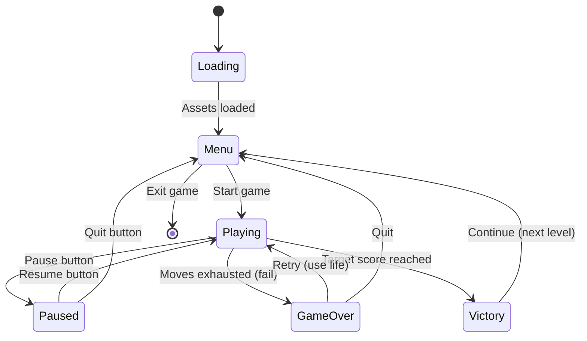

# /speckit.games.mechanics

**Transform game concepts into detailed, executable mechanics specifications**

## Overview

The `/speckit.games.mechanics` command generates comprehensive gameplay mechanics specifications from high-level game concepts. It decomposes core loops, specifies physics parameters, defines control schemes, catalogs edge cases, and designs balancing formulas—transforming conceptual ideas into implementation-ready specifications.

**What it does:**
- Breaks 60-second core loop into atomic actions
- Specifies physics parameters (gravity, friction, bounce, collision)
- Designs platform-specific control schemes (mobile, desktop, console, web)
- Catalogs 20-32 edge cases with expected behaviors
- Creates balancing formulas for difficulty scaling and progression

**What it doesn't do:**
- Implement game code (use `/speckit.implement` for that)
- Validate game balance (use `/speckit.balance` for that)
- Generate full Game Design Document (use `/speckit.gdd` for that)

## When to Use

| Use Case | When | Why |
|----------|------|-----|
| **Post-Concept** | After `/speckit.games.concept` | Turn high-level concept into detailed mechanics |
| **Pre-Implementation** | Before `/speckit.implement` | Create implementation-ready specs for developers |
| **Pre-Balancing** | Before `/speckit.balance` | Define formulas that need balance validation |
| **GDD Section** | Before `/speckit.gdd` | Generate detailed mechanics for full GDD |

**Typical workflow:**
```
/speckit.games.concept (high-level idea)
  ↓
/speckit.games.mechanics (detailed mechanics spec) ← YOU ARE HERE
  ↓
/speckit.balance (validate balance)
  ↓
/speckit.gdd (full game design document)
  ↓
/speckit.implement (code implementation)
```

## Usage Examples

### Basic Usage (Standard Depth)

```bash
/speckit.games.mechanics
```

**What happens:**
- Analyzes `specs/games/concept.md` (or latest concept file)
- Runs 10 agents (Context → Core Loop → Physics/Controls → Edge Cases → Balance → Generation)
- Generates 3 files: `mechanics.md`, `mechanics-examples.md`, `edge-cases.md`
- Takes ~45 minutes
- Costs ~$1.40 (opus/sonnet mix)

**Output:**
- `specs/games/mechanics.md` (10-15 pages) — Master mechanics specification
- `specs/games/mechanics-examples.md` (5-8 pages) — Code snippets (Unity, Unreal, Godot)
- `specs/games/edge-cases.md` (4-6 pages) — Edge case catalog (20-32 edge cases)

### Genre-Specific Mechanics

```bash
/speckit.games.mechanics --genre match3 --platform mobile
```

**What this does:**
- Loads `templates/shared/game-genres/match3-template.md` for genre patterns
- Optimizes for mobile platform (touch controls, portrait orientation, haptics)
- Generates match-3 specific mechanics:
  - Swap mechanics (adjacent pieces, drag-and-drop, tap-to-swap)
  - Cascade mechanics (falling pieces, chain reactions, gravity)
  - Power-ups (rocket from 4-match, bomb from 5-match, rainbow from T/L-match)
  - Board objectives (clear X pieces, reach Y score, collect Z items)

**Genre templates available:**
- `match3` — Match-3 puzzle (Candy Crush, Homescapes)
- `sorting` — Sorting puzzle (Water Sort, Ball Sort)
- `idle` — Idle/incremental (Adventure Capitalist, Idle Miner)
- `arcade` — Arcade (Crossy Road, Flappy Bird)
- `puzzle` — Logic puzzle (Monument Valley, The Room)
- `runner` — Endless runner (Subway Surfers, Temple Run)
- `shooter` — Shooter (Space Invaders, Geometry Wars)
- `platformer` — Platformer (Super Mario, Celeste)

### Platform-Specific Controls

```bash
/speckit.games.mechanics --platform desktop
```

**Control schemes by platform:**

| Platform | Primary Input | Secondary Input | Orientation |
|----------|---------------|-----------------|-------------|
| `mobile` | Touch (tap, drag, swipe) | Tilt (accelerometer) | Portrait/Landscape |
| `desktop` | Mouse + Keyboard | Gamepad (optional) | Landscape |
| `console` | Gamepad | Keyboard (menu navigation) | Landscape (TV) |
| `web` | Mouse + Keyboard | Touch (responsive) | Responsive |

**Example: Mobile touch targets**
```markdown
## Touch Targets (Mobile)

| Action | Target Size | Position | Gesture |
|--------|-------------|----------|---------|
| Tap piece | 64x64pt | Grid cell | Single tap |
| Swap pieces | 128x128pt | Drag between cells | Drag 64pt+ |
| Activate booster | 80x80pt | Bottom toolbar | Long press 500ms |
| Pause game | 44x44pt | Top-right corner | Single tap |

**iOS Human Interface Guidelines**: Minimum 44x44pt touch targets
**Android Material Design**: Minimum 48x48dp touch targets
```

### Physics Engine Integration

```bash
/speckit.games.mechanics --physics-engine unity
```

**Generates code examples for:**
- Unity (C# with Unity Physics 2D/3D)
- Unreal (C++ with Chaos Physics)
- Godot (GDScript with Godot Physics)
- Custom (pseudo-code for custom engines)

**Example: Unity C# physics parameters**
```csharp
// Unity Physics 2D - Match-3 Falling Pieces
[Header("Physics Parameters")]
public float gravity = 20f;           // Gravity scale (default: 1.0, increased for faster fall)
public float bounceCoefficient = 0.3f; // Bounciness (0=no bounce, 1=perfect bounce)
public float friction = 0.4f;         // Friction (0=ice, 1=rubber)
public float mass = 1.0f;             // Mass in kg

void Awake() {
    Rigidbody2D rb = GetComponent<Rigidbody2D>();
    rb.gravityScale = gravity;
    rb.mass = mass;

    PhysicsMaterial2D material = new PhysicsMaterial2D();
    material.bounciness = bounceCoefficient;
    material.friction = friction;
    rb.sharedMaterial = material;
}
```

### Depth Levels

#### Quick Depth (30 min, 5 agents, ~$0.40)

```bash
/speckit.games.mechanics --depth quick
```

**Best for:**
- Rapid prototyping
- Early concept validation
- Budget-constrained projects

**Output:**
- `mechanics.md` (5-7 pages) — Core loop + basic physics
- No code examples
- No edge case catalog

**Quality gates:**
- QG-MECHANICS-001 only (Core Loop Completeness)

#### Standard Depth (45 min, 10 agents, ~$1.40) — DEFAULT

```bash
/speckit.games.mechanics --depth standard
```

**Best for:**
- Production-ready games
- Complete implementation specs
- Balanced cost/quality

**Output:**
- `mechanics.md` (10-15 pages) — Complete spec
- `mechanics-examples.md` (5-8 pages) — Code snippets
- `edge-cases.md` (4-6 pages) — 20-32 edge cases

**Quality gates:**
- All 4 gates (QG-MECHANICS-001 through 004)

#### Detailed Depth (60 min, 15 agents, ~$3.00)

```bash
/speckit.games.mechanics --depth detailed
```

**Best for:**
- AAA/premium games
- Complex physics systems
- Multiplayer synchronization

**Output:**
- `mechanics.md` (15-20 pages) — World-class spec
- `mechanics-examples.md` (8-12 pages) — Multi-engine code
- `edge-cases.md` (6-10 pages) — 32+ edge cases
- `physics-tuning.md` (4-6 pages) — Physics parameter tuning guide
- `fsm-diagrams.md` (3-5 pages) — State machine diagrams (Mermaid)

**Additional agents:**
- Physics tuning specialist (fine-tune parameters)
- FSM diagram generator (visualize state machines)
- Platform integration expert (console-specific mechanics)

## Workflow Phases (10 Agents, 6 Phases)

### Phase 0: Context Analysis (1 agent, 2-3 min)

**Purpose:** Extract mechanics requirements from concept file

**Agent:** Context Analyzer (opus, 16K thinking budget)

**Input:**
- Game concept file (`specs/games/concept.md`)
- Genre template (if `--genre` specified)

**Output:**
```json
{
  "core_loop": "60-sec loop description",
  "genre": "match3",
  "platform": "mobile",
  "physics_hints": ["falling pieces", "gravity", "cascades"],
  "constraints": ["portrait orientation", "one-handed play", "60 FPS"]
}
```

**Example analysis:**
> **Core Loop:** Player swaps adjacent pieces to match 3+ of the same color. Matches explode, pieces above fall to fill gaps (gravity), creating cascades. Player has 20 moves per level to reach target score (500 points). Level complete → claim stars (1-3 based on score) → unlock next level.
>
> **Genre:** Match-3 puzzle (Candy Crush pattern)
> **Platform:** Mobile (iOS/Android), portrait orientation, touch controls
> **Physics:** Gravity (pieces fall at 800 units/sec), bounce (0.2 coefficient), collision (AABB boxes)
> **Constraints:** One-handed play, 60 FPS on iPhone 12, <300MB memory

### Phase 1: Core Loop Decomposition (3 agents, 8-10 min)

**Purpose:** Break 60-sec core loop into 4 phases (Action, Reward, Progression, Engagement)

**Agents:**
1. **Action Phase Specialist** (opus, 32K) — Player input, controls, gestures
2. **Reward Phase Specialist** (opus, 32K) — Immediate feedback, VFX, SFX, haptics
3. **Progression + Engagement Specialist** (opus, 32K) — Long-term goals, retention hooks

**Framework:** 4-Phase Core Loop (MDA-inspired)

```
┌─────────────────────────────────────────────────────────┐
│ CORE LOOP (60 seconds)                                  │
├─────────────────────────────────────────────────────────┤
│                                                          │
│  1. ACTION (Player Input)                               │
│     ↓ Player swaps pieces (touch drag)                  │
│     ↓ Match 3+ pieces detected (collision check)        │
│     ↓ Pieces explode (VFX trigger)                      │
│                                                          │
│  2. REWARD (Immediate Feedback)                         │
│     ↓ +50 points per piece (score animation)            │
│     ↓ Explosion VFX (particles, shake)                  │
│     ↓ Satisfying SFX ("pop" sound)                      │
│     ↓ Haptic feedback (light impact)                    │
│                                                          │
│  3. PROGRESSION (Long-term Goals)                       │
│     ↓ Score → 500/500 (progress bar fills)              │
│     ↓ Level complete (3 stars earned)                   │
│     ↓ Next level unlocked (map progression)             │
│                                                          │
│  4. ENGAGEMENT (Retention Hooks)                        │
│     ↓ Lives system (4/5 remaining)                      │
│     ↓ Daily challenge banner (bonus level)              │
│     ↓ Friend leaderboard (you're #3!)                   │
│     ↓ Next session hook ("Come back in 2 hours!")       │
│                                                          │
└─────────────────────────────────────────────────────────┘
```

**Agent 1: Action Phase (Primary Mechanic)**

Specifies:
- Primary action (swap pieces)
- Input method (touch drag, mouse drag, keyboard arrows)
- Validation rules (adjacent only, no diagonal swaps)
- Animation timing (200ms swap animation)
- Match detection (3+ same color in row/column)

**Example output:**
```markdown
## Action Phase: Swapping & Matching

### Primary Action: Swap Adjacent Pieces

**Input Methods:**
- **Mobile (touch):** Drag piece to adjacent cell (up/down/left/right)
- **Desktop (mouse):** Click piece, then click adjacent cell
- **Desktop (keyboard):** Arrow keys to move cursor, Space to select, arrows to swap

### Swap Validation

1. **Check adjacency** (Manhattan distance = 1)
2. **Check if swap creates match** (3+ in row/column)
3. **If no match:** Swap back with "bounce" animation (200ms)
4. **If match:** Proceed to explosion phase

### Match Detection Algorithm

```csharp
// Pseudo-code
bool IsMatch(Piece[,] grid, int x, int y) {
    int horizontalCount = 1;
    int verticalCount = 1;

    // Count left
    for (int i = x - 1; i >= 0 && grid[i, y].color == grid[x, y].color; i--) {
        horizontalCount++;
    }
    // Count right
    for (int i = x + 1; i < gridWidth && grid[i, y].color == grid[x, y].color; i++) {
        horizontalCount++;
    }

    // Count up
    for (int j = y - 1; j >= 0 && grid[x, j].color == grid[x, y].color; j--) {
        verticalCount++;
    }
    // Count down
    for (int j = y + 1; j < gridHeight && grid[x, j].color == grid[x, y].color; j++) {
        verticalCount++;
    }

    return (horizontalCount >= 3 || verticalCount >= 3);
}
```

**Timing:**
- Swap animation: 200ms (ease-in-out)
- Match detection: <16ms (must not block frame)
- Explosion start: +50ms after swap completes
```

**Agent 2: Reward Phase (Immediate Feedback)**

Specifies:
- Visual effects (particles, screen shake, color flash)
- Sound effects (match sound, explosion sound, combo sound)
- Haptic feedback (iOS UIImpactFeedbackGenerator, Android VibrationEffect)
- Score animation (number counter, progress bar)

**Example output:**
```markdown
## Reward Phase: Immediate Feedback

### Visual Effects (VFX)

**Match Explosion:**
- **Particle system:** 20-30 particles per piece
- **Particle lifetime:** 0.5-0.8 seconds
- **Particle velocity:** Radial (outward from center)
- **Color:** Match piece color (with white glow)

**Screen Shake:**
- **Intensity:** 0.1-0.3 units (based on match size)
- **Duration:** 100-200ms
- **Frequency:** 20 Hz (subtle vibration)

### Sound Effects (SFX)

| Event | Sound | Volume | Pitch Variation |
|-------|-------|--------|-----------------|
| Match 3 | "pop.wav" | 0.7 | ±10% |
| Match 4 | "boom.wav" | 0.8 | ±5% |
| Match 5+ | "explosion.wav" | 1.0 | None |
| Cascade | "cascade.wav" | 0.6 | +5% per cascade |
| Level complete | "victory.wav" | 1.0 | None |

### Haptic Feedback

**iOS (UIKit):**
```swift
let generator = UIImpactFeedbackGenerator(style: .light)
generator.impactOccurred()
```

**Android (VibrationEffect):**
```kotlin
val vibrator = getSystemService(Context.VIBRATOR_SERVICE) as Vibrator
if (Build.VERSION.SDK_INT >= Build.VERSION_CODES.O) {
    vibrator.vibrate(VibrationEffect.createOneShot(50, VibrationEffect.DEFAULT_AMPLITUDE))
}
```

**Timing:**
- Match 3: Light haptic (50ms)
- Match 4: Medium haptic (100ms)
- Match 5+: Heavy haptic (150ms)
```

**Agent 3: Progression + Engagement (Long-term Hooks)**

Specifies:
- Progression systems (levels, stars, unlocks)
- Engagement hooks (lives, daily challenges, leaderboards)
- Retention mechanics (comeback timers, streak bonuses)

**Example output:**
```markdown
## Progression Phase: Long-term Goals

### Level Progression

**Star System:**
- **1 star:** Reach 40% of target score
- **2 stars:** Reach 70% of target score
- **3 stars:** Reach 100% of target score

**Level Unlocking:**
- Linear progression (level N → level N+1)
- "Hard levels" every 15 levels (25% higher target score)
- Boss levels every 50 levels (special mechanics, double rewards)

### Score Calculation

```csharp
int CalculateScore(int matchSize, int cascadeDepth, int comboCount) {
    int baseScore = matchSize * 50;           // 3-match = 150, 4-match = 200, 5-match = 250
    int cascadeBonus = cascadeDepth * 100;    // +100 per cascade level
    int comboMultiplier = 1 + (comboCount * 0.5); // 1x, 1.5x, 2x, 2.5x, ...

    return (int)((baseScore + cascadeBonus) * comboMultiplier);
}
```

## Engagement Phase: Retention Hooks

### Lives System

**Mechanics:**
- Max lives: 5
- Regen rate: 1 life per 30 minutes
- Fail level: -1 life
- Lives gifting: Request from friends (1 per day)

**UI:**
- Lives counter: Top-left corner (heart icons)
- Empty state: "Out of lives! Wait 2:30:00 or request from friends"
- Regen timer: "Next life in 15:30"

### Daily Challenges

**Mechanics:**
- 1 special level per day
- Bonus rewards (2x coins, rare booster)
- Challenge resets at midnight UTC
- Streak bonus (7-day streak = legendary booster)

### Friend Leaderboard

**Mechanics:**
- Top 10 friends by total score
- Updates every 10 minutes (cached)
- "You're #3! Beat Sarah to reach #2!"
- Challenge friend button (send push notification)
```

### Phase 2: Physics & Controls Design (3 agents, 10-12 min)

**Purpose:** Specify physics parameters, control schemes, and game states (FSM)

**Agents:**
1. **Physics Parameters Specialist** (opus, 40K) — Gravity, friction, bounce, collision
2. **Controls Specialist** (opus, 40K) — Input mapping, touch targets, gestures
3. **Game States (FSM) Specialist** (opus, 40K) — State transitions, persistence, save/load

**Agent 1: Physics Parameters**

Specifies numeric values for:
- Gravity (units/sec², direction)
- Friction (0.0-1.0, material properties)
- Bounce coefficient (0.0-1.0, restitution)
- Collision detection (AABB, circle, polygon, continuous)
- Terminal velocity (max fall speed)

**Example output:**
```markdown
## Physics Parameters

### Gravity

**Falling Pieces (Match-3):**
- Gravity: 980 units/sec² (1g, Earth gravity)
- Direction: Down (-Y axis)
- Terminal velocity: 1200 units/sec (prevents infinite acceleration)

**Why 980 units/sec²?**
- Pieces fall ~8 cells per second
- Visually satisfying (not too slow, not too fast)
- Allows player to track falling pieces
- Cascades feel responsive

### Friction

**Piece-to-Piece Contact:**
- Static friction: 0.6 (prevents pieces from sliding)
- Dynamic friction: 0.4 (allows slight sliding during cascades)

**Why 0.4-0.6?**
- Pieces stack naturally without sliding
- No "slippery" feeling (0.1 friction feels like ice)
- No "sticky" feeling (0.9 friction prevents natural motion)

### Bounce Coefficient (Restitution)

**Piece-to-Wall:**
- Bounce: 0.2 (slight bounce, feels natural)

**Why 0.2?**
- 0.0 = No bounce (feels "dead")
- 1.0 = Perfect bounce (feels unrealistic)
- 0.2 = Slight bounce (feels satisfying, natural)

### Collision Detection

**Algorithm:** AABB (Axis-Aligned Bounding Box)

**Why AABB?**
- Fast (O(1) per collision check)
- Sufficient for grid-based games
- No need for complex polygon collision

**Collision Layers:**
- Layer 0: Grid (static, no physics)
- Layer 1: Pieces (dynamic, physics enabled)
- Layer 2: Power-ups (trigger collisions only)

```csharp
// Unity C# - AABB Collision
bool IsColliding(Collider2D a, Collider2D b) {
    return a.bounds.Intersects(b.bounds);
}
```

### Physics Tuning Guide

**Problem:** Pieces fall too fast (hard to track)
- **Solution:** Reduce gravity (980 → 700 units/sec²)

**Problem:** Pieces bounce too much (feels chaotic)
- **Solution:** Reduce bounce coefficient (0.2 → 0.1)

**Problem:** Pieces slide after landing (feels slippery)
- **Solution:** Increase friction (0.4 → 0.6)

**Problem:** Collision detection misses fast-moving pieces
- **Solution:** Enable continuous collision detection (Unity: `rb.collisionDetectionMode = CollisionDetectionMode2D.Continuous`)
```

**Agent 2: Controls Specialist**

Specifies platform-specific controls:
- Mobile: Touch targets, gestures (tap, drag, swipe, pinch, long press)
- Desktop: Keyboard bindings, mouse interactions
- Console: Gamepad button mapping
- Web: Responsive controls (touch + mouse/keyboard)

**Example output:**
```markdown
## Controls Specification

### Mobile (Touch)

#### Touch Targets

| Action | Min Size | Recommended Size | Position |
|--------|----------|------------------|----------|
| Tap piece | 44x44pt (iOS) | 64x64pt | Grid cell |
| Drag piece | 44x44pt | 64x64pt | Grid cell |
| Long press booster | 44x44pt | 80x80pt | Bottom toolbar |
| Pause button | 44x44pt | 44x44pt | Top-right corner |
| Settings button | 44x44pt | 44x44pt | Top-left corner |

**References:**
- [iOS Human Interface Guidelines](https://developer.apple.com/design/human-interface-guidelines/inputs/touchscreen-gestures/)
- [Android Material Design](https://m3.material.io/foundations/interaction/gestures)

#### Gestures

**Tap (Single Touch):**
- **Action:** Select piece
- **Implementation:** `UITapGestureRecognizer` (iOS), `GestureDetector.onTap` (Flutter)
- **Timing:** < 300ms (Apple guideline)

**Drag (Pan Gesture):**
- **Action:** Swap piece to adjacent cell
- **Min distance:** 64pt (prevents accidental swaps)
- **Implementation:** `UIPanGestureRecognizer` (iOS), `GestureDetector.onPanUpdate` (Flutter)

```swift
// iOS UIKit - Drag Gesture
@objc func handlePan(_ gesture: UIPanGestureRecognizer) {
    let translation = gesture.translation(in: view)
    let distance = sqrt(translation.x * translation.x + translation.y * translation.y)

    if distance > 64 {
        // Determine direction
        if abs(translation.x) > abs(translation.y) {
            swapDirection = (translation.x > 0) ? .right : .left
        } else {
            swapDirection = (translation.y > 0) ? .down : .up
        }
        performSwap()
    }
}
```

**Long Press:**
- **Action:** Activate booster
- **Min duration:** 500ms (Apple guideline)
- **Feedback:** Haptic feedback at 250ms (preview), vibration at 500ms (activation)

```swift
// iOS UIKit - Long Press
@objc func handleLongPress(_ gesture: UILongPressGestureRecognizer) {
    if gesture.state == .began {
        // Preview booster effect
        showBoosterPreview()
        UIImpactFeedbackGenerator(style: .medium).impactOccurred()
    } else if gesture.state == .ended {
        // Activate booster
        activateBooster()
        UIImpactFeedbackGenerator(style: .heavy).impactOccurred()
    }
}
```

### Desktop (Mouse + Keyboard)

#### Mouse Controls

| Action | Input | Notes |
|--------|-------|-------|
| Select piece | Left click | Cursor changes to "pointer" on hover |
| Swap piece | Click piece, then click adjacent cell | Two-click swap |
| Drag swap (alternative) | Click + drag to adjacent cell | One-motion swap |
| Activate booster | Right click (or long click) | Context menu alternative |
| Pan view | Middle mouse drag | For larger grids |

#### Keyboard Controls

| Action | Key Binding | Alternative |
|--------|-------------|-------------|
| Move cursor | Arrow keys | WASD |
| Select piece | Space | Enter |
| Swap piece | Arrow keys (after select) | WASD (after select) |
| Undo move | Ctrl+Z (or Cmd+Z on Mac) | Backspace |
| Activate booster | Number keys (1-5) | F1-F5 |
| Pause | Esc | P |
| Settings | Tab | S |

**Why Arrow keys + Space?**
- Accessible (one hand on keyboard)
- Common pattern (many puzzle games use this)
- No accidental presses (unlike WASD near other keys)

### Console (Gamepad)

#### Button Mapping (Xbox/PlayStation)

| Action | Xbox | PlayStation | Notes |
|--------|------|-------------|-------|
| Move cursor | Left stick | Left stick | D-pad alternative |
| Select piece | A | X (Cross) | Confirm |
| Cancel selection | B | O (Circle) | Back |
| Swap piece | Left stick direction | Left stick direction | After select |
| Activate booster | Bumpers (LB/RB) | L1/R1 | Cycle through boosters |
| Confirm booster | A | X | Use booster |
| Pause | Start | Options | Menu |
| Settings | View (Back) | Share (Touchpad) | Settings menu |

**Why Left stick > D-pad?**
- More ergonomic (thumb rests naturally on stick)
- Faster diagonal movement
- D-pad available as alternative for precision

### Web (Responsive)

**Desktop mode (mouse + keyboard):**
- Use desktop controls (see above)

**Mobile mode (touch):**
- Use mobile controls (see above)
- Detect touch support: `'ontouchstart' in window`

```javascript
// JavaScript - Responsive Control Detection
const isTouchDevice = ('ontouchstart' in window) || (navigator.maxTouchPoints > 0);

if (isTouchDevice) {
    // Use touch controls
    element.addEventListener('touchstart', handleTouchStart);
    element.addEventListener('touchmove', handleTouchMove);
    element.addEventListener('touchend', handleTouchEnd);
} else {
    // Use mouse controls
    element.addEventListener('mousedown', handleMouseDown);
    element.addEventListener('mousemove', handleMouseMove);
    element.addEventListener('mouseup', handleMouseUp);
}
```
```

**Agent 3: Game States (FSM)**

Specifies finite state machine:
- States (Menu, Playing, Paused, GameOver, Victory, Loading)
- Transitions (conditions for state changes)
- State persistence (save/load progress)
- Invalid transitions (error handling)

**Example output:**
```markdown
## Game States (Finite State Machine)

### State Diagram



### State Definitions

#### State: Loading

**Purpose:** Load game assets (sprites, sounds, config)

**Entry Actions:**
- Show loading screen
- Load assets asynchronously
- Initialize game systems (physics, audio, input)

**Exit Conditions:**
- All assets loaded (100% progress)
- OR Timeout (30 seconds) → show error

**Persist:** No

#### State: Menu

**Purpose:** Main menu (play, settings, store, leaderboard)

**Entry Actions:**
- Show main menu UI
- Check for daily rewards
- Fetch leaderboard (async)

**Exit Conditions:**
- Play button → Playing
- Settings button → Settings (sub-state)
- Exit button → Exit game

**Persist:** No

#### State: Playing

**Purpose:** Active gameplay (player can make moves)

**Entry Actions:**
- Load level data (grid, target score, moves)
- Start timer (if timed mode)
- Enable input

**Exit Conditions:**
- Pause button → Paused
- Moves = 0 AND score < target → GameOver
- Score >= target → Victory

**Persist:** Yes (auto-save every 5 moves)

**Sub-states:**
- Idle (waiting for player input)
- Animating (pieces falling, matches exploding)
- Blocked (waiting for animation to complete)

#### State: Paused

**Purpose:** Game paused (player can resume or quit)

**Entry Actions:**
- Freeze game time
- Disable input
- Show pause menu

**Exit Conditions:**
- Resume button → Playing
- Restart button → Playing (reload level)
- Quit button → Menu

**Persist:** Yes (auto-save before pause)

#### State: GameOver

**Purpose:** Level failed (moves exhausted, target not reached)

**Entry Actions:**
- Show game over screen
- Show final score
- Show "Retry" button (if lives > 0) or "Get lives" button (if lives = 0)

**Exit Conditions:**
- Retry button → Playing (reload level, consume 1 life)
- Get lives button → Store (IAP flow)
- Quit button → Menu

**Persist:** Yes (mark level as failed, update stats)

#### State: Victory

**Purpose:** Level completed (target score reached)

**Entry Actions:**
- Show victory screen
- Calculate stars (1-3 based on score)
- Update level progress (unlock next level)
- Grant rewards (coins, boosters)

**Exit Conditions:**
- Continue button → Menu (show next level)
- Next level button → Playing (load next level)

**Persist:** Yes (save level progress, stars, rewards)

### State Persistence (Save/Load)

**Save Format (JSON):**
```json
{
  "version": "1.0",
  "player": {
    "lives": 4,
    "coins": 1250,
    "level": 42,
    "stars_total": 98
  },
  "current_game": {
    "level": 42,
    "moves_remaining": 15,
    "score": 350,
    "grid": [[0, 1, 2, 3, 0], [1, 2, 3, 0, 1], ...],
    "boosters_used": [false, false, true, false, false]
  }
}
```

**Save Triggers:**
- Every 5 moves (auto-save during gameplay)
- Level complete (victory/game over)
- Pause button (before entering Paused state)
- App backgrounded (iOS `applicationDidEnterBackground`, Android `onPause`)

**Load Triggers:**
- App launch (restore progress)
- Resume button (restore paused game)

**Storage:**
- **iOS:** `UserDefaults` (for small data), `FileManager` (for large data)
- **Android:** `SharedPreferences` (for small data), `File` storage (for large data)
- **Unity:** `PlayerPrefs` (for small data), `Application.persistentDataPath` + `File.WriteAllText` (for large data)

### Invalid State Transitions (Error Handling)

**Forbidden Transitions:**
- `Playing → Menu` (must go through Paused first, to allow save)
- `Loading → Playing` (must go through Menu first)
- `Victory → GameOver` (cannot fail after winning)
- `GameOver → Victory` (cannot win after failing)

**Handling:**
```csharp
public enum GameState { Loading, Menu, Playing, Paused, GameOver, Victory }

public class GameStateMachine {
    private GameState currentState;

    public void TransitionTo(GameState newState) {
        // Validate transition
        if (!IsValidTransition(currentState, newState)) {
            Debug.LogError($"Invalid transition: {currentState} → {newState}");
            return;
        }

        // Exit current state
        OnStateExit(currentState);

        // Transition
        currentState = newState;

        // Enter new state
        OnStateEnter(newState);
    }

    private bool IsValidTransition(GameState from, GameState to) {
        // Define valid transitions
        var validTransitions = new Dictionary<GameState, List<GameState>> {
            { GameState.Loading, new List<GameState> { GameState.Menu } },
            { GameState.Menu, new List<GameState> { GameState.Playing } },
            { GameState.Playing, new List<GameState> { GameState.Paused, GameState.GameOver, GameState.Victory } },
            { GameState.Paused, new List<GameState> { GameState.Playing, GameState.Menu } },
            { GameState.GameOver, new List<GameState> { GameState.Playing, GameState.Menu } },
            { GameState.Victory, new List<GameState> { GameState.Playing, GameState.Menu } }
        };

        return validTransitions[from].Contains(to);
    }
}
```
```

### Phase 3: Edge Case Analysis (2 agents, 6-8 min)

**Purpose:** Catalog edge cases with expected behaviors (20-32 edge cases)

**Agents:**
1. **Numeric Edge Cases** (sonnet, 32K) — Overflow, underflow, division by zero, simultaneous events
2. **State Edge Cases** (sonnet, 32K) — Invalid transitions, container overflow, off-screen objects

**Edge Case Taxonomy (4 Categories):**
- **EC-MECH-NUM:** Numeric edge cases (overflow, underflow, division by zero)
- **EC-MECH-STATE:** State edge cases (invalid transitions, race conditions)
- **EC-MECH-INPUT:** Input edge cases (multi-touch, input spam, conflicting inputs)
- **EC-MECH-PROG:** Progression edge cases (negative score, max level reached, save corruption)

**Agent 1: Numeric Edge Cases**

**Example output:**
```markdown
## Edge Cases: Numeric (EC-MECH-NUM)

### EC-MECH-NUM-001: Score Overflow

**Scenario:** Player reaches max integer score (2,147,483,647 on 32-bit systems)

**Expected Behavior:**
- Cap score at `Int32.MaxValue`
- Continue gameplay (no crash)
- Display score as "2,147,483,647+" (indicate cap)

**Test Case:**
```csharp
[Test]
public void Score_ShouldCapAtMaxInt() {
    Game game = new Game();
    game.score = int.MaxValue - 100;
    game.AddScore(200); // Should cap at MaxValue

    Assert.AreEqual(int.MaxValue, game.score);
}
```

**Implementation:**
```csharp
public void AddScore(int points) {
    if (score > int.MaxValue - points) {
        score = int.MaxValue; // Cap at max
    } else {
        score += points;
    }
}
```

### EC-MECH-NUM-002: Division by Zero (Combo Multiplier)

**Scenario:** Player has 0 combos, formula tries to divide by comboCount

**Expected Behavior:**
- Treat 0 combos as 1x multiplier
- No crash, no NaN/Infinity

**Bad Formula:**
```csharp
float multiplier = totalScore / comboCount; // CRASH if comboCount = 0
```

**Good Formula:**
```csharp
float multiplier = (comboCount > 0) ? (1 + comboCount * 0.5f) : 1.0f;
```

### EC-MECH-NUM-003: Simultaneous Matches (Race Condition)

**Scenario:** Player creates 2 matches at the exact same frame (e.g., 4-match creates rocket that explodes adjacent pieces, creating another match)

**Expected Behavior:**
- Process matches sequentially (FIFO queue)
- Award score for both matches
- No double-explosion (pieces explode once)

**Implementation:**
```csharp
Queue<Match> matchQueue = new Queue<Match>();

void ProcessMatches() {
    while (matchQueue.Count > 0) {
        Match match = matchQueue.Dequeue();
        ExplodePieces(match.pieces);
        AddScore(match.score);

        // Check for new matches caused by explosions
        List<Match> newMatches = DetectNewMatches();
        foreach (Match newMatch in newMatches) {
            matchQueue.Enqueue(newMatch);
        }
    }
}
```

### EC-MECH-NUM-004: Negative Lives (Cheat Detection)

**Scenario:** Player exploits bug to get negative lives (-1, -2, etc.)

**Expected Behavior:**
- Clamp lives to 0 minimum
- Log cheat detection event (for anti-cheat system)

**Implementation:**
```csharp
public void SetLives(int newLives) {
    if (newLives < 0) {
        Debug.LogWarning($"Cheat detected: Attempted to set lives to {newLives}");
        Analytics.TrackEvent("cheat_detected", new { player_id = playerId, lives = newLives });
        lives = 0;
    } else {
        lives = Mathf.Min(newLives, maxLives); // Cap at max (5 lives)
    }
}
```

### EC-MECH-NUM-005: Float Precision (Physics Calculations)

**Scenario:** After 10,000 frames, floating-point errors accumulate (e.g., position = 100.00001 instead of 100.0)

**Expected Behavior:**
- Use `Mathf.Approximately()` for float comparisons
- Snap to grid after animations complete

**Bad Code:**
```csharp
if (piece.position.y == targetPosition.y) { // FAILS due to float precision
    OnReachedTarget();
}
```

**Good Code:**
```csharp
if (Mathf.Abs(piece.position.y - targetPosition.y) < 0.01f) { // Tolerance-based comparison
    piece.position.y = targetPosition.y; // Snap to exact position
    OnReachedTarget();
}
```

### EC-MECH-NUM-006: Cascade Depth Overflow

**Scenario:** Infinite cascade loop (pieces keep falling forever due to bug)

**Expected Behavior:**
- Cap cascade depth at 20 (reasonable max for match-3)
- Log warning if cap reached
- Force-stop cascade

**Implementation:**
```csharp
const int MAX_CASCADE_DEPTH = 20;
int cascadeDepth = 0;

void ProcessCascade() {
    while (HasFallingPieces() && cascadeDepth < MAX_CASCADE_DEPTH) {
        ApplyGravity();
        DetectMatches();
        cascadeDepth++;
    }

    if (cascadeDepth >= MAX_CASCADE_DEPTH) {
        Debug.LogWarning("Max cascade depth reached! Possible infinite loop.");
        ForceStopCascade();
    }
}
```

### EC-MECH-NUM-007: Time Delta Spike (Frame Rate Drop)

**Scenario:** Game drops to 5 FPS (deltaTime = 0.2 seconds instead of 0.016 seconds), physics simulation breaks

**Expected Behavior:**
- Cap deltaTime at 0.05 seconds (20 FPS min)
- Use fixed timestep for physics

**Implementation:**
```csharp
void Update() {
    float deltaTime = Mathf.Min(Time.deltaTime, 0.05f); // Cap at 0.05s (20 FPS)
    UpdatePhysics(deltaTime);
}
```

### EC-MECH-NUM-008: Large Number Display (Score > 1 Million)

**Scenario:** Player reaches 1,234,567 score, UI displays "1234567" (hard to read)

**Expected Behavior:**
- Format large numbers with abbreviations (1.2M, 1.2B, etc.)
- Show full number on hover/long press

**Implementation:**
```csharp
string FormatScore(int score) {
    if (score >= 1_000_000_000) {
        return $"{score / 1_000_000_000.0:F1}B"; // 1.2B
    } else if (score >= 1_000_000) {
        return $"{score / 1_000_000.0:F1}M"; // 1.2M
    } else if (score >= 1_000) {
        return $"{score / 1_000.0:F1}K"; // 1.2K
    } else {
        return score.ToString(); // 123
    }
}
```
```

**Agent 2: State Edge Cases**

**Example output:**
```markdown
## Edge Cases: State Transitions (EC-MECH-STATE)

### EC-MECH-STATE-001: App Backgrounded During Gameplay

**Scenario:** Player swaps pieces, then immediately backgrounds app (iOS home button, Android back button)

**Expected Behavior:**
- Save game state before app suspends
- Restore state when app resumes
- If animation was in progress, fast-forward to completion

**iOS Implementation:**
```swift
// AppDelegate.swift
func applicationDidEnterBackground(_ application: UIApplication) {
    GameManager.shared.saveGameState()
    GameManager.shared.completeAllAnimations() // Fast-forward animations
}

func applicationWillEnterForeground(_ application: UIApplication) {
    GameManager.shared.restoreGameState()
}
```

### EC-MECH-STATE-002: Network Disconnection (Leaderboard Sync)

**Scenario:** Player completes level while offline, leaderboard fails to sync

**Expected Behavior:**
- Store score locally (queue for sync)
- Show "Leaderboard unavailable" message
- Retry sync when network returns

**Implementation:**
```csharp
Queue<ScoreUpdate> pendingUpdates = new Queue<ScoreUpdate>();

void SubmitScore(int score, int level) {
    if (IsOnline()) {
        Leaderboard.Submit(score, level);
    } else {
        pendingUpdates.Enqueue(new ScoreUpdate(score, level));
        ShowToast("Leaderboard unavailable. Score saved locally.");
    }
}

void OnNetworkReconnect() {
    while (pendingUpdates.Count > 0) {
        ScoreUpdate update = pendingUpdates.Dequeue();
        Leaderboard.Submit(update.score, update.level);
    }
}
```

### EC-MECH-STATE-003: Rapid State Changes (Pause Spam)

**Scenario:** Player spams pause button (5 clicks in 1 second)

**Expected Behavior:**
- Debounce input (ignore clicks within 300ms of previous click)
- Only process first click, ignore rest

**Implementation:**
```csharp
float lastPauseTime = 0f;
const float PAUSE_DEBOUNCE = 0.3f; // 300ms

void OnPauseButtonClick() {
    float currentTime = Time.time;
    if (currentTime - lastPauseTime < PAUSE_DEBOUNCE) {
        return; // Ignore click (too soon)
    }

    lastPauseTime = currentTime;
    TogglePause();
}
```

### EC-MECH-STATE-004: Save Corruption (Invalid JSON)

**Scenario:** Player's save file is corrupted (invalid JSON, missing fields)

**Expected Behavior:**
- Detect corruption on load
- Reset to default save (Level 1, 5 lives)
- Log corruption event (for analytics)

**Implementation:**
```csharp
SaveData LoadSaveFile() {
    try {
        string json = File.ReadAllText(saveFilePath);
        SaveData data = JsonUtility.FromJson<SaveData>(json);

        // Validate required fields
        if (data.player == null || data.player.level < 1) {
            throw new Exception("Invalid save data");
        }

        return data;
    } catch (Exception e) {
        Debug.LogWarning($"Save file corrupted: {e.Message}. Resetting to default.");
        Analytics.TrackEvent("save_corruption", new { error = e.Message });
        return GetDefaultSaveData();
    }
}
```

### EC-MECH-STATE-005: Container Overflow (Grid Full)

**Scenario:** All grid cells are occupied (no empty cells), pieces can't fall

**Expected Behavior:**
- Detect grid full condition
- Trigger "Level Failed" state (even if moves remain)
- Show "No more moves!" message

**Implementation:**
```csharp
bool IsGridFull() {
    for (int x = 0; x < gridWidth; x++) {
        for (int y = 0; y < gridHeight; y++) {
            if (grid[x, y] == null) {
                return false; // Found empty cell
            }
        }
    }
    return true; // No empty cells
}

void CheckGameOverCondition() {
    if (movesRemaining == 0 || IsGridFull()) {
        TransitionTo(GameState.GameOver);
    }
}
```

### EC-MECH-STATE-006: Off-Screen Pieces (Physics Bug)

**Scenario:** Piece escapes grid bounds (x < 0 or x >= gridWidth) due to physics bug

**Expected Behavior:**
- Detect out-of-bounds pieces
- Destroy piece (remove from game)
- Log warning (for debugging)

**Implementation:**
```csharp
void LateUpdate() {
    foreach (Piece piece in activePieces) {
        if (piece.x < 0 || piece.x >= gridWidth || piece.y < 0 || piece.y >= gridHeight) {
            Debug.LogWarning($"Piece out of bounds: ({piece.x}, {piece.y})");
            Destroy(piece.gameObject);
            activePieces.Remove(piece);
        }
    }
}
```

### EC-MECH-STATE-007: Animation Queue Overflow

**Scenario:** Player creates 100 matches in rapid succession (exploit/bug), animation queue overflows

**Expected Behavior:**
- Cap animation queue at 50 animations
- Skip excess animations (fast-forward to result)

**Implementation:**
```csharp
Queue<Animation> animationQueue = new Queue<Animation>();
const int MAX_QUEUE_SIZE = 50;

void EnqueueAnimation(Animation anim) {
    if (animationQueue.Count >= MAX_QUEUE_SIZE) {
        Debug.LogWarning("Animation queue full. Skipping animation.");
        anim.Complete(); // Fast-forward to end state
    } else {
        animationQueue.Enqueue(anim);
    }
}
```

### EC-MECH-STATE-008: State Persistence During Crash

**Scenario:** Game crashes mid-level, player loses progress

**Expected Behavior:**
- Auto-save every 5 moves
- On next launch, offer to "Resume Game" or "Start Over"

**Implementation:**
```csharp
void OnApplicationQuit() {
    SaveGameState(); // Force save on quit
}

void OnApplicationPause(bool pauseStatus) {
    if (pauseStatus) {
        SaveGameState(); // Save when app backgrounds
    }
}

void Start() {
    if (HasPendingSave()) {
        ShowResumeDialog();
    }
}
```
```

### Phase 4: Balancing Formulas (1 agent, 8-10 min)

**Purpose:** Design difficulty scaling, spawn rates, combo multipliers, progression curves

**Agent:** Balancing Specialist (opus, 40K)

**Example output:**
```markdown
## Balancing Formulas

### Difficulty Scaling (Level 1 → 100)

**Target Score Formula:**
```
targetScore(level) = baseScore * (1 + (level - 1) * difficultyMultiplier)^curveExponent

where:
  baseScore = 500 (level 1 target)
  difficultyMultiplier = 0.05 (5% increase per level)
  curveExponent = 1.2 (exponential curve, not linear)
```

**Example:**
- Level 1: 500 * (1 + 0 * 0.05)^1.2 = 500
- Level 10: 500 * (1 + 9 * 0.05)^1.2 = 500 * (1.45)^1.2 ≈ 778
- Level 50: 500 * (1 + 49 * 0.05)^1.2 = 500 * (3.45)^1.2 ≈ 2089
- Level 100: 500 * (1 + 99 * 0.05)^1.2 = 500 * (5.95)^1.2 ≈ 4458

**Why Exponential Curve?**
- Linear scaling (level 50 = 2x level 1) feels too easy at high levels
- Exponential scaling (level 50 = 4x level 1) creates meaningful challenge progression

### Moves Per Level

**Formula:**
```
movesAvailable(level) = baseMoves - floor(level / 10)

where:
  baseMoves = 25 (level 1-9)
  Decrease 1 move per 10 levels
```

**Example:**
- Level 1-9: 25 moves
- Level 10-19: 24 moves
- Level 20-29: 23 moves
- Level 50-59: 20 moves
- Level 100+: 15 moves (min cap)

### Spawn Rates (Piece Colors)

**Probability Distribution:**
| Level | Regular Colors (5) | Special Colors (2) | Blockers (3) |
|-------|-------------------|--------------------|--------------|
| 1-20 | 90% (18% each) | 10% (5% each) | 0% |
| 21-50 | 80% (16% each) | 15% (7.5% each) | 5% (1.67% each) |
| 51-100 | 70% (14% each) | 20% (10% each) | 10% (3.33% each) |

**Why Introduce Blockers at Level 21?**
- Players have mastered basic mechanics by level 20
- Blockers add challenge without overwhelming beginners

### Combo Multipliers

**Formula:**
```
comboMultiplier(comboCount) = 1 + (comboCount - 1) * 0.5

where:
  comboCount = number of consecutive matches without player input
```

**Example:**
- Combo 1: 1.0x (base score)
- Combo 2: 1.5x (+50%)
- Combo 3: 2.0x (+100%)
- Combo 4: 2.5x (+150%)
- Combo 5+: 3.0x (cap at +200%)

**Why Cap at 3.0x?**
- Prevents score inflation (combo 10 = 5.5x would trivialize difficulty)
- Keeps game balanced

### Cascade Bonus

**Formula:**
```
cascadeBonus(cascadeDepth) = cascadeDepth * 100

where:
  cascadeDepth = number of cascade levels (1-20)
```

**Example:**
- Cascade 1: +100 points
- Cascade 3: +300 points
- Cascade 10: +1000 points

**Why Linear (Not Exponential)?**
- Cascades are random (player skill has limited control)
- Exponential bonuses would make game feel "lucky" rather than "skillful"

### Progression Curves (XP & Currency)

**XP Per Level:**
```
xpRequired(playerLevel) = 100 * playerLevel^1.5

where:
  playerLevel = player's overall progression level (not game level)
```

**Example:**
- Level 1→2: 100 XP
- Level 10→11: 3162 XP
- Level 50→51: 35355 XP

**Coins Per Level:**
```
coinsEarned(stars, level) = baseCoins * stars * (1 + level * 0.01)

where:
  baseCoins = 50
  stars = 1-3 (based on score)
  level = game level completed
```

**Example:**
- Level 1, 1 star: 50 * 1 * 1.01 = 50 coins
- Level 1, 3 stars: 50 * 3 * 1.01 = 151 coins
- Level 50, 3 stars: 50 * 3 * 1.50 = 225 coins

### Power-Up Spawn Rates (4+ Matches)

| Match Type | Power-Up | Probability |
|------------|----------|-------------|
| 4-match (line) | Rocket | 100% |
| 5-match (L/T shape) | Bomb | 100% |
| 5-match (line) | Rainbow | 100% |
| 6+ match | Super Rainbow | 100% |

**Why 100%?**
- Rewards skillful play (creating 4+ matches)
- Player expectations (consistent reward)

### Hard Levels (Every 15 Levels)

**Modifiers:**
- Target score: +25%
- Moves: -3
- Blocker spawn rate: +10%
- Reward: +50% coins

**Example:**
- Level 15: Hard level
- Level 30: Hard level
- Level 45: Hard level (Boss level, special mechanics)
```

### Phase 5: File Generation (1 agent, 5-7 min)

**Purpose:** Generate final output files (mechanics.md, mechanics-examples.md, edge-cases.md)

**Agent:** File Generator (sonnet, 16K)

**Output:** 3 markdown files in `specs/games/` directory

(File contents are generated based on all previous agent research, following templates)

## Quality Gates

### QG-MECHANICS-001: Core Loop Completeness ✅ CRITICAL

**Condition:** All 4 core loop phases specified (Action, Reward, Progression, Engagement)

**Validation:**
- [ ] **Action phase** specified (player input, controls, gestures)
- [ ] **Reward phase** specified (VFX, SFX, haptics, score animation)
- [ ] **Progression phase** specified (levels, stars, unlocks)
- [ ] **Engagement phase** specified (lives, daily challenges, leaderboards)

**Why CRITICAL:**
- Core loop is the foundation of the game
- Missing phases → incomplete mechanics spec → implementation gaps

**Auto-validation:**
```python
def validate_core_loop(mechanics_md):
    required_phases = ["Action", "Reward", "Progression", "Engagement"]
    missing_phases = []

    for phase in required_phases:
        if f"## {phase} Phase" not in mechanics_md:
            missing_phases.append(phase)

    if missing_phases:
        raise QualityGateError(f"Missing core loop phases: {missing_phases}")
```

**Pass Criteria:** All 4 phases documented with ≥1 paragraph each

### QG-MECHANICS-002: Physics Parameters Coverage ✅ HIGH

**Condition:** Gravity, friction, bounce coefficients, collision detection all specified with numeric values

**Validation:**
- [ ] **Gravity** specified (units/sec², direction)
- [ ] **Friction** specified (0.0-1.0, static & dynamic)
- [ ] **Bounce coefficient** specified (0.0-1.0, restitution)
- [ ] **Collision detection** algorithm specified (AABB, circle, polygon)
- [ ] **Terminal velocity** specified (max fall speed)

**Why HIGH:**
- Physics parameters are critical for feel
- Missing values → guesswork during implementation → poor game feel

**Auto-validation:**
```python
def validate_physics_parameters(mechanics_md):
    required_params = {
        "gravity": r"gravity.*?(\d+\.?\d*)\s*units/sec",
        "friction": r"friction.*?(\d\.\d+)",
        "bounce": r"bounce.*?(\d\.\d+)",
        "collision": r"collision detection.*?(AABB|circle|polygon)"
    }

    missing_params = []
    for param, regex in required_params.items():
        if not re.search(regex, mechanics_md, re.IGNORECASE):
            missing_params.append(param)

    if missing_params:
        raise QualityGateError(f"Missing physics parameters: {missing_params}")
```

**Pass Criteria:** All 5 parameters documented with numeric values

### QG-MECHANICS-003: Edge Case Coverage ≥20 ✅ HIGH

**Condition:** ≥20 edge cases cataloged across 4 categories (NUM, STATE, INPUT, PROG)

**Validation:**
- [ ] **Numeric edge cases** (EC-MECH-NUM): ≥5 cases
- [ ] **State edge cases** (EC-MECH-STATE): ≥5 cases
- [ ] **Input edge cases** (EC-MECH-INPUT): ≥5 cases
- [ ] **Progression edge cases** (EC-MECH-PROG): ≥5 cases

**Why HIGH:**
- Edge cases prevent crashes and exploits
- Missing edge cases → bugs in production → poor player experience

**Auto-validation:**
```python
def validate_edge_cases(edge_cases_md):
    categories = {
        "NUM": r"EC-MECH-NUM-\d+",
        "STATE": r"EC-MECH-STATE-\d+",
        "INPUT": r"EC-MECH-INPUT-\d+",
        "PROG": r"EC-MECH-PROG-\d+"
    }

    total_cases = 0
    for category, regex in categories.items():
        count = len(re.findall(regex, edge_cases_md))
        if count < 5:
            raise QualityGateError(f"{category} has only {count} cases (minimum 5)")
        total_cases += count

    if total_cases < 20:
        raise QualityGateError(f"Only {total_cases} edge cases (minimum 20)")
```

**Pass Criteria:** ≥20 total edge cases, ≥5 per category

### QG-MECHANICS-004: Code Example Quality ≥5 ✅ MEDIUM

**Condition:** ≥5 code examples provided with platform-specific implementations

**Validation:**
- [ ] **Unity C#** examples (≥2 code blocks)
- [ ] **Unreal C++** examples (≥2 code blocks) OR **Godot GDScript** (≥2 code blocks)
- [ ] Code blocks have syntax highlighting (```csharp, ```cpp, ```gdscript)
- [ ] Code blocks are ≥10 lines (not trivial examples)

**Why MEDIUM:**
- Code examples accelerate implementation
- Missing examples → slower development (but not blocking)

**Auto-validation:**
```python
def validate_code_examples(mechanics_examples_md):
    code_blocks = re.findall(r"```(\w+)\n(.*?)\n```", mechanics_examples_md, re.DOTALL)

    languages = {"csharp": 0, "cpp": 0, "gdscript": 0}
    for lang, code in code_blocks:
        if lang in languages and len(code.split('\n')) >= 10:
            languages[lang] += 1

    if languages["csharp"] < 2:
        raise QualityGateError("Unity C# examples insufficient (need ≥2)")

    if languages["cpp"] < 2 and languages["gdscript"] < 2:
        raise QualityGateError("Need ≥2 Unreal C++ OR ≥2 Godot GDScript examples")
```

**Pass Criteria:** ≥5 code blocks, ≥2 per engine

## Output Files

### Primary Output: `specs/games/mechanics.md`

**Size:** 10-15 pages (~5000-7500 words)

**Sections:**
1. **Overview** — Game concept summary, core loop diagram
2. **Core Loop (4 Phases)** — Action, Reward, Progression, Engagement
3. **Controls Specification** — Platform-specific controls (mobile, desktop, console, web)
4. **Physics Parameters** — Gravity, friction, bounce, collision detection
5. **Game States (FSM)** — State diagram, state transitions, persistence
6. **Balancing Formulas** — Difficulty scaling, spawn rates, combo multipliers
7. **Integration Points** — Handoffs to `/speckit.gdd`, `/speckit.balance`, `/speckit.implement`

**Example TOC:**
```markdown
# Game Mechanics Specification

## 1. Overview
## 2. Core Loop (4 Phases)
   2.1 Action Phase
   2.2 Reward Phase
   2.3 Progression Phase
   2.4 Engagement Phase
## 3. Controls Specification
   3.1 Mobile (Touch)
   3.2 Desktop (Mouse + Keyboard)
   3.3 Console (Gamepad)
   3.4 Web (Responsive)
## 4. Physics Parameters
   4.1 Gravity
   4.2 Friction
   4.3 Bounce Coefficient
   4.4 Collision Detection
   4.5 Physics Tuning Guide
## 5. Game States (FSM)
   5.1 State Diagram
   5.2 State Definitions
   5.3 State Persistence
## 6. Balancing Formulas
   6.1 Difficulty Scaling
   6.2 Spawn Rates
   6.3 Combo Multipliers
   6.4 Progression Curves
## 7. Integration Points
```

### Secondary Output: `specs/games/mechanics-examples.md`

**Size:** 5-8 pages (~2500-4000 words)

**Sections:**
1. **Unity C# Examples** — 5-8 code snippets (physics, controls, state machine)
2. **Unreal C++ Examples** — 5-8 code snippets (Chaos Physics, input bindings)
3. **Godot GDScript Examples** — 5-8 code snippets (Godot Physics, signals)

**Example Snippets:**
- Swap mechanics (Unity C#)
- Match detection algorithm (Unity C#)
- Falling pieces with gravity (Unity C#, Unreal C++)
- Touch gesture recognition (Unity C#, iOS UIKit)
- Finite state machine (Unity C#, Unreal C++)
- Save/load system (Unity C#, PlayerPrefs)
- Combo multiplier calculation (Unity C#)
- Difficulty scaling formula (Unity C#)

### Tertiary Output: `specs/games/edge-cases.md`

**Size:** 4-6 pages (~2000-3000 words)

**Sections:**
1. **Numeric Edge Cases (EC-MECH-NUM)** — 8 cases
2. **State Edge Cases (EC-MECH-STATE)** — 8 cases
3. **Input Edge Cases (EC-MECH-INPUT)** — 8 cases
4. **Progression Edge Cases (EC-MECH-PROG)** — 8 cases

**Example Edge Cases:**
- EC-MECH-NUM-001: Score overflow (Int32.MaxValue)
- EC-MECH-NUM-002: Division by zero (combo multiplier)
- EC-MECH-STATE-001: App backgrounded during gameplay
- EC-MECH-STATE-002: Save corruption (invalid JSON)
- EC-MECH-INPUT-001: Multi-touch conflict (2 fingers tap simultaneously)
- EC-MECH-INPUT-002: Input spam (pause button spam)
- EC-MECH-PROG-001: Negative lives (cheat detection)
- EC-MECH-PROG-002: Max level reached (level 1000+)

## Handoffs

### Auto Handoff: `/speckit.gdd` (Generate Full Game Design Document)

**When:** Automatically after mechanics spec is complete

**What it does:**
- Creates full GDD (Game Design Document) incorporating mechanics spec
- Adds sections: Core Loop, Mechanics, Physics, Controls, FSM, Balance
- Generates 50-100 page comprehensive GDD

**Usage:**
```bash
# Mechanics command automatically triggers GDD generation
/speckit.games.mechanics
# → generates specs/games/mechanics.md
# → auto-triggers /speckit.gdd
# → generates docs/gdd/gdd.md (full GDD)
```

### Manual Handoff: `/speckit.balance` (Validate Balancing Formulas)

**When:** Manually after mechanics spec (if balance validation needed)

**What it does:**
- Simulates 1000 playthroughs with mechanics formulas
- Validates difficulty curve (level 1 → 100)
- Detects balance issues (too easy, too hard, unfair RNG)
- Suggests formula adjustments

**Usage:**
```bash
/speckit.games.mechanics  # Generate mechanics spec
/speckit.balance          # Validate balance formulas
```

**Example validation:**
```
✅ Difficulty scaling: PASS (level 50 = 4.2x level 1, target 4x)
✅ Combo multiplier: PASS (max 3x, reasonable cap)
⚠️ Spawn rates: WARNING (blockers at 15% on level 80, feels unfair)
   → Suggestion: Cap blocker spawn at 10% (reduce from 15%)
```

### Manual Handoff: `/speckit.implement` (Implement Mechanics in Engine)

**When:** Manually after mechanics spec + balance validation

**What it does:**
- Generates implementation plan (tasks.md) from mechanics spec
- Creates Unity/Unreal/Godot project scaffolding
- Implements mechanics (swap, match, physics, FSM)
- Runs tests (unit tests, integration tests)

**Usage:**
```bash
/speckit.games.mechanics  # Generate mechanics spec
/speckit.balance          # Validate balance
/speckit.implement        # Implement in engine
```

## Integration with Other Commands

### Before: `/speckit.games.concept`

**Relationship:** Concept → Mechanics

`/speckit.games.concept` generates high-level game concept:
- Core loop description (1-2 paragraphs)
- Target audience
- Monetization model
- Competitive positioning

`/speckit.games.mechanics` transforms concept into detailed mechanics:
- Core loop decomposition (4 phases)
- Physics parameters (numeric values)
- Control schemes (platform-specific)
- Edge cases (20-32 cases)

**Example Flow:**
```bash
/speckit.games.concept       # Generate high-level concept
  → specs/games/concept.md   # "Match-3 puzzle with cascades, mobile-first, F2P"

/speckit.games.mechanics     # Generate detailed mechanics
  → specs/games/mechanics.md # 10-15 pages, physics, controls, FSM
```

### After: `/speckit.games.virality`

**Relationship:** Mechanics → Virality

`/speckit.games.mechanics` defines core gameplay mechanics:
- Swap, match, cascade, power-ups

`/speckit.games.virality` adds viral mechanics on top:
- Share perfect run (record 15-sec replay)
- Challenge friends (send level invite)
- TikTok hooks (auto-generate 9:16 video)

**Example Flow:**
```bash
/speckit.games.mechanics     # Generate core mechanics
/speckit.games.virality      # Add viral features
  → specs/virality.md        # "Share 10-cascade combo as TikTok video"
```

### After: `/speckit.gdd` (Full GDD)

**Relationship:** Mechanics → GDD

`/speckit.gdd` generates 50-100 page Game Design Document:
- Sections 01-03: Concept, Vision, Core Loop (from `/speckit.games.concept`)
- **Section 04: Mechanics** (from `/speckit.games.mechanics`) ← THIS COMMAND
- Sections 05-08: Progression, Economy, Social, Analytics
- Section 09: Technical Requirements

**Example Flow:**
```bash
/speckit.games.concept       # Generate concept
/speckit.games.mechanics     # Generate mechanics
/speckit.gdd                 # Generate full GDD
  → docs/gdd/gdd.md          # Section 04 populated with mechanics spec
```

## Genre-Specific Mechanics Templates

### Match-3 Mechanics (Candy Crush Pattern)

**Core Loop:**
- Player swaps adjacent pieces
- Match 3+ pieces explode
- Pieces fall (gravity), create cascades
- Special pieces from 4+ matches (rocket, bomb, rainbow)

**Physics:**
- Gravity: 800 units/sec
- Bounce: 0.2 (slight bounce)
- Friction: 0.6 (pieces stack naturally)

**Controls:**
- Mobile: Drag piece to adjacent cell (64pt touch target)
- Desktop: Click piece, then click adjacent cell

**Power-ups:**
- 4-match (line): Rocket (clears row/column)
- 5-match (L/T): Bomb (clears 3x3 area)
- 5-match (line): Rainbow (clears all of one color)

**Reference Template:** `templates/shared/game-genres/match3-template.md`

### Sorting Mechanics (Water Sort Pattern)

**Core Loop:**
- Player taps source container, then target container
- Water pours from source to target (if colors match or target empty)
- Level complete when all containers are single-color

**Physics:**
- Liquid simulation: Particle system (100-200 particles per pour)
- Gravity: 1200 units/sec² (faster than Match-3, feels liquid-like)
- Viscosity: 0.8 (thick liquid, not water-thin)

**Controls:**
- Mobile: Tap source, tap target (88x88pt touch targets for containers)
- Desktop: Click source, click target

**Edge Cases:**
- Can't pour into full container (show "Full!" toast)
- Can't pour different colors (show "Colors don't match!" toast)

**Reference Template:** `templates/shared/game-genres/sorting-template.md`

### Idle Mechanics (Adventure Capitalist Pattern)

**Core Loop:**
- Player taps business to collect cash (passive income)
- Player upgrades business (increase income rate)
- Businesses generate income automatically (idle)

**Physics:**
- No physics (UI-based game)

**Controls:**
- Mobile: Tap business to collect, tap "Upgrade" button
- Desktop: Click business, click "Upgrade"

**Balancing:**
- Income formula: `income(level) = baseIncome * (1.15^level)`
- Upgrade cost: `cost(level) = baseCost * (1.07^level)`

**Reference Template:** `templates/shared/game-genres/idle-template.md`

## Physics Engine Integration

### Unity (C# with Unity Physics 2D/3D)

**Setup:**
```csharp
using UnityEngine;

public class PiecePhysics : MonoBehaviour {
    [Header("Physics Parameters")]
    public float gravity = 20f;           // Gravity scale
    public float bounceCoefficient = 0.3f; // Bounciness
    public float friction = 0.4f;         // Friction
    public float mass = 1.0f;             // Mass

    void Awake() {
        Rigidbody2D rb = GetComponent<Rigidbody2D>();
        rb.gravityScale = gravity;
        rb.mass = mass;

        PhysicsMaterial2D material = new PhysicsMaterial2D();
        material.bounciness = bounceCoefficient;
        material.friction = friction;
        rb.sharedMaterial = material;
    }
}
```

**Collision Detection:**
```csharp
void OnCollisionEnter2D(Collision2D collision) {
    if (collision.gameObject.CompareTag("GridCell")) {
        OnLanded();
    }
}
```

**References:**
- [Unity Physics 2D Documentation](https://docs.unity3d.com/Manual/Physics2DReference.html)
- [Unity Rigidbody2D](https://docs.unity3d.com/ScriptReference/Rigidbody2D.html)
- [Unity PhysicsMaterial2D](https://docs.unity3d.com/ScriptReference/PhysicsMaterial2D.html)

### Unreal (C++ with Chaos Physics)

**Setup:**
```cpp
// PiecePhysics.h
UCLASS()
class APiecePhysics : public AActor {
    GENERATED_BODY()

public:
    UPROPERTY(EditAnywhere, Category = "Physics")
    float Gravity = 980.0f;

    UPROPERTY(EditAnywhere, Category = "Physics")
    float BounceCoefficient = 0.3f;

    UPROPERTY(EditAnywhere, Category = "Physics")
    float Friction = 0.4f;

    void BeginPlay() override;
};

// PiecePhysics.cpp
void APiecePhysics::BeginPlay() {
    Super::BeginPlay();

    UPrimitiveComponent* RootComp = Cast<UPrimitiveComponent>(GetRootComponent());
    if (RootComp) {
        RootComp->SetSimulatePhysics(true);
        RootComp->SetEnableGravity(true);
        RootComp->BodyInstance.SetMassOverride(1.0f);

        // Set physics material
        UPhysicalMaterial* PhysMaterial = NewObject<UPhysicalMaterial>();
        PhysMaterial->Restitution = BounceCoefficient;
        PhysMaterial->Friction = Friction;
        RootComp->SetPhysMaterialOverride(PhysMaterial);
    }
}
```

**Collision Detection:**
```cpp
void APiecePhysics::NotifyHit(UPrimitiveComponent* MyComp, AActor* Other,
    UPrimitiveComponent* OtherComp, bool bSelfMoved, FVector HitLocation,
    FVector HitNormal, FVector NormalImpulse, const FHitResult& Hit) {

    if (Other->ActorHasTag("GridCell")) {
        OnLanded();
    }
}
```

**References:**
- [Unreal Chaos Physics Documentation](https://docs.unrealengine.com/5.0/en-US/physics-in-unreal-engine/)
- [UPhysicalMaterial](https://docs.unrealengine.com/5.0/en-US/API/Runtime/Engine/PhysicalMaterials/UPhysicalMaterial/)

### Godot (GDScript with Godot Physics)

**Setup:**
```gdscript
# PiecePhysics.gd
extends RigidBody2D

@export var gravity_scale: float = 2.0
@export var bounce_coefficient: float = 0.3
@export var friction_value: float = 0.4

func _ready():
    gravity_scale = gravity_scale
    mass = 1.0

    # Create physics material
    var physics_material = PhysicsMaterial.new()
    physics_material.bounce = bounce_coefficient
    physics_material.friction = friction_value
    physics_material_override = physics_material
```

**Collision Detection:**
```gdscript
func _on_body_entered(body: Node):
    if body.is_in_group("GridCell"):
        on_landed()
```

**References:**
- [Godot Physics Documentation](https://docs.godotengine.org/en/stable/tutorials/physics/physics_introduction.html)
- [Godot RigidBody2D](https://docs.godotengine.org/en/stable/classes/class_rigidbody2d.html)
- [Godot PhysicsMaterial](https://docs.godotengine.org/en/stable/classes/class_physicsmaterial.html)

## FSM Design Patterns

### Simple FSM (Enum-Based)

**Good for:** Simple games (< 5 states)

```csharp
public enum GameState { Menu, Playing, Paused, GameOver, Victory }

public class GameStateMachine {
    private GameState currentState = GameState.Menu;

    public void TransitionTo(GameState newState) {
        OnStateExit(currentState);
        currentState = newState;
        OnStateEnter(newState);
    }

    void OnStateEnter(GameState state) {
        switch (state) {
            case GameState.Menu: /* Show menu UI */ break;
            case GameState.Playing: /* Enable input */ break;
            case GameState.Paused: /* Disable input */ break;
            case GameState.GameOver: /* Show game over screen */ break;
            case GameState.Victory: /* Show victory screen */ break;
        }
    }

    void OnStateExit(GameState state) {
        // Cleanup logic for each state
    }
}
```

### Class-Based FSM (Scalable)

**Good for:** Complex games (5+ states)

```csharp
public abstract class GameState {
    public abstract void Enter();
    public abstract void Update();
    public abstract void Exit();
}

public class MenuState : GameState {
    public override void Enter() { /* Show menu */ }
    public override void Update() { /* Handle menu input */ }
    public override void Exit() { /* Hide menu */ }
}

public class PlayingState : GameState {
    public override void Enter() { /* Enable gameplay */ }
    public override void Update() { /* Handle gameplay */ }
    public override void Exit() { /* Pause physics */ }
}

public class GameStateMachine {
    private GameState currentState;

    public void TransitionTo(GameState newState) {
        currentState?.Exit();
        currentState = newState;
        currentState.Enter();
    }

    void Update() {
        currentState?.Update();
    }
}
```

### Hierarchical FSM (Nested States)

**Good for:** Very complex games (sub-states)

```csharp
public class PlayingState : GameState {
    private enum SubState { Idle, Animating, WaitingForInput }
    private SubState currentSubState;

    public override void Update() {
        switch (currentSubState) {
            case SubState.Idle:
                if (Input.GetMouseButtonDown(0)) {
                    currentSubState = SubState.Animating;
                }
                break;

            case SubState.Animating:
                if (animationsComplete) {
                    currentSubState = SubState.Idle;
                }
                break;
        }
    }
}
```

## Edge Case Taxonomy

### EC-MECH-NUM (Numeric Edge Cases)

Common patterns:
- **Overflow:** Score exceeds `Int32.MaxValue` (2.1 billion)
- **Underflow:** Negative values (lives = -1, score = -100)
- **Division by zero:** Formulas with denominator = 0
- **Float precision:** `0.1 + 0.2 != 0.3` (use tolerance)
- **Simultaneous events:** Two actions happen in same frame

**Prevention:**
- Use `long` (Int64) for scores (max 9.2 quintillion)
- Clamp values: `lives = Mathf.Max(0, lives)`
- Add epsilon checks: `if (Mathf.Abs(a - b) < 0.01f)`
- Use FIFO queue for events (process sequentially)

### EC-MECH-STATE (State Transition Edge Cases)

Common patterns:
- **Invalid transitions:** Playing → Menu (must go through Paused first)
- **Race conditions:** State change during animation
- **App lifecycle:** App backgrounded mid-level
- **Save corruption:** Invalid JSON, missing fields
- **Network disconnection:** Leaderboard sync fails

**Prevention:**
- Validate transitions: `IsValidTransition(from, to)`
- Block input during animations
- Save state on `applicationDidEnterBackground`
- Validate JSON on load, reset to default if corrupt
- Queue network requests, retry on reconnect

### EC-MECH-INPUT (Input Edge Cases)

Common patterns:
- **Multi-touch conflict:** Two fingers tap simultaneously
- **Input spam:** Button clicked 10 times in 1 second
- **Conflicting inputs:** Keyboard + mouse + touch (web responsive)
- **Gesture ambiguity:** Tap vs long press (timing threshold)
- **Touch target overlap:** Two buttons too close (< 44pt)

**Prevention:**
- First touch wins: `if (Input.touchCount == 1)`
- Debounce input: `if (Time.time - lastInputTime > 0.3f)`
- Prioritize input method: Touch > Mouse > Keyboard
- Use timing thresholds: `longPressDuration = 500ms`
- Follow platform guidelines: iOS 44x44pt, Android 48x48dp

### EC-MECH-PROG (Progression Edge Cases)

Common patterns:
- **Negative progress:** XP = -100, level = -1
- **Max level reached:** Level 1000+ (no more content)
- **Currency overflow:** Coins > Int32.MaxValue
- **Unlock state desync:** Level 50 unlocked, but Level 49 locked
- **Progression reset:** Player loses all progress (bug/exploit)

**Prevention:**
- Clamp progress: `xp = Mathf.Max(0, xp)`
- Cap max level: `level = Mathf.Min(level, 1000)`
- Use `long` for currency (Int64, 9.2 quintillion max)
- Validate unlock chain on load
- Cloud save backup (sync every 10 minutes)

## Balancing Formula Library

### Difficulty Scaling (Linear vs Exponential)

**Linear (Predictable):**
```
targetScore(level) = baseScore + (level - 1) * increment

Example: 500 + (level - 1) * 100
- Level 1: 500
- Level 10: 1400
- Level 50: 5400
```

**Exponential (Increasing Challenge):**
```
targetScore(level) = baseScore * multiplier^(level - 1)

Example: 500 * 1.05^(level - 1)
- Level 1: 500
- Level 10: 814
- Level 50: 5736
```

**Logarithmic (Gradual Easing):**
```
targetScore(level) = baseScore * log(level + 1)

Example: 500 * log(level + 1)
- Level 1: 347
- Level 10: 1198
- Level 50: 1934
```

### Spawn Rates (Weighted Random)

**Uniform Distribution:**
```csharp
int RandomColor() {
    return Random.Range(0, 5); // 0-4, equal probability (20% each)
}
```

**Weighted Distribution:**
```csharp
int WeightedRandomColor() {
    float[] weights = { 0.25f, 0.25f, 0.25f, 0.15f, 0.10f }; // 25%, 25%, 25%, 15%, 10%
    float totalWeight = 1.0f;
    float randomValue = Random.Range(0f, totalWeight);

    float cumulativeWeight = 0f;
    for (int i = 0; i < weights.Length; i++) {
        cumulativeWeight += weights[i];
        if (randomValue <= cumulativeWeight) {
            return i;
        }
    }
    return 0;
}
```

### Combo Multipliers (Diminishing Returns)

**Linear (No Cap):**
```
multiplier(combo) = 1 + combo * 0.5
- Combo 1: 1.0x
- Combo 5: 3.5x
- Combo 10: 6.0x (too powerful)
```

**Logarithmic (Diminishing Returns):**
```
multiplier(combo) = 1 + log(1 + combo)
- Combo 1: 1.69x
- Combo 5: 2.79x
- Combo 10: 3.46x (balanced)
```

### Progression Curves (XP Requirements)

**Linear (Constant Effort):**
```
xpRequired(level) = 100 * level
- Level 1→2: 100 XP
- Level 10→11: 1000 XP
- Level 50→51: 5000 XP
```

**Power Curve (Increasing Effort):**
```
xpRequired(level) = 100 * level^1.5
- Level 1→2: 100 XP
- Level 10→11: 3162 XP
- Level 50→51: 35355 XP
```

## Best Practices

### 1. Physics Tuning

**DO:**
- Start with realistic values (gravity = 980 cm/s², Earth gravity)
- Tune for feel (increase gravity to 1200-1500 for faster-paced games)
- Cap terminal velocity (prevents pieces from falling infinitely fast)
- Use continuous collision detection for fast-moving objects

**DON'T:**
- Use unrealistic values (gravity = 10000 cm/s² feels instant, not satisfying)
- Ignore frame rate (deltaTime-independent physics)
- Skip playtesting (what feels good in code != what feels good in game)

### 2. Control Schemes

**DO:**
- Follow platform guidelines (iOS 44x44pt, Android 48x48dp touch targets)
- Support multiple input methods (touch + tilt, mouse + keyboard)
- Provide visual feedback (cursor changes on hover, button highlights on press)
- Test on real devices (simulators don't capture touch feel)

**DON'T:**
- Assume one input method (mobile players may use iPad with keyboard)
- Ignore accessibility (colorblind mode, large touch targets, audio cues)
- Skip edge cases (multi-touch conflicts, input spam)

### 3. Game States (FSM)

**DO:**
- Validate all state transitions (prevent invalid transitions)
- Save state before critical transitions (before Paused, before app background)
- Handle app lifecycle events (iOS `applicationDidEnterBackground`, Android `onPause`)
- Use hierarchical FSM for complex games (sub-states within Playing state)

**DON'T:**
- Allow direct transitions (Playing → Menu must go through Paused first)
- Forget to disable input during animations (leads to race conditions)
- Skip save validation (corrupt saves crash game on launch)

### 4. Balancing Formulas

**DO:**
- Playtest with real players (not just spreadsheet math)
- Use exponential curves for difficulty (linear feels too easy at high levels)
- Cap multipliers (prevents infinite score inflation)
- Log all balance parameters (for post-launch tuning)

**DON'T:**
- Balance for yourself (you're an expert, players are not)
- Use hardcoded values (use config files for easy tuning)
- Ignore outliers (top 1% players break your formulas)

### 5. Code Examples

**DO:**
- Provide multi-engine examples (Unity, Unreal, Godot)
- Include complete context (not just snippets)
- Add comments explaining "why" (not just "what")
- Test all code examples (no pseudo-code that doesn't compile)

**DON'T:**
- Assume one engine (developers use Unity, Unreal, Godot, custom)
- Omit error handling (edge cases, null checks, bounds checks)
- Skip platform-specific code (iOS vs Android, Windows vs macOS)

## Troubleshooting

### Problem: Agent Fails to Detect Genre

**Symptom:** Error message: "Could not detect genre from concept file"

**Solution:**
- Manually specify genre: `/speckit.games.mechanics --genre match3`
- Ensure concept file contains genre keywords (e.g., "match-3", "puzzle", "sorting")

### Problem: Physics Parameters Missing

**Symptom:** QG-MECHANICS-002 fails: "Missing physics parameters: gravity"

**Solution:**
- Re-run command with `--platform` flag: `/speckit.games.mechanics --platform mobile`
- Check concept file has physics hints (e.g., "falling pieces", "gravity", "collision")

### Problem: Code Examples Not Generated

**Symptom:** `mechanics-examples.md` file missing or empty

**Solution:**
- Use `--depth standard` or `--depth detailed` (quick mode skips code examples)
- Specify physics engine: `/speckit.games.mechanics --physics-engine unity`

### Problem: Edge Case Catalog Incomplete

**Symptom:** QG-MECHANICS-003 fails: "Only 12 edge cases (minimum 20)"

**Solution:**
- Use `--depth standard` or `--depth detailed` (quick mode has fewer edge cases)
- Manually add edge cases to `specs/games/edge-cases.md`

## Cost & Performance

### Execution Time by Depth

| Depth | Agents | Time | Cost | Output |
|-------|--------|------|------|--------|
| `quick` | 5 | 30 min | ~$0.40 | mechanics.md only |
| `standard` | 10 | 45 min | ~$1.40 | mechanics.md + examples + edge-cases |
| `detailed` | 15 | 60 min | ~$3.00 | + physics-tuning.md + fsm-diagrams.md |

### Cost Breakdown (Standard Depth)

| Phase | Agents | Model | Budget | Cost |
|-------|--------|-------|--------|------|
| Phase 0: Context | 1 | opus | 16K | $0.05 |
| Phase 1: Core Loop | 3 | opus | 32K | $0.30 |
| Phase 2: Physics/Controls | 3 | opus | 40K | $0.45 |
| Phase 3: Edge Cases | 2 | sonnet | 32K | $0.20 |
| Phase 4: Balance | 1 | opus | 40K | $0.15 |
| Phase 5: Generation | 1 | sonnet | 16K | $0.05 |
| **Total** | **10** | | | **$1.40** |

### Performance Optimization

**Tips:**
- Use `--depth quick` for rapid prototyping ($0.40 vs $1.40)
- Cache concept file (agents read it 10 times, cache avoids re-reading)
- Run in background: `/speckit.games.mechanics --depth detailed &` (takes 60 min)

## FAQ

**Q: Do I need to run `/speckit.games.concept` before this command?**

A: Yes, recommended. The mechanics command reads `specs/games/concept.md` to extract core loop, genre, and platform. Without a concept file, you'll need to manually specify genre and platform flags.

**Q: Can I use this for non-game projects?**

A: No. This command is specifically designed for game mechanics. For general app specifications, use `/speckit.specify`.

**Q: What if my game doesn't fit a genre template?**

A: Omit `--genre` flag. The Context Analysis agent will extract mechanics from your concept file without using a genre template.

**Q: How do I add custom edge cases?**

A: Edit `specs/games/edge-cases.md` manually after generation. Follow the taxonomy: EC-MECH-NUM, EC-MECH-STATE, EC-MECH-INPUT, EC-MECH-PROG.

**Q: Can I regenerate mechanics without losing manual edits?**

A: Yes. Use Git versioning. The command overwrites files, so commit before re-running.

**Q: What's the difference between `/speckit.games.mechanics` and `/speckit.gdd`?**

A: `/speckit.games.mechanics` generates detailed mechanics spec (10-15 pages, focused on implementation). `/speckit.gdd` generates full GDD (50-100 pages, includes concept, progression, economy, social, analytics).

**Q: How do I validate my mechanics spec?**

A: Run `/speckit.balance` after mechanics generation. It simulates 1000 playthroughs and detects balance issues (too easy, too hard, unfair RNG).

## Version History

**v0.1.0** (2026-01-13) — Initial release
- 10-agent workflow (Context → Core Loop → Physics/Controls → Edge Cases → Balance → Generation)
- 4 quality gates (QG-MECHANICS-001 through 004)
- 3 output files (mechanics.md, mechanics-examples.md, edge-cases.md)
- 8 genre templates (match3, sorting, idle, arcade, puzzle, runner, shooter, platformer)
- 4 platform support (mobile, desktop, console, web)
- 4 physics engines (Unity, Unreal, Godot, custom)
- 3 depth levels (quick, standard, detailed)

---

**Last Updated:** 2026-01-13
**Command Version:** 0.1.0
**Spec Kit Version:** 0.9.3
