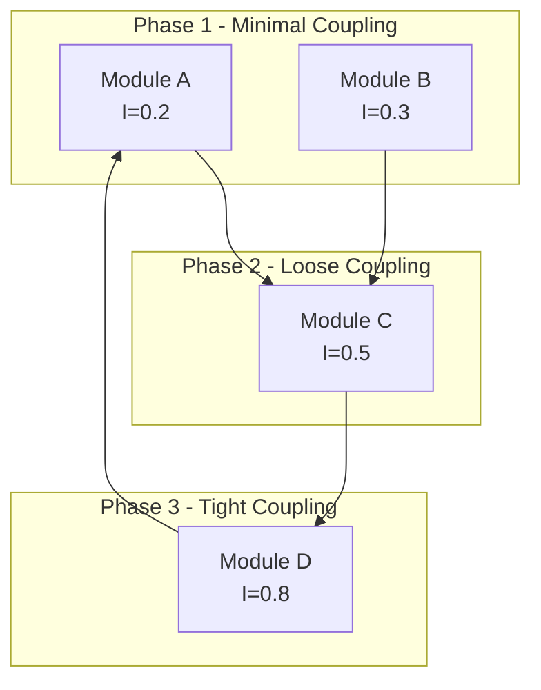

## User Input

```text
$ARGUMENTS
```

Parse arguments for:
- `--from <architecture>`: Source architecture to migrate from (monolith, legacy, etc.)
- `--upgrade <target>`: Target version/runtime to upgrade to (node18, postgres16, python312, etc.)
- `--to-cloud <provider>`: Target cloud provider (aws, gcp, azure, vk-cloud)
- `--scope <path>`: Limit analysis to specific paths (default: entire codebase)
- `--output <mode>`: Output verbosity (minimal, standard, detailed). Default: standard
- `--dry-run`: Show migration plan without generating files

**Combination flags:**
- Multiple flags can be combined (e.g., `--from monolith --to-cloud aws`)
- Order of execution: architecture → upgrade → cloud

You **MUST** consider the user input before proceeding (if not empty).

## Goal

Plan and execute spec-driven modernization of existing codebases. This command:

1. **Analyzes current state** — LOC, modules, coupling, dependencies
2. **Generates migration strategy** — Phased approach with MIG-xxx IDs
3. **Assesses risks** — Probability × Impact matrix with RISK-MIG-xxx IDs
4. **Plans rollback** — Per-phase rollback strategies
5. **Produces documentation** — migration-plan.md, migration-risks.md, coupling-analysis.md

## Migration Scenarios

| Flag | Scenario | Pattern |
|------|----------|---------|
| `--from monolith` | Decompose monolith → microservices | Strangler Fig |
| `--upgrade <target>` | Upgrade framework/runtime version | Breaking Changes + Upgrade Path |
| `--to-cloud <provider>` | Migrate to cloud provider | Service Mapping + Cost Estimation |

## Operating Constraints

**READ-ONLY ANALYSIS**: This command analyzes the codebase but does NOT modify source code.

**OUTPUT FILES**: Generates documentation in FEATURE_DIR:
- `migration-plan.md` — Primary migration strategy
- `migration-risks.md` — Risk assessment matrix
- `coupling-analysis.md` — Module dependency analysis

**HANDOFF**: After successful generation, automatically transitions to `/speckit.plan` for implementation planning.

## Outline

### Phase 0: Setup and Context Loading

1. Run `{SCRIPT}` from repo root and parse JSON output:
   - `FEATURE_DIR`: Current feature directory
   - `PROJECT_ROOT`: Repository root
   - `BASELINE_EXISTS`: Whether baseline.md exists

2. Parse migration flags:
   ```text
   MIGRATION_TYPE = null
   MIGRATION_TARGET = null
   CLOUD_PROVIDER = null

   FOR EACH arg in $ARGUMENTS:
     IF arg == "--from":
       MIGRATION_TYPE = "architecture"
       MIGRATION_TARGET = next_arg  # monolith, legacy, etc.
     ELSE IF arg == "--upgrade":
       MIGRATION_TYPE = "upgrade"
       MIGRATION_TARGET = next_arg  # node18, postgres16, etc.
     ELSE IF arg == "--to-cloud":
       MIGRATION_TYPE = "cloud"
       CLOUD_PROVIDER = next_arg  # aws, gcp, azure, vk-cloud
     ELSE IF arg == "--scope":
       SCOPE_PATH = next_arg
   ```

3. Validate migration type specified:
   ```text
   IF MIGRATION_TYPE is null AND CLOUD_PROVIDER is null:
     ERROR: "Specify migration type: --from <arch>, --upgrade <target>, or --to-cloud <provider>"
     ABORT
   ```

4. Load existing artifacts if present:
   - **IF EXISTS**: Read `FEATURE_DIR/baseline.md` for CB-xxx entries
   - **IF EXISTS**: Read `FEATURE_DIR/spec.md` for feature context

### Phase 1: Current State Analysis

**Load optimization modules:**
```text
Read `templates/shared/migration/coupling-analysis.md`
```

**Execute parallel analysis:**

1. **Codebase Metrics Collection:**
   ```text
   METRICS = {
     loc: {},          # Lines of code by language
     modules: [],      # Module inventory
     entry_points: [], # Main, API, CLI entry points
     frameworks: [],   # Detected frameworks with versions
     databases: [],    # Database usage patterns
     services: []      # External service integrations
   }

   # Language detection and LOC counting
   FOR EACH file in SCOPE_PATH:
     language = detect_language(file)
     METRICS.loc[language] += count_lines(file)

   # Module discovery
   FOR EACH directory with __init__.py OR package.json OR go.mod:
     module = {
       name: directory.name,
       path: directory.path,
       files: count_files(directory),
       loc: sum_loc(directory)
     }
     METRICS.modules.append(module)
   ```

2. **Coupling Analysis:**
   ```text
   # Apply coupling-analysis.md algorithm
   COUPLING_MATRIX = {}
   INSTABILITY = {}

   FOR EACH module in METRICS.modules:
     imports = extract_imports(module)
     exports = extract_exports(module)

     Ca = count_afferent_coupling(module)  # Who depends on this
     Ce = count_efferent_coupling(module)  # What this depends on

     I = Ce / (Ca + Ce) if (Ca + Ce) > 0 else 0

     INSTABILITY[module.name] = I
     COUPLING_MATRIX[module.name] = {
       afferent: Ca,
       efferent: Ce,
       instability: I,
       classification: classify_coupling(Ce)  # TIGHT/LOOSE/MINIMAL
     }

   # Score migration candidates
   MIGRATION_CANDIDATES = []
   FOR EACH module in COUPLING_MATRIX:
     score = calculate_migration_score(module)  # 0-100
     phase = determine_phase(score)  # Phase1/Phase2/Phase3
     MIGRATION_CANDIDATES.append({module, score, phase})
   ```

3. **Dependency Mapping:**
   ```text
   DEPENDENCIES = []

   # Package managers
   IF package.json exists:
     FOR EACH dep in package.json.dependencies:
       DEPENDENCIES.append({
         name: dep.name,
         version: dep.version,
         type: "npm",
         lockfile: check_deprecation(dep)
       })

   IF requirements.txt exists:
     FOR EACH line in requirements.txt:
       DEPENDENCIES.append(parse_requirement(line))

   IF go.mod exists:
     FOR EACH require in go.mod:
       DEPENDENCIES.append(parse_go_require(require))

   # Cloud lock-in detection
   CLOUD_LOCK_IN = []
   FOR EACH dep in DEPENDENCIES:
     IF dep.name matches AWS_SDK_PATTERN:
       CLOUD_LOCK_IN.append({dep, provider: "aws"})
     ELSE IF dep.name matches GCP_CLIENT_PATTERN:
       CLOUD_LOCK_IN.append({dep, provider: "gcp"})
     ELSE IF dep.name matches AZURE_SDK_PATTERN:
       CLOUD_LOCK_IN.append({dep, provider: "azure"})
   ```

### Phase 2: Migration Scenario Execution

**Execute based on MIGRATION_TYPE:**

#### Scenario A: Architecture Migration (`--from monolith`)

```text
Read `templates/shared/migration/strangler-fig.md`

# 1. Boundary Identification
BOUNDARIES = []
FOR EACH entry_point in METRICS.entry_points:
  IF entry_point.type == "API":
    boundary = {
      path: entry_point.path,
      handlers: extract_handlers(entry_point),
      dependencies: trace_dependencies(entry_point)
    }
    BOUNDARIES.append(boundary)

# 2. Service Candidate Identification
SERVICE_CANDIDATES = []
FOR EACH boundary in BOUNDARIES:
  IF boundary has independent data store:
    SERVICE_CANDIDATES.append({
      name: derive_service_name(boundary),
      boundary: boundary,
      coupling: COUPLING_MATRIX[boundary.module],
      priority: calculate_extraction_priority(boundary)
    })

# 3. Strangler Fig Strategy
EXTRACTION_ORDER = sort_by_priority(SERVICE_CANDIDATES)
FACADE_ROUTES = generate_facade_routes(EXTRACTION_ORDER)
TRAFFIC_SHIFT_PLAN = generate_traffic_shift_plan(EXTRACTION_ORDER)
```

#### Scenario B: Version Upgrade (`--upgrade <target>`)

```text
Read `templates/shared/migration/upgrade-detection.md`

# 1. Current Version Detection
CURRENT_VERSIONS = {}
IF package.json exists:
  CURRENT_VERSIONS["node"] = detect_node_version()
  CURRENT_VERSIONS["npm_packages"] = package.json.dependencies

IF requirements.txt exists:
  CURRENT_VERSIONS["python"] = detect_python_version()

IF go.mod exists:
  CURRENT_VERSIONS["go"] = extract_go_version(go.mod)

# 2. Target Version Parsing
TARGET = parse_upgrade_target(MIGRATION_TARGET)
# e.g., "node18" → {runtime: "node", version: "18.x"}
# e.g., "postgres16" → {database: "postgres", version: "16"}

# 3. Breaking Changes Fetch
BREAKING_CHANGES = []
IF TARGET.runtime:
  BREAKING_CHANGES = fetch_breaking_changes(
    runtime: TARGET.runtime,
    from_version: CURRENT_VERSIONS[TARGET.runtime],
    to_version: TARGET.version
  )

# 4. Impact Analysis
UPGRADE_ITEMS = []
UPG_COUNTER = 1
FOR EACH change in BREAKING_CHANGES:
  affected_files = search_codebase(change.pattern)
  IF affected_files.length > 0:
    UPGRADE_ITEMS.append({
      id: f"UPG-{UPG_COUNTER:03d}",
      change: change.description,
      affected: affected_files,
      fix: change.migration_guide,
      priority: change.severity
    })
    UPG_COUNTER += 1
```

#### Scenario C: Cloud Migration (`--to-cloud <provider>`)

```text
Read `templates/shared/migration/cloud-mapping.md`

# 1. Current Service Discovery
CURRENT_SERVICES = []

IF docker-compose.yml exists:
  FOR EACH service in docker-compose.services:
    CURRENT_SERVICES.append({
      name: service.name,
      type: detect_service_type(service),  # db, cache, queue, etc.
      config: service.environment
    })

IF kubernetes manifests exist:
  FOR EACH deployment in k8s/*.yaml:
    CURRENT_SERVICES.append(parse_k8s_deployment(deployment))

# 2. Service Mapping
SERVICE_MAP = {}
FOR EACH service in CURRENT_SERVICES:
  SERVICE_MAP[service.name] = map_to_cloud(
    service: service,
    provider: CLOUD_PROVIDER
  )
  # Returns equivalent cloud service (e.g., postgres → RDS/CloudSQL/etc.)

# 3. Network Topology Planning
NETWORK_PLAN = generate_network_topology(
  services: SERVICE_MAP,
  provider: CLOUD_PROVIDER
)

# 4. Cost Estimation
COST_ESTIMATE = estimate_cloud_costs(
  services: SERVICE_MAP,
  provider: CLOUD_PROVIDER,
  region: detect_target_region()
)
```

### Phase 3: Phased Plan Generation

**Load phase template:**
```text
Read `templates/shared/migration/migration-phases.md`
```

**Generate MIG-xxx phases:**

```text
PHASES = []
MIG_COUNTER = 1
PHASE_COUNTER = 1

# Generate phases based on migration type
IF MIGRATION_TYPE == "architecture":
  FOR EACH service in EXTRACTION_ORDER:
    phase = {
      id: f"MIG-{MIG_COUNTER:03d}",
      phase_number: PHASE_COUNTER,
      title: f"Extract {service.name} Service",
      description: f"Extract {service.name} from monolith using Strangler Fig pattern",
      scope: service.boundary.paths,
      dependencies: calculate_phase_dependencies(service),
      estimated_effort: estimate_effort(service),
      success_metrics: [
        f"{service.name} deployed independently",
        "Zero downtime during extraction",
        "All integration tests passing"
      ],
      status: "PLANNED"
    }
    PHASES.append(phase)
    MIG_COUNTER += 1

    # Add facade phase if not first service
    IF PHASE_COUNTER > 1:
      facade_phase = {
        id: f"MIG-{MIG_COUNTER:03d}",
        phase_number: PHASE_COUNTER,
        title: f"Update Facade for {service.name}",
        description: "Route traffic through facade to new service",
        dependencies: [phase.id],
        estimated_effort: "2-3 days"
      }
      PHASES.append(facade_phase)
      MIG_COUNTER += 1

    PHASE_COUNTER += 1

ELSE IF MIGRATION_TYPE == "upgrade":
  # Group upgrades by priority
  critical_upgrades = filter(UPGRADE_ITEMS, priority == "CRITICAL")
  high_upgrades = filter(UPGRADE_ITEMS, priority == "HIGH")
  medium_upgrades = filter(UPGRADE_ITEMS, priority == "MEDIUM")

  FOR EACH group, priority in [(critical_upgrades, 1), (high_upgrades, 2), (medium_upgrades, 3)]:
    IF group.length > 0:
      phase = {
        id: f"MIG-{MIG_COUNTER:03d}",
        phase_number: priority,
        title: f"Upgrade Phase {priority}: {priority_name(priority)} Changes",
        items: group,
        estimated_effort: sum_effort(group)
      }
      PHASES.append(phase)
      MIG_COUNTER += 1

ELSE IF MIGRATION_TYPE == "cloud":
  # Phase 1: Infrastructure provisioning
  infra_phase = {
    id: f"MIG-{MIG_COUNTER:03d}",
    phase_number: 1,
    title: "Provision Cloud Infrastructure",
    services: filter(SERVICE_MAP, type == "infrastructure"),
    provider: CLOUD_PROVIDER,
    estimated_effort: "1-2 weeks"
  }
  PHASES.append(infra_phase)
  MIG_COUNTER += 1

  # Phase 2: Data migration
  data_phase = {
    id: f"MIG-{MIG_COUNTER:03d}",
    phase_number: 2,
    title: "Migrate Stateful Services",
    services: filter(SERVICE_MAP, type == "database" OR type == "cache"),
    dependencies: [infra_phase.id],
    estimated_effort: "2-4 weeks"
  }
  PHASES.append(data_phase)
  MIG_COUNTER += 1

  # Phase 3: Application migration
  app_phase = {
    id: f"MIG-{MIG_COUNTER:03d}",
    phase_number: 3,
    title: "Migrate Application Services",
    services: filter(SERVICE_MAP, type == "application"),
    dependencies: [data_phase.id],
    estimated_effort: "1-2 weeks"
  }
  PHASES.append(app_phase)
  MIG_COUNTER += 1

  # Phase 4: Traffic cutover
  cutover_phase = {
    id: f"MIG-{MIG_COUNTER:03d}",
    phase_number: 4,
    title: "Traffic Cutover and Decommission",
    dependencies: [app_phase.id],
    estimated_effort: "1 week"
  }
  PHASES.append(cutover_phase)
  MIG_COUNTER += 1

# Build phase dependency DAG
PHASE_DAG = build_dependency_dag(PHASES)
validate_no_cycles(PHASE_DAG)
```

### Phase 4: Risk Assessment

**Load risk matrix:**
```text
Read `templates/shared/migration/risk-matrix-migration.md`
```

**Identify and score risks:**

```text
RISKS = []
RISK_COUNTER = 1

# Technical Risks
IF COUPLING_MATRIX has modules with TIGHT coupling:
  RISKS.append({
    id: f"RISK-MIG-{RISK_COUNTER:03d}",
    category: "Technical",
    title: "Tight Coupling Blocks Extraction",
    description: "Modules with Ce ≥ 10 are difficult to extract safely",
    probability: 4,  # 1-5
    impact: 4,       # 1-5
    score: 16,       # probability × impact
    affected_phases: find_affected_phases(TIGHT_COUPLED_MODULES),
    mitigation: "Extract tightly coupled modules in later phases; refactor first"
  })
  RISK_COUNTER += 1

IF MIGRATION_TYPE == "upgrade" AND BREAKING_CHANGES.length > 10:
  RISKS.append({
    id: f"RISK-MIG-{RISK_COUNTER:03d}",
    category: "Technical",
    title: "High Breaking Change Count",
    description: f"{BREAKING_CHANGES.length} breaking changes require careful testing",
    probability: 3,
    impact: 4,
    score: 12,
    mitigation: "Create comprehensive test suite before upgrade; use canary deployment"
  })
  RISK_COUNTER += 1

# Operational Risks
IF MIGRATION_TYPE == "cloud":
  RISKS.append({
    id: f"RISK-MIG-{RISK_COUNTER:03d}",
    category: "Operational",
    title: "Data Migration Downtime",
    description: "Large database migration may require maintenance window",
    probability: 3,
    impact: 5,
    score: 15,
    affected_phases: [data_phase.id],
    mitigation: "Use CDC (Change Data Capture) for zero-downtime migration"
  })
  RISK_COUNTER += 1

# Business Risks
RISKS.append({
  id: f"RISK-MIG-{RISK_COUNTER:03d}",
  category: "Business",
  title: "Feature Freeze During Migration",
  description: "New feature development may be blocked during migration phases",
  probability: 2,
  impact: 3,
  score: 6,
  mitigation: "Run migration in parallel with feature development using feature flags"
})
RISK_COUNTER += 1

# Schedule Risks
IF total_estimated_effort > "3 months":
  RISKS.append({
    id: f"RISK-MIG-{RISK_COUNTER:03d}",
    category: "Schedule",
    title: "Extended Timeline Risk",
    description: "Long migration increases chance of scope creep and team fatigue",
    probability: 4,
    impact: 3,
    score: 12,
    mitigation: "Define clear milestones; celebrate phase completions; limit scope per phase"
  })
  RISK_COUNTER += 1

# Classify risks
FOR EACH risk in RISKS:
  IF risk.score >= 15:
    risk.severity = "CRITICAL"
  ELSE IF risk.score >= 10:
    risk.severity = "HIGH"
  ELSE IF risk.score >= 5:
    risk.severity = "MEDIUM"
  ELSE:
    risk.severity = "LOW"
```

### Phase 5: Rollback Strategy Definition

**Load rollback template:**
```text
Read `templates/shared/migration/rollback-strategy.md`
```

**Define rollback per phase:**

```text
ROLLBACK_STRATEGIES = {}

FOR EACH phase in PHASES:
  strategy = {
    phase_id: phase.id,
    triggers: [],
    rollback_type: null,
    procedure: [],
    estimated_duration: null,
    verification: []
  }

  # Define triggers
  strategy.triggers = [
    "Error rate exceeds 5% post-deployment",
    "P99 latency exceeds 2x baseline",
    "Critical functionality broken",
    "Data integrity issues detected"
  ]

  # Determine rollback type based on phase
  IF phase involves data migration:
    strategy.rollback_type = "FULL"
    strategy.estimated_duration = "30-60 minutes"
    strategy.procedure = [
      "Stop write traffic to new system",
      "Verify data sync state",
      "Restore from pre-migration backup",
      "Update DNS/routing to old system",
      "Verify old system functionality"
    ]
    strategy.data_strategy = {
      method: "PITR",  # Point-in-time recovery
      backup_retention: "7 days",
      sync_verification: true
    }

  ELSE IF phase involves API changes:
    strategy.rollback_type = "GRADUAL"
    strategy.estimated_duration = "10-30 minutes"
    strategy.procedure = [
      "Reduce traffic to new version to 0%",
      "Verify old version handles full load",
      "Disable new version deployment",
      "Run smoke tests on old version"
    ]

  ELSE:
    strategy.rollback_type = "IMMEDIATE"
    strategy.estimated_duration = "< 5 minutes"
    strategy.procedure = [
      "kubectl rollout undo deployment/app",
      "Verify rollback complete",
      "Run smoke tests"
    ]

  # Verification steps
  strategy.verification = [
    "Health check endpoint returns 200",
    "Smoke tests pass (< 30 seconds)",
    "Error rate returns to baseline",
    "No data loss confirmed"
  ]

  ROLLBACK_STRATEGIES[phase.id] = strategy
```

### Phase 6: Output Generation

**Generate migration-plan.md:**

````markdown
# Migration Plan: [MIGRATION_DESCRIPTION]

**Generated**: [DATE]
**Migration Type**: [MIGRATION_TYPE]
**Target**: [MIGRATION_TARGET or CLOUD_PROVIDER]
**Scope**: [SCOPE_PATH or "Entire codebase"]

## Executive Summary

[Brief description of migration strategy and expected outcomes]

### Migration at a Glance

| Aspect | Value |
|--------|-------|
| Total Phases | [PHASES.length] |
| Estimated Duration | [sum_durations(PHASES)] |
| Risk Level | [max_severity(RISKS)] |
| Rollback Coverage | 100% |

## Current State Analysis

### Codebase Metrics

| Metric | Value |
|--------|-------|
| Total LOC | [sum(METRICS.loc)] |
| Languages | [keys(METRICS.loc)] |
| Modules | [METRICS.modules.length] |
| Entry Points | [METRICS.entry_points.length] |
| External Dependencies | [DEPENDENCIES.length] |

### Coupling Analysis

See `coupling-analysis.md` for detailed module dependency graph.

| Classification | Module Count | Recommendation |
|----------------|--------------|----------------|
| TIGHT (≥10) | [count] | Phase 3 extraction |
| LOOSE (3-9) | [count] | Phase 2 extraction |
| MINIMAL (0-2) | [count] | Phase 1 extraction |

## Migration Phases

```mermaid
gantt
    title Migration Timeline
    dateFormat  YYYY-MM-DD
    section Phase 1
    [PHASE_1_TITLE] :[PHASE_1_ID], [START], [DURATION]
    section Phase 2
    [PHASE_2_TITLE] :[PHASE_2_ID], after [PHASE_1_ID], [DURATION]
```

### MIG-001: [PHASE_1_TITLE]

**Phase**: 1
**Status**: PLANNED
**Dependencies**: None
**Estimated Effort**: [EFFORT]

**Scope**:
- [SCOPE_ITEM_1]
- [SCOPE_ITEM_2]

**Success Metrics**:
- [ ] [METRIC_1]
- [ ] [METRIC_2]

**Rollback Strategy**: [ROLLBACK_TYPE]
- Trigger: [TRIGGER_CONDITIONS]
- Duration: [ESTIMATED_DURATION]
- Procedure: See rollback section

---

[REPEAT FOR EACH PHASE]

---

## Risk Assessment

See `migration-risks.md` for detailed risk matrix.

### Summary

| Severity | Count | Mitigated |
|----------|-------|-----------|
| CRITICAL | [count] | [mitigated_count] |
| HIGH | [count] | [mitigated_count] |
| MEDIUM | [count] | - |
| LOW | [count] | - |

### Critical Risks

| ID | Risk | Score | Mitigation |
|----|------|-------|------------|
| RISK-MIG-001 | [TITLE] | [SCORE] | [MITIGATION] |

## Rollback Procedures

### Per-Phase Rollback

| Phase | Type | Duration | Trigger |
|-------|------|----------|---------|
| MIG-001 | [TYPE] | [DURATION] | Error rate > 5% |
| MIG-002 | [TYPE] | [DURATION] | P99 > 2x baseline |

### Data Rollback Strategy

[If applicable: PITR, backup restore, CDC reversal]

## Success Criteria

### Phase Gate Criteria

| Gate | Criteria | Blocking |
|------|----------|----------|
| QG-MIG-001 | All phases have rollback | Yes |
| QG-MIG-002 | HIGH+ risks mitigated | Yes |
| QG-MIG-003 | Coupling analysis complete | Yes |

### Overall Success

- [ ] All phases completed
- [ ] Zero data loss
- [ ] Performance within 10% of baseline
- [ ] All integration tests passing

## Next Steps

1. Review and approve migration plan
2. Run `/speckit.plan` to generate implementation plan
3. Run `/speckit.tasks` to generate migration tasks
4. Execute phases in order, gating on success criteria
````

**Generate migration-risks.md:**

````markdown
# Migration Risks: [MIGRATION_DESCRIPTION]

**Generated**: [DATE]

## Risk Matrix

```
        │ Impact
        │ 1    2    3    4    5
────────┼─────────────────────────
Prob  5 │ MED  MED  HIGH CRIT CRIT
      4 │ LOW  MED  HIGH HIGH CRIT
      3 │ LOW  MED  MED  HIGH HIGH
      2 │ LOW  LOW  MED  MED  HIGH
      1 │ LOW  LOW  LOW  MED  MED
```

## Risk Register

| ID | Category | Title | P | I | Score | Severity |
|----|----------|-------|---|---|-------|----------|
| RISK-MIG-001 | [CAT] | [TITLE] | [P] | [I] | [SCORE] | [SEV] |

## Detailed Risks

### RISK-MIG-001: [TITLE]

**Category**: [CATEGORY]
**Probability**: [P]/5 — [PROBABILITY_RATIONALE]
**Impact**: [I]/5 — [IMPACT_RATIONALE]
**Score**: [SCORE] ([SEVERITY])

**Description**:
[DETAILED_DESCRIPTION]

**Affected Phases**: [MIG-xxx, MIG-yyy]

**Mitigation Strategy**:
[MITIGATION_DETAILS]

**Residual Risk**: [LOW/MEDIUM after mitigation]

---

[REPEAT FOR EACH RISK]

---

## Mitigation Summary

| Risk ID | Mitigation | Owner | Status |
|---------|------------|-------|--------|
| RISK-MIG-001 | [MITIGATION] | [TBD] | Planned |
````

**Generate coupling-analysis.md:**

````markdown
# Coupling Analysis: [PROJECT_NAME]

**Generated**: [DATE]

## Module Dependency Graph



## Coupling Metrics

| Module | Ca | Ce | I | Classification | Phase |
|--------|----|----|---|----------------|-------|
| [MODULE] | [CA] | [CE] | [I] | [CLASS] | [PHASE] |

## Extraction Recommendations

### Phase 1: Low-Risk Extractions

| Module | Score | Rationale |
|--------|-------|-----------|
| [MODULE] | [SCORE] | [RATIONALE] |

### Phase 2: Medium-Risk Extractions

| Module | Score | Rationale |
|--------|-------|-----------|
| [MODULE] | [SCORE] | [RATIONALE] |

### Phase 3: High-Risk Extractions

| Module | Score | Rationale | Prerequisites |
|--------|-------|-----------|---------------|
| [MODULE] | [SCORE] | [RATIONALE] | [PREREQS] |

## Circular Dependencies

[If any detected]

| Cycle | Modules | Resolution |
|-------|---------|------------|
| 1 | A → B → C → A | Extract shared interface |
````

### Phase 7: Self-Review

**Load self-review criteria:**
```text
Read `templates/shared/migration/self-review-migration.md`
```

**Execute self-review:**

```text
ISSUES = []
ITERATION = 0
MAX_ITERATIONS = 3

WHILE ITERATION < MAX_ITERATIONS:
  ITERATION += 1

  # Re-read generated artifacts
  migration_plan = read("FEATURE_DIR/migration-plan.md")
  migration_risks = read("FEATURE_DIR/migration-risks.md")
  coupling_analysis = read("FEATURE_DIR/coupling-analysis.md")

  # Validate against SR-MIG criteria
  FOR EACH criterion in SR_MIG_CRITERIA:
    result = evaluate_criterion(criterion, {
      migration_plan,
      migration_risks,
      coupling_analysis,
      PHASES,
      RISKS,
      ROLLBACK_STRATEGIES
    })

    IF result.status == "FAIL":
      ISSUES.append({
        criterion: criterion.id,
        severity: criterion.severity,
        message: result.message,
        fix: result.suggested_fix
      })

  # Check for critical failures
  critical_issues = filter(ISSUES, severity == "CRITICAL")
  IF critical_issues.length == 0:
    BREAK  # Self-review passed

  # Self-correct
  FOR EACH issue in critical_issues:
    apply_fix(issue)

  ISSUES = []  # Reset for next iteration

IF ITERATION >= MAX_ITERATIONS AND critical_issues.length > 0:
  ERROR: "Self-review failed after {MAX_ITERATIONS} iterations"
  REPORT critical_issues to user
  ABORT
```

**Self-Review Criteria Table:**

| ID | Criterion | Severity | Check |
|----|-----------|----------|-------|
| SR-MIG-01 | All modules analyzed for coupling | CRITICAL | COUPLING_MATRIX not empty |
| SR-MIG-02 | Each phase has rollback plan | CRITICAL | All MIG-xxx in ROLLBACK_STRATEGIES |
| SR-MIG-03 | Risk mitigation for HIGH/CRITICAL | CRITICAL | All HIGH+ risks have mitigation |
| SR-MIG-04 | Success metrics measurable | HIGH | Each phase has ≥1 metric |
| SR-MIG-05 | Duration estimates present | HIGH | All phases have estimated_effort |
| SR-MIG-06 | Dependencies mapped | HIGH | PHASE_DAG is valid |
| SR-MIG-07 | Mermaid diagram valid | MEDIUM | Diagram parses without error |
| SR-MIG-08 | Phase sequencing respects deps | HIGH | Topological order valid |
| SR-MIG-09 | No circular dependencies | CRITICAL | PHASE_DAG has no cycles |
| SR-MIG-10 | Data migration strategy for stateful | HIGH | Stateful phases have data_strategy |
| SR-MIG-11 | MIG-xxx IDs unique | CRITICAL | No duplicate IDs |
| SR-MIG-12 | RISK-MIG-xxx IDs unique | CRITICAL | No duplicate IDs |
| SR-MIG-13 | All code references valid | HIGH | File paths exist |
| SR-MIG-14 | Baseline referenced if exists | MEDIUM | CB-xxx linked if baseline.md exists |
| SR-MIG-15 | No placeholder text | HIGH | No [TODO], [TBD] in output |

---

## Output Summary

After all phases complete, output:

```markdown
## Migration Plan Complete

**Output Files**:
- `FEATURE_DIR/migration-plan.md`
- `FEATURE_DIR/migration-risks.md`
- `FEATURE_DIR/coupling-analysis.md`

### Summary

| Metric | Value |
|--------|-------|
| Migration Type | [MIGRATION_TYPE] |
| Target | [MIGRATION_TARGET] |
| Total Phases | [PHASES.length] |
| Total Risks | [RISKS.length] |
| Critical Risks | [critical_count] (all mitigated) |
| Rollback Coverage | 100% |

### Phases Generated

| ID | Title | Effort | Dependencies |
|----|-------|--------|--------------|
| MIG-001 | [TITLE] | [EFFORT] | - |
| MIG-002 | [TITLE] | [EFFORT] | MIG-001 |

### Self-Review Results

| Criterion | Result |
|-----------|--------|
| Modules Analyzed | ✓ [N] modules |
| Rollback Plans | ✓ All phases covered |
| Risk Mitigation | ✓ All HIGH+ mitigated |
| Phase Dependencies | ✓ Valid DAG |

**Verdict**: READY FOR PLANNING

### Next Steps

1. Review migration-plan.md for accuracy
2. Run `/speckit.plan` to generate implementation plan
3. Run `/speckit.tasks` for detailed task breakdown
```

---

## Integration Points

### With /speckit.baseline

If `baseline.md` exists:
- Read CB-xxx entries for current state reference
- Link coupling analysis to documented behaviors
- Identify which CBs are affected by each MIG-xxx phase

### With /speckit.plan

After successful migration planning:
- MIG-xxx phases become ADR anchors
- Migration decisions generate architecture decision records
- Phase dependencies inform implementation ordering

### With /speckit.tasks

Task generation uses:
- `[MIG:MIG-xxx]` markers for traceability
- Phase dependencies for task ordering
- Rollback procedures as separate task groups

---

## Quality Gates

| Gate ID | Threshold | Blocks |
|---------|-----------|--------|
| QG-MIG-001 | All MIG phases have rollback | /speckit.plan |
| QG-MIG-002 | HIGH+ risks have mitigations | /speckit.plan |
| QG-MIG-003 | Coupling analysis complete | Phase planning |

---

## Context

{ARGS}
