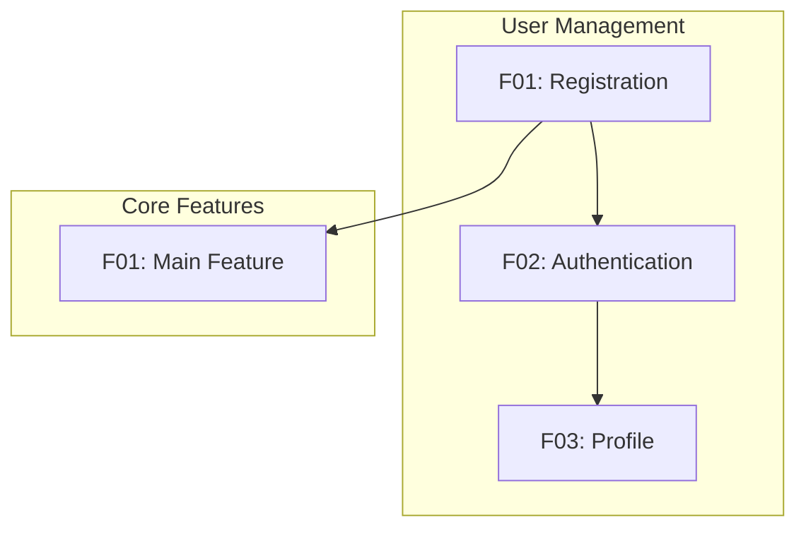
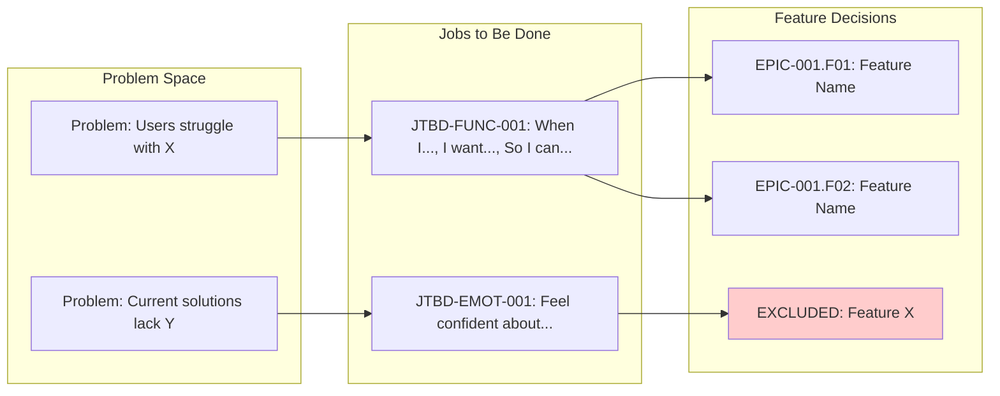

# Concept: [PROJECT_NAME]

**Version**: 2.0 | **Template Version**: v2.0-alternatives | **Created**: [DATE] | **Status**: Draft

<!--
  BREAKING CHANGES in v2.0:
  - Product Alternatives section (NEW) — Explore alternative product visions before committing
  - All 33 concept sections scaffolded for completeness
  - Scope Variants (MINIMAL/BALANCED/AMBITIOUS) now OPTIONAL
  - Section Completion Checklist for tracking progress

  Migration from v1.x: Existing concepts still work. New concepts use comprehensive v2.0 format.
-->

## Vision Statement

<!--
  2-3 sentences answering:
  - What is this product/service?
  - Who is it for?
  - What problem does it solve?
-->

[Describe the core vision of this project in plain language]

---

## Executive Summary

<!--
  90-second decision context for executives.
  Synthesizes all concept sections into actionable brief.
  Reference: templates/shared/concept-sections/executive-summary.md
-->

### The Ask
[1 sentence: What decision/resources are needed]

### Why Now
[2-3 sentences: Market timing, urgency drivers]

### The Opportunity
- TAM: $[X]B | SAM: $[X]M | SOM: $[X]M (Year 1)
- Primary customer: [Persona] at [Company type]
- Willingness to pay: $[X]/month validated via [method]

### Our Approach
[2-3 sentences: How we'll win, key differentiator]

### Investment Required
| Resource | Amount | Duration |
|----------|:------:|:--------:|
| Headcount | [X] FTEs | [X] months |
| Budget | $[X]K | [X] months |
| Opportunity Cost | [What we delay] | [Impact] |

### Key Risks & Mitigations
1. **[Risk 1]**: [Mitigation]
2. **[Risk 2]**: [Mitigation]
3. **[Risk 3]**: [Mitigation]

### Success Criteria
- 6 months: [Metric] = [Target]
- 12 months: [Metric] = [Target]
- 36 months: [Metric] = [Target]

### Recommendation
[GO / NO-GO / CONDITIONAL] — CQS-E: [XX]/120

**Selected Alternative**: [Alternative Name] — See "Product Alternatives" section for comparison of approaches considered.

---

## Product Alternatives

<!--
  PURPOSE: Document alternative product visions explored before selecting this approach.
  Shows strategic thinking and ensures design space was properly explored.

  Five Strategy Types:
  1. Conventional: Industry standard approach
  2. Minimal: Simplest 80/20 solution
  3. Disruptive: Opposite/contrarian approach
  4. Premium: Best-in-class, no constraints
  5. Platform: Ecosystem/marketplace play

  Reference: templates/shared/concept-sections/product-alternatives.md
-->

### Selected Alternative: [N]. [Alternative Name]

**Strategy Type**: [Conventional/Minimal/Disruptive/Premium/Platform]

**Why this alternative**:
1. **[Reason 1]**: [e.g., "Best problem-solution fit (score: X/12) for primary persona"]
2. **[Reason 2]**: [e.g., "Optimal balance of differentiation (X/10) and feasibility (X/10)"]
3. **[Reason 3]**: [e.g., "Fastest path to MVP (X weeks) while maintaining competitive differentiation"]

**Score**: [X]/40 (Problem Fit: [X]/12 | Differentiation: [X]/10 | Feasibility: [X]/10 | Time: [X]/8)

### Alternatives Considered

Full analysis with all 5 alternatives and scoring available in: `specs/concept-alternatives.md`

**Quick Comparison**:

| Alternative | Strategy | Score | MVP Time | Risk | Key Differentiator |
|-------------|----------|:-----:|:--------:|:----:|-------------------|
| 1. [Name] | [Type] | X/40 | X weeks | L/M/H | [Brief highlight] |
| 2. [Name] | [Type] | X/40 | X weeks | L/M/H | [Brief highlight] |
| 3. [Name] | [Type] | X/40 | X weeks | L/M/H | [Brief highlight] |
| 4. [Name] | [Type] | X/40 | X weeks | L/M/H | [Brief highlight] |
| 5. [Name] | [Type] | X/40 | X weeks | L/M/H | [Brief highlight] |

**Decision Rationale**: [1-2 sentences explaining why this alternative was chosen over others, referencing specific evidence from discovery phase]

---

## Section Completion Checklist

<!--
  Track progress on concept completeness. All 33 sections are scaffolded below.
  Check off sections as you complete them. CQS score reflects completion percentage.
-->

### Core Sections (Required for CQS ≥60) — 13 sections

- [ ] Vision Statement
- [ ] Executive Summary
- [ ] Product Alternatives
- [ ] UX Foundation Layer (Personas + JTBD)
- [ ] Feature Hierarchy (Epics → Features → Stories)
- [ ] User Journeys (Primary paths through system)
- [ ] Success Metrics (SMART-validated KPIs with North Star)
- [ ] Market Opportunity (TAM/SAM/SOM with evidence)
- [ ] Competitive Positioning (Matrix + differentiation)
- [ ] Risk Assessment (Matrix with mitigations)
- [ ] Technical Discovery Hints (Domain entities, API surface)
- [ ] Ideas Backlog (Parking lot for future features)
- [ ] CQS Score (Quality gate calculation)

### Strategic Sections (Required for CQS ≥80) — 8 sections

- [ ] PR/FAQ (Amazon Working Backwards press release)
- [ ] Blue Ocean Canvas (ERRC grid for differentiation)
- [ ] Business Model Canvas (Revenue streams, unit economics)
- [ ] Porter's Five Forces (Competitive forces analysis)
- [ ] Hypothesis Testing (Desirability/Feasibility/Viability)
- [ ] Pre-Mortem Analysis (Failure scenario planning)
- [ ] Strategic Trade-offs (Decision hierarchy)
- [ ] Decision Log (Key decisions with rationale)

### Advanced Sections (Required for CQS ≥90) — 12 sections

- [ ] Investment Thesis (Investment justification)
- [ ] Financial Sensitivity (Scenario analysis)
- [ ] Scenario Planning (Strategic scenarios)
- [ ] Three Horizons (Innovation portfolio allocation)
- [ ] MOATS/OSM Analysis (Moats and operating system)
- [ ] Ecosystem Strategy (Platform and ecosystem approach)
- [ ] Portfolio Context (Multi-project positioning)
- [ ] Execution Confidence (Readiness assessment)
- [ ] Strategic Options (Real options analysis)
- [ ] Strategic Alternatives (Build/Buy/Partner)
- [ ] AI Responsibility (if applicable — AI ethics framework)
- [ ] Reasoning Traces (Problem → JTBD → Feature chains)

### Optional Sections

- [ ] Concept Variants (MINIMAL/BALANCED/AMBITIOUS scope levels)
- [ ] Multi-Agent Research Config (Research automation setup)

**Completion**: [X]/33 core sections | **CQS Readiness**: [ ] READY (≥80) | [ ] NOT READY (<80)

---

## Concept Variants (OPTIONAL)

<!--
  NOTE: This section is OPTIONAL in v2.0. It shows SCOPE variations (MINIMAL/BALANCED/AMBITIOUS)
  of the selected product alternative.

  To generate: Use /speckit.concept-variants command

  IMPORTANT DISTINCTION:
  - Product Alternatives (section above) = Different VISIONS (what to build)
  - Concept Variants (this section) = Different SCOPE levels (how much to build) of SAME vision

  Three variants represent scope trade-offs:
  - MINIMAL: Speed to market, validate hypothesis (MUST_HAVE features only)
  - BALANCED: Core value + differentiation (MUST_HAVE + SHOULD_HAVE)
  - AMBITIOUS: Full vision, market leadership (all features)

  Reference: templates/shared/concept-sections/concept-variants.md
-->

**Status**: [ ] Not generated | [ ] Generated

To generate scope variants, use:
```
/speckit.concept-variants
```

### Variant Comparison Matrix (if generated)

| Dimension | MINIMAL | BALANCED | AMBITIOUS |
|-----------|:-------:|:--------:|:---------:|
| Time to MVP | [X] weeks | [Y] weeks | [Z] weeks |
| Team Size | [N] FTEs | [N] FTEs | [N] FTEs |
| Feature Count | [N] features | [N] features | [N] features |
| Risk Level | Low | Medium | High |
| Differentiation | Table stakes | Competitive | Market leader |
| Estimated Cost | $[X]K | $[Y]K | $[Z]K |
| JTBD Coverage | Primary only | Primary + Secondary | All JTBD |

### Recommended Variant: [BALANCED]

**Why this recommendation**:
1. **[Timeline/Constraint fit]**: [How BALANCED aligns with constraints]
2. **[Differentiation]**: [What BALANCED includes that makes us competitive]
3. **[Risk balance]**: [What risky features BALANCED avoids vs AMBITIOUS]

**When to choose differently**:
- Choose MINIMAL if: [specific condition, e.g., "runway < 6 months"]
- Choose AMBITIOUS if: [specific condition, e.g., "funding secured for 18 months"]

---

### Variant: MINIMAL MVP

**Philosophy**: Ship fastest, validate core hypothesis, iterate based on feedback

**Target Timeline**: [X] weeks | **Team**: [N] FTEs | **Risk**: Low

#### Included Features

| Feature ID | Name | JTBD | Why Included |
|------------|------|------|--------------|
| EPIC-001.F01 | [Feature] | JTBD-FUNC-001 | Core value proposition |
| EPIC-001.F02 | [Feature] | JTBD-FUNC-002 | Required for primary journey |

#### What MINIMAL Sacrifices

| Feature | JTBD Impact | Risk of Exclusion |
|---------|-------------|-------------------|
| [Feature A] | JTBD-FUNC-003 unaddressed | Users may not see differentiation |
| [Feature B] | JTBD-SOC-001 unaddressed | Limited to solo users |

---

### Variant: BALANCED (Recommended)

**Philosophy**: Core value proposition + key differentiators

**Target Timeline**: [Y] weeks | **Team**: [N] FTEs | **Risk**: Medium

#### Included Features

| Feature ID | Name | JTBD | Why Included |
|------------|------|------|--------------|
| [All MINIMAL features] | | | |
| EPIC-002.F01 | [Feature] | JTBD-FUNC-003 | Key differentiator |
| EPIC-002.F02 | [Feature] | JTBD-EMOT-001 | User delight |

#### What BALANCED Adds Over MINIMAL

| Feature ID | Name | Why Added | Effort |
|------------|------|-----------|--------|
| EPIC-002.F01 | [Feature] | Competitive parity with [Competitor] | M |

---

### Variant: AMBITIOUS

**Philosophy**: Full product vision, maximum differentiation

**Target Timeline**: [Z] weeks | **Team**: [N] FTEs | **Risk**: High

#### What AMBITIOUS Adds Over BALANCED

| Feature ID | Name | Why Added | Risk |
|------------|------|-----------|------|
| EPIC-003.F01 | [Feature] | Market leadership differentiator | HIGH |

#### Additional Risks

| Risk | Likelihood | Impact | Mitigation |
|------|:----------:|:------:|------------|
| Technical feasibility | Medium | High | POC before full build |

---

## UX Foundation Layer

<!--
  AUTO-POPULATED by /speckit.concept based on project type detection.
  Foundations are prerequisite scenarios that must be implemented BEFORE
  business features to ensure testable user journeys.

  Reference: memory/knowledge/frameworks/ux-foundations.md
-->

**Project Type**: [Web SPA | Web SSR | Mobile | CLI | API | Service | Desktop]
**Detection Trigger**: [What codebase indicator triggered this classification]

### Required Foundations

| Foundation | Status | Wave | Stories | Notes |
|------------|--------|------|---------|-------|
| AUTH | [ ] Needed | 1 | - | Required for user identity |
| ERROR | [ ] Needed | 1 | - | Required for failure handling |
| LAYOUT | [ ] Needed | 1 | - | Required for visual consistency |
| NAV | [ ] Needed | 2 | - | Required for multi-page apps |
| FTUE | [ ] Needed | 2 | - | Required for user activation |
| FEEDBACK | [ ] Needed | 2 | - | Required for user confirmation |
| ADMIN | [ ] Needed | 2 | - | Required for admin capabilities |

### Foundation Scenarios

<!--
  Maps UXF-xxx scenario IDs from ux-foundations.md to story IDs in this concept.
  Ensures all required foundation scenarios have corresponding stories.
-->

#### AUTH Foundation

| UXF ID | Scenario | Defined In | Status |
|--------|----------|------------|--------|
| UXF-AUTH-001 | User signs up | [EPIC-001.F01.S01] | [ ] |
| UXF-AUTH-002 | User signs in | [EPIC-001.F01.S02] | [ ] |
| UXF-AUTH-003 | User signs out | [EPIC-001.F02.S01] | [ ] |

#### ERROR Foundation

| UXF ID | Scenario | Defined In | Status |
|--------|----------|------------|--------|
| UXF-ERR-001 | Network failure | [Infrastructure] | [ ] |
| UXF-ERR-002 | Validation error | [Infrastructure] | [ ] |
| UXF-ERR-003 | Server error | [Infrastructure] | [ ] |

#### ADMIN Foundation

| UXF ID | Scenario | Defined In | Status |
|--------|----------|------------|--------|
| UXF-ADMIN-001 | Admin accesses dashboard | [EPIC-00X.F01.S01] | [ ] |
| UXF-ADMIN-002 | Admin lists users | [EPIC-00X.F02.S01] | [ ] |
| UXF-ADMIN-003 | Admin edits user | [EPIC-00X.F02.S02] | [ ] |
| UXF-ADMIN-004 | Admin changes user role | [EPIC-00X.F03.S01] | [ ] |
| UXF-ADMIN-005 | Admin views audit log | [EPIC-00X.F04.S01] | [ ] |
| UXF-ADMIN-006 | Non-admin denied access | [EPIC-00X.F01.S02] | [ ] |

---

## Execution Order

<!--
  CRITICAL: This section defines BUILD ORDER, not just priority.

  Wave = when to build (sequence)
  Priority = how important (business value)

  Wave 1 must complete before Wave 2 can be tested.
  Wave 2 must complete before Wave 3 user journeys are testable.
-->

> **Wave vs Priority**: P1a/P1b indicate importance. Wave indicates *when* to build.
> Features in Wave 3 might be P1a (critical) but still require Wave 1-2 foundations first.

### Wave 1: Foundation Layer

| Feature ID | Name | Priority | Status | Blocks |
|------------|------|----------|--------|--------|
| EPIC-001.F01 | User Registration | P1a | [ ] | All user features |
| EPIC-001.F02 | Authentication | P1a | [ ] | All protected features |
| [INFRA] | Error Handling | P1a | [ ] | All user interactions |
| [INFRA] | Layout Shell | P1a | [ ] | All UI features |

**Wave 1 Completion Gate**: All items above must be IMPLEMENTED before proceeding.

#### Wave 1 Rationale

**Why these features are grouped together**:
- [Explanation of technical dependencies that require these features first]
- [Explanation of why these form the foundation]

**What blocks Wave 2**:
- [ ] [Specific capability that must exist before Wave 2 can begin]
- [ ] [Data/API that Wave 2 features depend on]

**Alternative groupings considered**:
| Alternative | Why Not Chosen |
|-------------|----------------|
| [Alternative grouping] | [Reason — e.g., would create circular dependency] |

---

### Wave 2: Experience Layer

| Feature ID | Name | Priority | Status | Blocks |
|------------|------|----------|--------|--------|
| EPIC-001.F03 | Navigation | P1b | [ ] | Cross-feature navigation |
| EPIC-001.F04 | Onboarding | P1b | [ ] | User activation |
| [INFRA] | Feedback System | P1b | [ ] | User confirmation |
| EPIC-00X.F01 | Admin Interface | P1b | [ ] | Admin management |

**Wave 2 Completion Gate**: Golden Path must be testable.

#### Wave 2 Rationale

**Why these features are grouped together**:
- [All require Wave 1 foundation (auth, layout) to function]
- [Together enable the minimum user experience]

**What blocks Wave 3**:
- [ ] [User must be able to complete core journey]
- [ ] [Feedback loops must be in place for iteration]

**Dependency chain**:
```text
Wave 1 (Foundation) → Wave 2 (Experience) → Wave 3 (Business Value)
     ↓                      ↓                      ↓
 Auth exists         User can navigate      User achieves goal
```

---

### Golden Path

<!--
  The minimum viable user journey that validates Wave 1-2 completion.
  This journey must be fully testable before Wave 3 begins.
-->

**Journey**: J000 New User Activation

```text
[Guest] → Home → Sign Up → Onboard → First Action → Success
```

| Step | Action | Feature | Wave | Status |
|------|--------|---------|------|--------|
| 1 | Views home page | LAYOUT | 1 | [ ] |
| 2 | Clicks "Sign Up" | NAV | 2 | [ ] |
| 3 | Registers account | EPIC-001.F01 | 1 | [ ] |
| 4 | Completes onboarding | EPIC-001.F04 | 2 | [ ] |
| 5 | Performs first action | [First P1a feature] | 3 | [ ] |
| 6 | Sees confirmation | FEEDBACK | 2 | [ ] |

**Golden Path Status**: [ ] Not testable (requires Wave 1-2 completion)

### Wave 3+: Business Features

| Feature ID | Name | Priority | Wave | Depends On | Status |
|------------|------|----------|------|------------|--------|
| EPIC-002.F01 | [Feature] | P1a | 3 | EPIC-001.F01, F02 | [ ] |
| EPIC-002.F02 | [Feature] | P1b | 3 | EPIC-002.F01 | [ ] |
| EPIC-003.F01 | [Feature] | P2a | 4 | EPIC-002.F01 | [ ] |

#### Wave 3+ Rationale

**Why Wave 3 features wait**:
- [Require Golden Path to be testable first]
- [Business value depends on user activation (Wave 2)]

**Wave 3 vs Wave 4 distinction**:
| Wave | Theme | Why This Order |
|:----:|-------|----------------|
| 3 | Core business value | Directly addresses primary JTBD |
| 4 | Enhancement | Builds on Wave 3 data/patterns |
| 5+ | Expansion | New personas, markets, or platforms |

**Features deliberately pushed to later waves**:

| Feature | Could Be Earlier? | Why Delayed |
|---------|:-----------------:|-------------|
| [Feature X] | Yes | [Risk reduction — validate Wave 3 first] |
| [Feature Y] | No | [Hard dependency on Wave 3 data] |

---

## Discovery & Research

<!--
  This section is populated during Discovery Mode (Phase 0).
  If you started with a clear concept, this section may be minimal or skipped.
  Discovery Mode is triggered when initial input is vague or exploratory.
-->

### Problem Discovery

<!--
  Populated from Phase 0a brainstorming questions.
  Documents the refined understanding of the core problem.
-->

**Triggering Frustration**: [What specific moment or experience sparked this idea?]

**Problem Statement**: [Refined, concrete problem definition after exploration]

**Scale & Frequency**:
- Who experiences this: [target users/companies]
- How often: [daily / weekly / monthly / situational]
- Severity: [minor annoyance / productivity drain / major blocker / critical business risk]

**Current Workarounds**:
| Approach | Pain Points | Why It Fails |
|----------|-------------|--------------|
| [Current solution 1] | [Specific issues] | [Fundamental limitations] |
| [Current solution 2] | [Specific issues] | [Fundamental limitations] |
| [Manual process] | [Specific issues] | [Fundamental limitations] |

**Stakes** (if unsolved):
- [Consequence 1]
- [Consequence 2]

### Market Research

<!--
  Populated from Phase 0b web research.
  Include actual links to sources.
-->

**Competitors Analyzed**:

| Competitor | Strengths | Weaknesses | Our Opportunity |
|------------|-----------|------------|-----------------|
| [Competitor 1] | [What they do well] | [Where they fall short] | [Gap we can fill] |
| [Competitor 2] | [What they do well] | [Where they fall short] | [Gap we can fill] |
| [Competitor 3] | [What they do well] | [Where they fall short] | [Gap we can fill] |

**Market Signals**:
- Market size (TAM): [if found, with source]
- Growth trends: [emerging patterns, investment activity]
- Emerging needs: [unmet demands in the market]
- User sentiment: [common complaints, feature requests from forums/reviews]

**Research Sources**:
- [Link 1: description]
- [Link 2: description]
- [Link 3: description]

### Solution Ideation

<!--
  Populated from Phase 0c brainstorming.
  Connects discovered problems to potential features.
-->

**Value Proposition Canvas**:

| Customer Pain | Our Pain Reliever | Differentiator |
|---------------|-------------------|----------------|
| [Discovered pain 1] | [How we address it] | [Why our approach is unique] |
| [Discovered pain 2] | [How we address it] | [Why our approach is unique] |
| [Discovered pain 3] | [How we address it] | [Why our approach is unique] |

**"What If" Exploration**:

| Scenario | Impact | Effort | Decision |
|----------|--------|--------|----------|
| What if [insight 1]? | H/M/L | H/M/L | → [EPIC-001.F01] or Backlog |
| What if [insight 2]? | H/M/L | H/M/L | → [EPIC-001.F02] or Backlog |
| What if [insight 3]? | H/M/L | H/M/L | → Backlog: [reason] |
| What if [insight 4]? | H/M/L | H/M/L | → Rejected: [reason] |

**Ideation Decisions**:
- Winners (became features): [list feature IDs]
- Deferred: [list ideas moved to backlog with reasons]
- Rejected: [list ideas rejected with rationale]

---

## Business Context

### Problem Space

<!--
  List the specific problems this project addresses.
  Be concrete - avoid vague statements like "improve efficiency".
-->

- [Problem 1]: [Specific pain point with measurable impact]
- [Problem 2]: [Specific pain point with measurable impact]
- [Problem 3]: [Specific pain point with measurable impact]

### Target Users

| Persona | Description | Primary Goals | Pain Points |
|---------|-------------|---------------|-------------|
| [Persona 1] | [Who they are, role, context] | [What they need to accomplish] | [Current frustrations] |
| [Persona 2] | [Who they are, role, context] | [What they need to accomplish] | [Current frustrations] |

### Success Metrics (Business KPIs)

<!--
  Measurable outcomes that define project success.
  Include target values and timeframes where possible.
-->

- [Metric 1]: [Target value] by [Timeframe]
- [Metric 2]: [Target value] by [Timeframe]
- [Metric 3]: [Target value] by [Timeframe]

---

## Feature Hierarchy

<!--
  IMPORTANT: This is the core of concept capture.

  Structure:
  - Epic: Large capability area (e.g., "User Management", "Payment Processing")
  - Feature: Specific functionality within an Epic
  - Story: User-facing capability within a Feature

  ID Format: EPIC-NNN.FNN.SNN
  - EPIC-001.F01.S01 = Epic 1, Feature 1, Story 1

  Priority Levels:
  - P1a, P1b, P1c: Critical path, MVP must-haves (ordered)
  - P2a, P2b: Important but can be added post-MVP
  - P3: Nice-to-have, future enhancements
-->

### Epic: [EPIC-001] [Epic Name]

**Goal**: [High-level outcome this epic delivers]
**Priority**: P1 | P2 | P3
**Dependencies**: [Other epic IDs, or "None"]

#### Feature: [EPIC-001.F01] [Feature Name]

**Description**: [What this feature does]
**User Value**: [Why users need this]
**Priority**: P1a | P1b | P2a | etc.
**Dependencies**: [Other feature IDs, or "None"]

##### Stories:

- [EPIC-001.F01.S01] As a [persona], I want [capability] so that [benefit]
- [EPIC-001.F01.S02] As a [persona], I want [capability] so that [benefit]

##### High-Level Acceptance Criteria:

- [ ] [Criterion 1 - will be detailed in spec.md]
- [ ] [Criterion 2 - will be detailed in spec.md]

---

#### Feature: [EPIC-001.F02] [Feature Name]

**Description**: [What this feature does]
**User Value**: [Why users need this]
**Priority**: P1b | P2a | etc.
**Dependencies**: [EPIC-001.F01]

##### Stories:

- [EPIC-001.F02.S01] As a [persona], I want [capability] so that [benefit]

##### High-Level Acceptance Criteria:

- [ ] [Criterion 1]

---

### Epic: [EPIC-002] [Epic Name]

**Goal**: [High-level outcome]
**Priority**: P1 | P2 | P3
**Dependencies**: [EPIC-001]

#### Feature: [EPIC-002.F01] [Feature Name]

**Description**: [What this feature does]
**User Value**: [Why users need this]
**Priority**: P2a

##### Stories:

- [EPIC-002.F01.S01] As a [persona], I want [capability] so that [benefit]

---

[Add more Epics and Features as needed]

---

## Feature Selection Rationale

<!--
  PURPOSE: Transparent decision log for all feature inclusion/exclusion decisions.
  This section answers: "Why did you choose THESE features specifically?"

  RULE: Every feature in Feature Hierarchy MUST have a corresponding SEL-XXX entry.
  RULE: Every JTBD in Personas section MUST have at least one feature addressing it.

  Reference: templates/shared/concept-sections/selection-rationale.md
-->

### Selection Criteria Applied

| Criterion | Weight | How We Applied It |
|-----------|:------:|-------------------|
| JTBD Alignment | 30% | Feature must link to JTBD-xxx from Persona section |
| Persona Fit | 20% | Primary persona must need this capability |
| Differentiation | 20% | Scored against competitive analysis |
| Feasibility | 15% | T-shirt size must be achievable within variant timeline |
| Reversibility | 15% | Type 2 decisions (reversible) preferred for MVP |

---

### Selection Decision Table

| ID | Feature | Decision | Variant | JTBD | Alternatives | Why This Choice |
|:--:|---------|:--------:|:-------:|------|--------------|-----------------|
| SEL-001 | [Feature Name] | INCLUDE | ALL | JTBD-FUNC-001 | [Alt 1], [Alt 2] | [Brief rationale] |
| SEL-002 | [Feature Name] | INCLUDE | BALANCED+ | JTBD-FUNC-002 | [Alt 1] | [Brief rationale] |
| SEL-003 | [Feature Name] | EXCLUDE | — | JTBD-EMOT-001 | Rule-based | [Why excluded] |
| SEL-004 | [Feature Name] | DEFER | H2 | JTBD-SOC-001 | PWA | [When to reconsider] |

---

### Detailed Feature Rationale

<!--
  Document detailed rationale for key features (at minimum, all P1a features).
  Each entry should link back to JTBD and explain alternatives considered.
-->

#### SEL-001: [Feature Name]

**Feature**: [EPIC-001.F01] [Feature Name]
**Decision**: INCLUDE in [ALL/MINIMAL+/BALANCED+] variants

**JTBD Connection**:
```text
When I [situation/trigger],
I want to [capability/action],
So I can [outcome/benefit].

JTBD ID: JTBD-FUNC-001
Persona: [Primary Persona Name]
Job Type: Functional (Primary)
```

**Persona Pain Point Addressed**:
> "[Quote from user research about current pain]"
> — [Persona Name], User Interview #[N]

**Alternatives Analyzed**:

| Alternative | Score | Pros | Cons | Why Not Chosen |
|-------------|:-----:|------|------|----------------|
| [Selected approach] | 8.5 | [Pros] | [Cons] | **SELECTED** |
| [Alternative 1] | 7.0 | [Pros] | [Cons] | [Reason] |
| [Alternative 2] | 6.5 | [Pros] | [Cons] | [Reason] |

**Evidence Supporting Decision**:
- User interviews: [X]/[Y] participants indicated [finding]
- Competitive analysis: [Finding from market research]
- [Additional evidence source]

**Reversibility Assessment**:
| Aspect | Score |
|--------|:-----:|
| Technical reversibility | Easy / Medium / Hard |
| Cost to reverse | Low / Medium / High |
| Time to reverse | Days / Weeks / Months |
| **Overall** | **Type 1** (irreversible) / **Type 2** (reversible) |

---

#### SEL-003: [Excluded Feature Name]

**Feature**: [Feature Name]
**Decision**: EXCLUDE from all variants

**Why Considered**:
- [JTBD it would address]
- [Competitive consideration]
- [User request frequency]

**Why Excluded**:
1. **[Primary reason]**: [Explanation]
2. **[Secondary reason]**: [Explanation]
3. **[Risk/Constraint]**: [Explanation]

**Alternative for Users**:
- [How users can accomplish similar outcome without this feature]
- [Manual workaround or existing functionality]

**Revisit Trigger**:
- [ ] [Condition that would trigger reconsideration]
- [ ] [Metric threshold]
- [ ] [Market event]

---

### JTBD Coverage Analysis

<!--
  This matrix ensures EVERY documented JTBD has feature coverage.
  GAPs indicate potential scope issues or explicit non-goals.
-->

| JTBD ID | Job Description | Type | Features Addressing | Coverage | Gap Action |
|---------|-----------------|------|---------------------|:--------:|------------|
| JTBD-FUNC-001 | [Job description] | Functional | [F01, F02] | FULL | — |
| JTBD-FUNC-002 | [Job description] | Functional | [F03] | FULL | — |
| JTBD-FUNC-003 | [Job description] | Functional | — | GAP | Deferred to H2 |
| JTBD-EMOT-001 | [Job description] | Emotional | [F04] | PARTIAL | Add settings in v1.1 |
| JTBD-SOC-001 | [Job description] | Social | [F05] | FULL | — |

**Gap Analysis Summary**:
- **[N] JTBD have gaps**: [List JTBD IDs]
- **Acceptable because**: [Why gaps are acceptable for this variant]
- **Mitigation**: [Manual workarounds documented; revisit triggers defined]

---

### Excluded Features Summary

| Feature | Why Considered | Why Excluded | Alternative for Users | Revisit When |
|---------|----------------|--------------|----------------------|--------------|
| [Feature A] | [JTBD/competitive] | [Risk/scope] | [Workaround] | [Trigger] |
| [Feature B] | [JTBD/competitive] | [Risk/scope] | [Workaround] | [Trigger] |

---

## User Journeys

<!--
  End-to-end flows that cross multiple features.
  Map each step to the features/stories that implement it.
-->

### Journey: [J001] [Journey Name]

**Persona**: [Target user]
**Goal**: [End-to-end outcome the user achieves]
**Trigger**: [What starts this journey]

**Flow**:

```text
[Start] --> [Step 1] --> [Step 2] --> [Step 3] --> [End]
```

| Step | Action | Features Involved | Notes |
|------|--------|-------------------|-------|
| 1 | [User action] | [EPIC-001.F01], [EPIC-001.F02] | [Any notes] |
| 2 | [User action] | [EPIC-002.F01] | [Any notes] |
| 3 | [User action] | [EPIC-001.F03] | [Any notes] |

**Edge Cases**:

- What if [condition X]? -> [Expected behavior]
- What if [condition Y]? -> [Expected behavior]

---

### Journey: [J002] [Journey Name]

**Persona**: [Target user]
**Goal**: [End-to-end outcome]
**Trigger**: [What starts this journey]

| Step | Action | Features Involved | Notes |
|------|--------|-------------------|-------|
| 1 | [User action] | [Features] | [Notes] |

---

## Cross-Feature Dependencies

<!--
  Matrix showing how features depend on each other.
  Critical for planning implementation order.
-->

| Feature | Depends On | Blocks | Integration Notes |
|---------|------------|--------|-------------------|
| [EPIC-001.F01] | - | [EPIC-001.F02], [EPIC-002.F01] | Foundation for all |
| [EPIC-001.F02] | [EPIC-001.F01] | [EPIC-001.F03] | Requires auth |
| [EPIC-002.F01] | [EPIC-001.F01] | - | Uses core entities |

### Dependency Graph (Visual)



---

## Ideas Backlog

<!--
  CRITICAL: This section captures ALL ideas that don't fit the current scope.
  Nothing should be lost - if an idea comes up, add it here.

  Status:
  - [ ] Not started
  - [?] Needs validation (unclear value or feasibility)
  - [>] Deferred to future phase
  - [x] Rejected with reason
-->

### Potential Future Epics

- [ ] [Idea 1] - Could become EPIC-003 if validated
- [ ] [Idea 2] - Depends on market feedback

### Feature Ideas (Unsorted)

- [ ] [EPIC-001] [Idea] - Potential enhancement to existing epic
- [?] [Idea] - Needs user research to validate
- [>] [Idea] - Deferred to v2.0

### Technical Explorations

- [ ] [Tech idea 1] - Could improve performance
- [ ] [Tech idea 2] - Alternative architecture approach

### Rejected Ideas (with rationale)

- [x] [Idea] - Rejected because [reason]

---

## Glossary

<!--
  Canonical definitions for all domain terms.
  Prevents terminology drift across artifacts.
-->

| Term | Definition | Aliases (deprecated) |
|------|------------|---------------------|
| [Term 1] | [Canonical definition] | [Old names to avoid] |
| [Term 2] | [Canonical definition] | - |

---

## Traceability Skeleton

<!--
  AUTO-UPDATED by downstream commands:
  - /speckit.specify → Sets "Spec Created" to [x], populates "Requirements"
  - /speckit.tasks   → Populates "Tasks" column
  - /speckit.implement → Populates "Tests", updates "Status"

  Status progression:
  - Not started → SPECIFIED → TASKED → IMPLEMENTING → IMPLEMENTED → VERIFIED

  Do NOT manually edit this section - it is maintained by commands.
-->

| Concept ID | Wave | Spec Created | Requirements | Tasks | Tests | Status |
|------------|------|--------------|--------------|-------|-------|--------|
| [EPIC-001.F01.S01] | 1 | [ ] | - | - | - | Not started |
| [EPIC-001.F01.S02] | 1 | [ ] | - | - | - | Not started |
| [EPIC-001.F02.S01] | 1 | [ ] | - | - | - | Not started |

### Progress Rollup

<!--
  Auto-calculated summary of implementation progress.
  Updated by /speckit.specify, /speckit.tasks, /speckit.implement.
-->

| Status | Count | % |
|--------|-------|---|
| Not started | 3 | 100% |
| SPECIFIED | 0 | 0% |
| TASKED | 0 | 0% |
| IMPLEMENTING | 0 | 0% |
| IMPLEMENTED | 0 | 0% |
| VERIFIED | 0 | 0% |
| **Total** | **3** | |

### Foundation Progress

| Wave | Total | Implemented | Status |
|------|-------|-------------|--------|
| Wave 1 | 0 | 0 | [ ] Not started |
| Wave 2 | 0 | 0 | [ ] Not started |
| Wave 3+ | 0 | 0 | [ ] Blocked by Wave 1-2 |

**Golden Path**: [ ] Not testable
**Last Updated**: [date] by [command]

---

## Reasoning Trace

<!--
  PURPOSE: Visualize the decision chain from Problem to Feature.
  This section answers: "How did you arrive at these specific features?"

  Shows the logical flow: Problem → JTBD → Persona Need → Feature → Priority
  Makes AI reasoning transparent and auditable.

  Reference: templates/shared/concept-sections/reasoning-trace.md
-->

### Decision Chain Visualization



### Trace Examples

#### Trace 1: [Primary Feature]

```text
PROBLEM: [Specific user problem from discovery]
    ↓
PERSONA: [Primary Persona] experiences this when [situation]
    ↓
JTBD: JTBD-FUNC-001 — "When I [situation], I want [capability], so I can [outcome]"
    ↓
FEATURE: EPIC-001.F01 [Feature Name]
    ↓
PRIORITY: P1a — Core value proposition, required for MVP
    ↓
VARIANT: ALL — Included in MINIMAL, BALANCED, AMBITIOUS
    ↓
SELECTION: SEL-001 — Chosen over [alternatives] because [rationale]
```

#### Trace 2: [Excluded Feature]

```text
PROBLEM: [User problem that prompted consideration]
    ↓
PERSONA: [Persona] mentioned this in [research source]
    ↓
JTBD: JTBD-EMOT-002 — "When I [situation], I want [capability], so I can [outcome]"
    ↓
FEATURE CONSIDERED: [Feature Name]
    ↓
DECISION: EXCLUDE
    ↓
RATIONALE: [Technical risk / Scope constraint / Insufficient evidence]
    ↓
ALTERNATIVE: [How users can accomplish similar outcome]
    ↓
REVISIT TRIGGER: [When to reconsider this feature]
```

#### Trace 3: [Deferred Feature]

```text
PROBLEM: [User problem]
    ↓
JTBD: JTBD-SOC-001 — Social job
    ↓
FEATURE: [Feature Name]
    ↓
DECISION: DEFER to Wave [N] / H2
    ↓
RATIONALE: [Dependency on earlier waves / Resource constraint]
    ↓
PREREQUISITE: [What must be true before building this]
```

### Reasoning Summary

| Trace ID | Problem | JTBD | Feature | Decision | Key Rationale |
|:--------:|---------|------|---------|:--------:|---------------|
| RT-001 | [Problem] | JTBD-FUNC-001 | F01 | INCLUDE | [1-line rationale] |
| RT-002 | [Problem] | JTBD-FUNC-002 | F02 | INCLUDE | [1-line rationale] |
| RT-003 | [Problem] | JTBD-EMOT-001 | [Feature] | EXCLUDE | [1-line rationale] |
| RT-004 | [Problem] | JTBD-SOC-001 | [Feature] | DEFER | [1-line rationale] |

### Key Decision Points

<!--
  Document the 3-5 most important decisions that shaped this concept.
  These are the "pivotal moments" in the reasoning chain.
-->

1. **[Decision 1]**: We chose [approach A] over [approach B] because [evidence/rationale]
   - Impact: [What this enabled/prevented]
   - Reversibility: [Type 1/Type 2]

2. **[Decision 2]**: We excluded [feature] despite [consideration] because [rationale]
   - Impact: [Gap in JTBD coverage, mitigation]
   - Revisit: [Trigger condition]

3. **[Decision 3]**: We prioritized [feature X] over [feature Y] because [rationale]
   - Evidence: [User research, competitive analysis]
   - Risk: [What could invalidate this decision]

---

## Next Steps

After completing this concept document:

1. **Validate with stakeholders** - Ensure all personas and journeys are accurate
2. **Prioritize** - Confirm P1a/P1b ordering for MVP scope
3. **Run `/speckit.specify`** - Detail specific stories for implementation
   - Start with P1a stories: [list specific story IDs]
   - Example: `/speckit.specify EPIC-001.F01.S01, EPIC-001.F01.S02`

---

## Revision History

| Version | Date | Author | Changes |
|---------|------|--------|---------|
| 1.0 | [DATE] | [Author] | Initial concept capture |
