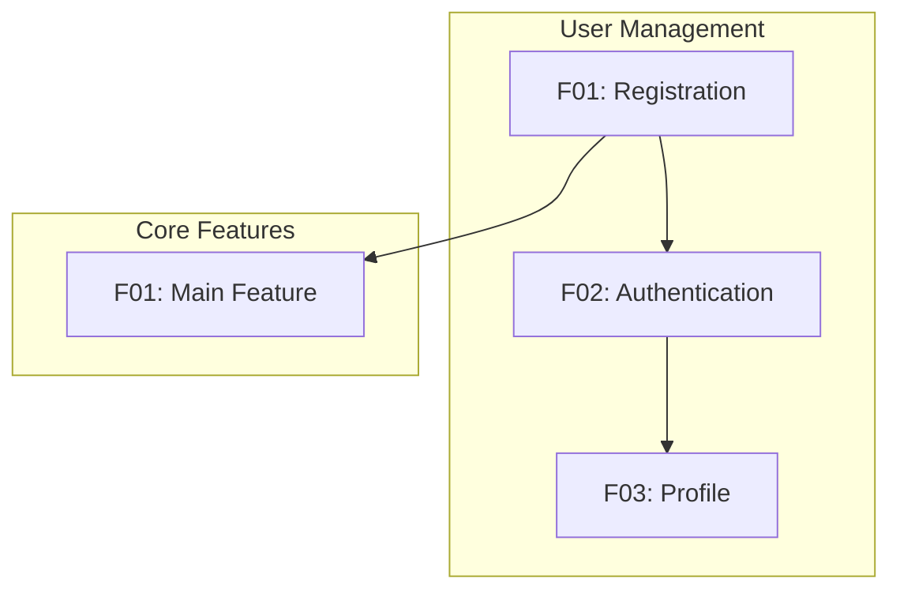

# Concept: [PROJECT_NAME]

**Version**: 1.0 | **Created**: [DATE] | **Status**: Draft

## Vision Statement

<!--
  2-3 sentences answering:
  - What is this product/service?
  - Who is it for?
  - What problem does it solve?
-->

[Describe the core vision of this project in plain language]

---

## UX Foundation Layer

<!--
  AUTO-POPULATED by /speckit.concept based on project type detection.
  Foundations are prerequisite scenarios that must be implemented BEFORE
  business features to ensure testable user journeys.

  Reference: memory/knowledge/frameworks/ux-foundations.md
-->

**Project Type**: [Web SPA | Web SSR | Mobile | CLI | API | Service | Desktop]
**Detection Trigger**: [What codebase indicator triggered this classification]

### Required Foundations

| Foundation | Status | Wave | Stories | Notes |
|------------|--------|------|---------|-------|
| AUTH | [ ] Needed | 1 | - | Required for user identity |
| ERROR | [ ] Needed | 1 | - | Required for failure handling |
| LAYOUT | [ ] Needed | 1 | - | Required for visual consistency |
| NAV | [ ] Needed | 2 | - | Required for multi-page apps |
| FTUE | [ ] Needed | 2 | - | Required for user activation |
| FEEDBACK | [ ] Needed | 2 | - | Required for user confirmation |
| ADMIN | [ ] Needed | 2 | - | Required for admin capabilities |

### Foundation Scenarios

<!--
  Maps UXF-xxx scenario IDs from ux-foundations.md to story IDs in this concept.
  Ensures all required foundation scenarios have corresponding stories.
-->

#### AUTH Foundation

| UXF ID | Scenario | Defined In | Status |
|--------|----------|------------|--------|
| UXF-AUTH-001 | User signs up | [EPIC-001.F01.S01] | [ ] |
| UXF-AUTH-002 | User signs in | [EPIC-001.F01.S02] | [ ] |
| UXF-AUTH-003 | User signs out | [EPIC-001.F02.S01] | [ ] |

#### ERROR Foundation

| UXF ID | Scenario | Defined In | Status |
|--------|----------|------------|--------|
| UXF-ERR-001 | Network failure | [Infrastructure] | [ ] |
| UXF-ERR-002 | Validation error | [Infrastructure] | [ ] |
| UXF-ERR-003 | Server error | [Infrastructure] | [ ] |

#### ADMIN Foundation

| UXF ID | Scenario | Defined In | Status |
|--------|----------|------------|--------|
| UXF-ADMIN-001 | Admin accesses dashboard | [EPIC-00X.F01.S01] | [ ] |
| UXF-ADMIN-002 | Admin lists users | [EPIC-00X.F02.S01] | [ ] |
| UXF-ADMIN-003 | Admin edits user | [EPIC-00X.F02.S02] | [ ] |
| UXF-ADMIN-004 | Admin changes user role | [EPIC-00X.F03.S01] | [ ] |
| UXF-ADMIN-005 | Admin views audit log | [EPIC-00X.F04.S01] | [ ] |
| UXF-ADMIN-006 | Non-admin denied access | [EPIC-00X.F01.S02] | [ ] |

---

## Execution Order

<!--
  CRITICAL: This section defines BUILD ORDER, not just priority.

  Wave = when to build (sequence)
  Priority = how important (business value)

  Wave 1 must complete before Wave 2 can be tested.
  Wave 2 must complete before Wave 3 user journeys are testable.
-->

> **Wave vs Priority**: P1a/P1b indicate importance. Wave indicates *when* to build.
> Features in Wave 3 might be P1a (critical) but still require Wave 1-2 foundations first.

### Wave 1: Foundation Layer

| Feature ID | Name | Priority | Status | Blocks |
|------------|------|----------|--------|--------|
| EPIC-001.F01 | User Registration | P1a | [ ] | All user features |
| EPIC-001.F02 | Authentication | P1a | [ ] | All protected features |
| [INFRA] | Error Handling | P1a | [ ] | All user interactions |
| [INFRA] | Layout Shell | P1a | [ ] | All UI features |

**Wave 1 Completion Gate**: All items above must be IMPLEMENTED before proceeding.

### Wave 2: Experience Layer

| Feature ID | Name | Priority | Status | Blocks |
|------------|------|----------|--------|--------|
| EPIC-001.F03 | Navigation | P1b | [ ] | Cross-feature navigation |
| EPIC-001.F04 | Onboarding | P1b | [ ] | User activation |
| [INFRA] | Feedback System | P1b | [ ] | User confirmation |
| EPIC-00X.F01 | Admin Interface | P1b | [ ] | Admin management |

**Wave 2 Completion Gate**: Golden Path must be testable.

### Golden Path

<!--
  The minimum viable user journey that validates Wave 1-2 completion.
  This journey must be fully testable before Wave 3 begins.
-->

**Journey**: J000 New User Activation

```text
[Guest] → Home → Sign Up → Onboard → First Action → Success
```

| Step | Action | Feature | Wave | Status |
|------|--------|---------|------|--------|
| 1 | Views home page | LAYOUT | 1 | [ ] |
| 2 | Clicks "Sign Up" | NAV | 2 | [ ] |
| 3 | Registers account | EPIC-001.F01 | 1 | [ ] |
| 4 | Completes onboarding | EPIC-001.F04 | 2 | [ ] |
| 5 | Performs first action | [First P1a feature] | 3 | [ ] |
| 6 | Sees confirmation | FEEDBACK | 2 | [ ] |

**Golden Path Status**: [ ] Not testable (requires Wave 1-2 completion)

### Wave 3+: Business Features

| Feature ID | Name | Priority | Wave | Depends On | Status |
|------------|------|----------|------|------------|--------|
| EPIC-002.F01 | [Feature] | P1a | 3 | EPIC-001.F01, F02 | [ ] |
| EPIC-002.F02 | [Feature] | P1b | 3 | EPIC-002.F01 | [ ] |
| EPIC-003.F01 | [Feature] | P2a | 4 | EPIC-002.F01 | [ ] |

---

## Discovery & Research

<!--
  This section is populated during Discovery Mode (Phase 0).
  If you started with a clear concept, this section may be minimal or skipped.
  Discovery Mode is triggered when initial input is vague or exploratory.
-->

### Problem Discovery

<!--
  Populated from Phase 0a brainstorming questions.
  Documents the refined understanding of the core problem.
-->

**Triggering Frustration**: [What specific moment or experience sparked this idea?]

**Problem Statement**: [Refined, concrete problem definition after exploration]

**Scale & Frequency**:
- Who experiences this: [target users/companies]
- How often: [daily / weekly / monthly / situational]
- Severity: [minor annoyance / productivity drain / major blocker / critical business risk]

**Current Workarounds**:
| Approach | Pain Points | Why It Fails |
|----------|-------------|--------------|
| [Current solution 1] | [Specific issues] | [Fundamental limitations] |
| [Current solution 2] | [Specific issues] | [Fundamental limitations] |
| [Manual process] | [Specific issues] | [Fundamental limitations] |

**Stakes** (if unsolved):
- [Consequence 1]
- [Consequence 2]

### Market Research

<!--
  Populated from Phase 0b web research.
  Include actual links to sources.
-->

**Competitors Analyzed**:

| Competitor | Strengths | Weaknesses | Our Opportunity |
|------------|-----------|------------|-----------------|
| [Competitor 1] | [What they do well] | [Where they fall short] | [Gap we can fill] |
| [Competitor 2] | [What they do well] | [Where they fall short] | [Gap we can fill] |
| [Competitor 3] | [What they do well] | [Where they fall short] | [Gap we can fill] |

**Market Signals**:
- Market size (TAM): [if found, with source]
- Growth trends: [emerging patterns, investment activity]
- Emerging needs: [unmet demands in the market]
- User sentiment: [common complaints, feature requests from forums/reviews]

**Research Sources**:
- [Link 1: description]
- [Link 2: description]
- [Link 3: description]

### Solution Ideation

<!--
  Populated from Phase 0c brainstorming.
  Connects discovered problems to potential features.
-->

**Value Proposition Canvas**:

| Customer Pain | Our Pain Reliever | Differentiator |
|---------------|-------------------|----------------|
| [Discovered pain 1] | [How we address it] | [Why our approach is unique] |
| [Discovered pain 2] | [How we address it] | [Why our approach is unique] |
| [Discovered pain 3] | [How we address it] | [Why our approach is unique] |

**"What If" Exploration**:

| Scenario | Impact | Effort | Decision |
|----------|--------|--------|----------|
| What if [insight 1]? | H/M/L | H/M/L | → [EPIC-001.F01] or Backlog |
| What if [insight 2]? | H/M/L | H/M/L | → [EPIC-001.F02] or Backlog |
| What if [insight 3]? | H/M/L | H/M/L | → Backlog: [reason] |
| What if [insight 4]? | H/M/L | H/M/L | → Rejected: [reason] |

**Ideation Decisions**:
- Winners (became features): [list feature IDs]
- Deferred: [list ideas moved to backlog with reasons]
- Rejected: [list ideas rejected with rationale]

---

## Business Context

### Problem Space

<!--
  List the specific problems this project addresses.
  Be concrete - avoid vague statements like "improve efficiency".
-->

- [Problem 1]: [Specific pain point with measurable impact]
- [Problem 2]: [Specific pain point with measurable impact]
- [Problem 3]: [Specific pain point with measurable impact]

### Target Users

| Persona | Description | Primary Goals | Pain Points |
|---------|-------------|---------------|-------------|
| [Persona 1] | [Who they are, role, context] | [What they need to accomplish] | [Current frustrations] |
| [Persona 2] | [Who they are, role, context] | [What they need to accomplish] | [Current frustrations] |

### Success Metrics (Business KPIs)

<!--
  Measurable outcomes that define project success.
  Include target values and timeframes where possible.
-->

- [Metric 1]: [Target value] by [Timeframe]
- [Metric 2]: [Target value] by [Timeframe]
- [Metric 3]: [Target value] by [Timeframe]

---

## Feature Hierarchy

<!--
  IMPORTANT: This is the core of concept capture.

  Structure:
  - Epic: Large capability area (e.g., "User Management", "Payment Processing")
  - Feature: Specific functionality within an Epic
  - Story: User-facing capability within a Feature

  ID Format: EPIC-NNN.FNN.SNN
  - EPIC-001.F01.S01 = Epic 1, Feature 1, Story 1

  Priority Levels:
  - P1a, P1b, P1c: Critical path, MVP must-haves (ordered)
  - P2a, P2b: Important but can be added post-MVP
  - P3: Nice-to-have, future enhancements
-->

### Epic: [EPIC-001] [Epic Name]

**Goal**: [High-level outcome this epic delivers]
**Priority**: P1 | P2 | P3
**Dependencies**: [Other epic IDs, or "None"]

#### Feature: [EPIC-001.F01] [Feature Name]

**Description**: [What this feature does]
**User Value**: [Why users need this]
**Priority**: P1a | P1b | P2a | etc.
**Dependencies**: [Other feature IDs, or "None"]

##### Stories:

- [EPIC-001.F01.S01] As a [persona], I want [capability] so that [benefit]
- [EPIC-001.F01.S02] As a [persona], I want [capability] so that [benefit]

##### High-Level Acceptance Criteria:

- [ ] [Criterion 1 - will be detailed in spec.md]
- [ ] [Criterion 2 - will be detailed in spec.md]

---

#### Feature: [EPIC-001.F02] [Feature Name]

**Description**: [What this feature does]
**User Value**: [Why users need this]
**Priority**: P1b | P2a | etc.
**Dependencies**: [EPIC-001.F01]

##### Stories:

- [EPIC-001.F02.S01] As a [persona], I want [capability] so that [benefit]

##### High-Level Acceptance Criteria:

- [ ] [Criterion 1]

---

### Epic: [EPIC-002] [Epic Name]

**Goal**: [High-level outcome]
**Priority**: P1 | P2 | P3
**Dependencies**: [EPIC-001]

#### Feature: [EPIC-002.F01] [Feature Name]

**Description**: [What this feature does]
**User Value**: [Why users need this]
**Priority**: P2a

##### Stories:

- [EPIC-002.F01.S01] As a [persona], I want [capability] so that [benefit]

---

[Add more Epics and Features as needed]

---

## User Journeys

<!--
  End-to-end flows that cross multiple features.
  Map each step to the features/stories that implement it.
-->

### Journey: [J001] [Journey Name]

**Persona**: [Target user]
**Goal**: [End-to-end outcome the user achieves]
**Trigger**: [What starts this journey]

**Flow**:

```text
[Start] --> [Step 1] --> [Step 2] --> [Step 3] --> [End]
```

| Step | Action | Features Involved | Notes |
|------|--------|-------------------|-------|
| 1 | [User action] | [EPIC-001.F01], [EPIC-001.F02] | [Any notes] |
| 2 | [User action] | [EPIC-002.F01] | [Any notes] |
| 3 | [User action] | [EPIC-001.F03] | [Any notes] |

**Edge Cases**:

- What if [condition X]? -> [Expected behavior]
- What if [condition Y]? -> [Expected behavior]

---

### Journey: [J002] [Journey Name]

**Persona**: [Target user]
**Goal**: [End-to-end outcome]
**Trigger**: [What starts this journey]

| Step | Action | Features Involved | Notes |
|------|--------|-------------------|-------|
| 1 | [User action] | [Features] | [Notes] |

---

## Cross-Feature Dependencies

<!--
  Matrix showing how features depend on each other.
  Critical for planning implementation order.
-->

| Feature | Depends On | Blocks | Integration Notes |
|---------|------------|--------|-------------------|
| [EPIC-001.F01] | - | [EPIC-001.F02], [EPIC-002.F01] | Foundation for all |
| [EPIC-001.F02] | [EPIC-001.F01] | [EPIC-001.F03] | Requires auth |
| [EPIC-002.F01] | [EPIC-001.F01] | - | Uses core entities |

### Dependency Graph (Visual)



---

## Ideas Backlog

<!--
  CRITICAL: This section captures ALL ideas that don't fit the current scope.
  Nothing should be lost - if an idea comes up, add it here.

  Status:
  - [ ] Not started
  - [?] Needs validation (unclear value or feasibility)
  - [>] Deferred to future phase
  - [x] Rejected with reason
-->

### Potential Future Epics

- [ ] [Idea 1] - Could become EPIC-003 if validated
- [ ] [Idea 2] - Depends on market feedback

### Feature Ideas (Unsorted)

- [ ] [EPIC-001] [Idea] - Potential enhancement to existing epic
- [?] [Idea] - Needs user research to validate
- [>] [Idea] - Deferred to v2.0

### Technical Explorations

- [ ] [Tech idea 1] - Could improve performance
- [ ] [Tech idea 2] - Alternative architecture approach

### Rejected Ideas (with rationale)

- [x] [Idea] - Rejected because [reason]

---

## Glossary

<!--
  Canonical definitions for all domain terms.
  Prevents terminology drift across artifacts.
-->

| Term | Definition | Aliases (deprecated) |
|------|------------|---------------------|
| [Term 1] | [Canonical definition] | [Old names to avoid] |
| [Term 2] | [Canonical definition] | - |

---

## Traceability Skeleton

<!--
  AUTO-UPDATED by downstream commands:
  - /speckit.specify → Sets "Spec Created" to [x], populates "Requirements"
  - /speckit.tasks   → Populates "Tasks" column
  - /speckit.implement → Populates "Tests", updates "Status"

  Status progression:
  - Not started → SPECIFIED → TASKED → IMPLEMENTING → IMPLEMENTED → VERIFIED

  Do NOT manually edit this section - it is maintained by commands.
-->

| Concept ID | Wave | Spec Created | Requirements | Tasks | Tests | Status |
|------------|------|--------------|--------------|-------|-------|--------|
| [EPIC-001.F01.S01] | 1 | [ ] | - | - | - | Not started |
| [EPIC-001.F01.S02] | 1 | [ ] | - | - | - | Not started |
| [EPIC-001.F02.S01] | 1 | [ ] | - | - | - | Not started |

### Progress Rollup

<!--
  Auto-calculated summary of implementation progress.
  Updated by /speckit.specify, /speckit.tasks, /speckit.implement.
-->

| Status | Count | % |
|--------|-------|---|
| Not started | 3 | 100% |
| SPECIFIED | 0 | 0% |
| TASKED | 0 | 0% |
| IMPLEMENTING | 0 | 0% |
| IMPLEMENTED | 0 | 0% |
| VERIFIED | 0 | 0% |
| **Total** | **3** | |

### Foundation Progress

| Wave | Total | Implemented | Status |
|------|-------|-------------|--------|
| Wave 1 | 0 | 0 | [ ] Not started |
| Wave 2 | 0 | 0 | [ ] Not started |
| Wave 3+ | 0 | 0 | [ ] Blocked by Wave 1-2 |

**Golden Path**: [ ] Not testable
**Last Updated**: [date] by [command]

---

## Next Steps

After completing this concept document:

1. **Validate with stakeholders** - Ensure all personas and journeys are accurate
2. **Prioritize** - Confirm P1a/P1b ordering for MVP scope
3. **Run `/speckit.specify`** - Detail specific stories for implementation
   - Start with P1a stories: [list specific story IDs]
   - Example: `/speckit.specify EPIC-001.F01.S01, EPIC-001.F01.S02`

---

## Revision History

| Version | Date | Author | Changes |
|---------|------|--------|---------|
| 1.0 | [DATE] | [Author] | Initial concept capture |
