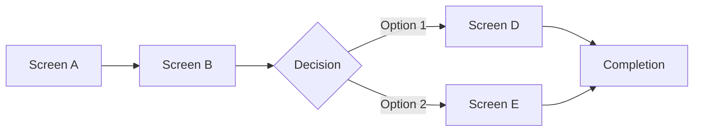

# Design Specification: [FEATURE_NAME]

**Version**: 1.0 | **Created**: [DATE] | **Status**: Draft

## Source References

- **Spec**: `specs/[NNN-feature]/spec.md`
- **Concept**: `specs/concept.md` (if applicable)
- **Concept IDs Covered**: [EPIC-xxx.Fxx.Sxx] (if from concept)

---

## Visual Language

### Color Palette

<!--
  Define semantic color tokens with CSS variable names.
  Include contrast ratios for accessibility validation.
  Document both light and dark mode values if applicable.
-->

| Token | CSS Variable | Light Value | Dark Value | Contrast | Usage |
|-------|--------------|-------------|------------|----------|-------|
| Primary | --color-primary | #2563EB | #3B82F6 | 4.5:1 | CTA buttons, active links |
| Primary Hover | --color-primary-hover | #1D4ED8 | #60A5FA | 4.7:1 | Button hover states |
| Secondary | --color-secondary | #6B7280 | #9CA3AF | 4.5:1 | Secondary actions |
| Success | --color-success | #16A34A | #22C55E | 4.5:1 | Success states, confirmations |
| Warning | --color-warning | #CA8A04 | #FACC15 | 4.5:1 | Warning messages |
| Error | --color-error | #DC2626 | #EF4444 | 4.5:1 | Error states, destructive actions |
| Info | --color-info | #0284C7 | #38BDF8 | 4.5:1 | Informational messages |
| Background | --color-bg | #FFFFFF | #111827 | - | Page background |
| Surface | --color-surface | #F9FAFB | #1F2937 | - | Card, modal backgrounds |
| Border | --color-border | #E5E7EB | #374151 | - | Dividers, input borders |
| Text Primary | --color-text | #111827 | #F9FAFB | 12.6:1 | Headings, body text |
| Text Secondary | --color-text-secondary | #6B7280 | #9CA3AF | 4.6:1 | Captions, placeholders |
| Text Disabled | --color-text-disabled | #9CA3AF | #4B5563 | 3.0:1 | Disabled labels |

### Typography Scale

<!--
  Define type scale with CSS variable names.
  Use rem for scalability. Document line-height for readability.
-->

| Level | CSS Variable | Size (rem) | Weight | Line Height | Usage |
|-------|--------------|------------|--------|-------------|-------|
| Display | --text-display | 3rem (48px) | 700 | 1.1 | Hero sections |
| H1 | --text-h1 | 2.25rem (36px) | 700 | 1.2 | Page titles |
| H2 | --text-h2 | 1.875rem (30px) | 600 | 1.25 | Section headings |
| H3 | --text-h3 | 1.5rem (24px) | 600 | 1.3 | Subsection headings |
| H4 | --text-h4 | 1.25rem (20px) | 600 | 1.4 | Card titles |
| Body Large | --text-body-lg | 1.125rem (18px) | 400 | 1.6 | Lead paragraphs |
| Body | --text-body | 1rem (16px) | 400 | 1.5 | Primary content |
| Body Small | --text-body-sm | 0.875rem (14px) | 400 | 1.5 | Secondary content |
| Caption | --text-caption | 0.75rem (12px) | 500 | 1.4 | Labels, metadata |
| Code | --text-code | 0.875rem (14px) | 400 | 1.6 | Monospace content |

**Font Stack**:
- Sans: `Inter, -apple-system, BlinkMacSystemFont, 'Segoe UI', sans-serif`
- Mono: `'JetBrains Mono', 'Fira Code', monospace`

### Spacing System

<!--
  4px base unit scale. Use CSS variables consistently.
-->

| Token | CSS Variable | Value | Usage |
|-------|--------------|-------|-------|
| 0 | --space-0 | 0 | Reset |
| 1 | --space-1 | 4px (0.25rem) | Tight gaps, icon padding |
| 2 | --space-2 | 8px (0.5rem) | Button padding, small gaps |
| 3 | --space-3 | 12px (0.75rem) | Input padding |
| 4 | --space-4 | 16px (1rem) | Card padding, form gaps |
| 5 | --space-5 | 20px (1.25rem) | Medium gaps |
| 6 | --space-6 | 24px (1.5rem) | Section gaps |
| 8 | --space-8 | 32px (2rem) | Large section spacing |
| 10 | --space-10 | 40px (2.5rem) | Page margins |
| 12 | --space-12 | 48px (3rem) | Major section breaks |
| 16 | --space-16 | 64px (4rem) | Hero spacing |

### Border Radius

| Token | CSS Variable | Value | Usage |
|-------|--------------|-------|-------|
| None | --radius-none | 0 | Sharp corners |
| Small | --radius-sm | 4px | Chips, badges |
| Default | --radius-md | 8px | Buttons, inputs, cards |
| Large | --radius-lg | 12px | Modals, panels |
| XL | --radius-xl | 16px | Large cards |
| Full | --radius-full | 9999px | Pills, avatars |

### Shadow System

| Token | CSS Variable | Value | Usage |
|-------|--------------|-------|-------|
| None | --shadow-none | none | Flat elements |
| Small | --shadow-sm | 0 1px 2px rgba(0,0,0,0.05) | Subtle lift |
| Default | --shadow-md | 0 4px 6px rgba(0,0,0,0.1) | Cards, buttons |
| Large | --shadow-lg | 0 10px 15px rgba(0,0,0,0.1) | Dropdowns, modals |
| XL | --shadow-xl | 0 20px 25px rgba(0,0,0,0.15) | Floating panels |

### Icon System

- **Library**: [Lucide React / Heroicons / Phosphor / custom]
- **Sizes**:
  - sm: 16px (inline text)
  - md: 20px (buttons, list items)
  - lg: 24px (standalone icons)
  - xl: 32px (feature icons)
- **Style**: [outline / solid / duotone]
- **Color**: Inherit from `currentColor` unless semantic

---

## Component Specifications

<!--
  Define each UI component needed for this feature.
  Use the structure: Purpose → States → Variants → Accessibility → Responsive
-->

### [Component Name]

**Purpose**: [What this component does for the user]

**States**:
| State | Visual Treatment | Trigger |
|-------|-----------------|---------|
| Default | [description] | Initial render |
| Hover | [description] | Mouse enter |
| Active/Pressed | [description] | Mouse down / touch |
| Focus | [description] | Keyboard focus |
| Disabled | [description] | disabled prop |
| Loading | [description] | Async operation |
| Error | [description] | Validation failure |
| Success | [description] | Operation complete |

**Variants**:

| Variant | Size | Style | Usage |
|---------|------|-------|-------|
| Primary SM | 32px height | Filled primary color | Compact CTAs |
| Primary MD | 40px height | Filled primary color | Default CTAs |
| Primary LG | 48px height | Filled primary color | Hero CTAs |
| Secondary MD | 40px height | Outlined | Secondary actions |
| Ghost MD | 40px height | Text only | Tertiary actions |
| Destructive MD | 40px height | Filled error color | Delete actions |

**Anatomy**:
```text
┌─────────────────────────────────┐
│ [icon?] [label] [icon?]         │
│         [loading spinner?]      │
└─────────────────────────────────┘
```

**Accessibility**:
- **Role**: `button`
- **ARIA**:
  - `aria-disabled="true"` when disabled (preserve focusability)
  - `aria-busy="true"` when loading
  - `aria-label` if icon-only
- **Keyboard**:
  - `Enter` / `Space`: Activate
  - Focus ring: 2px `--color-primary`, 2px offset
- **Screen Reader**:
  - Loading: "Button name, loading"
  - Success: "Button name, action completed"

**Responsive**:
- Mobile: Min touch target 44x44px, full-width option
- Desktop: Inline width, hover states

**CSS Variables Used**:
```css
--btn-padding-x: var(--space-4);
--btn-padding-y: var(--space-2);
--btn-radius: var(--radius-md);
--btn-font: var(--text-body);
--btn-font-weight: 500;
```

---

### [Component Name 2]

<!-- Repeat structure for each component -->

---

## Screen Flows

<!--
  Map user journeys to screens.
  Link to components and acceptance scenarios.
-->

### Flow Overview



### Screen: [Screen Name]

**Purpose**: [What user accomplishes on this screen]

**Entry Points**:
- [Navigation path 1]
- [Direct URL: /path]

**Layout**:
```text
┌─────────────────────────────────────────┐
│ Header (NavBar, Breadcrumb)             │
├──────────────┬──────────────────────────┤
│ Sidebar      │ Main Content Area        │
│ (optional)   │                          │
│              │ ┌─────────────────────┐  │
│              │ │ Component A         │  │
│              │ └─────────────────────┘  │
│              │ ┌─────────────────────┐  │
│              │ │ Component B         │  │
│              │ └─────────────────────┘  │
├──────────────┴──────────────────────────┤
│ Footer (optional)                       │
└─────────────────────────────────────────┘
```

**Components Used**:
- [Component A]: [purpose on this screen]
- [Component B]: [purpose on this screen]

**Data Displayed**:
- [Data point 1]: [source]
- [Data point 2]: [source]

**Actions Available**:
| Action | Component | Result | Linked AS |
|--------|-----------|--------|-----------|
| [Action 1] | Button | [outcome] | AS-xxx |
| [Action 2] | Form | [outcome] | AS-yyy |

**Screen States**:
| State | Condition | Display |
|-------|-----------|---------|
| Loading | Data fetching | Skeleton components |
| Empty | No data exists | Empty state illustration + CTA |
| Populated | Data available | Full layout |
| Error | Fetch failed | Error message + retry button |

**Exit Points**:
- [Action] → [Destination screen]
- Browser back → [Previous screen]

**Acceptance Scenarios**:
- AS-xxx: [Given/When/Then summary]
- AS-yyy: [Given/When/Then summary]

---

## Interaction Specifications

<!--
  Define animations and micro-interactions.
  Include timing values for developer implementation.
-->

| Trigger | Element | Animation | Duration | Easing | Notes |
|---------|---------|-----------|----------|--------|-------|
| Click | Button | Scale to 0.98 | 100ms | ease-out | Immediate feedback |
| Open | Modal | Fade in + scale from 0.95 | 200ms | ease-out | Overlay fades 150ms |
| Close | Modal | Fade out + scale to 0.95 | 150ms | ease-in | Faster exit |
| Enter | Toast | Slide from right | 300ms | ease-out | With shadow |
| Exit | Toast | Slide to right + fade | 200ms | ease-in | Auto-dismiss after 5s |
| Hover | Card | Shadow increase | 150ms | ease | Subtle lift |
| Focus | Input | Border color change | 100ms | ease | Immediate |
| Error | Form field | Shake (3px, 3 cycles) | 300ms | ease | With red border |
| Success | Checkbox | Scale bounce to 1.1 | 200ms | spring | Check icon fades in |
| Loading | Button | Spinner fade in, text fade out | 150ms | ease | Maintain width |
| Skeleton | Content | Shimmer animation | 1.5s loop | linear | Gradient sweep |

### Gesture Support (Touch Devices)

| Gesture | Element | Action | Feedback |
|---------|---------|--------|----------|
| Swipe left | List item | Reveal delete action | Red background slides in |
| Swipe right | List item | Reveal archive action | Gray background slides in |
| Pull down | List | Refresh content | Spinner appears at top |
| Long press | Card | Open context menu | Subtle haptic (if supported) |
| Pinch | Image | Zoom in/out | Image scales with gesture |

---

## Accessibility Checklist

<!--
  Validate against target WCAG level.
  Check all items before marking design complete.
-->

**Target Level**: WCAG 2.1 [A / AA / AAA]

### Perceivable

- [ ] **1.1.1** Non-text content has text alternatives (images, icons)
- [ ] **1.3.1** Information conveyed by structure, not just style
- [ ] **1.3.4** Content works in any orientation
- [ ] **1.4.1** Color is not the only visual means of conveying info
- [ ] **1.4.3** Contrast ratio ≥ 4.5:1 for normal text (AA)
- [ ] **1.4.6** Contrast ratio ≥ 7:1 for normal text (AAA, if applicable)
- [ ] **1.4.11** Non-text contrast ≥ 3:1 (UI components, graphics)
- [ ] **1.4.12** Text spacing can be adjusted without loss of content

### Operable

- [ ] **2.1.1** All functionality available from keyboard
- [ ] **2.1.2** No keyboard trap
- [ ] **2.4.1** Skip link to main content provided
- [ ] **2.4.3** Focus order is logical and intuitive
- [ ] **2.4.6** Headings and labels describe topic or purpose
- [ ] **2.4.7** Focus visible indicator on all interactive elements
- [ ] **2.5.5** Touch target minimum 44x44px

### Understandable

- [ ] **3.1.1** Page language declared (lang attribute)
- [ ] **3.2.1** Focus does not trigger unexpected context change
- [ ] **3.2.2** Input does not trigger unexpected context change
- [ ] **3.3.1** Input errors identified and described
- [ ] **3.3.2** Labels or instructions provided for input

### Robust

- [ ] **4.1.1** Valid HTML markup
- [ ] **4.1.2** Name, role, value for all UI components
- [ ] **4.1.3** Status messages announced by screen readers

---

## Responsive Breakpoints

<!--
  Define layout behavior at each breakpoint.
  Document what changes, not just what exists.
-->

| Breakpoint | Range | Layout Changes |
|------------|-------|----------------|
| Mobile | 0-639px | Single column, bottom nav, full-width cards |
| Tablet | 640-1023px | Two columns where suitable, side navigation optional |
| Desktop | 1024-1279px | Multi-column, side navigation, hover states |
| Wide | 1280px+ | Max-width container (1200px), centered layout |

### Component Adaptations

| Component | Mobile | Tablet | Desktop |
|-----------|--------|--------|---------|
| Navigation | Bottom bar | Sidebar collapsed | Sidebar expanded |
| Cards | Full width, stacked | 2-column grid | 3-column grid |
| Tables | Card view (stacked) | Horizontal scroll | Full table |
| Modal | Full screen (drawer) | Centered, 80% width | Centered, max 600px |
| Form | Single column | Two columns where logical | Two columns |

---

## Traceability

<!--
  Link design decisions to requirements and acceptance scenarios.
-->

### Functional Requirements → Components

| FR ID | Requirement | Implementing Components |
|-------|-------------|------------------------|
| FR-001 | [requirement text] | [Component A, Component B] |
| FR-002 | [requirement text] | [Component C] |

### Acceptance Scenarios → Screens

| AS ID | Scenario | Screen(s) | Key Components |
|-------|----------|-----------|----------------|
| AS-1A | [Given/When/Then] | [Screen Name] | [Components used] |
| AS-1B | [Given/When/Then] | [Screen Name] | [Components used] |

---

## Design Tokens Export

<!--
  Ready-to-use CSS variables for implementation.
-->

```css
:root {
  /* Colors */
  --color-primary: #2563EB;
  --color-primary-hover: #1D4ED8;
  /* ... all color tokens ... */

  /* Typography */
  --text-body: 1rem;
  --text-body-weight: 400;
  --text-body-line-height: 1.5;
  /* ... all typography tokens ... */

  /* Spacing */
  --space-1: 0.25rem;
  --space-2: 0.5rem;
  /* ... all spacing tokens ... */

  /* Borders */
  --radius-md: 8px;
  --border-width: 1px;

  /* Shadows */
  --shadow-md: 0 4px 6px rgba(0, 0, 0, 0.1);

  /* Transitions */
  --transition-fast: 100ms ease;
  --transition-normal: 200ms ease;
  --transition-slow: 300ms ease;
}

/* Dark mode */
@media (prefers-color-scheme: dark) {
  :root {
    --color-primary: #3B82F6;
    /* ... dark mode overrides ... */
  }
}
```

---

## Revision History

| Version | Date | Author | Changes |
|---------|------|--------|---------|
| 1.0 | [DATE] | [Author] | Initial design specification |
