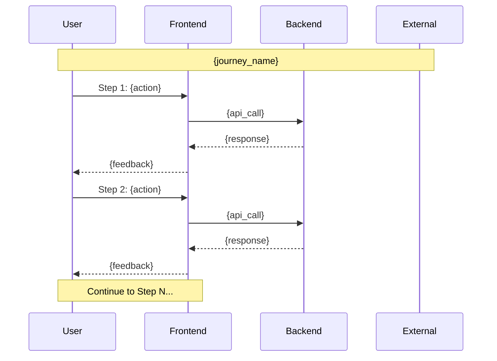
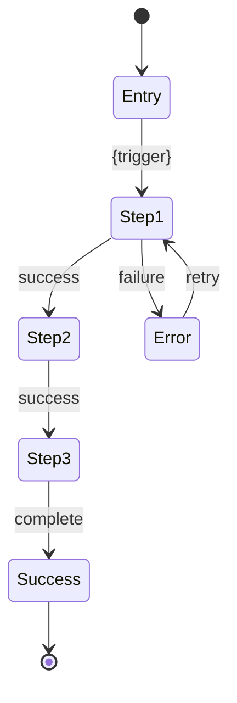

# Journey: {journey_name}

> User Journey: {journey_id} | Generated from concept.md

## Overview

| Property | Value |
|----------|-------|
| **Journey ID** | {journey_id} |
| **Name** | {journey_name} |
| **Primary Persona** | {persona_name} |
| **Trigger** | {entry_point_description} |
| **Success Outcome** | {what_success_looks_like} |
| **Estimated Duration** | {time_estimate} |

---

## Traceability

| Source | Reference |
|--------|-----------|
| Concept Journey | {journey_id} |
| Features | {EPIC-001.F01, EPIC-002.F02, ...} |
| UX Foundations | {AUTH, NAV, FEEDBACK, ...} |
| Personas | {persona_ids} |

---

## Flow Diagram



### Alternative: State Flow Diagram



---

## Step-by-Step Design

### Step 1: {step_name}

**Description**: {what_happens_in_this_step}

| Property | Value |
|----------|-------|
| Screen | {screen_name} |
| Route | {/route/path} |
| User Action | {action_description} |
| System Response | {response_description} |
| Duration | {estimated_time} |

#### Wireframe

```text
┌────────────────────────────────────────────────────────────┐
│ {Header}                                    [User Menu ▾]  │
├────────────────────────────────────────────────────────────┤
│                                                            │
│  ┌──────────────────────────────────────────────────────┐  │
│  │                                                      │  │
│  │  {Main Content for this step}                        │  │
│  │                                                      │  │
│  │  ┌─────────────┐                                     │  │
│  │  │ [Input]     │                                     │  │
│  │  └─────────────┘                                     │  │
│  │                                                      │  │
│  │  ┌─────────────────┐                                 │  │
│  │  │ Continue ►      │                                 │  │
│  │  └─────────────────┘                                 │  │
│  │                                                      │  │
│  └──────────────────────────────────────────────────────┘  │
│                                                            │
│  Progress: [●───────────]  Step 1 of N                     │
│                                                            │
└────────────────────────────────────────────────────────────┘
```

#### Edge Cases

| Condition | Handling | Screen State |
|-----------|----------|--------------|
| Network error | Show retry toast | Preserve form state |
| Validation error | Inline error messages | Highlight invalid fields |
| Session expired | Redirect to login | Save progress to draft |
| User cancels | Confirmation dialog | Option to save draft |

#### Components Used

- Button (Primary)
- Input (Text)
- Progress Indicator
- Toast (for errors)

---

### Step 2: {step_name}

**Description**: {what_happens_in_this_step}

| Property | Value |
|----------|-------|
| Screen | {screen_name} |
| Route | {/route/path} |
| User Action | {action_description} |
| System Response | {response_description} |
| Duration | {estimated_time} |

#### Wireframe

```text
<!-- Wireframe for step 2 -->
```

#### Edge Cases

| Condition | Handling | Screen State |
|-----------|----------|--------------|
<!-- Edge cases for step 2 -->

---

### Step N: {step_name}

<!-- Repeat structure for each step -->

---

## Exit Points

| Exit Type | Condition | User Intent | Handling | Recovery |
|-----------|-----------|-------------|----------|----------|
| **Success** | Journey completed | Goal achieved | Celebration animation, redirect to destination | N/A |
| **Abort** | User clicks cancel/back | Changed mind | Confirmation dialog: "Save draft?" | Resume from draft |
| **Error** | System failure | Still wants to complete | Error message with retry | Retry or contact support |
| **Timeout** | Session expired | May want to continue | Save state, re-authenticate | Resume after login |
| **Interrupt** | Browser closed | Unknown | Auto-save if possible | Prompt to resume on return |

---

## Transitions

### Page-to-Page Transitions

| From | To | Animation | Duration |
|------|-----|-----------|----------|
| {step_1_route} | {step_2_route} | Slide left + fade | 300ms |
| {step_2_route} | {step_3_route} | Slide left + fade | 300ms |
| {any_step} | Success | Scale up + confetti | 500ms |
| {any_step} | Error overlay | Fade in backdrop | 200ms |

### Micro-Interactions

| Element | Trigger | Animation |
|---------|---------|-----------|
| Continue button | Click | Press scale (0.98) |
| Form submit | Success | Checkmark morph |
| Progress bar | Step advance | Width tween |
| Error message | Appear | Slide down + fade |

---

## Accessibility

### Keyboard Navigation

| Action | Key | Result |
|--------|-----|--------|
| Next step | Enter | Submit current step |
| Previous step | Escape | Go back (with confirmation) |
| Navigate fields | Tab | Focus next input |
| Submit form | Cmd/Ctrl + Enter | Submit without clicking button |

### Screen Reader Flow

| Step | Announcement |
|------|--------------|
| Page load | "{Page title}, Step {N} of {Total}" |
| Validation error | "Error: {field}, {message}" |
| Step complete | "Step {N} complete, proceeding to {next_step_name}" |
| Journey complete | "Congratulations! {success_message}" |

### Focus Management

| Event | Focus Target |
|-------|--------------|
| Step load | First interactive element or heading |
| Error | First error message or invalid field |
| Modal open | Modal close button or first interactive element |
| Success | Success message or primary CTA |

---

## Analytics Events

| Event Name | Trigger | Properties |
|------------|---------|------------|
| `journey_{id}_started` | Entry point reached | persona, source, timestamp |
| `journey_{id}_step_{n}_entered` | Step view | step_name, previous_step, duration |
| `journey_{id}_step_{n}_completed` | Step success | step_name, duration, errors_count |
| `journey_{id}_abandoned` | Exit without completion | last_step, reason, duration |
| `journey_{id}_completed` | Success state | total_duration, steps_with_errors |

---

## Design Quality Score (DQS)

| Criterion | Score | Notes |
|-----------|-------|-------|
| Step Coverage | {score}/100 | All journey steps have wireframes |
| Edge Case Handling | {score}/100 | Error, empty, loading states |
| Transition Design | {score}/100 | Page and micro-animations defined |
| Accessibility | {score}/100 | Keyboard, screen reader, focus |
| Traceability | {score}/100 | Linked to features/foundations |
| **Overall DQS** | **{total_score}/100** | |

---

## Related Journeys

| Journey | Relationship | Shared Steps |
|---------|--------------|--------------|
| {J001} | Alternative path | Step 2, Step 3 |
| {J002} | Continues from success | Entry = this success |
