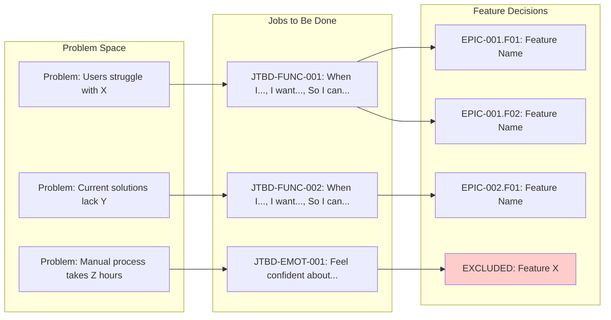

# Reasoning Trace

> **Purpose**: Visualize the decision chain from Problem → JTBD → Feature. Makes AI reasoning transparent and auditable. Answers "How did you arrive at these specific features?".

## Integration Notes

- **Depends on**: Discovery & Research, Personas (JTBD), Feature Selection Rationale
- **Feeds into**: Executive Summary (key decisions), Specification traceability
- **CQS Impact**: Transparency component — Reasoning traces criterion (15 points)

---

## Reasoning Trace Framework

### Trace Components

Each reasoning trace follows this chain:

```text
PROBLEM → PERSONA → JTBD → FEATURE → PRIORITY → VARIANT → SELECTION
```

| Component | Description | Source |
|-----------|-------------|--------|
| **PROBLEM** | Specific user problem discovered | Discovery Phase 0b |
| **PERSONA** | Which persona experiences this | Persona section |
| **JTBD** | Job-to-be-Done being addressed | Persona JTBD table |
| **FEATURE** | Feature that enables the job | Feature Hierarchy |
| **PRIORITY** | Why this priority level | Priority rationale |
| **VARIANT** | Which concept variants include it | Concept Variants |
| **SELECTION** | Why this approach over alternatives | Selection Rationale |

### Trace Types

| Type | When to Use | Chain Endpoint |
|------|-------------|----------------|
| **INCLUDE Trace** | For features selected for concept | SELECTION: SEL-XXX |
| **EXCLUDE Trace** | For deliberately excluded features | REVISIT TRIGGER |
| **DEFER Trace** | For features moved to later versions | PREREQUISITE |

---

## Template: Reasoning Trace Section

```markdown
## Reasoning Trace

<!--
  PURPOSE: Visualize the decision chain from Problem to Feature.
  This section answers: "How did you arrive at these specific features?"

  RULE: Generate at least 3 traces (more for complex concepts)
  RULE: Include at least 1 EXCLUDE trace to show deliberate scope decisions
-->

### Decision Chain Visualization



---

### Trace 1: [Primary Feature Name]

**Trace ID**: RT-001
**Decision**: INCLUDE

```text
PROBLEM: [Specific user problem from discovery]
    |
    | "Users reported spending 4+ hours/week on [task]"
    | Source: User Interview #3, #7, #12
    ↓
PERSONA: [Primary Persona Name] experiences this when [situation]
    |
    | Role: [Job title] at [Company type]
    | Context: [When this problem occurs]
    ↓
JTBD: JTBD-FUNC-001
    |
    | "When I [situation/trigger],
    |  I want to [capability/action],
    |  So I can [outcome/benefit]."
    |
    | Job Type: Functional (Primary)
    ↓
FEATURE: EPIC-001.F01 [Feature Name]
    |
    | Description: [What this feature does]
    | User Value: [Why users need this]
    ↓
PRIORITY: P1a — [Why this priority]
    |
    | Core value proposition
    | Required for primary user journey
    | 8/12 interview participants mentioned this
    ↓
VARIANT: ALL — Included in MINIMAL, BALANCED, AMBITIOUS
    |
    | Essential for MVP regardless of scope
    | Addresses primary functional JTBD
    ↓
SELECTION: SEL-001
    |
    | Chosen over: [Alternative 1], [Alternative 2]
    | Rationale: [Why this approach wins]
    | Evidence: [User data, competitive analysis]
    | Reversibility: Type 2 (can add alternatives later)
```

**Key Evidence**:
- User interviews: [X]/[Y] mentioned this problem
- Competitive gap: [Competitor] doesn't solve this well
- Market validation: [Evidence of demand]

---

### Trace 2: [Excluded Feature Name]

**Trace ID**: RT-002
**Decision**: EXCLUDE

```text
PROBLEM: [User problem that prompted consideration]
    |
    | "Some users asked for AI-powered suggestions"
    | Source: User Interview #4, #9
    ↓
PERSONA: [Secondary Persona] mentioned this in [research source]
    |
    | Less frequent request (3/12 interviews)
    | Emotional job, not functional
    ↓
JTBD: JTBD-EMOT-002
    |
    | "When I [situation],
    |  I want to [feel/experience],
    |  So I can [emotional outcome]."
    |
    | Job Type: Emotional (Secondary)
    ↓
FEATURE CONSIDERED: [Feature Name]
    |
    | Would address: "Feel confident not missing opportunities"
    | Potential differentiator vs competitors
    ↓
DECISION: EXCLUDE
    |
    ↓
RATIONALE:
    | 1. Technical risk: ML pipeline unvalidated
    | 2. Data requirement: Need 10K+ actions for training
    | 3. Scope impact: Adds 6+ weeks, 2 FTEs
    | 4. User expectation risk: Hard to roll back AI features
    ↓
ALTERNATIVE FOR USERS:
    | - Manual workflow with templates (covers 80% of use case)
    | - Rule-based suggestions (lower risk alternative)
    | - Document common patterns in help content
    ↓
REVISIT TRIGGER:
    | - [ ] After 1000 MAU (sufficient data)
    | - [ ] If competitor launches AI feature successfully
    | - [ ] If technical POC proves feasibility in <2 weeks
```

**Why This Matters**:
- Shows deliberate scope decisions (not just oversight)
- Documents path to reconsider (not permanent rejection)
- Provides alternative for users in the meantime

---

### Trace 3: [Deferred Feature Name]

**Trace ID**: RT-003
**Decision**: DEFER to Wave 4 / H2

```text
PROBLEM: [User problem]
    |
    | "[Problem description]"
    ↓
JTBD: JTBD-SOC-001
    |
    | "When I [situation],
    |  I want to [social action],
    |  So I can [social outcome]."
    |
    | Job Type: Social (Tertiary)
    ↓
FEATURE: [Feature Name]
    |
    | Addresses social job (look competent to peers)
    ↓
DECISION: DEFER to Wave [N] / H2
    |
    ↓
RATIONALE:
    | 1. Dependency: Requires Wave 3 features stable
    | 2. Priority: Social job, not primary functional
    | 3. Resources: Team capacity constraint
    ↓
PREREQUISITE:
    | - [ ] Wave 3 complete and stable
    | - [ ] Core metrics validated
    | - [ ] User feedback confirms direction
```

---

### Reasoning Summary

| Trace ID | Problem | JTBD | Feature | Decision | Key Rationale |
|:--------:|---------|------|---------|:--------:|---------------|
| RT-001 | [Problem] | JTBD-FUNC-001 | F01 | INCLUDE | Core value proposition |
| RT-002 | [Problem] | JTBD-EMOT-002 | [Feature] | EXCLUDE | Technical risk too high |
| RT-003 | [Problem] | JTBD-SOC-001 | [Feature] | DEFER | Dependency on Wave 3 |
| RT-004 | [Problem] | JTBD-FUNC-002 | F02 | INCLUDE | Competitive parity |
| RT-005 | [Problem] | JTBD-FUNC-003 | F03 | INCLUDE | Top user request |

---

### Key Decision Points

<!--
  Document the 3-5 most important decisions that shaped this concept.
  These are the "pivotal moments" in the reasoning chain.
-->

1. **[Decision 1 — e.g., "Chose email/password over OAuth-only"]**

   We chose [approach A] over [approach B] because [evidence/rationale].

   - **Impact**: [What this enabled/prevented]
   - **Reversibility**: Type 2 (can add OAuth later without breaking existing)
   - **Evidence**: 8/12 B2B users prefer traditional auth for work tools

2. **[Decision 2 — e.g., "Excluded AI suggestions from MVP"]**

   We excluded [feature] despite [consideration] because [rationale].

   - **Impact**: Gap in JTBD-EMOT-002 coverage; mitigated by templates
   - **Revisit**: After 1000 MAU or competitor launch
   - **Risk if wrong**: Users may perceive product as "basic"

3. **[Decision 3 — e.g., "Prioritized Feature X over Feature Y"]**

   We prioritized [feature X] over [feature Y] because [rationale].

   - **Evidence**: User interview data, competitive analysis
   - **Risk**: [What could invalidate this decision]
   - **Validation plan**: [How we'll confirm this was right]

```

---

## Validation Checklist

Before finalizing Reasoning Trace section:

- [ ] At least 3 reasoning traces documented (RT-001, RT-002, RT-003)
- [ ] At least 1 EXCLUDE trace (shows deliberate scope decisions)
- [ ] Each trace has complete chain (Problem → Selection/Revisit)
- [ ] Mermaid diagram visualizes problem → feature connections
- [ ] Evidence cited for key decisions (not just assertions)
- [ ] JTBD IDs match those in Persona section
- [ ] Feature IDs match those in Feature Hierarchy
- [ ] Reasoning Summary table includes all traces
- [ ] 3-5 Key Decision Points documented with impact/reversibility

---

## Trace ID Format

Format: `RT-NNN` where NNN is sequential (001, 002, 003...)

```text
RT-001  ← First reasoning trace (usually primary P1a feature)
RT-002  ← Second trace (often an EXCLUDE to show scope discipline)
RT-003  ← Third trace
...
```

Cross-references:
- `JTBD-FUNC-001` → Persona JTBD table
- `SEL-001` → Selection Rationale section
- `EPIC-001.F01` → Feature Hierarchy

---

## Integration with Other Sections

### Executive Summary Enhancement

Key Decision Points should be summarized in Executive Summary:

```markdown
### Our Approach

[2-3 sentences describing approach]

**Key decisions**:
1. [Decision 1 — 1-line summary]
2. [Decision 2 — 1-line summary]

See "Reasoning Trace" section for full decision chains.
```

### Specification Traceability

When `/speckit.specify` runs, traces carry forward:

```markdown
## Traceability

| Trace ID | Concept ID | JTBD | Requirement |
|----------|------------|------|-------------|
| RT-001 | EPIC-001.F01 | JTBD-FUNC-001 | FR-001 |
```

### CQS Scoring Integration

Reasoning Trace contributes to Transparency component:

| Criterion | Points | Check |
|-----------|:------:|-------|
| At least 3 reasoning traces | 15 | RT-001, RT-002, RT-003 present |
| At least 1 EXCLUDE trace | 10 | Shows deliberate scope decisions |
| Key Decision Points documented | 10 | 3-5 pivotal decisions with evidence |
