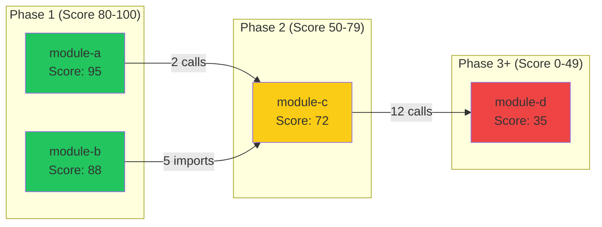

# Module Coupling Analysis for Migration Planning

> **Purpose**: Detect module dependencies and score migration readiness for phased rollout.

## Thresholds & Constants

| Constant | Value | Description |
|----------|:-----:|-------------|
| `TIGHT_COUPLING_THRESHOLD` | 10 | Calls/imports indicating tight coupling |
| `LOOSE_COUPLING_THRESHOLD` | 3 | Calls/imports indicating loose coupling |
| `PHASE_1_MIN_SCORE` | 80 | Minimum score for Phase 1 migration |
| `PHASE_2_MIN_SCORE` | 50 | Minimum score for Phase 2 migration |

---

## Algorithm 1: MODULE_DISCOVERY

```
ALGORITHM MODULE_DISCOVERY(root_path, patterns)
  modules = []
  FOR each directory in WALK(root_path):
    IF directory contains matching files:
      module = {
        name: RELATIVE_PATH(directory, root_path),
        files: GLOB(directory, patterns),
        entry_points: DETECT_ENTRY_POINTS(directory),
        size_loc: SUM(LINE_COUNT(file) for file in files)
      }
      APPEND(modules, module)
  RETURN modules
```

| Language | Module Indicator |
|----------|------------------|
| Python | `__init__.py` presence |
| TypeScript/JS | `package.json` or `index.ts` |
| Java/Go | Package directory / `go.mod` |

---

## Algorithm 2: DEPENDENCY_EXTRACTION

```
ALGORITHM DEPENDENCY_EXTRACTION(module)
  dependencies = []
  FOR each file in module.files:
    ast = PARSE_AST(file)
    FOR each import_stmt in ast.imports:
      APPEND(dependencies, {
        source: module.name, target: RESOLVE_MODULE(import_stmt.path),
        type: "IMPORT", symbol: import_stmt.symbol
      })
    FOR each call_expr in ast.function_calls:
      IF IS_EXTERNAL_CALL(call_expr):
        APPEND(dependencies, {
          source: module.name, target: RESOLVE_MODULE(call_expr.callee),
          type: "CALL", symbol: call_expr.function_name
        })
  RETURN dependencies
```

---

## Algorithm 3: COUPLING_CLASSIFICATION

```
ALGORITHM COUPLING_CLASSIFICATION(module, all_dependencies)
  outgoing = COUNT(dep WHERE dep.source == module.name)
  incoming = COUNT(dep WHERE dep.target == module.name)
  total = outgoing + incoming

  IF total >= 10: level = "TIGHT", penalty = (total - 10) * 5
  ELSE IF total >= 3: level = "LOOSE", penalty = (total - 3) * 2
  ELSE: level = "MINIMAL", penalty = 0

  RETURN { level, outgoing, incoming, total, penalty: MIN(penalty, 50) }
```

| Level | Range | Migration Impact | Action |
|-------|:-----:|------------------|--------|
| MINIMAL | 0-2 | Low risk | Migrate early |
| LOOSE | 3-9 | Moderate risk | Plan interface contracts |
| TIGHT | 10+ | High risk | Refactor first |

---

## Algorithm 4: MIGRATION_CANDIDATE_SCORING

```
ALGORITHM MIGRATION_CANDIDATE_SCORING(module, coupling, metrics)
  score = 100
  score -= coupling.penalty                          // Coupling: 0-50 pts
  IF module.size_loc > 5000: score -= 15             // Size penalty
  ELSE IF module.size_loc > 2000: score -= 10
  ELSE IF module.size_loc > 500: score -= 5
  IF metrics.test_coverage >= 80: score += 10       // Test coverage
  ELSE IF metrics.test_coverage < 50: score -= 10
  IF HAS_CIRCULAR_DEPS(module): score -= 20         // Circular deps
  IF HAS_API_DOCS(module): score += 5               // Documentation
  RETURN CLAMP(score, 0, 100)
```

| Score | Phase | Timeline | Approach |
|:-----:|:-----:|----------|----------|
| 80-100 | Phase 1 | Immediate | Direct migration |
| 50-79 | Phase 2 | After Phase 1 | Requires preparation |
| 0-49 | Phase 3+ | Deferred | Needs refactoring |

---

## Algorithm 5: INSTABILITY_CALCULATION

```
ALGORITHM INSTABILITY_CALCULATION(module, all_dependencies)
  Ca = COUNT(dep WHERE dep.target == module.name)  // Afferent (incoming)
  Ce = COUNT(dep WHERE dep.source == module.name)  // Efferent (outgoing)
  IF (Ca + Ce) == 0: RETURN 0.0
  RETURN Ce / (Ca + Ce)  // Range: 0.0 (stable) to 1.0 (unstable)
```

| Instability | Classification | Strategy |
|:-----------:|---------------|----------|
| 0.0-0.3 | Stable (core) | Migrate last |
| 0.3-0.7 | Balanced | Standard migration |
| 0.7-1.0 | Unstable (peripheral) | Migrate first |

---

## Mermaid Diagram Template



```
ALGORITHM GENERATE_MERMAID(modules, dependencies)
  output = "graph LR\n"
  FOR each phase in [1, 2, 3]:
    output += SUBGRAPH_HEADER(phase)
    FOR each module WHERE GET_PHASE(module) == phase:
      output += NODE(module.name, module.score)
  FOR each dep in dependencies:
    output += EDGE(dep.source, dep.target, COUNT_SAME(src, tgt))
  FOR each module: output += STYLE(module.name, PHASE_COLOR(phase))
  RETURN output
```

---

## Output Format

| Module | LOC | Coupling | Instability | Score | Phase |
|--------|:---:|:--------:|:-----------:|:-----:|:-----:|
| [name] | [X] | MINIMAL/LOOSE/TIGHT | [0.0-1.0] | [0-100] | [1/2/3+] |
