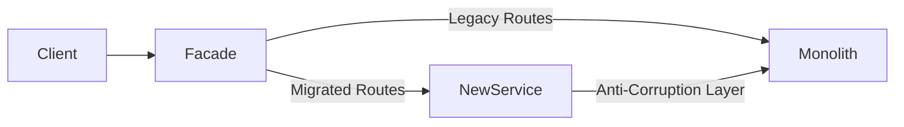

# Strangler Fig Pattern Implementation Guide

## STRANGLER_FIG_OVERVIEW

The Strangler Fig pattern enables incremental migration from legacy systems to modern architectures by gradually replacing functionality while maintaining system availability.

### Pattern Visualization



### When to Use

| Scenario | Suitability |
|----------|-------------|
| Large monolith with clear module boundaries | High |
| Need zero-downtime migration | High |
| Team lacks full system knowledge | Medium |
| Tightly coupled spaghetti code | Low - refactor first |
| Small codebase (<10K LOC) | Low - rewrite instead |

### Key Principles

1. **Never break existing functionality** - old paths must work until fully migrated
2. **Incremental value delivery** - each phase delivers working features
3. **Reversibility** - maintain rollback capability at every stage

---

## BOUNDARY_IDENTIFICATION

### Step 1: Domain Analysis

Identify bounded contexts and their dependencies:

```markdown
## Candidate Modules for Extraction

| Module | Dependencies (In) | Dependencies (Out) | Extraction Difficulty |
|--------|-------------------|--------------------|-----------------------|
| [Module A] | [List callers] | [List callees] | Low/Medium/High |
| [Module B] | [List callers] | [List callees] | Low/Medium/High |
```

### Step 2: Interface Discovery

Document existing integration points:

- **Synchronous APIs**: REST endpoints, RPC calls, direct method invocations
- **Asynchronous Events**: Message queues, webhooks, scheduled jobs
- **Shared Data**: Database tables, caches, file systems

### Step 3: Seam Identification

Find natural seams where extraction is cleanest:

- [ ] Module has well-defined public API
- [ ] Data ownership is clear (single source of truth)
- [ ] Cross-cutting concerns are isolated
- [ ] Testing boundaries exist

---

## PHASE_PLANNING

### Extraction Phase Template

```markdown
## Phase [N]: [Module Name] Extraction

**Duration**: [X weeks]
**Risk Level**: Low/Medium/High
**Rollback Time**: [Y minutes]

### Scope
- Endpoints: [List of routes being migrated]
- Data: [Tables/collections being owned]
- Events: [Messages produced/consumed]

### Prerequisites
- [ ] Phase [N-1] complete and stable
- [ ] Feature flags configured
- [ ] Monitoring dashboards ready
- [ ] Rollback procedures tested

### Success Criteria
- [ ] All traffic routed to new service
- [ ] Latency within [X]ms of baseline
- [ ] Error rate below [Y]%
- [ ] Legacy code paths disabled
```

### Recommended Phase Ordering

1. **Low-risk, high-value** - Build confidence with quick wins
2. **Shared services** - Extract common utilities (auth, logging)
3. **Domain modules** - Core business logic by bounded context
4. **Data layer** - Database decomposition (most complex, do last)

---

## FACADE_IMPLEMENTATION

### Routing Strategy

```markdown
## Facade Configuration

### Route Definitions
| Path Pattern | Target | Condition |
|--------------|--------|-----------|
| `/api/v1/orders/*` | NewOrderService | feature_flag: orders_v2 |
| `/api/v1/orders/*` | Monolith | default |
| `/api/v1/users/*` | Monolith | all traffic |

### Header Propagation
- X-Request-ID: Pass through for tracing
- X-User-Context: Decode and forward claims
- X-Feature-Flags: Include for conditional routing
```

### Anti-Corruption Layer

When new service needs legacy data:

- Transform legacy formats to clean domain models
- Hide legacy complexity behind clean interfaces
- Log all translations for debugging
- Plan for eventual removal

---

## TRAFFIC_SHIFTING

### Gradual Rollout Stages

| Stage | Traffic % | Duration | Validation |
|-------|-----------|----------|------------|
| Canary | 1-5% | 1-2 days | Error rates, latency |
| Early Adopters | 10-25% | 3-5 days | Functional correctness |
| Majority | 50% | 1 week | Performance at scale |
| Full Migration | 100% | Ongoing | Complete feature parity |

### Rollout Checklist

- [ ] Baseline metrics captured from legacy system
- [ ] Alerts configured for anomaly detection
- [ ] Shadow mode validated (dual-write, compare results)
- [ ] Rollback automation tested
- [ ] On-call team briefed on escalation path

### Rollback Triggers

Automatic rollback if any threshold exceeded:

- Error rate > [X]% above baseline
- P99 latency > [Y]ms above baseline
- Data inconsistency detected
- Dependent service degradation

---

## DEAD_CODE_REMOVAL

### Cleanup Checklist

After 100% traffic migration and stabilization period:

- [ ] Remove legacy route handlers
- [ ] Delete unused database tables (after backup)
- [ ] Remove feature flags for completed migrations
- [ ] Update documentation and runbooks
- [ ] Archive legacy code with migration notes
- [ ] Clean up monitoring dashboards

### Verification Before Removal

```markdown
## Dead Code Verification

| Component | Last Access | Dependencies | Safe to Remove |
|-----------|-------------|--------------|----------------|
| [Legacy endpoint] | [Date] | [List] | Yes/No |
| [Database table] | [Date] | [List] | Yes/No |
| [Batch job] | [Date] | [List] | Yes/No |
```

### Retention Policy

- **Code**: Archive in separate branch for 90 days
- **Data**: Backup and retain per compliance requirements
- **Logs**: Maintain audit trail of migration decisions
