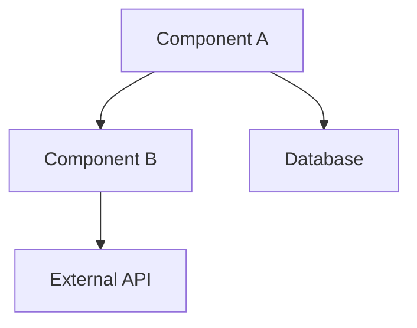

## User Input

```text
$ARGUMENTS
```

## Purpose

This skill deeply analyzes an existing codebase to document current behavior, dependencies, and architecture. Essential for brownfield development where you need to understand what exists before modifying it.

## When to Use

- Before `/speckit.baseline` to understand existing code
- During `/speckit.analyze` for code traceability
- When extending existing features via `/speckit.extend`
- For brownfield change specifications

## Execution Steps

### 1. Determine Exploration Scope

Parse from arguments or context:
- **Target**: specific file, directory, or pattern
- **Mode**:
  - `behavior` - document what code does
  - `dependencies` - trace imports and calls
  - `architecture` - map component structure
  - `full` - all of the above

### 2. Use Task Tool with Explore Agent

For comprehensive exploration, delegate to the built-in Explore agent:

```
Task(subagent_type="Explore", prompt="
Thoroughly analyze [TARGET] in this codebase:

1. Find all files matching [PATTERN]
2. Trace the execution flow for [FUNCTIONALITY]
3. Identify external dependencies and integrations
4. Document data models and schemas
5. Map component relationships

Return:
- File inventory with purposes
- Dependency graph
- Key functions/classes and their roles
- Integration points with external systems
")
```

### 3. Behavior Documentation

For each significant component found:

```markdown
## Component: [NAME]

**Location**: [FILE_PATH]
**Type**: [Service/Controller/Model/Utility/etc.]

### Current Behavior
- [What it does in user terms]
- [Key functionality]

### Dependencies
- **Internal**: [other components it uses]
- **External**: [APIs, databases, services]

### Data Flow
```
[Input] → [Processing] → [Output]
```

### Limitations
- [Known issues]
- [Technical debt]
- [Performance concerns]
```

### 4. Generate Exploration Report

Output for `/speckit.baseline`:

```markdown
# Codebase Exploration: [TARGET]

**Date**: [DATE]
**Scope**: [FILES/DIRECTORIES ANALYZED]

## Architecture Overview



## Component Inventory

| Component | Location | Purpose | Dependencies |
|-----------|----------|---------|--------------|
| [Name] | [Path] | [Purpose] | [Deps] |

## Current Behaviors (CB)

| CB ID | Component | Behavior | Code Location |
|-------|-----------|----------|---------------|
| CB-001 | [Name] | [What it does] | [file:line] |

## Integration Points

| Integration | Type | Protocol | Status |
|-------------|------|----------|--------|
| [Name] | API/DB/Queue | REST/SQL/etc. | Active/Deprecated |

## Technical Observations

### Strengths
- [What's well-designed]

### Concerns
- [Technical debt]
- [Complexity areas]
- [Missing tests]

## Recommended for Baseline

Based on exploration, these components should be captured in baseline.md:
1. [Component] - [reason]
2. [Component] - [reason]
```

## Integration with Spec Kit

This skill feeds into:
- `/speckit.baseline` → populates CB-xxx entries
- `/speckit.analyze` Pass N → code traceability validation
- `/speckit.merge` → identifies integration points

## Example Invocation

```
User: explore the authentication module
Skill: Analyzes auth/, identifies login flow, OAuth integration, session management, documents all behaviors
```
