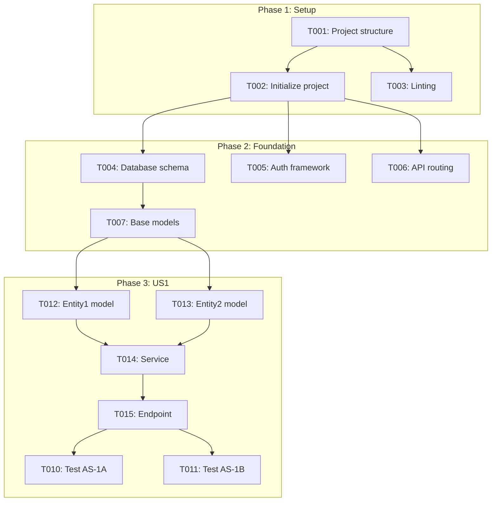

---

description: "Task list template for feature implementation"
---

# Tasks: [FEATURE NAME]

**Input**: Design documents from `/specs/[###-feature-name]/`
**Prerequisites**: plan.md (required), spec.md (required for user stories), research.md, data-model.md, contracts/

**Tests**: Tests are REQUIRED for all Acceptance Scenarios (AS-xxx) marked "Requires Test = YES" in spec.md. Use `[TEST:AS-xxx]` markers for test tasks. Use `[NO-TEST:AS-xxx]` with justification if intentionally skipping a test.

**Organization**: Tasks are grouped by user story to enable independent implementation and testing of each story.

## Format: `[ID] [P?] [Story] [Markers] Description`

- **[P]**: Can run in parallel (different files, no dependencies)
- **[Story]**: Which user story this task belongs to (e.g., US1, US2, US3)
- **[DEP:T001,T002]**: Explicit task dependencies (required before this task)
- **[FR:FR-001]**: Links to Functional Requirements from spec.md
- **[VR:VR-001]**: Links to Visual Requirements from spec.md (for UI features)
- **[IR:IR-001]**: Links to Interaction Requirements from spec.md (for UI features)
- **[TEST:AS-1A]**: Test task links to Acceptance Scenario ID
- **[CHG:CHG-001]**: *(brownfield)* Links to Change Request from Change Specification
- **[MIG:MIG-001]**: *(brownfield)* Migration phase implementation task
- **[REG:PB-001]**: *(brownfield)* Regression test for Preserved Behavior
- **[ROLLBACK:MIG-001]**: *(brownfield)* Rollback procedure for migration phase
- **[DEP:PKG-001]**: Links to Package Dependency from plan.md Dependency Registry
- **[DEP:API-001]**: Links to External API Dependency from plan.md Dependency Registry
- **[DEP:FW-001]**: Links to Framework Dependency from plan.md Dependency Registry
- **[APIDOC:url]**: Direct link to specific API documentation section (for complex integrations)
- **[VERSION:X.Y.Z]**: Explicit version constraint when task requires specific version
- Include exact file paths in descriptions

### Marker Examples

```markdown
# Implementation task with dependencies and FR link
- [ ] T014 [US1] [DEP:T012,T013] [FR:FR-001] Implement UserService in src/services/user.py

# Test task linking to Acceptance Scenario
- [ ] T020 [US1] [TEST:AS-1A] Test "user can register with email" in tests/integration/test_registration.py

# Parallel task with no dependencies
- [ ] T012 [P] [US1] [FR:FR-001] Create User model in src/models/user.py
```

### Brownfield Marker Examples *(for projects with Change Specification)*

```markdown
# Change implementation task (MODIFY delta type)
- [ ] T040 [US1] [CHG:CHG-001] [FR:FR-001] Refactor AuthService to support OAuth2 in src/services/auth.py

# Migration phase implementation
- [ ] T050 [MIG:MIG-001] Enable dual-auth mode via feature flag in src/config/features.py

# Rollback procedure for migration phase
- [ ] T051 [ROLLBACK:MIG-001] Create rollback script to disable OAuth2 and restore session auth

# Regression test for preserved behavior
- [ ] T060 [REG:PB-001] Add regression test for existing logout flow in tests/regression/test_logout.py
```

### Dependency Marker Examples *(for tasks using external APIs/packages)*

```markdown
# Task using external API - agent must verify against docs
- [ ] T025 [US2] [FR:FR-005] [DEP:API-001] [APIDOC:https://stripe.com/docs/api/charges/create] Implement payment charge in src/services/payment.py

# Task with specific package version requirement
- [ ] T030 [US3] [FR:FR-007] [DEP:PKG-002] [VERSION:^5.0.0] Create React Query hooks in src/hooks/useData.ts

# Task using framework-specific feature
- [ ] T035 [US4] [FR:FR-009] [DEP:FW-001] Implement Server Components in src/app/dashboard/page.tsx

# Task with multiple dependencies
- [ ] T045 [US5] [FR:FR-010] [DEP:PKG-001,API-002] Integrate S3 upload with presigned URLs in src/services/storage.py
```

## Path Conventions

- **Single project**: `src/`, `tests/` at repository root
- **Web app**: `backend/src/`, `frontend/src/`
- **Mobile**: `api/src/`, `ios/src/` or `android/src/`
- Paths shown below assume single project - adjust based on plan.md structure

<!-- 
  ============================================================================
  IMPORTANT: The tasks below are SAMPLE TASKS for illustration purposes only.
  
  The /speckit.tasks command MUST replace these with actual tasks based on:
  - User stories from spec.md (with their priorities P1, P2, P3...)
  - Feature requirements from plan.md
  - Entities from data-model.md
  - Endpoints from contracts/
  
  Tasks MUST be organized by user story so each story can be:
  - Implemented independently
  - Tested independently
  - Delivered as an MVP increment
  
  DO NOT keep these sample tasks in the generated tasks.md file.
  ============================================================================
-->

## Phase 1: Setup (Shared Infrastructure)

**Purpose**: Project initialization and basic structure

- [ ] T001 Create project structure per implementation plan
- [ ] T002 [DEP:T001] Initialize [language] project with [framework] dependencies
- [ ] T003 [P] [DEP:T001] Configure linting and formatting tools

---

## Phase 2: Foundational (Blocking Prerequisites)

**Purpose**: Core infrastructure that MUST be complete before ANY user story can be implemented

**⚠️ CRITICAL**: No user story work can begin until this phase is complete

Examples of foundational tasks (adjust based on your project):

- [ ] T004 [DEP:T002] Setup database schema and migrations framework
- [ ] T005 [P] [DEP:T002] Implement authentication/authorization framework
- [ ] T006 [P] [DEP:T002] Setup API routing and middleware structure
- [ ] T007 [DEP:T004] Create base models/entities that all stories depend on
- [ ] T008 [DEP:T002] Configure error handling and logging infrastructure
- [ ] T009 [P] [DEP:T002] Setup environment configuration management

**Checkpoint**: Foundation ready - proceed to Design Foundation (if UI feature) or user stories

---

## Phase 2b: Design Foundation *(for UI features)* 🎨

<!--
  Include this phase ONLY if the feature has significant user interface.
  Skip for API-only, CLI, or backend features.
  Depends on Phase 2 completion.
  Reference: design.md from /speckit.design command
-->

**Purpose**: Visual infrastructure that user stories depend on for consistent UI

**⚠️ CRITICAL FOR UI FEATURES**: No UI component work can begin until design tokens are established

**VR/IR Requirements Covered**: VR-001, VR-002, IR-001, IR-002

### Design Token Tasks

- [ ] T0XX [P] [DEP:T002] Create design tokens in src/styles/tokens.css (colors, spacing, typography)
- [ ] T0XX [P] [DEP:T002] Configure theme provider/context in src/providers/theme.tsx (if applicable)
- [ ] T0XX [DEP:T0XX] Setup CSS variable scoping for light/dark mode support

### Component Foundation Tasks

- [ ] T0XX [P] [DEP:T002] Create component library structure in src/components/ui/
- [ ] T0XX [DEP:T0XX] [VR:VR-001] Create base Button component with all states in src/components/ui/Button.tsx
- [ ] T0XX [DEP:T0XX] [VR:VR-002] Create base Input component with validation states in src/components/ui/Input.tsx
- [ ] T0XX [DEP:T0XX] Create layout primitives (Stack, Grid, Container) in src/components/ui/Layout.tsx
- [ ] T0XX [DEP:T0XX] Configure responsive breakpoints in src/styles/breakpoints.css

### Accessibility Foundation Tasks

- [ ] T0XX [P] [DEP:T002] Setup focus management utilities in src/utils/focus.ts
- [ ] T0XX [P] [DEP:T002] Create skip link component for keyboard navigation
- [ ] T0XX [DEP:T0XX] Configure screen reader live regions

### Animation Foundation Tasks (if applicable)

- [ ] T0XX [P] [DEP:T002] [IR:IR-001] Setup animation utilities/library
- [ ] T0XX [DEP:T0XX] Create transition presets (fade, slide, scale)
- [ ] T0XX [DEP:T0XX] Configure reduced-motion media query support

**Checkpoint**: Design foundation ready - UI feature work can begin with consistent tokens and primitives

---

## Phase 2c: Migration Foundation *(brownfield only)* 🔄

<!--
  Include this phase ONLY for brownfield projects with Change Specification section.
  Skip for greenfield projects.
  Depends on Phase 2 completion.
  Reference: Change Specification and Migration Plan from spec.md
-->

**Purpose**: Establish migration infrastructure, regression protection, and rollback capabilities

**⚠️ CRITICAL FOR MIGRATIONS**: No change implementation can begin until:
1. Baseline behaviors are documented and tested
2. Feature flags (if applicable) are configured
3. Rollback procedures are defined and tested

**Change Type**: [Enhancement | Refactor | Migration | Bugfix | Performance | Security]

**Migration Strategy**: [Big Bang | Parallel Run | Strangler Fig | Feature Flag] *(if Migration type)*

### Regression Test Tasks (Preserved Behaviors)

> **NOTE**: These tests MUST pass BEFORE and AFTER changes to ensure preserved behaviors remain intact

- [ ] T0XX [REG:PB-001] Regression test for [preserved behavior 1] in tests/regression/test_[name].py
- [ ] T0XX [REG:PB-002] Regression test for [preserved behavior 2] in tests/regression/test_[name].py

### Migration Infrastructure Tasks *(if Change Type = Migration)*

- [ ] T0XX [MIG:MIG-001] Create feature flag for [migration phase 1] in src/config/features.py
- [ ] T0XX [MIG:MIG-001] Enable dual-mode operation for [component] in src/[path]
- [ ] T0XX [ROLLBACK:MIG-001] Create rollback procedure for migration phase 1

### Change Baseline Tasks

- [ ] T0XX [CHG:CHG-001] Document current behavior of [component] for CB-001
- [ ] T0XX [P] Capture performance baseline metrics for rollback criteria validation

**Checkpoint**: Migration foundation ready - change implementation can begin with rollback protection

---

## Phase 3: User Story 1 - [Title] (Priority: P1a) 🎯 MVP

**Goal**: [Brief description of what this story delivers]

**Concept Reference**: [EPIC-001.F01.S01 or "N/A"]

**Independent Test**: [How to verify this story works on its own]

**Acceptance Scenarios Covered**: AS-1A, AS-1B

### Tests for User Story 1 (OPTIONAL - only if tests requested) ⚠️

> **NOTE: Write these tests FIRST, ensure they FAIL before implementation**

- [ ] T010 [P] [US1] [TEST:AS-1A] Contract test for [endpoint] in tests/contract/test_[name].py
- [ ] T011 [P] [US1] [TEST:AS-1B] Integration test for [user journey] in tests/integration/test_[name].py

### Implementation for User Story 1

- [ ] T012 [P] [US1] [FR:FR-001] Create [Entity1] model in src/models/[entity1].py
- [ ] T013 [P] [US1] [FR:FR-001] Create [Entity2] model in src/models/[entity2].py
- [ ] T014 [US1] [DEP:T012,T013] [FR:FR-001,FR-002] Implement [Service] in src/services/[service].py
- [ ] T015 [US1] [DEP:T014] [FR:FR-002] Implement [endpoint/feature] in src/[location]/[file].py
- [ ] T016 [US1] [DEP:T015] [FR:FR-002] Add validation and error handling
- [ ] T017 [US1] [DEP:T015] Add logging for user story 1 operations

**Checkpoint**: At this point, User Story 1 should be fully functional and testable independently

---

## Phase 4: User Story 2 - [Title] (Priority: P1b)

**Goal**: [Brief description of what this story delivers]

**Concept Reference**: [EPIC-001.F01.S02 or "N/A"]

**Independent Test**: [How to verify this story works on its own]

**Acceptance Scenarios Covered**: AS-2A

### Tests for User Story 2 (OPTIONAL - only if tests requested) ⚠️

- [ ] T018 [P] [US2] [TEST:AS-2A] Contract test for [endpoint] in tests/contract/test_[name].py
- [ ] T019 [P] [US2] [TEST:AS-2A] Integration test for [user journey] in tests/integration/test_[name].py

### Implementation for User Story 2

- [ ] T020 [P] [US2] [FR:FR-003] Create [Entity] model in src/models/[entity].py
- [ ] T021 [US2] [DEP:T020] [FR:FR-003] Implement [Service] in src/services/[service].py
- [ ] T022 [US2] [DEP:T021] [FR:FR-003] Implement [endpoint/feature] in src/[location]/[file].py
- [ ] T023 [US2] [DEP:T022,T015] Integrate with User Story 1 components (if needed)

**Checkpoint**: At this point, User Stories 1 AND 2 should both work independently

---

## Phase 5: User Story 3 - [Title] (Priority: P2a)

**Goal**: [Brief description of what this story delivers]

**Concept Reference**: [EPIC-001.F02.S01 or "N/A"]

**Independent Test**: [How to verify this story works on its own]

**Acceptance Scenarios Covered**: AS-3A

### Tests for User Story 3 (OPTIONAL - only if tests requested) ⚠️

- [ ] T024 [P] [US3] [TEST:AS-3A] Contract test for [endpoint] in tests/contract/test_[name].py
- [ ] T025 [P] [US3] [TEST:AS-3A] Integration test for [user journey] in tests/integration/test_[name].py

### Implementation for User Story 3

- [ ] T026 [P] [US3] [FR:FR-004] Create [Entity] model in src/models/[entity].py
- [ ] T027 [US3] [DEP:T026] [FR:FR-004] Implement [Service] in src/services/[service].py
- [ ] T028 [US3] [DEP:T027] [FR:FR-004] Implement [endpoint/feature] in src/[location]/[file].py

**Checkpoint**: All user stories should now be independently functional

---

[Add more user story phases as needed, following the same pattern]

---

## Phase N: Polish & Cross-Cutting Concerns

**Purpose**: Improvements that affect multiple user stories

- [ ] TXXX [P] Documentation updates in docs/
- [ ] TXXX Code cleanup and refactoring
- [ ] TXXX Performance optimization across all stories
- [ ] TXXX [P] Additional unit tests (if requested) in tests/unit/
- [ ] TXXX Security hardening
- [ ] TXXX Run quickstart.md validation

---

## Dependencies & Execution Order

### Phase Dependencies

- **Setup (Phase 1)**: No dependencies - can start immediately
- **Foundational (Phase 2)**: Depends on Setup completion - BLOCKS all user stories
- **Design Foundation (Phase 2b)**: *For UI features* - Depends on Phase 2, BLOCKS UI component work
- **Migration Foundation (Phase 2c)**: *For brownfield projects* - Depends on Phase 2, BLOCKS change implementation
  - Regression tests for preserved behaviors must pass before changes
  - Feature flags and rollback procedures must be in place
- **User Stories (Phase 3+)**: All depend on Foundational phase completion (and Design Foundation for UI features, Migration Foundation for brownfield)
  - User stories can then proceed in parallel (if staffed)
  - Or sequentially in priority order (P1 → P2 → P3)
- **Polish (Final Phase)**: Depends on all desired user stories being complete

### User Story Dependencies

- **User Story 1 (P1)**: Can start after Foundational (Phase 2) - No dependencies on other stories
- **User Story 2 (P2)**: Can start after Foundational (Phase 2) - May integrate with US1 but should be independently testable
- **User Story 3 (P3)**: Can start after Foundational (Phase 2) - May integrate with US1/US2 but should be independently testable

### Within Each User Story

- Tests (if included) MUST be written and FAIL before implementation
- Models before services
- Services before endpoints
- Core implementation before integration
- Story complete before moving to next priority

### Parallel Opportunities

- All Setup tasks marked [P] can run in parallel
- All Foundational tasks marked [P] can run in parallel (within Phase 2)
- Once Foundational phase completes, all user stories can start in parallel (if team capacity allows)
- All tests for a user story marked [P] can run in parallel
- Models within a story marked [P] can run in parallel
- Different user stories can be worked on in parallel by different team members

---

## Parallel Example: User Story 1

```bash
# Launch all tests for User Story 1 together (if tests requested):
Task: "Contract test for [endpoint] in tests/contract/test_[name].py"
Task: "Integration test for [user journey] in tests/integration/test_[name].py"

# Launch all models for User Story 1 together:
Task: "Create [Entity1] model in src/models/[entity1].py"
Task: "Create [Entity2] model in src/models/[entity2].py"
```

---

## Implementation Strategy

### MVP First (User Story 1 Only)

1. Complete Phase 1: Setup
2. Complete Phase 2: Foundational (CRITICAL - blocks all stories)
3. Complete Phase 3: User Story 1
4. **STOP and VALIDATE**: Test User Story 1 independently
5. Deploy/demo if ready

### Incremental Delivery

1. Complete Setup + Foundational → Foundation ready
2. Add User Story 1 → Test independently → Deploy/Demo (MVP!)
3. Add User Story 2 → Test independently → Deploy/Demo
4. Add User Story 3 → Test independently → Deploy/Demo
5. Each story adds value without breaking previous stories

### Parallel Team Strategy

With multiple developers:

1. Team completes Setup + Foundational together
2. Once Foundational is done:
   - Developer A: User Story 1
   - Developer B: User Story 2
   - Developer C: User Story 3
3. Stories complete and integrate independently

---

---

## Dependency Graph

<!--
  This graph is auto-generated by /speckit.tasks from [DEP:] markers.
  It shows the task execution order and parallel opportunities.
-->



---

## Requirements Traceability Matrix (RTM)

<!--
  This matrix links:
  - Functional Requirements (FR) from spec.md
  - Implementation tasks that fulfill each FR
  - Test tasks that verify acceptance scenarios

  Status: ❌ Not started | 🔄 In progress | ✅ Complete
-->

| Requirement | Description | Impl Tasks | Test Tasks | Status |
|-------------|-------------|------------|------------|--------|
| FR-001 | [System MUST...] | T012, T013, T014 | T010 | ❌ |
| FR-002 | [System MUST...] | T014, T015, T016 | T011 | ❌ |
| FR-003 | [Users MUST...] | T020, T021, T022 | T018, T019 | ❌ |
| FR-004 | [System MUST...] | T026, T027, T028 | T024, T025 | ❌ |

---

## Acceptance Scenario Coverage

<!--
  Maps each Acceptance Scenario (AS) to its test task.
  Ensures every AS has explicit test coverage.
-->

| Scenario ID | Description | Test Task | Status |
|-------------|-------------|-----------|--------|
| AS-1A | [Given/When/Then summary] | T010 | ❌ |
| AS-1B | [Given/When/Then summary] | T011 | ❌ |
| AS-2A | [Given/When/Then summary] | T018, T019 | ❌ |
| AS-3A | [Given/When/Then summary] | T024, T025 | ❌ |

---

## Test Traceability Matrix (TTM)

<!--
  Bidirectional traceability between specs and tests.
  - Links each testable spec ID (AS/EC) to its test task and implementation
  - Enables Pass W validation in /speckit.analyze
  - Updated during implementation as tests are written

  Columns:
  - Spec ID: AS-xxx or EC-xxx from spec.md
  - Type: AS (Acceptance Scenario) or EC (Edge Case)
  - Requires Test: YES/NO from spec.md (AS only) or CRITICAL flag (EC)
  - Test Task: Task ID with [TEST:xxx] marker
  - Impl Task: Related implementation task
  - Test File: Path to test file once written
  - Status: ❌ No test | ⏭️ Skipped [NO-TEST:] | 🔄 In progress | ✅ Passing
-->

| Spec ID | Type | Requires Test | Test Task | Impl Task | Test File | Status |
|---------|------|---------------|-----------|-----------|-----------|--------|
| AS-1A | AS | YES | T010 | T003-T005 | tests/... | ❌ |
| AS-1B | AS | YES | T011 | T006-T009 | tests/... | ❌ |
| AS-2A | AS | YES | T018, T019 | T012-T017 | tests/... | ❌ |
| AS-3A | AS | NO | - | T020-T023 | - | ⏭️ |
| EC-001 | EC | CRITICAL | T030 | T003 | tests/... | ❌ |
| EC-002 | EC | - | - | T012 | - | ⏭️ |

### TTM Coverage Metrics

| Category | Total | Tested | Skipped | Coverage |
|----------|-------|--------|---------|----------|
| AS (Requires Test = YES) | 3 | 0 | 0 | 0% |
| AS (Requires Test = NO) | 1 | 0 | 1 | N/A |
| EC (CRITICAL) | 1 | 0 | 0 | 0% |
| EC (Non-critical) | 1 | 0 | 1 | N/A |

**Skipped Tests** *(require [NO-TEST:] justification)*:
- `[NO-TEST:AS-3A]`: [Justification - e.g., "UI-only scenario, covered by E2E"]
- `[NO-TEST:EC-002]`: [Justification - e.g., "Handled by framework validation"]

---

## Coverage Summary

<!--
  Auto-calculated by /speckit.analyze
-->

| Metric | Count | Covered | Coverage |
|--------|-------|---------|----------|
| Functional Requirements | 4 | 0 | 0% |
| Acceptance Scenarios | 4 | 0 | 0% |
| Edge Cases | 2 | 0 | 0% |
| Total Tasks | 28 | 0 | 0% |

**Gaps Identified**:
- [ ] EC-001: [Edge case] - No test task assigned
- [ ] EC-002: [Edge case] - No test task assigned

---

## Notes

- **[P]** tasks = different files, no dependencies
- **[Story]** label maps task to specific user story for traceability
- **[DEP:T001,T002]** = explicit dependencies, validated for cycles by /speckit.analyze
- **[FR:FR-001]** = links to Functional Requirement for traceability
- **[VR:VR-001]** = links to Visual Requirement for UI traceability (from design.md)
- **[IR:IR-001]** = links to Interaction Requirement for animation/behavior traceability
- **[TEST:AS-1A]** = test task covers specific Acceptance Scenario (REQUIRED for AS with "Requires Test = YES")
- **[TEST:EC-001]** = test task covers specific Edge Case (REQUIRED for EC marked CRITICAL)
- **[NO-TEST:AS-1A]** = explicit skip with justification (use when intentionally not testing)
- **[CHG:CHG-001]** = *(brownfield)* links to Change Request for change traceability
- **[MIG:MIG-001]** = *(brownfield)* migration phase implementation task
- **[REG:PB-001]** = *(brownfield)* regression test for Preserved Behavior
- **[ROLLBACK:MIG-001]** = *(brownfield)* rollback procedure for migration phase
- Each user story should be independently completable and testable
- Verify tests fail before implementing
- Commit after each task or logical group
- Stop at any checkpoint to validate story independently
- Avoid: vague tasks, same file conflicts, cross-story dependencies that break independence
- Run `/speckit.analyze` to validate dependency graph (no cycles) and coverage gaps
- For UI features: Ensure design tokens are established before component work begins
- For brownfield: Ensure regression tests pass before AND after changes
- For migrations: Ensure rollback procedures are tested before production deployment

---

## Change Traceability Matrix *(brownfield only)*

<!--
  This matrix links for brownfield projects:
  - Change Requests (CHG) from Change Specification
  - Preserved Behaviors (PB) requiring regression tests
  - Migration Phases (MIG) with implementation and rollback tasks

  Status: ❌ Not started | 🔄 In progress | ✅ Complete
-->

| Change ID | Delta Type | Limitation | Impl Tasks | Regression Tasks | Status |
|-----------|------------|------------|------------|------------------|--------|
| CHG-001 | MODIFY | CL-001 | T040 | T060 | ❌ |
| CHG-002 | ADD | CL-002 | T041, T042 | - | ❌ |

### Migration Phase Coverage *(if Change Type = Migration)*

| MIG ID | Phase | Implementation Tasks | Rollback Tasks | Status |
|--------|-------|---------------------|----------------|--------|
| MIG-001 | [Phase 1 name] | T050 | T051 | ❌ |
| MIG-002 | [Phase 2 name] | T052 | T053 | ❌ |

### Preserved Behavior Coverage

| PB ID | Behavior | Regression Task | Status |
|-------|----------|-----------------|--------|
| PB-001 | [Behavior that must remain] | T060 | ❌ |
| PB-002 | [Behavior that must remain] | T061 | ❌ |

---

## Code Traceability Convention

When implementing tasks, the AI agent will automatically add traceability annotations to source code. These annotations enable bidirectional linking between specifications and implementation.

**Format**: `@speckit:<TYPE>:<ID>[,<ID>...][ - description]`

**Types**:
- `FR` - Functional Requirement (from spec.md)
- `AS` - Acceptance Scenario (from spec.md)
- `EC` - Edge Case (from spec.md)
- `VR` - Visual Requirement (from design.md, for UI features)
- `IR` - Interaction Requirement (from design.md, for UI features)
- `CHG` - *(brownfield)* Change Request (from Change Specification)
- `PB` - *(brownfield)* Preserved Behavior regression point

**Examples**:
```python
# @speckit:FR:FR-001,FR-002 - User authentication handler
def authenticate_user(email: str, password: str) -> User:
    pass

# @speckit:AS:AS-1A - Given valid credentials, When login, Then success
def test_login_success():
    pass

# @speckit:EC:EC-001 - Handle empty password edge case
if not password:
    raise ValidationError("Password required")
```

```typescript
// @speckit:FR:FR-003 - Payment processing service
export class PaymentService {
```

```go
// @speckit:EC:EC-002 - Handle network timeout
func handleTimeout(ctx context.Context) error {
```

**Brownfield Examples** *(for projects with Change Specification)*:
```python
# @speckit:CHG:CHG-001 - Refactored to support OAuth2 (MODIFY from session auth)
def authenticate_user(provider: str, token: str) -> User:
    pass

# @speckit:PB:PB-001 - Preserved logout behavior (must remain unchanged)
def logout_user(session_id: str) -> None:
    # This behavior is protected by regression test T060
    pass
```

**Validation**: Run `/speckit.analyze` to verify code traceability coverage and detect:
- Forward gaps: Requirements without code annotations
- Backward gaps: Orphan annotations referencing non-existent requirements
- Stale annotations: Annotations that may need updating after spec changes
- *(brownfield)* Change gaps: CHG-xxx without implementation annotations
- *(brownfield)* Regression gaps: PB-xxx without [REG:] test tasks
